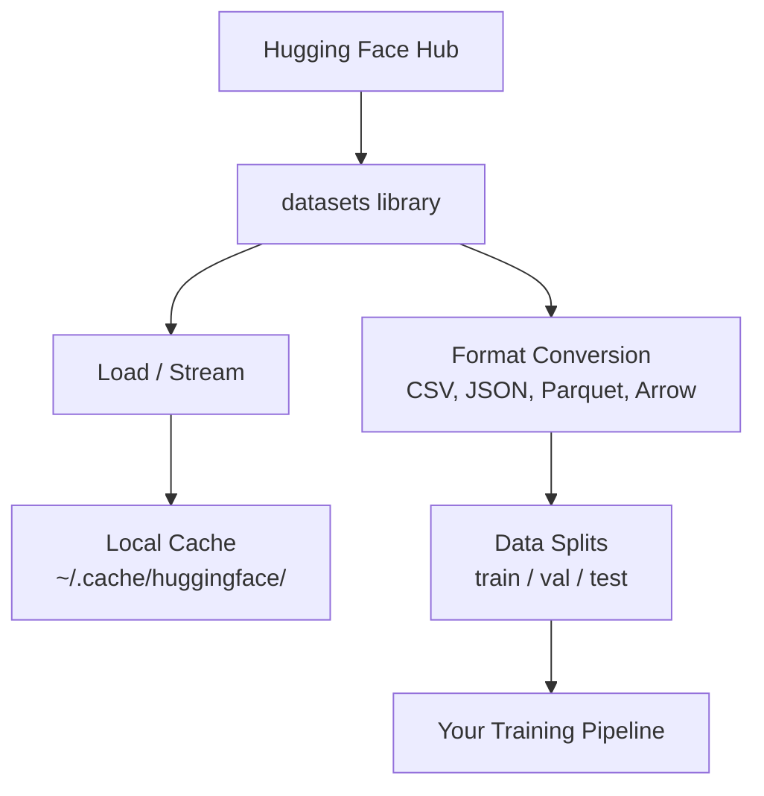

# データ管理

> データは燃料です。管理の仕方が、どれだけ速く進めるかを決めます。

**タイプ:** 作ってみる
**言語:** Python
**前提条件:** フェーズ0、レッスン01
**時間:** 約45分

## 学習目標

- Hugging Faceの `datasets` ライブラリを使ってdatasetをload、stream、cacheする
- CSV、JSON、Parquet、Arrow形式を相互変換し、それぞれのtradeoffを説明する
- 固定random seedを使って、再現可能なtrain/validation/test splitを作成する
- `.gitignore`、Git LFS、DVCを使って、大きなmodel fileやdataset fileを管理する

## 課題

すべてのAIプロジェクトはデータから始まります。datasetを見つけ、downloadし、形式を変換し、trainingとevaluation用に分割し、実験が再現できるようversion管理する必要があります。毎回手作業で行うのは遅く、ミスが起きやすいです。繰り返し使えるworkflowが必要です。

## 考え方



Hugging Faceの `datasets` ライブラリは、AI作業でデータを読み込む標準的な方法です。download、cache、format conversion、streamingを標準で扱います。

## 作ってみる

### ステップ1: datasetsライブラリをインストールする

```bash
pip install datasets huggingface_hub
```

### ステップ2: datasetを読み込む

```python
from datasets import load_dataset

dataset = load_dataset("imdb")
print(dataset)
print(dataset["train"][0])
```

これはIMDB映画レビューdatasetをdownloadします。初回download後は、`~/.cache/huggingface/datasets/` のcacheから読み込まれます。

### ステップ3: 大きなdatasetをstreamする

diskに収まらないdatasetもあります。streamingでは、全体をdownloadせず、行ごとに読み込みます。

```python
dataset = load_dataset("wikimedia/wikipedia", "20220301.en", split="train", streaming=True)

for i, example in enumerate(dataset):
    print(example["title"])
    if i >= 4:
        break
```

streamingは `IterableDataset` を返します。到着した行から処理します。dataset sizeに関係なく、memory usageは一定です。

### ステップ4: dataset形式

`datasets` ライブラリは内部でApache Arrowを使います。pipelineの必要に応じて、他の形式へ変換できます。

```python
dataset = load_dataset("imdb", split="train")

dataset.to_csv("imdb_train.csv")
dataset.to_json("imdb_train.json")
dataset.to_parquet("imdb_train.parquet")
```

形式の比較:

| 形式 | サイズ | 読み込み速度 | 向いている用途 |
|--------|------|-----------|----------|
| CSV | 大きい | 遅い | 人間が読む、spreadsheet |
| JSON | 大きい | 遅い | API、nested data |
| Parquet | 小さい | 速い | 分析、columnar query |
| Arrow | 小さい | 最速 | in-memory processing（`datasets` が内部で使うもの） |

AI作業では、Parquetが最適な保存形式です。memory内で扱う形式はArrowです。CSVとJSONは交換用です。

### ステップ5: Data split

すべてのMLプロジェクトには3つのsplitが必要です。

- **Train**: modelがここから学習する（通常80%）
- **Validation**: training中に進捗を確認する（通常10%）
- **Test**: training完了後の最終評価（通常10%）

最初からsplit済みのdatasetもあります。そうでない場合は自分で分割します。

```python
dataset = load_dataset("imdb", split="train")

split = dataset.train_test_split(test_size=0.2, seed=42)
train_val = split["train"].train_test_split(test_size=0.125, seed=42)

train_ds = train_val["train"]
val_ds = train_val["test"]
test_ds = split["test"]

print(f"Train: {len(train_ds)}, Val: {len(val_ds)}, Test: {len(test_ds)}")
```

再現性のため、必ずseedを設定します。同じseedなら毎回同じsplitが生成されます。

### ステップ6: modelをdownloadしてcacheする

modelは大きなfileです。`huggingface_hub` ライブラリがdownloadとcacheを扱います。

```python
from huggingface_hub import hf_hub_download, snapshot_download

model_path = hf_hub_download(
    repo_id="sentence-transformers/all-MiniLM-L6-v2",
    filename="config.json"
)
print(f"Cached at: {model_path}")

model_dir = snapshot_download("sentence-transformers/all-MiniLM-L6-v2")
print(f"Full model at: {model_dir}")
```

modelは `~/.cache/huggingface/hub/` にcacheされます。一度downloadすれば、次回以降は即座に読み込めます。

### ステップ7: 大きなfileを扱う

model weightや大きなdatasetはgitに入れるべきではありません。選択肢は3つです。

**選択肢A: .gitignore（最も単純）**

```
*.bin
*.safetensors
*.pt
*.onnx
data/*.parquet
data/*.csv
models/
```

**選択肢B: Git LFS（大きなfileをgitで追跡する）**

```bash
git lfs install
git lfs track "*.bin"
git lfs track "*.safetensors"
git add .gitattributes
```

Git LFSはrepo内にpointerを置き、実際のfileは別serverに保存します。GitHubでは1GBまで無料です。

**選択肢C: DVC（data version control）**

```bash
pip install dvc
dvc init
dvc add data/training_set.parquet
git add data/training_set.parquet.dvc data/.gitignore
git commit -m "Track training data with DVC"
```

DVCはdataを指す小さな `.dvc` fileを作ります。data本体はS3、GCS、または別のremote storage backendに置きます。

| 方法 | 複雑さ | 向いている用途 |
|----------|-----------|----------|
| .gitignore | 低 | 個人project、再取得できるdownload済みdata |
| Git LFS | 中 | git経由でmodel weightを共有するteam |
| DVC | 高 | 再現可能な実験、大規模dataset、team |

このコースでは `.gitignore` で十分です。machine間で正確な実験を再現する必要がある場合はDVCを使ってください。

### ステップ8: Storage pattern

**Local storage** は約10GB未満のdatasetに向いています。HF cacheが自動的に扱います。

**Cloud storage** は、それより大きいものやmachine間で共有するものに使います。

```python
import os

local_path = os.path.expanduser("~/.cache/huggingface/datasets/")

# s3_path = "s3://my-bucket/datasets/"
# gcs_path = "gs://my-bucket/datasets/"
```

DVCはS3やGCSと直接統合します。

```bash
dvc remote add -d myremote s3://my-bucket/dvc-store
dvc push
```

このコースではlocal storageで十分です。cloud storageはremote GPU instanceでfine-tuningする時に重要になります。

## このコースで使うDataset

| Dataset | レッスン | サイズ | 学ぶこと |
|---------|---------|------|----------------|
| IMDB | Tokenization、classification | 84 MB | text classificationの基本 |
| WikiText | Language modeling | 181 MB | next-token prediction |
| SQuAD | QA systems | 35 MB | question answering、span |
| Common Crawl（subset） | Embeddings | 変動 | 大規模text processing |
| MNIST | Vision basics | 21 MB | image classificationの基礎 |
| COCO（subset） | Multimodal | 変動 | image-text pair |

今すぐすべてをdownloadする必要はありません。各レッスンが必要なものを指定します。

## 使ってみる

utility scriptを実行して、すべて動くことを確認します。

```bash
python code/data_utils.py
```

これは小さなdatasetをdownloadし、変換し、分割し、summaryを出力します。

## 形にして届ける

このレッスンで作るもの:
- `code/data_utils.py` - 再利用可能なdata loading/cache utility
- `outputs/prompt-data-helper.md` - taskに適したdatasetを見つけるためのprompt

## 演習

1. `mrpc` configで `glue` datasetを読み込み、最初の5例を確認する
2. `c4` datasetをstreamし、10秒で何例処理できるか数える
3. datasetをParquetへ変換し、CSVとのfile sizeを比較する
4. 固定seedで70/15/15のtrain/val/test splitを作成し、sizeを検証する

## 重要用語

| 用語 | よくある言い方 | 実際の意味 |
|------|----------------|----------------------|
| Dataset split | 「training data」 | ML lifecycleの異なる段階で使われる名前付きsubset（train/val/test） |
| Streaming | 「lazyに読み込む」 | dataset全体をdownloadせず、remote sourceから行ごとにdataを処理すること |
| Parquet | 「圧縮CSV」 | analytical queryとstorage efficiencyに最適化されたcolumnar file format |
| Arrow | 「高速dataframe」 | zero-copy readのためにdatasets libraryが内部で使うin-memory columnar format |
| Git LFS | 「大きなfile用Git」 | version control内にpointerを残しつつ、大きなfileをgit repo外に保存する拡張 |
| DVC | 「data用Git」 | cloud storageと統合する、datasetとmodelのversion control system |
| Cache | 「download済み」 | 以前取得したdataのlocal copy。既定では ~/.cache/huggingface/ に保存される |
