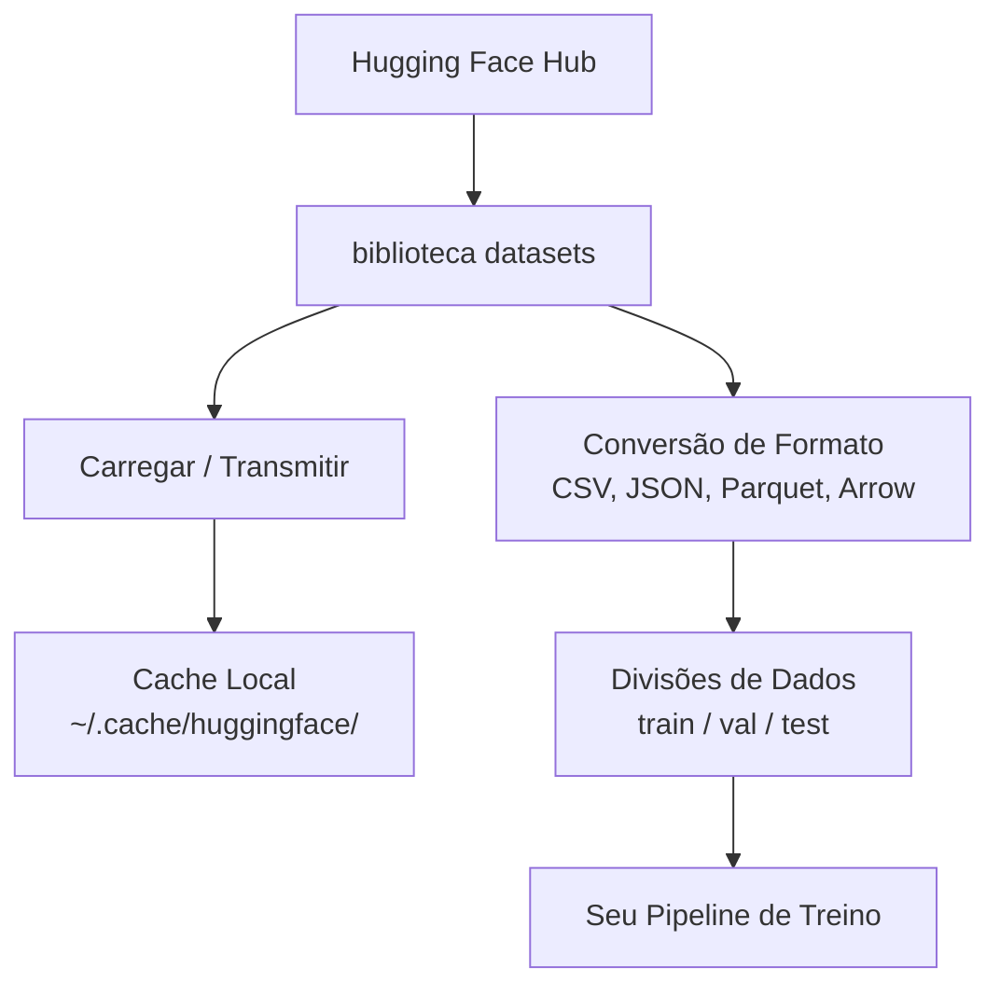

# Gerenciamento de Dados

> Dados são o combustível. Como você os gerencia determina a velocidade que você vai.

**Tipo:** Build
**Linguagens:** Python
**Pré-requisitos:** Fase 0, Aula 01
**Tempo:** ~45 minutos

## Objetivos de Aprendizado

- Carregar, transmitir e armazenar em cache datasets usando a biblioteca `datasets` do Hugging Face
- Converter entre formatos CSV, JSON, Parquet e Arrow e explicar seus tradeoffs
- Criar divisões train/validation/test reproduzíveis com seeds fixas
- Gerenciar arquivos grandes de modelos e datasets usando `.gitignore`, Git LFS ou DVC

## O Problema

Todo projeto de IA começa com dados. Você precisa encontrar datasets, baixá-los, converter entre formatos, dividi-los para treino e avaliação, e versioná-los para que experimentos sejam reproduzíveis. Fazer isso manualmente toda vez é lento e propenso a erros. Você precisa de um fluxo de trabalho repetível.

## O Conceito



A biblioteca `datasets` do Hugging Face é o padrão para carregar dados para trabalho de IA. Ela lida com download, cache, conversão de formato e streaming de forma integrada.

## Construa

### Passo 1: Instale a biblioteca datasets

```bash
pip install datasets huggingface_hub
```

### Passo 2: Carregue um dataset

```python
from datasets import load_dataset

dataset = load_dataset("imdb")
print(dataset)
print(dataset["train"][0])
```

### Passo 3: Transmita datasets grandes

```python
dataset = load_dataset("wikimedia/wikipedia", "20220301.en", split="train", streaming=True)

for i, example in enumerate(dataset):
    print(example["title"])
    if i >= 4:
        break
```

Streaming te dá um `IterableDataset`. Você processa as linhas conforme chegam. Uso de memória se mantém constante independente do tamanho do dataset.

### Passo 4: Formatos de dataset

```python
dataset = load_dataset("imdb", split="train")

dataset.to_csv("imdb_train.csv")
dataset.to_json("imdb_train.json")
dataset.to_parquet("imdb_train.parquet")
```

Comparação de formatos:

| Formato | Tamanho | Velocidade de Leitura | Melhor para |
|---------|---------|----------------------|-------------|
| CSV | Grande | Lento | Legibilidade humana, planilhas |
| JSON | Grande | Lento | APIs, dados aninhados |
| Parquet | Pequeno | Rápido | Análises, consultas colunares |
| Arrow | Pequeno | O mais rápido | Processamento em memória |

Para trabalho de IA, Parquet é o melhor formato de armazenamento. Arrow é o que você usa em memória. CSV e JSON são para intercâmbio.

### Passo 5: Divisões de dados

Todo projeto de ML precisa de três divisões:

- **Train**: O modelo aprende com estes dados (tipicamente 80%)
- **Validation**: Você verifica o progresso durante o treino (tipicamente 10%)
- **Test**: Avaliação final depois que o treino termina (tipicamente 10%)

```python
dataset = load_dataset("imdb", split="train")

split = dataset.train_test_split(test_size=0.2, seed=42)
train_val = split["train"].train_test_split(test_size=0.125, seed=42)

train_ds = train_val["train"]
val_ds = train_val["test"]
test_ds = split["test"]

print(f"Train: {len(train_ds)}, Val: {len(val_ds)}, Test: {len(test_ds)}")
```

Sempre defina uma seed para reproduzibilidade.

### Passo 6: Baixe e armazene modelos em cache

```python
from huggingface_hub import hf_hub_download, snapshot_download

model_path = hf_hub_download(
    repo_id="sentence-transformers/all-MiniLM-L6-v2",
    filename="config.json"
)
print(f"Cacheado em: {model_path}")

model_dir = snapshot_download("sentence-transformers/all-MiniLM-L6-v2")
print(f"Modelo completo em: {model_dir}")
```

### Passo 7: Lide com arquivos grandes

Pesos de modelos e datasets grandes não devem ir pro git. Três opções:

**Opção A: .gitignore (mais simples)**

```
*.bin
*.safetensors
*.pt
*.onnx
data/*.parquet
data/*.csv
models/
```

**Opção B: Git LFS (rastrear arquivos grandes no git)**

```bash
git lfs install
git lfs track "*.bin"
git lfs track "*.safetensors"
git add .gitattributes
```

**Opção C: DVC (controle de versão de dados)**

```bash
pip install dvc
dvc init
dvc add data/training_set.parquet
git add data/training_set.parquet.dvc data/.gitignore
git commit -m "Track training data with DVC"
```

Para este curso, `.gitignore` é suficiente. Use DVC quando precisar reproduzir experimentos exatos entre máquinas.

## Exercícios

1. Carregue o dataset `glue` com a config `mrpc` e inespecificaçãoione os 5 primeiros exemplos
2. Transmita o dataset `c4` e conte quantos exemplos você consegue processar em 10 segundos
3. Converta um dataset para Parquet e compare o tamanho do arquivo com CSV
4. Crie uma divisão 70/15/15 train/val/test com seed fixa e verifique os tamanhos
