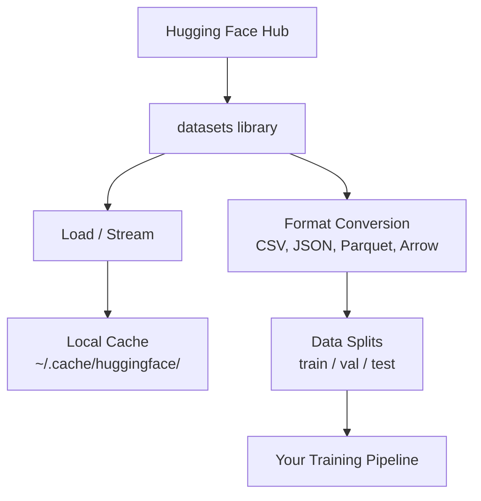

# Veri Yönetimi

> Veri yakıttır. Onu nasıl yönettiğiniz, ne kadar hızlı gideceğinizi belirler.

**Tür:** Yapım
**Dil:** Python
**Önkoşullar:** Aşama 0, Ders 01
**Süre:** ~45 dakika

## Öğrenme Hedefleri

- Hugging Face `datasets` kitaplığını kullanarak dataset'leri yükleyin, yayınlayın ve önbelleğe alın
- CSV, JSON, Parquet ve Arrow formatları arasında dönüştürme yapın ve bunların geçişlerini açıklayın
- Sabit rastgele tohumlarla tekrarlanabilir eğitim/doğrulama/test bölümleri oluşturun
- `.gitignore`, Git LFS veya DVC kullanarak büyük modeli ve dataset dosyalarını yönetin

## Sorun

Her yapay zeka projesi verilerle başlar. dataset'leri bulmanız, indirmeniz, formatlar arasında dönüştürmeniz, eğitim ve değerlendirme için ayırmanız ve deneylerin tekrarlanabilir olmasını sağlayacak şekilde sürümlendirmeniz gerekir. Bunu her seferinde manuel olarak yapmak yavaştır ve hataya açıktır. Tekrarlanabilir bir iş akışına ihtiyacınız var.

## Konsept



Hugging Face `datasets` kitaplığı, yapay zeka çalışması için veri yüklemenin standart yoludur. İndirme, önbelleğe alma, format dönüştürme ve kutudan çıktığı gibi akış işlemlerini gerçekleştirir.

## İnşa Et

### Adım 1: datasets kitaplığını yükleyin

```bash
pip install datasets huggingface_hub
```

### Adım 2: dataset yükleyin

```python
from datasets import load_dataset

dataset = load_dataset("stanfordnlp/imdb")
print(dataset)
print(dataset["train"][0])
```

Bu, IMDB film incelemesi dataset'yi indirir. İlk indirmenin ardından `~/.cache/huggingface/datasets/` adresindeki önbellekten yüklenir.

### 3. Adım: Büyük dataset'leri yayınlayın

Bazı dataset'ler diske sığmayacak kadar büyük. Akış, her şeyi indirmeden bunları satır satır yükler.

```python
dataset = load_dataset("wikimedia/wikipedia", "20220301.en", split="train", streaming=True)

for i, example in enumerate(dataset):
    print(example["title"])
    if i >= 4:
        break
```

Akış size bir `IterableDataset` verir. Satırları geldikçe işlersiniz. Bellek kullanımı dataset boyutundan bağımsız olarak sabit kalır.

### Adım 4: Dataset formatları

`datasets` kitaplığı Apache Arrow'u kullanır. İşlem hattınızın ihtiyacına bağlı olarak diğer formatlara dönüştürebilirsiniz.

```python
dataset = load_dataset("stanfordnlp/imdb", split="train")

dataset.to_csv("imdb_train.csv")
dataset.to_json("imdb_train.json")
dataset.to_parquet("imdb_train.parquet")
```

Biçim karşılaştırması:

| Biçim | Boyut | Okuma Hızı | En İyisi |
|--------|------|-----------|----------|
| CSV | Büyük | Yavaş | İnsan tarafından okunabilirlik, elektronik tablolar |
| JSON | Büyük | Yavaş | API'ler, iç içe geçmiş veriler |
| Parke | Küçük | Hızlı | Analitik, sütunlu sorgular |
| Ok | Küçük | En hızlı | Bellek içi işleme (`datasets`'nin dahili olarak kullandığı şey) |

Yapay zeka çalışmaları için Parke en iyi depolama formatıdır. Ok, hafızanızda üzerinde çalıştığınız şeydir. CSV ve JSON değişim içindir.

### Adım 5: Veri bölmeleri

Her ML projesinin üç bölüme ihtiyacı vardır:

- **Eğitim**: Model bundan ders çıkarır (genellikle %80)
- **Doğrulama**: Eğitim sırasında ilerlemeyi kontrol edersiniz (genellikle %10)
- **Test**: Eğitim tamamlandıktan sonra son değerlendirme (genellikle %10)

Bazı dataset'ler önceden bölünmüş olarak gelir. Yapmadıklarında, onları kendiniz bölün:

```python
dataset = load_dataset("stanfordnlp/imdb", split="train")

split = dataset.train_test_split(test_size=0.2, seed=42)
train_val = split["train"].train_test_split(test_size=0.125, seed=42)

train_ds = train_val["train"]
val_ds = train_val["test"]
test_ds = split["test"]

print(f"Train: {len(train_ds)}, Val: {len(val_ds)}, Test: {len(test_ds)}")
```

Tekrarlanabilirlik için her zaman bir tohum belirleyin. Aynı tohum her seferinde aynı bölünmeyi üretir.

### Adım 6: Modelleri indirin ve önbelleğe alın

Modeller büyük dosyalardır. `huggingface_hub` kitaplığı indirme ve önbelleğe alma işlemlerini gerçekleştirir.

```python
from huggingface_hub import hf_hub_download, snapshot_download

model_path = hf_hub_download(
    repo_id="sentence-transformers/all-MiniLM-L6-v2",
    filename="config.json"
)
print(f"Cached at: {model_path}")

model_dir = snapshot_download("sentence-transformers/all-MiniLM-L6-v2")
print(f"Full model at: {model_dir}")
```

Modeller `~/.cache/huggingface/hub/`'ye önbelleğe alınır. Bir kez indirildikten sonra sonraki çalıştırmalarda anında yüklenirler.

### Adım 7: Büyük dosyaları işleyin

Model ağırlıkları ve büyük dataset'ler git'e girmemelidir. Üç seçenek:

**Seçenek A: .gitignore (en basit)**

```
*.bin
*.safetensors
*.pt
*.onnx
data/*.parquet
data/*.csv
models/
```

**Seçenek B: Git LFS (git'teki büyük dosyaları izleyin)**

```bash
git lfs install
git lfs track "*.bin"
git lfs track "*.safetensors"
git add .gitattributes
```

Git LFS, işaretçileri deponuzda ve gerçek dosyaları ayrı bir sunucuda saklar. GitHub size 1 GB ücretsiz alan sağlar.

**Seçenek C: DVC (veri sürümü kontrolü)**

```bash
pip install dvc
dvc init
dvc add data/training_set.parquet
git add data/training_set.parquet.dvc data/.gitignore
git commit -m "Track training data with DVC"
```

DVC, verilerinize işaret eden küçük `.dvc` dosyaları oluşturur. Verilerin kendisi S3, GCS veya başka bir uzak depolama arka ucunda bulunur.

| Yaklaşım | Karmaşıklık | En İyisi |
|----------|-----------|----------|
| .gitignore | Düşük | Kişisel projeler, indirilen veriler yeniden getirilebilir |
| Git LFS | Orta | Git aracılığıyla model ağırlıklarını paylaşan ekipler |
| DVC | Yüksek | Tekrarlanabilir deneyler, büyük dataset'ler, ekipler |

Bu kurs için `.gitignore` yeterlidir. Makineler arasında tam deneyleri yeniden üretmeniz gerektiğinde DVC'yi kullanın.

### Adım 8: Depolama düzenleri

**Yerel depolama** ~10 GB'nin altındaki dataset'ler için çalışır. HF önbelleği bunu otomatik olarak yönetir.

**Bulut depolama** daha büyük veya makineler arasında paylaşılan her şey içindir:

```python
import os

local_path = os.path.expanduser("~/.cache/huggingface/datasets/")

# s3_path = "s3://my-bucket/datasets/"
# gcs_path = "gs://my-bucket/datasets/"
```

DVC, S3 ve GCS ile doğrudan entegre olur:

```bash
dvc remote add -d myremote s3://my-bucket/dvc-store
dvc push
```

Bu kurs için yerel depolama yeterlidir. Uzak GPU örneklerinde ince ayar yaptığınızda bulut depolama uygun hale gelir.

## Bu Kursta Kullanılan Dataset'ler

| Dataset | Dersler | Boyut | Ne Öğretiyor |
|---------|---------|------|----------------|
| IMDB'si | Tokenleştirme, sınıflandırma | 84MB | Metin sınıflandırmanın temelleri |
| VikiMetin | Dil modelleme | 181 MB | Sonraki-token tahmini |
| TAKIM | Kalite Güvence sistemleri | 35MB | Soru yanıtlama, aralıklar |
| Ortak Tarama (alt küme) | Embedding'ler | Değişir | Büyük ölçekli metin işleme |
| MNİST | Vizyon temelleri | 21 MB | Görüntü sınıflandırmanın temelleri |
| COCO (alt küme) | Çok modlu | Değişir | Resim-metin çiftleri |

Bunların hepsini şimdi indirmenize gerek yok. Her ders neye ihtiyaç duyduğunu belirtir.

## Kullan onu

Her şeyin çalıştığını doğrulamak için yardımcı program komut dosyasını çalıştırın:

```bash
python code/data_utils.py
```

Bu, küçük bir dataset indirir, dönüştürür, böler ve bir özet yazdırır.

## Gönderin

Bu ders şunları üretir:
- `code/data_utils.py` - yeniden kullanılabilir veri yükleme ve önbelleğe alma yardımcı programı
- `outputs/prompt-data-helper.md` - prompt, bir görev için doğru dataset'yi bulmak için

## Egzersizler

1. `glue` dataset'yi `mrpc` yapılandırmasıyla yükleyin ve ilk 5 örneği inceleyin
2. `c4` dataset akışını yapın ve 10 saniyede kaç örnek işleyebileceğinizi sayın
3. dataset dosyasını Parke'ye dönüştürün ve dosya boyutunu CSV ile karşılaştırın
4. Sabit bir tohumla 70/15/15 eğitim/val/test bölümü oluşturun ve boyutları doğrulayın

## Anahtar Terimler

| Dönem | İnsanlar ne diyor | Aslında ne anlama geliyor |
|------|----------------|----------------------|
| Dataset bölünmüş | "Eğitim verileri" | ML yaşam döngüsünün farklı aşamalarında kullanılan adlandırılmış bir alt küme (eğitim/val/test) |
| Akış | "Tembelce yükle" | dataset'nin tamamını indirmeden uzak bir kaynaktan verileri satır satır işlemek |
| Parke | "Sıkıştırılmış CSV" | Analitik sorgular ve depolama verimliliği için optimize edilmiş sütunlu bir dosya formatı |
| Ok | "Hızlı veri çerçevesi" | Sıfır kopyalı okumalar için datasets kitaplığı tarafından dahili olarak kullanılan bellek içi sütunlu format |
| Git LFS | "Büyük dosyalar için Git" | İşaretçileri sürüm kontrolünde tutarken büyük dosyaları git deposunun dışında saklayan bir uzantı |
| DVC | "Veri için Git" | dataset'ler ve modeller için bulut depolamayla entegre olan sürüm kontrol sistemi |
| Önbellek | "Zaten indirildi" | Önceden getirilen verilerin yerel bir kopyası, varsayılan olarak ~/.cache/huggingface/ konumunda saklanır |
