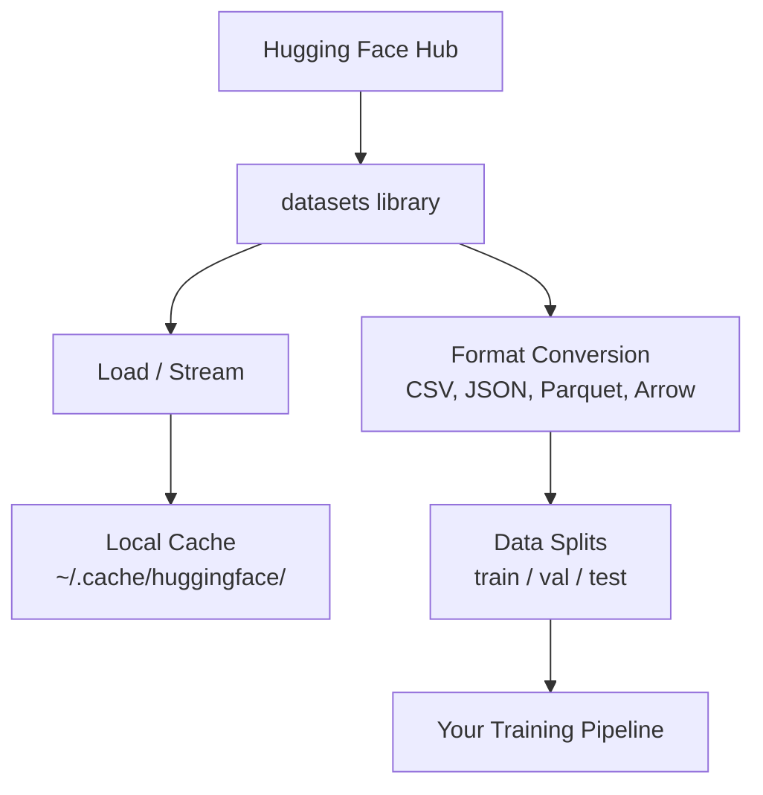

# 09 · 数据管理

> 数据是燃料。你如何管理它，决定了你能跑多快。

**类型：** 实战构建（Build）
**语言：** Python
**前置：** 阶段 0，第 01 课
**时长：** 约 45 分钟

## 学习目标

- 使用 Hugging Face 的 `datasets` 库加载、流式读取并缓存数据集
- 在 CSV、JSON、Parquet 和 Arrow 等格式之间转换，并能解释各自的权衡取舍
- 用固定随机种子创建可复现的训练集/验证集/测试集划分
- 使用 `.gitignore`、Git LFS 或 DVC 管理大型模型与数据集文件

## 问题所在

每个 AI 项目都始于数据。你需要找到数据集、下载它们、在各种格式之间转换、为训练和评估做划分，并对它们进行版本管理，以保证实验可复现。每次都手动做这些事既慢又容易出错。你需要一套可重复执行的工作流。

## 核心概念



Hugging Face 的 `datasets` 库是 AI 工作中加载数据的标准方式。它开箱即用地处理下载、缓存、格式转换和流式读取。

## 动手构建

### 第 1 步：安装 datasets 库

```bash
pip install datasets huggingface_hub
```

### 第 2 步：加载数据集

```python
from datasets import load_dataset

dataset = load_dataset("imdb")
print(dataset)
print(dataset["train"][0])
```

这会下载 IMDB 影评数据集。首次下载之后，它会从位于 `~/.cache/huggingface/datasets/` 的缓存中加载。

### 第 3 步：流式读取大型数据集

有些数据集太大，无法放进磁盘。流式读取（streaming）会逐行加载，而不必下载整个数据集。

```python
dataset = load_dataset("wikimedia/wikipedia", "20220301.en", split="train", streaming=True)

for i, example in enumerate(dataset):
    print(example["title"])
    if i >= 4:
        break
```

流式读取会返回一个 `IterableDataset`。数据行到达时你就逐行处理它们。无论数据集多大，内存占用都保持恒定。

### 第 4 步：数据集格式

`datasets` 库底层使用 Apache Arrow。你可以根据流水线的需要，转换为其他格式。

```python
dataset = load_dataset("imdb", split="train")

dataset.to_csv("imdb_train.csv")
dataset.to_json("imdb_train.json")
dataset.to_parquet("imdb_train.parquet")
```

格式对比：

| 格式 | 体积 | 读取速度 | 最适用于 |
|--------|------|-----------|----------|
| CSV | 大 | 慢 | 人类可读、电子表格 |
| JSON | 大 | 慢 | API、嵌套数据 |
| Parquet | 小 | 快 | 分析、列式查询 |
| Arrow | 小 | 最快 | 内存中处理（`datasets` 内部使用的格式） |

对 AI 工作而言，Parquet 是最佳的存储格式。Arrow 是你在内存中处理时使用的格式。CSV 和 JSON 则用于数据交换。

### 第 5 步：数据划分

每个机器学习项目都需要三种划分：

- **训练集（Train）**：模型从中学习（通常占 80%）
- **验证集（Validation）**：训练过程中你用它检查进展（通常占 10%）
- **测试集（Test）**：训练完成后用于最终评估（通常占 10%）

有些数据集自带划分。当它们没有时，自己来划分：

```python
dataset = load_dataset("imdb", split="train")

split = dataset.train_test_split(test_size=0.2, seed=42)
train_val = split["train"].train_test_split(test_size=0.125, seed=42)

train_ds = train_val["train"]
val_ds = train_val["test"]
test_ds = split["test"]

print(f"Train: {len(train_ds)}, Val: {len(val_ds)}, Test: {len(test_ds)}")
```

始终设置一个种子以保证可复现性。相同的种子每次都会产生相同的划分。

### 第 6 步：下载并缓存模型

模型是大文件。`huggingface_hub` 库负责处理下载和缓存。

```python
from huggingface_hub import hf_hub_download, snapshot_download

model_path = hf_hub_download(
    repo_id="sentence-transformers/all-MiniLM-L6-v2",
    filename="config.json"
)
print(f"Cached at: {model_path}")

model_dir = snapshot_download("sentence-transformers/all-MiniLM-L6-v2")
print(f"Full model at: {model_dir}")
```

模型缓存到 `~/.cache/huggingface/hub/`。一旦下载完成，后续运行时会立即加载。

### 第 7 步：处理大文件

模型权重和大型数据集不应该提交进 git。有三种选择：

**方案 A：.gitignore（最简单）**

```
*.bin
*.safetensors
*.pt
*.onnx
data/*.parquet
data/*.csv
models/
```

**方案 B：Git LFS（在 git 中追踪大文件）**

```bash
git lfs install
git lfs track "*.bin"
git lfs track "*.safetensors"
git add .gitattributes
```

Git LFS 在你的仓库中存储指针，而把实际文件存在另一台独立的服务器上。GitHub 为你提供 1 GB 的免费额度。

**方案 C：DVC（数据版本控制，data version control）**

```bash
pip install dvc
dvc init
dvc add data/training_set.parquet
git add data/training_set.parquet.dvc data/.gitignore
git commit -m "Track training data with DVC"
```

DVC 会创建小巧的 `.dvc` 文件，指向你的数据。数据本身存放在 S3、GCS 或其他远程存储后端中。

| 方案 | 复杂度 | 最适用于 |
|----------|-----------|----------|
| .gitignore | 低 | 个人项目、可重新获取的下载数据 |
| Git LFS | 中 | 团队通过 git 共享模型权重 |
| DVC | 高 | 可复现实验、大型数据集、团队协作 |

就本课程而言，`.gitignore` 已经足够。当你需要在不同机器上复现完全一致的实验时，再使用 DVC。

### 第 8 步：存储模式

**本地存储**适用于约 10 GB 以下的数据集。HF 缓存会自动处理这种情况。

**云存储**用于任何更大的、或需要跨机器共享的数据：

```python
import os

local_path = os.path.expanduser("~/.cache/huggingface/datasets/")

# s3_path = "s3://my-bucket/datasets/"
# gcs_path = "gs://my-bucket/datasets/"
```

DVC 可直接与 S3 和 GCS 集成：

```bash
dvc remote add -d myremote s3://my-bucket/dvc-store
dvc push
```

就本课程而言，本地存储已经足够。当你在远程 GPU 实例上做微调时，云存储才变得相关。

## 本课程使用的数据集

| 数据集 | 课程 | 体积 | 它教会你什么 |
|---------|---------|------|----------------|
| IMDB | 分词、分类 | 84 MB | 文本分类基础 |
| WikiText | 语言建模 | 181 MB | 下一个 token 预测 |
| SQuAD | 问答系统 | 35 MB | 问答、文本片段（span） |
| Common Crawl（子集） | 嵌入（Embeddings） | 不定 | 大规模文本处理 |
| MNIST | 视觉基础 | 21 MB | 图像分类基础 |
| COCO（子集） | 多模态 | 不定 | 图文配对 |

你现在不需要下载所有这些。每一课会指明它所需要的数据集。

## 上手使用

运行这个工具脚本来验证一切正常：

```bash
python code/data_utils.py
```

它会下载一个小数据集、转换它、划分它，并打印一份摘要。

## 交付产出

本课产出：
- `code/data_utils.py` —— 可复用的数据加载与缓存工具
- `outputs/prompt-data-helper.md` —— 用于为某个任务找到合适数据集的提示词

## 练习

1. 加载 `glue` 数据集的 `mrpc` 配置，并查看前 5 个样本
2. 流式读取 `c4` 数据集，统计你在 10 秒内能处理多少个样本
3. 将一个数据集转换为 Parquet，并把文件大小与 CSV 做对比
4. 用固定种子创建一个 70/15/15 的训练集/验证集/测试集划分，并验证各部分的大小

## 关键术语

| 术语 | 人们常说 | 它实际的含义 |
|------|----------------|----------------------|
| 数据集划分（Dataset split） | “训练数据” | 一个命名子集（train/val/test），用于机器学习生命周期的不同阶段 |
| 流式读取（Streaming） | “惰性加载” | 从远程数据源逐行处理数据，而无需下载整个数据集 |
| Parquet | “压缩版 CSV” | 一种为分析查询和存储效率优化的列式文件格式 |
| Arrow | “快速 dataframe” | 一种内存中的列式格式，被 datasets 库内部用于零拷贝读取 |
| Git LFS | “给大文件用的 git” | 一个扩展，把大文件存储在 git 仓库之外，同时在版本控制中保留指针 |
| DVC | “给数据用的 git” | 一个面向数据集和模型的版本控制系统，可与云存储集成 |
| 缓存（Cache） | “已经下载过了” | 之前获取过的数据的本地副本，默认存放在 ~/.cache/huggingface/ |
