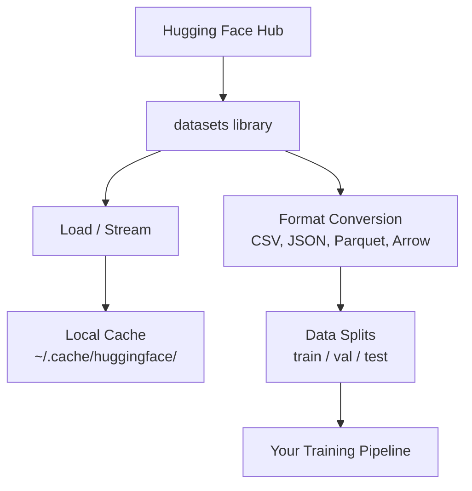

# 数据管理

> 数据是燃料。你如何管理它决定了你走得有多快。

**Type:** Build
**Language:** Python
**Prerequisites:** Phase 0, Lesson 01
**Time:** ~45 minutes

## 学习目标

- 使用Hugging Face“datasets”库加载、流式传输和缓存数据集
- 在CSV、SON、Parquet和Arrow格式之间进行转换并解释它们的权衡
- Create reproducible train/validation/test splits with fixed random seeds
- 使用`.gitignore`、Git LFS或DVC管理大型模型和数据集文件

## 问题

每个人工智能项目都始于数据。您需要找到数据集、下载它们、在格式之间进行转换、将它们拆分以进行训练和评估，并对其进行版本化，以便实验可重复。每次手动执行此操作速度缓慢且容易出错。您需要可重复的工作流程。

## 概念



Hugging Face“数据集”库是为人工智能工作加载数据的标准方式。它处理下载、缓存、格式转换和开箱即用流媒体。

## 建设党

### 第1步：安装数据集库

```bash
pip install datasets huggingface_hub
```

### 第2步：加载数据集

```python
from datasets import load_dataset

dataset = load_dataset("imdb")
print(dataset)
print(dataset["train"][0])
```

This downloads the IMDB movie review dataset. After the first download, it loads from cache at `~/.cache/huggingface/datasets/`.

### 第3步：流式传输大型数据集

某些数据集太大，无法容纳在磁盘上。流媒体逐行加载它们，而无需下载完整内容。

```python
dataset = load_dataset("wikimedia/wikipedia", "20220301.en", split="train", streaming=True)

for i, example in enumerate(dataset):
    print(example["title"])
    if i >= 4:
        break
```

流媒体为您提供“IterableDataset”。您可以在行到达时对其进行处理。无论数据集大小如何，内存使用率都保持不变。

### Step 4: Dataset formats

“数据集”库在引擎盖下使用了Apache Arrow。您可以根据您的管道需要转换为其他格式。

```python
dataset = load_dataset("imdb", split="train")

dataset.to_csv("imdb_train.csv")
dataset.to_json("imdb_train.json")
dataset.to_parquet("imdb_train.parquet")
```

格式比较：

| 格式 | 大小 | 读取速度 | 最适合 |
|--------|------|-----------|----------|
| CSV | 大 | 慢 | 人类可读性、电子表格 |
| JSON | 大 | 慢 | API、嵌套数据 |
| Parquet | Small | 快速 | 分析、列式查询 |
| 箭头 | Small | 最快 | 内存内处理（“数据集”内部使用的内容） |

对于人工智能工作来说，Parquet是最好的存储格式。箭头是您在内存中使用的内容。CSV和SON用于交换。

### 第5步：数据拆分

每个ML项目都需要三个拆分：

- **Train**：模型从中学习（通常为80%）
- ** 验证 **：您在培训期间检查进度（通常为10%）
- ** 测试 **：培训完成后的最终评估（通常为10%）

一些数据集是预先拆分的。当它们不这样做时，请自己分割：

```python
dataset = load_dataset("imdb", split="train")

split = dataset.train_test_split(test_size=0.2, seed=42)
train_val = split["train"].train_test_split(test_size=0.125, seed=42)

train_ds = train_val["train"]
val_ds = train_val["test"]
test_ds = split["test"]

print(f"Train: {len(train_ds)}, Val: {len(val_ds)}, Test: {len(test_ds)}")
```

Always set a seed for reproducibility. The same seed produces the same split every time.

### 第6步：下载并缓存模型

模型是大文件。“huggingface_hub”库处理下载和缓存。

```python
from huggingface_hub import hf_hub_download, snapshot_download

model_path = hf_hub_download(
    repo_id="sentence-transformers/all-MiniLM-L6-v2",
    filename="config.json"
)
print(f"Cached at: {model_path}")

model_dir = snapshot_download("sentence-transformers/all-MiniLM-L6-v2")
print(f"Full model at: {model_dir}")
```

模型缓存到'~/.缓存/huggingface/hub/'。下载后，它们将在后续运行中立即加载。

### 第7步：处理大文件

模型权重和大型数据集不应该进入git。三种选择：

**Option A: .gitignore (simplest)**

```
*.bin
*.safetensors
*.pt
*.onnx
data/*.parquet
data/*.csv
models/
```

** 选项B：Git LFS（跟踪git中的大文件）**

```bash
git lfs install
git lfs track "*.bin"
git lfs track "*.safetensors"
git add .gitattributes
```

Git LFS将指针存储在您的仓库中，并将实际文件存储在单独的服务器上。GitHub为您免费提供1 GB。

** 选项C：DVC（数据版本控制）**

```bash
pip install dvc
dvc init
dvc add data/training_set.parquet
git add data/training_set.parquet.dvc data/.gitignore
git commit -m "Track training data with DVC"
```

DVC创建指向您的数据的小“.dvc”文件。数据本身存在于S3、GSK或其他远程存储后台中。

| 方法 | 复杂性 | Best For |
|----------|-----------|----------|
| .gitignore | 低 | 个人项目、您可以重新获取的下载数据 |
| Git LFS | Medium | 团队通过git共享模型权重 |
| DVC | 高 | Reproducible experiments, large datasets, teams |

For this course, `.gitignore` is enough. Use DVC when you need to reproduce exact experiments across machines.

### 第8步：存储模式

** 本地存储 ** 适用于~10 GB以下的数据集。HF缓存会自动处理此问题。

**Cloud storage** is for anything larger or shared across machines:

```python
import os

local_path = os.path.expanduser("~/.cache/huggingface/datasets/")

# s3_path = "s3://my-bucket/datasets/"
# gcs_path = "gs://my-bucket/datasets/"
```

DVC integrates with S3 and GCS directly:

```bash
dvc remote add -d myremote s3://my-bucket/dvc-store
dvc push
```

对于本课程，本地存储就足够了。当您对远程GPU实例进行微调时，云存储变得非常重要。

## 本课程中使用的数据集

| 数据集 | 教训 | 大小 | 它教会了什么 |
|---------|---------|------|----------------|
| IMDB | Tokenization, classification | 84 MB | 文本分类基础知识 |
| WikiText | Language modeling | 181 MB | 下一个代币预测 |
| 小队 | QA systems | 35 MB | 问答，跨越 |
| 常见爬行（子集） | Embeddings | Varies | 大规模文本处理 |
| MNIST | Vision basics | 21 MB | Image classification fundamentals |
| COCO（子集） | 多式 | Varies | Image-text pairs |

You do not need to download all of these now. Each lesson specifies what it needs.

## 使用它

运行实用程序脚本以验证一切正常运行：

```bash
python code/data_utils.py
```

这会下载一个小数据集，对其进行转换、拆分并打印摘要。

## Ship It

本课产生：
- ' code/data_utils.py '-可重复使用的数据加载和缓存实用程序
- `outputs/prompt-data-helper.md` - prompt for finding the right dataset for a task

## Exercises

1. 使用`mrpc`配置加载`glue`数据集并检查前5个示例
2. 流式传输“c4”数据集并计算10秒内可以处理多少个示例
3. 将数据集转换为Parquet并将文件大小与CSV进行比较
4. Create a 70/15/15 train/val/test split with a fixed seed and verify the sizes

## Key Terms

| Term | 别人怎么说 | 它实际上意味着什么 |
|------|----------------|----------------------|
| Dataset split | “训练数据” | 在ML生命周期的不同阶段使用的命名子集（train/val/Test） |
| 流 | "Load it lazily" | 从远程源逐行处理数据，而无需下载完整数据集 |
| 镶木 | “压缩CSV” | A columnar file format optimized for analytical queries and storage efficiency |
| 箭头 | “快速摇篮” | 数据集库内部使用的内存内列格式用于零副本读取 |
| Git LFS | “Git for Big File” | 一个扩展，将大文件存储在git repo之外，同时将指针保留在版本控制中 |
| DVC | "Git for data" | 与云存储集成的数据集和模型版本控制系统 |
| 缓存 | “已下载” | A local copy of previously fetched data, stored at ~/.cache/huggingface/ by default |
