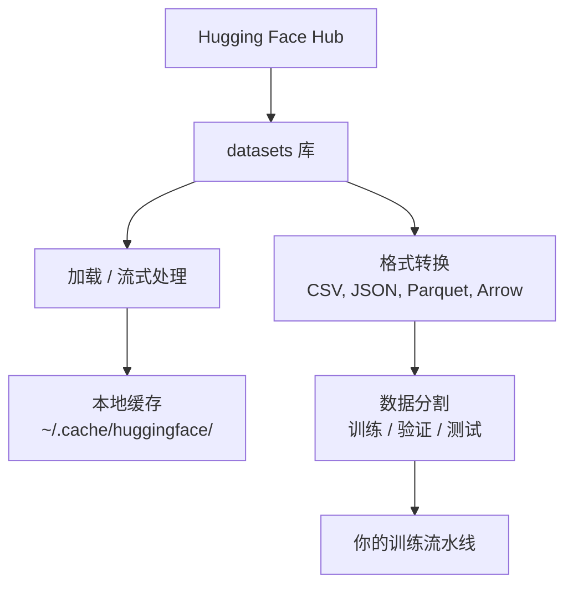

# 数据管理

> 数据是燃料。如何管理它决定了你能跑多快。

**类型：** 构建
**语言：** Python
**前置条件：** 阶段 0，第 01 课
**时间：** 约 45 分钟

## 学习目标

- 使用 Hugging Face `datasets` 库加载、流式处理和缓存数据集
- 在 CSV、JSON、Parquet 和 Arrow 格式之间转换，并解释它们的权衡
- 使用固定随机种子创建可复现的训练/验证/测试分割
- 使用 `.gitignore`、Git LFS 或 DVC 管理大型模型和数据集文件

## 问题

每个 AI 项目都从数据开始。你需要找到数据集、下载它们、转换格式、分割用于训练和评估，并进行版本管理，以便实验可复现。每次都手动完成这些工作既慢又容易出错。你需要一个可重复的工作流程。

## 概念



Hugging Face `datasets` 库是加载 AI 工作数据的标准方式。它开箱即用地处理下载、缓存、格式转换和流式处理。

## 动手构建

### 第 1 步：安装 datasets 库

```bash
pip install datasets huggingface_hub
```

### 第 2 步：加载一个数据集

```python
from datasets import load_dataset

dataset = load_dataset("imdb")
print(dataset)
print(dataset["train"][0])
```

这会下载 IMDB 电影评论数据集。首次下载后，它会从 `~/.cache/huggingface/datasets/` 的缓存中加载。

### 第 3 步：流式处理大型数据集

某些数据集太大，无法放在磁盘上。流式处理逐行加载它们，而无需下载完整内容。

```python
dataset = load_dataset("wikimedia/wikipedia", "20220301.en", split="train", streaming=True)

for i, example in enumerate(dataset):
    print(example["title"])
    if i >= 4:
        break
```

流式处理会返回一个 `IterableDataset`。你可以在数据到达时逐行处理。无论数据集大小如何，内存使用量保持不变。

### 第 4 步：数据集格式

`datasets` 库底层使用 Apache Arrow。你可以根据流水线需要转换为其他格式。

```python
dataset = load_dataset("imdb", split="train")

dataset.to_csv("imdb_train.csv")
dataset.to_json("imdb_train.json")
dataset.to_parquet("imdb_train.parquet")
```

格式对比：

| 格式   | 大小     | 读取速度 | 最佳用途                     |
|--------|----------|----------|------------------------------|
| CSV    | 大       | 慢       | 人类可读性，电子表格         |
| JSON   | 大       | 慢       | API，嵌套数据                |
| Parquet | 小      | 快       | 分析，列式查询               |
| Arrow  | 小       | 最快     | 内存处理（`datasets` 内部使用） |

对于 AI 工作，Parquet 是最佳的存储格式。Arrow 是你在内存中处理时使用的格式。CSV 和 JSON 用于数据交换。

### 第 5 步：数据分割

每个机器学习项目都需要三个分割：

- **训练（Train）**：模型从中学习（通常 80%）
- **验证（Validation）**：你在训练过程中检查进度（通常 10%）
- **测试（Test）**：训练完成后进行最终评估（通常 10%）

有些数据集已经预分割好了。如果没有，你需要自己分割：

```python
dataset = load_dataset("imdb", split="train")

split = dataset.train_test_split(test_size=0.2, seed=42)
train_val = split["train"].train_test_split(test_size=0.125, seed=42)

train_ds = train_val["train"]
val_ds = train_val["test"]
test_ds = split["test"]

print(f"训练集: {len(train_ds)}, 验证集: {len(val_ds)}, 测试集: {len(test_ds)}")
```

始终设置随机种子以确保可复现性。相同的种子每次产生相同的分割。

### 第 6 步：下载和缓存模型

模型是大型文件。`huggingface_hub` 库负责处理下载和缓存。

```python
from huggingface_hub import hf_hub_download, snapshot_download

model_path = hf_hub_download(
    repo_id="sentence-transformers/all-MiniLM-L6-v2",
    filename="config.json"
)
print(f"缓存位置: {model_path}")

model_dir = snapshot_download("sentence-transformers/all-MiniLM-L6-v2")
print(f"完整模型位置: {model_dir}")
```

模型缓存到 `~/.cache/huggingface/hub/`。一旦下载，后续运行会立即加载。

### 第 7 步：处理大型文件

模型权重和大型数据集不应放入 git。有三种选择：

**选项 A：.gitignore（最简单）**

```
*.bin
*.safetensors
*.pt
*.onnx
data/*.parquet
data/*.csv
models/
```

**选项 B：Git LFS（在 git 中跟踪大型文件）**

```bash
git lfs install
git lfs track "*.bin"
git lfs track "*.safetensors"
git add .gitattributes
```

Git LFS 在你的仓库中存储指针，实际文件存储在单独的服务器上。GitHub 提供 1 GB 免费空间。

**选项 C：DVC（数据版本控制）**

```bash
pip install dvc
dvc init
dvc add data/training_set.parquet
git add data/training_set.parquet.dvc data/.gitignore
git commit -m "使用 DVC 跟踪训练数据"
```

DVC 创建指向数据的 `.dvc` 小文件。数据本身存储在 S3、GCS 或其他远程存储后端。

| 方法       | 复杂度 | 最佳用途                                 |
|------------|--------|------------------------------------------|
| .gitignore | 低     | 个人项目，可以重新获取的已下载数据       |
| Git LFS    | 中     | 团队通过 git 共享模型权重               |
| DVC        | 高     | 可复现的实验，大型数据集，团队协作       |

在本课程中，`.gitignore` 足够了。当你需要在多台机器之间复现精确实验时，使用 DVC。

### 第 8 步：存储模式

**本地存储** 适用于约 10 GB 以下的数据集。HF 缓存自动处理。

**云存储** 适用于更大的数据集或跨机器共享：

```python
import os

local_path = os.path.expanduser("~/.cache/huggingface/datasets/")

# s3_path = "s3://my-bucket/datasets/"
# gcs_path = "gs://my-bucket/datasets/"
```

DVC 直接与 S3 和 GCS 集成：

```bash
dvc remote add -d myremote s3://my-bucket/dvc-store
dvc push
```

在本课程中，本地存储就足够了。当你在远程 GPU 实例上微调模型时，云存储会变得相关。

## 本课程使用的数据集

| 数据集                      | 课程                         | 大小   | 讲授内容                     |
|----------------------------|------------------------------|--------|------------------------------|
| IMDB                       | 分词，分类                   | 84 MB  | 文本分类基础                 |
| WikiText                   | 语言模型                     | 181 MB | 下一个词预测                 |
| SQuAD                      | 问答系统                     | 35 MB  | 问答，跨度                   |
| Common Crawl（子集）       | 嵌入                         | 不等   | 大规模文本处理               |
| MNIST                      | 视觉基础                     | 21 MB  | 图像分类基础                 |
| COCO（子集）               | 多模态                       | 不等   | 图像-文本对                 |

你现在不需要全部下载。每节课会指定需要哪些数据集。

## 使用它

运行工具脚本以验证一切正常：

```bash
python code/data_utils.py
```

这将下载一个小型数据集，转换它，分割它，并打印摘要。

## 交付物

本课产出：
- `code/data_utils.py` - 可复用的数据加载和缓存工具
- `outputs/prompt-data-helper.md` - 用于为任务查找合适数据集的提示词

## 练习

1. 加载 `glue` 数据集（`mrpc` 配置）并检查前 5 个示例
2. 流式处理 `c4` 数据集，并计算在 10 秒内能处理多少个示例
3. 将一个数据集转换为 Parquet，并与 CSV 比较文件大小
4. 使用固定随机种子创建 70/15/15 的训练/验证/测试分割，并验证大小

## 关键术语

| 术语       | 大家说的               | 实际含义                                                     |
|------------|------------------------|--------------------------------------------------------------|
| 数据集分割 | "训练数据"             | 一个命名的子集（训练/验证/测试），在机器学习生命周期的不同阶段使用 |
| 流式处理   | "懒加载"               | 从远程源逐行处理数据，无需下载整个数据集                     |
| Parquet    | "压缩版 CSV"           | 一种列式文件格式，针对分析查询和存储效率进行了优化           |
| Arrow      | "快速数据框"           | 一种内存列式格式，被 datasets 库内部用于零拷贝读取           |
| Git LFS    | "用于大文件的 Git"     | 一种扩展，将大文件存储在 git 仓库之外，同时保留版本控制中的指针 |
| DVC        | "用于数据的 Git"       | 一种数据集的版本控制系统，与云存储集成                       |
| 缓存       | "已经下载过了"         | 之前获取的数据的本地副本，默认存储在 `~/.cache/huggingface/` |