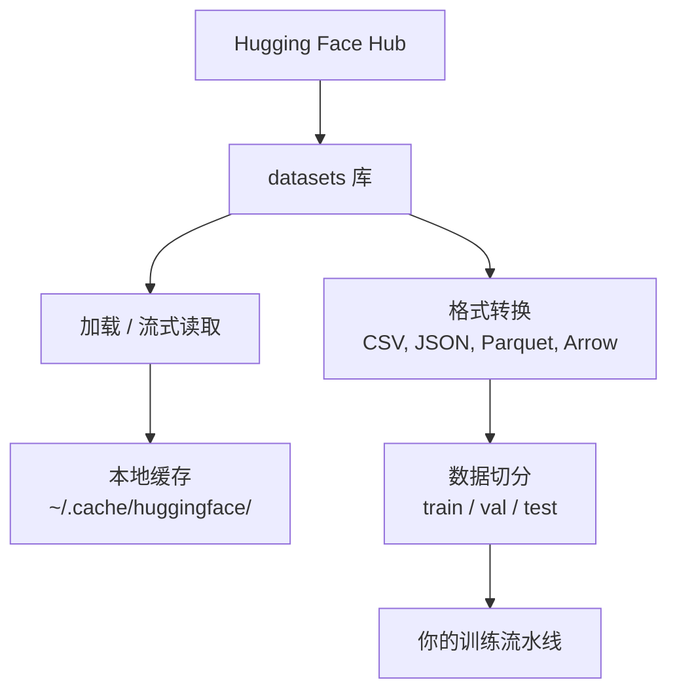

# 数据管理（Data Management）

> 译注：本文译自同目录 [`en.md`](./en.md)。术语遵循仓根 [TRANSLATION_GUIDE.md](../../../../TRANSLATION_GUIDE.md)。

> 数据是燃料。你怎么管理它，决定了你能跑多快。

**Type:** Build
**Language:** Python
**Prerequisites:** Phase 0, Lesson 01
**Time:** ~45 minutes

## 学习目标（Learning Objectives）

- 用 Hugging Face `datasets` 库加载、流式读取并缓存数据集（dataset）
- 在 CSV、JSON、Parquet、Arrow 几种格式之间互转，并讲清各自的取舍
- 用固定随机种子做出可复现的 train / validation / test 划分
- 用 `.gitignore`、Git LFS 或 DVC 管理大体积的模型与数据集文件

## 问题（The Problem）

每个 AI 项目都从数据开始。你需要找数据集、下载、在格式之间转换、切分出训练与评估集、再做版本管理，让实验可复现。每次都手动来一遍，又慢又容易出错。你需要一套可以反复用的工作流。

## 概念（The Concept）



Hugging Face 的 `datasets` 库是 AI 工作里加载数据的标准方式。下载、缓存、格式转换、流式读取，开箱即用。

## 动手实现（Build It）

### Step 1: 安装 datasets 库

```bash
pip install datasets huggingface_hub
```

### Step 2: 加载一个数据集

```python
from datasets import load_dataset

dataset = load_dataset("imdb")
print(dataset)
print(dataset["train"][0])
```

这会下载 IMDB 影评数据集。第一次下载完之后，后续都从 `~/.cache/huggingface/datasets/` 的本地缓存（cache）读取。

### Step 3: 流式读取大数据集

有些数据集大到根本放不下磁盘。流式（streaming）模式逐行加载，不必下载完整文件。

```python
dataset = load_dataset("wikimedia/wikipedia", "20220301.en", split="train", streaming=True)

for i, example in enumerate(dataset):
    print(example["title"])
    if i >= 4:
        break
```

流式给你的是一个 `IterableDataset`。数据来一行你处理一行，内存占用与数据集大小无关，恒定不变。

### Step 4: 数据集格式

`datasets` 库底层用的是 Apache Arrow。你可以根据流水线（pipeline）需要转成其他格式。

```python
dataset = load_dataset("imdb", split="train")

dataset.to_csv("imdb_train.csv")
dataset.to_json("imdb_train.json")
dataset.to_parquet("imdb_train.parquet")
```

格式对比：

| 格式 | 体积 | 读取速度 | 适用场景 |
|--------|------|-----------|----------|
| CSV | 大 | 慢 | 人类可读、电子表格 |
| JSON | 大 | 慢 | API、嵌套数据 |
| Parquet | 小 | 快 | 分析查询、列式查询 |
| Arrow | 小 | 最快 | 内存中处理（`datasets` 内部就是用它） |

做 AI 工作时，Parquet 是最好的存储格式。Arrow 是你在内存里实际操作的格式。CSV 和 JSON 用于交换。

### Step 5: 数据划分

每个 ML 项目都要切三份：

- **Train**：模型从这里学（一般 80%）
- **Validation**：训练过程中用来看进度（一般 10%）
- **Test**：训练全部结束后做最终评估（evaluation）（一般 10%）

有些数据集本身就预切好了。没切好的就自己切：

```python
dataset = load_dataset("imdb", split="train")

split = dataset.train_test_split(test_size=0.2, seed=42)
train_val = split["train"].train_test_split(test_size=0.125, seed=42)

train_ds = train_val["train"]
val_ds = train_val["test"]
test_ds = split["test"]

print(f"Train: {len(train_ds)}, Val: {len(val_ds)}, Test: {len(test_ds)}")
```

一定要设种子（seed），保证可复现。同一个种子每次切出的划分都一模一样。

### Step 6: 下载并缓存模型

模型是大文件。`huggingface_hub` 库负责下载和缓存。

```python
from huggingface_hub import hf_hub_download, snapshot_download

model_path = hf_hub_download(
    repo_id="sentence-transformers/all-MiniLM-L6-v2",
    filename="config.json"
)
print(f"Cached at: {model_path}")

model_dir = snapshot_download("sentence-transformers/all-MiniLM-L6-v2")
print(f"Full model at: {model_dir}")
```

模型缓存在 `~/.cache/huggingface/hub/`。下载过一次之后，后续运行都是秒加载。

### Step 7: 处理大文件

模型权重和大体积数据集不要进 git。三个选项：

**Option A: .gitignore（最简单）**

```
*.bin
*.safetensors
*.pt
*.onnx
data/*.parquet
data/*.csv
models/
```

**Option B: Git LFS（用 git 跟踪大文件）**

```bash
git lfs install
git lfs track "*.bin"
git lfs track "*.safetensors"
git add .gitattributes
```

Git LFS 在你的仓库里只存指针，真实文件放在一个单独的服务器上。GitHub 给你 1 GB 免费额度。

**Option C: DVC（data version control，数据版本控制）**

```bash
pip install dvc
dvc init
dvc add data/training_set.parquet
git add data/training_set.parquet.dvc data/.gitignore
git commit -m "Track training data with DVC"
```

DVC 会生成体积很小的 `.dvc` 文件来指向你的数据。真正的数据放在 S3、GCS 或其他远端存储后端。

| 方案 | 复杂度 | 适用场景 |
|----------|-----------|----------|
| .gitignore | 低 | 个人项目、可以重新抓取的下载数据 |
| Git LFS | 中 | 团队需要通过 git 共享模型权重 |
| DVC | 高 | 可复现实验、大数据集、团队协作 |

本课程里 `.gitignore` 就够用了。当你需要在多台机器之间精确复现实验时，再上 DVC。

### Step 8: 存储模式

**本地存储**适合 ~10 GB 以下的数据集。HF 的缓存会自动搞定。

**云存储**用于更大的数据集，或者要在多台机器间共享：

```python
import os

local_path = os.path.expanduser("~/.cache/huggingface/datasets/")

# s3_path = "s3://my-bucket/datasets/"
# gcs_path = "gs://my-bucket/datasets/"
```

DVC 直接和 S3 / GCS 集成：

```bash
dvc remote add -d myremote s3://my-bucket/dvc-store
dvc push
```

本课程用本地存储足够。等你要在远端 GPU 实例上做 fine-tune（微调）时，云存储才会变得重要起来。

## 课程用到的数据集（Datasets Used in This Course）

| 数据集 | 用于哪些课 | 体积 | 教什么 |
|---------|---------|------|----------------|
| IMDB | tokenization、分类 | 84 MB | 文本分类基础 |
| WikiText | 语言建模 | 181 MB | next-token 预测 |
| SQuAD | QA 系统 | 35 MB | 问答、span 标注 |
| Common Crawl（子集） | embeddings | 不定 | 大规模文本处理 |
| MNIST | 视觉基础 | 21 MB | 图像分类基础 |
| COCO（子集） | 多模态 | 不定 | 图文配对 |

现在不需要全下下来。每节课会指定它要用的数据集。

## 用起来（Use It）

跑一下工具脚本，确认一切就绪：

```bash
python code/data_utils.py
```

它会下载一个小数据集，做格式转换、切分，并打印一个摘要。

## 上线部署（Ship It）

本节课产出：
- `code/data_utils.py` — 可复用的数据加载与缓存工具
- `outputs/prompt-data-helper.md` — 用来为某个任务找到合适数据集的 prompt

## 练习（Exercises）

1. 加载 `glue` 数据集的 `mrpc` 配置，查看前 5 条样例
2. 流式读取 `c4` 数据集，数一下 10 秒能处理多少条样例
3. 把一个数据集转成 Parquet，比较一下它和 CSV 的文件体积
4. 用固定 seed 做一个 70/15/15 的 train/val/test 划分，验证三份的大小

## 关键术语（Key Terms）

| 术语 | 大家会怎么说 | 它实际指什么 |
|------|----------------|----------------------|
| Dataset split | "训练数据" | 一个有名字的子集（train/val/test），在 ML 生命周期的不同阶段使用 |
| Streaming | "懒加载" | 从远端按行处理数据，不必下载整个数据集 |
| Parquet | "压缩版 CSV" | 一种列式文件格式，针对分析查询和存储效率做了优化 |
| Arrow | "高速 dataframe" | 一种内存里的列式格式，`datasets` 库在内部用它实现零拷贝读取 |
| Git LFS | "处理大文件的 git" | 一个扩展，把大文件存在 git 仓库之外，仓内只放指针 |
| DVC | "处理数据的 git" | 一个面向数据集和模型的版本控制系统，与云存储集成 |
| Cache | "已经下载过了" | 之前抓取过的数据的本地副本，默认放在 `~/.cache/huggingface/` |
