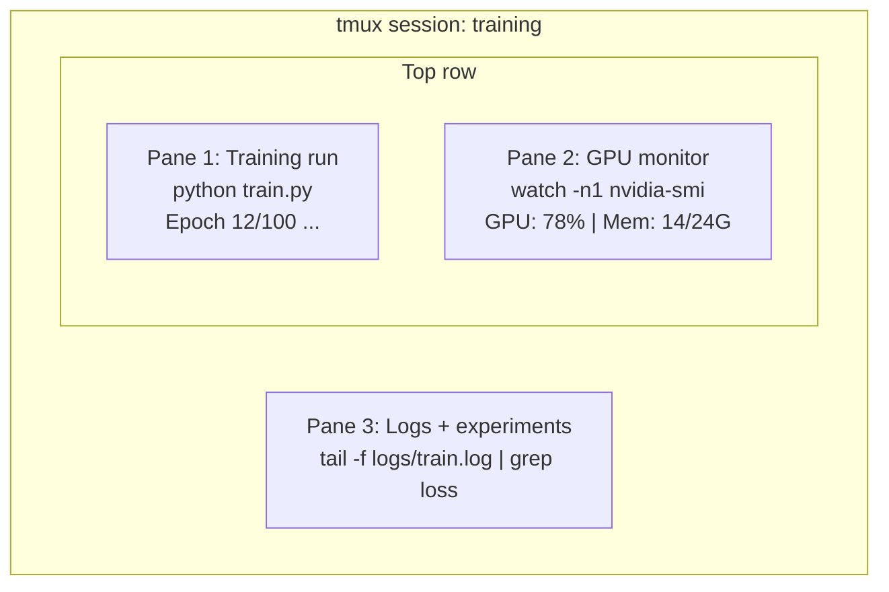

# TerminalとShell

> terminalはAIエンジニアが暮らす場所です。ここに慣れてください。

**タイプ:** 学習
**言語:** --
**前提条件:** フェーズ0、レッスン01
**時間:** 約35分

## 学習目標

- pipe、redirect、`grep` を使って、command lineからtraining logをfilter・processする
- 複数paneを持つ永続的なtmux sessionを作り、trainingとGPU monitoringを並行して行う
- `htop`、`nvtop`、`nvidia-smi` でsystem resourceとGPU resourceを監視する
- SSH、`scp`、`rsync` を使ってlocal machineとremote machineの間でfileを転送する

## 課題

あなたはどのエディタよりもterminalで多くの時間を過ごします。training run、GPU monitoring、log tailing、remote SSH session、environment management。すべてのAI workflowがshellに触れます。ここで遅ければ、すべてが遅くなります。

このレッスンでは、AI作業に重要なterminal skillだけを扱います。Unixの歴史は扱いません。Bash scriptingの深掘りもしません。必要なものだけです。

## 考え方



3つのものが同時に動いています。terminalは1つです。detachして帰宅し、SSHで戻ってreattachできます。trainingは動き続けます。

## 作ってみる

### ステップ1: 自分のshellを知る

実行中のshellを確認します。

```bash
echo $SHELL
```

ほとんどのsystemでは `bash` または `zsh` です。どちらでも問題ありません。このコースのcommandはどちらでも動きます。

知っておくべき基本:

```bash
# Move around
cd ~/projects/ai-engineering-from-scratch
pwd
ls -la

# History search (most useful shortcut you'll learn)
# Ctrl+R then type part of a previous command
# Press Ctrl+R again to cycle through matches

# Clear terminal
clear   # or Ctrl+L

# Cancel a running command
# Ctrl+C

# Suspend a running command (resume with fg)
# Ctrl+Z
```

### ステップ2: pipeとredirect

pipeはcommand同士をつなぎます。logを処理し、outputをfilterし、toolをchainする方法です。これは頻繁に使います。

```bash
# Count how many times "loss" appears in a log
cat train.log | grep "loss" | wc -l

# Extract just the loss values from training output
grep "loss:" train.log | awk '{print $NF}' > losses.txt

# Watch a log file update in real time, filtering for errors
tail -f train.log | grep --line-buffered "ERROR"

# Sort experiments by final accuracy
grep "final_accuracy" results/*.log | sort -t= -k2 -n -r

# Redirect stdout and stderr to separate files
python train.py > output.log 2> errors.log

# Redirect both to the same file
python train.py > train_full.log 2>&1
```

必要なredirectは次の通りです。

| 記号 | 動作 |
|--------|-------------|
| `>` | stdoutをfileへ書く（上書き） |
| `>>` | stdoutをfileへ追記する |
| `2>` | stderrをfileへ書く |
| `2>&1` | stderrをstdoutと同じ場所へ送る |
| `\|` | あるcommandのstdoutを次のcommandのstdinへ送る |

### ステップ3: background process

training runは何時間もかかります。terminalをずっと開いておきたくはありません。

```bash
# Run in background (output still goes to terminal)
python train.py &

# Run in background, immune to hangup (closing terminal won't kill it)
nohup python train.py > train.log 2>&1 &

# Check what's running in background
jobs
ps aux | grep train.py

# Bring a background job to foreground
fg %1

# Kill a background process
kill %1
# or find its PID and kill that
kill $(pgrep -f "train.py")
```

`&`、`nohup`、`screen`/`tmux` の違い:

| 方法 | terminalを閉じても残るか | reattachできるか |
|--------|-------------------------|---------------|
| `command &` | いいえ | いいえ |
| `nohup command &` | はい | いいえ（log fileを確認） |
| `screen` / `tmux` | はい | はい |

数分を超えるものにはtmuxを使います。

### ステップ4: tmux

tmuxを使うと、複数paneを持つ永続terminal sessionを作成できます。training runを管理するうえで最も有用なtoolです。

```bash
# Install
# macOS
brew install tmux
# Ubuntu
sudo apt install tmux

# Start a named session
tmux new -s training

# Split horizontally
# Ctrl+B then "

# Split vertically
# Ctrl+B then %

# Navigate between panes
# Ctrl+B then arrow keys

# Detach (session keeps running)
# Ctrl+B then d

# Reattach
tmux attach -t training

# List sessions
tmux ls

# Kill a session
tmux kill-session -t training
```

典型的なAI workflow session:

```bash
tmux new -s train

# Pane 1: start training
python train.py --epochs 100 --lr 1e-4

# Ctrl+B, " to split, then run GPU monitor
watch -n1 nvidia-smi

# Ctrl+B, % to split vertically, tail the logs
tail -f logs/experiment.log

# Now detach with Ctrl+B, d
# SSH out, go get coffee, come back
# tmux attach -t train
```

### ステップ5: htopとnvtopで監視する

```bash
# System processes (better than top)
htop

# GPU processes (if you have NVIDIA GPU)
# Install: sudo apt install nvtop (Ubuntu) or brew install nvtop (macOS)
nvtop

# Quick GPU check without nvtop
nvidia-smi

# Watch GPU usage update every second
watch -n1 nvidia-smi

# See which processes are using the GPU
nvidia-smi --query-compute-apps=pid,name,used_memory --format=csv
```

よく使う `htop` keybinding:
- `F6` または `>` でcolumn sort（memory leakを探すにはmemoryでsort）
- `F5` でtree viewを切り替える（child processを見る）
- `F9` でprocessをkillする
- `/` でprocess nameを検索する

### ステップ6: remote GPU box用SSH

cloud GPU（Lambda、RunPod、Vast.ai）を借りる時はSSHで接続します。

```bash
# Basic connection
ssh user@gpu-box-ip

# With a specific key
ssh -i ~/.ssh/my_gpu_key user@gpu-box-ip

# Copy files to remote
scp model.pt user@gpu-box-ip:~/models/

# Copy files from remote
scp user@gpu-box-ip:~/results/metrics.json ./

# Sync a whole directory (faster for many files)
rsync -avz ./data/ user@gpu-box-ip:~/data/

# Port forward (access remote Jupyter/TensorBoard locally)
ssh -L 8888:localhost:8888 user@gpu-box-ip
# Now open localhost:8888 in your browser

# SSH config for convenience
# Add to ~/.ssh/config:
# Host gpu
#     HostName 192.168.1.100
#     User ubuntu
#     IdentityFile ~/.ssh/gpu_key
#
# Then just:
# ssh gpu
```

### ステップ7: AI作業に便利なalias

これを `~/.bashrc` または `~/.zshrc` に追加します。

```bash
source phases/00-setup-and-tooling/10-terminal-and-shell/code/shell_aliases.sh
```

または欲しいものだけをcopyします。重要なalias:

```bash
# GPU status at a glance
alias gpu='nvidia-smi --query-gpu=index,name,utilization.gpu,memory.used,memory.total,temperature.gpu --format=csv,noheader'

# Kill all Python training processes
alias killtraining='pkill -f "python.*train"'

# Quick virtual environment activate
alias ae='source .venv/bin/activate'

# Watch training loss
alias watchloss='tail -f logs/*.log | grep --line-buffered "loss"'
```

完全な一覧は `code/shell_aliases.sh` を見てください。

### ステップ8: AIでよく使うterminal pattern

実務で繰り返し出てくるものです。

```bash
# Run training, log everything, notify when done
python train.py 2>&1 | tee train.log; echo "DONE" | mail -s "Training complete" you@email.com

# Compare two experiment logs side by side
diff <(grep "accuracy" exp1.log) <(grep "accuracy" exp2.log)

# Find the largest model files (clean up disk space)
find . -name "*.pt" -o -name "*.safetensors" | xargs du -h | sort -rh | head -20

# Download a model from Hugging Face
wget https://huggingface.co/model/resolve/main/model.safetensors

# Untar a dataset
tar xzf dataset.tar.gz -C ./data/

# Count lines in all Python files (see how big your project is)
find . -name "*.py" | xargs wc -l | tail -1

# Check disk space (training data fills disks fast)
df -h
du -sh ./data/*

# Environment variable check before training
env | grep -i cuda
env | grep -i torch
```

## 使ってみる

このコースの中で各toolが登場する場面:

| Tool | 使う場面 |
|------|----------------|
| tmux | すべてのtraining run（フェーズ3以降） |
| `tail -f` + `grep` | training logの監視 |
| `nohup` / `&` | 短いbackground task |
| `htop` / `nvtop` | 遅いtrainingやOOM errorのdebug |
| SSH + `rsync` | cloud GPU上で作業する時 |
| Piping + redirects | experiment resultの処理 |
| Aliases | 繰り返しcommandの時間短縮 |

## 演習

1. tmuxをインストールし、3つのpaneを持つsessionを作り、1つで `htop`、別の1つで `watch -n1 date`、3つ目でPython scriptを実行する。detachしてからreattachする。
2. `code/shell_aliases.sh` のaliasをshell configへ追加し、`source ~/.zshrc`（または `~/.bashrc`）で再読み込みする。
3. `for i in $(seq 1 100); do echo "epoch $i loss: $(echo "scale=4; 1/$i" | bc)"; sleep 0.1; done > fake_train.log` でfake training logを作成し、`grep`、`tail`、`awk` を使ってloss値だけを抽出する。
4. アクセスできるserver用のSSH config entryを設定する（または構文練習として `localhost` を使う）。

## 重要用語

| 用語 | よくある言い方 | 実際の意味 |
|------|----------------|----------------------|
| Shell | 「terminal」 | commandを解釈するprogram（bash、zsh、fish） |
| tmux | 「terminal multiplexer」 | 1つのwindow内で複数terminal sessionを動かし、detach/reattachできるprogram |
| Pipe | 「barのやつ」 | あるcommandのoutputを別のcommandのinputへ送る `\|` operator |
| PID | 「Process ID」 | 実行中processごとに割り当てられる一意の番号。監視やkillに使う |
| nohup | 「No hangup」 | hangup signalの影響を受けずにcommandを実行する。terminalを閉じてもkillされない |
| SSH | 「serverへ接続する」 | remote machine上でcommandを実行するための暗号化protocol、Secure Shell |
