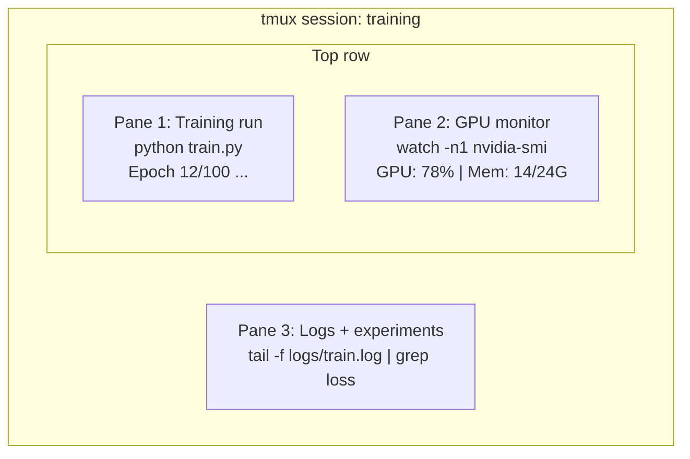

# Terminal ve Kabuk

> Terminal, yapay zeka mühendislerinin yaşadığı yerdir. Burada rahat ol.

**Tür:** Öğren
**Diller:** --
**Önkoşullar:** Aşama 0, Ders 01
**Süre:** ~35 dakika

## Öğrenme Hedefleri

- Komut satırından eğitim günlüklerini filtrelemek ve işlemek için yönlendirmeleri, yönlendirmeleri ve `grep`'yi kullanın
- Eşzamanlı eğitim ve GPU izleme için birden fazla bölmeyle kalıcı tmux oturumları oluşturun
- `htop`, `nvtop` ve `nvidia-smi` ile sistemi ve GPU kaynaklarını izleyin
- SSH, `scp` ve `rsync` kullanarak yerel ve uzak makineler arasında dosya aktarımı

## Sorun

Terminalde herhangi bir editörde olduğundan daha fazla zaman geçireceksiniz. Eğitim çalıştırmaları, GPU izleme, günlük takibi, uzaktan SSH oturumları, ortam yönetimi. Her yapay zeka iş akışı kabuğa dokunur. Burada yavaşsan her yerde yavaşsındır.

Bu ders, yapay zeka çalışmaları için önemli olan terminal becerilerini kapsar. Unix'in geçmişi yok. Bash komut dosyalarına derinlemesine dalmaya gerek yok. Tam da ihtiyacın olan şey.

## Konsept



Üç şey aynı anda çalışıyor. Bir terminal. Ayırabilir, eve gidebilir, SSH'yi tekrar bağlayabilir ve yeniden bağlayabilirsiniz. Eğitimler devam ediyor.

## İnşa Et

### 1. Adım: Kabuğunuzu tanıyın

Hangi kabuğu çalıştırdığınızı kontrol edin:

```bash
echo $SHELL
```

Çoğu sistem `bash` veya `zsh` kullanır. Her ikisi de iyi çalışıyor. Bu kurstaki komutlar her ikisinde de çalışır.

Bilinmesi gereken önemli şeyler:

```bash
# Move around
cd ~/projects/ai-engineering-from-scratch
pwd
ls -la

# History search (most useful shortcut you'll learn)
# Ctrl+R then type part of a previous command
# Press Ctrl+R again to cycle through matches

# Clear terminal
clear   # or Ctrl+L

# Cancel a running command
# Ctrl+C

# Suspend a running command (resume with fg)
# Ctrl+Z
```

### 2. Adım: Aktarma ve yönlendirmeler

Borulama komutları birbirine bağlar. Günlükleri, filtre çıktısını ve zincir araçlarını bu şekilde işlersiniz. Bunu sürekli kullanacaksınız.

```bash
# Count how many times "loss" appears in a log
cat train.log | grep "loss" | wc -l

# Extract just the loss values from training output
grep "loss:" train.log | awk '{print $NF}' > losses.txt

# Watch a log file update in real time, filtering for errors
tail -f train.log | grep --line-buffered "ERROR"

# Sort experiments by final accuracy
grep "final_accuracy" results/*.log | sort -t= -k2 -n -r

# Redirect stdout and stderr to separate files
python train.py > output.log 2> errors.log

# Redirect both to the same file
python train.py > train_full.log 2>&1
```

İhtiyacınız olan üç yönlendirme:

| Sembol | Ne işe yarar |
|--------|-------------|
| `>` | Stdout'u dosyaya yaz (üzerine yaz) |
| `>>` | Dosyaya stdout ekle |
| `2>` | Dosyaya stderr yaz |
| `2>&1` | Stderr'i stdout ile aynı yere gönderin |
| `\|` | Bir komutun stdout'unu diğerine stdin olarak gönder |

### 3. Adım: Arka plan işlemleri

Eğitim çalışmaları saatler sürüyor. Terminalinizi sürekli açık tutmak istemezsiniz.

```bash
# Run in background (output still goes to terminal)
python train.py &

# Run in background, immune to hangup (closing terminal won't kill it)
nohup python train.py > train.log 2>&1 &

# Check what's running in background
jobs
ps aux | grep train.py

# Bring a background job to foreground
fg %1

# Kill a background process
kill %1
# or find its PID and kill that
kill $(pgrep -f "train.py")
```

`&`, `nohup` ve `screen`/`tmux` arasındaki fark:

| Yöntem | Terminal kapanışında hayatta kalabilir mi? | Yeniden bağlanabilir mi? |
|--------|-------------------------|---------------|
| `command &` | Hayır | Hayır |
| `nohup command &` | Evet | Hayır (günlük dosyasını kontrol edin) |
| `screen` / `tmux` | Evet | Evet |

Birkaç dakikadan uzun bir süre için tmux'u kullanın.

### Adım 4: tmux

tmux, birden fazla bölmeyle kalıcı terminal oturumları oluşturmanıza olanak tanır. Bu, eğitim çalışmalarını yönetmek için en kullanışlı araçtır.

```bash
# Install
# macOS
brew install tmux
# Ubuntu
sudo apt install tmux

# Start a named session
tmux new -s training

# Split horizontally
# Ctrl+B then "

# Split vertically
# Ctrl+B then %

# Navigate between panes
# Ctrl+B then arrow keys

# Detach (session keeps running)
# Ctrl+B then d

# Reattach
tmux attach -t training

# List sessions
tmux ls

# Kill a session
tmux kill-session -t training
```

Tipik bir yapay zeka iş akışı oturumu:

```bash
tmux new -s train

# Pane 1: start training
python train.py --epochs 100 --lr 1e-4

# Ctrl+B, " to split, then run GPU monitor
watch -n1 nvidia-smi

# Ctrl+B, % to split vertically, tail the logs
tail -f logs/experiment.log

# Now detach with Ctrl+B, d
# SSH out, go get coffee, come back
# tmux attach -t train
```

### Adım 5: htop ve nvtop ile izleme

```bash
# System processes (better than top)
htop

# GPU processes (if you have NVIDIA GPU)
# Install: sudo apt install nvtop (Ubuntu) or brew install nvtop (macOS)
nvtop

# Quick GPU check without nvtop
nvidia-smi

# Watch GPU usage update every second
watch -n1 nvidia-smi

# See which processes are using the GPU
nvidia-smi --query-compute-apps=pid,name,used_memory --format=csv
```

Kullanacağınız `htop` tuş atamaları:
- Sütuna göre sıralamak için `F6` veya `>` (bellek sızıntılarını bulmak için belleğe göre sıralayın)
- `F5` ağaç görünümünü değiştirmek için (alt işlemlere bakın)
- `F9` bir süreci sonlandırmak için
- Bir işlem adını aramak için `/`

### Adım 6: Uzak GPU kutuları için SSH

Bulut GPU (Lambda, RunPod, Vast.ai) kiraladığınızda SSH aracılığıyla bağlanırsınız.

```bash
# Basic connection
ssh user@gpu-box-ip

# With a specific key
ssh -i ~/.ssh/my_gpu_key user@gpu-box-ip

# Copy files to remote
scp model.pt user@gpu-box-ip:~/models/

# Copy files from remote
scp user@gpu-box-ip:~/results/metrics.json ./

# Sync a whole directory (faster for many files)
rsync -avz ./data/ user@gpu-box-ip:~/data/

# Port forward (access remote Jupyter/TensorBoard locally)
ssh -L 8888:localhost:8888 user@gpu-box-ip
# Now open localhost:8888 in your browser

# SSH config for convenience
# Add to ~/.ssh/config:
# Host gpu
#     HostName 192.168.1.100
#     User ubuntu
#     IdentityFile ~/.ssh/gpu_key
#
# Then just:
# ssh gpu
```

### 7. Adım: Yapay zeka çalışması için faydalı takma adlar

Bunları `~/.bashrc` veya `~/.zshrc`'nize ekleyin:

```bash
source phases/00-setup-and-tooling/10-terminal-and-shell/code/shell_aliases.sh
```

Veya istediklerinizi kopyalayın. Anahtar takma adlar:

```bash
# GPU status at a glance
alias gpu='nvidia-smi --query-gpu=index,name,utilization.gpu,memory.used,memory.total,temperature.gpu --format=csv,noheader'

# Kill all Python training processes
alias killtraining='pkill -f "python.*train"'

# Quick virtual environment activate
alias ae='source .venv/bin/activate'

# Watch training loss
alias watchloss='tail -f logs/*.log | grep --line-buffered "loss"'
```

Setin tamamı için `code/shell_aliases.sh`'ye bakın.

### Adım 8: Ortak AI terminal modelleri

Bunlar pratikte defalarca karşımıza çıkıyor:

```bash
# Run training, log everything, notify when done
python train.py 2>&1 | tee train.log; echo "DONE" | mail -s "Training complete" you@email.com

# Compare two experiment logs side by side
diff <(grep "accuracy" exp1.log) <(grep "accuracy" exp2.log)

# Find the largest model files (clean up disk space)
find . -name "*.pt" -o -name "*.safetensors" | xargs du -h | sort -rh | head -20

# Download a model from Hugging Face
wget https://huggingface.co/model/resolve/main/model.safetensors

# Untar a dataset
tar xzf dataset.tar.gz -C ./data/

# Count lines in all Python files (see how big your project is)
find . -name "*.py" | xargs wc -l | tail -1

# Check disk space (training data fills disks fast)
df -h
du -sh ./data/*

# Environment variable check before training
env | grep -i cuda
env | grep -i torch
```

## Kullan onu

Bu kurs sırasında her bir araç şu şekilde devreye giriyor:

| Araç | Kullandığınızda |
|------|----------------|
| tmux | Her antrenman koşusu (Aşama 3+) |
| `tail -f` + `grep` | Eğitim günlüklerinin izlenmesi |
| `nohup` / `&` | Hızlı arka plan görevleri |
| `htop` / `nvtop` | Yavaş eğitimde hata ayıklama, OOM hataları |
| SSH + `rsync` | Bulut GPU'lar üzerinde çalışma |
| Borulama + yönlendirmeler | Deney sonuçları işleniyor |
| Takma Adlar | Tekrarlanan komutlarda zaman tasarrufu |

## Egzersizler

1. tmux'u yükleyin, üç bölmeli bir oturum oluşturun ve birinde `htop`'yi, diğerinde `watch -n1 date`'yi ve üçüncüsünde bir Python betiğini çalıştırın. Ayırın ve yeniden takın.
2. `code/shell_aliases.sh` takma adlarını kabuk yapılandırmanıza ekleyin ve `source ~/.zshrc` (veya `~/.bashrc`) ile yeniden yükleyin.
3. `for i in $(seq 1 100); do echo "epoch $i loss: $(echo "scale=4; 1/$i" | bc)"; sleep 0.1; done > fake_train.log` ile sahte bir eğitim günlüğü oluşturun ve ardından yalnızca kayıp değerlerini çıkarmak için `grep`, `tail` ve `awk`'yi kullanın.
4. Erişiminiz olan bir sunucu için bir SSH yapılandırma girişi ayarlayın (veya söz dizimini uygulamak için `localhost`'yi kullanın).

## Anahtar Terimler

| Dönem | İnsanlar ne diyor | Aslında ne anlama geliyor |
|------|----------------|----------------------|
| Kabuk | "Terminal" | Komutlarınızı yorumlayan program (bash, zsh, balık) |
| tmux | "Terminal çoklayıcı" | Tek bir pencerede birden fazla terminal oturumu çalıştırmanıza ve ayırmanıza/yeniden bağlamanıza olanak tanıyan bir program |
| Boru | "Bar olayı" | Bir komutun çıktısını diğerine girdi olarak gönderen `\|` operatörü |
| PID | "İşlem Kimliği" | Çalışan her işleme atanan, onu izlemek veya sonlandırmak için kullanılan benzersiz bir numara |
| hayır | "Kapatma yok" | Kapatma sinyalinden etkilenmeyen bir komut çalıştırır, böylece terminali kapatmak onu öldürmez |
| SSH | "Sunucuya bağlanılıyor" | Secure Shell, uzak makinede komut çalıştırmak için şifrelenmiş bir protokol |
