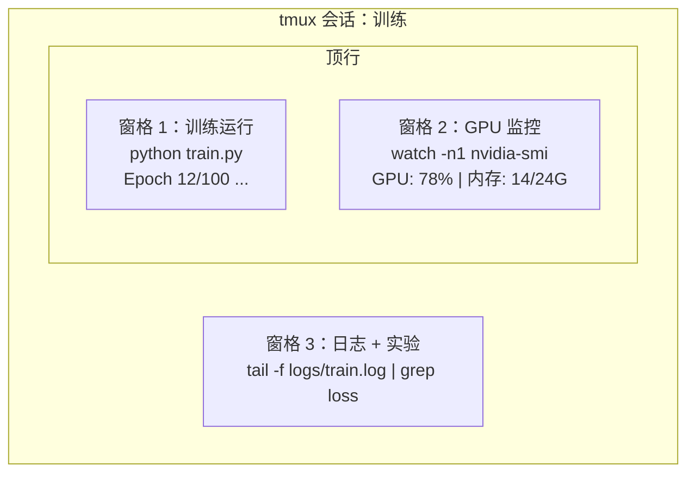

# 终端与 Shell

> 终端是AI工程师的生存之地。请在这里感到舒适。

**类型：** 学习  
**语言：** --  
**前置条件：** 阶段0，第01课  
**时间：** 约35分钟  

## 学习目标

- 使用管道、重定向和 `grep` 从命令行过滤和处理训练日志
- 创建持久化的 tmux 会话，包含多个窗格，用于并发训练和 GPU 监控
- 使用 `htop`、`nvtop` 和 `nvidia-smi` 监控系统和 GPU 资源
- 使用 SSH、`scp` 和 `rsync` 在本地和远程机器之间传输文件

## 问题

你花在终端上的时间将比任何编辑器都多。训练运行、GPU 监控、日志追踪、远程 SSH 会话、环境管理——每一个 AI 工作流都会触及 shell。如果你在这里慢，你在任何地方都会慢。

本课涵盖了对 AI 工作至关重要的终端技能。没有 Unix 历史，没有 Bash 脚本深究——只讲你需要的。

## 概念



同时运行三件事。一个终端。你可以分离、回家、SSH 回来、重新附着。训练会持续运行。

## 动手实践

### 步骤 1：了解你的 Shell

检查你正在运行的 shell：

```bash
echo $SHELL
```

大多数系统使用 `bash` 或 `zsh`。两者都可以。本课程中的命令在两个中都能工作。

关键知识：

```bash
# 移动
cd ~/projects/ai-engineering-from-scratch
pwd
ls -la

# 历史搜索（你将学到的最有用的快捷键）
# Ctrl+R 然后输入之前命令的一部分
# 再按 Ctrl+R 循环浏览匹配项

# 清屏
clear   # 或 Ctrl+L

# 取消正在运行的命令
# Ctrl+C

# 暂停正在运行的命令（用 fg 恢复）
# Ctrl+Z
```

### 步骤 2：管道与重定向

管道将命令连接在一起。这就是你处理日志、过滤输出和串联工具的方式。你会经常用到它。

```bash
# 统计日志中 "loss" 出现的次数
cat train.log | grep "loss" | wc -l

# 从训练输出中仅提取损失值
grep "loss:" train.log | awk '{print $NF}' > losses.txt

# 实时查看日志文件更新，过滤错误信息
tail -f train.log | grep --line-buffered "ERROR"

# 按最终准确率对实验排序
grep "final_accuracy" results/*.log | sort -t= -k2 -n -r

# 将标准输出和标准错误重定向到不同文件
python train.py > output.log 2> errors.log

# 将两者重定向到同一文件
python train.py > train_full.log 2>&1
```

你需要了解的三种重定向：

| 符号 | 作用 |
|------|------|
| `>` | 将标准输出写入文件（覆盖） |
| `>>` | 将标准输出追加到文件 |
| `2>` | 将标准错误写入文件 |
| `2>&1` | 将标准错误发送到与标准输出相同的位置 |
| `\|` | 将一个命令的标准输出作为下一个命令的标准输入 |

### 步骤 3：后台进程

训练运行需要数小时。你不想一直保持终端打开。

```bash
# 在后台运行（输出仍显示在终端）
python train.py &

# 在后台运行，不受挂起信号影响（关闭终端不会杀死它）
nohup python train.py > train.log 2>&1 &

# 查看后台运行的任务
jobs
ps aux | grep train.py

# 将后台任务带到前台
fg %1

# 杀死后台进程
kill %1
# 或找到它的 PID 并杀死
kill $(pgrep -f "train.py")
```

`&`、`nohup` 和 `screen`/`tmux` 的区别：

| 方法 | 关闭终端后是否存活？ | 能否重新附着？ |
|------|---------------------|---------------|
| `command &` | 否 | 否 |
| `nohup command &` | 是 | 否（查看日志文件） |
| `screen` / `tmux` | 是 | 是 |

对于任何超过几分钟的任务，请使用 tmux。

### 步骤 4：tmux

tmux 允许你创建持久化的终端会话，包含多个窗格。这是管理训练运行最实用的工具。

```bash
# 安装
# macOS
brew install tmux
# Ubuntu
sudo apt install tmux

# 启动一个命名会话
tmux new -s training

# 水平分割
# Ctrl+B 然后 "

# 垂直分割
# Ctrl+B 然后 %

# 在窗格之间导航
# Ctrl+B 然后方向键

# 分离（会话继续运行）
# Ctrl+B 然后 d

# 重新附着
tmux attach -t training

# 列出会话
tmux ls

# 杀死一个会话
tmux kill-session -t training
```

典型的 AI 工作流会话：

```bash
tmux new -s train

# 窗格 1：开始训练
python train.py --epochs 100 --lr 1e-4

# Ctrl+B, " 分割，然后运行 GPU 监控
watch -n1 nvidia-smi

# Ctrl+B, % 垂直分割，追踪日志
tail -f logs/experiment.log

# 现在用 Ctrl+B, d 分离
# SSH 退出，去喝杯咖啡，回来
# tmux attach -t train
```

### 步骤 5：使用 htop 和 nvtop 进行监控

```bash
# 系统进程（比 top 更好）
htop

# GPU 进程（如果你有 NVIDIA GPU）
# 安装：sudo apt install nvtop (Ubuntu) 或 brew install nvtop (macOS)
nvtop

# 不使用 nvtop 的快速 GPU 检查
nvidia-smi

# 每秒更新 GPU 使用情况
watch -n1 nvidia-smi

# 查看哪些进程正在使用 GPU
nvidia-smi --query-compute-apps=pid,name,used_memory --format=csv
```

`htop` 中你会用到的按键绑定：
- `F6` 或 `>` 按列排序（按内存排序以发现内存泄漏）
- `F5` 切换树形视图（查看子进程）
- `F9` 杀死进程
- `/` 搜索进程名

### 步骤 6：SSH 用于远程 GPU 机器

当你租用云 GPU（Lambda、RunPod、Vast.ai）时，通过 SSH 连接。

```bash
# 基本连接
ssh user@gpu-box-ip

# 使用特定密钥
ssh -i ~/.ssh/my_gpu_key user@gpu-box-ip

# 复制文件到远程
scp model.pt user@gpu-box-ip:~/models/

# 从远程复制文件
scp user@gpu-box-ip:~/results/metrics.json ./

# 同步整个目录（对大量文件更快）
rsync -avz ./data/ user@gpu-box-ip:~/data/

# 端口转发（在本地访问远程 Jupyter/TensorBoard）
ssh -L 8888:localhost:8888 user@gpu-box-ip
# 然后在浏览器中打开 localhost:8888

# SSH 配置便于使用
# 添加到 ~/.ssh/config：
# Host gpu
#     HostName 192.168.1.100
#     User ubuntu
#     IdentityFile ~/.ssh/gpu_key
#
# 然后只需：
# ssh gpu
```

### 步骤 7：AI 工作中有用的别名

将这些添加到你的 `~/.bashrc` 或 `~/.zshrc`：

```bash
source phases/00-setup-and-tooling/10-terminal-and-shell/code/shell_aliases.sh
```

或复制你想要的。关键别名：

```bash
# GPU 状态一览
alias gpu='nvidia-smi --query-gpu=index,name,utilization.gpu,memory.used,memory.total,temperature.gpu --format=csv,noheader'

# 杀死所有 Python 训练进程
alias killtraining='pkill -f "python.*train"'

# 快速激活虚拟环境
alias ae='source .venv/bin/activate'

# 监视训练损失
alias watchloss='tail -f logs/*.log | grep --line-buffered "loss"'
```

完整集请参见 `code/shell_aliases.sh`。

### 步骤 8：常见的 AI 终端模式

这些在实践中反复出现：

```bash
# 运行训练，记录所有内容，完成后通知
python train.py 2>&1 | tee train.log; echo "DONE" | mail -s "训练完成" you@email.com

# 并排比较两个实验日志
diff <(grep "accuracy" exp1.log) <(grep "accuracy" exp2.log)

# 找到最大的模型文件（清理磁盘空间）
find . -name "*.pt" -o -name "*.safetensors" | xargs du -h | sort -rh | head -20

# 从 Hugging Face 下载模型
wget https://huggingface.co/model/resolve/main/model.safetensors

# 解压数据集
tar xzf dataset.tar.gz -C ./data/

# 统计所有 Python 文件的行数（看项目有多大）
find . -name "*.py" | xargs wc -l | tail -1

# 检查磁盘空间（训练数据很快填满磁盘）
df -h
du -sh ./data/*

# 训练前检查环境变量
env | grep -i cuda
env | grep -i torch
```

## 使用场景

以下是本课程中各工具的使用时机：

| 工具 | 何时使用 |
|------|----------|
| tmux | 每次训练运行（阶段 3 及以后） |
| `tail -f` + `grep` | 监控训练日志 |
| `nohup` / `&` | 快速后台任务 |
| `htop` / `nvtop` | 调试慢训练、OOM 错误 |
| SSH + `rsync` | 在云 GPU 上工作 |
| 管道 + 重定向 | 处理实验结果 |
| 别名 | 节省重复命令的时间 |

## 练习

1. 安装 tmux，创建一个包含三个窗格的会话，在一个窗格中运行 `htop`，另一个运行 `watch -n1 date`，第三个运行一个 Python 脚本。分离并重新附着。
2. 从 `code/shell_aliases.sh` 将别名添加到你的 shell 配置中，然后用 `source ~/.zshrc`（或 `~/.bashrc`）重新加载。
3. 使用 `for i in $(seq 1 100); do echo "epoch $i loss: $(echo "scale=4; 1/$i" | bc)"; sleep 0.1; done > fake_train.log` 创建一个虚假的训练日志，然后使用 `grep`、`tail` 和 `awk` 仅提取损失值。
4. 为你拥有访问权限的服务器设置一个 SSH 配置条目（或使用 `localhost` 来练习语法）。

## 关键术语

| 术语 | 人们怎么说 | 实际含义 |
|------|-----------|---------|
| Shell | “终端” | 解释你的命令的程序（bash、zsh、fish） |
| tmux | “终端复用器” | 允许你在一个窗口内运行多个终端会话，并可分离/重新附着 |
| 管道 | “那个竖线东西” | `\|` 运算符，将一个命令的输出作为另一个命令的输入 |
| PID | “进程 ID” | 分配给每个运行进程的唯一编号，用于监控或杀死它 |
| nohup | “无挂起” | 运行一个不受挂起信号影响的命令，因此关闭终端不会杀死它 |
| SSH | “连接到服务器” | 安全外壳，一种加密协议，用于在远程机器上运行命令 |