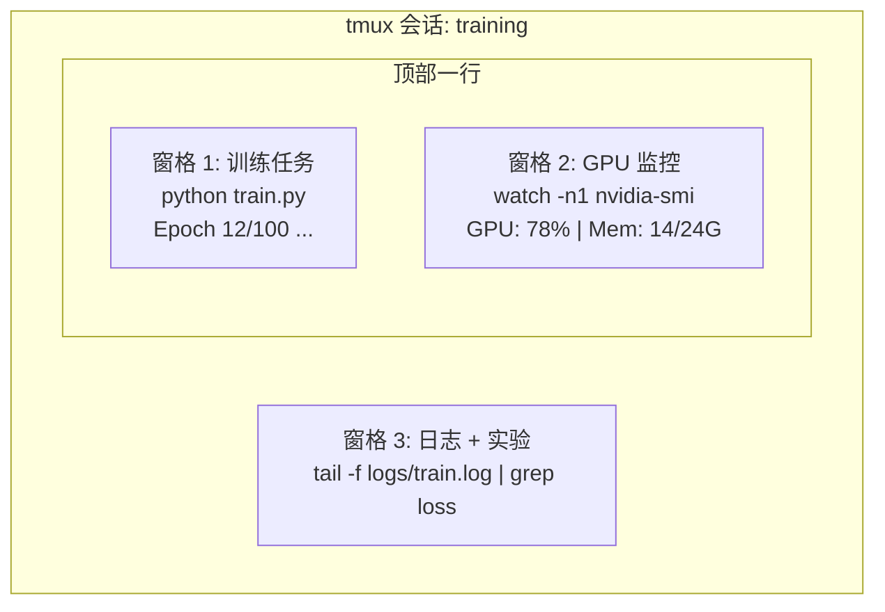

# 终端与 Shell（Terminal & Shell）

> 译注：本文译自同目录 [`en.md`](./en.md)。术语遵循仓根 [TRANSLATION_GUIDE.md](../../../../TRANSLATION_GUIDE.md)。

> 终端是 AI 工程师生活的地方。让自己在这里舒服起来。

**Type:** Learn
**Languages:** --
**Prerequisites:** Phase 0, Lesson 01
**Time:** ~35 minutes

## 学习目标（Learning Objectives）

- 用 piping、重定向（redirect）和 `grep` 在命令行里过滤、处理训练日志
- 用 tmux 创建持久会话，开多个 pane 同时跑训练和 GPU 监控
- 用 `htop`、`nvtop` 和 `nvidia-smi` 监控系统和 GPU 资源
- 用 SSH、`scp`、`rsync` 在本地和远程机器之间传输文件

## 问题（The Problem）

你待在终端里的时间会比待在任何编辑器里都长。训练任务、GPU 监控、日志 tail、远程 SSH 会话、环境管理。每一个 AI 工作流都会触碰到 shell。这里慢，你哪里都慢。

这一课讲的是对 AI 工作真正重要的终端技能。不讲 Unix 历史，不深挖 Bash 脚本。只讲你需要的那些。

## 概念（The Concept）



三件事同时跑。一个终端。你可以 detach 离开，回家，再 SSH 回来 reattach。训练一直在跑。

## 动手实现（Build It）

### Step 1: 认识你的 shell

看看自己跑的是哪个 shell：

```bash
echo $SHELL
```

大多数系统用 `bash` 或 `zsh`。两者都行。本课程的命令在哪个里都能跑。

要点：

```bash
# Move around
cd ~/projects/ai-engineering-from-scratch
pwd
ls -la

# History search (most useful shortcut you'll learn)
# Ctrl+R then type part of a previous command
# Press Ctrl+R again to cycle through matches

# Clear terminal
clear   # or Ctrl+L

# Cancel a running command
# Ctrl+C

# Suspend a running command (resume with fg)
# Ctrl+Z
```

### Step 2: Piping 与重定向

Piping 把多个命令串起来。这就是你处理日志、过滤输出、串联工具的方式。你会一直用到。

```bash
# Count how many times "loss" appears in a log
cat train.log | grep "loss" | wc -l

# Extract just the loss values from training output
grep "loss:" train.log | awk '{print $NF}' > losses.txt

# Watch a log file update in real time, filtering for errors
tail -f train.log | grep --line-buffered "ERROR"

# Sort experiments by final accuracy
grep "final_accuracy" results/*.log | sort -t= -k2 -n -r

# Redirect stdout and stderr to separate files
python train.py > output.log 2> errors.log

# Redirect both to the same file
python train.py > train_full.log 2>&1
```

你需要掌握的几种重定向：

| 符号 | 作用 |
|--------|-------------|
| `>` | 把 stdout 写到文件（覆盖） |
| `>>` | 把 stdout 追加到文件 |
| `2>` | 把 stderr 写到文件 |
| `2>&1` | 把 stderr 发到和 stdout 同一处 |
| `\|` | 把前一个命令的 stdout 当作下一个命令的 stdin |

### Step 3: 后台进程

训练任务动辄几个小时。你不会想让终端一直开着。

```bash
# Run in background (output still goes to terminal)
python train.py &

# Run in background, immune to hangup (closing terminal won't kill it)
nohup python train.py > train.log 2>&1 &

# Check what's running in background
jobs
ps aux | grep train.py

# Bring a background job to foreground
fg %1

# Kill a background process
kill %1
# or find its PID and kill that
kill $(pgrep -f "train.py")
```

`&`、`nohup` 和 `screen`/`tmux` 的区别：

| 方式 | 关掉终端还活着吗？ | 能 reattach 吗？ |
|--------|-------------------------|---------------|
| `command &` | 否 | 否 |
| `nohup command &` | 是 | 否（看日志文件） |
| `screen` / `tmux` | 是 | 是 |

任何超过几分钟的任务，用 tmux。

### Step 4: tmux

tmux 让你创建持久的终端会话，里面可以开多个 pane。这是管理训练任务最有用的单一工具。

```bash
# Install
# macOS
brew install tmux
# Ubuntu
sudo apt install tmux

# Start a named session
tmux new -s training

# Split horizontally
# Ctrl+B then "

# Split vertically
# Ctrl+B then %

# Navigate between panes
# Ctrl+B then arrow keys

# Detach (session keeps running)
# Ctrl+B then d

# Reattach
tmux attach -t training

# List sessions
tmux ls

# Kill a session
tmux kill-session -t training
```

一个典型的 AI 工作流会话：

```bash
tmux new -s train

# Pane 1: start training
python train.py --epochs 100 --lr 1e-4

# Ctrl+B, " to split, then run GPU monitor
watch -n1 nvidia-smi

# Ctrl+B, % to split vertically, tail the logs
tail -f logs/experiment.log

# Now detach with Ctrl+B, d
# SSH out, go get coffee, come back
# tmux attach -t train
```

### Step 5: 用 htop 和 nvtop 做监控

```bash
# System processes (better than top)
htop

# GPU processes (if you have NVIDIA GPU)
# Install: sudo apt install nvtop (Ubuntu) or brew install nvtop (macOS)
nvtop

# Quick GPU check without nvtop
nvidia-smi

# Watch GPU usage update every second
watch -n1 nvidia-smi

# See which processes are using the GPU
nvidia-smi --query-compute-apps=pid,name,used_memory --format=csv
```

`htop` 里你会用到的快捷键：
- `F6` 或 `>`：按列排序（按内存排序，找内存泄漏）
- `F5`：切换树状视图（看子进程）
- `F9`：杀进程
- `/`：按进程名搜索

### Step 6: SSH 到远程 GPU 机器

当你租一台云 GPU（Lambda、RunPod、Vast.ai），你通过 SSH 连上去。

```bash
# Basic connection
ssh user@gpu-box-ip

# With a specific key
ssh -i ~/.ssh/my_gpu_key user@gpu-box-ip

# Copy files to remote
scp model.pt user@gpu-box-ip:~/models/

# Copy files from remote
scp user@gpu-box-ip:~/results/metrics.json ./

# Sync a whole directory (faster for many files)
rsync -avz ./data/ user@gpu-box-ip:~/data/

# Port forward (access remote Jupyter/TensorBoard locally)
ssh -L 8888:localhost:8888 user@gpu-box-ip
# Now open localhost:8888 in your browser

# SSH config for convenience
# Add to ~/.ssh/config:
# Host gpu
#     HostName 192.168.1.100
#     User ubuntu
#     IdentityFile ~/.ssh/gpu_key
#
# Then just:
# ssh gpu
```

### Step 7: AI 工作里好用的 alias

加到你的 `~/.bashrc` 或 `~/.zshrc`：

```bash
source phases/00-setup-and-tooling/10-terminal-and-shell/code/shell_aliases.sh
```

或者挑你想要的复制过去。关键的几个：

```bash
# GPU status at a glance
alias gpu='nvidia-smi --query-gpu=index,name,utilization.gpu,memory.used,memory.total,temperature.gpu --format=csv,noheader'

# Kill all Python training processes
alias killtraining='pkill -f "python.*train"'

# Quick virtual environment activate
alias ae='source .venv/bin/activate'

# Watch training loss
alias watchloss='tail -f logs/*.log | grep --line-buffered "loss"'
```

完整集合见 `code/shell_aliases.sh`。

### Step 8: 常见的 AI 终端套路

这些在实践中反复出现：

```bash
# Run training, log everything, notify when done
python train.py 2>&1 | tee train.log; echo "DONE" | mail -s "Training complete" you@email.com

# Compare two experiment logs side by side
diff <(grep "accuracy" exp1.log) <(grep "accuracy" exp2.log)

# Find the largest model files (clean up disk space)
find . -name "*.pt" -o -name "*.safetensors" | xargs du -h | sort -rh | head -20

# Download a model from Hugging Face
wget https://huggingface.co/model/resolve/main/model.safetensors

# Untar a dataset
tar xzf dataset.tar.gz -C ./data/

# Count lines in all Python files (see how big your project is)
find . -name "*.py" | xargs wc -l | tail -1

# Check disk space (training data fills disks fast)
df -h
du -sh ./data/*

# Environment variable check before training
env | grep -i cuda
env | grep -i torch
```

## 用起来（Use It）

下面是本课程里每个工具会在什么时候派上用场：

| 工具 | 什么时候用 |
|------|----------------|
| tmux | 每一次训练任务（Phase 3+） |
| `tail -f` + `grep` | 监控训练日志 |
| `nohup` / `&` | 临时的后台任务 |
| `htop` / `nvtop` | 调试训练慢、OOM 错误 |
| SSH + `rsync` | 在云 GPU 上干活 |
| Piping + 重定向 | 处理实验结果 |
| Alias | 在重复命令上省时间 |

## 练习（Exercises）

1. 装上 tmux，建一个三个 pane 的会话，一个里面跑 `htop`，一个跑 `watch -n1 date`，一个跑一个 Python 脚本。Detach 然后再 reattach。
2. 把 `code/shell_aliases.sh` 里的 alias 加到你的 shell 配置里，用 `source ~/.zshrc`（或 `~/.bashrc`）重载。
3. 用 `for i in $(seq 1 100); do echo "epoch $i loss: $(echo "scale=4; 1/$i" | bc)"; sleep 0.1; done > fake_train.log` 造一份假训练日志，然后用 `grep`、`tail`、`awk` 把 loss 值抽出来。
4. 给一台你有访问权限的服务器配一条 SSH config 条目（或者用 `localhost` 练手语法）。

## 关键术语（Key Terms）

| 术语 | 大家口头怎么说 | 它实际是什么 |
|------|----------------|----------------------|
| Shell | "终端" | 解释你命令的程序（bash、zsh、fish） |
| tmux | "终端复用器" | 让你在一个窗口里跑多个终端会话、还能 detach/reattach 的程序 |
| Pipe | "那根竖线" | `\|` 运算符，把一个命令的输出当作另一个命令的输入 |
| PID | "进程 ID" | 分配给每个运行中进程的唯一编号，用来监控或杀它 |
| nohup | "No hangup" | 让命令免疫挂断信号，关掉终端也不会被杀 |
| SSH | "连服务器" | Secure Shell，一种加密协议，用于在远程机器上跑命令 |
