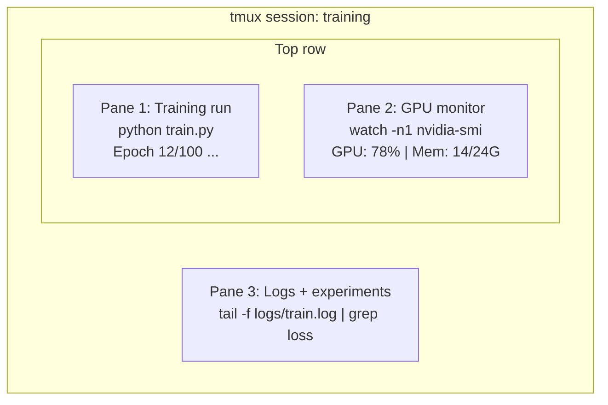

# 10 · 终端与 Shell

> 终端是 AI 工程师工作的主战场。请务必把它用顺手。

**类型：** 学习
**语言：** --
**前置：** 阶段 0，第 01 课
**时长：** 约 35 分钟

## 学习目标

- 使用管道（piping）、重定向（redirects）和 `grep` 在命令行中过滤和处理训练日志
- 创建持久化的 tmux 会话，用多个窗格（pane）同时进行训练和 GPU 监控
- 使用 `htop`、`nvtop` 和 `nvidia-smi` 监控系统和 GPU 资源
- 使用 SSH、`scp` 和 `rsync` 在本地与远程机器之间传输文件

## 问题所在

你待在终端里的时间，会比待在任何编辑器里都长。训练运行、GPU 监控、日志追踪、远程 SSH 会话、环境管理——每一个 AI 工作流都离不开 Shell。如果你在这里慢，那你在哪儿都慢。

本课覆盖对 AI 工作真正重要的终端技能。不讲 Unix 历史，不深挖 Bash 脚本，只讲你需要的东西。

## 核心概念



三件事同时运行，在同一个终端里。你可以分离（detach）会话、回家、再 SSH 连回来、重新附加（reattach），而训练始终在跑。

## 动手实现

### 第 1 步：了解你的 Shell

查看你当前运行的是哪个 Shell：

```bash
echo $SHELL
```

大多数系统用 `bash` 或 `zsh`，两者都没问题。本课程中的命令在二者中都能用。

需要掌握的要点：

```bash
# 目录间移动
cd ~/projects/ai-engineering-from-scratch
pwd
ls -la

# 历史命令搜索（你将学到的最有用的快捷键）
# 按 Ctrl+R，然后输入此前某条命令的一部分
# 再次按 Ctrl+R 可在匹配项之间循环切换

# 清空终端
clear   # 或 Ctrl+L

# 取消正在运行的命令
# Ctrl+C

# 挂起正在运行的命令（用 fg 恢复）
# Ctrl+Z
```

### 第 2 步：管道与重定向

管道把多个命令串接起来。你就是靠它来处理日志、过滤输出、把工具链接成链条。你会一直用到它。

```bash
# 统计某个日志中 "loss" 出现的次数
cat train.log | grep "loss" | wc -l

# 从训练输出中只提取 loss 数值
grep "loss:" train.log | awk '{print $NF}' > losses.txt

# 实时观察某个日志文件的更新，并过滤出错误
tail -f train.log | grep --line-buffered "ERROR"

# 按最终准确率对实验排序
grep "final_accuracy" results/*.log | sort -t= -k2 -n -r

# 将 stdout 和 stderr 重定向到不同文件
python train.py > output.log 2> errors.log

# 将两者都重定向到同一个文件
python train.py > train_full.log 2>&1
```

你需要掌握的三种重定向：

| 符号 | 作用 |
|--------|-------------|
| `>` | 将 stdout 写入文件（覆盖） |
| `>>` | 将 stdout 追加到文件 |
| `2>` | 将 stderr 写入文件 |
| `2>&1` | 将 stderr 送往与 stdout 相同的位置 |
| `\|` | 将前一个命令的 stdout 作为后一个命令的 stdin |

### 第 3 步：后台进程

训练动辄要跑数小时。你不会想一直开着终端等它。

```bash
# 在后台运行（输出仍然打到终端）
python train.py &

# 在后台运行，并对挂断信号免疫（关闭终端不会杀掉它）
nohup python train.py > train.log 2>&1 &

# 查看后台正在运行什么
jobs
ps aux | grep train.py

# 把后台任务调到前台
fg %1

# 杀掉一个后台进程
kill %1
# 或者找到它的 PID 再杀
kill $(pgrep -f "train.py")
```

`&`、`nohup` 和 `screen`/`tmux` 之间的区别：

| 方式 | 关闭终端后能存活吗？ | 能重新附加吗？ |
|--------|-------------------------|---------------|
| `command &` | 不能 | 不能 |
| `nohup command &` | 能 | 不能（看日志文件） |
| `screen` / `tmux` | 能 | 能 |

凡是超过几分钟的任务，都用 tmux。

### 第 4 步：tmux

tmux 让你创建带多个窗格的持久化终端会话。它是管理训练运行最有用的单一工具。

```bash
# 安装
# macOS
brew install tmux
# Ubuntu
sudo apt install tmux

# 启动一个命名会话
tmux new -s training

# 水平拆分
# Ctrl+B 然后按 "

# 垂直拆分
# Ctrl+B 然后按 %

# 在窗格之间导航
# Ctrl+B 然后按方向键

# 分离会话（会话继续运行）
# Ctrl+B 然后按 d

# 重新附加
tmux attach -t training

# 列出会话
tmux ls

# 杀掉一个会话
tmux kill-session -t training
```

一个典型的 AI 工作流会话：

```bash
tmux new -s train

# 窗格 1：启动训练
python train.py --epochs 100 --lr 1e-4

# Ctrl+B, " 拆分，然后运行 GPU 监控
watch -n1 nvidia-smi

# Ctrl+B, % 垂直拆分，追踪日志
tail -f logs/experiment.log

# 现在用 Ctrl+B, d 分离
# SSH 退出、去喝杯咖啡、再回来
# tmux attach -t train
```

### 第 5 步：用 htop 和 nvtop 监控

```bash
# 系统进程（比 top 好用）
htop

# GPU 进程（如果你有 NVIDIA GPU）
# 安装：sudo apt install nvtop（Ubuntu）或 brew install nvtop（macOS）
nvtop

# 不用 nvtop 时快速查看 GPU
nvidia-smi

# 每秒刷新一次 GPU 使用情况
watch -n1 nvidia-smi

# 查看哪些进程正在使用 GPU
nvidia-smi --query-compute-apps=pid,name,used_memory --format=csv
```

你会用到的 `htop` 键位：
- `F6` 或 `>` 按列排序（按内存排序可定位内存泄漏）
- `F5` 切换树状视图（查看子进程）
- `F9` 杀掉一个进程
- `/` 按进程名搜索

### 第 6 步：用 SSH 连接远程 GPU 主机

当你租用云端 GPU（Lambda、RunPod、Vast.ai）时，是通过 SSH 来连接的。

```bash
# 基本连接
ssh user@gpu-box-ip

# 指定密钥
ssh -i ~/.ssh/my_gpu_key user@gpu-box-ip

# 把文件拷贝到远程
scp model.pt user@gpu-box-ip:~/models/

# 从远程拷贝文件
scp user@gpu-box-ip:~/results/metrics.json ./

# 同步整个目录（文件多时更快）
rsync -avz ./data/ user@gpu-box-ip:~/data/

# 端口转发（在本地访问远程的 Jupyter/TensorBoard）
ssh -L 8888:localhost:8888 user@gpu-box-ip
# 然后在浏览器中打开 localhost:8888

# 方便起见的 SSH 配置
# 添加到 ~/.ssh/config：
# Host gpu
#     HostName 192.168.1.100
#     User ubuntu
#     IdentityFile ~/.ssh/gpu_key
#
# 之后只需：
# ssh gpu
```

### 第 7 步：适合 AI 工作的实用别名

把下面这些加到你的 `~/.bashrc` 或 `~/.zshrc`：

```bash
source phases/00-setup-and-tooling/10-terminal-and-shell/code/shell_aliases.sh
```

或者只挑你想要的复制过去。关键别名：

```bash
# 一眼看清 GPU 状态
alias gpu='nvidia-smi --query-gpu=index,name,utilization.gpu,memory.used,memory.total,temperature.gpu --format=csv,noheader'

# 杀掉所有 Python 训练进程
alias killtraining='pkill -f "python.*train"'

# 快速激活虚拟环境
alias ae='source .venv/bin/activate'

# 监控训练 loss
alias watchloss='tail -f logs/*.log | grep --line-buffered "loss"'
```

完整集合见 `code/shell_aliases.sh`。

### 第 8 步：常见的 AI 终端套路

这些在实践中会反复出现：

```bash
# 运行训练、记录所有输出、完成后发通知
python train.py 2>&1 | tee train.log; echo "DONE" | mail -s "Training complete" you@email.com

# 并排比较两份实验日志
diff <(grep "accuracy" exp1.log) <(grep "accuracy" exp2.log)

# 找出最大的模型文件（清理磁盘空间）
find . -name "*.pt" -o -name "*.safetensors" | xargs du -h | sort -rh | head -20

# 从 Hugging Face 下载模型
wget https://huggingface.co/model/resolve/main/model.safetensors

# 解压数据集
tar xzf dataset.tar.gz -C ./data/

# 统计所有 Python 文件的行数（看看你的项目有多大）
find . -name "*.py" | xargs wc -l | tail -1

# 查看磁盘空间（训练数据填满磁盘的速度很快）
df -h
du -sh ./data/*

# 训练前检查环境变量
env | grep -i cuda
env | grep -i torch
```

## 实际运用

下面是本课程中各个工具会派上用场的时机：

| 工具 | 何时使用 |
|------|----------------|
| tmux | 每次训练运行（阶段 3 及以后） |
| `tail -f` + `grep` | 监控训练日志 |
| `nohup` / `&` | 快速的后台任务 |
| `htop` / `nvtop` | 调试训练缓慢、OOM（内存溢出）错误 |
| SSH + `rsync` | 在云端 GPU 上工作 |
| 管道 + 重定向 | 处理实验结果 |
| 别名 | 在重复命令上省时间 |

## 练习

1. 安装 tmux，创建一个带三个窗格的会话，在其中一个运行 `htop`，另一个运行 `watch -n1 date`，第三个运行一个 Python 脚本。然后分离再重新附加。
2. 把 `code/shell_aliases.sh` 中的别名加到你的 Shell 配置里，并用 `source ~/.zshrc`（或 `~/.bashrc`）重新加载。
3. 用 `for i in $(seq 1 100); do echo "epoch $i loss: $(echo "scale=4; 1/$i" | bc)"; sleep 0.1; done > fake_train.log` 制造一份假的训练日志，然后用 `grep`、`tail` 和 `awk` 只提取出 loss 数值。
4. 为一台你有访问权限的服务器配置一条 SSH config 条目（或者用 `localhost` 来练习语法）。

## 关键术语

| 术语 | 人们怎么说 | 它实际指什么 |
|------|----------------|----------------------|
| Shell | "终端" | 解释你输入命令的程序（bash、zsh、fish） |
| tmux | "终端复用器（terminal multiplexer）" | 让你在一个窗口里运行多个终端会话、并可分离/重新附加的程序 |
| Pipe（管道） | "那根竖杠" | `\|` 运算符，把一个命令的输出作为另一个命令的输入 |
| PID | "进程 ID" | 分配给每个运行中进程的唯一编号，用于监控或杀掉它 |
| nohup | "不挂断（no hangup）" | 让命令对挂断信号免疫地运行，因此关闭终端不会杀掉它 |
| SSH | "连接到服务器" | 安全外壳（Secure Shell），一种在远程机器上运行命令的加密协议 |
