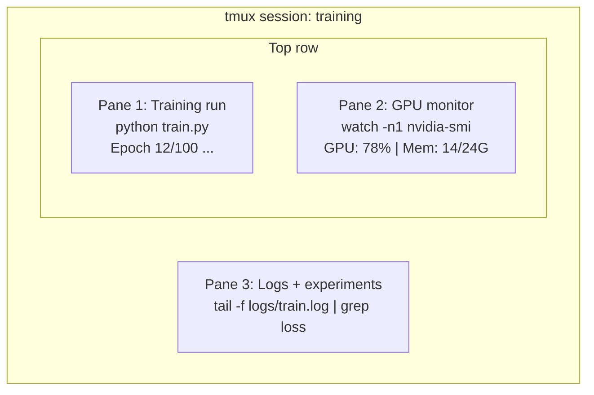

# Terminal & Shell

> 终端是人工智能工程师居住的地方。在这里舒服点。

** 类型：** 学习
** 语言：**--
** 先决条件：** 第0阶段，第01课
** 时间：** ~35分钟

## 学习目标

- Use piping, redirects, and `grep` to filter and process training logs from the command line
- Create persistent tmux sessions with multiple panes for concurrent training and GPU monitoring
- 使用“htop”、“nvtop”和“nvidia-smi”监控系统和图形处理器资源
- 使用SSH、' scp '和'在本地和远程机器之间传输文件

## 问题

您在终端上花费的时间将比在任何编辑器上花费的时间都多。培训运行、图形处理器监控、日志跟踪、远程SSH会话、环境管理。每一个人工智能工作流程都触及外壳。如果你在这里慢，那么你在哪里都慢。

本课涵盖了对人工智能工作至关重要的终端技能。没有Unix的历史。没有深入研究Bash脚本。正是您所需要的。

## 概念



三件事同时运行。一个航站楼。您可以分离、回家、通过静音重新连接。训练继续进行。

## 建设党

### 第1步：了解你的外壳

检查您正在运行的Shell：

```bash
echo $SHELL
```

大多数系统使用“bash”或“zsh”。两者都工作得很好。本课程中的命令适用于两者。

需要了解的关键事情：

```bash
# Move around
cd ~/projects/ai-engineering-from-scratch
pwd
ls -la

# History search (most useful shortcut you'll learn)
# Ctrl+R then type part of a previous command
# Press Ctrl+R again to cycle through matches

# Clear terminal
clear   # or Ctrl+L

# Cancel a running command
# Ctrl+C

# Suspend a running command (resume with fg)
# Ctrl+Z
```

### Step 2: Piping and redirects

Piping connects commands together. This is how you process logs, filter output, and chain tools. You will use this constantly.

```bash
# Count how many times "loss" appears in a log
cat train.log | grep "loss" | wc -l

# Extract just the loss values from training output
grep "loss:" train.log | awk '{print $NF}' > losses.txt

# Watch a log file update in real time, filtering for errors
tail -f train.log | grep --line-buffered "ERROR"

# Sort experiments by final accuracy
grep "final_accuracy" results/*.log | sort -t= -k2 -n -r

# Redirect stdout and stderr to separate files
python train.py > output.log 2> errors.log

# Redirect both to the same file
python train.py > train_full.log 2>&1
```

您需要的三个重定向：

| 符号 | What it does |
|--------|-------------|
| `>` | Write stdout to file (overwrite) |
| `>>` | 将标准输出附加到文件 |
| ' 2 ' | Write stderr to file |
| `2>&1` | 将stderr发送到与stdout相同的位置 |
| `\ | ` | Send stdout of one command as stdin to the next |

### 步骤3：后台程序

训练跑步需要数小时。您不想一直保持终端开放。

```bash
# Run in background (output still goes to terminal)
python train.py &

# Run in background, immune to hangup (closing terminal won't kill it)
nohup python train.py > train.log 2>&1 &

# Check what's running in background
jobs
ps aux | grep train.py

# Bring a background job to foreground
fg %1

# Kill a background process
kill %1
# or find its PID and kill that
kill $(pgrep -f "train.py")
```

The difference between `&`, `nohup`, and `screen`/`tmux`:

| Method | 在最后关头幸存下来？ | 可以重新连接吗？ |
|--------|-------------------------|---------------|
| '命令' | No | 没有 |
| ' nohup命令' | 是的 | No (check log file) |
| ' screen '/' tmux ' | 是的 | 是的 |

For anything longer than a few minutes, use tmux.

### Step 4: tmux

tmux允许您创建具有多个面板的持久终端会话。这是管理培训运行的最有用的工具。

```bash
# Install
# macOS
brew install tmux
# Ubuntu
sudo apt install tmux

# Start a named session
tmux new -s training

# Split horizontally
# Ctrl+B then "

# Split vertically
# Ctrl+B then %

# Navigate between panes
# Ctrl+B then arrow keys

# Detach (session keeps running)
# Ctrl+B then d

# Reattach
tmux attach -t training

# List sessions
tmux ls

# Kill a session
tmux kill-session -t training
```

典型的人工智能工作流程会话：

```bash
tmux new -s train

# Pane 1: start training
python train.py --epochs 100 --lr 1e-4

# Ctrl+B, " to split, then run GPU monitor
watch -n1 nvidia-smi

# Ctrl+B, % to split vertically, tail the logs
tail -f logs/experiment.log

# Now detach with Ctrl+B, d
# SSH out, go get coffee, come back
# tmux attach -t train
```

### 第5步：使用htop和nvtop监控

```bash
# System processes (better than top)
htop

# GPU processes (if you have NVIDIA GPU)
# Install: sudo apt install nvtop (Ubuntu) or brew install nvtop (macOS)
nvtop

# Quick GPU check without nvtop
nvidia-smi

# Watch GPU usage update every second
watch -n1 nvidia-smi

# See which processes are using the GPU
nvidia-smi --query-compute-apps=pid,name,used_memory --format=csv
```

`htop` keybindings you'll use:
- ' F6 '或'按列排序（按内存排序以查找内存泄漏）
- “F5”切换树视图（请参阅子进程）
- “F9”杀死进程
- `/` to search for a process name

### 第6步：远程图形处理盒的SSH

当您租用云图形处理器（Lambda、RunPod、Vast.ai）时，您会通过SSH连接。

```bash
# Basic connection
ssh user@gpu-box-ip

# With a specific key
ssh -i ~/.ssh/my_gpu_key user@gpu-box-ip

# Copy files to remote
scp model.pt user@gpu-box-ip:~/models/

# Copy files from remote
scp user@gpu-box-ip:~/results/metrics.json ./

# Sync a whole directory (faster for many files)
rsync -avz ./data/ user@gpu-box-ip:~/data/

# Port forward (access remote Jupyter/TensorBoard locally)
ssh -L 8888:localhost:8888 user@gpu-box-ip
# Now open localhost:8888 in your browser

# SSH config for convenience
# Add to ~/.ssh/config:
# Host gpu
#     HostName 192.168.1.100
#     User ubuntu
#     IdentityFile ~/.ssh/gpu_key
#
# Then just:
# ssh gpu
```

### 第7步：人工智能工作有用的别名

将这些添加到您的“~/.bashrc”或“~/.zshrc”：

```bash
source phases/00-setup-and-tooling/10-terminal-and-shell/code/shell_aliases.sh
```

或者复制你想要的。关键别名：

```bash
# GPU status at a glance
alias gpu='nvidia-smi --query-gpu=index,name,utilization.gpu,memory.used,memory.total,temperature.gpu --format=csv,noheader'

# Kill all Python training processes
alias killtraining='pkill -f "python.*train"'

# Quick virtual environment activate
alias ae='source .venv/bin/activate'

# Watch training loss
alias watchloss='tail -f logs/*.log | grep --line-buffered "loss"'
```

完整内容请参阅' code/shell_aliases.sh '。

### Step 8: Common AI terminal patterns

These come up repeatedly in practice:

```bash
# Run training, log everything, notify when done
python train.py 2>&1 | tee train.log; echo "DONE" | mail -s "Training complete" you@email.com

# Compare two experiment logs side by side
diff <(grep "accuracy" exp1.log) <(grep "accuracy" exp2.log)

# Find the largest model files (clean up disk space)
find . -name "*.pt" -o -name "*.safetensors" | xargs du -h | sort -rh | head -20

# Download a model from Hugging Face
wget https://huggingface.co/model/resolve/main/model.safetensors

# Untar a dataset
tar xzf dataset.tar.gz -C ./data/

# Count lines in all Python files (see how big your project is)
find . -name "*.py" | xargs wc -l | tail -1

# Check disk space (training data fills disks fast)
df -h
du -sh ./data/*

# Environment variable check before training
env | grep -i cuda
env | grep -i torch
```

## 使用它

以下是每个工具在本课程期间发挥作用的时间：

| 工具 | When you use it |
|------|----------------|
| tmux | 每次训练跑（阶段3+） |
| “tail -f”+“grep” | 监控培训日志 |
| “nohup”/“' | 快速后台任务 |
| ' htop '/' nvtop ' | 检查训练缓慢，OOM错误 |
| SSH +' r同步' | 使用云图形处理器 |
| Piping + redirects | Processing experiment results |
| 别名 | 节省重复命令的时间 |

## 演习

1. Install tmux, create a session with three panes, and run `htop` in one, `watch -n1 date` in another, and a Python script in the third. Detach and reattach.
2. 将“code/shell_aliases.sh”中的别名添加到您的Shell配置中，并使用“source ~/.zshrc”（或“~/.bashrc”）重新加载。
3. 创建一个假训练日志，包含' for i in $（seq 1 100）; do echo ' epoch ' epoch $i loss：$（echo ' scale=4; 1/$i '| BC）”; sleep 0.1; done > fake_train.log '，然后使用' grep '、'、'、'和'仅提取损失值。
4. 为您可以访问的服务器设置一个SSH配置条目（或使用“本地主机”来练习语法）。

## Key Terms

| Term | 别人怎么说 | 它实际上意味着什么 |
|------|----------------|----------------------|
| 壳 | “终点站” | 解释您的命令（bash、zsh、fish）的程序 |
| tmux | “终端多路转换器” | 一个程序，允许您在一个窗口内运行多个终端会话，并分离/重新连接 |
| 管 | "The bar thing" | 该' | '将一个命令的输出作为输入发送到另一个命令的操作员 |
| PID | “进程ID” | 分配给每个正在运行的进程的唯一编号，用于监视或杀死它 |
| nohup | "No hangup" | 发送不受挂断信号影响的命令，因此关闭终端不会杀死它 |
| SSH | “连接到服务器” | Safe Shell，一种用于在远程机器上运行命令的加密协议 |
