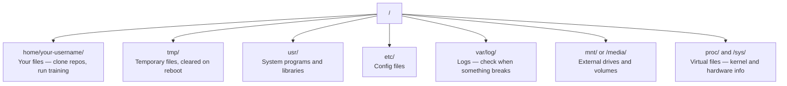

# Yapay Zeka için Linux

> Çoğu yapay zeka Linux'ta çalışır. Sıkılmamak için yeterince bilgi sahibi olmanız gerekir.

**Tür:** Öğren
**Diller:** --
**Önkoşullar:** Aşama 0, Ders 01
**Süre:** ~30 dakika

## Öğrenme Hedefleri

- Linux dosya sisteminde gezinin ve temel dosya işlemlerini komut satırından gerçekleştirin
- "İzin reddedildi" hatalarını çözmek için `chmod` ve `chown` ile dosya izinlerini yönetin
- `apt` ile sistem paketlerini yükleyin ve yapay zeka çalışması için yeni bir GPU kutusu kurun
- Uzak makinelerde çalışan geliştiricileri genellikle şaşırtan macOS-Linux farklılıklarını belirleyin

## Sorun

MacOS veya Windows üzerinde geliştiriyorsunuz. Ancak bir bulut GPU kutusuna SSH uyguladığınız, bir Lambda örneği kiraladığınız veya bir EC2 makinesini çalıştırdığınız anda Ubuntu'ya ulaşırsınız. Terminal sizin tek arayüzünüzdür. Finder yok, Explorer yok, GUI yok. Dosya sisteminde gezinemiyor, paketleri yükleyemiyor ve işlemleri komut satırından yönetemiyorsanız, "Linux'ta bir dosyanın sıkıştırması nasıl açılır" diye Google'da arama yaparken boşta kalan GPU saatleri için ödeme yapmak zorunda kalırsınız.

Bu bir hayatta kalma rehberidir. Yapay zeka çalışması için uzak bir Linux makinesinde çalıştırmanız gerekenleri tam olarak kapsar. Daha fazlası değil.

## Dosya Sistemi Düzeni

Linux her şeyi tek bir kök `/` altında düzenler. `C:\` veya `/Volumes` yok. Aslında dokunacağınız dizinler:



Ana dizininiz `~` veya `/home/your-username`. Yaptığınız neredeyse her şey burada oluyor.

## Temel Komutlar

Bunlar, uzak bir GPU kutusunda yapacağınız işlemlerin %95'ini kapsayan 15 komuttur.

### Dolaşmak

```bash
pwd                         # Where am I?
ls                          # What's here?
ls -la                      # What's here, including hidden files with details?
cd /path/to/dir             # Go there
cd ~                        # Go home
cd ..                       # Go up one level
```

### Dosyalar ve Dizinler

```bash
mkdir my-project            # Create a directory
mkdir -p a/b/c              # Create nested directories in one shot

cp file.txt backup.txt      # Copy a file
cp -r src/ src-backup/      # Copy a directory (recursive)

mv old.txt new.txt          # Rename a file
mv file.txt /tmp/           # Move a file

rm file.txt                 # Delete a file (no trash, it's gone)
rm -rf my-dir/              # Delete a directory and everything inside
```

`rm -rf` kalıcıdır. Geri alma yok. Enter tuşuna basmadan önce yolu bir kez daha kontrol edin.

### Dosyaları Okuma

```bash
cat file.txt                # Print entire file
head -20 file.txt           # First 20 lines
tail -20 file.txt           # Last 20 lines
tail -f log.txt             # Follow a log file in real time (Ctrl+C to stop)
less file.txt               # Scroll through a file (q to quit)
```

### Aranıyor

```bash
grep "error" training.log           # Find lines containing "error"
grep -r "learning_rate" .           # Search all files in current directory
grep -i "cuda" config.yaml          # Case-insensitive search

find . -name "*.py"                 # Find all Python files under current dir
find . -name "*.ckpt" -size +1G     # Find checkpoint files larger than 1GB
```

## İzinler

Linux'taki her dosyanın bir sahibi ve izin bitleri vardır. Komut dosyaları yürütülmediğinde veya bir dizine yazılamadığınızda bu durumla karşılaşırsınız.

```bash
ls -l train.py
# -rwxr-xr-- 1 user group 2048 Mar 19 10:00 train.py
#  ^^^             owner permissions: read, write, execute
#     ^^^          group permissions: read, execute
#        ^^        everyone else: read only
```

Yaygın düzeltmeler:

```bash
chmod +x train.sh           # Make a script executable
chmod 755 deploy.sh         # Owner: full, others: read+execute
chmod 644 config.yaml       # Owner: read+write, others: read only

chown user:group file.txt   # Change who owns a file (needs sudo)
```

Bir şey "İzin reddedildi" diyorsa, bu neredeyse her zaman bir izin sorunudur. `chmod +x` veya `sudo` çoğu durumu düzeltecektir.

## Paket Yönetimi (uygun)

Ubuntu `apt` kullanıyor. Sistem düzeyindeki yazılımı bu şekilde yüklersiniz.

```bash
sudo apt update             # Refresh the package list (always do this first)
sudo apt install -y htop    # Install a package (-y skips confirmation)
sudo apt install -y build-essential  # C compiler, make, etc. Needed by many Python packages
sudo apt install -y tmux    # Terminal multiplexer (keep sessions alive after disconnect)

apt list --installed        # What's installed?
sudo apt remove htop        # Uninstall
```

Yeni bir GPU kutusuna yükleyeceğiniz ortak paketler:

```bash
sudo apt update && sudo apt install -y \
    build-essential \
    git \
    curl \
    wget \
    tmux \
    htop \
    unzip \
    python3-venv
```

## Kullanıcılar ve sudo

Genellikle normal bir kullanıcı olarak oturum açarsınız. Bazı işlemler root (yönetici) erişimine ihtiyaç duyar.

```bash
whoami                      # What user am I?
sudo command                # Run a single command as root
sudo su                     # Become root (exit to go back, use sparingly)
```

Bulut GPU örneklerinde genellikle tek kullanıcı sizsiniz ve zaten sudo erişiminiz var. Her şeyi root olarak çalıştırmayın. Sudo'yu yalnızca gerektiğinde kullanın.

## Süreçler ve sistemd

Antrenmanınız kilitlendiğinde veya neyin çalıştığını kontrol etmeniz gerektiğinde:

```bash
htop                        # Interactive process viewer (q to quit)
ps aux | grep python        # Find running Python processes
kill 12345                  # Gracefully stop process with PID 12345
kill -9 12345               # Force kill (use when graceful doesn't work)
nvidia-smi                  # GPU processes and memory usage
```

systemd hizmetleri yönetir (arka plan servisleri). inference sunucu çalıştırıyorsanız bunu kullanacaksınız:

```bash
sudo systemctl start nginx          # Start a service
sudo systemctl stop nginx           # Stop it
sudo systemctl restart nginx        # Restart it
sudo systemctl status nginx         # Check if it's running
sudo systemctl enable nginx         # Start automatically on boot
```

## Disk Alanı

GPU kutularında genellikle sınırlı disk alanı bulunur. Modeller ve dataset'lar burayı hızla dolduruyor.

```bash
df -h                       # Disk usage for all mounted drives
df -h /home                 # Disk usage for /home specifically

du -sh *                    # Size of each item in current directory
du -sh ~/.cache             # Size of your cache (pip, huggingface models land here)
du -sh /data/checkpoints/   # Check how big your checkpoints are

# Find the biggest space hogs
du -h --max-depth=1 / 2>/dev/null | sort -hr | head -20
```

Ortak alan koruyucular:

```bash
# Clear pip cache
pip cache purge

# Clear apt cache
sudo apt clean

# Remove old checkpoints you don't need
rm -rf checkpoints/epoch_01/ checkpoints/epoch_02/
```

## Ağ İletişimi

Komut satırından modelleri indirecek, dosyaları aktaracak ve API'lere ulaşacaksınız.

```bash
# Download files
wget https://example.com/model.bin                   # Download a file
curl -O https://example.com/data.tar.gz              # Same thing with curl
curl -s https://api.example.com/health | python3 -m json.tool  # Hit an API, pretty-print JSON

# Transfer files between machines
scp model.bin user@remote:/data/                     # Copy file to remote machine
scp user@remote:/data/results.csv .                  # Copy file from remote to local
scp -r user@remote:/data/checkpoints/ ./local-dir/   # Copy directory

# Sync directories (faster than scp for large transfers, resumes on failure)
rsync -avz --progress ./data/ user@remote:/data/
rsync -avz --progress user@remote:/results/ ./results/
```

Büyük herhangi bir şey için `rsync` yerine `scp` kullanın. Yalnızca değiştirilen baytları aktarır ve kesintiye uğrayan bağlantıları yönetir.

## tmux: Oturumları Canlı Tutun

Uzak bir kutuya SSH uyguladığınızda dizüstü bilgisayarınızı kapatmak, egzersiz koşunuzu sonlandırır. tmux bunu engeller.

```bash
tmux new -s train           # Start a new session named "train"
# ... start your training, then:
# Ctrl+B, then D            # Detach (training keeps running)

tmux ls                     # List sessions
tmux attach -t train        # Reattach to session

# Inside tmux:
# Ctrl+B, then %            # Split pane vertically
# Ctrl+B, then "            # Split pane horizontally
# Ctrl+B, then arrow keys   # Switch between panes
```

Her zaman tmux'un içinde uzun eğitim işleri yürütün. Her zaman.

## Windows Kullanıcıları için WSL2

Windows kullanıyorsanız, WSL2 size çift önyükleme gerektirmeyen gerçek bir Linux ortamı sunar.

```bash
# In PowerShell (admin)
wsl --install -d Ubuntu-24.04

# After restart, open Ubuntu from Start menu
sudo apt update && sudo apt upgrade -y
```

WSL2 gerçek bir Linux çekirdeği çalıştırır. Bu dersteki her şey onun içinde çalışır. Windows dosyalarınız WSL içinden `/mnt/c/Users/YourName/` konumunda.

GPU geçişi, Windows tarafında yüklü NVIDIA sürücüleri ile çalışır. Windows NVIDIA sürücüsünü (Linux sürücüsünü değil) yükleyin; CUDA, WSL2'de mevcut olacaktır.

## Yakalananlar: macOS'tan Linux'a

MacOS'tan geliyorsanız sizi şaşırtacak şeyler:

| macOS | Linux | Notlar |
|-------|-------|-------|
| `brew install` | `sudo apt install` | Bazen farklı paket adları. `brew install htop` ile `sudo apt install htop` aynı şekilde çalışır ancak `brew install readline` ile `sudo apt install libreadline-dev` arasında çalışmaz. |
| `open file.txt` | `xdg-open file.txt` | Ancak uzak kutuda bir GUI'niz olmayacak. `cat` veya `less` kullanın. |
| `pbcopy` / `pbpaste` | Mevcut değil | SSH üzerinden panoya/panodan geçiş mevcut değil. |
| `~/.zshrc` | `~/.bashrc` | macOS varsayılan olarak zsh'dir. Çoğu Linux sunucusu bash kullanır. |
| `/opt/homebrew/` | `/usr/bin/`, `/usr/local/bin/` | İkili dosyalar farklı yerlerde yaşar. |
| `sed -i '' 's/a/b/' file` | `sed -i 's/a/b/' file` | macOS sed'in `-i`'den sonra boş bir dizeye ihtiyacı var. Linux bunu yapmaz. |
| Büyük/küçük harfe duyarlı olmayan dosya sistemi | Büyük/küçük harfe duyarlı dosya sistemi | `Model.py` ve `model.py` Linux'ta iki farklı dosyadır. |
| Satır sonları `\n` | Satır sonları `\n` | Aynı. Ancak Windows, bash komut dosyalarını bozan `\r\n`'yi kullanır. Düzeltmek için `dos2unix` komutunu çalıştırın. |

## Hızlı Referans Kartı

```
Navigation:     pwd, ls, cd, find
Files:          cp, mv, rm, mkdir, cat, head, tail, less
Search:         grep, find
Permissions:    chmod, chown, sudo
Packages:       apt update, apt install
Processes:      htop, ps, kill, nvidia-smi
Services:       systemctl start/stop/restart/status
Disk:           df -h, du -sh
Network:        curl, wget, scp, rsync
Sessions:       tmux new/attach/detach
```

## Egzersizler

1. Herhangi bir Linux makinesine SSH girin (veya WSL2'yi açın) ve ana dizininize gidin. Bir proje klasörü oluşturun, içinde `touch` ile üç boş dosya oluşturun, ardından bunları `ls -la` ile listeleyin.
2. `htop`'yi apt ile yükleyin, çalıştırın ve hangi işlemin en fazla belleği kullandığını belirleyin.
3. Bir tmux oturumu başlatın, içinde `sleep 300` çalıştırın, bağlantıyı kesin, oturumları listeleyin ve yeniden ekleyin.
4. Kullanılabilir disk alanını kontrol etmek için `df -h`'yi kullanın, ardından önbelleğinizde neyin yer kapladığını bulmak için `du -sh ~/.cache/*`'yi kullanın.
5. `scp` kullanarak yerel makinenizdeki bir dosyayı uzaktaki bir makineye aktarın, ardından aynı aktarımı `rsync` ile yapın ve deneyimi karşılaştırın.
