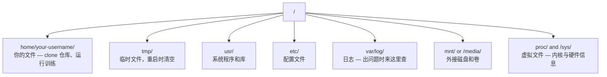

# 面向 AI 的 Linux（Linux for AI）

> 译注：本文译自同目录 [`en.md`](./en.md)。术语遵循仓根 [TRANSLATION_GUIDE.md](../../../../TRANSLATION_GUIDE.md)。

> 大多数 AI 都跑在 Linux 上。你得懂得够多，才不至于被卡住。

**Type:** Learn
**Languages:** --
**Prerequisites:** Phase 0, Lesson 01
**Time:** ~30 minutes

## 学习目标（Learning Objectives）

- 在命令行中浏览 Linux 文件系统并完成基本的文件操作
- 用 `chmod` 和 `chown` 管理文件权限，解决「Permission denied」错误
- 用 `apt` 安装系统级软件包，把一台全新的 GPU 机器配好用于 AI 工作
- 识别从 macOS 迁到 Linux 时常见的踩坑点（尤其是远程开发场景）

## 问题（The Problem）

你平时在 macOS 或 Windows 上开发。但只要一 SSH 进云上 GPU 机器、租一台 Lambda 实例、或者起一台 EC2，你就被丢进了 Ubuntu。终端是你唯一的界面：没有 Finder，没有资源管理器，没有 GUI。如果你不会从命令行浏览文件系统、装包、管理进程，那你就只能一边付着空转的 GPU 时费，一边 google「Linux 怎么解压文件」。

这是一份生存指南。它只覆盖你在远程 Linux 机器上做 AI 工作真正需要的东西，多一点都不写。

## 文件系统布局（File System Layout）

Linux 把所有东西都放在一个根 `/` 下面。没有 `C:\`，也没有 `/Volumes`。你真正会碰到的目录有这些：



你的 home 目录是 `~` 或 `/home/your-username`。你做的几乎所有事都在这里发生。

## 必备命令（Essential Commands）

下面这 15 条命令，覆盖你在远程 GPU 机器上 95% 的操作。

### 走来走去（Moving Around）

```bash
pwd                         # Where am I?
ls                          # What's here?
ls -la                      # What's here, including hidden files with details?
cd /path/to/dir             # Go there
cd ~                        # Go home
cd ..                       # Go up one level
```

### 文件和目录（Files and Directories）

```bash
mkdir my-project            # Create a directory
mkdir -p a/b/c              # Create nested directories in one shot

cp file.txt backup.txt      # Copy a file
cp -r src/ src-backup/      # Copy a directory (recursive)

mv old.txt new.txt          # Rename a file
mv file.txt /tmp/           # Move a file

rm file.txt                 # Delete a file (no trash, it's gone)
rm -rf my-dir/              # Delete a directory and everything inside
```

`rm -rf` 是永久删除，没有撤销。回车前先把路径看两遍。

### 读文件（Reading Files）

```bash
cat file.txt                # Print entire file
head -20 file.txt           # First 20 lines
tail -20 file.txt           # Last 20 lines
tail -f log.txt             # Follow a log file in real time (Ctrl+C to stop)
less file.txt               # Scroll through a file (q to quit)
```

### 搜索（Searching）

```bash
grep "error" training.log           # Find lines containing "error"
grep -r "learning_rate" .           # Search all files in current directory
grep -i "cuda" config.yaml          # Case-insensitive search

find . -name "*.py"                 # Find all Python files under current dir
find . -name "*.ckpt" -size +1G     # Find checkpoint files larger than 1GB
```

## 权限（Permissions）

Linux 里的每个文件都有一个所有者和一组权限位。当脚本跑不起来、或者你写不进某个目录时，你就会撞上这套机制。

```bash
ls -l train.py
# -rwxr-xr-- 1 user group 2048 Mar 19 10:00 train.py
#  ^^^             owner permissions: read, write, execute
#     ^^^          group permissions: read, execute
#        ^^        everyone else: read only
```

常见修法：

```bash
chmod +x train.sh           # Make a script executable
chmod 755 deploy.sh         # Owner: full, others: read+execute
chmod 644 config.yaml       # Owner: read+write, others: read only

chown user:group file.txt   # Change who owns a file (needs sudo)
```

只要看到「Permission denied」，几乎一定是权限问题。`chmod +x` 或 `sudo` 能解决大部分情况。

## 软件包管理（Package Management，apt）

Ubuntu 用 `apt`。系统层面的软件都通过它来装。

```bash
sudo apt update             # Refresh the package list (always do this first)
sudo apt install -y htop    # Install a package (-y skips confirmation)
sudo apt install -y build-essential  # C compiler, make, etc. Needed by many Python packages
sudo apt install -y tmux    # Terminal multiplexer (keep sessions alive after disconnect)

apt list --installed        # What's installed?
sudo apt remove htop        # Uninstall
```

一台全新 GPU 机器上你通常会装这些：

```bash
sudo apt update && sudo apt install -y \
    build-essential \
    git \
    curl \
    wget \
    tmux \
    htop \
    unzip \
    python3-venv
```

## 用户和 sudo（Users and sudo）

你通常以普通用户身份登录，部分操作需要 root（管理员）权限。

```bash
whoami                      # What user am I?
sudo command                # Run a single command as root
sudo su                     # Become root (exit to go back, use sparingly)
```

云 GPU 实例上一般只有你一个用户，并且默认有 sudo 权限。但别什么都用 root 跑，需要时才用 sudo。

## 进程和 systemd（Processes and systemd）

训练卡死了，或者想看看现在在跑什么时：

```bash
htop                        # Interactive process viewer (q to quit)
ps aux | grep python        # Find running Python processes
kill 12345                  # Gracefully stop process with PID 12345
kill -9 12345               # Force kill (use when graceful doesn't work)
nvidia-smi                  # GPU processes and memory usage
```

systemd 管理服务（后台 daemon）。如果你跑推理（inference）服务器，会用到它：

```bash
sudo systemctl start nginx          # Start a service
sudo systemctl stop nginx           # Stop it
sudo systemctl restart nginx        # Restart it
sudo systemctl status nginx         # Check if it's running
sudo systemctl enable nginx         # Start automatically on boot
```

## 磁盘空间（Disk Space）

GPU 机器的磁盘空间通常很有限，模型和数据集很快就能撑爆。

```bash
df -h                       # Disk usage for all mounted drives
df -h /home                 # Disk usage for /home specifically

du -sh *                    # Size of each item in current directory
du -sh ~/.cache             # Size of your cache (pip, huggingface models land here)
du -sh /data/checkpoints/   # Check how big your checkpoints are

# Find the biggest space hogs
du -h --max-depth=1 / 2>/dev/null | sort -hr | head -20
```

常用的清理招数：

```bash
# Clear pip cache
pip cache purge

# Clear apt cache
sudo apt clean

# Remove old checkpoints you don't need
rm -rf checkpoints/epoch_01/ checkpoints/epoch_02/
```

## 网络（Networking）

你会从命令行下载模型、传文件、调 API。

```bash
# Download files
wget https://example.com/model.bin                   # Download a file
curl -O https://example.com/data.tar.gz              # Same thing with curl
curl -s https://api.example.com/health | python3 -m json.tool  # Hit an API, pretty-print JSON

# Transfer files between machines
scp model.bin user@remote:/data/                     # Copy file to remote machine
scp user@remote:/data/results.csv .                  # Copy file from remote to local
scp -r user@remote:/data/checkpoints/ ./local-dir/   # Copy directory

# Sync directories (faster than scp for large transfers, resumes on failure)
rsync -avz --progress ./data/ user@remote:/data/
rsync -avz --progress user@remote:/results/ ./results/
```

涉及大文件，优先用 `rsync` 而不是 `scp`：它只传变化的字节，断了还能续传。

## tmux：让会话不掉（tmux: Keep Sessions Alive）

SSH 进远程机器后，合上笔记本就会把训练任务杀掉。tmux 能避免这件事。

```bash
tmux new -s train           # Start a new session named "train"
# ... start your training, then:
# Ctrl+B, then D            # Detach (training keeps running)

tmux ls                     # List sessions
tmux attach -t train        # Reattach to session

# Inside tmux:
# Ctrl+B, then %            # Split pane vertically
# Ctrl+B, then "            # Split pane horizontally
# Ctrl+B, then arrow keys   # Switch between panes
```

长训练任务永远要放在 tmux 里跑。永远。

## 给 Windows 用户的 WSL2（WSL2 for Windows Users）

如果你在 Windows 上，WSL2 能让你不用双系统就拿到一个真正的 Linux 环境。

```bash
# In PowerShell (admin)
wsl --install -d Ubuntu-24.04

# After restart, open Ubuntu from Start menu
sudo apt update && sudo apt upgrade -y
```

WSL2 跑的是真正的 Linux 内核。本课里的所有内容在里面都能用。从 WSL 内部访问 Windows 文件的路径是 `/mnt/c/Users/YourName/`。

GPU 直通需要在 Windows 那一侧装 NVIDIA 驱动。装 Windows 版的 NVIDIA 驱动（不要装 Linux 版的），WSL2 里就能用上 CUDA。

## 踩坑：从 macOS 到 Linux（Gotchas: macOS to Linux）

如果你是从 macOS 过来的，下面这些点会让你绊倒：

| macOS | Linux | 备注 |
|-------|-------|------|
| `brew install` | `sudo apt install` | 包名有时不一样。`brew install htop` 和 `sudo apt install htop` 是一回事，但 `brew install readline` 和 `sudo apt install libreadline-dev` 就不是。 |
| `open file.txt` | `xdg-open file.txt` | 但远程机器上你根本没有 GUI。用 `cat` 或 `less`。 |
| `pbcopy` / `pbpaste` | 没有 | 通过 SSH 不存在「往剪贴板里塞东西」这种事。 |
| `~/.zshrc` | `~/.bashrc` | macOS 默认 zsh，大多数 Linux 服务器用 bash。 |
| `/opt/homebrew/` | `/usr/bin/`、`/usr/local/bin/` | 二进制文件放的位置不一样。 |
| `sed -i '' 's/a/b/' file` | `sed -i 's/a/b/' file` | macOS 的 sed 在 `-i` 后面要跟一个空字符串，Linux 不要。 |
| 大小写不敏感的文件系统 | 大小写敏感的文件系统 | 在 Linux 上，`Model.py` 和 `model.py` 是两个不同的文件。 |
| 行尾 `\n` | 行尾 `\n` | 一样。但 Windows 用 `\r\n`，会把 bash 脚本搞坏，跑 `dos2unix` 修一下。 |

## 速查卡（Quick Reference Card）

```
Navigation:     pwd, ls, cd, find
Files:          cp, mv, rm, mkdir, cat, head, tail, less
Search:         grep, find
Permissions:    chmod, chown, sudo
Packages:       apt update, apt install
Processes:      htop, ps, kill, nvidia-smi
Services:       systemctl start/stop/restart/status
Disk:           df -h, du -sh
Network:        curl, wget, scp, rsync
Sessions:       tmux new/attach/detach
```

## 练习（Exercises）

1. SSH 进任意一台 Linux 机器（或者打开 WSL2），切到 home 目录。建一个项目目录，在里面用 `touch` 建三个空文件，然后用 `ls -la` 列出来。
2. 用 apt 装 `htop`、运行它，找出当前内存占用最高的进程。
3. 起一个 tmux 会话，里面跑 `sleep 300`，detach 出来，列出会话，再 attach 回去。
4. 用 `df -h` 看可用磁盘空间，再用 `du -sh ~/.cache/*` 找出 cache 里最占地方的东西。
5. 用 `scp` 把一个文件从本机传到远程；再用 `rsync` 做一次同样的传输，对比一下体验。
