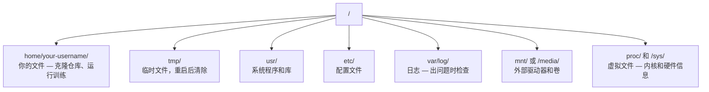

# Linux for AI（人工智能的Linux）

> 大多数AI运行在Linux上。你需要掌握足够的知识，以免陷入困境。

**类型：** 学习  
**语言：** --  
**前置条件：** 第0阶段，第01课  
**时间：** 约30分钟

## 学习目标

- 在Linux文件系统中导航，并通过命令行执行基本的文件操作
- 使用`chmod`和`chown`管理文件权限，解决"权限被拒绝"错误
- 使用`apt`安装系统包，并为AI工作配置一台全新的GPU机器
- 识别macOS与Linux的差异——这些差异常让在远程机器上工作的开发者措手不及

## 问题

你在macOS或Windows上进行开发。但一旦你通过SSH进入云GPU机器、租用Lambda实例或启动EC2实例，你便进入了Ubuntu系统。终端是你唯一的接口。没有Finder，没有资源管理器，没有图形界面。如果你无法从命令行导航文件系统、安装包和管理进程，你将被迫为闲置的GPU时间付费，同时还要搜索"如何在Linux中解压文件"。

这是一份生存指南。它涵盖了在远程Linux机器上进行AI工作所需的全部内容，不多不少。

## 文件系统布局

Linux将所有内容组织在单一的根目录`/`下。没有`C:\`或`/Volumes`。你将实际接触的目录：



你的主目录是`~`或`/home/your-username`。你几乎所有的操作都发生在这里。

## 基本命令

以下是覆盖你在远程GPU机器上95%操作的15个命令。

### 导航

```bash
pwd                         # 我在哪里？
ls                          # 这里有什么？
ls -la                      # 这里有什么？包括隐藏文件的详细信息？
cd /path/to/dir             # 前往那里
cd ~                        # 回家
cd ..                       # 返回上一级
```

### 文件和目录

```bash
mkdir my-project            # 创建一个目录
mkdir -p a/b/c              # 一步创建嵌套目录

cp file.txt backup.txt      # 复制文件
cp -r src/ src-backup/      # 复制目录（递归）

mv old.txt new.txt          # 重命名文件
mv file.txt /tmp/           # 移动文件

rm file.txt                 # 删除文件（没有回收站，直接消失）
rm -rf my-dir/              # 删除目录及其内部所有内容
```

`rm -rf`是永久性的。没有撤销操作。在按回车之前，务必仔细检查路径。

### 读取文件

```bash
cat file.txt                # 打印整个文件
head -20 file.txt           # 前20行
tail -20 file.txt           # 后20行
tail -f log.txt             # 实时跟踪日志文件（按Ctrl+C停止）
less file.txt               # 滚动浏览文件（按q退出）
```

### 搜索

```bash
grep "error" training.log           # 查找包含"error"的行
grep -r "learning_rate" .           # 在当前目录的所有文件中搜索
grep -i "cuda" config.yaml          # 不区分大小写搜索

find . -name "*.py"                 # 查找当前目录下所有Python文件
find . -name "*.ckpt" -size +1G     # 查找大于1GB的检查点文件
```

## 权限

Linux中的每个文件都有所有者（owner）和权限位（permission bits）。当脚本无法执行或无法写入目录时，你会遇到这个问题。

```bash
ls -l train.py
# -rwxr-xr-- 1 user group 2048 Mar 19 10:00 train.py
#  ^^^             所有者权限：读、写、执行
#     ^^^          组权限：读、执行
#        ^^        其他人：只读
```

常见修复：

```bash
chmod +x train.sh           # 使脚本可执行
chmod 755 deploy.sh         # 所有者：全部，其他人：读+执行
chmod 644 config.yaml       # 所有者：读+写，其他人：只读

chown user:group file.txt   # 更改文件的所有者（需要sudo）
```

当出现"权限被拒绝"时，几乎总是权限问题。`chmod +x`或`sudo`可以解决大多数情况。

## 包管理（apt）

Ubuntu使用`apt`。这是你安装系统级软件的方式。

```bash
sudo apt update             # 刷新软件包列表（始终先执行此操作）
sudo apt install -y htop    # 安装软件包（-y跳过确认）
sudo apt install -y build-essential  # C编译器、make等。许多Python包需要它
sudo apt install -y tmux    # 终端复用器（断开连接后保持会话存活）

apt list --installed        # 已安装的包？
sudo apt remove htop        # 卸载
```

在全新GPU机器上你会安装的常用包：

```bash
sudo apt update && sudo apt install -y \
    build-essential \
    git \
    curl \
    wget \
    tmux \
    htop \
    unzip \
    python3-venv
```

## 用户和sudo

你通常以普通用户身份登录。某些操作需要root（管理员）权限。

```bash
whoami                      # 我是哪个用户？
sudo command                # 以root身份运行单个命令
sudo su                     # 成为root用户（输入exit返回，谨慎使用）
```

在云GPU实例上，你通常是唯一用户，并已拥有sudo权限。不要所有操作都以root身份运行。仅在需要时使用sudo。

## 进程和systemd

当你的训练卡住，或者需要检查正在运行的内容时：

```bash
htop                        # 交互式进程查看器（按q退出）
ps aux | grep python        # 查找正在运行的Python进程
kill 12345                  # 优雅地停止PID为12345的进程
kill -9 12345               # 强制杀死（当优雅方式无效时使用）
nvidia-smi                  # GPU进程和内存使用情况
```

systemd管理服务（后台守护进程）。如果你运行推理服务器，会用到它：

```bash
sudo systemctl start nginx          # 启动服务
sudo systemctl stop nginx           # 停止服务
sudo systemctl restart nginx        # 重启服务
sudo systemctl status nginx         # 检查是否在运行
sudo systemctl enable nginx         # 开机自启
```

## 磁盘空间

GPU机器通常磁盘空间有限。模型和数据集很快就会填满它。

```bash
df -h                       # 所有挂载驱动器的磁盘使用情况
df -h /home                 # 单独查看/home的磁盘使用情况

du -sh *                    # 当前目录下每个项目的大小
du -sh ~/.cache             # 缓存大小（pip、huggingface模型存放于此）
du -sh /data/checkpoints/   # 检查你的检查点有多大

# 查找最大的空间占用者
du -h --max-depth=1 / 2>/dev/null | sort -hr | head -20
```

常见节省空间的方法：

```bash
# 清除pip缓存
pip cache purge

# 清除apt缓存
sudo apt clean

# 删除不需要的旧检查点
rm -rf checkpoints/epoch_01/ checkpoints/epoch_02/
```

## 网络

你会在命令行下载模型、传输文件和调用API。

```bash
# 下载文件
wget https://example.com/model.bin                   # 下载文件
curl -O https://example.com/data.tar.gz              # 用curl做同样的事
curl -s https://api.example.com/health | python3 -m json.tool  # 调用API，美化打印JSON

# 在机器之间传输文件
scp model.bin user@remote:/data/                     # 将文件复制到远程机器
scp user@remote:/data/results.csv .                  # 从远程机器复制文件到本地
scp -r user@remote:/data/checkpoints/ ./local-dir/   # 复制目录

# 同步目录（对大型传输来说比scp更快，支持断点续传）
rsync -avz --progress ./data/ user@remote:/data/
rsync -avz --progress user@remote:/results/ ./results/
```

对于大型传输，使用`rsync`而非`scp`。它只传输变化的字节，并能处理连接中断。

## tmux：保持会话存活

当你通过SSH连接到远程机器时，关闭笔记本电脑会终止你的训练运行。tmux可以防止这种情况。

```bash
tmux new -s train           # 启动一个名为"train"的新会话
# ... 开始训练，然后：
# Ctrl+B, 然后 D            # 分离（训练继续运行）

tmux ls                     # 列出会话
tmux attach -t train        # 重新连接到会话

# tmux内：
# Ctrl+B, 然后 %            # 垂直分割窗格
# Ctrl+B, 然后 "            # 水平分割窗格
# Ctrl+B, 然后方向键        # 在窗格之间切换
```

始终在tmux内运行长时间的训练作业。始终如此。

## WSL2 for Windows用户

如果你在Windows上，WSL2提供了一个真实的Linux环境，无需双系统。

```bash
# 在PowerShell（管理员）中
wsl --install -d Ubuntu-24.04

# 重启后，从开始菜单打开Ubuntu
sudo apt update && sudo apt upgrade -y
```

WSL2运行一个真实的Linux内核。本课程的所有内容都可以在内部运行。从WSL内部，你的Windows文件位于`/mnt/c/Users/YourName/`。

GPU直通（GPU passthrough）需要Windows侧安装NVIDIA驱动程序。安装Windows版NVIDIA驱动（而非Linux版的），CUDA将在WSL2中可用。

## 常见陷阱：macOS到Linux

如果你从macOS迁移过来，以下事情会让你措手不及：

| macOS | Linux | 注意事项 |
|-------|-------|----------|
| `brew install` | `sudo apt install` | 有时包名不同。`brew install htop` 和 `sudo apt install htop` 效果相同，但 `brew install readline` 与 `sudo apt install libreadline-dev` 不同。 |
| `open file.txt` | `xdg-open file.txt` | 但在远程机器上没有图形界面。使用 `cat` 或 `less`。 |
| `pbcopy` / `pbpaste` | 不可用 | 通过SSH无法使用剪贴板管道。 |
| `~/.zshrc` | `~/.bashrc` | macOS默认使用zsh。大多数Linux服务器使用bash。 |
| `/opt/homebrew/` | `/usr/bin/`, `/usr/local/bin/` | 可执行文件位于不同位置。 |
| `sed -i '' 's/a/b/' file` | `sed -i 's/a/b/' file` | macOS的sed需要在`-i`后加空字符串。Linux不需要。 |
| 不区分大小写的文件系统 | 区分大小写的文件系统 | `Model.py` 和 `model.py` 在Linux中是两个不同的文件。 |
| 行结束符 `\n` | 行结束符 `\n` | 相同。但Windows使用 `\r\n`，这会破坏bash脚本。运行 `dos2unix` 修复。 |

## 快速参考卡

```
导航：          pwd, ls, cd, find
文件：          cp, mv, rm, mkdir, cat, head, tail, less
搜索：          grep, find
权限：          chmod, chown, sudo
包管理：        apt update, apt install
进程：          htop, ps, kill, nvidia-smi
服务：          systemctl start/stop/restart/status
磁盘：          df -h, du -sh
网络：          curl, wget, scp, rsync
会话：          tmux new/attach/detach
```

## 练习

1. SSH到任意一台Linux机器（或打开WSL2），导航到你的主目录。创建一个项目文件夹，使用`touch`在其中创建三个空文件，然后用`ls -la`列出它们。
2. 使用apt安装`htop`，运行它，并找出哪个进程使用了最多内存。
3. 启动一个tmux会话，在其中运行`sleep 300`，分离，列出会话，然后重新连接。
4. 使用`df -h`检查可用磁盘空间，然后使用`du -sh ~/.cache/*`找出缓存中哪些内容占用了空间。
5. 使用`scp`将文件从本地机器传输到远程机器，然后使用`rsync`进行同样的传输，并比较体验。