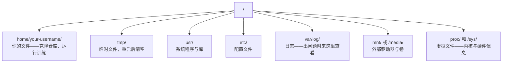

# 11 · 面向 AI 的 Linux

> 大多数 AI 都运行在 Linux 上。你需要掌握足够的知识，才不会被卡住。

**类型：** 学习
**语言：** --
**前置：** 阶段 0，第 01 课
**时长：** 约 30 分钟

## 学习目标

- 浏览 Linux 文件系统，并在命令行中完成核心的文件操作
- 用 `chmod` 和 `chown` 管理文件权限，解决「Permission denied」（权限被拒绝）错误
- 用 `apt` 安装系统软件包，并为 AI 工作搭建一台全新的 GPU 机器
- 识别从 macOS 切换到 Linux 时常见的差异——这些差异常常绊倒在远程机器上工作的开发者

## 问题所在

你在 macOS 或 Windows 上开发。但只要你 SSH 登入一台云端 GPU 机器、租用一个 Lambda 实例，或者启动一台 EC2 机器，你就会落入 Ubuntu 环境。终端是你唯一的界面。没有 Finder，没有资源管理器（Explorer），没有图形界面（GUI）。如果你无法在命令行中浏览文件系统、安装软件包、管理进程，你就会被卡住——一边白白支付着空转的 GPU 费用，一边在谷歌上搜索「如何在 Linux 中解压文件」。

这是一份生存指南。它正好覆盖了你在远程 Linux 机器上做 AI 工作所需要的内容，仅此而已。

## 文件系统布局

Linux 把所有内容都组织在单一的根目录 `/` 之下。这里没有 `C:\`，也没有 `/Volumes`。你实际会接触到的目录：



你的主目录（home directory）是 `~` 或 `/home/your-username`。你做的几乎所有事情都发生在这里。

## 核心命令

以下 15 个命令覆盖了你在远程 GPU 机器上 95% 的操作。

### 四处移动

```bash
pwd                         # 我在哪里？
ls                          # 这里有什么？
ls -la                      # 这里有什么，包括隐藏文件和详细信息？
cd /path/to/dir             # 去那里
cd ~                        # 回主目录
cd ..                       # 上移一级
```

### 文件与目录

```bash
mkdir my-project            # 创建一个目录
mkdir -p a/b/c              # 一次性创建多层嵌套目录

cp file.txt backup.txt      # 复制文件
cp -r src/ src-backup/      # 复制目录（递归）

mv old.txt new.txt          # 重命名文件
mv file.txt /tmp/           # 移动文件

rm file.txt                 # 删除文件（没有回收站，删了就没了）
rm -rf my-dir/              # 删除目录及其内部所有内容
```

`rm -rf` 是永久性的。没有撤销。按回车前请再三确认路径。

### 读取文件

```bash
cat file.txt                # 打印整个文件
head -20 file.txt           # 前 20 行
tail -20 file.txt           # 后 20 行
tail -f log.txt             # 实时跟踪一个日志文件（Ctrl+C 停止）
less file.txt               # 滚动浏览文件（q 退出）
```

### 搜索

```bash
grep "error" training.log           # 查找包含 "error" 的行
grep -r "learning_rate" .           # 搜索当前目录下的所有文件
grep -i "cuda" config.yaml          # 不区分大小写的搜索

find . -name "*.py"                 # 查找当前目录下所有 Python 文件
find . -name "*.ckpt" -size +1G     # 查找大于 1GB 的检查点文件
```

## 权限

Linux 中的每个文件都有一个所有者（owner）和一组权限位（permission bits）。当脚本无法执行或你无法写入某个目录时，你就会遇到它。

```bash
ls -l train.py
# -rwxr-xr-- 1 user group 2048 Mar 19 10:00 train.py
#  ^^^             所有者权限：读、写、执行
#     ^^^          组权限：读、执行
#        ^^        其他所有人：仅读
```

常见修复方法：

```bash
chmod +x train.sh           # 让脚本可执行
chmod 755 deploy.sh         # 所有者：完整权限，其他人：读 + 执行
chmod 644 config.yaml       # 所有者：读 + 写，其他人：仅读

chown user:group file.txt   # 更改文件所有者（需要 sudo）
```

当系统提示「Permission denied」（权限被拒绝）时，几乎总是权限问题。`chmod +x` 或 `sudo` 能解决大多数情况。

## 包管理（apt）

Ubuntu 使用 `apt`。你通过它来安装系统级软件。

```bash
sudo apt update             # 刷新软件包列表（务必先执行这一步）
sudo apt install -y htop    # 安装一个软件包（-y 跳过确认）
sudo apt install -y build-essential  # C 编译器、make 等。许多 Python 包都需要它
sudo apt install -y tmux    # 终端复用器（断开连接后保持会话存活）

apt list --installed        # 已安装了哪些？
sudo apt remove htop        # 卸载
```

在一台全新的 GPU 机器上，你常常会安装的软件包：

```bash
sudo apt update && sudo apt install -y \
    build-essential \
    git \
    curl \
    wget \
    tmux \
    htop \
    unzip \
    python3-venv
```

## 用户与 sudo

你通常以普通用户身份登录。有些操作需要 root（管理员）权限。

```bash
whoami                      # 我是哪个用户？
sudo command                # 以 root 身份运行单条命令
sudo su                     # 变成 root（用 exit 退回，谨慎使用）
```

在云端 GPU 实例上，你通常是唯一的用户，并且已经拥有 sudo 权限。不要把所有命令都用 root 运行。只在需要时才用 sudo。

## 进程与 systemd

当你的训练卡住，或者你需要查看正在运行的内容时：

```bash
htop                        # 交互式进程查看器（q 退出）
ps aux | grep python        # 查找正在运行的 Python 进程
kill 12345                  # 优雅地停止 PID 为 12345 的进程
kill -9 12345               # 强制杀死（在优雅方式无效时使用）
nvidia-smi                  # GPU 进程与显存使用情况
```

systemd 管理服务（后台守护进程，daemon）。如果你运行推理服务器，就会用到它：

```bash
sudo systemctl start nginx          # 启动一个服务
sudo systemctl stop nginx           # 停止它
sudo systemctl restart nginx        # 重启它
sudo systemctl status nginx         # 检查它是否在运行
sudo systemctl enable nginx         # 开机时自动启动
```

## 磁盘空间

GPU 机器的磁盘空间往往有限。模型和数据集会很快把它填满。

```bash
df -h                       # 所有已挂载驱动器的磁盘使用情况
df -h /home                 # 专门查看 /home 的磁盘使用情况

du -sh *                    # 当前目录中每一项的大小
du -sh ~/.cache             # 你的缓存大小（pip、huggingface 模型都落在这里）
du -sh /data/checkpoints/   # 查看你的检查点有多大

# 找出最占空间的项
du -h --max-depth=1 / 2>/dev/null | sort -hr | head -20
```

常见的省空间办法：

```bash
# 清理 pip 缓存
pip cache purge

# 清理 apt 缓存
sudo apt clean

# 删除不再需要的旧检查点
rm -rf checkpoints/epoch_01/ checkpoints/epoch_02/
```

## 网络

你会从命令行下载模型、传输文件、调用 API。

```bash
# 下载文件
wget https://example.com/model.bin                   # 下载一个文件
curl -O https://example.com/data.tar.gz              # 用 curl 做同样的事
curl -s https://api.example.com/health | python3 -m json.tool  # 调用 API，并美化打印 JSON

# 在机器之间传输文件
scp model.bin user@remote:/data/                     # 把文件复制到远程机器
scp user@remote:/data/results.csv .                  # 把文件从远程复制到本地
scp -r user@remote:/data/checkpoints/ ./local-dir/   # 复制目录

# 同步目录（大文件传输比 scp 更快，失败后可续传）
rsync -avz --progress ./data/ user@remote:/data/
rsync -avz --progress user@remote:/results/ ./results/
```

对于任何大文件，请用 `rsync` 而非 `scp`。它只传输发生变化的字节，并能处理中断的连接。

## tmux：保持会话存活

当你 SSH 登入一台远程机器时，合上笔记本电脑就会终止你的训练任务。tmux 可以防止这种情况。

```bash
tmux new -s train           # 启动一个名为 "train" 的新会话
# ... 启动你的训练，然后：
# Ctrl+B，再按 D            # 分离（训练继续运行）

tmux ls                     # 列出会话
tmux attach -t train        # 重新接入会话

# 在 tmux 内部：
# Ctrl+B，再按 %            # 垂直分割窗格
# Ctrl+B，再按 "            # 水平分割窗格
# Ctrl+B，再按方向键        # 在窗格之间切换
```

长时间的训练任务务必在 tmux 内运行。务必如此。

## Windows 用户的 WSL2

如果你用的是 Windows，WSL2 让你无需双系统启动即可获得一个真正的 Linux 环境。

```bash
# 在 PowerShell（管理员）中
wsl --install -d Ubuntu-24.04

# 重启后，从开始菜单打开 Ubuntu
sudo apt update && sudo apt upgrade -y
```

WSL2 运行一个真正的 Linux 内核。本课中的一切都能在其中运行。在 WSL 内部，你的 Windows 文件位于 `/mnt/c/Users/YourName/`。

只要在 Windows 一侧安装了 NVIDIA 驱动，GPU 直通（GPU passthrough）就能工作。安装 Windows 版 NVIDIA 驱动（而非 Linux 版），CUDA 就会在 WSL2 内部可用。

## 坑点：从 macOS 到 Linux

如果你来自 macOS，以下这些会绊倒你：

| macOS | Linux | 说明 |
|-------|-------|-------|
| `brew install` | `sudo apt install` | 有时包名不同。`brew install htop` 与 `sudo apt install htop` 效果相同，但 `brew install readline` 与 `sudo apt install libreadline-dev` 就不一样。 |
| `open file.txt` | `xdg-open file.txt` | 但在远程机器上你不会有图形界面。请用 `cat` 或 `less`。 |
| `pbcopy` / `pbpaste` | 不可用 | 通过 SSH 无法向剪贴板复制/粘贴。 |
| `~/.zshrc` | `~/.bashrc` | macOS 默认使用 zsh。大多数 Linux 服务器使用 bash。 |
| `/opt/homebrew/` | `/usr/bin/`、`/usr/local/bin/` | 二进制文件存放在不同的位置。 |
| `sed -i '' 's/a/b/' file` | `sed -i 's/a/b/' file` | macOS 的 sed 在 `-i` 后需要一个空字符串。Linux 则不需要。 |
| 不区分大小写的文件系统 | 区分大小写的文件系统 | 在 Linux 上，`Model.py` 和 `model.py` 是两个不同的文件。 |
| 行尾 `\n` | 行尾 `\n` | 相同。但 Windows 使用 `\r\n`，会破坏 bash 脚本。运行 `dos2unix` 来修复。 |

## 速查卡

```
导航：           pwd, ls, cd, find
文件：           cp, mv, rm, mkdir, cat, head, tail, less
搜索：           grep, find
权限：           chmod, chown, sudo
软件包：         apt update, apt install
进程：           htop, ps, kill, nvidia-smi
服务：           systemctl start/stop/restart/status
磁盘：           df -h, du -sh
网络：           curl, wget, scp, rsync
会话：           tmux new/attach/detach
```

## 练习

1. SSH 登入任意一台 Linux 机器（或打开 WSL2），切换到你的主目录。创建一个项目文件夹，用 `touch` 在其中创建三个空文件，然后用 `ls -la` 列出它们。
2. 用 apt 安装 `htop`，运行它，找出哪个进程占用内存最多。
3. 启动一个 tmux 会话，在其中运行 `sleep 300`，分离，列出会话，再重新接入。
4. 用 `df -h` 查看可用磁盘空间，然后用 `du -sh ~/.cache/*` 找出缓存中什么占用了空间。
5. 用 `scp` 把一个文件从本地机器传到远程机器，然后用 `rsync` 做同样的传输，对比两者的体验。
