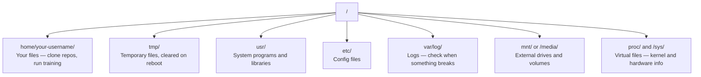

# Linux for AI

> 大多数人工智能在Linux上运行。您需要了解足够的知识才能不会被困住。

** 类型：** 学习
** 语言：**--
** 先决条件：** 第0阶段，第01课
** 时间：** ~30分钟

## Learning Objectives

- 导航Linux文件系统并从命令行执行基本文件操作
- 使用“chmod '和“chown '管理文件权限以解决“Permit dened”错误
- 安装带有“apt”的系统包并为人工智能工作设置新的图形处理盒
- 识别通常会让在远程机器上工作的开发人员陷入困境的macOS与Linux之间的差异

## 问题

您在macOS或Windows上开发。但当您通过ssing进入云图形处理器、租用Lambda实例或启动EC2机器时，您就进入了Ubuntu。终端是您唯一的界面。没有收件箱、没有资源管理器、没有图形用户界面。如果您无法从命令行导航文件系统、安装包和管理进程，那么您就只能在谷歌上搜索“如何在Linux中解压文件”的同时支付空闲的图形处理时间。"

这是生存指南。它确切涵盖了在远程Linux机器上操作人工智能工作所需的内容。仅此而已

## 文件系统布局

Linux将所有内容组织在单个根下'/'。没有“C：\”或“/”。您实际上将触摸的目录：



您的主目录是'~'或'/home/your-userigner '。您所做的几乎一切都发生在这里。

## 基本命令

这15个命令涵盖了你在远程GPU上95%的操作。

### 走动

```bash
pwd                         # Where am I?
ls                          # What's here?
ls -la                      # What's here, including hidden files with details?
cd /path/to/dir             # Go there
cd ~                        # Go home
cd ..                       # Go up one level
```

### 文件和目录

```bash
mkdir my-project            # Create a directory
mkdir -p a/b/c              # Create nested directories in one shot

cp file.txt backup.txt      # Copy a file
cp -r src/ src-backup/      # Copy a directory (recursive)

mv old.txt new.txt          # Rename a file
mv file.txt /tmp/           # Move a file

rm file.txt                 # Delete a file (no trash, it's gone)
rm -rf my-dir/              # Delete a directory and everything inside
```

“rm -ref”是永久性的。已经无法挽回了。在点击输入之前仔细检查路径。

### 读取文件

```bash
cat file.txt                # Print entire file
head -20 file.txt           # First 20 lines
tail -20 file.txt           # Last 20 lines
tail -f log.txt             # Follow a log file in real time (Ctrl+C to stop)
less file.txt               # Scroll through a file (q to quit)
```

### 搜索

```bash
grep "error" training.log           # Find lines containing "error"
grep -r "learning_rate" .           # Search all files in current directory
grep -i "cuda" config.yaml          # Case-insensitive search

find . -name "*.py"                 # Find all Python files under current dir
find . -name "*.ckpt" -size +1G     # Find checkpoint files larger than 1GB
```

## 权限

Linux中的每个文件都有一个所有者和权限位。当脚本无法执行或无法写入目录时，您就会遇到这种情况。

```bash
ls -l train.py
# -rwxr-xr-- 1 user group 2048 Mar 19 10:00 train.py
#  ^^^             owner permissions: read, write, execute
#     ^^^          group permissions: read, execute
#        ^^        everyone else: read only
```

常见修复：

```bash
chmod +x train.sh           # Make a script executable
chmod 755 deploy.sh         # Owner: full, others: read+execute
chmod 644 config.yaml       # Owner: read+write, others: read only

chown user:group file.txt   # Change who owns a file (needs sudo)
```

当某个内容显示“权限被拒绝”时，这几乎总是权限问题。' chmo +x '或' sudo '将解决大多数情况。

## 软件包管理（apt）

Ubuntu使用“apt”。这就是安装系统级软件的方式。

```bash
sudo apt update             # Refresh the package list (always do this first)
sudo apt install -y htop    # Install a package (-y skips confirmation)
sudo apt install -y build-essential  # C compiler, make, etc. Needed by many Python packages
sudo apt install -y tmux    # Terminal multiplexer (keep sessions alive after disconnect)

apt list --installed        # What's installed?
sudo apt remove htop        # Uninstall
```

您将安装在新的图形处理盒上的常见包：

```bash
sudo apt update && sudo apt install -y \
    build-essential \
    git \
    curl \
    wget \
    tmux \
    htop \
    unzip \
    python3-venv
```

## 用户和sudo

您通常以普通用户身份登录。某些操作需要根（管理员）访问权限。

```bash
whoami                      # What user am I?
sudo command                # Run a single command as root
sudo su                     # Become root (exit to go back, use sparingly)
```

在云图形处理器实例上，您通常是唯一一个已经拥有sudo访问权限的用户。不要将所有内容都作为根来运行。仅在需要时使用sudo。

## 流程和系统d

当您的训练暂停时，或者您需要检查正在运行的内容：

```bash
htop                        # Interactive process viewer (q to quit)
ps aux | grep python        # Find running Python processes
kill 12345                  # Gracefully stop process with PID 12345
kill -9 12345               # Force kill (use when graceful doesn't work)
nvidia-smi                  # GPU processes and memory usage
```

Systemd管理服务（后台守护程序）。如果您运行推理服务器，您将使用它：

```bash
sudo systemctl start nginx          # Start a service
sudo systemctl stop nginx           # Stop it
sudo systemctl restart nginx        # Restart it
sudo systemctl status nginx         # Check if it's running
sudo systemctl enable nginx         # Start automatically on boot
```

## 磁盘空间

图形处理器盒的磁盘空间通常有限。模型和数据集快速填充。

```bash
df -h                       # Disk usage for all mounted drives
df -h /home                 # Disk usage for /home specifically

du -sh *                    # Size of each item in current directory
du -sh ~/.cache             # Size of your cache (pip, huggingface models land here)
du -sh /data/checkpoints/   # Check how big your checkpoints are

# Find the biggest space hogs
du -h --max-depth=1 / 2>/dev/null | sort -hr | head -20
```

常见的节省空间：

```bash
# Clear pip cache
pip cache purge

# Clear apt cache
sudo apt clean

# Remove old checkpoints you don't need
rm -rf checkpoints/epoch_01/ checkpoints/epoch_02/
```

## 联网

您将从命令行下载模型、传输文件并点击API。

```bash
# Download files
wget https://example.com/model.bin                   # Download a file
curl -O https://example.com/data.tar.gz              # Same thing with curl
curl -s https://api.example.com/health | python3 -m json.tool  # Hit an API, pretty-print JSON

# Transfer files between machines
scp model.bin user@remote:/data/                     # Copy file to remote machine
scp user@remote:/data/results.csv .                  # Copy file from remote to local
scp -r user@remote:/data/checkpoints/ ./local-dir/   # Copy directory

# Sync directories (faster than scp for large transfers, resumes on failure)
rsync -avz --progress ./data/ user@remote:/data/
rsync -avz --progress user@remote:/results/ ./results/
```

对于任何大的东西，使用rsync而不是scp。它只传输更改的字节并处理中断的连接。

## tmux：保持会议活力

当您通过键盘进入远程盒子时，关闭笔记本电脑会导致您的训练运行中断。tmux可以防止这种情况发生。

```bash
tmux new -s train           # Start a new session named "train"
# ... start your training, then:
# Ctrl+B, then D            # Detach (training keeps running)

tmux ls                     # List sessions
tmux attach -t train        # Reattach to session

# Inside tmux:
# Ctrl+B, then %            # Split pane vertically
# Ctrl+B, then "            # Split pane horizontally
# Ctrl+B, then arrow keys   # Switch between panes
```

始终在tmux内进行长期培训工作。总是.

## 适用于Windows用户的WSL 2

如果您使用Windows，WSL 2为您提供一个真正的Linux环境，无需双引导。

```bash
# In PowerShell (admin)
wsl --install -d Ubuntu-24.04

# After restart, open Ubuntu from Start menu
sudo apt update && sudo apt upgrade -y
```

WSL 2运行真正的Linux内核。本课中的所有内容都在其中运行。您的Windows文件位于WSL内部的'/mnt/c/Worker/YourName/'。

图形处理器passthrough可与Windows端安装的NVIDIA驱动程序配合使用。安装Windows NVIDIA驱动程序（而不是Linux驱动程序），CUDA将在WSL 2中提供。

## Gotchas：macOS到Linux

如果您来自macOS，会让您绊倒的事情：

| macOS | Linux | 注意到 |
|-------|-------|-------|
| “酿造安装” | “sudo apt安装” | 有时包裹名称不同。' brew安装htop ' vs ' sudo apt安装htop '工作原理相同，但' brew安装readline ' vs ' sudo apt安装libreadline-dev '则不同。 |
| '打开文件.文本' | ' xdg-打开文件.文本' | 但远程盒子上没有图形用户界面。使用“cat”或“less”。 |
| “pbCopy”/“pbpaste” | 不可用 | 通过SSH不存在往返于剪贴板的管道。 |
| “~/.zshrc” | '~/.bashrc ' | macOS默认为zsh。大多数Linux服务器使用bash。 |
| '/opp/自制/' | '/SAL/bin/'，'/SAL/Local/bin/' | 二进制存在于不同的地方。 |
| ' sed -i ' s/a/b/'文件' | ' s/a/b/'文件' | macOS sed在“-i”后面需要一个空字符串。Linux则不然。 |
| 不区分大小写的文件系统 | 区分大小写的文件系统 | ' Model. py '和' model.py '是Linux上的两个不同文件。 |
| 行结尾'\n ' | 行结尾'\n ' | 一样的但Windows使用“\r\n”，这会破坏bash脚本。运行“dos2unix”进行修复。 |

## 快速参考卡

```
Navigation:     pwd, ls, cd, find
Files:          cp, mv, rm, mkdir, cat, head, tail, less
Search:         grep, find
Permissions:    chmod, chown, sudo
Packages:       apt update, apt install
Processes:      htop, ps, kill, nvidia-smi
Services:       systemctl start/stop/restart/status
Disk:           df -h, du -sh
Network:        curl, wget, scp, rsync
Sessions:       tmux new/attach/detach
```

## 演习

1. 通过SSH进入任何Linux机器（或打开WSL 2）并导航到您的主目录。创建一个项目文件夹，使用“touch”在其中创建三个空文件，然后使用“ls -la”列出它们。
2. 使用apt安装“htop”，运行它，并识别哪个进程使用了最多的内存。
3. 启动tmux会话，在其中运行“sleep 300”、分离、列出会话并重新连接。
4. 使用“DF -h”检查可用磁盘空间，然后使用“du -sh ~/. ache/*”查找占用缓存中空间的空间。
5. 使用“scp”将文件从本地机器传输到远程机器，然后使用“rsys”进行相同的传输并比较体验。
