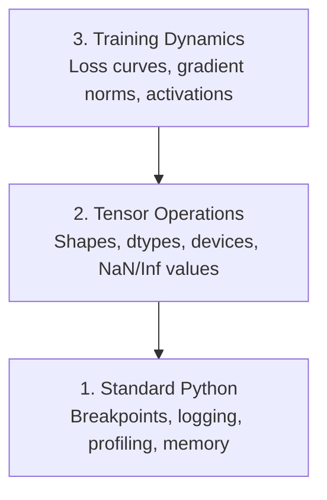

# デバッグとプロファイリング

> 最悪の AI バグはクラッシュしません。壊れたデータで静かに学習し、美しい損失曲線を出します。

**種類:** 実装
**言語:** Python
**前提条件:** レッスン 1（開発環境）、PyTorch の基本的な知識
**時間:** 約 60 分

## 学習目標

- 条件付きの `breakpoint()` と `debug_print` を使い、学習中にテンソルの shape、dtype、NaN 値を調べる
- `cProfile`、`line_profiler`、`tracemalloc` でトレーニングループをプロファイルし、ボトルネックを見つける
- shape の不一致、NaN loss、データリーク、誤ったデバイス上のテンソルといった AI でよくあるバグを検出する
- TensorBoard をセットアップし、損失曲線、重みヒストグラム、勾配分布を可視化する

## 問題

AI コードは通常のコードとは違う失敗のしかたをします。Web アプリならスタックトレース付きでクラッシュします。一方で、設定を間違えたトレーニングループは 8 時間走り、GPU 代を 200 ドル消費し、すべての入力に対して平均値を予測するモデルを生成します。コードは一度もエラーを出しません。原因は、テンソルが間違ったデバイスにあること、`.detach()` を忘れたこと、ラベルが特徴量に漏れていることだったりします。

こうした静かな失敗が時間と計算資源を浪費する前に捕まえるためのデバッグツールが必要です。

## コンセプト

AI のデバッグは 3 つのレベルで考えます。



多くの人はいきなりレベル 3（TensorBoard を眺めること）に飛びつきます。しかし AI バグの 80% はレベル 1 と 2 にあります。

## 作るもの

### Part 1: print デバッグ（ちゃんと効きます）

print デバッグは軽く見られがちです。しかし軽く見るべきではありません。テンソルコードでは、対象を絞った print 文のほうがデバッガで 1 行ずつ進めるより有効です。shape、dtype、値の範囲を一度に見たいからです。

```python
def debug_print(name, tensor):
    print(f"{name}: shape={tensor.shape}, dtype={tensor.dtype}, "
          f"device={tensor.device}, "
          f"min={tensor.min().item():.4f}, max={tensor.max().item():.4f}, "
          f"mean={tensor.mean().item():.4f}, "
          f"has_nan={tensor.isnan().any().item()}")
```

怪しい処理の後にこれを呼び出します。バグが見つかったら print を消します。それだけです。

### Part 2: Python デバッガ（pdb と breakpoint）

組み込みデバッガは AI 作業でもっと評価されるべきです。トレーニングループに `breakpoint()` を入れ、テンソルを対話的に調べます。

```python
def training_step(model, batch, criterion, optimizer):
    inputs, labels = batch
    outputs = model(inputs)
    loss = criterion(outputs, labels)

    if loss.item() > 100 or torch.isnan(loss):
        breakpoint()

    loss.backward()
    optimizer.step()
```

デバッガで停止したら、次のコマンドが役に立ちます。

- `p outputs.shape` で shape を確認する
- `p loss.item()` で loss の値を見る
- `p torch.isnan(outputs).sum()` で NaN の数を数える
- `p model.fc1.weight.grad` で勾配を確認する
- `c` で続行、`q` で終了する

これは条件付きデバッグです。何かがおかしそうなときだけ停止します。10,000 ステップのトレーニングでは、この違いが重要です。

### Part 3: Python ロギング

デバッグが簡単な確認を超えるなら、print 文を logging に置き換えます。

```python
import logging

logging.basicConfig(
    level=logging.INFO,
    format="%(asctime)s [%(levelname)s] %(message)s",
    handlers=[
        logging.FileHandler("training.log"),
        logging.StreamHandler()
    ]
)
logger = logging.getLogger(__name__)

logger.info("Starting training: lr=%.4f, batch_size=%d", lr, batch_size)
logger.warning("Loss spike detected: %.4f at step %d", loss.item(), step)
logger.error("NaN loss at step %d, stopping", step)
```

logging ではタイムスタンプ、重要度、ファイル出力が得られます。午前 3 時にトレーニングが失敗したときに欲しいのは、画面の外へ流れてしまったターミナル出力ではなくログファイルです。

### Part 4: コード区間の時間計測

時間がどこに使われているかを知ることが、最適化の第一歩です。

```python
import time

class Timer:
    def __init__(self, name=""):
        self.name = name

    def __enter__(self):
        self.start = time.perf_counter()
        return self

    def __exit__(self, *args):
        elapsed = time.perf_counter() - self.start
        print(f"[{self.name}] {elapsed:.4f}s")

with Timer("data loading"):
    batch = next(dataloader_iter)

with Timer("forward pass"):
    outputs = model(batch)

with Timer("backward pass"):
    loss.backward()
```

よくある発見は、データ読み込みがトレーニング時間の 60% を使っていることです。この場合の修正は、より速い GPU ではなく DataLoader の `num_workers > 0` です。

### Part 5: cProfile と line_profiler

手動のタイマー以上の情報が必要なときは次を使います。

```bash
python -m cProfile -s cumtime train.py
```

これはすべての関数呼び出しを累積時間順に表示します。行単位でプロファイルするには次を使います。

```bash
pip install line_profiler
```

```python
@profile
def train_step(model, data, target):
    output = model(data)
    loss = F.cross_entropy(output, target)
    loss.backward()
    return loss

# Run with: kernprof -l -v train.py
```

### Part 6: メモリプロファイリング

#### tracemalloc による CPU メモリ確認

```python
import tracemalloc

tracemalloc.start()

# your code here
model = build_model()
data = load_dataset()

snapshot = tracemalloc.take_snapshot()
top_stats = snapshot.statistics("lineno")
for stat in top_stats[:10]:
    print(stat)
```

#### memory_profiler による CPU メモリ確認

```bash
pip install memory_profiler
```

```python
from memory_profiler import profile

@profile
def load_data():
    raw = read_csv("data.csv")       # watch memory jump here
    processed = preprocess(raw)       # and here
    return processed
```

`python -m memory_profiler your_script.py` で実行すると、行単位のメモリ使用量を確認できます。

#### PyTorch による GPU メモリ確認

```python
import torch

if torch.cuda.is_available():
    print(torch.cuda.memory_summary())

    print(f"Allocated: {torch.cuda.memory_allocated() / 1e9:.2f} GB")
    print(f"Cached: {torch.cuda.memory_reserved() / 1e9:.2f} GB")
```

OOM（Out of Memory）に当たったら次を試します。

1. バッチサイズを下げる（必ず最初に試す）
2. `torch.cuda.empty_cache()` でキャッシュ済みメモリを解放する
3. 大きな中間テンソルには `del tensor` の後に `torch.cuda.empty_cache()` を実行する
4. mixed precision（`torch.cuda.amp`）でメモリ使用量を半分にする
5. 非常に深いモデルでは gradient checkpointing を使う

### Part 7: AI でよくあるバグと捕まえ方

#### Shape の不一致

最も多いバグです。モデルが `[batch, channels, height, width]` を期待しているのに、テンソルの shape が `[batch, features]` になっているようなケースです。

```python
def check_shapes(model, sample_input):
    print(f"Input: {sample_input.shape}")
    hooks = []

    def make_hook(name):
        def hook(module, inp, out):
            in_shape = inp[0].shape if isinstance(inp, tuple) else inp.shape
            out_shape = out.shape if hasattr(out, "shape") else type(out)
            print(f"  {name}: {in_shape} -> {out_shape}")
        return hook

    for name, module in model.named_modules():
        hooks.append(module.register_forward_hook(make_hook(name)))

    with torch.no_grad():
        model(sample_input)

    for h in hooks:
        h.remove()
```

サンプルバッチで一度実行してください。モデル内のすべての shape 変換を一覧できます。

#### NaN Loss

NaN loss は何かが発散したことを意味します。よくある原因は次のとおりです。

- learning rate が高すぎる
- カスタム loss 内でゼロ除算している
- 0 または負の数の対数を取っている
- RNN で勾配爆発が起きている

```python
def detect_nan(model, loss, step):
    if torch.isnan(loss):
        print(f"NaN loss at step {step}")
        for name, param in model.named_parameters():
            if param.grad is not None:
                if torch.isnan(param.grad).any():
                    print(f"  NaN gradient in {name}")
                if torch.isinf(param.grad).any():
                    print(f"  Inf gradient in {name}")
        return True
    return False
```

#### データリーク

テストセットで 99% の精度が出ました。素晴らしく聞こえます。これはバグです。

```python
def check_data_leakage(train_set, test_set, id_column="id"):
    train_ids = set(train_set[id_column].tolist())
    test_ids = set(test_set[id_column].tolist())
    overlap = train_ids & test_ids
    if overlap:
        print(f"DATA LEAKAGE: {len(overlap)} samples in both train and test")
        return True
    return False
```

時間方向のリークも確認してください。未来のデータを使って過去を予測するケースです。分割する前に timestamp でソートします。

#### 誤ったデバイス

異なるデバイス（CPU と GPU）上のテンソルは実行時エラーを起こします。しかしテンソルが CPU に残ったまま、他がすべて GPU にある場合、エラーにならず単にトレーニングが遅くなることもあります。

```python
def check_devices(model, *tensors):
    model_device = next(model.parameters()).device
    print(f"Model device: {model_device}")
    for i, t in enumerate(tensors):
        if t.device != model_device:
            print(f"  WARNING: tensor {i} on {t.device}, model on {model_device}")
```

### Part 8: TensorBoard の基本

TensorBoard は、トレーニング中に何が起きているかを時間の経過に沿って見せてくれます。

```bash
pip install tensorboard
```

```python
from torch.utils.tensorboard import SummaryWriter

writer = SummaryWriter("runs/experiment_1")

for step in range(num_steps):
    loss = train_step(model, batch)

    writer.add_scalar("loss/train", loss.item(), step)
    writer.add_scalar("lr", optimizer.param_groups[0]["lr"], step)

    if step % 100 == 0:
        for name, param in model.named_parameters():
            writer.add_histogram(f"weights/{name}", param, step)
            if param.grad is not None:
                writer.add_histogram(f"grads/{name}", param.grad, step)

writer.close()
```

起動します。

```bash
tensorboard --logdir=runs
```

見るべきポイントは次のとおりです。

- **Loss が下がらない**: learning rate が低すぎる、またはモデルアーキテクチャに問題がある
- **Loss が激しく振動する**: learning rate が高すぎる
- **Loss が NaN になる**: 数値不安定性（上の NaN セクションを参照）
- **Train loss は下がるが val loss は上がる**: 過学習
- **Weight ヒストグラムがゼロへ潰れる**: 勾配消失
- **Gradient ヒストグラムが爆発する**: gradient clipping が必要

### Part 9: VS Code デバッガ

対話的にデバッグするには、VS Code で `launch.json` を設定します。

```json
{
    "version": "0.2.0",
    "configurations": [
        {
            "name": "Debug Training",
            "type": "debugpy",
            "request": "launch",
            "program": "${file}",
            "console": "integratedTerminal",
            "justMyCode": false
        }
    ]
}
```

ガターをクリックしてブレークポイントを設定します。Variables ペインでテンソルのプロパティを調べられます。Debug Console では実行途中に任意の Python 式を実行できます。

各変換を見ながらデータ前処理パイプラインをステップ実行したい場合に便利です。

## 使い方

ほとんどの AI バグを捕まえるデバッグワークフローは次のとおりです。

1. **トレーニング前**: サンプルバッチで `check_shapes` を実行する。入力と出力の次元が期待どおりか確認する。
2. **最初の 10 ステップ**: loss、outputs、gradients に `debug_print` を使う。NaN がなく、値が妥当な範囲にあることを確認する。
3. **トレーニング中**: loss、learning rate、gradient norm をログに出す。可視化には TensorBoard を使う。
4. **何かが壊れたとき**: 失敗地点に `breakpoint()` を置く。テンソルを対話的に調べる。
5. **性能を見るとき**: データ読み込み、forward、backward pass の時間を測る。OOM に近い場合はメモリをプロファイルする。

## 仕上げ

デバッグツールキットのスクリプトを実行します。

```bash
python phases/00-setup-and-tooling/12-debugging-and-profiling/code/debug_tools.py
```

AI 固有のバグ診断に役立つプロンプトは `outputs/prompt-debug-ai-code.md` を参照してください。

## 演習

1. `debug_tools.py` を実行し、各セクションの出力を読んでください。ダミーモデルを変更して NaN を発生させ（ヒント: forward pass でゼロ除算する）、検出器が捕まえる様子を確認してください。
2. `cProfile` でトレーニングループをプロファイルし、最も遅い関数を特定してください。
3. `tracemalloc` を使い、データ読み込みパイプラインのどの行が最も多くメモリを確保しているか見つけてください。
4. 簡単なトレーニング実行に TensorBoard をセットアップし、モデルが過学習しているかどうかを確認してください。
5. トレーニングループ内で `breakpoint()` を使ってください。デバッガプロンプトからテンソルの shape、device、gradient 値を調べる練習をしてください。
