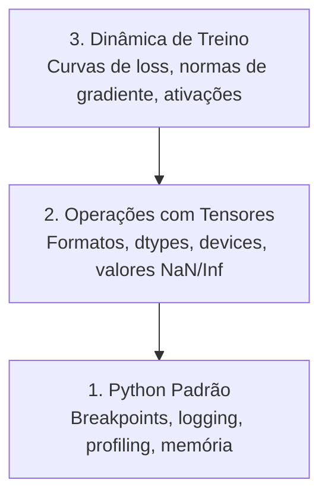

# Debug e Profiling

> Os piores bugs de IA não travam. Eles treinam silenciosamente em lixo e reportam uma curva de loss bonita.

**Tipo:** Build
**Linguagens:** Python
**Pré-requisitos:** Aula 1 (Ambiente de Desenvolvimento), familiaridade básica com PyTorch
**Tempo:** ~60 minutos

## Objetivos de Aprendizado

- Usar `breakpoint()` condicional e `debug_print` para inespecificaçãoionar formatos de tensores, dtypes e valores NaN durante treino
- Fazer profiling de loops de treino com `cProfile`, `line_profiler` e `tracemalloc` para encontrar gargalos
- Detectar bugs comuns de IA: incompatibilidade de formatos, loss NaN, vazamento de dados e tensores em device errado
- Configurar TensorBoard para visualizar curvas de loss, histogramas de pesos e distribuições de gradientes

## O Problema

Código de IA falha diferente do código normal. Um app web trava com stack trace. Um loop de treino mal configurado roda por 8 horas, gasta $200 em GPU e produz um modelo que prevê a média de cada entrada. O código nunca deu erro. O bug era um tensor no device errado, um `.detach()` esquecido ou rótulos vazando pra features.

Você precisa de ferramentas de debug que capturam essas falhas silenciosas antes de desperdiçar seu tempo e compute.

## O Conceito

Debug de IA opera em três níveis:



A maioria das pessoas pula direto pro nível 3 (encarar TensorBoard). Mas 80% dos bugs de IA vivem nos níveis 1 e 2.

## Construa

### Parte 1: Debug com Print (Sim, Funciona)

Debug com print é subestimado. Não deveria ser. Para código com tensores, um print direcionado supera passar no debugger porque você precisa ver formatos, dtypes e faixas de valores de uma vez.

```python
def debug_print(nome, tensor):
    print(f"{nome}: shape={tensor.shape}, dtype={tensor.dtype}, "
          f"device={tensor.device}, "
          f"min={tensor.min().item():.4f}, max={tensor.max().item():.4f}, "
          f"mean={tensor.mean().item():.4f}, "
          f"has_nan={tensor.isnan().any().item()}")
```

Chame isso depois de cada operação suspeita. Quando o bug for encontrado, remova os prints. Simples.

### Parte 2: Debugger do Python (pdb e breakpoint)

O debugger embutido é subutilizado para trabalho de IA. Coloque `breakpoint()` no seu loop de treino e inespecificaçãoione tensores interativamente.

```python
def training_step(model, batch, criterion, optimizer):
    inputs, rótulos = batch
    outputs = model(inputs)
    loss = criterion(outputs, rótulos)

    if loss.item() > 100 or torch.isnan(loss):
        breakpoint()

    loss.backward()
    optimizer.step()
```

Comandos úteis quando o debugger cai:

- `p outputs.shape` para checar formatos
- `p loss.item()` para ver o valor da loss
- `p torch.isnan(outputs).sum()` pra contar NaNs
- `p model.fc1.weight.grad` pra checar gradientes
- `c` para continuar, `q` para sair

### Parte 3: Logging em Python

Substitua prints por logging quando seu debug for além de uma checagem rápida.

```python
import logging

logging.basicConfig(
    level=logging.INFO,
    format="%(asctime)s [%(levelname)s] %(message)s",
    handlers=[
        logging.FileHandler("training.log"),
        logging.StreamHandler()
    ]
)
logger = logging.getLogger(__name__)

logger.info("Starting training: lr=%.4f, batch_size=%d", lr, batch_size)
logger.warning("Loss spike detected: %.4f at step %d", loss.item(), step)
logger.error("NaN loss at step %d, stopping", step)
```

### Parte 4: Cronometrando Seções de Código

```python
import time

class Timer:
    def __init__(self, nome=""):
        self.nome = nome

    def __enter__(self):
        self.start = time.perf_counter()
        return self

    def __exit__(self, *args):
        elapsed = time.time.perf_counter() - self.start
        print(f"[{self.nome}] {elapsed:.4f}s")

with Timer("carregamento de dados"):
    batch = next(dataloader_iter)

with Timer("forward pass"):
    outputs = model(batch)

with Timer("backward pass"):
    loss.backward()
```

Achado comum: carregamento de dados leva 60% do tempo de treino. A solução é `num_workers > 0` no seu DataLoader, não uma GPU mais rápida.

### Parte 5: Bugs Comuns de IA

#### Incompatibilidade de Formato

O bug mais frequente. Um tensor tem formato `[batch, features]` quando o modelo espera `[batch, channels, height, width]`.

#### Loss NaN

Loss NaN significa que algo explodiu. Causas comuns:
- Learning rate alto demais
- Divisão por zero em loss customizada
- Log de zero ou número negativo
- Gradientes explosivos em RNNs

#### Vazamento de Dados

Seu modelo pega 99% de accuracy no test set. Parece ótimo. É um bug.

```python
def check_data_leakage(train_set, test_set, id_column="id"):
    train_ids = set(train_set[id_column].tolist())
    test_ids = set(test_set[id_column].tolist())
    overlap = train_ids & test_ids
    if overlap:
        print(f"VAZAMENTO DE DADOS: {len(overlap)} amostras em train e test")
        return True
    return False
```

#### Device Errado

Tensores em devices diferentes (CPU vs GPU) causam erros de runtime. Mas às vezes um tensor fica silenciosamente na CPU enquanto tudo mais está na GPU e o treino só roda devagar.

### Parte 6: TensorBoard Básico

```python
from torch.utils.tensorboard import SummaryWriter

writer = SummaryWriter("runs/experimento_1")

for step in range(num_steps):
    loss = train_step(model, batch)

    writer.add_scalar("loss/train", loss.item(), step)
    writer.add_scalar("lr", optimizer.param_groups[0]["lr"], step)

writer.close()
```

Inicie:

```bash
tensorboard --logdir=runs
```

O que procurar:
- **Loss não diminui**: Learning rate baixo demais ou problema na arquitetura
- **Loss oscila muito**: Learning rate alto demais
- **Loss vai pra NaN**: Instabilidade numérica
- **Loss de train diminui, val aumenta**: Overajuste
- **Histogramas de pesos colapsando pra zero**: Gradient vanish
- **Histogramas de gradiente explodindo**: Precisa de gradient clipping

### Parte 7: Debugger do VS Code

```json
{
    "version": "0.2.0",
    "configurations": [
        {
            "name": "Debug Training",
            "type": "debugpy",
            "request": "launch",
            "program": "${file}",
            "console": "integratedTerminal",
            "justMyCode": false
        }
    ]
}
```

## Use

Aqui está o fluxo de debug que captura a maioria dos bugs de IA:

1. **Antes do treino**: Rode `check_shapes` com um batch de exemplo. Verifique que dimensões de entrada e saída batem com o esperado.
2. **Primeiros 10 passos**: Use `debug_print` na loss, outputs e gradientes. Confirme que nada é NaN e valores estão em faixas razoáveis.
3. **Durante o treino**: Faça log de loss, learning rate e normas de gradiente. Use TensorBoard para visualização.
4. **Quando algo quebrar**: Coloque `breakpoint()` no ponto de falha. Inespecificaçãoione tensores interativamente.
5. **Para performance**: Cronometre seu carregamento de dados vs forward vs backward. Faça profiling de memória se estiver perto de OOM.

## Entregue

Execute o script de ferramentas de debug:

```bash
python phases/00-setup-and-tooling/12-debugging-and-profiling/code/debug_tools.py
```

## Exercícios

1. Rode `debug_tools.py` e leia a saída de cada seção. Modifique o modelo dummy para introduzir um NaN (dica: divisão por zero no forward pass) e veja o detector capturar.
2. Faça profiling de um loop de treino com `cProfile` e identifique a função mais lenta.
3. Use `tracemalloc` para encontrar qual linha do seu pipeline de carregamento de dados aloca mais memória.
4. Configure o TensorBoard para um run de treino simples e identifique se o modelo está fazendo overajuste.
5. Use `breakpoint()` dentro de um loop de treino. Pratique inespecificaçãoionar formatos de tensores, devices e valores de gradiente do prompt do debugger.
