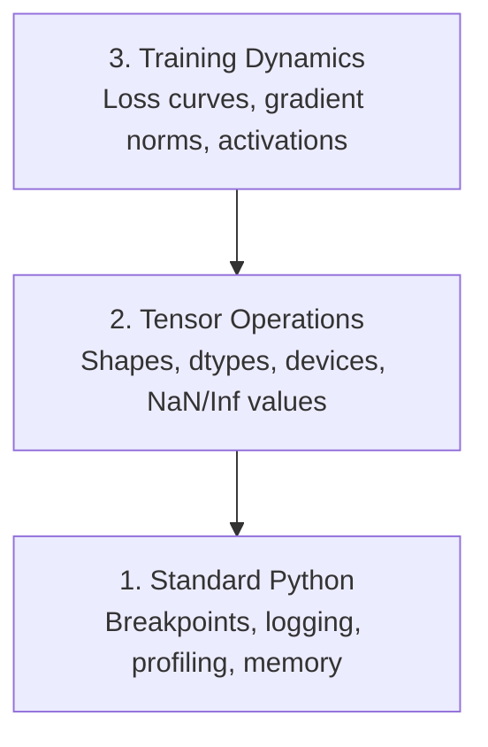

# Hata Ayıklama ve Profil Oluşturma

> En kötü AI hataları çökmez. Çöp konusunda sessizce eğitim alıyorlar ve güzel bir kayıp eğrisi rapor ediyorlar.

**Tür:** Yapım
**Dil:** Python
**Önkoşullar:** Ders 1 (Geliştirme Ortamı), temel PyTorch aşinalığı
**Süre:** ~60 dakika

## Öğrenme Hedefleri

- Eğitim ortasında tensör şekillerini, dtiplerini ve NaN değerlerini incelemek için koşullu `breakpoint()` ve `debug_print` kullanın
- Darboğazları bulmak için `cProfile`, `line_profiler` ve `tracemalloc` ile eğitim döngülerinin profilini çıkarın
- Yaygın AI hatalarını tespit edin: şekil uyumsuzlukları, NaN kaybı, veri sızıntısı ve yanlış cihaz tensörleri
- Kayıp eğrilerini, ağırlık histogramlarını ve gradient dağılımlarını görselleştirmek için TensorBoard'u kurun

## Sorun

AI kodu normal koddan farklı şekilde başarısız olur. Bir web uygulaması yığın izlemeyle çöküyor. Yanlış yapılandırılmış bir eğitim döngüsü 8 saat boyunca çalışır, GPU zamanında 200 ABD doları harcar ve her girişin ortalamasını tahmin eden bir model üretir. Kod asla hata vermedi. Hata, yanlış cihazdaki bir tensörden, unutulmuş bir `.detach()`'den veya özelliklere sızan etiketlerden kaynaklanıyordu.

Bu sessiz arızaları, zamanınızı ve işlemlerinizi boşa harcamadan önce yakalayan hata ayıklama araçlarına ihtiyacınız var.

## Konsept

Yapay zeka hata ayıklaması üç düzeyde çalışır:



Çoğu kişi doğrudan 3. seviyeye atlar (TensorBoard'a bakarak). Ancak yapay zeka hatalarının %80'i 1. ve 2. seviyelerde yaşıyor.

## İnşa Et

### Bölüm 1: Yazdırma Hata Ayıklama (Evet, Çalışıyor)

Yazdırma hata ayıklaması reddedilir. Olmamalı. Tensör kodu için hedefli bir yazdırma ifadesi, bir hata ayıklayıcıdan geçmekten daha iyidir çünkü şekilleri, dtype'leri ve değer aralıklarını aynı anda görmeniz gerekir.

```python
def debug_print(name, tensor):
    print(f"{name}: shape={tensor.shape}, dtype={tensor.dtype}, "
          f"device={tensor.device}, "
          f"min={tensor.min().item():.4f}, max={tensor.max().item():.4f}, "
          f"mean={tensor.mean().item():.4f}, "
          f"has_nan={tensor.isnan().any().item()}")
```

Her şüpheli operasyondan sonra bunu arayın. Hata bulunduğunda baskıları kaldırın. Basit.

### Bölüm 2: Python Hata Ayıklayıcı (pdb ve kesme noktası)

Yerleşik hata ayıklayıcı, yapay zeka çalışmaları açısından yeterince önemsenmiyor. `breakpoint()`'yi eğitim döngünüze bırakın ve tensörleri etkileşimli olarak inceleyin.

```python
def training_step(model, batch, criterion, optimizer):
    inputs, labels = batch
    outputs = model(inputs)
    loss = criterion(outputs, labels)

    if loss.item() > 100 or torch.isnan(loss):
        breakpoint()

    loss.backward()
    optimizer.step()
```

Hata ayıklayıcı sizi bıraktığında yararlı komutlar:

- `p outputs.shape` şekilleri kontrol etmek için
- Kayıp değerini görmek için `p loss.item()`
- NaN'leri saymak için `p torch.isnan(outputs).sum()`
- gradient'leri kontrol etmek için `p model.fc1.weight.grad`
- `c` devam edecek, `q` çıkacak

Bu koşullu hata ayıklamadır. Yalnızca bir şeyler ters gittiğinde durursunuz. 10.000 adımlık bir eğitim koşusu için bu önemlidir.

### Bölüm 3: Python Günlüğü

Hata ayıklama işleminiz hızlı bir kontrolün ötesine geçtiğinde yazdırma ifadelerini günlük kaydıyla değiştirin.

```python
import logging

logging.basicConfig(
    level=logging.INFO,
    format="%(asctime)s [%(levelname)s] %(message)s",
    handlers=[
        logging.FileHandler("training.log"),
        logging.StreamHandler()
    ]
)
logger = logging.getLogger(__name__)

logger.info("Starting training: lr=%.4f, batch_size=%d", lr, batch_size)
logger.warning("Loss spike detected: %.4f at step %d", loss.item(), step)
logger.error("NaN loss at step %d, stopping", step)
```

Günlüğe kaydetme size zaman damgaları, önem düzeyleri ve dosya çıktısı sağlar. Bir eğitim çalıştırması sabah saat 3'te başarısız olduğunda, ekranın dışına kaydırılan terminal çıktısı değil, bir günlük dosyası istersiniz.

### Bölüm 4: Zamanlama Kodu Bölümleri

Zamanın nereye gittiğini bilmek optimizasyonun ilk adımıdır.

```python
import time

class Timer:
    def __init__(self, name=""):
        self.name = name

    def __enter__(self):
        self.start = time.perf_counter()
        return self

    def __exit__(self, *args):
        elapsed = time.perf_counter() - self.start
        print(f"[{self.name}] {elapsed:.4f}s")

with Timer("data loading"):
    batch = next(dataloader_iter)

with Timer("forward pass"):
    outputs = model(batch)

with Timer("backward pass"):
    loss.backward()
```

Ortak bulgu: veri yükleme, eğitim süresinin %60'ını alır. Çözüm, daha hızlı bir GPU değil, DataLoader'ınızda `num_workers > 0`'dir.

### Bölüm 5: cProfile ve line_profiler

Manuel zamanlayıcılardan daha fazlasına ihtiyacınız olduğunda:

```bash
python -m cProfile -s cumtime train.py
```

Bu, her işlev çağrısını kümülatif zamana göre sıralanmış olarak gösterir. Satır satır profil oluşturma için:

```bash
pip install line_profiler
```

```python
@profile
def train_step(model, data, target):
    output = model(data)
    loss = F.cross_entropy(output, target)
    loss.backward()
    return loss

# Run with: kernprof -l -v train.py
```

### Bölüm 6: Bellek Profili Oluşturma

#### tracemalloc'lu CPU Belleği

```python
import tracemalloc

tracemalloc.start()

# your code here
model = build_model()
data = load_dataset()

snapshot = tracemalloc.take_snapshot()
top_stats = snapshot.statistics("lineno")
for stat in top_stats[:10]:
    print(stat)
```

#### Memory_profiler ile CPU Belleği

```bash
pip install memory_profiler
```

```python
from memory_profiler import profile

@profile
def load_data():
    raw = read_csv("data.csv")       # watch memory jump here
    processed = preprocess(raw)       # and here
    return processed
```

Satır satır bellek kullanımını görmek için `python -m memory_profiler your_script.py` ile çalıştırın.

#### PyTorch ile GPU Belleği

```python
import torch

if torch.cuda.is_available():
    print(torch.cuda.memory_summary())

    print(f"Allocated: {torch.cuda.memory_allocated() / 1e9:.2f} GB")
    print(f"Cached: {torch.cuda.memory_reserved() / 1e9:.2f} GB")
```

OOM'a (Bellek Yetersiz) bastığınızda:

1. Parti boyutunu azaltın (her zaman denenecek ilk şey)
2. Önbelleğe alınmış belleği boşaltmak için `torch.cuda.empty_cache()` kullanın
3. Büyük ara ürünler için `del tensor` ve ardından `torch.cuda.empty_cache()` kullanın
4. Bellek kullanımını yarıya indirmek için karma hassasiyeti (`torch.cuda.amp`) kullanın
5. Çok derin modeller için gradient kontrol noktasını kullanın

### Bölüm 7: Yaygın Yapay Zeka Hataları ve Bunları Nasıl Yakalayabilirsiniz?

#### Şekil Uyuşmazlığı

En sık görülen hata. Model `[batch, channels, height, width]` beklediğinde tensör `[batch, features]` şekline sahiptir.

```python
def check_shapes(model, sample_input):
    print(f"Input: {sample_input.shape}")
    hooks = []

    def make_hook(name):
        def hook(module, inp, out):
            in_shape = inp[0].shape if isinstance(inp, tuple) else inp.shape
            out_shape = out.shape if hasattr(out, "shape") else type(out)
            print(f"  {name}: {in_shape} -> {out_shape}")
        return hook

    for name, module in model.named_modules():
        hooks.append(module.register_forward_hook(make_hook(name)))

    with torch.no_grad():
        model(sample_input)

    for h in hooks:
        h.remove()
```

Bunu bir kez örnek toplu iş ile çalıştırın. Modelinizdeki her şekil dönüşümünü haritalandırır.

#### NaN Kaybı

NaN kaybı bir şeyin patladığı anlamına gelir. Yaygın nedenler:

- Öğrenme oranı çok yüksek
- Özel kayıpta sıfıra bölme
- Sıfır veya negatif sayının günlüğü
- RNN'lerde gradient'lerin patlatılması

```python
def detect_nan(model, loss, step):
    if torch.isnan(loss):
        print(f"NaN loss at step {step}")
        for name, param in model.named_parameters():
            if param.grad is not None:
                if torch.isnan(param.grad).any():
                    print(f"  NaN gradient in {name}")
                if torch.isinf(param.grad).any():
                    print(f"  Inf gradient in {name}")
        return True
    return False
```

#### Veri Sızıntısı

Modeliniz test setinde %99 doğruluk elde ediyor. Kulağa harika geliyor. Bu bir hata.

```python
def check_data_leakage(train_set, test_set, id_column="id"):
    train_ids = set(train_set[id_column].tolist())
    test_ids = set(test_set[id_column].tolist())
    overlap = train_ids & test_ids
    if overlap:
        print(f"DATA LEAKAGE: {len(overlap)} samples in both train and test")
        return True
    return False
```

Ayrıca zamansal sızıntıyı da kontrol edin: geçmişi tahmin etmek için gelecekteki verileri kullanmak. Bölmeden önce zaman damgasına göre sıralayın.

#### Yanlış Cihaz

Farklı cihazlardaki (CPU ve GPU) tensörler çalışma zamanı hatalarına neden olur. Ancak bazen geri kalan her şey GPU'dayken tensör sessizce CPU'da kalır ve eğitim yavaş çalışır.

```python
def check_devices(model, *tensors):
    model_device = next(model.parameters()).device
    print(f"Model device: {model_device}")
    for i, t in enumerate(tensors):
        if t.device != model_device:
            print(f"  WARNING: tensor {i} on {t.device}, model on {model_device}")
```

### Bölüm 8: TensorBoard Temelleri

TensorBoard size zaman içinde antrenmanda neler olduğunu gösterir.

```bash
pip install tensorboard
```

```python
from torch.utils.tensorboard import SummaryWriter

writer = SummaryWriter("runs/experiment_1")

for step in range(num_steps):
    loss = train_step(model, batch)

    writer.add_scalar("loss/train", loss.item(), step)
    writer.add_scalar("lr", optimizer.param_groups[0]["lr"], step)

    if step % 100 == 0:
        for name, param in model.named_parameters():
            writer.add_histogram(f"weights/{name}", param, step)
            if param.grad is not None:
                writer.add_histogram(f"grads/{name}", param.grad, step)

writer.close()
```

Başlatın:

```bash
tensorboard --logdir=runs
```

Ne aranmalı:

- **Kayıp azalmıyor**: Öğrenme oranı çok düşük veya model mimarisi sorunu
- **Kayıp çılgınca salınıyor**: Öğrenme oranı çok yüksek
- **Kayıp NaN'e gidiyor**: Sayısal istikrarsızlık (yukarıdaki NaN bölümüne bakın)
- **Tren kaybı azalıyor, değer kaybı artıyor**: Aşırı uyum
- **Ağırlık histogramları sıfıra çöküyor**: gradient'lerin kaybolması
- **Gradient patlayan histogramlar**: gradient kırpması gerekiyor

### Bölüm 9: VS Kod Hata Ayıklayıcısı

Etkileşimli hata ayıklama için VS Kodunu `launch.json` ile yapılandırın:

```json
{
    "version": "0.2.0",
    "configurations": [
        {
            "name": "Debug Training",
            "type": "debugpy",
            "request": "launch",
            "program": "${file}",
            "console": "integratedTerminal",
            "justMyCode": false
        }
    ]
}
```

Oluğa tıklayarak kesme noktalarını ayarlayın. Tensör özelliklerini incelemek için Değişkenler bölmesini kullanın. Hata Ayıklama Konsolu, yürütmenin ortasında rastgele Python ifadelerini çalıştırmanıza olanak tanır.

Her dönüşümü görmek istediğiniz veri ön işleme ardışık düzenlerinde adım atmak için kullanışlıdır.

## Kullan onu

Yapay zeka hatalarının çoğunu yakalayan hata ayıklama iş akışı:

1. **Eğitimden önce**: `check_shapes`'yi örnek toplu iş ile çalıştırın. Giriş ve çıkış boyutlarının beklentilerle eşleştiğini doğrulayın.
2. **İlk 10 adım**: Kayıp, çıkışlar ve gradient'lerde `debug_print`'yi kullanın. Hiçbir şeyin NaN olmadığını ve değerlerin makul aralıklarda olduğunu doğrulayın.
3. **Eğitim sırasında**: Günlük kaybı, öğrenme oranı ve gradient normları. Görselleştirme için TensorBoard'ı kullanın.
4. **Bir şey bozulduğunda**: `breakpoint()`'yi arıza noktasına bırakın. Tensörleri etkileşimli olarak inceleyin.
5. **Performans için**: Veri yükleme işleminizi ileri ve geri geçişe göre zamanlayın. OOM yakınındaysanız profil belleği.

## Gönderin

Hata ayıklama araç seti komut dosyasını çalıştırın:

```bash
python phases/00-setup-and-tooling/12-debugging-and-profiling/code/debug_tools.py
```

Yapay zekaya özgü hataları teşhis etmeye yardımcı olan bir prompt için `outputs/prompt-debug-ai-code.md`'ye bakın.

## Egzersizler

1. `debug_tools.py`'yi çalıştırın ve her bölümün çıktısını okuyun. Bir NaN eklemek için kukla modeli değiştirin (ipucu: ileri geçişte sıfıra bölün) ve dedektörün onu yakalamasını izleyin.
2. `cProfile` ile bir eğitim döngüsünün profilini çıkarın ve en yavaş işlevi belirleyin.
3. Veri yükleme ardışık düzeninizde hangi satırın en fazla belleği ayırdığını bulmak için `tracemalloc`'yi kullanın.
4. Basit bir eğitim çalışması için TensorBoard'u kurun ve modelin aşırı uygun olup olmadığını belirleyin.
5. `breakpoint()`'yi bir eğitim döngüsü içinde kullanın. prompt hata ayıklayıcısından tensör şekillerini, aygıtlarını ve gradient değerlerini inceleme alıştırması yapın.
