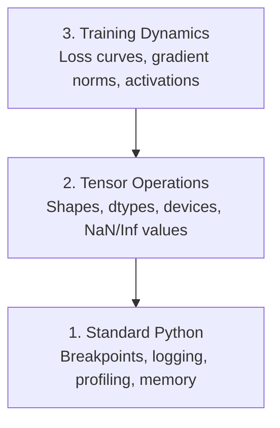

# 调试和分析

> 最糟糕的人工智能错误不会崩溃。他们默默地在垃圾上训练，并报告了一条美丽的损失曲线。

** 类型：** 构建
** 语言：** Python
** 先决条件：** 第1课（开发环境），基本的PyTorch熟悉程度
** 时间：** ~60分钟

## 学习目标

- 使用条件“断点（）”和“dev_print”在训练中检查张量形状、dtypes和NaN值
- 使用“cProfile”、“line_profiler”和“traemalloc”循环进行配置文件训练以查找瓶颈
- 检测常见人工智能错误：形状不匹配、NaN丢失、数据泄露和错误设备张量
- 设置TensorBoard以可视化损失曲线、权重矩形图和梯度分布

## 问题

AI代码的失败与常规代码不同。Web应用程序崩溃并出现堆栈跟踪。配置错误的训练循环运行8小时，消耗200美元的图形处理时间，并生成一个预测每个输入平均值的模型。代码永远不会出错。该错误是错误设备上的张量、被遗忘的'. disconnect（）'或标签泄漏到功能中。

您需要调试工具来捕捉这些无声故障，以免它们浪费您的时间和计算。

## 概念

人工智能调试分为三个级别：



大多数人直接跳到第3级（盯着TensorBoard）。但80%的人工智能漏洞生活在1级和2级。

## 建设党

### 第1部分：打印收件箱（是的，它有效）

打印调试被驳回。不应该。对于张量代码，有针对性的打印声明优于分步执行调试器，因为您需要同时查看形状、数据类型和值范围。

```python
def debug_print(name, tensor):
    print(f"{name}: shape={tensor.shape}, dtype={tensor.dtype}, "
          f"device={tensor.device}, "
          f"min={tensor.min().item():.4f}, max={tensor.max().item():.4f}, "
          f"mean={tensor.mean().item():.4f}, "
          f"has_nan={tensor.isnan().any().item()}")
```

每次可疑操作后都打电话给这个。发现错误后，删除指纹。简单.

### 第2部分：Python调试器（PDL和断点）

内置调试器对于人工智能工作的评价被低估了。将“断点（）”放入训练循环中并交互式检查张量。

```python
def training_step(model, batch, criterion, optimizer):
    inputs, labels = batch
    outputs = model(inputs)
    loss = criterion(outputs, labels)

    if loss.item() > 100 or torch.isnan(loss):
        breakpoint()

    loss.backward()
    optimizer.step()
```

当调试器让您加入时，有用的命令：

- ' p outports.shape '检查形状
- ' p loss. title（）'查看损失值
- ' p torch.isnan（输出）.sum（）'来计算NaN
- ' p model.fc1.weight.grad '检查梯度
- ' c '表示继续，' q '退出

这是条件调试。只有当事情看起来不对劲时，你才会停下来。对于10，000步的训练跑来说，这很重要。

### 第3部分：Python日志记录

当调试超出快速检查范围时，用日志记录替换打印陈述。

```python
import logging

logging.basicConfig(
    level=logging.INFO,
    format="%(asctime)s [%(levelname)s] %(message)s",
    handlers=[
        logging.FileHandler("training.log"),
        logging.StreamHandler()
    ]
)
logger = logging.getLogger(__name__)

logger.info("Starting training: lr=%.4f, batch_size=%d", lr, batch_size)
logger.warning("Loss spike detected: %.4f at step %d", loss.item(), step)
logger.error("NaN loss at step %d, stopping", step)
```

日志记录为您提供时间戳、严重性级别和文件输出。当训练运行在凌晨3点失败时，您需要的是日志文件，而不是滚动离开屏幕的终端输出。

### 第4部分：定时代码部分

了解时间去了哪里是优化的第一步。

```python
import time

class Timer:
    def __init__(self, name=""):
        self.name = name

    def __enter__(self):
        self.start = time.perf_counter()
        return self

    def __exit__(self, *args):
        elapsed = time.perf_counter() - self.start
        print(f"[{self.name}] {elapsed:.4f}s")

with Timer("data loading"):
    batch = next(dataloader_iter)

with Timer("forward pass"):
    outputs = model(batch)

with Timer("backward pass"):
    loss.backward()
```

共同发现：数据加载花费了60%的训练时间。修复方法是您的DataPlayer中的“num_worker> 0”，而不是更快的图形处理器。

### 第5部分：cProfile和line_profiler

当您需要的不仅仅是手动计时器时：

```bash
python -m cProfile -s cumtime train.py
```

这显示了按累积时间排序的每个函数调用。对于逐行分析：

```bash
pip install line_profiler
```

```python
@profile
def train_step(model, data, target):
    output = model(data)
    loss = F.cross_entropy(output, target)
    loss.backward()
    return loss

# Run with: kernprof -l -v train.py
```

### 第6部分：内存分析

#### 带有Tracemaloc的中央处理器内存

```python
import tracemalloc

tracemalloc.start()

# your code here
model = build_model()
data = load_dataset()

snapshot = tracemalloc.take_snapshot()
top_stats = snapshot.statistics("lineno")
for stat in top_stats[:10]:
    print(stat)
```

#### 带有内存_profiler的中央处理器内存

```bash
pip install memory_profiler
```

```python
from memory_profiler import profile

@profile
def load_data():
    raw = read_csv("data.csv")       # watch memory jump here
    processed = preprocess(raw)       # and here
    return processed
```

使用' python-m内存_profiler your_Script.py '运行以查看逐行内存使用情况。

#### 使用PyTorch的图形处理器内存

```python
import torch

if torch.cuda.is_available():
    print(torch.cuda.memory_summary())

    print(f"Allocated: {torch.cuda.memory_allocated() / 1e9:.2f} GB")
    print(f"Cached: {torch.cuda.memory_reserved() / 1e9:.2f} GB")
```

当您点击OOM（内存不足）时：

1. 减少批量大小（始终尝试的第一件事）
2. 使用“torch.cuda.empty_ache（）”释放缓存内存
3. 对于大型中间产品，使用“del tensor”，然后使用“torch.cuda.empty_ache（）”
4. 使用混合精度（“torch.cuda.amp”）将内存使用量减半
5. 对非常深的模型使用梯度检查点

### 第7部分：常见的人工智能错误以及如何捕获它们

#### 形状不匹配

最常见的错误。当模型期望“[批次、通道、高度、宽度]'时，张量的形状为“[批次、特征]'。

```python
def check_shapes(model, sample_input):
    print(f"Input: {sample_input.shape}")
    hooks = []

    def make_hook(name):
        def hook(module, inp, out):
            in_shape = inp[0].shape if isinstance(inp, tuple) else inp.shape
            out_shape = out.shape if hasattr(out, "shape") else type(out)
            print(f"  {name}: {in_shape} -> {out_shape}")
        return hook

    for name, module in model.named_modules():
        hooks.append(module.register_forward_hook(make_hook(name)))

    with torch.no_grad():
        model(sample_input)

    for h in hooks:
        h.remove()
```

使用样本批次运行一次。它映射模型中的每个形状变换。

#### NaN损失

NaN的损失意味着有东西爆炸了。常见原因：

- 学习率太高
- 定制损失按零除
- 零或负数的对数
- RNN中的梯度爆炸

```python
def detect_nan(model, loss, step):
    if torch.isnan(loss):
        print(f"NaN loss at step {step}")
        for name, param in model.named_parameters():
            if param.grad is not None:
                if torch.isnan(param.grad).any():
                    print(f"  NaN gradient in {name}")
                if torch.isinf(param.grad).any():
                    print(f"  Inf gradient in {name}")
        return True
    return False
```

#### 数据泄露

您的模型在测试集上获得99%的准确率。听起来不错这是一个错误。

```python
def check_data_leakage(train_set, test_set, id_column="id"):
    train_ids = set(train_set[id_column].tolist())
    test_ids = set(test_set[id_column].tolist())
    overlap = train_ids & test_ids
    if overlap:
        print(f"DATA LEAKAGE: {len(overlap)} samples in both train and test")
        return True
    return False
```

还要检查时间泄漏：使用未来数据来预测过去。拆分前按时间戳排序。

#### 错误器械

不同设备上的张量（中央处理器与图形处理器）会导致运行时错误。但有时张量默默地停留在中央处理器上，而其他一切都在图形处理器上，训练运行得很慢。

```python
def check_devices(model, *tensors):
    model_device = next(model.parameters()).device
    print(f"Model device: {model_device}")
    for i, t in enumerate(tensors):
        if t.device != model_device:
            print(f"  WARNING: tensor {i} on {t.device}, model on {model_device}")
```

### 第8部分：TensorBoard基础知识

TensorBoard向您展示训练中随着时间的推移发生的事情。

```bash
pip install tensorboard
```

```python
from torch.utils.tensorboard import SummaryWriter

writer = SummaryWriter("runs/experiment_1")

for step in range(num_steps):
    loss = train_step(model, batch)

    writer.add_scalar("loss/train", loss.item(), step)
    writer.add_scalar("lr", optimizer.param_groups[0]["lr"], step)

    if step % 100 == 0:
        for name, param in model.named_parameters():
            writer.add_histogram(f"weights/{name}", param, step)
            if param.grad is not None:
                writer.add_histogram(f"grads/{name}", param.grad, step)

writer.close()
```

启动它：

```bash
tensorboard --logdir=runs
```

要寻找什么：

- ** 损失没有减少 **：学习率太低，或模型架构问题
- ** 损失剧烈波动 **：学习率太高
- ** NaN损失 **：数值不稳定（请参阅上面的NaN部分）
- ** 列车损失减少，valle损失增加 **：过度装配
- ** 权重统计图崩溃为零 **：消失的梯度
- ** 渐变度图爆炸 **：需要渐变度剪裁

### 第9部分：VS代码调试器

对于交互式调试，请使用“launch.json”配置VS Code：

```json
{
    "version": "0.2.0",
    "configurations": [
        {
            "name": "Debug Training",
            "type": "debugpy",
            "request": "launch",
            "program": "${file}",
            "console": "integratedTerminal",
            "justMyCode": false
        }
    ]
}
```

通过单击排水沟设置断点。使用“变量”面板检查张量属性。Inbox控制台允许您在执行过程中运行任意Python运算式。

对于分步执行您想要查看每个转换的数据预处理管道非常有用。

## 使用它

以下是捕获大多数AI错误的调试工作流程：

1. ** 训练前 **：使用样本批次运行“check_shaves”。验证输入和输出维度是否符合预期。
2. ** 前10个步骤 **：在损失、输出和梯度上使用“dev_print”。确认没有任何物质是NaN并且值在合理范围内。
3. ** 训练期间 **：日志损失、学习率和梯度规范。使用TensorBoard进行可视化。
4. ** 当某个东西损坏时 **：在故障点删除“断点（）”。交互式检查张量。
5. ** 为了性能 **：为数据加载与向前传递与向后传递的时间。如果您接近OOM，请配置文件内存。

## 把它运

运行调试工具包脚本：

```bash
python phases/00-setup-and-tooling/12-debugging-and-profiling/code/debug_tools.py
```

请参阅“outluts/prompt-debug-ai-code.md”以获取帮助诊断特定于AI的错误的提示。

## 演习

1. 运行' debug_tools.py '并阅读每个部分的输出。修改虚拟模型以引入NaN（提示：在正向传递中除以零）并观察检测器捕获它。
2. 使用“cProfile”描述训练循环并识别最慢的函数。
3. 使用“Tracemaloc”查找数据加载管道中哪一行分配了最多内存。
4. 设置TensorBoard以进行简单的训练运行并确定模型是否过度适合。
5. 在训练循环中使用“断点（）”。练习从调试器提示符检查张量形状、设备和梯度值。
