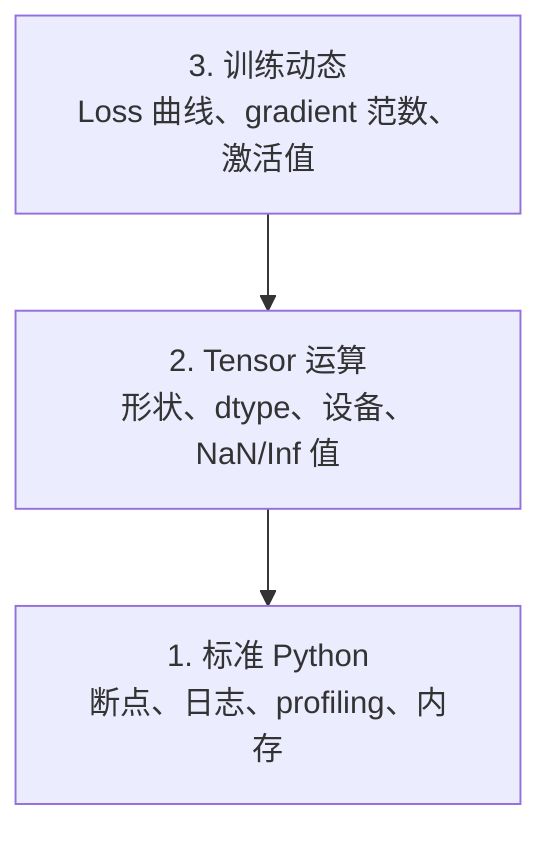

# 调试与性能剖析（Debugging and Profiling）

> 译注：本文译自同目录 [`en.md`](./en.md)。术语遵循仓根 [TRANSLATION_GUIDE.md](../../../../TRANSLATION_GUIDE.md)。

> 最糟糕的 AI bug 不会崩溃。它们会悄无声息地在垃圾数据上训练，还顺便给你画一条漂亮的 loss 曲线。

**Type:** Build
**Language:** Python
**Prerequisites:** Lesson 1 (Dev Environment), basic PyTorch familiarity
**Time:** ~60 minutes

## 学习目标（Learning Objectives）

- 用条件式 `breakpoint()` 和 `debug_print` 在训练过程中检查张量的 shape、dtype 以及 NaN 值
- 用 `cProfile`、`line_profiler`、`tracemalloc` 对训练循环进行 profile，定位瓶颈
- 识别常见的 AI bug：shape 不匹配、NaN loss、数据泄漏、张量在错误的 device 上
- 配置 TensorBoard 来可视化 loss 曲线、权重直方图、梯度分布

## 问题（The Problem）

AI 代码出错的方式和普通代码不一样。Web 应用崩了会给你一条 stack trace；而一个配置错的训练循环会跑 8 小时、烧掉 200 美元的 GPU 时长，最后产出一个对任何输入都预测均值的模型。代码从未报错。bug 可能是某个张量在错的 device 上、某处忘了 `.detach()`，或者标签泄漏到了特征里。

你需要一些调试工具，在它们浪费你时间和算力之前，把这些静默故障揪出来。

## 概念（The Concept）

AI 调试可以分三层：



大多数人一上来就直接奔第 3 层（盯着 TensorBoard 看）。但 80% 的 AI bug 其实活在第 1 层和第 2 层。

## 动手实现（Build It）

### Part 1: Print 调试（是的，它真的管用）

Print 调试经常被嫌弃，但其实不该。对张量代码来说，一句精准的 print 比单步调试器要好用——因为你需要一次性看到 shape、dtype 和数值范围。

```python
def debug_print(name, tensor):
    print(f"{name}: shape={tensor.shape}, dtype={tensor.dtype}, "
          f"device={tensor.device}, "
          f"min={tensor.min().item():.4f}, max={tensor.max().item():.4f}, "
          f"mean={tensor.mean().item():.4f}, "
          f"has_nan={tensor.isnan().any().item()}")
```

在每一个可疑的算子之后调用它。bug 找到后把 print 删掉。简单粗暴。

### Part 2: Python 调试器（pdb 和 breakpoint）

Python 自带的调试器在 AI 场景里被严重低估了。在训练循环里丢一个 `breakpoint()`，就能交互式地检查张量。

```python
def training_step(model, batch, criterion, optimizer):
    inputs, labels = batch
    outputs = model(inputs)
    loss = criterion(outputs, labels)

    if loss.item() > 100 or torch.isnan(loss):
        breakpoint()

    loss.backward()
    optimizer.step()
```

调试器停下来后，常用命令：

- `p outputs.shape` 查看 shape
- `p loss.item()` 看 loss 值
- `p torch.isnan(outputs).sum()` 数 NaN 个数
- `p model.fc1.weight.grad` 检查梯度
- `c` 继续运行，`q` 退出

这是**条件式调试**：只在出问题的时候才停下。对一个跑 10000 步的训练来说，这一点很关键。

### Part 3: Python Logging

当调试需求超出"看一眼"的范围，就把 print 换成 logging。

```python
import logging

logging.basicConfig(
    level=logging.INFO,
    format="%(asctime)s [%(levelname)s] %(message)s",
    handlers=[
        logging.FileHandler("training.log"),
        logging.StreamHandler()
    ]
)
logger = logging.getLogger(__name__)

logger.info("Starting training: lr=%.4f, batch_size=%d", lr, batch_size)
logger.warning("Loss spike detected: %.4f at step %d", loss.item(), step)
logger.error("NaN loss at step %d, stopping", step)
```

Logging 提供时间戳、严重级别和文件输出。当一次训练在凌晨 3 点挂掉时，你想要的是一份 log 文件，而不是已经滚出屏幕的终端输出。

### Part 4: 给代码段计时

知道时间花在哪儿，是优化的第一步。

```python
import time

class Timer:
    def __init__(self, name=""):
        self.name = name

    def __enter__(self):
        self.start = time.perf_counter()
        return self

    def __exit__(self, *args):
        elapsed = time.perf_counter() - self.start
        print(f"[{self.name}] {elapsed:.4f}s")

with Timer("data loading"):
    batch = next(dataloader_iter)

with Timer("forward pass"):
    outputs = model(batch)

with Timer("backward pass"):
    loss.backward()
```

常见结论：数据加载占了 60% 的训练时间。解决方案是 DataLoader 里设 `num_workers > 0`，而不是换更快的 GPU。

### Part 5: cProfile 与 line_profiler

当手工计时不够用时：

```bash
python -m cProfile -s cumtime train.py
```

它会列出所有函数调用，按累计耗时排序。要做按行剖析：

```bash
pip install line_profiler
```

```python
@profile
def train_step(model, data, target):
    output = model(data)
    loss = F.cross_entropy(output, target)
    loss.backward()
    return loss

# Run with: kernprof -l -v train.py
```

### Part 6: 内存剖析

#### 用 tracemalloc 看 CPU 内存

```python
import tracemalloc

tracemalloc.start()

# your code here
model = build_model()
data = load_dataset()

snapshot = tracemalloc.take_snapshot()
top_stats = snapshot.statistics("lineno")
for stat in top_stats[:10]:
    print(stat)
```

#### 用 memory_profiler 看 CPU 内存

```bash
pip install memory_profiler
```

```python
from memory_profiler import profile

@profile
def load_data():
    raw = read_csv("data.csv")       # watch memory jump here
    processed = preprocess(raw)       # and here
    return processed
```

用 `python -m memory_profiler your_script.py` 运行，能看到逐行的内存占用。

#### 用 PyTorch 看 GPU 内存

```python
import torch

if torch.cuda.is_available():
    print(torch.cuda.memory_summary())

    print(f"Allocated: {torch.cuda.memory_allocated() / 1e9:.2f} GB")
    print(f"Cached: {torch.cuda.memory_reserved() / 1e9:.2f} GB")
```

撞上 OOM（Out of Memory，显存不够）时：

1. 减小 batch size（永远先试这个）
2. 用 `torch.cuda.empty_cache()` 释放被缓存的显存
3. 对大的中间张量先 `del tensor`，再 `torch.cuda.empty_cache()`
4. 用混合精度（`torch.cuda.amp`），显存占用直接减半
5. 对很深的模型用 gradient checkpointing

### Part 7: 常见 AI Bug 与排查方法

#### Shape 不匹配

最常见的 bug。一个张量是 `[batch, features]`，但模型期望 `[batch, channels, height, width]`。

```python
def check_shapes(model, sample_input):
    print(f"Input: {sample_input.shape}")
    hooks = []

    def make_hook(name):
        def hook(module, inp, out):
            in_shape = inp[0].shape if isinstance(inp, tuple) else inp.shape
            out_shape = out.shape if hasattr(out, "shape") else type(out)
            print(f"  {name}: {in_shape} -> {out_shape}")
        return hook

    for name, module in model.named_modules():
        hooks.append(module.register_forward_hook(make_hook(name)))

    with torch.no_grad():
        model(sample_input)

    for h in hooks:
        h.remove()
```

用一个 sample batch 跑一次，它会把模型里每一处 shape 变换都打出来。

#### NaN Loss

NaN loss 意味着某处炸了。常见原因：

- 学习率太高
- 自定义 loss 里出现除零
- 对 0 或负数取 log
- RNN 中梯度爆炸

```python
def detect_nan(model, loss, step):
    if torch.isnan(loss):
        print(f"NaN loss at step {step}")
        for name, param in model.named_parameters():
            if param.grad is not None:
                if torch.isnan(param.grad).any():
                    print(f"  NaN gradient in {name}")
                if torch.isinf(param.grad).any():
                    print(f"  Inf gradient in {name}")
        return True
    return False
```

#### 数据泄漏（Data Leakage）

你的模型在测试集上拿了 99% 的准确率。听起来很棒。其实是 bug。

```python
def check_data_leakage(train_set, test_set, id_column="id"):
    train_ids = set(train_set[id_column].tolist())
    test_ids = set(test_set[id_column].tolist())
    overlap = train_ids & test_ids
    if overlap:
        print(f"DATA LEAKAGE: {len(overlap)} samples in both train and test")
        return True
    return False
```

也要小心**时间泄漏**：用未来的数据预测过去。划分前先按时间戳排序。

#### 设备（Device）搞错

张量分散在不同 device 上（CPU 与 GPU）会引发运行时错误。但有时一个张量会悄悄停留在 CPU 上，而其他东西都在 GPU 上——结果训练只是变得很慢，并不会报错。

```python
def check_devices(model, *tensors):
    model_device = next(model.parameters()).device
    print(f"Model device: {model_device}")
    for i, t in enumerate(tensors):
        if t.device != model_device:
            print(f"  WARNING: tensor {i} on {t.device}, model on {model_device}")
```

### Part 8: TensorBoard 基础

TensorBoard 让你看到训练过程内部随时间发生了什么。

```bash
pip install tensorboard
```

```python
from torch.utils.tensorboard import SummaryWriter

writer = SummaryWriter("runs/experiment_1")

for step in range(num_steps):
    loss = train_step(model, batch)

    writer.add_scalar("loss/train", loss.item(), step)
    writer.add_scalar("lr", optimizer.param_groups[0]["lr"], step)

    if step % 100 == 0:
        for name, param in model.named_parameters():
            writer.add_histogram(f"weights/{name}", param, step)
            if param.grad is not None:
                writer.add_histogram(f"grads/{name}", param.grad, step)

writer.close()
```

启动它：

```bash
tensorboard --logdir=runs
```

要关注什么：

- **Loss 不下降**：学习率太低，或者模型结构有问题
- **Loss 剧烈震荡**：学习率太高
- **Loss 变成 NaN**：数值不稳定（参考前面的 NaN 章节）
- **训练 loss 在降，验证 loss 在升**：过拟合
- **权重直方图塌缩到 0**：梯度消失
- **梯度直方图爆炸**：需要做梯度裁剪（gradient clipping）

### Part 9: VS Code 调试器

要做交互式调试，给 VS Code 配一份 `launch.json`：

```json
{
    "version": "0.2.0",
    "configurations": [
        {
            "name": "Debug Training",
            "type": "debugpy",
            "request": "launch",
            "program": "${file}",
            "console": "integratedTerminal",
            "justMyCode": false
        }
    ]
}
```

点编辑器左侧 gutter 设断点。用 Variables 面板查看张量属性。Debug Console 允许你在执行过程中运行任意 Python 表达式。

特别适合用在数据预处理流水线上，方便逐步看每一次变换的结果。

## 用起来（Use It）

下面这套调试工作流，能抓住大多数 AI bug：

1. **训练前**：用一个 sample batch 跑 `check_shapes`，确认输入输出维度符合预期。
2. **前 10 步**：对 loss、输出和梯度调用 `debug_print`，确认没有 NaN，数值都在合理范围。
3. **训练中**：记录 loss、学习率、梯度范数。用 TensorBoard 可视化。
4. **出问题时**：在故障点丢一个 `breakpoint()`，交互式地检查张量。
5. **优化性能时**：分别给数据加载、前向传播、反向传播计时。如果接近 OOM，就 profile 内存。

## 上线部署（Ship It）

运行调试工具脚本：

```bash
python phases/00-setup-and-tooling/12-debugging-and-profiling/code/debug_tools.py
```

参考 `outputs/prompt-debug-ai-code.md`，里面有一段帮助诊断 AI 专属 bug 的 prompt。

## 练习（Exercises）

1. 跑一遍 `debug_tools.py`，把每一节的输出读完。然后改一下示例模型，故意造一个 NaN（提示：在前向传播里除零），看探测器是否能抓住。
2. 用 `cProfile` 剖析一个训练循环，找出最慢的函数。
3. 用 `tracemalloc` 找出数据加载流水线里分配内存最多的那一行。
4. 给一段简单的训练跑配上 TensorBoard，判断模型是否过拟合。
5. 在训练循环里用 `breakpoint()`。在调试器提示符里练习查看张量的 shape、device 和梯度值。
