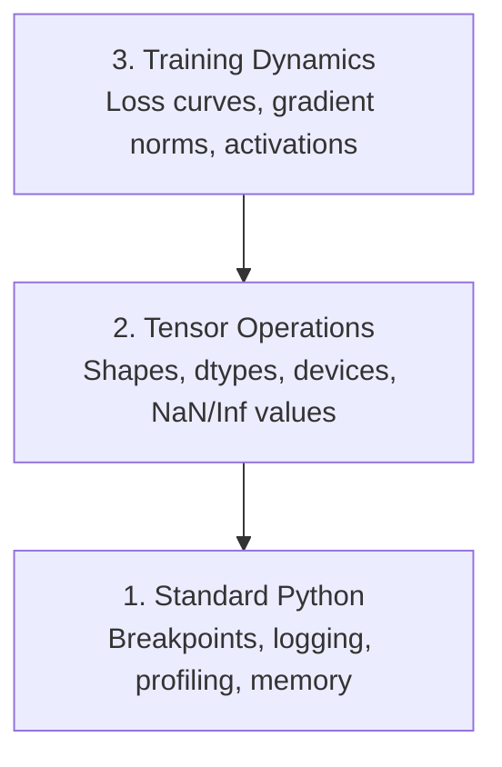

# 12 · 调试与性能分析

> 最糟糕的 AI 缺陷不会让程序崩溃。它们在垃圾数据上悄无声息地训练，却报出一条漂亮的损失曲线。

**类型：** 实践（Build）
**语言：** Python
**前置：** 第 1 课（开发环境），具备基础的 PyTorch 使用经验
**时长：** 约 60 分钟

## 学习目标

- 使用条件式 `breakpoint()` 与 `debug_print`，在训练过程中检查张量的形状（shape）、数据类型（dtype）和 NaN 值
- 用 `cProfile`、`line_profiler` 和 `tracemalloc` 对训练循环做性能分析，找出瓶颈
- 检测常见的 AI 缺陷：形状不匹配、NaN 损失、数据泄漏（data leakage），以及张量位于错误设备上
- 配置 TensorBoard 以可视化损失曲线、权重直方图和梯度分布

## 问题所在

AI 代码的失败方式与普通代码不同。一个 Web 应用会带着堆栈跟踪崩溃。而一个配置错误的训练循环可能跑上 8 小时，烧掉 200 美元的 GPU 算力，最后产出一个对任何输入都预测平均值的模型。代码从未报错。缺陷可能是一个张量待在错误的设备上、一个被遗忘的 `.detach()`，或者标签泄漏进了特征里。

你需要一套调试工具，在这些静默故障浪费你的时间和算力之前就把它们抓住。

## 核心概念

AI 调试运行在三个层级上：



多数人会直接跳到第 3 层（盯着 TensorBoard 看）。但 80% 的 AI 缺陷其实存在于第 1 层和第 2 层。

## 动手构建

### 第 1 部分：打印调试（没错，它确实有用）

打印调试常被人轻视，但它不该被轻视。对于张量代码而言，一条有针对性的打印语句胜过在调试器里逐步单步执行，因为你需要同时看到形状、数据类型和取值范围。

```python
def debug_print(name, tensor):
    print(f"{name}: shape={tensor.shape}, dtype={tensor.dtype}, "
          f"device={tensor.device}, "
          f"min={tensor.min().item():.4f}, max={tensor.max().item():.4f}, "
          f"mean={tensor.mean().item():.4f}, "
          f"has_nan={tensor.isnan().any().item()}")
```

在每个可疑操作之后都调用它。一旦找到缺陷，就把这些打印语句删掉。就这么简单。

### 第 2 部分：Python 调试器（pdb 与 breakpoint）

内置调试器在 AI 工作中被严重低估。把 `breakpoint()` 丢进训练循环，就能交互式地检查张量。

```python
def training_step(model, batch, criterion, optimizer):
    inputs, labels = batch
    outputs = model(inputs)
    loss = criterion(outputs, labels)

    if loss.item() > 100 or torch.isnan(loss):
        breakpoint()

    loss.backward()
    optimizer.step()
```

当调试器把你带进断点时，一些有用的命令：

- `p outputs.shape` 检查形状
- `p loss.item()` 查看损失值
- `p torch.isnan(outputs).sum()` 统计 NaN 的数量
- `p model.fc1.weight.grad` 检查梯度
- `c` 继续执行，`q` 退出

这就是条件式调试。只有当某些东西看起来不对劲时你才会停下来。对于一次 10,000 步的训练运行来说，这一点至关重要。

### 第 3 部分：Python 日志

当你的调试需求超出了一次快速检查时，就用日志（logging）取代打印语句。

```python
import logging

logging.basicConfig(
    level=logging.INFO,
    format="%(asctime)s [%(levelname)s] %(message)s",
    handlers=[
        logging.FileHandler("training.log"),
        logging.StreamHandler()
    ]
)
logger = logging.getLogger(__name__)

logger.info("Starting training: lr=%.4f, batch_size=%d", lr, batch_size)
logger.warning("Loss spike detected: %.4f at step %d", loss.item(), step)
logger.error("NaN loss at step %d, stopping", step)
```

日志能为你提供时间戳、严重级别和文件输出。当一次训练运行在凌晨 3 点失败时，你想要的是一个日志文件，而不是早已滚出屏幕的终端输出。

### 第 4 部分：为代码段计时

弄清时间花在了哪里，是优化的第一步。

```python
import time

class Timer:
    def __init__(self, name=""):
        self.name = name

    def __enter__(self):
        self.start = time.perf_counter()
        return self

    def __exit__(self, *args):
        elapsed = time.perf_counter() - self.start
        print(f"[{self.name}] {elapsed:.4f}s")

with Timer("data loading"):
    batch = next(dataloader_iter)

with Timer("forward pass"):
    outputs = model(batch)

with Timer("backward pass"):
    loss.backward()
```

常见结论：数据加载占用了 60% 的训练时间。解决办法是在你的 DataLoader 里设置 `num_workers > 0`，而不是换一块更快的 GPU。

### 第 5 部分：cProfile 与 line_profiler

当手动计时器已不够用时：

```bash
python -m cProfile -s cumtime train.py
```

这会展示每一次函数调用，并按累计耗时排序。若要逐行分析：

```bash
pip install line_profiler
```

```python
@profile
def train_step(model, data, target):
    output = model(data)
    loss = F.cross_entropy(output, target)
    loss.backward()
    return loss

# 用以下命令运行: kernprof -l -v train.py
```

### 第 6 部分：内存性能分析

#### 用 tracemalloc 分析 CPU 内存

```python
import tracemalloc

tracemalloc.start()

# 你的代码放这里
model = build_model()
data = load_dataset()

snapshot = tracemalloc.take_snapshot()
top_stats = snapshot.statistics("lineno")
for stat in top_stats[:10]:
    print(stat)
```

#### 用 memory_profiler 分析 CPU 内存

```bash
pip install memory_profiler
```

```python
from memory_profiler import profile

@profile
def load_data():
    raw = read_csv("data.csv")       # 观察内存在这里跳升
    processed = preprocess(raw)       # 这里也是
    return processed
```

用 `python -m memory_profiler your_script.py` 运行，即可看到逐行的内存使用情况。

#### 用 PyTorch 分析 GPU 内存

```python
import torch

if torch.cuda.is_available():
    print(torch.cuda.memory_summary())

    print(f"Allocated: {torch.cuda.memory_allocated() / 1e9:.2f} GB")
    print(f"Cached: {torch.cuda.memory_reserved() / 1e9:.2f} GB")
```

当你遇到 OOM（Out of Memory，内存耗尽）时：

1. 减小批大小（batch size）（永远是第一个该尝试的办法）
2. 用 `torch.cuda.empty_cache()` 释放缓存的内存
3. 对于大的中间结果，用 `del tensor` 后再跟上 `torch.cuda.empty_cache()`
4. 使用混合精度（`torch.cuda.amp`）将内存占用减半
5. 对非常深的模型使用梯度检查点（gradient checkpointing）

### 第 7 部分：常见的 AI 缺陷及其捕获方法

#### 形状不匹配

最常见的缺陷。一个张量的形状是 `[batch, features]`，而模型期望的却是 `[batch, channels, height, width]`。

```python
def check_shapes(model, sample_input):
    print(f"Input: {sample_input.shape}")
    hooks = []

    def make_hook(name):
        def hook(module, inp, out):
            in_shape = inp[0].shape if isinstance(inp, tuple) else inp.shape
            out_shape = out.shape if hasattr(out, "shape") else type(out)
            print(f"  {name}: {in_shape} -> {out_shape}")
        return hook

    for name, module in model.named_modules():
        hooks.append(module.register_forward_hook(make_hook(name)))

    with torch.no_grad():
        model(sample_input)

    for h in hooks:
        h.remove()
```

用一个样本批次（sample batch）运行它一次。它会绘制出模型中每一次形状变换。

#### NaN 损失

NaN 损失意味着有什么东西爆炸了。常见原因：

- 学习率（learning rate）过高
- 自定义损失中出现除以零
- 对零或负数取对数
- RNN 中出现梯度爆炸

```python
def detect_nan(model, loss, step):
    if torch.isnan(loss):
        print(f"NaN loss at step {step}")
        for name, param in model.named_parameters():
            if param.grad is not None:
                if torch.isnan(param.grad).any():
                    print(f"  NaN gradient in {name}")
                if torch.isinf(param.grad).any():
                    print(f"  Inf gradient in {name}")
        return True
    return False
```

#### 数据泄漏

你的模型在测试集上拿到了 99% 的准确率。听起来很棒。但这是个缺陷。

```python
def check_data_leakage(train_set, test_set, id_column="id"):
    train_ids = set(train_set[id_column].tolist())
    test_ids = set(test_set[id_column].tolist())
    overlap = train_ids & test_ids
    if overlap:
        print(f"DATA LEAKAGE: {len(overlap)} samples in both train and test")
        return True
    return False
```

也要检查时间泄漏（temporal leakage）：用未来的数据去预测过去。在划分数据集之前，先按时间戳排序。

#### 错误的设备

位于不同设备（CPU 与 GPU）上的张量会引发运行时错误。但有时一个张量会悄悄地留在 CPU 上，而其余一切都在 GPU 上，于是训练只是变得很慢而已。

```python
def check_devices(model, *tensors):
    model_device = next(model.parameters()).device
    print(f"Model device: {model_device}")
    for i, t in enumerate(tensors):
        if t.device != model_device:
            print(f"  WARNING: tensor {i} on {t.device}, model on {model_device}")
```

### 第 8 部分：TensorBoard 基础

TensorBoard 向你展示训练过程内部随时间发生的变化。

```bash
pip install tensorboard
```

```python
from torch.utils.tensorboard import SummaryWriter

writer = SummaryWriter("runs/experiment_1")

for step in range(num_steps):
    loss = train_step(model, batch)

    writer.add_scalar("loss/train", loss.item(), step)
    writer.add_scalar("lr", optimizer.param_groups[0]["lr"], step)

    if step % 100 == 0:
        for name, param in model.named_parameters():
            writer.add_histogram(f"weights/{name}", param, step)
            if param.grad is not None:
                writer.add_histogram(f"grads/{name}", param.grad, step)

writer.close()
```

启动它：

```bash
tensorboard --logdir=runs
```

需要重点关注的现象：

- **损失不下降**：学习率过低，或模型架构有问题
- **损失剧烈震荡**：学习率过高
- **损失变为 NaN**：数值不稳定（见上文 NaN 一节）
- **训练损失下降、验证损失上升**：过拟合（overfitting）
- **权重直方图坍缩到零**：梯度消失（vanishing gradients）
- **梯度直方图爆炸**：需要梯度裁剪（gradient clipping）

### 第 9 部分：VS Code 调试器

要做交互式调试，可以用一个 `launch.json` 来配置 VS Code：

```json
{
    "version": "0.2.0",
    "configurations": [
        {
            "name": "Debug Training",
            "type": "debugpy",
            "request": "launch",
            "program": "${file}",
            "console": "integratedTerminal",
            "justMyCode": false
        }
    ]
}
```

通过点击行号槽（gutter）设置断点。用变量（Variables）面板检查张量属性。调试控制台（Debug Console）让你能在执行过程中运行任意 Python 表达式。

它非常适合用来逐步走查数据预处理流水线，让你看到每一次变换。

## 实战运用

下面这套调试工作流能抓住大多数 AI 缺陷：

1. **训练前**：用一个样本批次运行 `check_shapes`。核实输入和输出维度是否符合预期。
2. **前 10 步**：对损失、输出和梯度使用 `debug_print`。确认没有 NaN，且数值处于合理范围内。
3. **训练期间**：记录损失、学习率和梯度范数（gradient norms）。用 TensorBoard 做可视化。
4. **出问题时**：在故障点丢一个 `breakpoint()`。交互式地检查张量。
5. **性能方面**：为数据加载、前向传播和反向传播分别计时。如果接近 OOM，就分析内存。

## 交付成果

运行调试工具包脚本：

```bash
python phases/00-setup-and-tooling/12-debugging-and-profiling/code/debug_tools.py
```

参见 `outputs/prompt-debug-ai-code.md`，其中有一段帮助诊断 AI 特有缺陷的提示词。

## 练习

1. 运行 `debug_tools.py`，通读每一节的输出。修改这个示例模型，引入一个 NaN（提示：在前向传播中除以零），然后观察检测器如何把它抓住。
2. 用 `cProfile` 分析一个训练循环，找出最慢的函数。
3. 用 `tracemalloc` 找出你数据加载流水线中分配内存最多的那一行。
4. 为一次简单的训练运行配置 TensorBoard，判断模型是否过拟合。
5. 在训练循环内部使用 `breakpoint()`。练习从调试器提示符中检查张量的形状、设备和梯度值。
