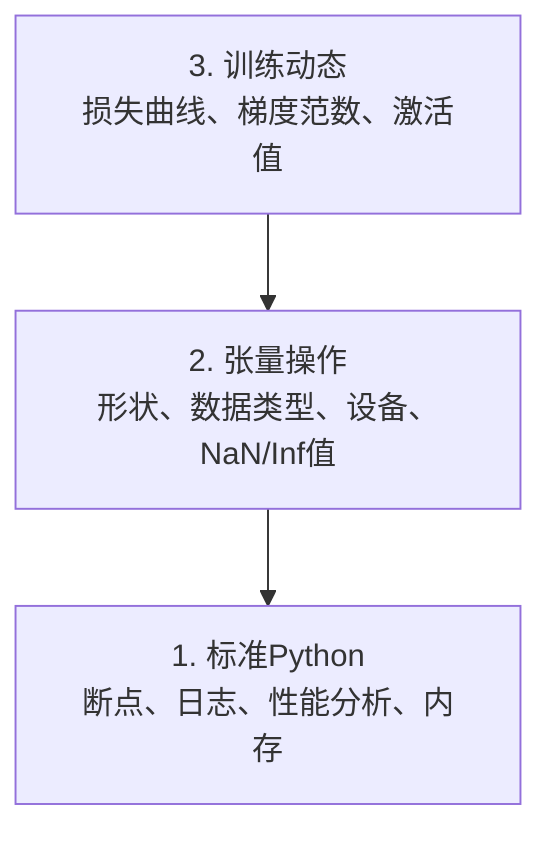

# 调试与性能分析

> 最糟糕的AI错误不会导致崩溃。它们会在垃圾数据上默默训练，然后报告一条完美的损失曲线。

**类型：** 构建
**语言：** Python
**前置条件：** 第1课（开发环境），基本PyTorch熟悉度
**预计时间：** 约60分钟

## 学习目标

- 使用条件 `breakpoint()` 和 `debug_print` 在训练过程中检查张量的形状、数据类型和NaN值
- 使用 `cProfile`、`line_profiler` 和 `tracemalloc` 对训练循环进行性能分析，找出瓶颈
- 检测常见的AI错误：形状不匹配、NaN损失、数据泄漏和设备不匹配的张量
- 设置TensorBoard以可视化损失曲线、权重直方图和梯度分布

## 问题

AI代码的失败方式与常规代码不同。Web应用会因堆栈跟踪而崩溃；一个配置错误的训练循环运行8小时，消耗200美元的GPU时间，最终产生一个预测每个输入均值的模型。代码从未报错。错误是张量放在了错误的设备上，忘记调用 `.detach()`，或者标签泄漏到了特征中。

你需要能够在你浪费时间和算力之前，捕获这些无声失败的调试工具。

## 概念

AI调试在三个层次上运作：



大多数人都直接跳到第三层（盯着TensorBoard看）。但80%的AI错误位于第一层和第二层。

## 动手构建

### 第一部分：打印调试（没错，它很管用）

打印调试经常被忽视。但不应如此。对于张量代码，有针对性的打印语句比单步执行调试器更好，因为你需要同时查看形状、数据类型和数值范围。

```python
def debug_print(name, tensor):
    print(f"{name}: shape={tensor.shape}, dtype={tensor.dtype}, "
          f"device={tensor.device}, "
          f"min={tensor.min().item():.4f}, max={tensor.max().item():.4f}, "
          f"mean={tensor.mean().item():.4f}, "
          f"has_nan={tensor.isnan().any().item()}")
```

在每一个可疑操作后调用此函数。找到错误后，删除打印语句。简单。

### 第二部分：Python调试器（pdb 和 breakpoint）

内置调试器在AI工作中被低估了。将 `breakpoint()` 放入训练循环，并以交互方式检查张量。

```python
def training_step(model, batch, criterion, optimizer):
    inputs, labels = batch
    outputs = model(inputs)
    loss = criterion(outputs, labels)

    if loss.item() > 100 or torch.isnan(loss):
        breakpoint()

    loss.backward()
    optimizer.step()
```

当调试器进入时，有用的命令：

- `p outputs.shape` 检查形状
- `p loss.item()` 查看损失值
- `p torch.isnan(outputs).sum()` 统计NaN数量
- `p model.fc1.weight.grad` 检查梯度
- `c` 继续执行，`q` 退出

这是条件调试。你只在看起来有问题时才停下来。对于10000步的训练运行，这很重要。

### 第三部分：Python日志

当调试超出快速检查的范围时，用日志记录替换打印语句。

```python
import logging

logging.basicConfig(
    level=logging.INFO,
    format="%(asctime)s [%(levelname)s] %(message)s",
    handlers=[
        logging.FileHandler("training.log"),
        logging.StreamHandler()
    ]
)
logger = logging.getLogger(__name__)

logger.info("起始训练: lr=%.4f, batch_size=%d", lr, batch_size)
logger.warning("检测到损失尖峰: %.4f 在第 %d 步", loss.item(), step)
logger.error("在第 %d 步出现NaN损失，停止", step)
```

日志提供时间戳、严重级别和文件输出。当训练在凌晨3点失败时，你需要一个日志文件，而不是已经滚出屏幕的终端输出。

### 第四部分：代码段计时

了解时间花在哪里是优化的第一步。

```python
import time

class Timer:
    def __init__(self, name=""):
        self.name = name

    def __enter__(self):
        self.start = time.perf_counter()
        return self

    def __exit__(self, *args):
        elapsed = time.perf_counter() - self.start
        print(f"[{self.name}] {elapsed:.4f}s")

with Timer("数据加载"):
    batch = next(dataloader_iter)

with Timer("前向传播"):
    outputs = model(batch)

with Timer("反向传播"):
    loss.backward()
```

常见发现：数据加载占用60%的训练时间。解决方案是在DataLoader中设置 `num_workers > 0`，而不是换一个更快的GPU。

### 第五部分：cProfile 和 line_profiler

当你需要比手动计时更强大的工具时：

```bash
python -m cProfile -s cumtime train.py
```

这会显示每个函数调用，按累计时间排序。要进行逐行性能分析：

```bash
pip install line_profiler
```

```python
@profile
def train_step(model, data, target):
    output = model(data)
    loss = F.cross_entropy(output, target)
    loss.backward()
    return loss

# 运行方式: kernprof -l -v train.py
```

### 第六部分：内存分析

#### CPU内存（使用 tracemalloc）

```python
import tracemalloc

tracemalloc.start()

# 你的代码
model = build_model()
data = load_dataset()

snapshot = tracemalloc.take_snapshot()
top_stats = snapshot.statistics("lineno")
for stat in top_stats[:10]:
    print(stat)
```

#### CPU内存（使用 memory_profiler）

```bash
pip install memory_profiler
```

```python
from memory_profiler import profile

@profile
def load_data():
    raw = read_csv("data.csv")       # 注意此处内存跳升
    processed = preprocess(raw)       # 以及此处
    return processed
```

使用 `python -m memory_profiler your_script.py` 运行，查看逐行内存使用情况。

#### GPU内存（使用 PyTorch）

```python
import torch

if torch.cuda.is_available():
    print(torch.cuda.memory_summary())

    print(f"已分配: {torch.cuda.memory_allocated() / 1e9:.2f} GB")
    print(f"缓存: {torch.cuda.memory_reserved() / 1e9:.2f} GB")
```

当你遇到OOM（内存溢出）时：

1. 减小批次大小（首先尝试，总是有效）
2. 使用 `torch.cuda.empty_cache()` 释放缓存内存
3. 对大型中间变量使用 `del tensor` 后跟 `torch.cuda.empty_cache()`
4. 使用混合精度（`torch.cuda.amp`）将内存使用减半
5. 对非常深的模型使用梯度检查点

### 第七部分：常见AI错误及其捕获方法

#### 形状不匹配

最常见的错误。张量的形状是 `[batch, features]`，而模型期望 `[batch, channels, height, width]`。

```python
def check_shapes(model, sample_input):
    print(f"输入: {sample_input.shape}")
    hooks = []

    def make_hook(name):
        def hook(module, inp, out):
            in_shape = inp[0].shape if isinstance(inp, tuple) else inp.shape
            out_shape = out.shape if hasattr(out, "shape") else type(out)
            print(f"  {name}: {in_shape} -> {out_shape}")
        return hook

    for name, module in model.named_modules():
        hooks.append(module.register_forward_hook(make_hook(name)))

    with torch.no_grad():
        model(sample_input)

    for h in hooks:
        h.remove()
```

使用一个示例批次运行一次。它会映射模型中每个形状变换。

#### NaN损失

NaN损失意味着某些东西爆炸了。常见原因：

- 学习率过高
- 自定义损失中出现除零
- 对零或负数取对数
- RNN中梯度爆炸

```python
def detect_nan(model, loss, step):
    if torch.isnan(loss):
        print(f"在第 {step} 步出现NaN损失")
        for name, param in model.named_parameters():
            if param.grad is not None:
                if torch.isnan(param.grad).any():
                    print(f"  {name} 中的NaN梯度")
                if torch.isinf(param.grad).any():
                    print(f"  {name} 中的Inf梯度")
        return True
    return False
```

#### 数据泄漏

你的模型在测试集上获得99%的准确率。听起来很棒。这是一个错误。

```python
def check_data_leakage(train_set, test_set, id_column="id"):
    train_ids = set(train_set[id_column].tolist())
    test_ids = set(test_set[id_column].tolist())
    overlap = train_ids & test_ids
    if overlap:
        print(f"数据泄漏: {len(overlap)} 个样本同时出现在训练集和测试集中")
        return True
    return False
```

还要检查时间泄漏：使用未来数据预测过去。在划分之前按时间戳排序。

#### 设备不匹配

张量位于不同设备（CPU vs GPU）会导致运行时错误。但有时张量会静默地留在CPU上，而其他所有东西都在GPU上，训练只会运行缓慢。

```python
def check_devices(model, *tensors):
    model_device = next(model.parameters()).device
    print(f"模型设备: {model_device}")
    for i, t in enumerate(tensors):
        if t.device != model_device:
            print(f"  警告: 张量 {i} 在 {t.device} 上，模型在 {model_device} 上")
```

### 第八部分：TensorBoard基础

TensorBoard向你展示训练过程中随时间变化的情况。

```bash
pip install tensorboard
```

```python
from torch.utils.tensorboard import SummaryWriter

writer = SummaryWriter("runs/experiment_1")

for step in range(num_steps):
    loss = train_step(model, batch)

    writer.add_scalar("loss/train", loss.item(), step)
    writer.add_scalar("lr", optimizer.param_groups[0]["lr"], step)

    if step % 100 == 0:
        for name, param in model.named_parameters():
            writer.add_histogram(f"weights/{name}", param, step)
            if param.grad is not None:
                writer.add_histogram(f"grads/{name}", param.grad, step)

writer.close()
```

启动它：

```bash
tensorboard --logdir=runs
```

需要注意的内容：

- **损失不下降**：学习率过低，或模型架构问题
- **损失剧烈震荡**：学习率过高
- **损失变为NaN**：数值不稳定（见上面NaN部分）
- **训练损失下降，验证损失上升**：过拟合
- **权重直方图坍缩到零**：梯度消失
- **梯度直方图爆炸**：需要梯度裁剪

### 第九部分：VS Code调试器

对于交互式调试，配置VS Code的 `launch.json`：

```json
{
    "version": "0.2.0",
    "configurations": [
        {
            "name": "调试训练",
            "type": "debugpy",
            "request": "launch",
            "program": "${file}",
            "console": "integratedTerminal",
            "justMyCode": false
        }
    ]
}
```

通过点击装订线设置断点。使用变量面板检查张量属性。调试控制台允许你在执行过程中运行任意Python表达式。

对于需要查看每个转换的数据预处理流水线，逐步执行很有用。

## 使用它

以下是捕获大多数AI错误的调试工作流程：

1. **训练之前**：使用示例批次运行 `check_shapes`。验证输入和输出维度符合预期。
2. **前10步**：对损失、输出和梯度使用 `debug_print`。确认没有NaN且值在合理范围内。
3. **训练期间**：记录损失、学习率和梯度范数。使用TensorBoard进行可视化。
4. **出现问题时**：在失败点放入 `breakpoint()`。以交互方式检查张量。
5. **性能方面**：对数据加载、前向传播和反向传播进行计时。如果接近OOM则分析内存。

## 发布

运行调试工具包脚本：

```bash
python phases/00-setup-and-tooling/12-debugging-and-profiling/code/debug_tools.py
```

查看 `outputs/prompt-debug-ai-code.md` 获取有助于诊断AI特定错误的提示。

## 练习

1. 运行 `debug_tools.py` 并阅读每个部分的输出。修改虚拟模型以引入NaN（提示：在前向传播中除以零），观察检测器捕捉到它。
2. 使用 `cProfile` 分析训练循环，找出最慢的函数。
3. 使用 `tracemalloc` 找出数据加载流水线中哪一行分配了最多内存。
4. 为一次简单训练运行设置TensorBoard，并判断模型是否过拟合。
5. 在训练循环中使用 `breakpoint()`。练习在调试器提示符下检查张量形状、设备和梯度值。