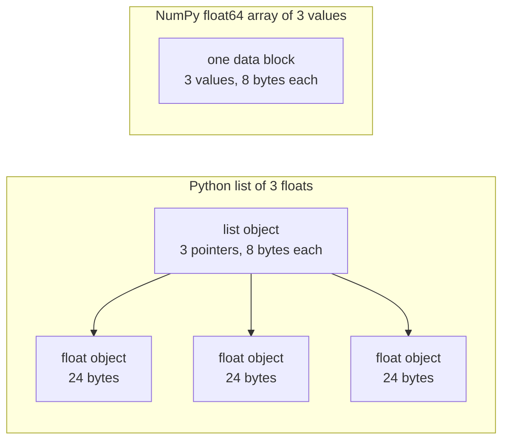

# Python for AI Engineering

> Most code in this course uses the same small set of Python idioms. Learn that set here, before the math and model lessons depend on it.

**Type:** Build
**Languages:** Python
**Prerequisites:** Dev Environment, Python Environments
**Time:** ~120 minutes

## Learning Objectives

- Read and write the idioms that most course code uses, from unpacking and f-strings to dataclasses and comprehensions.
- Find three Python mistakes that give wrong results with no error: shared lists, mutable defaults, and used-up generators.
- Build a CSV and JSON loader, a seeded split, and a mini-batch generator with only the standard library.
- Write dot product, mean, and standard deviation in pure Python, and measure their speed and memory use.
- Explain why a pure-Python loop over numbers is slow, and how NumPy broadcasting moves the loop into compiled code.

## The Problem

The lessons after this phase use plain Python for the math and the models. Of the 541 Python files in the lessons, 276 import `dataclasses`. Also, 187 files call `random.seed` or create a `random.Random` generator. If those idioms are new to you, you read syntax when you want to read the math.

Python also has behaviors that give wrong results with no error message. Two names can refer to one list, so a change through one name also changes the other. A default argument keeps its value from one call to the next. A generator is empty after one pass, so a second training epoch gets no data and the loss does not change.

The last problem is speed. On our test laptop, a pure-Python loop over a million floats took about 30 milliseconds. NumPy computed the same dot product in less than one millisecond. You need to know the reason, so that you can choose between a clear loop and an array operation.

## The Concept

### What the course code uses

We parsed all 541 Python files in `phases/*/*/code/` with the `ast` module. The table counts the files that use each construct at least once. The counts are from the day we wrote this lesson, and they change as lessons are added.

| Construct | Files | Share |
|-----------|-------|-------|
| Function definitions | 541 | 100% |
| `if __name__ == "__main__":` | 529 | 98% |
| f-strings | 517 | 96% |
| Tuple unpacking | 448 | 83% |
| Classes | 379 | 70% |
| List comprehensions | 375 | 69% |
| Type hints on functions | 342 | 63% |
| Generator expressions | 326 | 60% |
| Slices | 314 | 58% |
| `lambda` | 175 | 32% |
| `try` and `except` | 120 | 22% |
| `with` statements | 96 | 18% |
| Dict comprehensions | 93 | 17% |
| Generator functions with `yield` | 14 | 3% |

Imports show which standard modules matter. Of the 541 files, 340 start with `from __future__ import annotations`, and 276 import `dataclasses`. The `math`, `random`, and `json` modules appear in 187, 175, and 126 files. The `collections` module appears in 70 files, and `itertools` appears in only 4.

No lesson calls `map()` or `filter()`. Comprehensions do that work. Calls to `sorted`, `min`, `max`, or `.sort` with a `key=` function appear in more than 140 files. This lesson spends the most time on the idioms at the top of these lists.

### Names refer to objects

In Python, a variable is a name that refers to an object. Assignment binds a name to an object. It does not copy the object. When two names refer to one list, a change through either name is visible through both. Numbers, strings, and tuples cannot change, so this rule causes no problems for them. Lists, dicts, and sets can change, so make a copy when you need an independent version.

### A list holds pointers, an array holds numbers

A Python list does not store numbers directly. It stores pointers, and each pointer refers to a full Python object. On a 64-bit build of CPython, each pointer takes 8 bytes and each `float` object takes 24 bytes. A NumPy `float64` array stores the raw 8-byte values side by side in one block of memory.



A loop over a list does a lot of work for each element. The interpreter runs one bytecode instruction at a time. For each element, it follows a pointer and checks the type of each operand. Then it calls the float multiply code and makes a Python float object to hold the result.

NumPy does the same arithmetic in a loop of compiled code over the raw values. It checks the data type once for the whole array, and it makes no Python object for each element. Vectorized code describes one operation over a whole array, such as `(x - mean) / std`, and a library runs the loop. The vector functions in this lesson follow that rule. Each one does one array operation, so you can replace it with one NumPy call later.

### A list holds every item, a generator holds one

A list comprehension builds every item before the next line runs. A generator builds one item each time the caller asks for the next one. The memory for a list grows with the number of items. The memory for a generator stays about the same for any number of items.

A generator can run only once. After the last item, it raises `StopIteration` on each request, so a second `for` loop over it gets no items. Training code reads the dataset once per epoch, so it must create a new generator for each epoch.

Generator functions are rare in the lesson code. The data loaders that the deep learning lessons use are iterables of batches, so the idea is in every training loop. The figure shows both approaches on the same eight rows.

```figure
s0-list-vs-generator
```

## The Idioms You Need

Each block in this section runs on its own. Save it to a file and run it with `python3`. The blocks need Python 3.11 or newer, the version that we installed in the dev environment lesson.

### 1. Values, collections, and unpacking

Python has four built-in collections. Learn when to use each one.

| Type | Example | Ordered | Can change | Typical use in the course |
|------|---------|---------|------------|---------------------------|
| `list` | `[0.5, 1.2]` | Yes | Yes | Samples, losses, weights |
| `tuple` | `(32, 784)` | Yes | No | Shapes, fixed records, dict keys |
| `dict` | `{"lr": 0.01}` | Insertion order | Yes | Configs, vocabularies, JSON rows |
| `set` | `{"cat", "dog"}` | No | Yes | Unique tokens, overlap checks |

This block shows that assignment does not copy a list.

```python
weights = [0.5, -1.2, 3.0]
alias = weights
alias[0] = 99.0
print(weights)

independent = list(weights)
independent[1] = 0.0
print(weights, independent)

grid = [[0] * 3] * 2
grid[0][0] = 1
print(grid)

grid = [[0] * 3 for _ in range(2)]
grid[0][0] = 1
print(grid)
```

```text
[99.0, -1.2, 3.0]
[99.0, -1.2, 3.0] [99.0, 0.0, 3.0]
[[1, 0, 0], [1, 0, 0]]
[[1, 0, 0], [0, 0, 0]]
```

The expression `[[0] * 3] * 2` makes an outer list with two references to one inner list. The comprehension makes a new inner list for each row. The math phase builds matrices from lists, so use the comprehension form.

Unpacking assigns the items of a sequence to several names in one line. A starred name collects the remaining items. An f-string puts the value of an expression into a string, with an optional format after a colon.

```python
shape = (32, 784)
batch_size, n_features = shape
first, *middle, last = [1, 2, 3, 4, 5]
x, y = 1.0, 3.0
x, y = y, x

config = {"lr": 0.01, "epochs": 5}
config["seed"] = 7
tokens = ["the", "cat", "sat", "on", "the", "mat"]
vocab = set(tokens)

print(batch_size, n_features, first, middle, last, x, y)
print(config.get("momentum", 0.9), "cat" in vocab, len(vocab))
print(f"lr={config['lr']:.0e} loss={0.123456:.3f} n={60_000:,} {batch_size=}")
```

```text
32 784 1 [2, 3, 4] 5 3.0 1.0
0.9 True 5
lr=1e-02 loss=0.123 n=60,000 batch_size=32
```

`dict.get` returns a default value when the key is missing. The `in` test on a set takes about the same time for any set size. The `{batch_size=}` form prints the name and the value, which helps when you debug.

A slice `a[start:stop:step]` includes `start` and excludes `stop`. Negative indexes count from the end. A slice of a list is a new list, so a slice of a large list copies all of its pointers.

```python
tokens = ["<s>", "the", "cat", "sat", "on", "the", "mat", "</s>"]
print(tokens[1:-1])
print(tokens[:3], tokens[-3:])
print(tokens[::2])
print(tokens[::-1][:2])
windows = [tokens[i:i + 3] for i in range(len(tokens) - 2)]
print(len(windows), windows[0])
```

```text
['the', 'cat', 'sat', 'on', 'the', 'mat']
['<s>', 'the', 'cat'] ['the', 'mat', '</s>']
['<s>', 'cat', 'on', 'mat']
['</s>', 'mat']
6 ['<s>', 'the', 'cat']
```

### 2. Comprehensions

A comprehension builds a list, dict, or set from an iterable in one expression. It reads like the math that it describes.

```python
scores = [0.91, 0.42, 0.77, 0.15, 0.66]
labels = [1 if s >= 0.5 else 0 for s in scores]
high = [s for s in scores if s > 0.6]
squares = {i: i * i for i in range(4)}
lengths = {len(word) for word in ["a", "bb", "cc", "ddd"]}
sum_sq = sum(s * s for s in scores)

matrix = [[1, 2, 3], [4, 5, 6]]
transposed = [list(column) for column in zip(*matrix)]
flat = [v for row in matrix for v in row]

print(labels, high, squares, lengths, round(sum_sq, 4))
print(transposed, flat)
```

```text
[1, 0, 1, 0, 1] [0.91, 0.77, 0.66] {0: 0, 1: 1, 2: 4, 3: 9} {1, 2, 3} 2.0555
[[1, 4], [2, 5], [3, 6]] [1, 2, 3, 4, 5, 6]
```

A trailing `if` keeps only some items. The expression before `for` can be a conditional expression, `a if condition else b`. Two `for` clauses run in the same order as two nested loops.

Round brackets make a generator expression. In `sum(s * s for s in scores)`, `sum` reads one square at a time, and Python builds no list. In `zip(*matrix)`, the star passes each row as a separate argument, and `zip` pairs the items at each position.

### 3. Functions, arguments, and closures

A default value makes an argument optional. A keyword argument names the parameter at the call. A `*` by itself in the parameter list makes the next parameters keyword-only.

```python
def clip(value, low=0.0, high=1.0):
    return max(low, min(high, value))


def train(data, *, lr=0.01, epochs=3):
    return f"{len(data)} samples, lr={lr}, epochs={epochs}"


def make_scaler(factor):
    def scale(values):
        return [v * factor for v in values]
    return scale


print(clip(1.7), clip(-3.0, low=-1.0), clip(0.4, high=0.3))
print(train([1, 2, 3], lr=0.1))
to_percent = make_scaler(100)
print(to_percent([0.25, 0.5]))
```

```text
1.0 -1.0 0.3
3 samples, lr=0.1, epochs=3
[25.0, 50.0]
```

With keyword-only arguments, a call such as `train(data, 0.1, 3)` raises `TypeError`. The caller must write `lr=0.1`, so two numbers cannot change places by accident.

The inner function `scale` uses `factor` from the function that created it. Python keeps `factor` for as long as `scale` exists. A function that keeps variables from its creator is a closure. The standardizer in Build It uses a closure to keep the training statistics.

A `lambda` is a one-expression function with no name. Course code uses it mostly as a `key=` function, which part 8 shows.

Python evaluates a default value once, when it runs the `def` statement. Every call that uses the default gets the same object.

```python
def add_bad(item, bucket=[]):
    bucket.append(item)
    return bucket


def add_good(item, bucket=None):
    if bucket is None:
        bucket = []
    bucket.append(item)
    return bucket


add_bad("a")
print(add_bad("b"))
add_good("a")
print(add_good("b"))
```

```text
['a', 'b']
['b']
```

Use `None` as the default for a list, dict, or set. Create the new object inside the function.

### 4. Classes and dataclasses

The `@dataclass` decorator writes `__init__`, `__repr__`, and `__eq__` from the annotated fields. With `frozen=True`, the object cannot change after creation, and you can use it as a dict key or put it in a set.

```python
from dataclasses import dataclass, field


@dataclass(frozen=True)
class Example:
    features: tuple[float, ...]
    label: int


@dataclass
class TrainConfig:
    lr: float = 0.01
    epochs: int = 5
    hidden: list[int] = field(default_factory=lambda: [64, 32])

    def describe(self):
        return f"lr={self.lr} epochs={self.epochs} hidden={self.hidden}"


ex = Example((1.5, 2.0), 1)
print(ex)
print(ex == Example((1.5, 2.0), 1), len({ex, Example((1.5, 2.0), 1)}))
print(TrainConfig(epochs=10).describe())
try:
    ex.label = 0
except AttributeError as err:
    print(type(err).__name__)
```

```text
Example(features=(1.5, 2.0), label=1)
True 1
lr=0.01 epochs=10 hidden=[64, 32]
FrozenInstanceError
```

`field(default_factory=...)` gives each instance a new list. It solves the shared-default problem from part 3 inside a dataclass.

Special methods connect a class to Python syntax. `len(ds)` calls `__len__`, and `ds[2]` calls `__getitem__`.

```python
class SquaresDataset:
    def __init__(self, n):
        self.n = n

    def __len__(self):
        return self.n

    def __getitem__(self, index):
        if not 0 <= index < self.n:
            raise IndexError(index)
        return index, index * index


ds = SquaresDataset(4)
print(len(ds), ds[2])
print(list(ds))
```

```text
4 (2, 4)
[(0, 0), (1, 1), (2, 4), (3, 9)]
```

The `for` loop inside `list(ds)` works without an `__iter__` method. Python calls `__getitem__` with 0, 1, 2, and so on until it gets `IndexError`. PyTorch map-style datasets use the same two methods, `__len__` and `__getitem__`.

### 5. Iterators and generators

An iterable is any object that a `for` loop accepts. `iter()` gets an iterator from it, and `next()` asks the iterator for one item. When the iterator has no more items, it raises `StopIteration`. A `for` loop calls `next()` for you and stops at `StopIteration`.

```python
numbers = [10, 20, 30]
it = iter(numbers)
print(next(it), next(it), next(it))
try:
    next(it)
except StopIteration:
    print("no more items")


def countdown(n):
    while n > 0:
        yield n
        n -= 1


gen = countdown(3)
print(type(gen).__name__)
print(list(gen))
print(list(gen))
```

```text
10 20 30
no more items
generator
[3, 2, 1]
[]
```

A function with `yield` in its body is a generator function. A call to it runs none of its code and returns a generator object. Each `next()` runs the body to the next `yield` and pauses there. The second `list(gen)` is empty because the first one used up the generator.

A generator can read a file one line at a time.

```python
import os
import tempfile


def read_rows(path):
    with open(path, encoding="utf-8") as fh:
        header = fh.readline().rstrip("\n").split(",")
        for line in fh:
            yield dict(zip(header, line.rstrip("\n").split(",")))


with tempfile.TemporaryDirectory() as tmp:
    path = os.path.join(tmp, "rows.csv")
    with open(path, "w", encoding="utf-8") as fh:
        fh.write("x,label\n")
        fh.writelines(f"{i * 0.5},{i % 2}\n" for i in range(5))
    rows = read_rows(path)
    print(next(rows))
    print(sum(1 for _ in rows))
```

```text
{'x': '0.0', 'label': '0'}
4
```

`read_rows` keeps one line of the file in memory at a time. It is the `read_rows` in the figure. It splits on commas to keep the example short. Real CSV files can contain commas inside quoted fields, so Build It uses the `csv` module.

```python
import sys

as_list = [i * i for i in range(1_000_000)]
as_generator = (i * i for i in range(1_000_000))
print(sys.getsizeof(as_list), sys.getsizeof(as_generator))
print(sum(as_list) == sum(as_generator))
```

On 64-bit CPython, the list reports about 8 MB and the generator about 200 bytes. `sys.getsizeof` counts only the pointers of the list, and the integer objects use more memory. Build It measures the real peak with `tracemalloc`, which we used in the debugging and profiling lesson.

### 6. Context managers and exceptions

A `with` statement runs setup code, then its body, and then cleanup code. The cleanup runs even when the body raises an exception. The file object from `open()` is a context manager that closes the file.

In the debugging and profiling lesson, we wrote a `Timer` class with `__enter__` and `__exit__`. The `contextlib.contextmanager` decorator makes the same kind of object from a generator. The code before `yield` is the setup, and the `finally` block is the cleanup.

```python
import time
from contextlib import contextmanager


@contextmanager
def timer(label):
    start = time.perf_counter()
    try:
        yield
    finally:
        print(f"{label}: {(time.perf_counter() - start) * 1000:.1f} ms")


def parse_label(text):
    try:
        return int(text)
    except ValueError:
        raise ValueError(f"label must be an integer, got {text!r}") from None


with timer("sum of squares"):
    total = sum(i * i for i in range(200_000))

print(parse_label("3"))
try:
    parse_label("cat")
except ValueError as err:
    print("rejected:", err)
```

```text
sum of squares: 9.4 ms
3
rejected: label must be an integer, got 'cat'
```

The time on your machine will be different. Name the exact exception that you expect in the `except` clause, such as `ValueError` or `KeyError`. An `except:` clause with no exception type also handles `KeyboardInterrupt`, so Ctrl+C can fail to stop a loop that contains it. Raise an exception with a clear message when the input is wrong. Add `from None` when your message replaces the original traceback.

### 7. Type hints, modules, and the main guard

Type hints tell the reader what a function takes and returns. Python does not check them when the code runs. A type checker, such as mypy, reads them before the code runs.

```python
from __future__ import annotations

from collections.abc import Iterable, Sequence


def mean(values: Sequence[float]) -> float:
    if not values:
        raise ValueError("mean() needs at least one value")
    return sum(values) / len(values)


def count_tokens(docs: Iterable[str]) -> int:
    return sum(len(doc.split()) for doc in docs)


def main() -> None:
    print(mean([1.0, 2.0, 4.0]))
    print(count_tokens(["the cat sat", "on the mat"]))
    print(mean.__annotations__)


if __name__ == "__main__":
    main()
```

```text
2.3333333333333335
6
{'values': 'Sequence[float]', 'return': 'float'}
```

With `from __future__ import annotations`, Python stores each hint as a string, as the last line shows. `Sequence` means any object with `len()` and indexes, such as a list or a tuple. `Iterable` means any object that a `for` loop accepts. Many course files import the same names from `typing`, which also works.

Every `.py` file is a module. When you run a file with `python3 file.py`, Python sets its `__name__` to `"__main__"`. When another file imports it, `__name__` is the module name. The guard calls `main()` only in the first case. Because of the guard, the tests in `code/tests/` can import `main.py` without a start of the demo.

### 8. Files, JSON, CSV, and sorting

`pathlib.Path` joins paths with `/` and can read or write a whole file in one call. Always give `encoding="utf-8"`, because the default encoding depends on the operating system.

```python
import csv
import json
import tempfile
from pathlib import Path

rows = [
    {"text": "great movie", "label": 1, "score": 0.93},
    {"text": "boring plot", "label": 0, "score": 0.12},
    {"text": "fine acting", "label": 1, "score": 0.58},
]

with tempfile.TemporaryDirectory() as tmp:
    json_path = Path(tmp) / "reviews.json"
    json_path.write_text(json.dumps(rows, indent=2), encoding="utf-8")
    from_json = json.loads(json_path.read_text(encoding="utf-8"))

    csv_path = Path(tmp) / "reviews.csv"
    with csv_path.open("w", newline="", encoding="utf-8") as fh:
        writer = csv.DictWriter(fh, fieldnames=["text", "label", "score"])
        writer.writeheader()
        writer.writerows(rows)
    with csv_path.open(newline="", encoding="utf-8") as fh:
        from_csv = list(csv.DictReader(fh))

print(from_json == rows)
print(from_csv[0])

by_score = sorted(rows, key=lambda r: r["score"], reverse=True)
print([r["text"] for r in by_score])
print(max(rows, key=lambda r: r["score"])["text"])
print([r["text"] for r in sorted(rows, key=lambda r: (-r["label"], r["text"]))])
```

```text
True
{'text': 'great movie', 'label': '1', 'score': '0.93'}
['great movie', 'fine acting', 'boring plot']
great movie
['fine acting', 'great movie', 'boring plot']
```

JSON keeps numbers as numbers. CSV gives every field back as a string, so you must convert each field. Open CSV files with `newline=""`, as the `csv` documentation tells you to.

A `key=` function returns the value that Python compares for each item. `sorted`, `min`, and `max` all accept one. A tuple key sorts by the first value, and it uses the second value only for ties. The minus sign puts the larger label first. Python's sort is stable, so items with equal keys keep their original order.

### 9. Counting, grouping, and iterator tools

These two modules hold the data structures and iterator tools that plain lists and dicts do not give you.

```python
from collections import Counter, defaultdict, deque
from itertools import chain, islice, product

labels = ["cat", "dog", "cat", "bird", "cat", "dog"]
counts = Counter(labels)
print(counts.most_common(2))

positions = defaultdict(list)
for i, label in enumerate(labels):
    positions[label].append(i)
print(dict(positions))

recent = deque(maxlen=3)
for loss in [2.0, 1.5, 1.2, 1.1, 0.9]:
    recent.append(loss)
print(list(recent), round(sum(recent) / len(recent), 3))

print(list(product([0.1, 0.01], [16, 32])))
print(list(chain([1, 2], [3], [4, 5])))
print(list(islice(range(100), 5, 10)))
```

```text
[('cat', 3), ('dog', 2)]
{'cat': [0, 2, 4], 'dog': [1, 5], 'bird': [3]}
[1.2, 1.1, 0.9] 1.067
[(0.1, 16), (0.1, 32), (0.01, 16), (0.01, 32)]
[1, 2, 3, 4, 5]
[5, 6, 7, 8, 9]
```

`Counter` counts hashable items, such as labels or tokens. `defaultdict(list)` creates an empty list the first time that you use a new key, so a grouping loop needs no key check. `deque(maxlen=3)` removes the oldest item when you add a fourth, which gives a moving window over recent losses. `enumerate` gives each item with its index.

`product` gives every combination of its inputs, which is a hyperparameter grid. `chain` joins iterables end to end. `islice` takes a slice of any iterator, including a generator. The mini-batch generator in Build It uses `islice`.

### 10. Why loops over numbers are slow

The `dis` module prints the bytecode instructions that the interpreter runs for a function.

```python
import dis


def dot(a, b):
    total = 0.0
    for x, y in zip(a, b):
        total += x * y
    return total


dis.dis(dot)
```

The instructions from `FOR_ITER` to the jump back to it run once for each element. That is about ten instructions for each multiply and add. The exact instruction names change between Python versions.

A loop gets faster when fewer of its steps run as bytecode. Built-in functions such as `sum`, `map`, and `zip` are written in C. Build It measures this effect in pure Python, and Use It moves the whole loop into NumPy.

## Build It

Now build the pieces that later lessons need. The full version is `code/main.py`, and `code/tests/test_main.py` tests it. Each block below runs on its own.

### Step 1: A record type and a dataset loader

The loader reads a CSV file or a JSON file into one shape: a tuple of float features and an integer label.

```python
import csv
import json
import tempfile
from dataclasses import dataclass
from pathlib import Path


@dataclass(frozen=True)
class Record:
    features: tuple[float, ...]
    label: int


def row_to_record(row, names, label_field="label"):
    if label_field not in row:
        raise ValueError(f"row has no {label_field!r} field: {row}")
    if set(row) != {*names, label_field}:
        raise ValueError(f"row fields {list(row)} do not match {[*names, label_field]}")
    return Record(tuple(float(row[name]) for name in names), int(row[label_field]))


def load_records(path, label_field="label"):
    path = Path(path)
    if path.suffix == ".json":
        rows = json.loads(path.read_text(encoding="utf-8"))
    elif path.suffix == ".csv":
        with path.open(newline="", encoding="utf-8") as fh:
            rows = list(csv.DictReader(fh))
    else:
        raise ValueError(f"unsupported file type: {path.suffix!r}")
    if not rows:
        return []
    names = [key for key in rows[0] if key != label_field]
    return [row_to_record(row, names, label_field) for row in rows]


with tempfile.TemporaryDirectory() as tmp:
    csv_path = Path(tmp) / "data.csv"
    csv_path.write_text("x1,x2,label\n1.5,60,1\n1.8,82.5,0\n", encoding="utf-8")
    json_path = Path(tmp) / "data.json"
    json_path.write_text('[{"x1": 1.5, "x2": 60, "label": 1}]', encoding="utf-8")
    print(load_records(csv_path))
    print(load_records(json_path))
```

```text
[Record(features=(1.5, 60.0), label=1), Record(features=(1.8, 82.5), label=0)]
[Record(features=(1.5, 60.0), label=1)]
```

The first row sets the feature names and their order. `DictReader` and `json.loads` keep the keys in file order, and a dict keeps the order in which keys were added. The JSON standard does not define an order for the keys in an object, so `row_to_record` reads each row by name, in the order of the first row. A missing label, a missing or extra feature, or an unknown file type raises `ValueError` with a message, so a bad file stops the run at the start. `main.py` also has `save_records`, which writes the same two formats.

### Step 2: A seeded train and test split

```python
import random


def train_test_split(items, test_fraction=0.2, seed=0):
    if not 0.0 < test_fraction < 1.0:
        raise ValueError(f"test_fraction must be between 0 and 1, got {test_fraction}")
    if len(items) < 2:
        raise ValueError(f"need at least 2 items to split, got {len(items)}")
    order = list(range(len(items)))
    random.Random(seed).shuffle(order)
    n_test = min(max(1, round(len(items) * test_fraction)), len(items) - 1)
    test = [items[i] for i in order[:n_test]]
    train = [items[i] for i in order[n_test:]]
    return train, test


items = list(range(10))
print(train_test_split(items, seed=1))
print(train_test_split(items, seed=1) == train_test_split(items, seed=1))
print(train_test_split(items, seed=2)[1])
print(items)
```

```text
([9, 7, 5, 3, 0, 4, 1, 2], [6, 8])
True
[5, 9]
[0, 1, 2, 3, 4, 5, 6, 7, 8, 9]
```

`random.Random(seed)` creates a private random number generator. `random.seed(seed)` resets the one global generator that all modules share, so a call in another library can change your sequence. In the course, 100 lesson files call `random.seed` and 96 create `random.Random`. Use the private generator in new code.

The function shuffles a list of indexes, so the input list stays unchanged. The same seed always gives the same split. Each side keeps at least one item, so a list with fewer than 2 items raises `ValueError`. Split the data before any step that learns from it, such as standardization. In the debugging and profiling lesson, we saw that overlap between train and test data gives test scores that are too high.

### Step 3: A mini-batch generator

```python
from itertools import islice


def batches(items, batch_size, drop_last=False):
    if batch_size < 1:
        raise ValueError(f"batch_size must be at least 1, got {batch_size}")
    return _batch_iter(iter(items), batch_size, drop_last)


def _batch_iter(iterator, batch_size, drop_last):
    while True:
        batch = list(islice(iterator, batch_size))
        if not batch or (drop_last and len(batch) < batch_size):
            return
        yield batch


print(list(batches(range(10), 4)))
print(list(batches(range(10), 4, drop_last=True)))
squares = (i * i for i in range(7))
print([len(b) for b in batches(squares, 3)])

for epoch in range(2):
    sizes = [len(b) for b in batches(range(10), 4)]
    print(f"epoch {epoch}: {sizes}")
```

```text
[[0, 1, 2, 3], [4, 5, 6, 7], [8, 9]]
[[0, 1, 2, 3], [4, 5, 6, 7]]
[3, 3, 1]
epoch 0: [4, 4, 2]
epoch 1: [4, 4, 2]
```

`islice` takes up to `batch_size` items from the iterator. `batches` needs only `iter()`, so it accepts lists, files, and other generators. The last batch is smaller when the length is not a multiple of the batch size. `drop_last=True` removes that batch, for a model that needs a fixed batch shape.

The work is in two functions because a generator function runs no code until the first `next()`. With the check inside the generator, `batches(data, 0)` would return with no error. The error would come later, from inside the training loop. The outer function is a normal function, so it checks the argument at once. The epoch loop calls `batches()` again for each epoch, because a generator gives its items only once.

### Step 4: Vector math and a standardizer

```python
import math


def dot(a, b):
    return sum(x * y for x, y in zip(a, b, strict=True))


def mean(values):
    if not values:
        raise ValueError("mean() needs at least one value")
    return sum(values) / len(values)


def std(values):
    mu = mean(values)
    return math.sqrt(sum((v - mu) ** 2 for v in values) / len(values))


def make_standardizer(rows):
    columns = list(zip(*rows))
    means = [mean(c) for c in columns]
    scales = [s if s > 0 else 1.0 for s in (std(c) for c in columns)]

    def standardize(row):
        return [(v - m) / s for v, m, s in zip(row, means, scales, strict=True)]

    return standardize


print(dot([1.0, 2.0, 3.0], [4.0, 5.0, 6.0]))
values = [2.0, 4.0, 4.0, 4.0, 5.0, 5.0, 7.0, 9.0]
print(mean(values), std(values))

train_rows = [(1.0, 100.0), (2.0, 300.0), (3.0, 500.0)]
standardize = make_standardizer(train_rows)
print([[round(v, 3) for v in standardize(r)] for r in train_rows])
print([round(v, 3) for v in standardize((4.0, 700.0))])
```

```text
32.0
5.0 2.0
[[-1.225, -1.225], [0.0, 0.0], [1.225, 1.225]]
[2.449, 2.449]
```

With `strict=True`, `zip` raises `ValueError` when the two vectors have different lengths. Without it, `zip` stops at the end of the shorter input and returns a wrong answer with no error. The `strict` argument needs Python 3.10 or newer.

`std` divides by `n`, so it gives the population standard deviation, as `statistics.pstdev` does. Divide by `n - 1` when you estimate the spread of a larger population from a sample.

`make_standardizer` is a closure. It computes the means and standard deviations from the training rows once, and `standardize` keeps them. You apply the same function to the test rows, so the test data has no effect on the statistics. A constant column has a standard deviation of 0, so the standardizer uses a scale of 1 for it.

### Step 5: A complete run

`code/main.py` connects the pieces. It makes 400 records from two clusters, saves them as CSV and JSON, and loads both files back. Then it splits the records, fits the standardizer on the training split, and computes class centroids from batches of 48.

A nearest-centroid classifier stores the mean feature vector of each class. It predicts the class whose mean is closest to the input. `fit_centroids` adds up the rows one batch at a time, so it never needs the full training set in memory. `predict` uses `min()` with a `key=` function to find the closest centroid.

```bash
python3 phases/00-setup-and-tooling/13-python-for-ai-engineering/code/main.py
```

```text
Python for AI engineering: a standard-library toolkit
data     400 records, CSV and JSON load back unchanged: True
split    320 train, 80 test, records in both: 0
batches  size 48: [48, 48, 48, 48, 48, 48, 32]
scale    train feature means after standardizing: [0.0, 0.0]
model    nearest-centroid test accuracy: raw 0.86, standardized 0.89
speed    dot product of 200,000 floats, best of 5:
           index loop         6.60 ms
           zip generator      5.93 ms
           map + mul          2.89 ms
memory   peak bytes to sum 100,000 squares:
           list              4,000,616
           generator               472
```

The two features have very different scales. The second feature has ten times the spread of the first, so it controls the raw distances, and the raw accuracy is lower. Your speed and memory numbers will differ from these numbers.

### Step 6: Measure speed and memory

```python
import operator
import random
import time
import tracemalloc


def dot_index_loop(a, b):
    total = 0.0
    for i in range(len(a)):
        total += a[i] * b[i]
    return total


def dot_zip(a, b):
    return sum(x * y for x, y in zip(a, b, strict=True))


def dot_map(a, b):
    return sum(map(operator.mul, a, b))


def best_time(fn, *args, repeat=5):
    times = []
    for _ in range(repeat):
        start = time.perf_counter()
        fn(*args)
        times.append(time.perf_counter() - start)
    return min(times)


def peak_bytes(fn):
    tracemalloc.start()
    try:
        fn()
        return tracemalloc.get_traced_memory()[1]
    finally:
        tracemalloc.stop()


rng = random.Random(0)
a = [rng.random() for _ in range(1_000_000)]
b = [rng.random() for _ in range(1_000_000)]
for fn in (dot_index_loop, dot_zip, dot_map):
    print(f"{fn.__name__:15} {best_time(fn, a, b) * 1000:7.2f} ms")

print(peak_bytes(lambda: sum([i * i for i in range(100_000)])))
print(peak_bytes(lambda: sum(i * i for i in range(100_000))))
```

`best_time` reports the fastest of several runs. Other programs on the machine can only add time, so the minimum is the closest to the real cost. The documentation of the `timeit` module gives the same advice.

On our test laptop with Python 3.11, the index loop took about 33 ms. The zip version took about 30 ms, and the `map` version about 14 ms. All three do the same arithmetic. The `map` version is faster because `map` and `operator.mul` are written in C, so fewer bytecode instructions run for each element. The memory numbers repeat the figure: about 4 MB for the list and less than 1 KB for the generator.

## Use It

### The standard library versions

The standard library has a tested version of most of the pieces that you built.

| You built | Standard library | Note |
|-----------|------------------|------|
| `mean`, `std` | `statistics.fmean`, `statistics.pstdev` | The tests compare against these |
| `dot` | `math.sumprod` | Python 3.12 or newer |
| `batches` | `itertools.batched` | Python 3.12 or newer, gives tuples |
| `best_time` | `timeit.repeat` | Also turns off garbage collection during the runs |
| `peak_bytes` | `tracemalloc` | The same module, with snapshots and per-line statistics |

```python
import statistics
import sys

values = [2.0, 4.0, 4.0, 4.0, 5.0, 5.0, 7.0, 9.0]
print(statistics.fmean(values), statistics.pstdev(values))

if sys.version_info >= (3, 12):
    import math
    from itertools import batched

    print(math.sumprod([1.0, 2.0, 3.0], [4.0, 5.0, 6.0]))
    print(list(batched(range(10), 4)))
```

```text
5.0 2.0
32.0
[(0, 1, 2, 3), (4, 5, 6, 7), (8, 9)]
```

The course supports Python 3.11, so `main.py` uses its own `dot` and `batches`. On Python 3.11, the block prints only the first line.

### The same math with compiled arrays

Install NumPy in the virtual environment from the Python environments lesson, for example with `uv pip install numpy`. The lesson code and tests do not need it.

```python
import time

import numpy as np

n = 1_000_000
rng = np.random.default_rng(0)
a = rng.random(n)
b = rng.random(n)
a_list, b_list = a.tolist(), b.tolist()

start = time.perf_counter()
slow = sum(x * y for x, y in zip(a_list, b_list))
python_ms = (time.perf_counter() - start) * 1000

start = time.perf_counter()
fast = float(a @ b)
numpy_ms = (time.perf_counter() - start) * 1000

print(f"pure Python {python_ms:8.2f} ms")
print(f"NumPy       {numpy_ms:8.2f} ms")
print(f"difference  {abs(slow - fast):.1e}")
print(a.dtype, a.itemsize, a.nbytes)
```

On our test laptop, NumPy took less than 1 ms, and the pure-Python version took about 30 ms. The two results differ in the last digits, because the two versions add the products in a different order. Floating-point addition gives slightly different results in a different order.

NumPy is faster for three reasons:

- The array stores raw `float64` values, 8 bytes each, in one block of memory. A list of floats needs an 8-byte pointer and a 24-byte float object for each value.
- The loop runs in compiled code. NumPy checks the data type once for the whole array and makes no Python object for each element.
- Values that sit side by side in memory let NumPy use SIMD instructions, which process several values with one instruction.

For very small arrays, the fixed cost of one NumPy call can be larger than a short Python loop. Exercise 4 finds the size where NumPy becomes faster on your machine.

### Broadcasting

Broadcasting lets NumPy combine arrays of different shapes without a loop in your code. This block does the same work as `make_standardizer` from Step 4.

```python
import numpy as np

X = np.array([[1.0, 100.0], [2.0, 300.0], [3.0, 500.0]])
mu = X.mean(axis=0)
sigma = X.std(axis=0)
Z = (X - mu) / sigma
print(X.shape, mu.shape, Z.shape)
print(Z.round(3))

norms = np.sqrt((X ** 2).sum(axis=1, keepdims=True))
print(norms.shape, (X / norms).shape)
```

```text
(3, 2) (2,) (3, 2)
[[-1.225 -1.225]
 [ 0.     0.   ]
 [ 1.225  1.225]]
(3, 1) (3, 2)
```

NumPy compares the two shapes from the last dimension back to the first. Two dimensions are compatible when they are equal or when one of them is 1. A missing leading dimension counts as 1. A dimension of size 1 is used again along the larger dimension, and NumPy makes no copy of the data.

| Shape of `X` | Shape of the other array | Result |
|--------------|--------------------------|--------|
| `(3, 2)` | `(2,)`, column means | `(3, 2)` |
| `(3, 2)` | `(3, 1)`, row norms with `keepdims=True` | `(3, 2)` |
| `(3, 2)` | `(3,)`, row norms without `keepdims` | `ValueError` |

The last row is a common error. NumPy compares the trailing 2 with 3, and neither one is 1. Keep `keepdims=True` when you reduce over rows and then combine the result with the original array.

## Ship It

This lesson produces `outputs/prompt-python-review.md`. It is a review prompt for Python code in AI and data projects. Give it a file or a diff. It checks the code for the idioms and the silent errors from this lesson:

- Shared references and mutable default arguments
- Generators that a second epoch reads after they are used up
- Random numbers without a seed, or with only the global seed
- Statistics that come from the test split
- Pure-Python loops over large numeric arrays

It reports each finding with a location, the problem, and a fix.

## Exercises

1. Run `run_demo(seed=8)` from `main.py`. Find the output lines that change and the lines that stay the same. Explain why the split sizes stay the same.
2. Write `median(values)` in pure Python. Test it against `statistics.median` on lists of odd length and even length.
3. Write `stream_records(path)`, a generator that yields one `Record` at a time from a CSV file. Make a file of 200,000 rows. Compare the peak memory of `stream_records` and `load_records` with `tracemalloc`.
4. Write `matvec(matrix, vector)` in pure Python and in NumPy. Measure both with `best_time` for sizes 4, 64, and 1024. Find the size where NumPy becomes faster on your machine.
5. Write the construct scan from The Concept. Use `ast.parse` and `ast.walk` on each file in `phases/*/*/code/*.py`. Count the files that contain `ast.ListComp`, `ast.Yield`, and `ast.With`, and compare your counts with the table.

## Key Terms

| Term | What people say | What it means |
|------|----------------|----------------------|
| Iterable | "Something you can loop over" | An object that `iter()` accepts, such as a list, a file, or a generator |
| Iterator | "A cursor" | An object whose `__next__` method returns one item per call and raises `StopIteration` at the end |
| Generator | "A lazy list" | An iterator from a `yield` function or a generator expression. It makes each item on request and runs only once. |
| Comprehension | "A one-line loop" | An expression that builds a list, dict, or set from an iterable, with an optional filter |
| Closure | "A function inside a function" | A function that keeps variables from the function that created it |
| Dataclass | "A struct" | A class whose `__init__`, `__repr__`, and `__eq__` methods Python writes from the annotated fields |
| Context manager | "A with block" | An object that runs setup code at the start of a `with` block and cleanup code at the end, even after an exception |
| Seed | "The random number" | The start value of a pseudo-random generator. The same seed gives the same sequence. |
| Vectorized code | "Fast code" | Code that applies one operation to a whole array, so that compiled code runs the loop |
| Broadcasting | "Automatic shape matching" | The NumPy rules that combine arrays of different shapes by using size-1 dimensions again, with no copy |

## Further Reading

- [The Python Tutorial: Data Structures](https://docs.python.org/3/tutorial/datastructures.html): lists, tuples, sets, dicts, and comprehensions.
- [The Python Tutorial: Classes](https://docs.python.org/3/tutorial/classes.html): scopes, classes, iterators, and generators.
- [dataclasses](https://docs.python.org/3/library/dataclasses.html): every option of the decorator, including `frozen` and `field`.
- [collections](https://docs.python.org/3/library/collections.html): `Counter`, `defaultdict`, `deque`, and the other container types.
- [itertools](https://docs.python.org/3/library/itertools.html): `islice`, `chain`, `product`, `batched`, and recipes that combine them.
- [Sorting Techniques](https://docs.python.org/3/howto/sorting.html): key functions, stable sorts, and sorts on several keys.
- [timeit](https://docs.python.org/3/library/timeit.html): how to measure small pieces of code, and why to report the minimum.
- [random](https://docs.python.org/3/library/random.html): the global generator, `random.Random` instances, and reproducibility.
- [PEP 255: Simple Generators](https://peps.python.org/pep-0255/): the proposal that added `yield`, with the reasons for its design.
- [NumPy: Broadcasting](https://numpy.org/doc/stable/user/basics.broadcasting.html): the full shape rules, with diagrams.
- [Harris et al., Array programming with NumPy, Nature 585, 2020](https://doi.org/10.1038/s41586-020-2649-2): the design of the NumPy array and the reasons for its speed.
