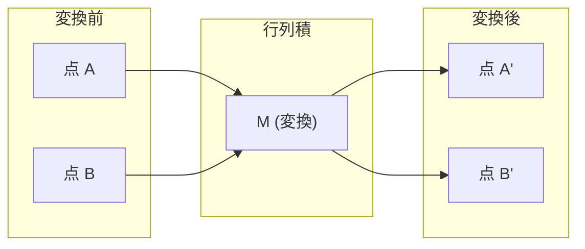
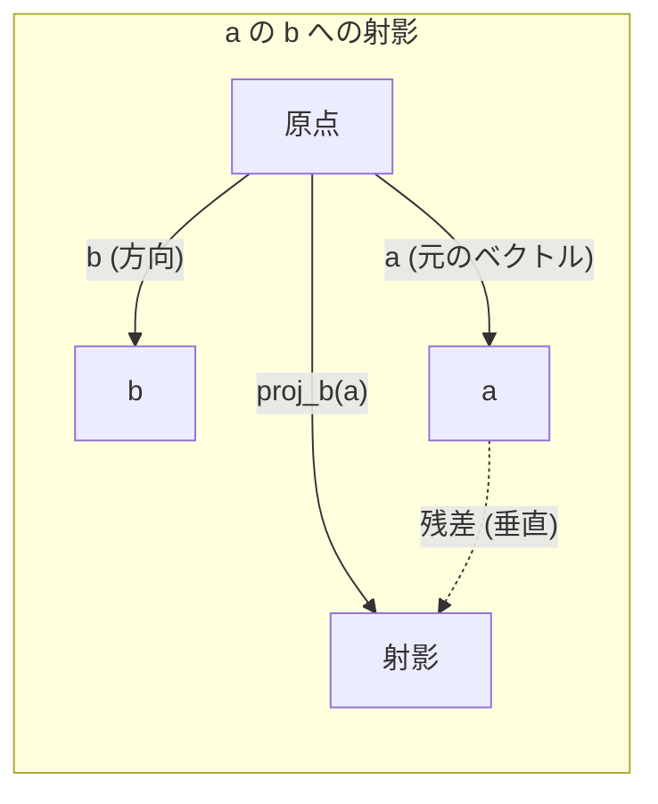

# 線形代数の直感

> すべてのAIモデルは、凝った帽子をかぶった行列計算にすぎません。

**種別:** 学習
**言語:** Python, Julia
**前提条件:** Phase 0
**所要時間:** 約60分

## 学習目標

- Pythonでベクトル演算と行列演算（加算、内積、行列積）をスクラッチ実装する
- 内積、射影、Gram-Schmidtの直交化が幾何学的に何をしているかを説明する
- 行基本変形を使って、ベクトル集合の線形独立性、ランク、基底を判定する
- 線形代数の概念を、埋め込み、アテンションスコア、LoRAなどのAI応用へ結びつける

## 問題

どの機械学習論文を開いても、最初の1ページでベクトル、行列、内積、変換が出てきます。線形代数の直感がなければ、それらはただの記号です。直感があれば、ニューラルネットワークが実際に何をしているのか、つまり空間内の点を動かしていることが見えてきます。

数学者になる必要はありません。必要なのは、これらの演算が幾何学的に何を意味するかを見て、それを自分でコードにすることです。

## 概念

### ベクトルは点であり方向でもある

ベクトルは数値のリストです。ただし、その数値には意味があります。空間内の座標です。

**2Dベクトル [3, 2]:**

| x | y | 点 |
|---|---|-------|
| 3 | 2 | ベクトルは平面上で原点 (0,0) から (3, 2) を指す |

このベクトルの大きさは sqrt(3^2 + 2^2) = sqrt(13) で、右上を向いています。

AIでは、ベクトルがあらゆるものを表します。
- 単語 → 768個の数値からなるベクトル（埋め込み空間での「意味」）
- 画像 → 何百万ものピクセル値からなるベクトル
- ユーザー → 好みを表すベクトル

### 行列は変換である

行列は、あるベクトルを別のベクトルに変換します。回転、拡大縮小、引き伸ばし、射影ができます。



AIでは、行列そのものがモデルです。
- ニューラルネットワークの重み → 入力を出力へ変換する行列
- アテンションスコア → 何に注目するかを決める行列
- 埋め込み → 単語をベクトルへ写す行列

### 内積は類似度を測る

2つのベクトルの内積は、それらがどれだけ似ているかを教えてくれます。

```
a · b = a₁×b₁ + a₂×b₂ + ... + aₙ×bₙ

同じ方向:    a · b > 0  (似ている)
直交:        a · b = 0  (無関係)
反対方向:    a · b < 0  (似ていない)
```

これは検索エンジン、推薦システム、RAGが実際にやっていることです。内積が大きいベクトルを見つけます。

### 線形独立

集合内のどのベクトルも他のベクトルの組み合わせとして書けないとき、そのベクトルたちは線形独立です。v1、v2、v3が独立なら、それらは3D空間を張ります。どれか1つが他の組み合わせなら、張るのは平面だけです。

AIでなぜ重要か: 特徴量行列の列は線形独立であるべきです。2つの特徴量が完全に相関している（線形従属である）場合、モデルはそれぞれの効果を区別できません。これは回帰で多重共線性を引き起こします。重み行列が不安定になり、小さな入力変化が出力を大きく揺らします。

**具体例:**

```
v1 = [1, 0, 0]
v2 = [0, 1, 0]
v3 = [2, 1, 0]   # v3 = 2*v1 + v2
```

v1とv2は独立です。どちらも相手のスカラー倍でも組み合わせでもありません。しかし v3 = 2*v1 + v2 なので、{v1, v2, v3} は従属な集合です。この3つのベクトルはすべてxy平面上にあります。どのように組み合わせても [0, 0, 1] には到達できません。ベクトルは3本ありますが、自由度は2次元分だけです。

データセットでいえば、feature_3 = 2*feature_1 + feature_2 なら、feature_3を加えてもモデルに新しい情報はまったく増えません。さらに悪いことに、正規方程式が特異になります。つまり、重みに対する一意な解がありません。

### 基底とランク

基底とは、空間全体を張る線形独立なベクトルの最小集合です。基底ベクトルの数が、その空間の次元です。

3D空間の標準基底は {[1,0,0], [0,1,0], [0,0,1]} です。ただし、3D内の任意の3本の独立なベクトルも有効な基底になります。基底を選ぶことは、座標系を選ぶことです。

行列のランク = 線形独立な列の数 = 線形独立な行の数です。rank < min(rows, cols) の場合、その行列はランク落ちしています。これは次を意味します。
- その系には無限に多くの解がある（または解がない）
- 変換で情報が失われる
- 行列を逆行列にできない

| 状況 | ランク | MLでの意味 |
|-----------|------|---------------------|
| フルランク (rank = min(m, n)) | 可能な最大値 | 一意な最小二乗解が存在する。モデルの条件が良い。 |
| ランク落ち (rank < min(m, n)) | 最大値より小さい | 特徴量が冗長。重み解が無限にある。正則化が必要。 |
| ランク1 | 1 | すべての列が1つのベクトルのスケール違い。全データが直線上にある。 |
| ほぼランク落ち (小さい特異値) | 数値的に低い | 行列の条件が悪い。ごく小さな入力ノイズが大きな出力変化を生む。SVDの打ち切りやリッジ回帰を使う。 |

### 射影

ベクトル **a** をベクトル **b** に射影すると、**a** のうち **b** 方向の成分が得られます。

```
proj_b(a) = (a dot b / b dot b) * b
```

残差 (a - proj_b(a)) は b に垂直です。この直交分解が、最小二乗フィッティングの土台です。

射影は機械学習の至るところにあります。
- 線形回帰は、観測値から列空間までの距離を最小化する。解そのものが射影である
- PCAは、データを分散が最大になる方向へ射影する
- トランスフォーマーのアテンションは、クエリをキーへ射影する計算を行う



**例:** a = [3, 4], b = [1, 0]

proj_b(a) = (3*1 + 4*0) / (1*1 + 0*0) * [1, 0] = 3 * [1, 0] = [3, 0]

この射影はy成分を落とします。これは最も単純な形の次元削減です。関心のない方向を捨てているのです。

### Gram-Schmidtの直交化

独立なベクトル集合を、正規直交基底へ変換する手続きです。正規直交とは、すべてのベクトルの長さが1で、すべてのペアが垂直であることを意味します。

アルゴリズム:
1. 最初のベクトルを取り、正規化する
2. 2番目のベクトルから、最初のベクトルへの射影を引き、正規化する
3. 3番目のベクトルから、それ以前のすべてのベクトルへの射影を引き、正規化する
4. 残りのベクトルについて繰り返す

```
入力:  v1, v2, v3, ... (線形独立)

u1 = v1 / |v1|

w2 = v2 - (v2 dot u1) * u1
u2 = w2 / |w2|

w3 = v3 - (v3 dot u1) * u1 - (v3 dot u2) * u2
u3 = w3 / |w3|

出力: u1, u2, u3, ... (正規直交基底)
```

これはQR分解が内部で行っていることです。Qは正規直交基底、Rは射影係数を捉えます。QR分解は次で使われます。
- 線形方程式系を解く（ガウス消去より安定）
- 固有値を計算する（QRアルゴリズム）
- 最小二乗回帰（標準的な数値計算法）

## 作ってみる

### ステップ 1: スクラッチでベクトル (Python)

```python
class Vector:
    def __init__(self, components):
        self.components = list(components)
        self.dim = len(self.components)

    def __add__(self, other):
        return Vector([a + b for a, b in zip(self.components, other.components)])

    def __sub__(self, other):
        return Vector([a - b for a, b in zip(self.components, other.components)])

    def dot(self, other):
        return sum(a * b for a, b in zip(self.components, other.components))

    def magnitude(self):
        return sum(x**2 for x in self.components) ** 0.5

    def normalize(self):
        mag = self.magnitude()
        return Vector([x / mag for x in self.components])

    def cosine_similarity(self, other):
        return self.dot(other) / (self.magnitude() * other.magnitude())

    def __repr__(self):
        return f"Vector({self.components})"


a = Vector([1, 2, 3])
b = Vector([4, 5, 6])

print(f"a + b = {a + b}")
print(f"a · b = {a.dot(b)}")
print(f"|a| = {a.magnitude():.4f}")
print(f"cosine similarity = {a.cosine_similarity(b):.4f}")
```

### ステップ 2: スクラッチで行列 (Python)

```python
class Matrix:
    def __init__(self, rows):
        self.rows = [list(row) for row in rows]
        self.shape = (len(self.rows), len(self.rows[0]))

    def __matmul__(self, other):
        if isinstance(other, Vector):
            return Vector([
                sum(self.rows[i][j] * other.components[j] for j in range(self.shape[1]))
                for i in range(self.shape[0])
            ])
        rows = []
        for i in range(self.shape[0]):
            row = []
            for j in range(other.shape[1]):
                row.append(sum(
                    self.rows[i][k] * other.rows[k][j]
                    for k in range(self.shape[1])
                ))
            rows.append(row)
        return Matrix(rows)

    def transpose(self):
        return Matrix([
            [self.rows[j][i] for j in range(self.shape[0])]
            for i in range(self.shape[1])
        ])

    def __repr__(self):
        return f"Matrix({self.rows})"


rotation_90 = Matrix([[0, -1], [1, 0]])
point = Vector([3, 1])

rotated = rotation_90 @ point
print(f"Original: {point}")
print(f"Rotated 90°: {rotated}")
```

### ステップ 3: これがAIで重要な理由

```python
import random

random.seed(42)
weights = Matrix([[random.gauss(0, 0.1) for _ in range(3)] for _ in range(2)])
input_vector = Vector([1.0, 0.5, -0.3])

output = weights @ input_vector
print(f"Input (3D): {input_vector}")
print(f"Output (2D): {output}")
print("This is what a neural network layer does -- matrix multiplication.")
```

### ステップ 4: Julia版

```julia
a = [1.0, 2.0, 3.0]
b = [4.0, 5.0, 6.0]

println("a + b = ", a + b)
println("a · b = ", a ⋅ b)       # Julia supports unicode operators
println("|a| = ", √(a ⋅ a))
println("cosine = ", (a ⋅ b) / (√(a ⋅ a) * √(b ⋅ b)))

# Matrix-vector multiplication
W = [0.1 -0.2 0.3; 0.4 0.5 -0.1]
x = [1.0, 0.5, -0.3]
println("Wx = ", W * x)
println("This is a neural network layer.")
```

### ステップ 5: 線形独立と射影をスクラッチ実装する (Python)

```python
def is_linearly_independent(vectors):
    n = len(vectors)
    dim = len(vectors[0].components)
    mat = Matrix([v.components[:] for v in vectors])
    rows = [row[:] for row in mat.rows]
    rank = 0
    for col in range(dim):
        pivot = None
        for row in range(rank, len(rows)):
            if abs(rows[row][col]) > 1e-10:
                pivot = row
                break
        if pivot is None:
            continue
        rows[rank], rows[pivot] = rows[pivot], rows[rank]
        scale = rows[rank][col]
        rows[rank] = [x / scale for x in rows[rank]]
        for row in range(len(rows)):
            if row != rank and abs(rows[row][col]) > 1e-10:
                factor = rows[row][col]
                rows[row] = [rows[row][j] - factor * rows[rank][j] for j in range(dim)]
        rank += 1
    return rank == n


def project(a, b):
    scalar = a.dot(b) / b.dot(b)
    return Vector([scalar * x for x in b.components])


def gram_schmidt(vectors):
    orthonormal = []
    for v in vectors:
        w = v
        for u in orthonormal:
            proj = project(w, u)
            w = w - proj
        if w.magnitude() < 1e-10:
            continue
        orthonormal.append(w.normalize())
    return orthonormal


v1 = Vector([1, 0, 0])
v2 = Vector([1, 1, 0])
v3 = Vector([1, 1, 1])
basis = gram_schmidt([v1, v2, v3])
for i, u in enumerate(basis):
    print(f"u{i+1} = {u}")
    print(f"  |u{i+1}| = {u.magnitude():.6f}")

print(f"u1 · u2 = {basis[0].dot(basis[1]):.6f}")
print(f"u1 · u3 = {basis[0].dot(basis[2]):.6f}")
print(f"u2 · u3 = {basis[1].dot(basis[2]):.6f}")
```

## 使ってみる

同じことをNumPyで行います。実務で実際に使うのはこちらです。

```python
import numpy as np

a = np.array([1, 2, 3], dtype=float)
b = np.array([4, 5, 6], dtype=float)

print(f"a + b = {a + b}")
print(f"a · b = {np.dot(a, b)}")
print(f"|a| = {np.linalg.norm(a):.4f}")
print(f"cosine = {np.dot(a, b) / (np.linalg.norm(a) * np.linalg.norm(b)):.4f}")

W = np.random.randn(2, 3) * 0.1
x = np.array([1.0, 0.5, -0.3])
print(f"Wx = {W @ x}")
```

### NumPyでランク、射影、QRを扱う

```python
import numpy as np

A = np.array([[1, 2], [2, 4]])
print(f"Rank: {np.linalg.matrix_rank(A)}")

a = np.array([3, 4])
b = np.array([1, 0])
proj = (np.dot(a, b) / np.dot(b, b)) * b
print(f"Projection of {a} onto {b}: {proj}")

Q, R = np.linalg.qr(np.random.randn(3, 3))
print(f"Q is orthogonal: {np.allclose(Q @ Q.T, np.eye(3))}")
print(f"R is upper triangular: {np.allclose(R, np.triu(R))}")
```

### PyTorch - テンソルはAutodiff付きのベクトル

```python
import torch

x = torch.randn(3, requires_grad=True)
y = torch.tensor([1.0, 0.0, 0.0])

similarity = torch.dot(x, y)
similarity.backward()

print(f"x = {x.data}")
print(f"y = {y.data}")
print(f"dot product = {similarity.item():.4f}")
print(f"d(dot)/dx = {x.grad}")
```

xに関する内積の勾配は、単にyです。PyTorchはこれを自動で計算しました。ニューラルネットワーク内のすべての演算は、このような演算、つまり行列積、内積、射影から組み立てられています。そしてautodiffは、それらすべてを通じて勾配を追跡します。

NumPyが1行で行うことを、あなたはスクラッチで作りました。これで内部で何が起きているかが分かります。

## 成果物

このレッスンでは次を作ります。
- `outputs/prompt-linear-algebra-tutor.md` - 幾何学的な直感を通じて線形代数を教えるAIアシスタント用プロンプト

## 関連

このレッスンのすべては、現代AIの具体的な部分につながっています。

| 概念 | 現れる場所 |
|---------|------------------|
| 内積 | トランスフォーマーのアテンションスコア、RAGのコサイン類似度 |
| 行列積 | すべてのニューラルネットワーク層、すべての線形変換 |
| 線形独立 | 特徴選択、多重共線性の回避 |
| ランク | 系が解けるかの判定、LoRA（low-rank adaptation） |
| 射影 | 線形回帰（列空間への射影）、PCA |
| Gram-Schmidt / QR | 数値ソルバー、固有値計算 |
| 正規直交基底 | 安定した数値計算、ホワイトニング変換 |

LoRAは特に重要です。LoRAは重み更新を低ランク行列に分解することで、大規模言語モデルをファインチューニングします。4096x4096の重み行列（16Mパラメータ）を更新する代わりに、LoRAは 4096x16 と 16x4096 の2つの行列（131Kパラメータ）を更新します。rank-16という制約は、重み更新が完全な4096次元空間ではなく、16次元部分空間にあると仮定していることを意味します。これは線形代数が実際に仕事をしている例です。

## 演習

1. 2つのベクトルの間の角度を度数で返す `Vector.angle_between(other)` を実装してください
2. x座標を2倍、y座標を3倍にする2Dスケーリング行列を作り、ベクトル [1, 1] に適用してください
3. 単語らしいランダムなベクトルを5個（次元50）作り、コサイン類似度で最も似ている2つを見つけてください
4. Gram-Schmidtの出力が本当に正規直交であることを検証してください。すべてのペアの内積が0で、すべてのベクトルの大きさが1であることを確認します
5. ランク2の3x3行列を作ってください。`rank()` メソッドで検証し、その列が張る幾何学的対象を説明してください
6. ベクトル [1, 2, 3] を [1, 1, 1] に射影してください。その結果は幾何学的に何を表していますか？

## 重要用語

| 用語 | よくある言い方 | 実際の意味 |
|------|----------------|----------------------|
| ベクトル | 「矢印」 | n次元空間の点または方向を表す数値のリスト |
| 行列 | 「数値の表」 | ベクトルをある空間から別の空間へ写す変換 |
| 内積 | 「掛けて足す」 | 2つのベクトルがどれだけ同じ方向を向いているかの尺度。類似度検索の中核 |
| 埋め込み | 「AIの魔法のようなもの」 | 単語、画像、ユーザーなど何かの意味を表すベクトル |
| 線形独立 | 「重なっていない」 | 集合内のどのベクトルも、他のベクトルの組み合わせとして書けないこと |
| ランク | 「何次元か」 | 行列内の線形独立な列（または行）の数 |
| 射影 | 「影」 | あるベクトルの、別のベクトル方向の成分 |
| 基底 | 「座標軸」 | 空間を張る独立なベクトルの最小集合 |
| 正規直交 | 「垂直な単位ベクトル」 | 互いに垂直で、それぞれの長さが1のベクトル |
