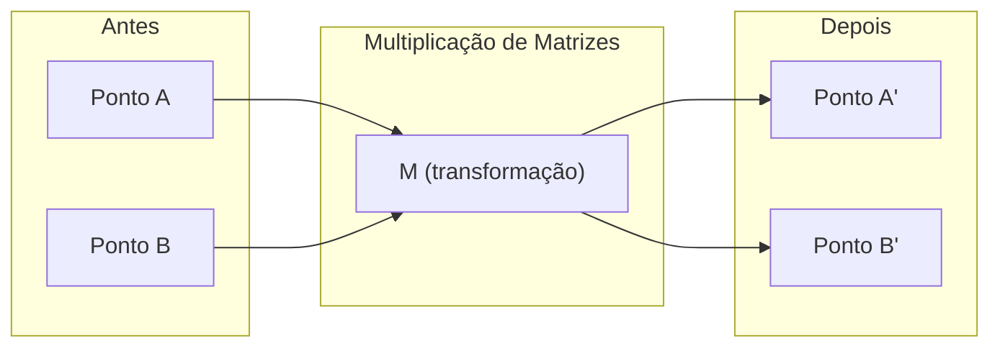
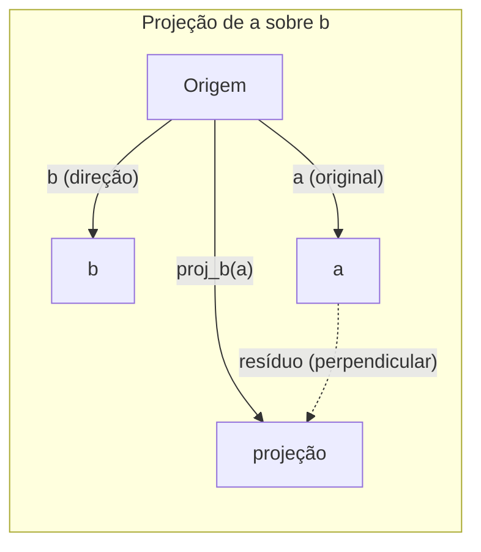

# Intuição de Álgebra Linear

> Todo modelo de IA é apenas matemática de matrizes usando um chapéu chique.

**Tipo:** Aprender
**Linguagens:** Python, Julia
**Pré-requisitos:** Fase 0
**Tempo:** ~60 minutos

## Objetivos de Aprendizado

- Implementar operações de vetores e matrizes (soma, produto escalar, multiplicação de matrizes) do zero em Python
- Explicar geometricamente o que o produto escalar, a projeção e o processo de Gram-Schmidt fazem
- Determinar independência linear, posto e base de um conjunto de vetores usando eliminação gaussiana
- Conectar conceitos de álgebra linear às suas aplicações em IA: embeddings, scores de attention e LoRA

## O Problemo

Abra qualquer paper de ML. Na primeira página, você vai ver vetores, matrizes, produtos escalares e transformações. Sem intuição de álgebra linear, isso são só símbolos. Com ela, você consegue ver o que uma rede neural realmente está fazendo — movendo pontos pelo espaço.

Você não precisa ser matemático. Você precisa ver o que essas operações significam geometricamente, e depois programá-las.

## O Conceito

### Vetores São Pontos (e Direções)

Um vetor é só uma lista de números. Mas esses números significam alguma coisa — são coordenadas no espaço.

**Vetor 2D [3, 2]:**

| x | y | Ponto |
|---|---|-------|
| 3 | 2 | O vetor aponta da origem (0,0) para (3, 2) no plano |

O vetor tem magnitude sqrt(3^2 + 2^2) = sqrt(13) e aponta para cima e à direita.

Na IA, vetores representam tudo:
- Uma palavra → um vetor de 768 números (seu "significado" no espaço de embedding)
- Uma imagem → um vetor de milhões de valores de pixel
- Um usuário → um vetor de preferências

### Matrizes São Transformações

Uma matriz transforma um vetor em outro. Ela pode rotacionar, escalar, esticar ou projetar.



Na IA, as matrizes SÃO o modelo:
- Pesos de rede neural → matrizes que transformam entrada em saída
- Scores de attention → matrizes que decidem onde focar
- Embeddings → matrizes que mapeiam palavras em vetores

### O Produto Escalar Mede Similaridade

O produto escalar de dois vetores diz o quão parecidos eles são.

```
a · b = a₁×b₁ + a₂×b₂ + ... + aₙ×bₙ

Mesma direção:      a · b > 0  (similar)
Perpendicular:      a · b = 0  (sem relação)
Direção oposta:     a · b < 0  (dissimilar)
```

Isso é literalmente como funcionam motores de busca, sistemas de recomendação e RAG — encontrar vetores com altos produtos escalares.

### Independência Linear

Vetores são linearmente independentes se nenhum vetor do conjunto pode ser escrito como combinação dos outros. Se v1, v2, v3 são independentes, eles span um espaço 3D. Se um é combinação dos outros, eles só span um plano.

Por que isso importa na IA: sua matriz de features deve ter colunas linearmente independentes. Se duas features são perfeitamente correlacionadas (linearmente dependentes), o modelo não consegue distinguir seus efeitos. Isso causa multicolinearidade em regressão — a matriz de pesos fica instável, e pequenas mudanças de entrada produzem grandes oscilações na saída.

**Exemplo concreto:**

```
v1 = [1, 0, 0]
v2 = [0, 1, 0]
v3 = [2, 1, 0]   # v3 = 2*v1 + v2
```

v1 e v2 são independentes — nenhuma é múltipla escalar ou combinação da outra. Mas v3 = 2*v1 + v2, então {v1, v2, v3} é um conjunto dependente. Esses três vetores ficam todos no plano xy. Não importa como você combine, não dá pra chegar em [0, 0, 1]. Você tem três vetores mas só duas dimensões de liberdade.

Em um dataset: se feature_3 = 2*feature_1 + feature_2, adicionar feature_3 não dá informação nova pro modelo. Pior, isso torna as equações normais singulares — não existe solução única para os pesos.

### Base e Posto

Uma base é um conjunto minimal de vetores linearmente independentes que span todo o espaço. O número de vetores base é a dimensão do espaço.

A base canônica para o espaço 3D é {[1,0,0], [0,1,0], [0,0,1]}. Mas quaisquer três vetores independentes em 3D formam uma base válida. A escolha da base é uma escolha de sistema de coordenadas.

Posto de uma matriz = número de colunas linearmente independentes = número de linhas linearmente independentes. Se o posto < min(linhas, colunas), a matriz é deficiente em posto. Isso significa:
- O sistema tem infinitas soluções (ou nenhuma)
- Informação é perdida na transformação
- A matriz não pode ser invertida

| Situação | Posto | O que significa pro ML |
|-----------|------|---------------------|
| Posto completo (posto = min(m, n)) | Máximo possível | Existe solução única de mínimos quadrados. Modelo é bem condicionado. |
| Posto deficiente (posto < min(m, n)) | Abaixo do máximo | Features são redundantes. Infinitas soluções de pesos. Regularização necessária. |
| Posto 1 | 1 | Cada coluna é uma cópia escalada de um vetor. Todos os dados ficam numa linha. |
| Quase deficiente (valores singulares pequenos) | Numericamente baixo | Matriz é mal condicionada. Pequeno ruído de entrada causa grandes mudanças na saída. Use truncamento SVD ou regressão ridge. |

### Projeção

Projetar o vetor **a** sobre o vetor **b** dá o componente de **a** na direção de **b**:

```
proj_b(a) = (a dot b / b dot b) * b
```

O resíduo (a - proj_b(a)) é perpendicular a b. Essa decomposição ortogonal é a base do ajuste por mínimos quadrados.

Projeção está em todo lugar no ML:
- Regressão linear minimiza a distância das observações ao espaço coluna — a solução É uma projeção
- PCA projeta dados nas direções de máxima variância
- Attention em transformers calcula projeções de queries sobre keys



**Exemplo:** a = [3, 4], b = [1, 0]

proj_b(a) = (3*1 + 4*0) / (1*1 + 0*0) * [1, 0] = 3 * [1, 0] = [3, 0]

A projeção elimina o componente y. Isso é redução de dimensionalidade na sua forma mais simples — jogar fora as direções que não lhe interessam.

### Processo de Gram-Schmidt

Converter qualquer conjunto de vetores independentes em uma base ortonormal. Ortonormal significa que cada vetor tem comprimento 1 e cada par é perpendicular.

O algoritmo:
1. Pegue o primeiro vetor, normalize-o
2. Pegue o segundo vetor, subtraia sua projeção sobre o primeiro, normalize
3. Pegue o terceiro vetor, subtraia suas projeções sobre todos os vetores anteriores, normalize
4. Repita para os vetores restantes

```
Entrada:  v1, v2, v3, ... (linearmente independentes)

u1 = v1 / |v1|

w2 = v2 - (v2 dot u1) * u1
u2 = w2 / |w2|

w3 = v3 - (v3 dot u1) * u1 - (v3 dot u2) * u2
u3 = w3 / |w3|

Saída: u1, u2, u3, ... (base ortonormal)
```

É assim que funciona a decomposição QR por dentro. Q é a base ortonormal, R captura os coeficientes de projeção. Decomposição QR é usada em:
- Resolver sistemas lineares (mais estável que eliminação gaussiana)
- Computar autovalores (algoritmo QR)
- Regressão de mínimos quadrados (o método numérico padrão)

## Construa

### Passo 1: Vetores do zero (Python)

```python
class Vector:
    def __init__(self, components):
        self.components = list(components)
        self.dim = len(self.components)

    def __add__(self, other):
        return Vector([a + b for a, b in zip(self.components, other.components)])

    def __sub__(self, other):
        return Vector([a - b for a, b in zip(self.components, other.components)])

    def dot(self, other):
        return sum(a * b for a, b in zip(self.components, other.components))

    def magnitude(self):
        return sum(x**2 for x in self.components) ** 0.5

    def normalize(self):
        mag = self.magnitude()
        return Vector([x / mag for x in self.components])

    def cosine_similarity(self, other):
        return self.dot(other) / (self.magnitude() * other.magnitude())

    def __repr__(self):
        return f"Vector({self.components})"


a = Vector([1, 2, 3])
b = Vector([4, 5, 6])

print(f"a + b = {a + b}")
print(f"a · b = {a.dot(b)}")
print(f"|a| = {a.magnitude():.4f}")
print(f"similaridade cosseno = {a.cosine_similarity(b):.4f}")
```

### Passo 2: Matrizes do zero (Python)

```python
class Matrix:
    def __init__(self, rows):
        self.rows = [list(row) for row in rows]
        self.shape = (len(self.rows), len(self.rows[0]))

    def __matmul__(self, other):
        if isinstance(other, Vector):
            return Vector([
                sum(self.rows[i][j] * other.components[j] for j in range(self.shape[1]))
                for i in range(self.shape[0])
            ])
        rows = []
        for i in range(self.shape[0]):
            row = []
            for j in range(other.shape[1]):
                row.append(sum(
                    self.rows[i][k] * other.rows[k][j]
                    for k in range(self.shape[1])
                ))
            rows.append(row)
        return Matrix(rows)

    def transpose(self):
        return Matrix([
            [self.rows[j][i] for j in range(self.shape[0])]
            for i in range(self.shape[1])
        ])

    def __repr__(self):
        return f"Matrix({self.rows})"


rotation_90 = Matrix([[0, -1], [1, 0]])
point = Vector([3, 1])

rotated = rotation_90 @ point
print(f"Original: {point}")
print(f"Rotacionado 90°: {rotated}")
```

### Passo 3: Por que isso importa pra IA

```python
import random

random.seed(42)
weights = Matrix([[random.gauss(0, 0.1) for _ in range(3)] for _ in range(2)])
input_vector = Vector([1.0, 0.5, -0.3])

output = weights @ input_vector
print(f"Entrada (3D): {input_vector}")
print(f"Saída (2D): {output}")
print("Isso é o que uma camada de rede neural faz — multiplicação de matrizes.")
```

### Passo 4: Versão Julia

```julia
a = [1.0, 2.0, 3.0]
b = [4.0, 5.0, 6.0]

println("a + b = ", a + b)
println("a · b = ", a ⋅ b)       # Julia suporta operadores unicode
println("|a| = ", √(a ⋅ a))
println("cosseno = ", (a ⋅ b) / (√(a ⋅ a) * √(b ⋅ b)))

# Multiplicação matriz-vetor
W = [0.1 -0.2 0.3; 0.4 0.5 -0.1]
x = [1.0, 0.5, -0.3]
println("Wx = ", W * x)
println("Isso é uma camada de rede neural.")
```

### Passo 5: Independência linear e projeção do zero (Python)

```python
def is_linearly_independent(vectors):
    n = len(vectors)
    dim = len(vectors[0].components)
    mat = Matrix([v.components[:] for v in vectors])
    rows = [row[:] for row in mat.rows]
    rank = 0
    for col in range(dim):
        pivot = None
        for row in range(rank, len(rows)):
            if abs(rows[row][col]) > 1e-10:
                pivot = row
                break
        if pivot is None:
            continue
        rows[rank], rows[pivot] = rows[pivot], rows[rank]
        scale = rows[rank][col]
        rows[rank] = [x / scale for x in rows[rank]]
        for row in range(len(rows)):
            if row != rank and abs(rows[row][col]) > 1e-10:
                factor = rows[row][col]
                rows[row] = [rows[row][j] - factor * rows[rank][j] for j in range(dim)]
        rank += 1
    return rank == n


def project(a, b):
    scalar = a.dot(b) / b.dot(b)
    return Vector([scalar * x for x in b.components])


def gram_schmidt(vectors):
    orthonormal = []
    for v in vectors:
        w = v
        for u in orthonormal:
            proj = project(w, u)
            w = w - proj
        if w.magnitude() < 1e-10:
            continue
        orthonormal.append(w.normalize())
    return orthonormal


v1 = Vector([1, 0, 0])
v2 = Vector([1, 1, 0])
v3 = Vector([1, 1, 1])
basis = gram_schmidt([v1, v2, v3])
for i, u in enumerate(basis):
    print(f"u{i+1} = {u}")
    print(f"  |u{i+1}| = {u.magnitude():.6f}")

print(f"u1 · u2 = {basis[0].dot(basis[1]):.6f}")
print(f"u1 · u3 = {basis[0].dot(basis[2]):.6f}")
print(f"u2 · u3 = {basis[1].dot(basis[2]):.6f}")
```

## Use

Agora a mesma coisa com NumPy — o que você vai usar na prática:

```python
import numpy as np

a = np.array([1, 2, 3], dtype=float)
b = np.array([4, 5, 6], dtype=float)

print(f"a + b = {a + b}")
print(f"a · b = {np.dot(a, b)}")
print(f"|a| = {np.linalg.norm(a):.4f}")
print(f"cosseno = {np.dot(a, b) / (np.linalg.norm(a) * np.linalg.norm(b)):.4f}")

W = np.random.randn(2, 3) * 0.1
x = np.array([1.0, 0.5, -0.3])
print(f"Wx = {W @ x}")
```

### Posto, Projeção e QR com NumPy

```python
import numpy as np

A = np.array([[1, 2], [2, 4]])
print(f"Posto: {np.linalg.matrix_rank(A)}")

a = np.array([3, 4])
b = np.array([1, 0])
proj = (np.dot(a, b) / np.dot(b, b)) * b
print(f"Projeção de {a} sobre {b}: {proj}")

Q, R = np.linalg.qr(np.random.randn(3, 3))
print(f"Q é ortogonal: {np.allclose(Q @ Q.T, np.eye(3))}")
print(f"R é triangular superior: {np.allclose(R, np.triu(R))}")
```

### PyTorch — Tensores São Vetores com Autograd

```python
import torch

x = torch.randn(3, requires_grad=True)
y = torch.tensor([1.0, 0.0, 0.0])

similarity = torch.dot(x, y)
similarity.backward()

print(f"x = {x.data}")
print(f"y = {y.data}")
print(f"produto escalar = {similarity.item():.4f}")
print(f"d(dot)/dx = {x.grad}")
```

O gradiente do produto escalar em relação a x é apenas y. PyTorch computou isso automaticamente. Toda operação em uma rede neural é construída a partir de operações assim — multiplicações de matrizes, produtos escalares, projeções — e o autograd rastreia os gradientes em todas elas.

Você construiu do zero o que o NumPy faz em uma linha. Agora você sabe o que está acontecendo por baixo dos panos.

## Entregue

Esta aula produz:
- `outputs/prompt-linear-algebra-tutor.md` — um prompt para assistentes de IA ensinarem álgebra linear através de intuição geométrica

## Conexões

Tudo nesta aula se conecta a partes eespecificaçãoíficas da IA moderna:

| Conceito | Onde aparece |
|---------|------------------|
| Produto escalar | Scores de attention em transformers, similaridade cosseno em RAG |
| Multiplicação de matrizes | Toda camada de rede neural, toda transformação linear |
| Independência linear | Seleção de features, evitando multicolinearidade |
| Posto | Determinando se um sistema tem solução, LoRA (adaptação de baixo posto) |
| Projeção | Regressão linear (projetando no espaço coluna), PCA |
| Gram-Schmidt / QR | Solucionadores numéricos, computação de autovalores |
| Base ortonormal | Computação numérica estável, transformações de whitening |

LoRA merece uma menção eespecificaçãoial. Ele faz fine-tuning de grandes modelos de linguagem decompondo atualizações de pesos em matrizes de baixo posto. Em vez de atualizar uma matriz de pesos de 4096x4096 (16M parâmetros), LoRA atualiza duas matrizes de tamanho 4096x16 e 16x4096 (131K parâmetros). A restrição de posto 16 significa que LoRA assume que a atualização dos pesos vive em um subespaço de 16 dimensões do espaço completo de 4096 dimensões. Isso é álgebra linear fazendo trabalho real.

## Exercícios

1. Implemente `Vector.angle_between(other)` que retorna o ângulo em graus entre dois vetores
2. Crie uma matriz de escala 2D que dobre a coordenada x e triple a coordenada y, depois aplique-a ao vetor [1, 1]
3. Dados 5 vetores aleatórios no estilo de palavras (dimensão 50), encontre os dois mais similares usando similaridade cosseno
4. Verifique que a saída do Gram-Schmidt é realmente ortonormal: verifique que cada par tem produto escalar 0 e cada vetor tem magnitude 1
5. Crie uma matriz 3x3 com posto 2. Verifique usando o método `rank()`. Depois explique que objeto geométrico as colunas span
6. Projete o vetor [1, 2, 3] sobre [1, 1, 1]. O que o resultado representa geometricamente?

## Termos Chave

| Termo | O que dizem | O que realmente significa |
|------|----------------|----------------------|
| Vetor | "Uma seta" | Uma lista de números representando um ponto ou direção em espaço n-dimensional |
| Matriz | "Uma tabela de números" | Uma transformação que mapeia vetores de um espaço para outro |
| Produto escalar | "Multiplicar e somar" | Uma medida de quão alinhados dois vetores estão — o cerne da busca por similaridade |
| Embedding | "Uma magia de IA" | Um vetor que representa o significado de alguma coisa (palavra, imagem, usuário) |
| Independência linear | "Elas não se sobrepõem" | Nenhum vetor do conjunto pode ser escrito como combinação dos outros |
| Posto | "Quantas dimensões" | O número de colunas (ou linhas) linearmente independentes em uma matriz |
| Projeção | "A sombra" | O componente de um vetor na direção de outro |
| Base | "Os eixos de coordenadas" | Um conjunto minimal de vetores independentes que span o espaço |
| Ortonormal | "Vetores unitários perpendiculares" | Vetores que são mutuamente perpendiculares e cada um tem comprimento 1 |
