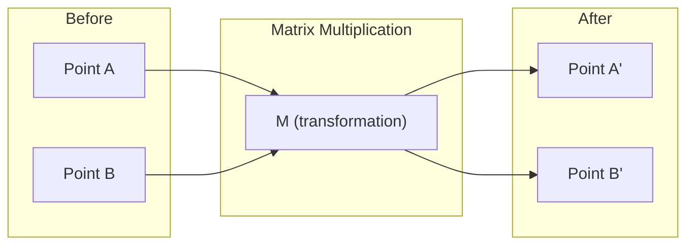
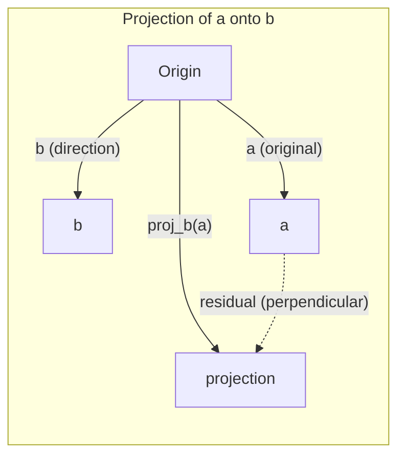

# Doğrusal Cebir Sezgisi

> Her yapay zeka modeli, gösterişli bir şapka giyen matris matematiğinden ibarettir.

**Tür:** Öğren
**Diller:** Python, Julia
**Önkoşullar:** Aşama 0
**Süre:** ~60 dakika

## Öğrenme Hedefleri

- Python'da vektör ve matris işlemlerini (toplama, nokta çarpım, matris çarpma) sıfırdan uygulayın
- Nokta çarpım, izdüşüm ve Gram-Schmidt sürecinin ne yaptığını geometrik olarak açıklayın
- Satır azaltmayı kullanarak bir vektör kümesinin doğrusal bağımsızlığını, sırasını ve temelini belirleyin
- Doğrusal cebir kavramlarını yapay zeka uygulamalarına bağlayın: embedding'ler, dikkat puanları ve LoRA

## Sorun

Herhangi bir ML kağıdını açın. İlk sayfada vektörleri, matrisleri, nokta çarpımlarını ve dönüşümleri göreceksiniz. Doğrusal cebir sezgisi olmadan bunlar sadece sembollerdir. Bununla, neural network'nin aslında ne yaptığını, uzaydaki noktaları hareket ettirdiğini görebilirsiniz.

Matematikçi olmanıza gerek yok. Bu işlemlerin geometrik olarak ne anlama geldiğini görmeniz ve ardından bunları kendiniz kodlamanız gerekir.

## Konsept

### Vektörler Noktalardır (ve Yollardır)

Bir vektör yalnızca sayıların bir listesidir. Ancak bu sayıların bir anlamı var; bunlar uzaydaki koordinatlardır.

**2B vektör [3, 2]:**

| x | y | Nokta |
|---|---|-------|
| 3 | 2 | Vektör düzlemde başlangıç ​​noktasından (0,0) (3, 2) noktasına işaret eder |

Vektörün büyüklüğü sqrt(3^2 + 2^2) = sqrt(13)'tür ve yukarıyı ve sağa işaret eder.

Yapay zekada vektörler her şeyi temsil eder:
- Bir kelime → 768 sayıdan oluşan bir vektör (embedding alanındaki "anlamı")
- Bir görüntü → milyonlarca piksel değerinden oluşan bir vektör
- Bir kullanıcı → tercihler vektörü

### Matrisler Dönüşümlerdir

Bir matris bir vektörü diğerine dönüştürür. Döndürebilir, ölçeklendirebilir, uzatabilir veya yansıtabilir.



Yapay zekada matrisler modeldir:
- Neural network ağırlıkları → girdiyi çıktıya dönüştüren matrisler
- Dikkat puanları → neye odaklanılacağına karar veren matrisler
- Embeddings → kelimeleri vektörlerle eşleştiren matrisler

### Nokta Çarpımı Benzerliği Ölçer

İki vektörün nokta çarpımı size bunların ne kadar benzer olduğunu söyler.

```
a · b = a₁×b₁ + a₂×b₂ + ... + aₙ×bₙ

Same direction:      a · b > 0  (similar)
Perpendicular:       a · b = 0  (unrelated)
Opposite direction:  a · b < 0  (dissimilar)
```

Kelimenin tam anlamıyla arama motorları, öneri sistemleri ve RAG bu şekilde çalışır; yüksek nokta çarpımlarına sahip vektörleri bulur.

### Doğrusal Bağımsızlık

Kümedeki hiçbir vektör diğerlerinin birleşimi olarak yazılamıyorsa vektörler doğrusal olarak bağımsızdır. Eğer v1, v2, v3 bağımsızsa 3 boyutlu bir alanı kaplarlar. Biri diğerlerinin birleşimi ise yalnızca bir düzlemi kapsar.

Yapay zeka için neden önemlidir: Özellik matrisiniz doğrusal olarak bağımsız sütunlara sahip olmalıdır. İki özellik mükemmel bir şekilde ilişkiliyse (doğrusal olarak bağımlı), model bunların etkilerini ayırt edemez. Bu, regresyonda çoklu doğrusallığa neden olur; ağırlık matrisi kararsız hale gelir ve küçük girdi değişiklikleri, aşırı çıktı salınımlarına neden olur.

**Somut örnek:**

```
v1 = [1, 0, 0]
v2 = [0, 1, 0]
v3 = [2, 1, 0]   # v3 = 2*v1 + v2
```

v1 ve v2 bağımsızdır; ikisi de diğerinin skaler katı veya birleşimi değildir. Fakat v3 = 2*v1 + v2 olduğundan {v1, v2, v3} bağımlı bir kümedir. Bu üç vektörün tümü xy düzleminde yer alır. Bunları nasıl birleştirirseniz birleştirin [0, 0, 1]'e ulaşamazsınız. Üç vektörünüz var ama özgürlüğün yalnızca iki boyutu var.

dataset'de: eğer özellik_3 = 2*özellik_1 + özellik_2 ise, özellik_3'ün eklenmesi modele sıfır yeni bilgi verir. Daha da kötüsü, normal denklemleri tekil hale getirir; ağırlıklar için tek bir çözüm yoktur.

### Temel ve Sıralama

Temel, tüm uzayı kapsayan minimal doğrusal bağımsız vektörler kümesidir. Temel vektörlerin sayısı uzayın boyutudur.

3B alanın standart temeli {[1,0,0], [0,1,0], [0,0,1]}'dir. Ancak 3B'deki herhangi üç bağımsız vektör geçerli bir temel oluşturur. Temel seçimi koordinat sisteminin seçimidir.

Bir matrisin sırası = doğrusal olarak bağımsız sütunların sayısı = doğrusal olarak bağımsız satırların sayısı. Rank < min(satırlar, sütunlar) ise matrisin sıralaması eksiktir. Bu şu anlama gelir:
- Sistemin sonsuz sayıda çözümü var (ya da hiçbiri yok)
- Dönüşümde bilgi kaybolur
- Matris ters çevrilemez

| Durum | Sıra | Makine öğrenimi için ne anlama geliyor |
|-----------|------|---------------------|
| Tam sıralama (sıra = min(m, n)) | Mümkün olan maksimum | Benzersiz en küçük kareler çözümü mevcuttur. Model iyi durumda. |
| Sıralama yetersiz (sıra < min(m, n)) | Maksimumun altında | Özellikler gereksizdir. Sonsuz sayıda ağırlık çözümü. Düzenleme gerekiyor. |
| Sıra 1 | 1 | Her sütun bir vektörün ölçeklendirilmiş kopyasıdır. Tüm veriler bir çizgi üzerinde yer alır. |
| Neredeyse sıralama eksikliği (küçük tekil değerler) | Sayısal olarak düşük | Matrix'in durumu kötü. Küçük giriş gürültüsü büyük çıkış değişikliklerine neden olur. SVD kesmeyi veya sırt regresyonunu kullanın. |

### Projeksiyon

**a** vektörünün **b** vektörüne izdüşümü, **a**'nın **b** yönündeki bileşenini verir:

```
proj_b(a) = (a dot b / b dot b) * b
```

Artık (a - proje_b(a)) b'ye diktir. Bu ortogonal ayrıştırma, en küçük kareler uydurmanın temelidir.

Projeksiyon ML'de her yerdedir:
- Doğrusal regresyon, gözlemlerden sütun uzayına olan mesafeyi en aza indirir; çözüm bir projeksiyondur
- PCA, verileri maksimum varyans yönlerine yansıtır
- transformer'lerdeki dikkat, sorguların anahtarlara projeksiyonunu hesaplar



**Örnek:** a = [3, 4], b = [1, 0]

proje_b(a) = (3*1 + 4*0) / (1*1 + 0*0) * [1, 0] = 3 * [1, 0] = [3, 0]

Projeksiyon y bileşenini düşürür. Bu, en basit haliyle boyut azaltımıdır; umursamadığınız yönleri atın.

### Gram-Schmidt Süreci

Herhangi bir bağımsız vektör kümesini ortonormal tabana dönüştürme. Ortonormal, her vektörün uzunluğunun 1 olduğu ve her çiftin dik olduğu anlamına gelir.

Algoritma:
1. İlk vektörü alın, normalleştirin
2. İkinci vektörü alın, izdüşümünü birinciden çıkarın, normalleştirin
3. Üçüncü vektörü alın, izdüşümlerini önceki tüm vektörlerden çıkarın, normalleştirin
4. Kalan vektörler için tekrarlayın

```
Input:  v1, v2, v3, ... (linearly independent)

u1 = v1 / |v1|

w2 = v2 - (v2 dot u1) * u1
u2 = w2 / |w2|

w3 = v3 - (v3 dot u1) * u1 - (v3 dot u2) * u2
u3 = w3 / |w3|

Output: u1, u2, u3, ... (orthonormal basis)
```

QR ayrıştırması dahili olarak bu şekilde çalışır. Q ortonormal temeldir, R projeksiyon katsayılarını yakalar. QR ayrıştırması şu durumlarda kullanılır:
- Doğrusal sistemleri çözme (Gauss eliminasyonundan daha kararlı)
- Özdeğerlerin hesaplanması (QR algoritması)
- En küçük kareler regresyonu (standart sayısal yöntem)

```figure
eigen-directions
```

## İnşa Et

### Adım 1: Sıfırdan vektörler (Python)

```python
class Vector:
    def __init__(self, components):
        self.components = list(components)
        self.dim = len(self.components)

    def __add__(self, other):
        return Vector([a + b for a, b in zip(self.components, other.components)])

    def __sub__(self, other):
        return Vector([a - b for a, b in zip(self.components, other.components)])

    def dot(self, other):
        return sum(a * b for a, b in zip(self.components, other.components))

    def magnitude(self):
        return sum(x**2 for x in self.components) ** 0.5

    def normalize(self):
        mag = self.magnitude()
        return Vector([x / mag for x in self.components])

    def cosine_similarity(self, other):
        return self.dot(other) / (self.magnitude() * other.magnitude())

    def __repr__(self):
        return f"Vector({self.components})"


a = Vector([1, 2, 3])
b = Vector([4, 5, 6])

print(f"a + b = {a + b}")
print(f"a · b = {a.dot(b)}")
print(f"|a| = {a.magnitude():.4f}")
print(f"cosine similarity = {a.cosine_similarity(b):.4f}")
```

### Adım 2: Sıfırdan matrisler (Python)

```python
class Matrix:
    def __init__(self, rows):
        self.rows = [list(row) for row in rows]
        self.shape = (len(self.rows), len(self.rows[0]))

    def __matmul__(self, other):
        if isinstance(other, Vector):
            return Vector([
                sum(self.rows[i][j] * other.components[j] for j in range(self.shape[1]))
                for i in range(self.shape[0])
            ])
        rows = []
        for i in range(self.shape[0]):
            row = []
            for j in range(other.shape[1]):
                row.append(sum(
                    self.rows[i][k] * other.rows[k][j]
                    for k in range(self.shape[1])
                ))
            rows.append(row)
        return Matrix(rows)

    def transpose(self):
        return Matrix([
            [self.rows[j][i] for j in range(self.shape[0])]
            for i in range(self.shape[1])
        ])

    def __repr__(self):
        return f"Matrix({self.rows})"


rotation_90 = Matrix([[0, -1], [1, 0]])
point = Vector([3, 1])

rotated = rotation_90 @ point
print(f"Original: {point}")
print(f"Rotated 90°: {rotated}")
```

### 3. Adım: Bu yapay zeka için neden önemlidir?

```python
import random

random.seed(42)
weights = Matrix([[random.gauss(0, 0.1) for _ in range(3)] for _ in range(2)])
input_vector = Vector([1.0, 0.5, -0.3])

output = weights @ input_vector
print(f"Input (3D): {input_vector}")
print(f"Output (2D): {output}")
print("This is what a neural network layer does -- matrix multiplication.")
```

### Adım 4: Julia versiyonu

```julia
a = [1.0, 2.0, 3.0]
b = [4.0, 5.0, 6.0]

println("a + b = ", a + b)
println("a · b = ", a ⋅ b)       # Julia supports unicode operators
println("|a| = ", √(a ⋅ a))
println("cosine = ", (a ⋅ b) / (√(a ⋅ a) * √(b ⋅ b)))

# Matrix-vector multiplication
W = [0.1 -0.2 0.3; 0.4 0.5 -0.1]
x = [1.0, 0.5, -0.3]
println("Wx = ", W * x)
println("This is a neural network layer.")
```

### Adım 5: Doğrusal bağımsızlık ve sıfırdan projeksiyon (Python)

```python
def is_linearly_independent(vectors):
    n = len(vectors)
    dim = len(vectors[0].components)
    mat = Matrix([v.components[:] for v in vectors])
    rows = [row[:] for row in mat.rows]
    rank = 0
    for col in range(dim):
        pivot = None
        for row in range(rank, len(rows)):
            if abs(rows[row][col]) > 1e-10:
                pivot = row
                break
        if pivot is None:
            continue
        rows[rank], rows[pivot] = rows[pivot], rows[rank]
        scale = rows[rank][col]
        rows[rank] = [x / scale for x in rows[rank]]
        for row in range(len(rows)):
            if row != rank and abs(rows[row][col]) > 1e-10:
                factor = rows[row][col]
                rows[row] = [rows[row][j] - factor * rows[rank][j] for j in range(dim)]
        rank += 1
    return rank == n


def project(a, b):
    scalar = a.dot(b) / b.dot(b)
    return Vector([scalar * x for x in b.components])


def gram_schmidt(vectors):
    orthonormal = []
    for v in vectors:
        w = v
        for u in orthonormal:
            proj = project(w, u)
            w = w - proj
        if w.magnitude() < 1e-10:
            continue
        orthonormal.append(w.normalize())
    return orthonormal


v1 = Vector([1, 0, 0])
v2 = Vector([1, 1, 0])
v3 = Vector([1, 1, 1])
basis = gram_schmidt([v1, v2, v3])
for i, u in enumerate(basis):
    print(f"u{i+1} = {u}")
    print(f"  |u{i+1}| = {u.magnitude():.6f}")

print(f"u1 · u2 = {basis[0].dot(basis[1]):.6f}")
print(f"u1 · u3 = {basis[0].dot(basis[2]):.6f}")
print(f"u2 · u3 = {basis[1].dot(basis[2]):.6f}")
```

## Kullan onu

Şimdi NumPy için de aynı şey -- pratikte gerçekte kullanacağınız şey:

```python
import numpy as np

a = np.array([1, 2, 3], dtype=float)
b = np.array([4, 5, 6], dtype=float)

print(f"a + b = {a + b}")
print(f"a · b = {np.dot(a, b)}")
print(f"|a| = {np.linalg.norm(a):.4f}")
print(f"cosine = {np.dot(a, b) / (np.linalg.norm(a) * np.linalg.norm(b)):.4f}")

W = np.random.randn(2, 3) * 0.1
x = np.array([1.0, 0.5, -0.3])
print(f"Wx = {W @ x}")
```

### NumPy ile Sıralama, Projeksiyon ve QR

```python
import numpy as np

A = np.array([[1, 2], [2, 4]])
print(f"Rank: {np.linalg.matrix_rank(A)}")

a = np.array([3, 4])
b = np.array([1, 0])
proj = (np.dot(a, b) / np.dot(b, b)) * b
print(f"Projection of {a} onto {b}: {proj}")

Q, R = np.linalg.qr(np.random.randn(3, 3))
print(f"Q is orthogonal: {np.allclose(Q @ Q.T, np.eye(3))}")
print(f"R is upper triangular: {np.allclose(R, np.triu(R))}")
```

### PyTorch -- Tensörler Autodiff'li Vektörlerdir

```python
import torch

x = torch.randn(3, requires_grad=True)
y = torch.tensor([1.0, 0.0, 0.0])

similarity = torch.dot(x, y)
similarity.backward()

print(f"x = {x.data}")
print(f"y = {y.data}")
print(f"dot product = {similarity.item():.4f}")
print(f"d(dot)/dx = {x.grad}")
```

Nokta çarpımın x'e göre gradient'si sadece y'dir. PyTorch bunu otomatik olarak hesapladı. Bir neural network'deki her işlem, bunun gibi işlemlerden (matris çarpmaları, nokta çarpımları, projeksiyonlar) oluşturulur ve otomatik diff, gradient'leri bunların hepsinde izler.

NumPy'nin tek satırda yaptığını sıfırdan oluşturdunuz. Artık kaputun altında neler olduğunu biliyorsun.

## Gönderin

Bu ders şunları üretir:
- `outputs/prompt-linear-algebra-tutor.md` -- yapay zeka asistanlarının geometrik sezgi yoluyla doğrusal cebiri öğretmesine yönelik bir prompt

## Bağlantılar

Bu dersteki her şey modern yapay zekanın belirli bölümleriyle bağlantılıdır:

| Konsept | Nerede görünüyor |
|---------|------------------|
| Nokta ürün | transformer'lerdeki dikkat puanları, RAG'daki kosinüs benzerliği |
| Matris çarpımı | Her neural network katmanı, her doğrusal dönüşüm |
| Doğrusal bağımsızlık | Çoklu bağlantıdan kaçınarak özellik seçimi |
| Sıra | Bir sistemin çözülebilir olup olmadığının belirlenmesi, LoRA (düşük dereceli adaptasyon) |
| Projeksiyon | Doğrusal regresyon (sütun uzayına projeksiyon), PCA |
| Gram-Schmidt / QR | Sayısal çözücüler, özdeğer hesaplaması |
| Ortonormal temel | Kararlı sayısal hesaplama, beyazlatma dönüşümleri |

LoRA özel olarak anılmayı hak ediyor. Ağırlık güncellemelerini düşük dereceli matrislere ayrıştırarak büyük dil modellerine ince ayar yapar. LoRA, 4096x4096 ağırlık matrisini (16M parametre) güncellemek yerine, 4096x16 ve 16x4096 (131K parametre) boyutunda iki matrisi günceller. Rank-16 kısıtlaması, LoRA'nın ağırlık güncellemesinin tam 4096 boyutlu alanın 16 boyutlu bir alt uzayında yaşadığını varsaydığı anlamına gelir. Bu, gerçek iş yapan doğrusal cebirdir.

## Egzersizler

1. İki vektör arasındaki açıyı derece cinsinden döndüren `Vector.angle_between(other)`'yi uygulayın
2. X koordinatını iki katına ve y koordinatını üç katına çıkaran bir 2B ölçeklendirme matrisi oluşturun ve bunu [1, 1] vektörüne uygulayın.
3. Verilen 5 rastgele kelime benzeri vektör (boyut 50), kosinüs benzerliğini kullanarak en benzer ikisini bulun
4. Gram-Schmidt çıktısının gerçekten ortonormal olduğunu doğrulayın: her çiftin nokta çarpımı 0 ve her vektörün büyüklüğünün 1 olduğunu kontrol edin.
5. Derecesi 2 olan 3x3'lük bir matris oluşturun. `rank()` yöntemini kullanarak doğrulayın. Daha sonra sütunların hangi geometrik nesneyi kapsadığını açıklayın.
6. [1, 2, 3] vektörünü [1, 1, 1] üzerine yansıtın. Sonuç geometrik olarak neyi temsil ediyor?

## Anahtar Terimler

| Dönem | İnsanlar ne diyor | Aslında ne anlama geliyor |
|------|----------------|----------------------|
| vektör | "Bir ok" | N boyutlu uzayda bir noktayı veya yönü temsil eden sayıların listesi |
| Matris | "Sayılardan oluşan bir tablo" | Vektörleri bir uzaydan diğerine eşleyen bir dönüşüm |
| Nokta ürün | "Çarp ve topla" | İki vektörün ne kadar hizalı olduğunun ölçüsü - benzerlik aramanın özü |
| Embedding | "Biraz yapay zeka büyüsü" | Bir şeyin anlamını temsil eden bir vektör (kelime, resim, kullanıcı) |
| Doğrusal bağımsızlık | "Üst üste binmiyorlar" | Kümedeki hiçbir vektör diğerlerinin birleşimi olarak yazılamaz |
| Sıra | "Kaç boyut" | Bir matristeki doğrusal bağımsız sütunların (veya satırların) sayısı |
| Projeksiyon | "Gölge" | Bir vektörün diğerinin yönündeki bileşeni |
| Temel | "Koordinat eksenleri" | Uzayı kapsayan minimal bağımsız vektörler kümesi |
| ortonormal | "Dik birim vektörler" | Karşılıklı olarak dik olan ve her birinin uzunluğu 1 |
