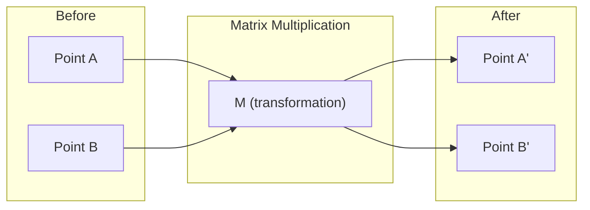
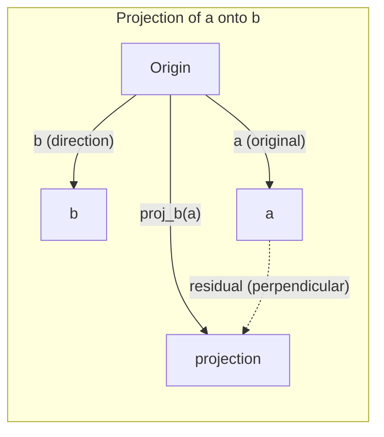

# 线性代数直觉

> 每一个人工智能模型都只是戴着花哨帽子的矩阵数学。

** 类型：** 学习
** 语言：** Python，Julia
** 先决条件：** 第0阶段
** 时间：** ~60分钟

## 学习目标

- 在Python中从头开始实现向量和矩阵运算（加法、点积、矩阵乘）
- 从几何角度解释点积、投影和Gram-Schmidt过程的作用
- 使用行约简确定一组载体的线性独立性、排序和基
- 将线性代数概念与其人工智能应用程序连接起来：嵌入、注意力分数和LoRA

## 问题

打开任何ML纸。在第一页中，您将看到载体、矩阵、点积和变换。如果没有线性代数直觉，这些只是符号。通过它，您可以看到神经网络实际上在做什么--在空间中移动点。

你不需要成为数学家。您需要了解这些操作的几何含义，然后自己编码它们。

## 概念

### 载体是点（和方向）

载体只是一系列数字。但这些数字有意义--它们是太空中的坐标。

**2D载体[3，2]：**

| X | y | 点 |
|---|---|-------|
| 3 | 2 | 平面上从原点（0，0）到（3，2）的垂直点 |

该分量的大小为平方毫米（3#2 + 2#2）=平方毫米（13），并指向上和右侧。

在人工智能中，载体代表一切：
- 一个词-768个数字的载体（其在嵌入空间中的“含义”）
- 图像-数百万像素值的载体
- 用户-偏好载体

### 矩阵是变形

矩阵将一个向量变换成另一个向量。它可以旋转、缩放、拉伸或投影。



在人工智能中，矩阵是模型：
- 神经网络权重-将输入转换为输出的矩阵
- 注意力分数-决定关注什么的矩阵
- 嵌入|将单词映射到载体的矩阵

### Dot产品衡量相似性

两个载体的点积告诉您它们有多相似。

```
a · b = a₁×b₁ + a₂×b₂ + ... + aₙ×bₙ

Same direction:      a · b > 0  (similar)
Perpendicular:       a · b = 0  (unrelated)
Opposite direction:  a · b < 0  (dissimilar)
```

这就是搜索引擎、推荐系统和RAG的工作方式--寻找具有高点产品的载体。

### 线性无关

如果集中没有一个可以写成其他的组合，那么该集合中的任何一个都是线性独立的。如果v1、v2、v3是独立的，则它们跨越3D空间。如果其中一个是其他的组合，则它们只跨越一个平面。

为什么这对人工智能很重要：您的特征矩阵应该具有线性独立的列。如果两个特征完全相关（线性相关），则模型无法区分它们的影响。这会导致回归中的多重共线性--权重矩阵变得不稳定，微小的输入变化会产生剧烈的输出波动。

** 具体例子：**

```
v1 = [1, 0, 0]
v2 = [0, 1, 0]
v3 = [2, 1, 0]   # v3 = 2*v1 + v2
```

v1和v2是独立的--两者都不是纯量倍数，也不是另一个的组合。但v3 = 2*v1 + v2，因此{v1，v2，v3}是相依集。这三个载体都位于xx平面中。无论你如何组合它们，你都无法达到[0，0，1]。你有三个载体，但只有两个维度的自由。

在数据集中：如果feature_3 = 2*feature_1 + feature_2，则添加feature_3将为模型提供零新信息。更糟糕的是，它使得正规方程奇异--权重没有唯一的解。

### 基础和等级

基是跨越整个空间的线性独立的最小载体集。基向量的数量是空间的维度。

3D空间的标准基础是{[1，0，0]，[0，1，0]，[0，0，1]}。但3D中的任何三个独立载体都构成了有效的基础。基准的选择就是坐标系的选择。

矩阵的等级=线性独立列的数量=线性独立行的数量。如果rank < min（行，），则矩阵为rank不足的。这意味着：
- 系统有无限多个解决方案（或没有）
- 信息在转型中丢失
- 矩阵不能倒置

| 情况 | 秩 | 这对ML意味着什么 |
|-----------|------|---------------------|
| 满等级（等级= min（m，n）） | 最大可能 | 存在唯一的最小平方解。模型条件良好。 |
| 等级不足（等级< min（m，n）） | 低于最大 | 功能是多余的。包含许多重量解决方案。需要正规化。 |
| 秩1 | 1 | 每列都是一个载体的缩放副本。所有数据都位于一条线上。 |
| 接近排名不足（较小的奇异值） | 数字上较低 | 黑客帝国条件不佳。微小的输入噪音会导致较大的输出变化。使用奇异值截断或岭回归。 |

### 投影

将载体 **a** 投影到载体 **b** 上，就会得到 **a** 在 **b** 方向上的分量：

```
proj_b(a) = (a dot b / b dot b) * b
```

剩余（a-proj_b（a））垂直于b。这种正交分解是最小平方匹配的基础。

投影在ML中无处不在：
- 线性回归最小化了观察到列空间的距离--解决方案是投影
- PCA将数据投影到最大方差方向
- 转换器中的注意力计算查询到键上的投影



** 示例：** a = [3，4]，b = [1，0]

proj_b（a）=（3*1 + 4*0）/（1*1 + 0*0）* [1，0] = 3 * [1，0] = [3，0]

投影会降低y分量。这是最简单形式的降维--扔掉你不关心的方向。

### 格拉姆-施密特法

将任何一组独立载体转换为标准正交基。正交意味着每个方向的长度都是1，并且每个对都是垂直的。

算法：
1. 取第一个载体，将其标准化
2. 取第二个载体，减去其在第一个载体上的投影，规格化
3. 取第三个载体，减去其在所有之前载体上的投影，进行标准化
4. 对其余载体重复上述步骤

```
Input:  v1, v2, v3, ... (linearly independent)

u1 = v1 / |v1|

w2 = v2 - (v2 dot u1) * u1
u2 = w2 / |w2|

w3 = v3 - (v3 dot u1) * u1 - (v3 dot u2) * u2
u3 = w3 / |w3|

Output: u1, u2, u3, ... (orthonormal basis)
```

这就是QR分解内部的工作原理。Q是正交基，R捕获投影系数。QR分解用于：
- 求解线性系统（比高斯消除更稳定）
- 计算特征值（QR算法）
- 最小平方回归（标准数值方法）

## 建设党

### 第1步：从头开始的载体（Python）

```python
class Vector:
    def __init__(self, components):
        self.components = list(components)
        self.dim = len(self.components)

    def __add__(self, other):
        return Vector([a + b for a, b in zip(self.components, other.components)])

    def __sub__(self, other):
        return Vector([a - b for a, b in zip(self.components, other.components)])

    def dot(self, other):
        return sum(a * b for a, b in zip(self.components, other.components))

    def magnitude(self):
        return sum(x**2 for x in self.components) ** 0.5

    def normalize(self):
        mag = self.magnitude()
        return Vector([x / mag for x in self.components])

    def cosine_similarity(self, other):
        return self.dot(other) / (self.magnitude() * other.magnitude())

    def __repr__(self):
        return f"Vector({self.components})"


a = Vector([1, 2, 3])
b = Vector([4, 5, 6])

print(f"a + b = {a + b}")
print(f"a · b = {a.dot(b)}")
print(f"|a| = {a.magnitude():.4f}")
print(f"cosine similarity = {a.cosine_similarity(b):.4f}")
```

### 第2步：从头开始矩阵（Python）

```python
class Matrix:
    def __init__(self, rows):
        self.rows = [list(row) for row in rows]
        self.shape = (len(self.rows), len(self.rows[0]))

    def __matmul__(self, other):
        if isinstance(other, Vector):
            return Vector([
                sum(self.rows[i][j] * other.components[j] for j in range(self.shape[1]))
                for i in range(self.shape[0])
            ])
        rows = []
        for i in range(self.shape[0]):
            row = []
            for j in range(other.shape[1]):
                row.append(sum(
                    self.rows[i][k] * other.rows[k][j]
                    for k in range(self.shape[1])
                ))
            rows.append(row)
        return Matrix(rows)

    def transpose(self):
        return Matrix([
            [self.rows[j][i] for j in range(self.shape[0])]
            for i in range(self.shape[1])
        ])

    def __repr__(self):
        return f"Matrix({self.rows})"


rotation_90 = Matrix([[0, -1], [1, 0]])
point = Vector([3, 1])

rotated = rotation_90 @ point
print(f"Original: {point}")
print(f"Rotated 90°: {rotated}")
```

### 第3步：为什么这对人工智能很重要

```python
import random

random.seed(42)
weights = Matrix([[random.gauss(0, 0.1) for _ in range(3)] for _ in range(2)])
input_vector = Vector([1.0, 0.5, -0.3])

output = weights @ input_vector
print(f"Input (3D): {input_vector}")
print(f"Output (2D): {output}")
print("This is what a neural network layer does -- matrix multiplication.")
```

### 第4步：朱莉娅版本

```julia
a = [1.0, 2.0, 3.0]
b = [4.0, 5.0, 6.0]

println("a + b = ", a + b)
println("a · b = ", a ⋅ b)       # Julia supports unicode operators
println("|a| = ", √(a ⋅ a))
println("cosine = ", (a ⋅ b) / (√(a ⋅ a) * √(b ⋅ b)))

# Matrix-vector multiplication
W = [0.1 -0.2 0.3; 0.4 0.5 -0.1]
x = [1.0, 0.5, -0.3]
println("Wx = ", W * x)
println("This is a neural network layer.")
```

### 第5步：线性独立性和从头开始投影（Python）

```python
def is_linearly_independent(vectors):
    n = len(vectors)
    dim = len(vectors[0].components)
    mat = Matrix([v.components[:] for v in vectors])
    rows = [row[:] for row in mat.rows]
    rank = 0
    for col in range(dim):
        pivot = None
        for row in range(rank, len(rows)):
            if abs(rows[row][col]) > 1e-10:
                pivot = row
                break
        if pivot is None:
            continue
        rows[rank], rows[pivot] = rows[pivot], rows[rank]
        scale = rows[rank][col]
        rows[rank] = [x / scale for x in rows[rank]]
        for row in range(len(rows)):
            if row != rank and abs(rows[row][col]) > 1e-10:
                factor = rows[row][col]
                rows[row] = [rows[row][j] - factor * rows[rank][j] for j in range(dim)]
        rank += 1
    return rank == n


def project(a, b):
    scalar = a.dot(b) / b.dot(b)
    return Vector([scalar * x for x in b.components])


def gram_schmidt(vectors):
    orthonormal = []
    for v in vectors:
        w = v
        for u in orthonormal:
            proj = project(w, u)
            w = w - proj
        if w.magnitude() < 1e-10:
            continue
        orthonormal.append(w.normalize())
    return orthonormal


v1 = Vector([1, 0, 0])
v2 = Vector([1, 1, 0])
v3 = Vector([1, 1, 1])
basis = gram_schmidt([v1, v2, v3])
for i, u in enumerate(basis):
    print(f"u{i+1} = {u}")
    print(f"  |u{i+1}| = {u.magnitude():.6f}")

print(f"u1 · u2 = {basis[0].dot(basis[1]):.6f}")
print(f"u1 · u3 = {basis[0].dot(basis[2]):.6f}")
print(f"u2 · u3 = {basis[1].dot(basis[2]):.6f}")
```

## 使用它

现在NumPy也是同样的事情--您在实践中实际使用的内容：

```python
import numpy as np

a = np.array([1, 2, 3], dtype=float)
b = np.array([4, 5, 6], dtype=float)

print(f"a + b = {a + b}")
print(f"a · b = {np.dot(a, b)}")
print(f"|a| = {np.linalg.norm(a):.4f}")
print(f"cosine = {np.dot(a, b) / (np.linalg.norm(a) * np.linalg.norm(b)):.4f}")

W = np.random.randn(2, 3) * 0.1
x = np.array([1.0, 0.5, -0.3])
print(f"Wx = {W @ x}")
```

### 使用NumPy进行排名、投影和QR

```python
import numpy as np

A = np.array([[1, 2], [2, 4]])
print(f"Rank: {np.linalg.matrix_rank(A)}")

a = np.array([3, 4])
b = np.array([1, 0])
proj = (np.dot(a, b) / np.dot(b, b)) * b
print(f"Projection of {a} onto {b}: {proj}")

Q, R = np.linalg.qr(np.random.randn(3, 3))
print(f"Q is orthogonal: {np.allclose(Q @ Q.T, np.eye(3))}")
print(f"R is upper triangular: {np.allclose(R, np.triu(R))}")
```

### PyTorch --张量是Autodiff的载体

```python
import torch

x = torch.randn(3, requires_grad=True)
y = torch.tensor([1.0, 0.0, 0.0])

similarity = torch.dot(x, y)
similarity.backward()

print(f"x = {x.data}")
print(f"y = {y.data}")
print(f"dot product = {similarity.item():.4f}")
print(f"d(dot)/dx = {x.grad}")
```

点积相对于x的梯度只是y。PyTorch会自动计算这一点。神经网络中的每个操作都是从这样的操作（矩阵相乘、点积、投影）构建的，并且autodiff跟踪所有这些操作的梯度。

您刚刚从头开始构建了NumPy在一行中所做的事情。现在你知道引擎盖下发生了什么了。

## 把它运

本课产生：
- '输出/prompt-linear-algebra-tutor.md '--提示人工智能助理通过几何直觉教授线性代数

## 连接

本课中的一切都与现代人工智能的特定部分有关：

| 概念 | 它出现在哪里 |
|---------|------------------|
| 点积 | 变形金刚中的注意力分数，RAG中的cos相似性 |
| 矩阵乘法 | 每个神经网络层，每个线性变换 |
| 线性无关 | 特征选择，避免多重共线性 |
| 秩 | 确定系统是否可解，LoRA（低级适应） |
| 投影 | 线性回归（投影到列空间），PCA |
| 格拉姆-施密特/ QR | 数值求解器、特征值计算 |
| 正交基 | 稳定的数值计算、白化变换 |

LoRA值得特别提及。它通过将权重更新分解为低秩矩阵来微调大型语言模型。LoRA没有更新4096x4096权重矩阵（16M参数），而是更新了两个大小为4096x16和16x4096的矩阵（131K参数）。秩16约束意味着LoRA假设权重更新存在于完整的4096维空间的16维子空间中。这是线性代数在做真正的工作。

## 演习

1. 实现“Vector.angle_between（other）'，返回两个载体之间的角度（以度为单位）
2. 创建一个将x坐标加倍并将y坐标加倍的2D缩放矩阵，然后将其应用于载体[1，1]
3. 给定5个随机的类词载体（维度50），使用cos相似度找到两个最相似的
4. 验证Gram-Schmidt输出是否真正是正交：检查每个对的点积为0，每个载体的幅度为1
5. 创建一个等级为2的3x 3矩阵。使用“rank（）”方法进行验证。然后解释柱跨越的几何对象。
6. 将载体[1，2，3]投影到[1，1，1]上。结果在几何上代表什么？

## 关键术语

| Term | 别人怎么说 | 它实际上意味着什么 |
|------|----------------|----------------------|
| 向量 | “一支箭” | 代表n维空间中的点或方向的数字列表 |
| 矩阵 | “数字表” | 将载体从一个空间映射到另一个空间的变换 |
| 点积 | “乘和” | 衡量两个载体对齐程度--相似性搜索的核心 |
| 嵌入 | “一些人工智能魔法” | 代表某个事物（单词、图像、用户）含义的载体 |
| 线性无关 | “它们不重叠” | 集合中的任何一个载体都不能写成其他载体的组合 |
| 秩 | “有多少个维度” | 矩阵中线性独立的列（或行）的数量 |
| 投影 | “影子” | 一个方向上的分量另一个方向 |
| 基础 | “坐标轴” | 跨越空间的最小独立载体集 |
| 正交 | “垂直单位载体” | 相互垂直且长度为1的载体 |
