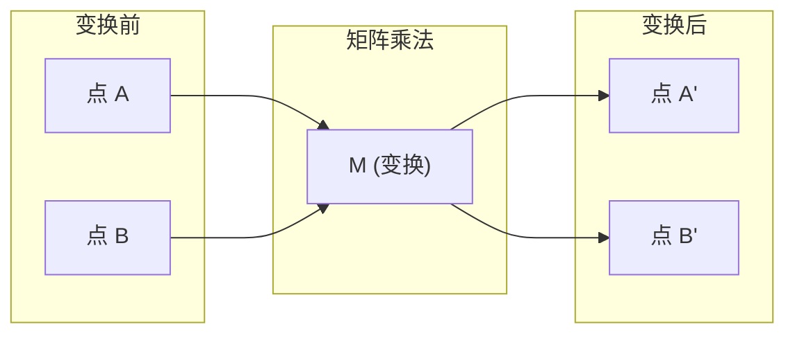
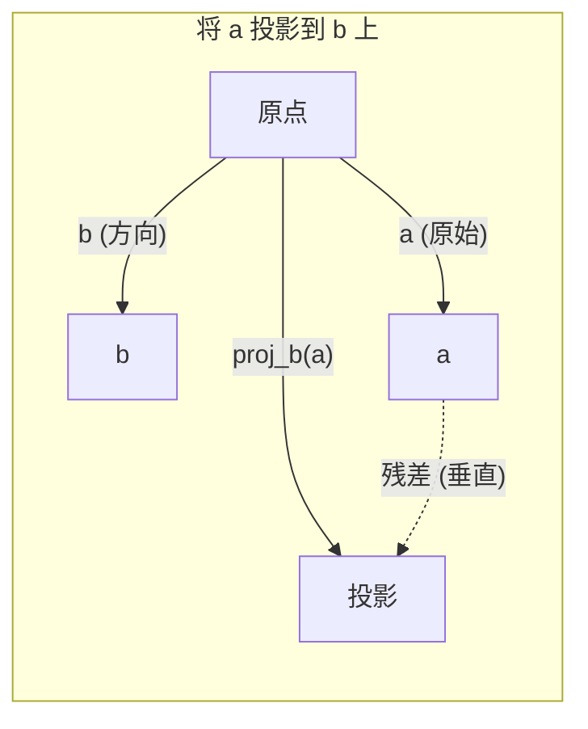

# 线性代数直观

> 每一个AI模型本质上都是戴着华丽帽子的矩阵运算。

**类型：** 学习
**语言：** Python, Julia
**前置条件：** 阶段0
**时间：** ~60分钟

## 学习目标

- 从零开始在Python中实现向量和矩阵运算（加法、点积、矩阵乘法）
- 从几何角度解释点积、投影和格拉姆-施密特（Gram-Schmidt）过程的作用
- 使用行化简确定一组向量的线性独立性、秩（Rank）和基（Basis）
- 将线性代数概念与AI应用联系起来：嵌入（Embedding）、注意力分数（Attention Scores）和LoRA

## 问题

翻开任何一篇机器学习论文，第一页你就能看到向量、矩阵、点积和变换。如果没有线性代数直观，这些只是符号。但有了它，你就能理解神经网络实际上在做什么——在空间中移动点。

你不需要成为数学家。你需要理解这些运算在几何上意味着什么，然后自己动手编码实现。

## 概念

### 向量就是点（也是方向）

向量就是一串数字。但这些数字有意义——它们是空间中的坐标。

**2D向量 [3, 2]：**

| x | y | 点 |
|---|---|-------|
| 3 | 2 | 该向量从原点 (0,0) 指向平面上的点 (3, 2) |

该向量的模为 sqrt(3^2 + 2^2) = sqrt(13)，指向右上方。

在AI中，向量代表一切：
- 一个词 → 一个包含768个数字的向量（其在嵌入空间中的"含义"）
- 一张图像 → 一个包含数百万个像素值的向量
- 一个用户 → 一个偏好向量

### 矩阵就是变换

矩阵将一个向量变换为另一个向量。它可以旋转、缩放、拉伸或投影。



在AI中，矩阵就是模型：
- 神经网络权重 → 将输入变换为输出的矩阵
- 注意力分数 → 决定关注什么的矩阵
- 嵌入 → 将词映射为向量的矩阵

### 点积衡量相似性

两个向量的点积告诉你它们有多相似。

```
a · b = a₁×b₁ + a₂×b₂ + ... + aₙ×bₙ

方向相同：      a · b > 0  （相似）
垂直：          a · b = 0  （无关）
方向相反：      a · b < 0  （不相似）
```

这正是搜索引擎、推荐系统和RAG的工作原理——寻找具有高点积的向量。

### 线性独立性

如果集合中没有一个向量可以写成其他向量的组合，则这些向量是线性独立的。如果 v1、v2、v3 是独立的，它们张成一个三维空间。如果其中一个是其他向量的组合，它们只张成一个平面。

为什么这对AI很重要：你的特征矩阵应该具有线性独立的列。如果两个特征完全相关（线性相关），模型无法区分它们的影响。这会导致回归中的多重共线性——权重矩阵变得不稳定，微小的输入变化会引起巨大的输出波动。

**具体示例：**

```
v1 = [1, 0, 0]
v2 = [0, 1, 0]
v3 = [2, 1, 0]   # v3 = 2*v1 + v2
```

v1 和 v2 是独立的——没有一个可以通过标量倍数或组合得到另一个。但是 v3 = 2*v1 + v2，所以 {v1, v2, v3} 是一个相关集。这三个向量都位于 xy 平面内。无论你如何组合它们，都无法到达 [0, 0, 1]。你有三个向量，却只有两个维度的自由度。

在数据集中：如果 feature_3 = 2*feature_1 + feature_2，添加 feature_3 不会给模型带来任何新信息。更糟糕的是，它会使正规方程变得奇异——权重没有唯一解。

### 基与秩

基是张成整个空间的最小线性独立向量集合。基向量的数量就是空间的维数。

三维空间的标准基是 {[1,0,0], [0,1,0], [0,0,1]}。但三维空间中的任何三个独立向量都构成一个有效基。基的选择就是坐标系的选择。

矩阵的秩 = 线性独立的列数 = 线性独立的行数。如果 秩 < min(行数, 列数)，则矩阵是秩亏的。这意味着：
- 系统有无限多个解（或无解）
- 变换中信息丢失
- 矩阵不可逆

| 情况 | 秩 | 对机器学习意味着什么 |
|-----------|------|---------------------|
| 满秩（秩 = min(m, n)） | 最大可能 | 存在唯一的最小二乘解。模型是良态的。 |
| 秩亏（秩 < min(m, n)） | 低于最大值 | 特征冗余。存在无限多个权重解。需要正则化。 |
| 秩为1 | 1 | 每一列都是某一向量的缩放副本。所有数据位于一条直线上。 |
| 近似秩亏（小奇异值） | 数值上低 | 矩阵是病态的。微小的输入噪声会导致巨大的输出变化。使用SVD截断或岭回归。 |

### 投影

将向量 **a** 投影到向量 **b** 上得到 **a** 在 **b** 方向上的分量：

```
proj_b(a) = (a dot b / b dot b) * b
```

残差 (a - proj_b(a)) 垂直于 b。这种正交分解是最小二乘拟合的基础。

投影在机器学习中无处不在：
- 线性回归最小化观测值到列空间的距离——解就是投影
- 主成分分析（PCA）将数据投影到最大方差的方向上
- Transformer中的注意力计算查询向量在键向量上的投影



**示例：** a = [3, 4], b = [1, 0]

proj_b(a) = (3*1 + 4*0) / (1*1 + 0*0) * [1, 0] = 3 * [1, 0] = [3, 0]

投影丢弃了 y 分量。这是最简单的降维——丢掉你不关心的方向。

### 格拉姆-施密特过程

将任意一组独立向量转化为正交规范基。正交规范意味着每个向量的长度为1，并且每对向量互相垂直。

算法：
1. 取第一个向量，归一化
2. 取第二个向量，减去它在第一个向量上的投影，归一化
3. 取第三个向量，减去它在之前所有向量上的投影，归一化
4. 对剩余向量重复

```
输入:  v1, v2, v3, ... （线性独立）

u1 = v1 / |v1|

w2 = v2 - (v2 dot u1) * u1
u2 = w2 / |w2|

w3 = v3 - (v3 dot u1) * u1 - (v3 dot u2) * u2
u3 = w3 / |w3|

输出: u1, u2, u3, ... （正交规范基）
```

这就是QR分解的内部工作原理。Q是正交规范基，R捕获投影系数。QR分解用于：
- 求解线性方程组（比高斯消元更稳定）
- 计算特征值（QR算法）
- 最小二乘回归（标准的数值方法）

## 动手构建

### 步骤1：从零实现向量（Python）

```python
class Vector:
    def __init__(self, components):
        self.components = list(components)
        self.dim = len(self.components)

    def __add__(self, other):
        return Vector([a + b for a, b in zip(self.components, other.components)])

    def __sub__(self, other):
        return Vector([a - b for a, b in zip(self.components, other.components)])

    def dot(self, other):
        return sum(a * b for a, b in zip(self.components, other.components))

    def magnitude(self):
        return sum(x**2 for x in self.components) ** 0.5

    def normalize(self):
        mag = self.magnitude()
        return Vector([x / mag for x in self.components])

    def cosine_similarity(self, other):
        return self.dot(other) / (self.magnitude() * other.magnitude())

    def __repr__(self):
        return f"Vector({self.components})"


a = Vector([1, 2, 3])
b = Vector([4, 5, 6])

print(f"a + b = {a + b}")
print(f"a · b = {a.dot(b)}")
print(f"|a| = {a.magnitude():.4f}")
print(f"余弦相似度 = {a.cosine_similarity(b):.4f}")
```

### 步骤2：从零实现矩阵（Python）

```python
class Matrix:
    def __init__(self, rows):
        self.rows = [list(row) for row in rows]
        self.shape = (len(self.rows), len(self.rows[0]))

    def __matmul__(self, other):
        if isinstance(other, Vector):
            return Vector([
                sum(self.rows[i][j] * other.components[j] for j in range(self.shape[1]))
                for i in range(self.shape[0])
            ])
        rows = []
        for i in range(self.shape[0]):
            row = []
            for j in range(other.shape[1]):
                row.append(sum(
                    self.rows[i][k] * other.rows[k][j]
                    for k in range(self.shape[1])
                ))
            rows.append(row)
        return Matrix(rows)

    def transpose(self):
        return Matrix([
            [self.rows[j][i] for j in range(self.shape[0])]
            for i in range(self.shape[1])
        ])

    def __repr__(self):
        return f"Matrix({self.rows})"


旋转_90 = Matrix([[0, -1], [1, 0]])
点 = Vector([3, 1])

旋转后 = 旋转_90 @ 点
print(f"原始: {点}")
print(f"旋转90°: {旋转后}")
```

### 步骤3：为什么这对AI重要

```python
import random

random.seed(42)
weights = Matrix([[random.gauss(0, 0.1) for _ in range(3)] for _ in range(2)])
input_vector = Vector([1.0, 0.5, -0.3])

output = weights @ input_vector
print(f"输入 (3D): {input_vector}")
print(f"输出 (2D): {output}")
print("这就是神经网络层的作用——矩阵乘法。")
```

### 步骤4：Julia版本

```julia
a = [1.0, 2.0, 3.0]
b = [4.0, 5.0, 6.0]

println("a + b = ", a + b)
println("a · b = ", a ⋅ b)       # Julia支持Unicode运算符
println("|a| = ", √(a ⋅ a))
println("余弦 = ", (a ⋅ b) / (√(a ⋅ a) * √(b ⋅ b)))

# 矩阵-向量乘法
W = [0.1 -0.2 0.3; 0.4 0.5 -0.1]
x = [1.0, 0.5, -0.3]
println("Wx = ", W * x)
println("这是一个神经网络层。")
```

### 步骤5：从零实现线性独立性和投影（Python）

```python
def is_linearly_independent(vectors):
    n = len(vectors)
    dim = len(vectors[0].components)
    mat = Matrix([v.components[:] for v in vectors])
    rows = [row[:] for row in mat.rows]
    rank = 0
    for col in range(dim):
        pivot = None
        for row in range(rank, len(rows)):
            if abs(rows[row][col]) > 1e-10:
                pivot = row
                break
        if pivot is None:
            continue
        rows[rank], rows[pivot] = rows[pivot], rows[rank]
        scale = rows[rank][col]
        rows[rank] = [x / scale for x in rows[rank]]
        for row in range(len(rows)):
            if row != rank and abs(rows[row][col]) > 1e-10:
                factor = rows[row][col]
                rows[row] = [rows[row][j] - factor * rows[rank][j] for j in range(dim)]
        rank += 1
    return rank == n


def project(a, b):
    scalar = a.dot(b) / b.dot(b)
    return Vector([scalar * x for x in b.components])


def gram_schmidt(vectors):
    orthonormal = []
    for v in vectors:
        w = v
        for u in orthonormal:
            proj = project(w, u)
            w = w - proj
        if w.magnitude() < 1e-10:
            continue
        orthonormal.append(w.normalize())
    return orthonormal


v1 = Vector([1, 0, 0])
v2 = Vector([1, 1, 0])
v3 = Vector([1, 1, 1])
basis = gram_schmidt([v1, v2, v3])
for i, u in enumerate(basis):
    print(f"u{i+1} = {u}")
    print(f"  |u{i+1}| = {u.magnitude():.6f}")

print(f"u1 · u2 = {basis[0].dot(basis[1]):.6f}")
print(f"u1 · u3 = {basis[0].dot(basis[2]):.6f}")
print(f"u2 · u3 = {basis[1].dot(basis[2]):.6f}")
```

## 使用它

现在用NumPy做同样的事——实际工作中你会用到的：

```python
import numpy as np

a = np.array([1, 2, 3], dtype=float)
b = np.array([4, 5, 6], dtype=float)

print(f"a + b = {a + b}")
print(f"a · b = {np.dot(a, b)}")
print(f"|a| = {np.linalg.norm(a):.4f}")
print(f"余弦 = {np.dot(a, b) / (np.linalg.norm(a) * np.linalg.norm(b)):.4f}")

W = np.random.randn(2, 3) * 0.1
x = np.array([1.0, 0.5, -0.3])
print(f"Wx = {W @ x}")
```

### 用NumPy计算秩、投影和QR

```python
import numpy as np

A = np.array([[1, 2], [2, 4]])
print(f"秩: {np.linalg.matrix_rank(A)}")

a = np.array([3, 4])
b = np.array([1, 0])
proj = (np.dot(a, b) / np.dot(b, b)) * b
print(f"{a} 在 {b} 上的投影: {proj}")

Q, R = np.linalg.qr(np.random.randn(3, 3))
print(f"Q是正交矩阵: {np.allclose(Q @ Q.T, np.eye(3))}")
print(f"R是上三角矩阵: {np.allclose(R, np.triu(R))}")
```

### PyTorch——张量是具有自动求导能力的向量

```python
import torch

x = torch.randn(3, requires_grad=True)
y = torch.tensor([1.0, 0.0, 0.0])

similarity = torch.dot(x, y)
similarity.backward()

print(f"x = {x.data}")
print(f"y = {y.data}")
print(f"点积 = {similarity.item():.4f}")
print(f"d(点积)/dx = {x.grad}")
```

点积对x的梯度就是y。PyTorch自动计算了这个值。神经网络中的每个## 计算都是由这样的运算构建的——矩阵乘法; dot