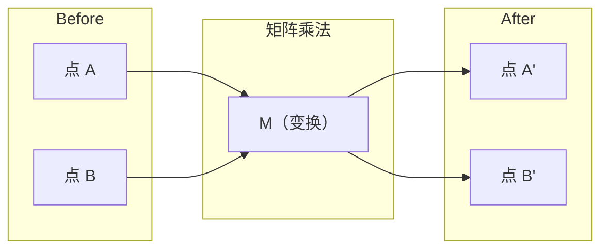
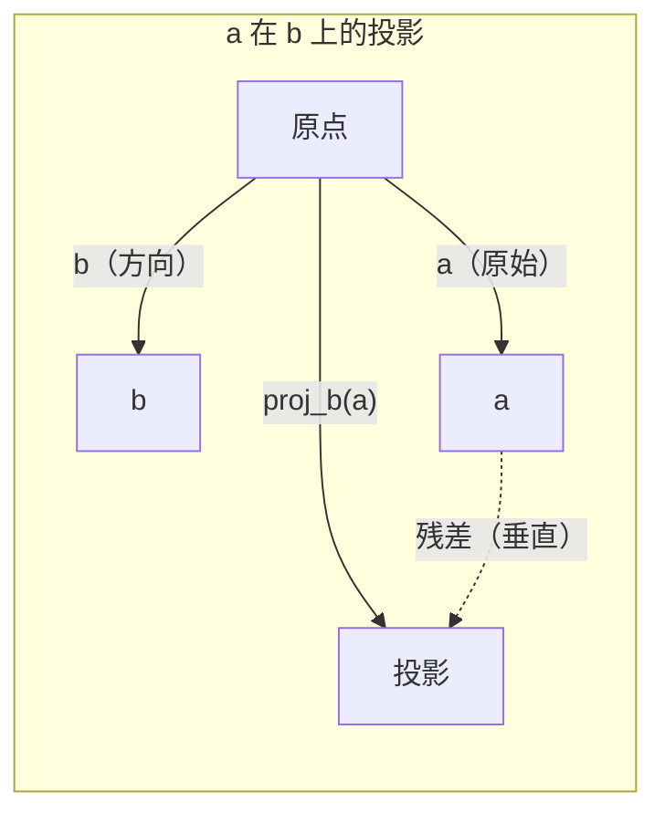

# 线性代数直觉（Linear Algebra Intuition）

> 译注：本文译自同目录 [`en.md`](./en.md)。术语遵循仓根 [TRANSLATION_GUIDE.md](../../../../TRANSLATION_GUIDE.md)。

> 每个 AI 模型都不过是戴着花哨帽子的矩阵运算。

**Type:** Learn
**Languages:** Python, Julia
**Prerequisites:** Phase 0
**Time:** ~60 minutes

## 学习目标（Learning Objectives）

- 用 Python 从零实现向量和矩阵运算（加法、点积、矩阵乘法）
- 从几何角度解释点积、投影和 Gram-Schmidt 过程在做什么
- 用行变换判断一组向量的线性无关性、秩（rank）和基（basis）
- 把线性代数概念和它们在 AI 里的应用对应起来：embedding、attention 分数、LoRA

## 问题（The Problem）

随便翻开一篇 ML 论文，第一页内你就会看到向量、矩阵、点积、变换。如果没有线性代数直觉，这些只是符号；有了直觉，你就能看见神经网络真正在做什么——在空间里挪动点。

你不需要成为数学家。你需要看清这些运算的几何含义，然后亲手写出来。

## 概念（The Concept）

### 向量是点（也是方向）（Vectors Are Points (and Directions)）

向量就是一串数字。但这些数字是有意义的——它们是空间中的坐标。

**二维向量 [3, 2]：**

| x | y | 点 |
|---|---|-------|
| 3 | 2 | 该向量从原点 (0,0) 指向平面上的 (3, 2) |

这个向量的模为 sqrt(3^2 + 2^2) = sqrt(13)，方向朝右上。

在 AI 里，向量代表一切：
- 一个词 → 一个 768 维的向量（它在 embedding（嵌入）空间中的「含义」）
- 一张图 → 由数百万像素值组成的向量
- 一个用户 → 由偏好组成的向量

### 矩阵是变换（Matrices Are Transformations）

矩阵把一个向量变换成另一个向量。它可以旋转、缩放、拉伸或投影。



在 AI 里，矩阵*就是*模型本身：
- 神经网络的权重 → 把输入变换成输出的矩阵
- attention 分数 → 决定要关注什么的矩阵
- embedding → 把词映射为向量的矩阵

### 点积衡量相似度（The Dot Product Measures Similarity）

两个向量的点积告诉你它们有多相似。

```
a · b = a₁×b₁ + a₂×b₂ + ... + aₙ×bₙ

Same direction:      a · b > 0  (similar)
Perpendicular:       a · b = 0  (unrelated)
Opposite direction:  a · b < 0  (dissimilar)
```

搜索引擎、推荐系统和 RAG 字面上就是这么工作的——找到点积高的那些向量。

### 线性无关（Linear Independence）

如果一组向量中没有任何一个可以被写成其他向量的组合，它们就是线性无关的。如果 v1、v2、v3 线性无关，它们张成一个三维空间；如果其中一个是其余的组合，那它们只张成一个平面。

为什么这对 AI 重要：你的特征矩阵的列应当线性无关。如果两个特征完全相关（线性相关），模型就无法区分它们各自的影响。这会在回归里造成多重共线性——权重矩阵变得不稳定，输入的微小变化会带来输出的剧烈摆动。

**具体例子：**

```
v1 = [1, 0, 0]
v2 = [0, 1, 0]
v3 = [2, 1, 0]   # v3 = 2*v1 + v2
```

v1 和 v2 线性无关——彼此既不是标量倍数也不是组合。但 v3 = 2*v1 + v2，所以 {v1, v2, v3} 是相关组。这三个向量都躺在 xy 平面上。无论你怎么组合它们，都到不了 [0, 0, 1]。你有三个向量，但只有两个自由维度。

放到数据集里：如果 feature_3 = 2*feature_1 + feature_2，加入 feature_3 给模型带来的新信息为零。更糟的是，它会让正规方程奇异——权重不再有唯一解。

### 基与秩（Basis and Rank）

基（basis）是一组最小的、能张成整个空间的线性无关向量。基向量的个数就是空间的维数。

三维空间的标准基是 {[1,0,0], [0,1,0], [0,0,1]}。但任意三个三维线性无关向量都能构成一组合法的基。选择一组基，就是选择一种坐标系。

矩阵的秩（rank）= 线性无关列的个数 = 线性无关行的个数。如果 rank < min(rows, cols)，矩阵是亏秩的。这意味着：
- 方程组要么有无穷多解，要么无解
- 变换中丢失了信息
- 矩阵不可逆

| 情况 | 秩 | 对 ML 意味着什么 |
|-----------|------|---------------------|
| 满秩（rank = min(m, n)） | 最大可能 | 最小二乘解唯一存在。模型条件良好。 |
| 亏秩（rank < min(m, n)） | 低于最大值 | 特征冗余。权重有无穷多解。需要正则化。 |
| 秩为 1 | 1 | 每一列都是某个向量的标量倍。所有数据落在一条直线上。 |
| 接近亏秩（奇异值很小） | 数值上偏低 | 矩阵病态（ill-conditioned）。微小的输入噪声导致大的输出变化。可用 SVD 截断或岭回归。 |

### 投影（Projection）

把向量 **a** 投影到向量 **b** 上，得到 **a** 在 **b** 方向上的分量：

```
proj_b(a) = (a dot b / b dot b) * b
```

残差 (a - proj_b(a)) 与 b 垂直。这种正交分解是最小二乘拟合的根基。

投影在 ML 里随处可见：
- 线性回归最小化的是观测值到列空间的距离——它的解*就是*一次投影
- PCA 把数据投影到方差最大的方向上
- transformer 中的 attention 计算 query 在 key 上的投影



**例子：** a = [3, 4]，b = [1, 0]

proj_b(a) = (3*1 + 4*0) / (1*1 + 0*0) * [1, 0] = 3 * [1, 0] = [3, 0]

投影把 y 分量丢掉了。这就是最简形式的降维——把你不在乎的方向直接扔掉。

### Gram-Schmidt 过程（Gram-Schmidt Process）

把任意一组线性无关向量转化为一组标准正交基（orthonormal basis）。标准正交意味着每个向量长度为 1，每对向量互相垂直。

算法步骤：
1. 取第一个向量，归一化
2. 取第二个向量，减去它在第一个向量上的投影，再归一化
3. 取第三个向量，减去它在所有前面向量上的投影，再归一化
4. 对剩下的向量重复

```
Input:  v1, v2, v3, ... (linearly independent)

u1 = v1 / |v1|

w2 = v2 - (v2 dot u1) * u1
u2 = w2 / |w2|

w3 = v3 - (v3 dot u1) * u1 - (v3 dot u2) * u2
u3 = w3 / |w3|

Output: u1, u2, u3, ... (orthonormal basis)
```

QR 分解内部就是这么干的：Q 是标准正交基，R 记录了投影系数。QR 分解被用于：
- 解线性方程组（比高斯消元更稳定）
- 计算特征值（QR 算法）
- 最小二乘回归（标准的数值方法）

## 动手实现（Build It）

### Step 1: Vectors from scratch (Python)

```python
class Vector:
    def __init__(self, components):
        self.components = list(components)
        self.dim = len(self.components)

    def __add__(self, other):
        return Vector([a + b for a, b in zip(self.components, other.components)])

    def __sub__(self, other):
        return Vector([a - b for a, b in zip(self.components, other.components)])

    def dot(self, other):
        return sum(a * b for a, b in zip(self.components, other.components))

    def magnitude(self):
        return sum(x**2 for x in self.components) ** 0.5

    def normalize(self):
        mag = self.magnitude()
        return Vector([x / mag for x in self.components])

    def cosine_similarity(self, other):
        return self.dot(other) / (self.magnitude() * other.magnitude())

    def __repr__(self):
        return f"Vector({self.components})"


a = Vector([1, 2, 3])
b = Vector([4, 5, 6])

print(f"a + b = {a + b}")
print(f"a · b = {a.dot(b)}")
print(f"|a| = {a.magnitude():.4f}")
print(f"cosine similarity = {a.cosine_similarity(b):.4f}")
```

### Step 2: Matrices from scratch (Python)

```python
class Matrix:
    def __init__(self, rows):
        self.rows = [list(row) for row in rows]
        self.shape = (len(self.rows), len(self.rows[0]))

    def __matmul__(self, other):
        if isinstance(other, Vector):
            return Vector([
                sum(self.rows[i][j] * other.components[j] for j in range(self.shape[1]))
                for i in range(self.shape[0])
            ])
        rows = []
        for i in range(self.shape[0]):
            row = []
            for j in range(other.shape[1]):
                row.append(sum(
                    self.rows[i][k] * other.rows[k][j]
                    for k in range(self.shape[1])
                ))
            rows.append(row)
        return Matrix(rows)

    def transpose(self):
        return Matrix([
            [self.rows[j][i] for j in range(self.shape[0])]
            for i in range(self.shape[1])
        ])

    def __repr__(self):
        return f"Matrix({self.rows})"


rotation_90 = Matrix([[0, -1], [1, 0]])
point = Vector([3, 1])

rotated = rotation_90 @ point
print(f"Original: {point}")
print(f"Rotated 90°: {rotated}")
```

### Step 3: Why this matters for AI

```python
import random

random.seed(42)
weights = Matrix([[random.gauss(0, 0.1) for _ in range(3)] for _ in range(2)])
input_vector = Vector([1.0, 0.5, -0.3])

output = weights @ input_vector
print(f"Input (3D): {input_vector}")
print(f"Output (2D): {output}")
print("This is what a neural network layer does -- matrix multiplication.")
```

### Step 4: Julia version

```julia
a = [1.0, 2.0, 3.0]
b = [4.0, 5.0, 6.0]

println("a + b = ", a + b)
println("a · b = ", a ⋅ b)       # Julia supports unicode operators
println("|a| = ", √(a ⋅ a))
println("cosine = ", (a ⋅ b) / (√(a ⋅ a) * √(b ⋅ b)))

# Matrix-vector multiplication
W = [0.1 -0.2 0.3; 0.4 0.5 -0.1]
x = [1.0, 0.5, -0.3]
println("Wx = ", W * x)
println("This is a neural network layer.")
```

### Step 5: Linear independence and projection from scratch (Python)

```python
def is_linearly_independent(vectors):
    n = len(vectors)
    dim = len(vectors[0].components)
    mat = Matrix([v.components[:] for v in vectors])
    rows = [row[:] for row in mat.rows]
    rank = 0
    for col in range(dim):
        pivot = None
        for row in range(rank, len(rows)):
            if abs(rows[row][col]) > 1e-10:
                pivot = row
                break
        if pivot is None:
            continue
        rows[rank], rows[pivot] = rows[pivot], rows[rank]
        scale = rows[rank][col]
        rows[rank] = [x / scale for x in rows[rank]]
        for row in range(len(rows)):
            if row != rank and abs(rows[row][col]) > 1e-10:
                factor = rows[row][col]
                rows[row] = [rows[row][j] - factor * rows[rank][j] for j in range(dim)]
        rank += 1
    return rank == n


def project(a, b):
    scalar = a.dot(b) / b.dot(b)
    return Vector([scalar * x for x in b.components])


def gram_schmidt(vectors):
    orthonormal = []
    for v in vectors:
        w = v
        for u in orthonormal:
            proj = project(w, u)
            w = w - proj
        if w.magnitude() < 1e-10:
            continue
        orthonormal.append(w.normalize())
    return orthonormal


v1 = Vector([1, 0, 0])
v2 = Vector([1, 1, 0])
v3 = Vector([1, 1, 1])
basis = gram_schmidt([v1, v2, v3])
for i, u in enumerate(basis):
    print(f"u{i+1} = {u}")
    print(f"  |u{i+1}| = {u.magnitude():.6f}")

print(f"u1 · u2 = {basis[0].dot(basis[1]):.6f}")
print(f"u1 · u3 = {basis[0].dot(basis[2]):.6f}")
print(f"u2 · u3 = {basis[1].dot(basis[2]):.6f}")
```

## 用起来（Use It）

现在用 NumPy 做同样的事——这才是你日后真正会用的：

```python
import numpy as np

a = np.array([1, 2, 3], dtype=float)
b = np.array([4, 5, 6], dtype=float)

print(f"a + b = {a + b}")
print(f"a · b = {np.dot(a, b)}")
print(f"|a| = {np.linalg.norm(a):.4f}")
print(f"cosine = {np.dot(a, b) / (np.linalg.norm(a) * np.linalg.norm(b)):.4f}")

W = np.random.randn(2, 3) * 0.1
x = np.array([1.0, 0.5, -0.3])
print(f"Wx = {W @ x}")
```

### 用 NumPy 做秩、投影和 QR（Rank, Projection, and QR with NumPy）

```python
import numpy as np

A = np.array([[1, 2], [2, 4]])
print(f"Rank: {np.linalg.matrix_rank(A)}")

a = np.array([3, 4])
b = np.array([1, 0])
proj = (np.dot(a, b) / np.dot(b, b)) * b
print(f"Projection of {a} onto {b}: {proj}")

Q, R = np.linalg.qr(np.random.randn(3, 3))
print(f"Q is orthogonal: {np.allclose(Q @ Q.T, np.eye(3))}")
print(f"R is upper triangular: {np.allclose(R, np.triu(R))}")
```

### PyTorch —— 张量就是带自动微分的向量（PyTorch -- Tensors Are Vectors with Autodiff）

```python
import torch

x = torch.randn(3, requires_grad=True)
y = torch.tensor([1.0, 0.0, 0.0])

similarity = torch.dot(x, y)
similarity.backward()

print(f"x = {x.data}")
print(f"y = {y.data}")
print(f"dot product = {similarity.item():.4f}")
print(f"d(dot)/dx = {x.grad}")
```

点积关于 x 的 gradient（梯度）就是 y。PyTorch 自动算出了它。神经网络中的每个运算都是由这种操作搭出来的——矩阵乘、点积、投影——而 autodiff 会跟踪所有这些操作的梯度。

你刚刚从零搭出了 NumPy 一行就能做的事。现在你知道引擎盖底下发生了什么。

## 上线部署（Ship It）

本节产出：
- `outputs/prompt-linear-algebra-tutor.md` —— 一份让 AI 助手通过几何直觉来教线性代数的 prompt

## 关联（Connections）

本课的每个内容都对应到现代 AI 的具体某一处：

| 概念 | 出现的地方 |
|---------|------------------|
| 点积 | transformer 中的 attention 分数；RAG 中的 cosine similarity（余弦相似度） |
| 矩阵乘法 | 每一层神经网络、每一次线性变换 |
| 线性无关 | 特征选择、避免多重共线性 |
| 秩（rank） | 判断方程组是否可解；LoRA（低秩自适应） |
| 投影 | 线性回归（投到列空间）、PCA |
| Gram-Schmidt / QR | 数值求解器、特征值计算 |
| 标准正交基 | 数值上稳定的计算、白化变换 |

LoRA 值得专门提一下。它通过把权重更新分解为低秩矩阵来微调大语言模型。LoRA 不更新一个 4096x4096 的权重矩阵（16M 参数），而是更新两个尺寸为 4096x16 和 16x4096 的矩阵（131K 参数）。秩为 16 的约束意味着 LoRA 假设权重更新只活在完整 4096 维空间中的一个 16 维子空间里。这就是线性代数在做实事。

## 练习（Exercises）

1. 实现 `Vector.angle_between(other)`，返回两个向量之间的夹角（角度制）
2. 构造一个把 x 坐标翻倍、y 坐标变三倍的二维缩放矩阵，把它作用在向量 [1, 1] 上
3. 给定 5 个 50 维的随机「类词」向量，用 cosine similarity 找出最相似的两个
4. 验证 Gram-Schmidt 的输出真的是标准正交的：检查每对向量点积为 0、每个向量模为 1
5. 构造一个秩为 2 的 3x3 矩阵。用 `rank()` 方法验证。然后解释这些列向量从几何上张成了什么对象。
6. 把向量 [1, 2, 3] 投影到 [1, 1, 1] 上。结果在几何上代表什么？

## 关键术语（Key Terms）

| 术语 | 大家通常怎么说 | 它实际是什么 |
|------|----------------|----------------------|
| 向量（Vector） | 「一支箭」 | 一串数字，表示 n 维空间中的一个点或方向 |
| 矩阵（Matrix） | 「一张数字表」 | 把向量从一个空间映射到另一个空间的变换 |
| 点积（Dot product） | 「逐项相乘再求和」 | 衡量两个向量有多对齐——相似度搜索的核心 |
| Embedding | 「某种 AI 魔法」 | 用来表示某个事物（词、图像、用户）含义的向量 |
| 线性无关（Linear independence） | 「它们不重叠」 | 集合中没有任何一个向量可以被写成其他向量的组合 |
| 秩（Rank） | 「有几个维度」 | 矩阵中线性无关的列（或行）的个数 |
| 投影（Projection） | 「影子」 | 一个向量在另一个向量方向上的分量 |
| 基（Basis） | 「坐标轴」 | 一组最小的、能张成整个空间的线性无关向量 |
| 标准正交（Orthonormal） | 「相互垂直的单位向量」 | 一组两两垂直、且每个长度都为 1 的向量 |
