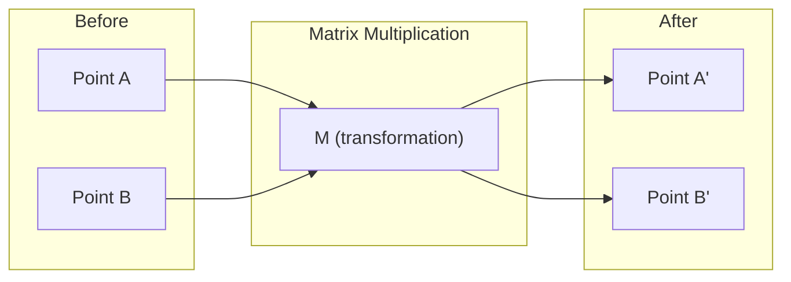
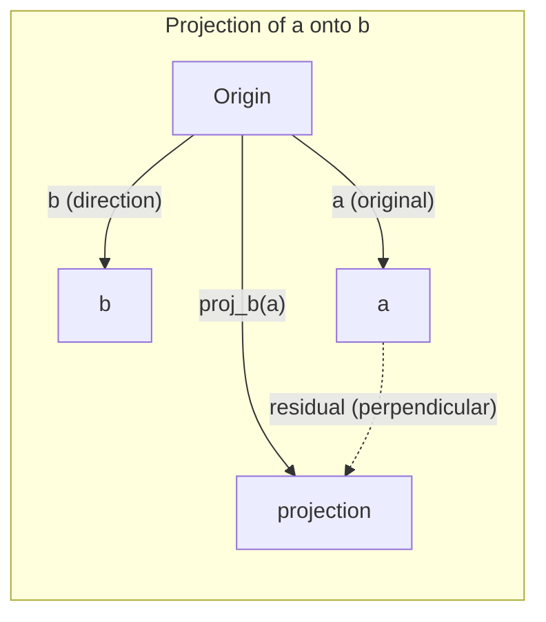

# 01 · 线性代数直觉

> 每一个 AI 模型，本质上都是戴着花哨帽子的矩阵运算。

**类型：** 学习
**语言：** Python、Julia
**前置：** 阶段 0
**时长：** 约 60 分钟

## 学习目标

- 用 Python 从零实现向量与矩阵运算（加法、点积、矩阵乘法）
- 从几何角度解释点积、投影以及 Gram-Schmidt 过程的作用
- 使用行化简法判定一组向量的线性无关性、秩与基
- 把线性代数概念与其 AI 应用联系起来：嵌入（embeddings）、注意力分数（attention scores）以及 LoRA

## 问题所在

随便翻开一篇机器学习论文。在第一页之内，你就会看到向量、矩阵、点积以及各种变换。没有线性代数直觉，这些不过是一堆符号。有了它，你就能看清神经网络到底在做什么——在空间中移动点。

你不需要成为数学家。你需要的是看清这些运算在几何上意味着什么，然后亲手把它们写成代码。

## 核心概念

### 向量是点（也是方向）

向量就是一串数字。但这些数字是有含义的——它们是空间中的坐标。

**二维向量 [3, 2]：**

| x | y | 点 |
|---|---|-------|
| 3 | 2 | 该向量从原点 (0,0) 指向平面上的 (3, 2) |

这个向量的模（magnitude）为 sqrt(3^2 + 2^2) = sqrt(13)，方向指向右上方。

在 AI 中，向量可以表示一切：
- 一个词 → 一个由 768 个数字组成的向量（它在嵌入空间中的「含义」）
- 一张图像 → 一个由数百万个像素值组成的向量
- 一名用户 → 一个由偏好组成的向量

### 矩阵是变换

矩阵把一个向量变换为另一个向量。它可以旋转、缩放、拉伸或投影。



在 AI 中，矩阵本身就是模型：
- 神经网络权重 → 把输入变换为输出的矩阵
- 注意力分数 → 决定关注什么的矩阵
- 嵌入 → 把词映射为向量的矩阵

### 点积衡量相似度

两个向量的点积告诉你它们有多相似。

```
a · b = a₁×b₁ + a₂×b₂ + ... + aₙ×bₙ

同向：       a · b > 0  (相似)
垂直：       a · b = 0  (不相关)
反向：       a · b < 0  (相异)
```

搜索引擎、推荐系统以及 RAG 的工作原理就是如此——寻找点积值高的向量。

### 线性无关

如果一组向量中没有任何一个能写成其余向量的组合，那么这组向量就是「线性无关（linearly independent）」的。如果 v1、v2、v3 相互无关，它们就张成一个三维空间。如果其中一个是其余向量的组合，它们就只能张成一个平面。

它对 AI 为何重要：你的特征矩阵的各列应当线性无关。如果两个特征完全相关（线性相关），模型就无法区分它们各自的作用。这会在回归中引发「多重共线性（multicollinearity）」——权重矩阵变得不稳定，输入的微小变动会导致输出剧烈波动。

**具体示例：**

```
v1 = [1, 0, 0]
v2 = [0, 1, 0]
v3 = [2, 1, 0]   # v3 = 2*v1 + v2
```

v1 与 v2 是无关的——彼此既不是对方的标量倍数，也不是对方的组合。但 v3 = 2*v1 + v2，所以 {v1, v2, v3} 是一个线性相关的集合。这三个向量全都落在 xy 平面上。无论你怎样组合它们，都无法到达 [0, 0, 1]。你手里有三个向量，但只有两个自由度。

放到数据集里：如果 feature_3 = 2*feature_1 + feature_2，那么加入 feature_3 不会给模型带来任何新信息。更糟的是，它会让正规方程（normal equations）变得奇异——权重不存在唯一解。

### 基与秩

「基（basis）」是一组数量最少、线性无关且能张成整个空间的向量。基向量的个数就是该空间的维数。

三维空间的标准基是 {[1,0,0], [0,1,0], [0,0,1]}。但三维空间中任意三个无关向量都能构成一组有效的基。选择一组基，就是选择一套坐标系。

矩阵的「秩（rank）」= 线性无关的列数 = 线性无关的行数。如果秩 < min(行数, 列数)，该矩阵就是「秩亏（rank-deficient）」的。这意味着：
- 方程组有无穷多解（或无解）
- 变换过程中丢失了信息
- 矩阵不可求逆

| 情况 | 秩 | 对机器学习意味着什么 |
|-----------|------|---------------------|
| 满秩（rank = min(m, n)） | 可能的最大值 | 存在唯一的最小二乘解。模型条件良好。 |
| 秩亏（rank < min(m, n)） | 低于最大值 | 特征存在冗余。权重有无穷多组解。需要正则化。 |
| 秩为 1 | 1 | 每一列都是同一个向量的缩放副本。所有数据落在一条直线上。 |
| 接近秩亏（奇异值很小） | 数值上偏低 | 矩阵病态。输入的微小噪声会导致输出大幅变化。应使用 SVD 截断或岭回归（ridge regression）。 |

### 投影

把向量 **a** 投影（projection）到向量 **b** 上，得到的是 **a** 在 **b** 方向上的分量：

```
proj_b(a) = (a dot b / b dot b) * b
```

残差 (a - proj_b(a)) 与 b 垂直。这种正交分解是最小二乘拟合的基础。

投影在机器学习中无处不在：
- 线性回归最小化观测值到列空间（column space）的距离——其解本身就是一次投影
- PCA 把数据投影到方差最大的方向上
- Transformer 中的注意力机制计算查询（query）在键（key）上的投影



**示例：** a = [3, 4]，b = [1, 0]

proj_b(a) = (3*1 + 4*0) / (1*1 + 0*0) * [1, 0] = 3 * [1, 0] = [3, 0]

这个投影丢弃了 y 分量。这正是最简单形式的降维——把你不关心的方向扔掉。

### Gram-Schmidt 过程

把任意一组无关向量转换为一组标准正交基（orthonormal basis）。「标准正交（orthonormal）」意味着每个向量的长度都为 1，且任意两个向量都相互垂直。

算法：
1. 取第一个向量，将其归一化
2. 取第二个向量，减去它在第一个向量上的投影，再归一化
3. 取第三个向量，减去它在此前所有向量上的投影，再归一化
4. 对剩余向量重复以上步骤

```
Input:  v1, v2, v3, ... (linearly independent)

u1 = v1 / |v1|

w2 = v2 - (v2 dot u1) * u1
u2 = w2 / |w2|

w3 = v3 - (v3 dot u1) * u1 - (v3 dot u2) * u2
u3 = w3 / |w3|

Output: u1, u2, u3, ... (orthonormal basis)
```

QR 分解的内部原理正是如此。Q 是标准正交基，R 记录投影系数。QR 分解被用于：
- 求解线性方程组（比高斯消元更稳定）
- 计算特征值（QR 算法）
- 最小二乘回归（标准的数值方法）

## 动手构建

### 第 1 步：从零实现向量（Python）

```python
class Vector:
    def __init__(self, components):
        self.components = list(components)
        self.dim = len(self.components)

    def __add__(self, other):
        return Vector([a + b for a, b in zip(self.components, other.components)])

    def __sub__(self, other):
        return Vector([a - b for a, b in zip(self.components, other.components)])

    def dot(self, other):
        return sum(a * b for a, b in zip(self.components, other.components))

    def magnitude(self):
        return sum(x**2 for x in self.components) ** 0.5

    def normalize(self):
        mag = self.magnitude()
        return Vector([x / mag for x in self.components])

    def cosine_similarity(self, other):
        return self.dot(other) / (self.magnitude() * other.magnitude())

    def __repr__(self):
        return f"Vector({self.components})"


a = Vector([1, 2, 3])
b = Vector([4, 5, 6])

print(f"a + b = {a + b}")
print(f"a · b = {a.dot(b)}")
print(f"|a| = {a.magnitude():.4f}")
print(f"cosine similarity = {a.cosine_similarity(b):.4f}")
```

### 第 2 步：从零实现矩阵（Python）

```python
class Matrix:
    def __init__(self, rows):
        self.rows = [list(row) for row in rows]
        self.shape = (len(self.rows), len(self.rows[0]))

    def __matmul__(self, other):
        if isinstance(other, Vector):
            return Vector([
                sum(self.rows[i][j] * other.components[j] for j in range(self.shape[1]))
                for i in range(self.shape[0])
            ])
        rows = []
        for i in range(self.shape[0]):
            row = []
            for j in range(other.shape[1]):
                row.append(sum(
                    self.rows[i][k] * other.rows[k][j]
                    for k in range(self.shape[1])
                ))
            rows.append(row)
        return Matrix(rows)

    def transpose(self):
        return Matrix([
            [self.rows[j][i] for j in range(self.shape[0])]
            for i in range(self.shape[1])
        ])

    def __repr__(self):
        return f"Matrix({self.rows})"


rotation_90 = Matrix([[0, -1], [1, 0]])
point = Vector([3, 1])

rotated = rotation_90 @ point
print(f"Original: {point}")
print(f"Rotated 90°: {rotated}")
```

### 第 3 步：这对 AI 为何重要

```python
import random

random.seed(42)
weights = Matrix([[random.gauss(0, 0.1) for _ in range(3)] for _ in range(2)])
input_vector = Vector([1.0, 0.5, -0.3])

output = weights @ input_vector
print(f"Input (3D): {input_vector}")
print(f"Output (2D): {output}")
print("This is what a neural network layer does -- matrix multiplication.")
```

### 第 4 步：Julia 版本

```julia
a = [1.0, 2.0, 3.0]
b = [4.0, 5.0, 6.0]

println("a + b = ", a + b)
println("a · b = ", a ⋅ b)       # Julia 支持 unicode 运算符
println("|a| = ", √(a ⋅ a))
println("cosine = ", (a ⋅ b) / (√(a ⋅ a) * √(b ⋅ b)))

# 矩阵与向量相乘
W = [0.1 -0.2 0.3; 0.4 0.5 -0.1]
x = [1.0, 0.5, -0.3]
println("Wx = ", W * x)
println("This is a neural network layer.")
```

### 第 5 步：从零实现线性无关判定与投影（Python）

```python
def is_linearly_independent(vectors):
    n = len(vectors)
    dim = len(vectors[0].components)
    mat = Matrix([v.components[:] for v in vectors])
    rows = [row[:] for row in mat.rows]
    rank = 0
    for col in range(dim):
        pivot = None
        for row in range(rank, len(rows)):
            if abs(rows[row][col]) > 1e-10:
                pivot = row
                break
        if pivot is None:
            continue
        rows[rank], rows[pivot] = rows[pivot], rows[rank]
        scale = rows[rank][col]
        rows[rank] = [x / scale for x in rows[rank]]
        for row in range(len(rows)):
            if row != rank and abs(rows[row][col]) > 1e-10:
                factor = rows[row][col]
                rows[row] = [rows[row][j] - factor * rows[rank][j] for j in range(dim)]
        rank += 1
    return rank == n


def project(a, b):
    scalar = a.dot(b) / b.dot(b)
    return Vector([scalar * x for x in b.components])


def gram_schmidt(vectors):
    orthonormal = []
    for v in vectors:
        w = v
        for u in orthonormal:
            proj = project(w, u)
            w = w - proj
        if w.magnitude() < 1e-10:
            continue
        orthonormal.append(w.normalize())
    return orthonormal


v1 = Vector([1, 0, 0])
v2 = Vector([1, 1, 0])
v3 = Vector([1, 1, 1])
basis = gram_schmidt([v1, v2, v3])
for i, u in enumerate(basis):
    print(f"u{i+1} = {u}")
    print(f"  |u{i+1}| = {u.magnitude():.6f}")

print(f"u1 · u2 = {basis[0].dot(basis[1]):.6f}")
print(f"u1 · u3 = {basis[0].dot(basis[2]):.6f}")
print(f"u2 · u3 = {basis[1].dot(basis[2]):.6f}")
```

## 实际运用

现在用 NumPy 来做同样的事——这才是你在实践中真正会用的工具：

```python
import numpy as np

a = np.array([1, 2, 3], dtype=float)
b = np.array([4, 5, 6], dtype=float)

print(f"a + b = {a + b}")
print(f"a · b = {np.dot(a, b)}")
print(f"|a| = {np.linalg.norm(a):.4f}")
print(f"cosine = {np.dot(a, b) / (np.linalg.norm(a) * np.linalg.norm(b)):.4f}")

W = np.random.randn(2, 3) * 0.1
x = np.array([1.0, 0.5, -0.3])
print(f"Wx = {W @ x}")
```

### 用 NumPy 计算秩、投影与 QR

```python
import numpy as np

A = np.array([[1, 2], [2, 4]])
print(f"Rank: {np.linalg.matrix_rank(A)}")

a = np.array([3, 4])
b = np.array([1, 0])
proj = (np.dot(a, b) / np.dot(b, b)) * b
print(f"Projection of {a} onto {b}: {proj}")

Q, R = np.linalg.qr(np.random.randn(3, 3))
print(f"Q is orthogonal: {np.allclose(Q @ Q.T, np.eye(3))}")
print(f"R is upper triangular: {np.allclose(R, np.triu(R))}")
```

### PyTorch——张量是带自动微分的向量

```python
import torch

x = torch.randn(3, requires_grad=True)
y = torch.tensor([1.0, 0.0, 0.0])

similarity = torch.dot(x, y)
similarity.backward()

print(f"x = {x.data}")
print(f"y = {y.data}")
print(f"dot product = {similarity.item():.4f}")
print(f"d(dot)/dx = {x.grad}")
```

点积关于 x 的梯度恰好就是 y。PyTorch 自动算出了这一结果。神经网络中的每一个运算都由这类操作搭建而成——矩阵乘法、点积、投影——而自动微分（autodiff）会贯穿其中追踪所有梯度。

你刚刚从零实现了 NumPy 一行代码就能完成的功能。现在你已经明白底层到底发生了什么。

## 交付成果

本课产出：
- `outputs/prompt-linear-algebra-tutor.md` —— 一段提示词，让 AI 助手通过几何直觉来讲授线性代数

## 关联

本课的所有内容都与现代 AI 的具体环节相联系：

| 概念 | 出现在何处 |
|---------|------------------|
| 点积 | Transformer 中的注意力分数、RAG 中的余弦相似度 |
| 矩阵乘法 | 每一个神经网络层、每一次线性变换 |
| 线性无关 | 特征选择、避免多重共线性 |
| 秩 | 判断方程组是否可解、LoRA（低秩适配，low-rank adaptation） |
| 投影 | 线性回归（投影到列空间）、PCA |
| Gram-Schmidt / QR | 数值求解器、特征值计算 |
| 标准正交基 | 稳定的数值计算、白化变换（whitening transforms） |

LoRA 值得特别一提。它通过把权重更新分解为低秩矩阵来微调大语言模型。与其更新一个 4096x4096 的权重矩阵（1600 万个参数），LoRA 改为更新两个尺寸分别为 4096x16 和 16x4096 的矩阵（13.1 万个参数）。秩为 16 的约束意味着 LoRA 假设权重更新存在于完整 4096 维空间中的一个 16 维子空间内。这正是线性代数在发挥实际作用。

## 练习

1. 实现 `Vector.angle_between(other)`，返回两个向量之间以度数表示的夹角
2. 构造一个二维缩放矩阵，使 x 坐标变为两倍、y 坐标变为三倍，然后将其作用于向量 [1, 1]
3. 给定 5 个随机的「类词」向量（维度为 50），用余弦相似度找出最相似的两个
4. 验证 Gram-Schmidt 的输出确实是标准正交的：检查任意两向量的点积是否为 0，且每个向量的模是否为 1
5. 构造一个秩为 2 的 3x3 矩阵。用 `rank()` 方法验证。然后解释这些列向量张成的是什么几何对象。
6. 把向量 [1, 2, 3] 投影到 [1, 1, 1] 上。结果在几何上代表什么？

## 关键术语

| 术语 | 人们怎么说 | 它实际的含义 |
|------|----------------|----------------------|
| 向量（Vector） | 「一支箭」 | 一串数字，表示 n 维空间中的一个点或一个方向 |
| 矩阵（Matrix） | 「一张数字表格」 | 一种把向量从一个空间映射到另一个空间的变换 |
| 点积（Dot product） | 「相乘再求和」 | 衡量两个向量对齐程度的指标——相似度搜索的核心 |
| 嵌入（Embedding） | 「某种 AI 魔法」 | 一个表示某事物（词、图像、用户）含义的向量 |
| 线性无关（Linear independence） | 「它们不重叠」 | 集合中没有任何向量能写成其余向量的组合 |
| 秩（Rank） | 「有多少个维度」 | 矩阵中线性无关的列（或行）的数目 |
| 投影（Projection） | 「影子」 | 一个向量在另一个向量方向上的分量 |
| 基（Basis） | 「坐标轴」 | 一组数量最少、能张成整个空间的无关向量 |
| 标准正交（Orthonormal） | 「相互垂直的单位向量」 | 一组相互垂直、且每个长度都为 1 的向量 |
