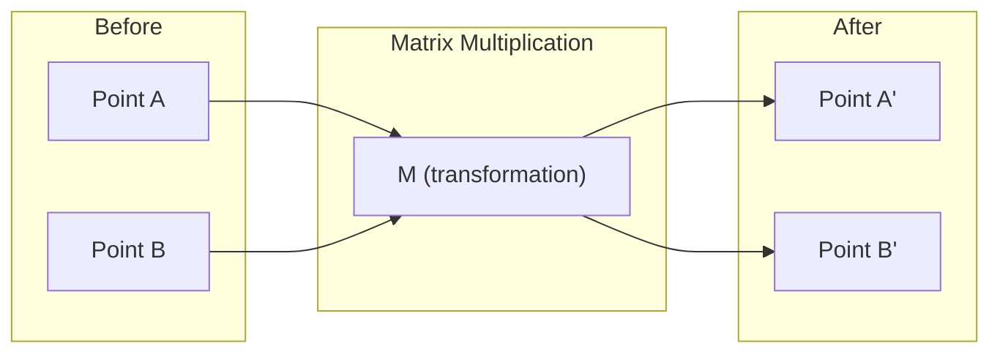
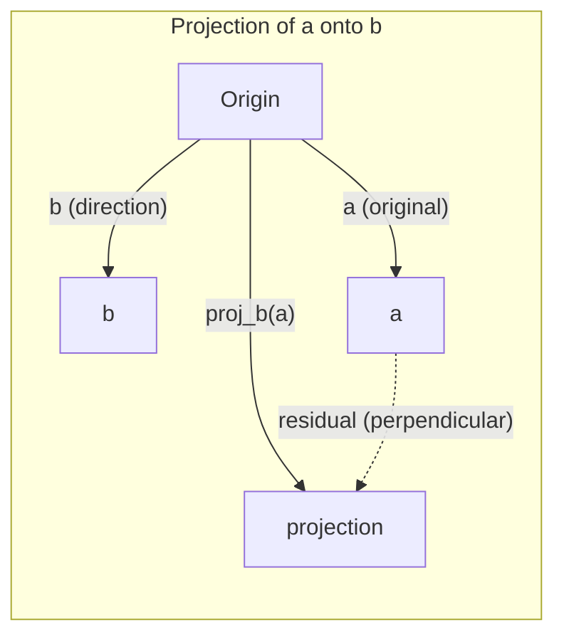

# 線性代數的直覺

> 每個 AI 模型骨子裡都只是矩陣運算，只是戴了一頂華麗的帽子。

**類型：** 學習
**程式語言：** Python, Julia
**先修單元：** 階段 0
**時間：** 約 60 分鐘

## 學習目標

- 在 Python 中從零實作向量與矩陣運算（相加、內積、矩陣乘法）
- 用幾何的方式說明內積、投影與 Gram-Schmidt 過程到底在做什麼
- 用列運算化簡判斷一組向量的線性獨立性、秩與基底
- 把線性代數概念接到它們的 AI 應用上：嵌入、注意力分數與 LoRA

## 問題所在

隨便翻開一篇 ML 論文。第一頁之內你就會看到向量、矩陣、內積與各種轉換。少了線性代數的直覺，這些只是符號。有了它，你就看得出神經網路實際上在做什麼 —— 把空間裡的點搬來搬去。

你不必成為數學家。你需要的是看出這些運算在幾何上的意義，然後自己把它們寫成程式碼。

## 核心概念

### 向量就是點（也是方向）

向量只是一串數字。但這些數字是有意義的 —— 它們是空間中的座標。

**二維向量 [3, 2]：**

| x | y | 點 |
|---|---|-------|
| 3 | 2 | 這個向量從原點 (0,0) 指向平面上的 (3, 2) |

這個向量的長度是 sqrt(3^2 + 2^2) = sqrt(13)，方向朝右上。

在 AI 裡，向量可以表示任何東西：
- 一個詞 → 一個 768 個數字的向量（它在嵌入空間中的「意義」）
- 一張圖片 → 一個由數百萬個像素值組成的向量
- 一位使用者 → 一個偏好向量

### 矩陣就是轉換

矩陣會把一個向量轉換成另一個向量。它可以旋轉、縮放、拉伸或投影。


```mermaid
graph LR
    subgraph Before
        A["Point A"]
        B["Point B"]
    end
    subgraph Matrix["Matrix Multiplication"]
        M["M (transformation)"]
    end
    subgraph After
        A2["Point A'"]
        B2["Point B'"]
    end
    A --> M
    B --> M
    M --> A2
    M --> B2
```

在 AI 裡，矩陣**就是**模型本身：
- 神經網路的權重 → 把輸入轉換成輸出的矩陣
- 注意力分數 → 決定該關注什麼的矩陣
- 嵌入 → 把詞映射到向量的矩陣

### 內積衡量相似度

兩個向量的內積告訴你它們有多相似。

```
a · b = a₁×b₁ + a₂×b₂ + ... + aₙ×bₙ

Same direction:      a · b > 0  (similar)
Perpendicular:       a · b = 0  (unrelated)
Opposite direction:  a · b < 0  (dissimilar)
```

搜尋引擎、推薦系統與 RAG 就是這樣運作的 —— 找出內積大的向量。

### 線性獨立

如果一組向量裡沒有任何一個能寫成其他向量的組合，這組向量就是線性獨立的。若 v1、v2、v3 互相獨立，它們張成一個三維空間。若其中一個是另外兩個的組合，它們只張成一個平面。

為什麼這對 AI 重要：你的特徵矩陣應該有線性獨立的欄。如果兩個特徵完全相關（線性相依），模型就無法區分它們各自的效果。這在迴歸中造成多重共線性 —— 權重矩陣變得不穩定，輸入的微小變動會讓輸出劇烈擺盪。

**具體例子：**

```
v1 = [1, 0, 0]
v2 = [0, 1, 0]
v3 = [2, 1, 0]   # v3 = 2*v1 + v2
```

v1 與 v2 互相獨立 —— 兩者既不是彼此的純量倍數，也不是彼此的組合。但 v3 = 2*v1 + v2，所以 {v1, v2, v3} 是一組線性相依的集合。這三個向量全都躺在 xy 平面上。不管你怎麼組合它們，都到不了 [0, 0, 1]。你有三個向量，但只有兩個自由度。

放到資料集裡：如果 feature_3 = 2*feature_1 + feature_2，那多加 feature_3 給模型的新資訊是零。更糟的是，它讓正規方程式變成奇異的 —— 權重不存在唯一解。

### 基底與秩

基底是一組數量最少、線性獨立、又能張成整個空間的向量。基底向量的個數就是這個空間的維度。

三維空間的標準基底是 {[1,0,0], [0,1,0], [0,0,1]}。但三維中任意三個獨立向量都構成一組有效的基底。選擇基底，就是選擇一套座標系統。

矩陣的秩 = 線性獨立的欄數 = 線性獨立的列數。若 rank < min(rows, cols)，這個矩陣就是秩不足的。這意味著：
- 這個系統有無限多組解（或是無解）
- 轉換過程中有資訊被丟掉了
- 這個矩陣不可逆

| 情況 | 秩 | 對 ML 的意義 |
|-----------|------|---------------------|
| 滿秩（rank = min(m, n)） | 達到最大可能值 | 存在唯一的最小平方解。模型的條件良好。 |
| 秩不足（rank < min(m, n)） | 低於最大值 | 特徵有冗餘。權重有無限多組解。需要正則化。 |
| 秩為 1 | 1 | 每一欄都是同一個向量的縮放版本。所有資料落在一條直線上。 |
| 接近秩不足（奇異值很小） | 數值上偏低 | 矩陣條件不良。輸入的微小雜訊會造成輸出大幅變化。請用 SVD 截斷或脊迴歸。 |

### 投影

把向量 **a** 投影到向量 **b** 上，得到的是 **a** 在 **b** 方向上的分量：

```
proj_b(a) = (a dot b / b dot b) * b
```

殘差 (a - proj_b(a)) 與 b 垂直。這種正交分解是最小平方擬合的基礎。

投影在 ML 裡到處都是：
- 線性迴歸最小化觀測值到欄空間的距離 —— 那個解**就是**一次投影
- PCA 把資料投影到變異數最大的方向上
- Transformer 的注意力機制在計算 query 對 key 的投影


```mermaid
graph LR
    subgraph Projection["Projection of a onto b"]
        direction TB
        O["Origin"] --> |"b (direction)"| B["b"]
        O --> |"a (original)"| A["a"]
        O --> |"proj_b(a)"| P["projection"]
        A -.-> |"residual (perpendicular)"| P
    end
```

**例子：** a = [3, 4]、b = [1, 0]

proj_b(a) = (3*1 + 4*0) / (1*1 + 0*0) * [1, 0] = 3 * [1, 0] = [3, 0]

這個投影把 y 分量丟掉了。這就是降維最簡單的形式 —— 把你不在乎的方向扔掉。

### Gram-Schmidt 過程

把任意一組獨立向量轉成一組正交規範基底。正交規範的意思是：每個向量長度都是 1，而且任兩個都互相垂直。

演算法：
1. 拿第一個向量，做正規化
2. 拿第二個向量，減掉它投影到第一個向量上的部分，再正規化
3. 拿第三個向量，減掉它投影到前面所有向量上的部分，再正規化
4. 對剩下的向量重複同樣步驟

```
Input:  v1, v2, v3, ... (linearly independent)

u1 = v1 / |v1|

w2 = v2 - (v2 dot u1) * u1
u2 = w2 / |w2|

w3 = v3 - (v3 dot u1) * u1 - (v3 dot u2) * u2
u3 = w3 / |w3|

Output: u1, u2, u3, ... (orthonormal basis)
```

QR 分解內部就是這樣運作的。Q 是那組正交規範基底，R 記下了投影係數。QR 分解被用在：
- 解線性系統（比高斯消去法更穩定）
- 計算特徵值（QR 演算法）
- 最小平方迴歸（標準的數值方法）

```figure
eigen-directions
```

## 動手實作

### 步驟 1：從零打造向量（Python）

```python
class Vector:
    def __init__(self, components):
        self.components = list(components)
        self.dim = len(self.components)

    def __add__(self, other):
        return Vector([a + b for a, b in zip(self.components, other.components)])

    def __sub__(self, other):
        return Vector([a - b for a, b in zip(self.components, other.components)])

    def dot(self, other):
        return sum(a * b for a, b in zip(self.components, other.components))

    def magnitude(self):
        return sum(x**2 for x in self.components) ** 0.5

    def normalize(self):
        mag = self.magnitude()
        return Vector([x / mag for x in self.components])

    def cosine_similarity(self, other):
        return self.dot(other) / (self.magnitude() * other.magnitude())

    def __repr__(self):
        return f"Vector({self.components})"


a = Vector([1, 2, 3])
b = Vector([4, 5, 6])

print(f"a + b = {a + b}")
print(f"a · b = {a.dot(b)}")
print(f"|a| = {a.magnitude():.4f}")
print(f"cosine similarity = {a.cosine_similarity(b):.4f}")
```

### 步驟 2：從零打造矩陣（Python）

```python
class Matrix:
    def __init__(self, rows):
        self.rows = [list(row) for row in rows]
        self.shape = (len(self.rows), len(self.rows[0]))

    def __matmul__(self, other):
        if isinstance(other, Vector):
            return Vector([
                sum(self.rows[i][j] * other.components[j] for j in range(self.shape[1]))
                for i in range(self.shape[0])
            ])
        rows = []
        for i in range(self.shape[0]):
            row = []
            for j in range(other.shape[1]):
                row.append(sum(
                    self.rows[i][k] * other.rows[k][j]
                    for k in range(self.shape[1])
                ))
            rows.append(row)
        return Matrix(rows)

    def transpose(self):
        return Matrix([
            [self.rows[j][i] for j in range(self.shape[0])]
            for i in range(self.shape[1])
        ])

    def __repr__(self):
        return f"Matrix({self.rows})"


rotation_90 = Matrix([[0, -1], [1, 0]])
point = Vector([3, 1])

rotated = rotation_90 @ point
print(f"Original: {point}")
print(f"Rotated 90°: {rotated}")
```

### 步驟 3：這為什麼對 AI 重要

```python
import random

random.seed(42)
weights = Matrix([[random.gauss(0, 0.1) for _ in range(3)] for _ in range(2)])
input_vector = Vector([1.0, 0.5, -0.3])

output = weights @ input_vector
print(f"Input (3D): {input_vector}")
print(f"Output (2D): {output}")
print("This is what a neural network layer does -- matrix multiplication.")
```

### 步驟 4：Julia 版本

```julia
a = [1.0, 2.0, 3.0]
b = [4.0, 5.0, 6.0]

println("a + b = ", a + b)
println("a · b = ", a ⋅ b)       # Julia supports unicode operators
println("|a| = ", √(a ⋅ a))
println("cosine = ", (a ⋅ b) / (√(a ⋅ a) * √(b ⋅ b)))

# Matrix-vector multiplication
W = [0.1 -0.2 0.3; 0.4 0.5 -0.1]
x = [1.0, 0.5, -0.3]
println("Wx = ", W * x)
println("This is a neural network layer.")
```

### 步驟 5：從零實作線性獨立判斷與投影（Python）

```python
def is_linearly_independent(vectors):
    n = len(vectors)
    dim = len(vectors[0].components)
    mat = Matrix([v.components[:] for v in vectors])
    rows = [row[:] for row in mat.rows]
    rank = 0
    for col in range(dim):
        pivot = None
        for row in range(rank, len(rows)):
            if abs(rows[row][col]) > 1e-10:
                pivot = row
                break
        if pivot is None:
            continue
        rows[rank], rows[pivot] = rows[pivot], rows[rank]
        scale = rows[rank][col]
        rows[rank] = [x / scale for x in rows[rank]]
        for row in range(len(rows)):
            if row != rank and abs(rows[row][col]) > 1e-10:
                factor = rows[row][col]
                rows[row] = [rows[row][j] - factor * rows[rank][j] for j in range(dim)]
        rank += 1
    return rank == n


def project(a, b):
    scalar = a.dot(b) / b.dot(b)
    return Vector([scalar * x for x in b.components])


def gram_schmidt(vectors):
    orthonormal = []
    for v in vectors:
        w = v
        for u in orthonormal:
            proj = project(w, u)
            w = w - proj
        if w.magnitude() < 1e-10:
            continue
        orthonormal.append(w.normalize())
    return orthonormal


v1 = Vector([1, 0, 0])
v2 = Vector([1, 1, 0])
v3 = Vector([1, 1, 1])
basis = gram_schmidt([v1, v2, v3])
for i, u in enumerate(basis):
    print(f"u{i+1} = {u}")
    print(f"  |u{i+1}| = {u.magnitude():.6f}")

print(f"u1 · u2 = {basis[0].dot(basis[1]):.6f}")
print(f"u1 · u3 = {basis[0].dot(basis[2]):.6f}")
print(f"u2 · u3 = {basis[1].dot(basis[2]):.6f}")
```

## 框架應用

現在用 NumPy 做同樣的事 —— 這才是你實務上真正會用的：

```python
import numpy as np

a = np.array([1, 2, 3], dtype=float)
b = np.array([4, 5, 6], dtype=float)

print(f"a + b = {a + b}")
print(f"a · b = {np.dot(a, b)}")
print(f"|a| = {np.linalg.norm(a):.4f}")
print(f"cosine = {np.dot(a, b) / (np.linalg.norm(a) * np.linalg.norm(b)):.4f}")

W = np.random.randn(2, 3) * 0.1
x = np.array([1.0, 0.5, -0.3])
print(f"Wx = {W @ x}")
```

### 用 NumPy 算秩、投影與 QR

```python
import numpy as np

A = np.array([[1, 2], [2, 4]])
print(f"Rank: {np.linalg.matrix_rank(A)}")

a = np.array([3, 4])
b = np.array([1, 0])
proj = (np.dot(a, b) / np.dot(b, b)) * b
print(f"Projection of {a} onto {b}: {proj}")

Q, R = np.linalg.qr(np.random.randn(3, 3))
print(f"Q is orthogonal: {np.allclose(Q @ Q.T, np.eye(3))}")
print(f"R is upper triangular: {np.allclose(R, np.triu(R))}")
```

### PyTorch —— 張量就是會自動微分的向量

```python
import torch

x = torch.randn(3, requires_grad=True)
y = torch.tensor([1.0, 0.0, 0.0])

similarity = torch.dot(x, y)
similarity.backward()

print(f"x = {x.data}")
print(f"y = {y.data}")
print(f"dot product = {similarity.item():.4f}")
print(f"d(dot)/dx = {x.grad}")
```

內積對 x 的梯度就是 y。PyTorch 自動幫你算出來了。神經網路裡的每個運算，都是由這類運算堆出來的 —— 矩陣乘法、內積、投影 —— 而自動微分會追蹤穿過它們全部的梯度。

你剛剛從零打造出 NumPy 一行就能做完的東西。現在你知道底層發生了什麼事。

## 產出交付

本單元會產出：
- `outputs/prompt-linear-algebra-tutor.md` —— 一段提示詞，讓 AI 助理用幾何直覺來教線性代數

## 關聯

本單元的每一項內容，都能接到現代 AI 的某個具體環節：

| 概念 | 它出現在哪裡 |
|---------|------------------|
| 內積 | Transformer 的注意力分數、RAG 的餘弦相似度 |
| 矩陣乘法 | 每一層神經網路、每一個線性轉換 |
| 線性獨立 | 特徵選擇、避免多重共線性 |
| 秩 | 判斷一個系統是否可解、LoRA（低秩調適） |
| 投影 | 線性迴歸（投影到欄空間）、PCA |
| Gram-Schmidt／QR | 數值求解器、特徵值計算 |
| 正交規範基底 | 穩定的數值計算、白化轉換 |

LoRA 值得特別一提。它微調大型語言模型的方式，是把權重更新分解成低秩矩陣。與其更新一個 4096x4096 的權重矩陣（1600 萬個參數），LoRA 只更新兩個大小為 4096x16 與 16x4096 的矩陣（13.1 萬個參數）。秩為 16 這個限制，等於是假設權重更新落在完整 4096 維空間中的一個 16 維子空間裡。這就是線性代數在幹實事。

## 練習

1. 實作 `Vector.angle_between(other)`，回傳兩個向量之間的夾角（以度為單位）
2. 建一個二維縮放矩陣，把 x 座標變兩倍、y 座標變三倍，然後把它套用到向量 [1, 1] 上
3. 給定 5 個隨機的類詞向量（維度 50），用餘弦相似度找出最相似的那兩個
4. 驗證 Gram-Schmidt 的輸出真的是正交規範的：檢查任兩個向量的內積都是 0，且每個向量的長度都是 1
5. 建一個秩為 2 的 3x3 矩陣。用 `rank()` 方法驗證。然後說明它的欄張成的是什麼幾何物件。
6. 把向量 [1, 2, 3] 投影到 [1, 1, 1] 上。結果在幾何上代表什麼？

## 關鍵術語

| 術語 | 大家怎麼說 | 實際上是什麼 |
|------|----------------|----------------------|
| 向量 | 「一支箭」 | 一串數字，代表 n 維空間中的一個點或一個方向 |
| 矩陣 | 「一張數字表格」 | 一種把向量從一個空間映射到另一個空間的轉換 |
| 內積 | 「相乘再相加」 | 衡量兩個向量方向有多一致 —— 相似度搜尋的核心 |
| 嵌入 | 「某種 AI 魔法」 | 一個代表某樣東西（詞、圖片、使用者）意義的向量 |
| 線性獨立 | 「它們不重疊」 | 這組向量裡沒有任何一個能寫成其他向量的組合 |
| 秩 | 「有幾個維度」 | 矩陣中線性獨立的欄數（或列數） |
| 投影 | 「影子」 | 一個向量在另一個向量方向上的分量 |
| 基底 | 「座標軸」 | 一組數量最少、能張成整個空間的獨立向量 |
| 正交規範 | 「互相垂直的單位向量」 | 一組彼此互相垂直、且每個長度都是 1 的向量 |
