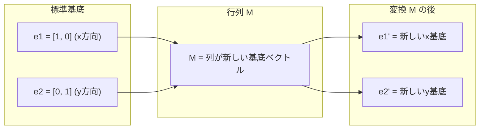
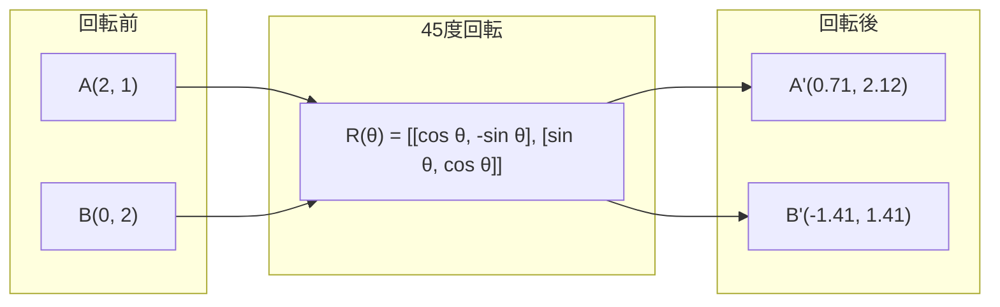
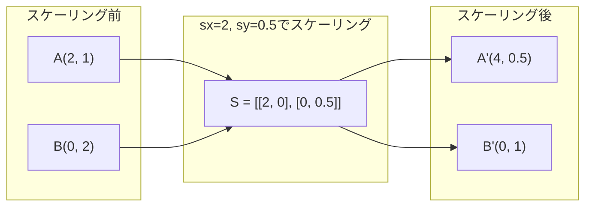
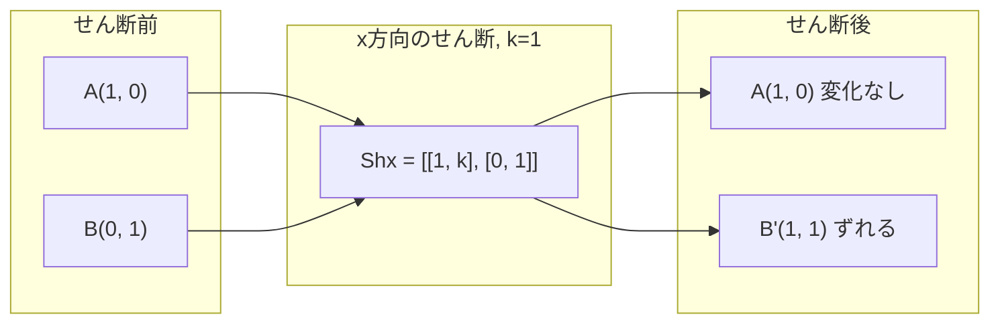
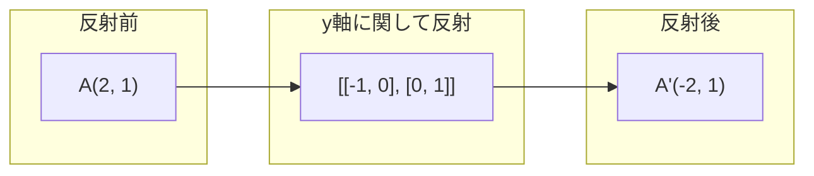
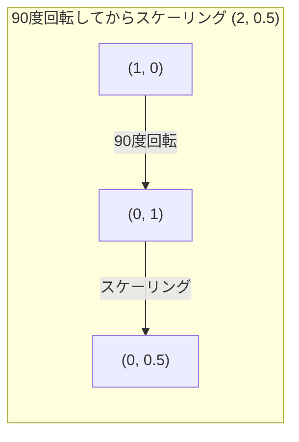
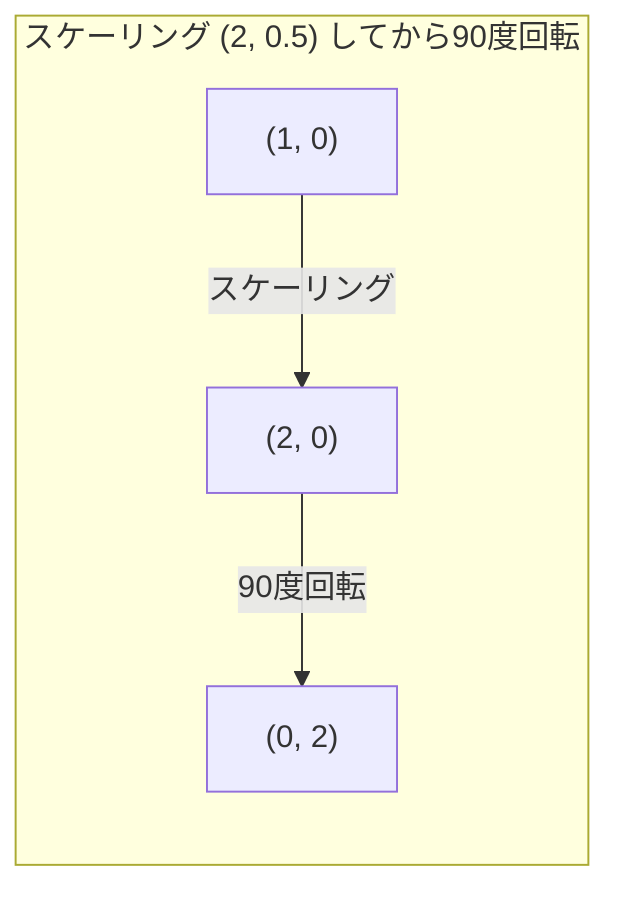

# 行列変換

> 行列は空間を変形する機械です。すべての点に何をするかを理解すれば、変換全体を理解できます。

**種別:** 構築
**言語:** Python, Julia
**前提条件:** Phase 1, Lessons 01-02 (Linear Algebra Intuition, Vectors & Matrices Operations)
**所要時間:** 約75分

## 学習目標

- 回転、スケーリング、せん断、反射の行列を構成し、2Dおよび3Dの点へ適用する
- 複数の変換を行列積で合成し、順序が重要であることを検証する
- 特性方程式から2x2行列の固有値と固有ベクトルを計算する
- 固有値がPCAの方向、RNNの安定性、スペクトルクラスタリングの挙動を決める理由を説明する

## 問題

PCAについて読むと、「共分散行列の固有ベクトルを見つける」と書かれています。モデルの安定性について読むと、「すべての固有値の大きさが1未満か確認する」と書かれています。データ拡張について読むと、「ランダムな回転を適用する」と書かれています。行列が空間に対して幾何学的に何をするかを理解するまで、これらはどれも意味を持ちません。

行列は単なる数値の格子ではありません。空間を扱う機械です。回転行列は点を回します。スケーリング行列は点を引き伸ばします。せん断行列は点を傾けます。ニューラルネットワークがデータに適用するすべての変換は、これらの操作のいずれか、またはそれらの合成です。このレッスンでは、その操作を具体的にします。

## 概念

### 行列としての変換

2Dのすべての線形変換は、2x2行列として書けます。その行列は、基底ベクトル [1, 0] と [0, 1] がどこへ移るかを正確に教えてくれます。残りはすべてそこから決まります。



### 回転

角度 theta による2D回転は、距離と角度を保ちます。すべての点を円弧に沿って動かします。



3Dでは、ある軸の周りに回転します。各軸には、それぞれの回転行列があります。

```
Rz(theta) = | cos  -sin  0 |     z軸まわりに回転
            | sin   cos  0 |     (x-y平面が回り, zは変わらない)
            |  0     0   1 |

Rx(theta) = | 1   0     0    |   x軸まわりに回転
            | 0  cos  -sin   |   (y-z平面が回り, xは変わらない)
            | 0  sin   cos   |

Ry(theta) = |  cos  0  sin |     y軸まわりに回転
            |   0   1   0  |     (x-z平面が回り, yは変わらない)
            | -sin  0  cos |
```

### スケーリング

スケーリングは、各軸に沿って独立に引き伸ばしたり縮めたりします。



### せん断

せん断は、一方の軸を固定したまま、もう一方の軸を傾けます。長方形を平行四辺形に変えます。



せん断行列:
- `Shx = [[1, k], [0, 1]]` は x を k * y だけずらす
- `Shy = [[1, 0], [k, 1]]` は y を k * x だけずらす

### 反射

反射は、点を軸または直線に関して鏡映します。



反射行列:
- y軸に関して反射: `[[-1, 0], [0, 1]]`
- x軸に関して反射: `[[1, 0], [0, -1]]`

### 合成: 変換をつなぐ

変換Aを適用してからBを適用することは、それらの行列を掛けることと同じです。`result = B @ A @ point`。順序は重要です。回転してからスケーリングする場合と、スケーリングしてから回転する場合では結果が異なります。



合成: `S @ R = [[0, -2], [0.5, 0]]`



合成: `R @ S = [[0, -0.5], [2, 0]]`

結果は異なります。行列積は可換ではありません。

### 固有値と固有ベクトル

ほとんどのベクトルは、行列を掛けると方向が変わります。固有ベクトルは特別です。行列はそれをスケールするだけで、回転させません。そのスケール係数が固有値です。

```
A @ v = lambda * v

v は固有ベクトル (変換後も残る方向)
lambda は固有値 (どれだけ引き伸ばすか)

例: A = | 2  1 |
        | 1  2 |

固有値3を持つ固有ベクトル [1, 1]:
  A @ [1,1] = [3, 3] = 3 * [1, 1]     (同じ方向, 3倍にスケール)

固有値1を持つ固有ベクトル [1, -1]:
  A @ [1,-1] = [1, -1] = 1 * [1, -1]  (同じ方向, 変化なし)
```

この行列は [1, 1] 方向に空間を3倍引き伸ばし、[1, -1] 方向は変えずに保ちます。それ以外の方向は、この2つの混合です。

### 固有分解

行列がn本の線形独立な固有ベクトルを持つなら、次のように分解できます。

```
A = V @ D @ V^(-1)

V = 固有ベクトルを列に持つ行列
D = 固有値の対角行列
V^(-1) = Vの逆行列

これは「固有ベクトル座標へ回転し、各軸に沿ってスケーリングし、元へ戻す」と言っている。
```

### 固有値が重要な理由

**PCA。** 共分散行列の固有ベクトルが主成分です。固有値は、それぞれの成分がどれだけ分散を捉えているかを教えてくれます。固有値で並べ、上位k個を残せば、次元削減になります。

**安定性。** リカレントネットワークや力学系では、大きさが1より大きい固有値は出力を爆発させます。1より小さいと消失させます。これは勾配消失/勾配爆発問題を1文で表したものです。

**スペクトル法。** グラフニューラルネットワークは隣接行列の固有値を使います。スペクトルクラスタリングはラプラシアンの固有値を使います。固有ベクトルはグラフの構造を明らかにします。

### 体積スケーリング係数としての行列式

変換行列の行列式は、面積（2D）または体積（3D）をどれだけスケールするかを教えてくれます。

```
det = 1:   面積を保つ (回転)
det = 2:   面積を2倍にする
det = 0:   空間を低次元へつぶす (特異)
det = -1:  面積は保つが向きを反転する (反射)

| det(Rotation) | = 1        (常に)
| det(Scale sx, sy) | = sx * sy
| det(Shear) | = 1           (面積を保つ)
| det(Reflection) | = -1     (向きを反転する)
```

## 作ってみる

### ステップ 1: 変換行列をスクラッチ実装する (Python)

```python
import math

def rotation_2d(theta):
    c, s = math.cos(theta), math.sin(theta)
    return [[c, -s], [s, c]]

def scaling_2d(sx, sy):
    return [[sx, 0], [0, sy]]

def shearing_2d(kx, ky):
    return [[1, kx], [ky, 1]]

def reflection_x():
    return [[1, 0], [0, -1]]

def reflection_y():
    return [[-1, 0], [0, 1]]

def mat_vec_mul(matrix, vector):
    return [
        sum(matrix[i][j] * vector[j] for j in range(len(vector)))
        for i in range(len(matrix))
    ]

def mat_mul(a, b):
    rows_a, cols_b = len(a), len(b[0])
    cols_a = len(a[0])
    return [
        [sum(a[i][k] * b[k][j] for k in range(cols_a)) for j in range(cols_b)]
        for i in range(rows_a)
    ]

point = [1.0, 0.0]
angle = math.pi / 4

rotated = mat_vec_mul(rotation_2d(angle), point)
print(f"Rotate (1,0) by 45 deg: ({rotated[0]:.4f}, {rotated[1]:.4f})")

scaled = mat_vec_mul(scaling_2d(2, 3), [1.0, 1.0])
print(f"Scale (1,1) by (2,3): ({scaled[0]:.1f}, {scaled[1]:.1f})")

sheared = mat_vec_mul(shearing_2d(1, 0), [1.0, 1.0])
print(f"Shear (1,1) kx=1: ({sheared[0]:.1f}, {sheared[1]:.1f})")

reflected = mat_vec_mul(reflection_y(), [2.0, 1.0])
print(f"Reflect (2,1) across y: ({reflected[0]:.1f}, {reflected[1]:.1f})")
```

### ステップ 2: 変換の合成

```python
R = rotation_2d(math.pi / 2)
S = scaling_2d(2, 0.5)

rotate_then_scale = mat_mul(S, R)
scale_then_rotate = mat_mul(R, S)

point = [1.0, 0.0]
result1 = mat_vec_mul(rotate_then_scale, point)
result2 = mat_vec_mul(scale_then_rotate, point)

print(f"Rotate 90 then scale: ({result1[0]:.2f}, {result1[1]:.2f})")
print(f"Scale then rotate 90: ({result2[0]:.2f}, {result2[1]:.2f})")
print(f"Same? {result1 == result2}")
```

### ステップ 3: 固有値をスクラッチで求める (2x2)

2x2行列 `[[a, b], [c, d]]` について、固有値は特性方程式 `lambda^2 - (a+d)*lambda + (ad - bc) = 0` を解くことで得られます。

```python
def eigenvalues_2x2(matrix):
    a, b = matrix[0]
    c, d = matrix[1]
    trace = a + d
    det = a * d - b * c
    discriminant = trace ** 2 - 4 * det
    if discriminant < 0:
        real = trace / 2
        imag = (-discriminant) ** 0.5 / 2
        return (complex(real, imag), complex(real, -imag))
    sqrt_disc = discriminant ** 0.5
    return ((trace + sqrt_disc) / 2, (trace - sqrt_disc) / 2)

def eigenvector_2x2(matrix, eigenvalue):
    a, b = matrix[0]
    c, d = matrix[1]
    if abs(b) > 1e-10:
        v = [b, eigenvalue - a]
    elif abs(c) > 1e-10:
        v = [eigenvalue - d, c]
    else:
        if abs(a - eigenvalue) < 1e-10:
            v = [1, 0]
        else:
            v = [0, 1]
    mag = (v[0] ** 2 + v[1] ** 2) ** 0.5
    return [v[0] / mag, v[1] / mag]

A = [[2, 1], [1, 2]]
vals = eigenvalues_2x2(A)
print(f"Matrix: {A}")
print(f"Eigenvalues: {vals[0]:.4f}, {vals[1]:.4f}")

for val in vals:
    vec = eigenvector_2x2(A, val)
    result = mat_vec_mul(A, vec)
    scaled = [val * vec[0], val * vec[1]]
    print(f"  lambda={val:.1f}, v={[round(x,4) for x in vec]}")
    print(f"    A@v = {[round(x,4) for x in result]}")
    print(f"    l*v = {[round(x,4) for x in scaled]}")
```

### ステップ 4: 体積スケーリング係数としての行列式

```python
def det_2x2(matrix):
    return matrix[0][0] * matrix[1][1] - matrix[0][1] * matrix[1][0]

print(f"det(rotation 45) = {det_2x2(rotation_2d(math.pi/4)):.4f}")
print(f"det(scale 2,3)   = {det_2x2(scaling_2d(2, 3)):.1f}")
print(f"det(shear kx=1)  = {det_2x2(shearing_2d(1, 0)):.1f}")
print(f"det(reflect y)   = {det_2x2(reflection_y()):.1f}")

singular = [[1, 2], [2, 4]]
print(f"det(singular)     = {det_2x2(singular):.1f}")
print("Singular: columns are proportional, space collapses to a line.")
```

## 使ってみる

NumPyは、これらすべてを最適化済みルーチンで処理します。

```python
import numpy as np

theta = np.pi / 4
R = np.array([[np.cos(theta), -np.sin(theta)],
              [np.sin(theta),  np.cos(theta)]])

point = np.array([1.0, 0.0])
print(f"Rotate (1,0) by 45 deg: {R @ point}")

S = np.diag([2.0, 3.0])
composed = S @ R
print(f"Scale(2,3) after Rotate(45): {composed @ point}")

A = np.array([[2, 1], [1, 2]], dtype=float)
eigenvalues, eigenvectors = np.linalg.eig(A)
print(f"\nEigenvalues: {eigenvalues}")
print(f"Eigenvectors (columns):\n{eigenvectors}")

for i in range(len(eigenvalues)):
    v = eigenvectors[:, i]
    lam = eigenvalues[i]
    print(f"  A @ v{i} = {A @ v}, lambda * v{i} = {lam * v}")

print(f"\ndet(R) = {np.linalg.det(R):.4f}")
print(f"det(S) = {np.linalg.det(S):.1f}")

B = np.array([[3, 1], [0, 2]], dtype=float)
vals, vecs = np.linalg.eig(B)
D = np.diag(vals)
V = vecs
reconstructed = V @ D @ np.linalg.inv(V)
print(f"\nEigendecomposition A = V @ D @ V^-1:")
print(f"Original:\n{B}")
print(f"Reconstructed:\n{reconstructed}")
```

### NumPyによる3D回転

```python
def rotation_3d_z(theta):
    c, s = np.cos(theta), np.sin(theta)
    return np.array([[c, -s, 0], [s, c, 0], [0, 0, 1]])

def rotation_3d_x(theta):
    c, s = np.cos(theta), np.sin(theta)
    return np.array([[1, 0, 0], [0, c, -s], [0, s, c]])

point_3d = np.array([1.0, 0.0, 0.0])
rotated_z = rotation_3d_z(np.pi / 2) @ point_3d
rotated_x = rotation_3d_x(np.pi / 2) @ point_3d

print(f"\n3D point: {point_3d}")
print(f"Rotate 90 around z: {np.round(rotated_z, 4)}")
print(f"Rotate 90 around x: {np.round(rotated_x, 4)}")
```

## 成果物

このレッスンでは、PCA（Phase 2）とニューラルネットワークの重み解析に必要な幾何学的基礎を作ります。ここで作る固有値/固有ベクトルのコードは、本番の機械学習システムで次元削減、スペクトルクラスタリング、安定性解析を支えるものと同じアルゴリズムです。

## 演習

1. 単位正方形（頂点は [0,0], [1,0], [1,1], [0,1]）に、回転、スケーリング、せん断を適用してください。それぞれについて変換後の頂点を出力してください。回転が頂点間の距離を保つことを検証してください。

2. 行列 [[4, 2], [1, 3]] の固有値を、特性方程式を使って手で求めてください。その後、自作関数とNumPyで検証してください。

3. 3つの変換（30度回転、[1.5, 0.8] によるスケーリング、kx=0.3のせん断）を合成し、円周上に並べた8個の点へ適用してください。変換前後の座標を出力してください。合成行列の行列式を計算し、それが個々の行列式の積と等しいことを検証してください。

## 重要用語

| 用語 | よくある言い方 | 実際の意味 |
|------|----------------|----------------------|
| 回転行列 | 「ものを回す」 | 距離と角度を保ちながら点を円弧に沿って動かす直交行列。行列式は常に1。 |
| スケーリング行列 | 「ものを大きくする」 | 各軸に沿って独立に引き伸ばしたり縮めたりする対角行列。行列式はスケール係数の積。 |
| せん断行列 | 「斜めにする」 | ある座標を別の座標に比例してずらし、長方形を平行四辺形に変える行列。行列式は1。 |
| 反射 | 「鏡映する」 | 軸または平面に関して空間を反転する行列。行列式は-1。 |
| 合成 | 「2つのことをする」 | 変換行列を掛けて操作をつなげること。順序が重要: B @ A は先にAを適用し、次にBを適用することを意味する。 |
| 固有ベクトル | 「特別な方向」 | 行列が回転させず、スケールだけする方向。変換の指紋。 |
| 固有値 | 「どれだけ引き伸ばすか」 | 行列が固有ベクトルをスケールする倍率。負（反転）や複素数（回転）になることもある。 |
| 固有分解 | 「行列を分解する」 | 行列を V @ D @ V^(-1) と書き、基本的なスケーリング方向と大きさに分けること。 |
| 行列式 | 「行列から得られる1つの数」 | 変換が面積（2D）または体積（3D）をスケールする倍率。0なら変換は不可逆。 |
| 特性方程式 | 「固有値の出どころ」 | det(A - lambda * I) = 0。根が固有値になる多項式。 |

## 参考資料

- [3Blue1Brown: Linear Transformations](https://www.3blue1brown.com/lessons/linear-transformations) -- 行列が空間をどう変形するかの視覚的な直感
- [3Blue1Brown: Eigenvectors and Eigenvalues](https://www.3blue1brown.com/lessons/eigenvalues) -- 固有ベクトルの幾何学的意味に関する最高の視覚的説明
- [MIT 18.06 Lecture 21: Eigenvalues and Eigenvectors](https://ocw.mit.edu/courses/18-06-linear-algebra-spring-2010/) -- Gilbert Strangによる古典的な扱い
