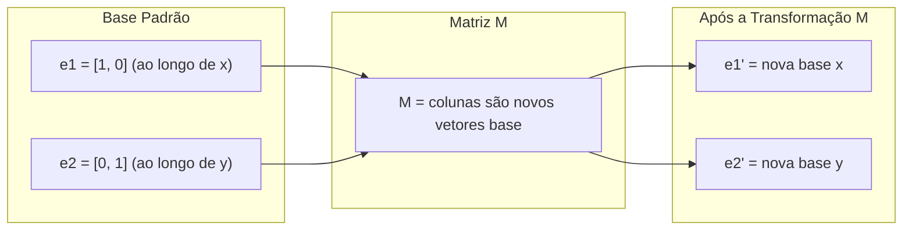
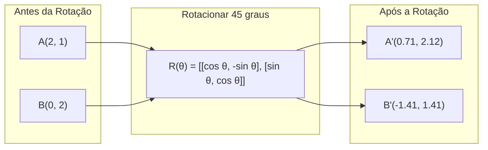
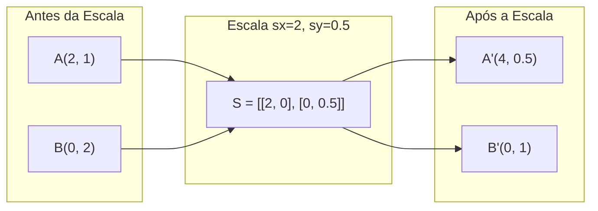
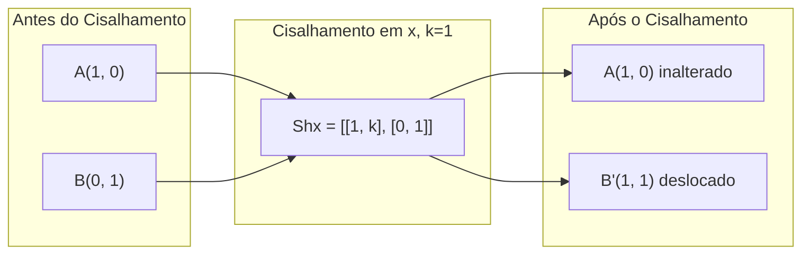
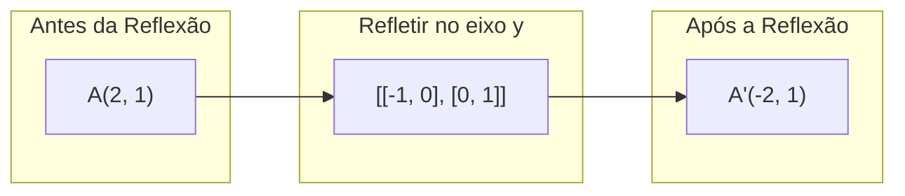
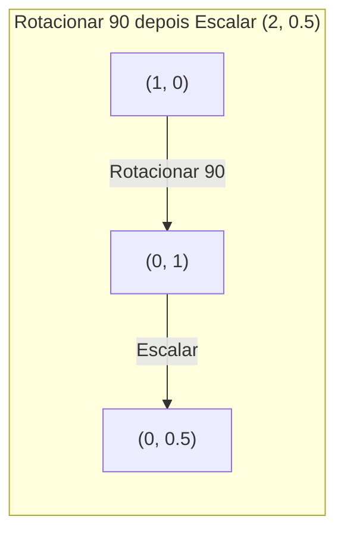
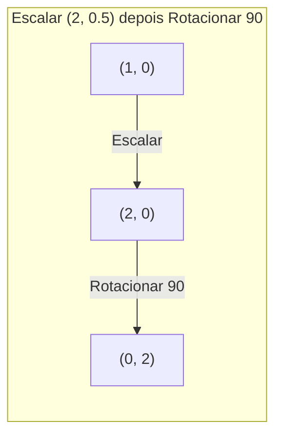

# Transformações de Matrizes

> Uma matriz é uma máquina que remodela o espaço. Aprenda o que ela faz com cada ponto, e você entende a transformação inteira.

**Tipo:** Construir
**Linguagens:** Python, Julia
**Pré-requisitos:** Fase 1, Aulas 01-02 (Intuição de Álgebra Linear, Vetores & Operações com Matrizes)
**Tempo:** ~75 minutos

## Objetivos de Aprendizado

- Construir matrizes de rotação, escala, cisalhamento e reflexão e aplicá-las a pontos 2D e 3D
- Compor múltiplas transformações por multiplicação de matrizes e verificar que a ordem importa
- Computar autovalores e autovetores de matrizes 2x2 a partir da equação característica
- Explicar por que autovalores determinam direções de PCA, estabilidade de RNN e comportamento de clustering eespecificaçãotral

## O Problemo

Você lê sobre PCA e vê "encontre os autovetores da matriz de covariância". Você lê sobre estabilidade de modelo e vê "verifique se todos os autovalores têm magnitude menor que 1". Você lê sobre augmentação de dados e vê "aplique uma rotação aleatória". Nada disso faz sentido até você entender o que as matrizes fazem com o espaço geometricamente.

Matrizes não são só grades de números. São máquinas espaciais. Uma matriz de rotação gira pontos. Uma matriz de escala os estica. Uma matriz de cisalhamento os inclina. Toda transformação que uma rede neural aplica aos dados é uma dessas operações ou uma composição delas. Esta aula torna essas operações concretas.

## O Conceito

### Transformações como matrizes

Toda transformação linear em 2D pode ser escrita como uma matriz 2x2. A matriz diz exatamente onde os vetores base [1, 0] e [0, 1] acabam. Todo o resto segue.



### Rotação

Uma rotação 2D por um ângulo theta mantém distâncias e ângulos intactos. Move cada ponto ao longo de um arco circular.



Em 3D, você rotaciona ao redor de um eixo. Cada eixo tem sua própria matriz de rotação:

```
Rz(theta) = | cos  -sin  0 |     Rotação ao redor do eixo z
            | sin   cos  0 |     (plano x-y gira, z fica)
            |  0     0   1 |

Rx(theta) = | 1   0     0    |   Rotação ao redor do eixo x
            | 0  cos  -sin   |   (plano y-z gira, x fica)
            | 0  sin   cos   |

Ry(theta) = |  cos  0  sin |     Rotação ao redor do eixo y
            |   0   1   0  |     (plano x-z gira, y fica)
            | -sin  0  cos |
```

### Escala

Escala estica ou comprime ao longo de cada eixo independentemente.



### Cisalhamento

Cisalhamento inclina um eixo mantendo o outro fixo. Transforma retângulos em paralelogramos.



Matrizes de cisalhamento:
- `Shx = [[1, k], [0, 1]]` desloca x por k * y
- `Shy = [[1, 0], [k, 1]]` desloca y por k * x

### Reflexão

Reflexão espelha pontos ao longo de um eixo ou linha.



Matrizes de reflexão:
- Refletir no eixo y: `[[-1, 0], [0, 1]]`
- Refletir no eixo x: `[[1, 0], [0, -1]]`

### Composição: encadeando transformações

Aplicar a transformação A depois B é o mesmo que multiplicar suas matrizes: `resultado = B @ A @ ponto`. A ordem importa. Rotacionar depois escalar dá resultados diferentes de escalar depois rotacionar.



Composto: `S @ R = [[0, -2], [0.5, 0]]`



Composto: `R @ S = [[0, -0.5], [2, 0]]`

Resultados diferentes. Multiplicação de matrizes não é comutativa.

### Autovalores e autovetores

A maioria dos vetores muda de direção quando uma matriz os atinge. Autovetores são eespecificaçãoiais: a matriz só os escala, nunca rotaciona. O fator de escala é o autovalor.

```
A @ v = lambda * v

v é o autovetor (direção que sobrevive)
lambda é o autovalor (quanto estica)

Exemplo: A = | 2  1 |
             | 1  2 |

Autovetor [1, 1] com autovalor 3:
  A @ [1,1] = [3, 3] = 3 * [1, 1]     (mesma direção, escalado por 3)

Autovetor [1, -1] com autovalor 1:
  A @ [1,-1] = [1, -1] = 1 * [1, -1]  (mesma direção, inalterado)
```

A matriz estica o espaço por 3x ao longo de [1, 1] e mantém [1, -1] inalterado. Toda outra direção é uma mistura dessas duas.

### Autodecomposição

Se uma matriz tem n autovetores linearmente independentes, ela pode ser decomposta:

```
A = V @ D @ V^(-1)

V = matriz cujas colunas são autovetores
D = matriz diagonal de autovalores
V^(-1) = inversa de V

Isso diz: rotacionar para coordenadas de autovetores, escalar ao longo de cada eixo, rotacionar de volta.
```

### Por que autovalores importam

**PCA.** Os autovetores da matriz de covariância são os componentes principais. Os autovalores dizem quanta variância cada componente captura. Ordene por autovalor, mantenha os top k, e você tem redução de dimensionalidade.

**Estabilidade.** Em redes recorrentes e sistemas dinâmicos, autovalores com magnitude > 1 causam explosão de saídas. Magnitude < 1 causa dissipação. Esse é o problema de gradiente evaporando/explodindo em uma frase.

**Métodos eespecificaçãotrais.** Redes neurais de grafos usam autovalores da matriz de adjacência. Clustering eespecificaçãotral usa autovalores do Laplaciano. Os autovetores revelam a estrutura do grafo.

### Determinante como fator de escala de volume

O determinante da matriz de uma transformação diz quanto ela escala a área (2D) ou volume (3D).

```
det = 1:   área preservada (rotação)
det = 2:   área dobrada
det = 0:   espaço esmagado para dimensão menor (singular)
det = -1:  área preservada mas orientação invertida (reflexão)

|| det(Rotação) | = 1        (sempre)
|| det(Escala sx, sy) | = sx * sy
|| det(Cisalhamento) | = 1           (área preservada)
|| det(Reflexão) | = -1     (orientação invertida)
```

## Construa

### Passo 1: Matrizes de transformação do zero (Python)

```python
import math

def rotation_2d(theta):
    c, s = math.cos(theta), math.sin(theta)
    return [[c, -s], [s, c]]

def scaling_2d(sx, sy):
    return [[sx, 0], [0, sy]]

def shearing_2d(kx, ky):
    return [[1, kx], [ky, 1]]

def reflection_x():
    return [[1, 0], [0, -1]]

def reflection_y():
    return [[-1, 0], [0, 1]]

def mat_vec_mul(matrix, vector):
    return [
        sum(matrix[i][j] * vector[j] for j in range(len(vector)))
        for i in range(len(matrix))
    ]

def mat_mul(a, b):
    rows_a, cols_b = len(a), len(b[0])
    cols_a = len(a[0])
    return [
        [sum(a[i][k] * b[k][j] for k in range(cols_a)) for j in range(cols_b)]
        for i in range(rows_a)
    ]

ponto = [1.0, 0.0]
angle = math.pi / 4

rotated = mat_vec_mul(rotation_2d(angle), ponto)
print(f"Rotacionar (1,0) por 45 graus: ({rotated[0]:.4f}, {rotated[1]:.4f})")

scaled = mat_vec_mul(scaling_2d(2, 3), [1.0, 1.0])
print(f"Escalar (1,1) por (2,3): ({scaled[0]:.1f}, {scaled[1]:.1f})")

sheared = mat_vec_mul(shearing_2d(1, 0), [1.0, 1.0])
print(f"Cisalhar (1,1) kx=1: ({sheared[0]:.1f}, {sheared[1]:.1f})")

reflected = mat_vec_mul(reflection_y(), [2.0, 1.0])
print(f"Refletir (2,1) no eixo y: ({reflected[0]:.1f}, {reflected[1]:.1f})")
```

### Passo 2: Composição de transformações

```python
R = rotation_2d(math.pi / 2)
S = scaling_2d(2, 0.5)

rotate_then_scale = mat_mul(S, R)
scale_then_rotate = mat_mul(R, S)

ponto = [1.0, 0.0]
result1 = mat_vec_mul(rotate_then_scale, ponto)
result2 = mat_vec_mul(scale_then_rotate, ponto)

print(f"Rotacionar 90 depois escalar: ({result1[0]:.2f}, {result1[1]:.2f})")
print(f"Escalar depois rotacionar 90: ({result2[0]:.2f}, {result2[1]:.2f})")
print(f"Iguais? {result1 == result2}")
```

### Passo 3: Autovalores do zero (2x2)

Para uma matriz 2x2 `[[a, b], [c, d]]`, os autovalores resolvem a equação característica: `lambda^2 - (a+d)*lambda + (ad - bc) = 0`.

```python
def eigenvalues_2x2(matrix):
    a, b = matrix[0]
    c, d = matrix[1]
    trace = a + d
    det = a * d - b * c
    discriminant = trace ** 2 - 4 * det
    if discriminant < 0:
        real = trace / 2
        imag = (-discriminant) ** 0.5 / 2
        return (complex(real, imag), complex(real, -imag))
    sqrt_disc = discriminant ** 0.5
    return ((trace + sqrt_disc) / 2, (trace - sqrt_disc) / 2)

def eigenvector_2x2(matrix, eigenvalue):
    a, b = matrix[0]
    c, d = matrix[1]
    if abs(b) > 1e-10:
        v = [b, eigenvalue - a]
    elif abs(c) > 1e-10:
        v = [eigenvalue - d, c]
    else:
        if abs(a - eigenvalue) < 1e-10:
            v = [1, 0]
        else:
            v = [0, 1]
    mag = (v[0] ** 2 + v[1] ** 2) ** 0.5
    return [v[0] / mag, v[1] / mag]

A = [[2, 1], [1, 2]]
vals = eigenvalues_2x2(A)
print(f"Matriz: {A}")
print(f"Autovalores: {vals[0]:.4f}, {vals[1]:.4f}")

for val in vals:
    vec = eigenvector_2x2(A, val)
    result = mat_vec_mul(A, vec)
    scaled = [val * vec[0], val * vec[1]]
    print(f"  lambda={val:.1f}, v={[round(x,4) for x in vec]}")
    print(f"    A@v = {[round(x,4) for x in result]}")
    print(f"    l*v = {[round(x,4) for x in scaled]}")
```

### Passo 4: Determinante como fator de escala de volume

```python
def det_2x2(matrix):
    return matrix[0][0] * matrix[1][1] - matrix[0][1] * matrix[1][0]

print(f"det(rotação 45) = {det_2x2(rotation_2d(math.pi/4)):.4f}")
print(f"det(escala 2,3)   = {det_2x2(scaling_2d(2, 3)):.1f}")
print(f"det(cisalhamento kx=1)  = {det_2x2(shearing_2d(1, 0)):.1f}")
print(f"det(reflexão y)   = {det_2x2(reflection_y()):.1f}")

singular = [[1, 2], [2, 4]]
print(f"det(singular)     = {det_2x2(singular):.1f}")
print("Singular: colunas são proporcionais, espaço colapsa em uma linha.")
```

## Use

NumPy lida com tudo isso com rotinas otimizadas.

```python
import numpy as np

theta = np.pi / 4
R = np.array([[np.cos(theta), -np.sin(theta)],
              [np.sin(theta),  np.cos(theta)]])

ponto = np.array([1.0, 0.0])
print(f"Rotacionar (1,0) por 45 graus: {R @ ponto}")

S = np.diag([2.0, 3.0])
composed = S @ R
print(f"Escala(2,3) depois Rotação(45): {composed @ ponto}")

A = np.array([[2, 1], [1, 2]], dtype=float)
eigenvalues, eigenvectors = np.linalg.eig(A)
print(f"\nAutovalores: {eigenvalues}")
print(f"Autovetores (colunas):\n{eigenvectors}")

for i in range(len(eigenvalues)):
    v = eigenvectors[:, i]
    lam = eigenvalues[i]
    print(f"  A @ v{i} = {A @ v}, lambda * v{i} = {lam * v}")

print(f"\ndet(R) = {np.linalg.det(R):.4f}")
print(f"det(S) = {np.linalg.det(S):.1f}")

B = np.array([[3, 1], [0, 2]], dtype=float)
vals, vecs = np.linalg.eig(B)
D = np.diag(vals)
V = vecs
reconstructed = V @ D @ np.linalg.inv(V)
print(f"\nAutodecomposição A = V @ D @ V^-1:")
print(f"Original:\n{B}")
print(f"Reconstruída:\n{reconstructed}")
```

### Rotações 3D com NumPy

```python
def rotation_3d_z(theta):
    c, s = np.cos(theta), np.sin(theta)
    return np.array([[c, -s, 0], [s, c, 0], [0, 0, 1]])

def rotation_3d_x(theta):
    c, s = np.cos(theta), np.sin(theta)
    return np.array([[1, 0, 0], [0, c, -s], [0, s, c]])

ponto_3d = np.array([1.0, 0.0, 0.0])
rotated_z = rotation_3d_z(np.pi / 2) @ ponto_3d
rotated_x = rotation_3d_x(np.pi / 2) @ ponto_3d

print(f"\nPonto 3D: {ponto_3d}")
print(f"Rotacionar 90 ao redor de z: {np.round(rotated_z, 4)}")
print(f"Rotacionar 90 ao redor de x: {np.round(rotated_x, 4)}")
```

## Entregue

Esta aula constrói a base geométrica para PCA (Fase 2) e análise de pesos de rede neural. O código de autovalor/autovetor construído aqui é o mesmo algoritmo que potencializa redução de dimensionalidade, clustering eespecificaçãotral e análise de estabilidade em sistemas de ML em produção.

## Exercícios

1. Aplique rotação, escala e cisalhamento a um quadrado unitário (cantos em [0,0], [1,0], [1,1], [0,1]). Imprima os cantos transformados para cada um. Verifique que rotação preserva distâncias entre cantos.

2. Encontre os autovalores da matriz [[4, 2], [1, 3]] à mão usando a equação característica. Depois verifique com sua função do zero e com NumPy.

3. Crie uma composição de três transformações (rotacionar 30 graus, escalar por [1.5, 0.8], cisalhar com kx=0.3) e aplique-a a 8 pontos dispostos em um círculo. Imprima coordenadas antes e depois. Calcule o determinante da matriz composta e verifique que ele é igual ao produto dos determinantes individuais.

## Termos Chave

| Termo | O que dizem | O que realmente significa |
|------|----------------|----------------------|
| Matriz de rotação | "Gira as coisas" | Uma matriz ortogonal que move pontos ao longo de arcos circulares preservando distâncias e ângulos. Determinante é sempre 1. |
| Matriz de escala | "Deixa as coisas maiores" | Uma matriz diagonal que estica ou comprime independentemente ao longo de cada eixo. Determinante é o produto dos fatores de escala. |
| Matriz de cisalhamento | "Inclina as coisas" | Uma matriz que desloca uma coordenada proporcionalmente a outra, transformando retângulos em paralelogramos. Determinante é 1. |
| Reflexão | "Espelha as coisas" | Uma matriz que inverte o espaço ao longo de um eixo ou plano. Determinante é -1. |
| Composição | "Faz duas coisas" | Multiplicar matrizes de transformação para encadear operações. A ordem importa: B @ A significa aplicar A primeiro, depois B. |
| Autovetor | "Direção eespecificaçãoial" | Uma direção que a matriz só escala, nunca rotaciona. A impressão digital da transformação. |
| Autovalor | "Quanto estica" | O fator escalar pelo qual a matriz escala seu autovetor. Pode ser negativo (inversão) ou complexo (rotação). |
| Autodecomposição | "Quebrar a matriz" | Escrever uma matriz como V @ D @ V^(-1), separando-a em suas direções e magnitudes de escala fundamentais. |
| Determinante | "Um único número de uma matriz" | O fator pelo qual a transformação escala a área (2D) ou volume (3D). Zero significa que a transformação é irreversível. |
| Equação característica | "De onde vêm os autovalores" | det(A - lambda * I) = 0. O polinômio cujas raízes são os autovalores. |

## Leitura Complementar

- [3Blue1Brown: Transformações Lineares](https://www.3blue1brown.com/lessons/linear-transformations) — intuição visual de como as matrizes remodelam o espaço
- [3Blue1Brown: Autovetores e Autovalores](https://www.3blue1brown.com/lessons/eigenvalues) — a melhor explicação visual do que autovetores significam geometricamente
- [MIT 18.06 Aula 21: Autovalores e Autovetores](https://ocw.mit.edu/courses/18-06-linear-algebra-spring-2010/) — o tratamento clássico de Gilbert Strang
