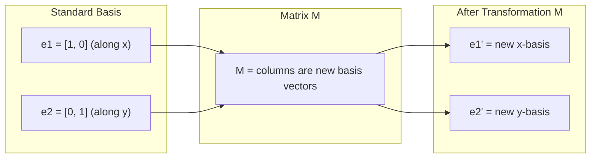
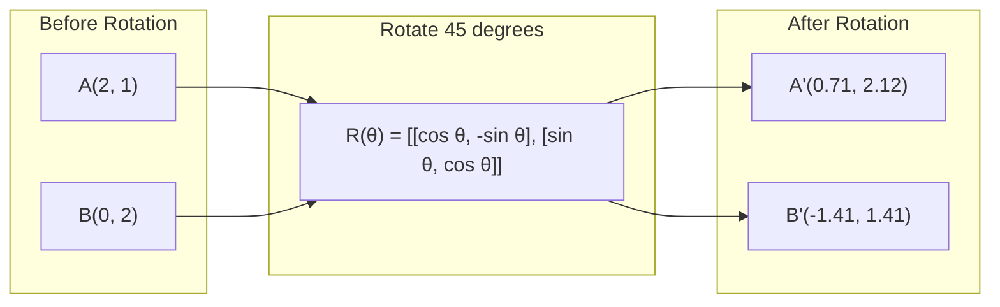
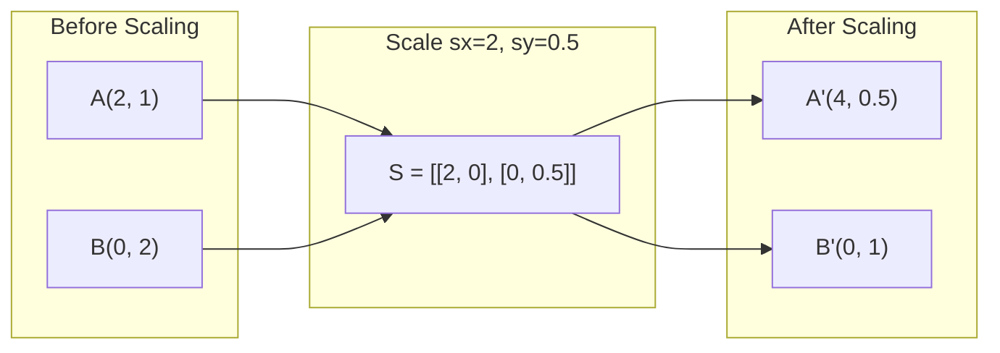
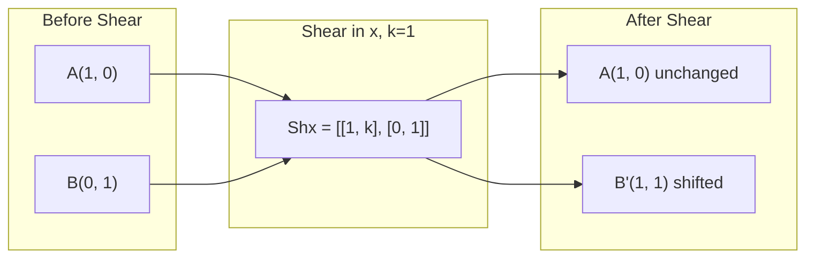
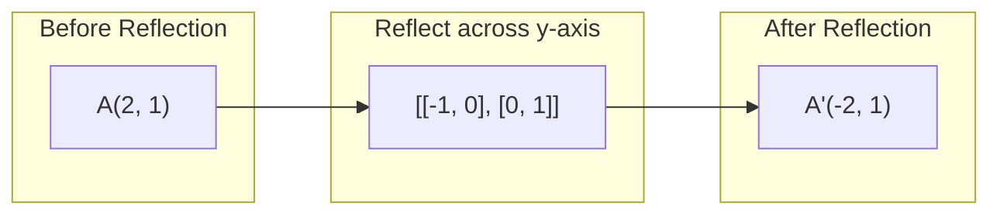
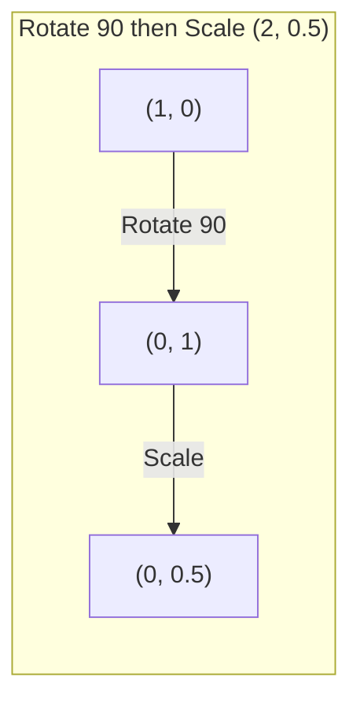
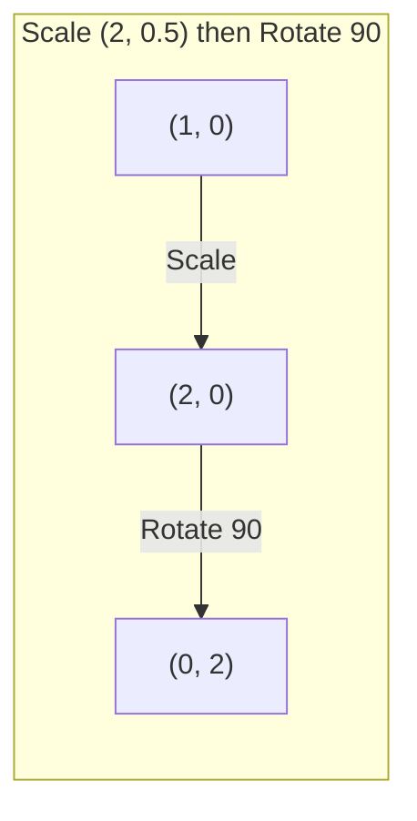

# Matris Dönüşümleri

> Matris, alanı yeniden şekillendiren bir makinedir. Her noktaya ne yaptığını öğrenin ve dönüşümün tamamını anlayın.

**Tür:** Yapım
**Diller:** Python, Julia
**Önkoşullar:** Aşama 1, Dersler 01-02 (Doğrusal Cebir Sezgisi, Vektörler ve Matris İşlemleri)
**Süre:** ~75 dakika

## Öğrenme Hedefleri

- Döndürme, ölçekleme, kesme ve yansıma matrisleri oluşturun ve bunları 2B ve 3B noktalara uygulayın
- Matris çarpımı ile birden fazla dönüşüm oluşturun ve sıranın önemli olduğunu doğrulayın
- Karakteristik denklemden 2x2 matrislerin özdeğerlerini ve özvektörlerini hesaplayın
- Özdeğerlerin neden PCA yönlerini, RNN kararlılığını ve spektral kümelenme davranışını belirlediğini açıklayın

## Sorun

PCA hakkında okudunuz ve "kovaryans matrisinin özvektörlerini bulma" konusunu gördünüz. Model kararlılığı hakkında bir şeyler okudunuz ve "tüm özdeğerlerin büyüklüğünün 1'den küçük olup olmadığını kontrol edin" konusuna bakın. Veri artırma hakkında bir şeyler okudunuz ve "rastgele rotasyon uygulayın" ifadesini gördünüz. Matrislerin uzaya geometrik olarak ne yaptığını anlayana kadar bunların hiçbiri mantıklı değil.

Matrisler yalnızca sayılardan oluşan ızgaralar değildir. Onlar uzaysal makinelerdir. Bir rotasyon matrisi noktaları döndürür. Bir ölçeklendirme matrisi onları genişletir. Bir kesme matrisi onları eğiyor. Bir neural network'nin verilere uyguladığı her dönüşüm, bu işlemlerden biri veya bunların bir bileşimidir. Bu ders bu operasyonları somut hale getiriyor.

## Konsept

### Matris olarak dönüşümler

2B'deki her doğrusal dönüşüm 2x2'lik bir matris olarak yazılabilir. Matris size [1, 0] ve [0, 1] temel vektörlerinin tam olarak nerede biteceğini söyler. Geri kalan her şey takip ediyor.



### Döndürme

Teta açısına göre 2 boyutlu döndürme, mesafeleri ve açıları olduğu gibi korur. Her noktayı dairesel bir yay boyunca hareket ettirir.



3B'de bir eksen etrafında dönersiniz. Her eksenin kendi dönüş matrisi vardır:

```
Rz(theta) = | cos  -sin  0 |     Rotate around z-axis
            | sin   cos  0 |     (x-y plane spins, z stays)
            |  0     0   1 |

Rx(theta) = | 1   0     0    |   Rotate around x-axis
            | 0  cos  -sin   |   (y-z plane spins, x stays)
            | 0  sin   cos   |

Ry(theta) = |  cos  0  sin |     Rotate around y-axis
            |   0   1   0  |     (x-z plane spins, y stays)
            | -sin  0  cos |
```

### Ölçekleme

Ölçeklendirme her eksen boyunca bağımsız olarak gerilir veya sıkıştırılır.



### Kesme

Kesme, bir ekseni yatırırken diğerini sabit tutar. Dikdörtgenleri paralelkenarlara dönüştürür.



Kayma matrisleri:
- `Shx = [[1, k], [0, 1]]` x'i k * y'ye kaydırır
- `Shy = [[1, 0], [k, 1]]` y'yi k * x kaydırır

### Yansıma

Yansıma, noktaları bir eksen veya çizgi boyunca yansıtır.



Yansıma matrisleri:
- Y ekseni boyunca yansıt: `[[-1, 0], [0, 1]]`
- X ekseni boyunca yansıtma: `[[1, 0], [0, -1]]`

### Kompozisyon: zincirleme dönüşümler

A'dan sonra B'ye dönüşüm uygulamak, matrislerini çarpmakla aynıdır: `result = B @ A @ point`. Sipariş önemlidir. Döndür sonra ölçekle, ölçeklendir sonra döndür'den farklı sonuçlar verir.



Oluşturulan: `S @ R = [[0, -2], [0.5, 0]]`



Oluşturulan: `R @ S = [[0, -0.5], [2, 0]]`

Farklı sonuçlar. Matris çarpımı değişmeli değildir.

### Özdeğerler ve özvektörler

Çoğu vektör, bir matris onlara çarptığında yön değiştirir. Özvektörler özeldir: matris onları yalnızca ölçeklendirir, asla döndürmez. Ölçeklendirme faktörü özdeğerdir.

```
A @ v = lambda * v

v is the eigenvector (direction that survives)
lambda is the eigenvalue (how much it stretches)

Example: A = | 2  1 |
             | 1  2 |

Eigenvector [1, 1] with eigenvalue 3:
  A @ [1,1] = [3, 3] = 3 * [1, 1]     (same direction, scaled by 3)

Eigenvector [1, -1] with eigenvalue 1:
  A @ [1,-1] = [1, -1] = 1 * [1, -1]  (same direction, unchanged)
```

Matris, alanı [1, 1] boyunca 3 kat uzatır ve [1, -1]'i değiştirmeden tutar. Diğer her yön bu ikisinin karışımıdır.

### Özbileşim

Bir matrisin n adet doğrusal bağımsız özvektörü varsa, ayrıştırılabilir:

```
A = V @ D @ V^(-1)

V = matrix whose columns are eigenvectors
D = diagonal matrix of eigenvalues
V^(-1) = inverse of V

This says: rotate into eigenvector coordinates, scale along each axis, rotate back.
```

### Özdeğerler neden önemlidir?

**PCA.** Kovaryans matrisinin özvektörleri temel bileşenlerdir. Özdeğerler size her bileşenin ne kadar varyans yakaladığını söyler. Özdeğere göre sıralayın, en üstteki k'yi koruyun ve boyutsal azalma elde edersiniz.

**Kararlılık.** Tekrarlayan ağlarda ve dinamik sistemlerde, büyüklüğü > 1 olan özdeğerler, çıktıların patlamasına neden olur. Büyüklük < 1 onların yok olmasına neden olur. Bu, bir cümlede ifade edilen, kaybolan/patlayan gradient problemidir.

**Spektral yöntemler.** neural network grafiği, bitişiklik matrisinin özdeğerlerini kullanır. Spektral kümeleme Laplace'ın özdeğerlerini kullanır. Özvektörler grafiğin yapısını ortaya çıkarır.

### Hacim ölçeklendirme faktörü olarak belirleyici

Bir dönüşüm matrisinin determinantı, alanı (2B) veya hacmi (3B) ne kadar ölçeklendirdiğini size söyler.

```
det = 1:   area preserved (rotation)
det = 2:   area doubled
det = 0:   space crushed to lower dimension (singular)
det = -1:  area preserved but orientation flipped (reflection)

| det(Rotation) | = 1        (always)
| det(Scale sx, sy) | = sx * sy
| det(Shear) | = 1           (area preserved)
| det(Reflection) | = -1     (orientation flipped)
```

```figure
matrix-transform
```

## Derin Matematik: Dönüşümü Baz, Spektrum ve Koşullulukla Okumak

Bir doğrusal dönüşümün geometrisini anlamanın üç tamamlayıcı yolu vardır:
sütunlar baz vektörlerinin görüntüsünü, özvektörler değişmeyen yönleri, tekil
vektörler ise en çok ve en az gerilen dik yönleri gösterir. Bu üç bakış aynı
matrisi farklı sorular için okunabilir kılar.

### Bileşimde sıra neden ters görünür?

\(x\)'e önce \(A\), sonra \(B\) uygulandığında sonuç

\[
x \xrightarrow{A} Ax \xrightarrow{B} B(Ax)=(BA)x
\]

olur. Sağdaki matris önce çalışır. Örneğin önce \(x\) ekseninde iki kat
ölçekleyip sonra 90 derece döndürmek ile önce döndürüp sonra dünya koordinatının
\(x\) ekseninde ölçeklemek aynı değildir. Genel olarak \(BA\neq AB\). Neural
network katmanlarının sırası da bu nedenle değiştirilemez.

### Özdeğer denklemini ezberlemeden türetin

Bir yön dönüşüm altında değişmiyor, yalnızca \(\lambda\) kadar ölçekleniyorsa

\[
Av=\lambda v.
\]

Tüm terimleri bir tarafa taşıyalım:

\[
(A-\lambda I)v=0.
\]

Sıfırdan farklı bir \(v\) çözümünün bulunabilmesi için \(A-\lambda I\)'nin
terslenemez olması gerekir. Dolayısıyla

\[
\det(A-\lambda I)=0.
\]

\(A=\begin{bmatrix}2&1\\1&2\end{bmatrix}\) için bu denklem
\((2-\lambda)^2-1=0\) olur; kökler \(3\) ve \(1\)'dir. Karşılık gelen yönler
\((1,1)\) ve \((1,-1)\)'dir. Dönüşüm ilk yönü üç kat büyütür, ikinci yönü
korur. Sayısal sonuç artık geometrik bir cümleye dönüşmüştür.

### Her matris özvektörlerle güvenle açıklanamaz

Özayrışım yalnızca yeterli sayıda doğrusal bağımsız özvektör varsa
\(A=V\Lambda V^{-1}\) biçimindedir. Simetrik gerçek matrislerde bu yapı çok
güzeldir: özvektörler ortonormal seçilebilir ve \(A=Q\Lambda Q^\top\) olur.
Fakat genel matrislerde karmaşık özdeğerler, eksik özvektörler veya kötü
koşullanmış \(V\) görülebilir.

SVD bu noktada daha genel bir araçtır:

\[
A=U\Sigma V^\top.
\]

Bu eşitlik her gerçek matris için vardır. \(V^\top\) girdiyi dik bir baza
döndürür, \(\Sigma\) eksenleri tekil değerlerle ölçekler, \(U\) sonucu çıktı
uzayına döndürür. En küçük tekil değer sıfıra yakınsa dönüşüm bir yöndeki
bilgiyi neredeyse ezer. Koşul sayısı
\(\kappa_2(A)=\sigma_{\max}/\sigma_{\min}\), sayısal hassasiyetin doğrudan
ölçüsüdür.

### Yapay zekâda neden önemlidir?

- Attention katmanındaki \(W_Q,W_K,W_V\) matrisleri temsili farklı alt uzaylara
  taşır; çarpım sırası hangi uzayda benzerlik ölçüldüğünü belirler.
- Bir recurrent dönüşüm tekrar tekrar uygulanırsa \(|\lambda|>1\) yönleri
  büyür, \(|\lambda|<1\) yönleri söner. Bu, patlayan ve kaybolan gradyanların
  spektral açıklamasıdır.
- PCA, kovaryans matrisinin en büyük özdeğerli yönlerini seçer; düşük rank
  yaklaşımı ise SVD'nin en büyük tekil değerlerini korur.

### Anlama kontrolü

1. \(R\) bir döndürme, \(S\) yatay ölçekleme matrisi olsun. Bir kare üzerinde
   \(RS\) ve \(SR\)'yi çizerek farkı açıklayın.
2. Bir matrisin determinantı 1 iken koşul sayısı neden yine çok büyük olabilir?
   \(\operatorname{diag}(1000,0.001)\) üzerinden düşünün.
3. Özdeğer ile tekil değer arasındaki farkı “değişmeyen yön” ve “en fazla
   gerilen yön” ifadeleriyle kendi cümlelerinizle yazın.

## İnşa Et

### Adım 1: Matrisleri sıfırdan dönüştürme (Python)

```python
import math

def rotation_2d(theta):
    c, s = math.cos(theta), math.sin(theta)
    return [[c, -s], [s, c]]

def scaling_2d(sx, sy):
    return [[sx, 0], [0, sy]]

def shearing_2d(kx, ky):
    return [[1, kx], [ky, 1]]

def reflection_x():
    return [[1, 0], [0, -1]]

def reflection_y():
    return [[-1, 0], [0, 1]]

def mat_vec_mul(matrix, vector):
    return [
        sum(matrix[i][j] * vector[j] for j in range(len(vector)))
        for i in range(len(matrix))
    ]

def mat_mul(a, b):
    rows_a, cols_b = len(a), len(b[0])
    cols_a = len(a[0])
    return [
        [sum(a[i][k] * b[k][j] for k in range(cols_a)) for j in range(cols_b)]
        for i in range(rows_a)
    ]

point = [1.0, 0.0]
angle = math.pi / 4

rotated = mat_vec_mul(rotation_2d(angle), point)
print(f"Rotate (1,0) by 45 deg: ({rotated[0]:.4f}, {rotated[1]:.4f})")

scaled = mat_vec_mul(scaling_2d(2, 3), [1.0, 1.0])
print(f"Scale (1,1) by (2,3): ({scaled[0]:.1f}, {scaled[1]:.1f})")

sheared = mat_vec_mul(shearing_2d(1, 0), [1.0, 1.0])
print(f"Shear (1,1) kx=1: ({sheared[0]:.1f}, {sheared[1]:.1f})")

reflected = mat_vec_mul(reflection_y(), [2.0, 1.0])
print(f"Reflect (2,1) across y: ({reflected[0]:.1f}, {reflected[1]:.1f})")
```

### Adım 2: Dönüşümlerin bileşimi

```python
R = rotation_2d(math.pi / 2)
S = scaling_2d(2, 0.5)

rotate_then_scale = mat_mul(S, R)
scale_then_rotate = mat_mul(R, S)

point = [1.0, 0.0]
result1 = mat_vec_mul(rotate_then_scale, point)
result2 = mat_vec_mul(scale_then_rotate, point)

print(f"Rotate 90 then scale: ({result1[0]:.2f}, {result1[1]:.2f})")
print(f"Scale then rotate 90: ({result2[0]:.2f}, {result2[1]:.2f})")
print(f"Same? {result1 == result2}")
```

### Adım 3: Sıfırdan özdeğerler (2x2)

2x2'lik bir `[[a, b], [c, d]]` matrisi için özdeğerler karakteristik denklemi çözer: `lambda^2 - (a+d)*lambda + (ad - bc) = 0`.

```python
def eigenvalues_2x2(matrix):
    a, b = matrix[0]
    c, d = matrix[1]
    trace = a + d
    det = a * d - b * c
    discriminant = trace ** 2 - 4 * det
    if discriminant < 0:
        real = trace / 2
        imag = (-discriminant) ** 0.5 / 2
        return (complex(real, imag), complex(real, -imag))
    sqrt_disc = discriminant ** 0.5
    return ((trace + sqrt_disc) / 2, (trace - sqrt_disc) / 2)

def eigenvector_2x2(matrix, eigenvalue):
    a, b = matrix[0]
    c, d = matrix[1]
    if abs(b) > 1e-10:
        v = [b, eigenvalue - a]
    elif abs(c) > 1e-10:
        v = [eigenvalue - d, c]
    else:
        if abs(a - eigenvalue) < 1e-10:
            v = [1, 0]
        else:
            v = [0, 1]
    mag = (v[0] ** 2 + v[1] ** 2) ** 0.5
    return [v[0] / mag, v[1] / mag]

A = [[2, 1], [1, 2]]
vals = eigenvalues_2x2(A)
print(f"Matrix: {A}")
print(f"Eigenvalues: {vals[0]:.4f}, {vals[1]:.4f}")

for val in vals:
    vec = eigenvector_2x2(A, val)
    result = mat_vec_mul(A, vec)
    scaled = [val * vec[0], val * vec[1]]
    print(f"  lambda={val:.1f}, v={[round(x,4) for x in vec]}")
    print(f"    A@v = {[round(x,4) for x in result]}")
    print(f"    l*v = {[round(x,4) for x in scaled]}")
```

### Adım 4: Hacim ölçeklendirme faktörü olarak belirleyici

```python
def det_2x2(matrix):
    return matrix[0][0] * matrix[1][1] - matrix[0][1] * matrix[1][0]

print(f"det(rotation 45) = {det_2x2(rotation_2d(math.pi/4)):.4f}")
print(f"det(scale 2,3)   = {det_2x2(scaling_2d(2, 3)):.1f}")
print(f"det(shear kx=1)  = {det_2x2(shearing_2d(1, 0)):.1f}")
print(f"det(reflect y)   = {det_2x2(reflection_y()):.1f}")

singular = [[1, 2], [2, 4]]
print(f"det(singular)     = {det_2x2(singular):.1f}")
print("Singular: columns are proportional, space collapses to a line.")
```

## Kullan onu

NumPy tüm bunları optimize edilmiş rutinlerle halleder.

```python
import numpy as np

theta = np.pi / 4
R = np.array([[np.cos(theta), -np.sin(theta)],
              [np.sin(theta),  np.cos(theta)]])

point = np.array([1.0, 0.0])
print(f"Rotate (1,0) by 45 deg: {R @ point}")

S = np.diag([2.0, 3.0])
composed = S @ R
print(f"Scale(2,3) after Rotate(45): {composed @ point}")

A = np.array([[2, 1], [1, 2]], dtype=float)
eigenvalues, eigenvectors = np.linalg.eig(A)
print(f"\nEigenvalues: {eigenvalues}")
print(f"Eigenvectors (columns):\n{eigenvectors}")

for i in range(len(eigenvalues)):
    v = eigenvectors[:, i]
    lam = eigenvalues[i]
    print(f"  A @ v{i} = {A @ v}, lambda * v{i} = {lam * v}")

print(f"\ndet(R) = {np.linalg.det(R):.4f}")
print(f"det(S) = {np.linalg.det(S):.1f}")

B = np.array([[3, 1], [0, 2]], dtype=float)
vals, vecs = np.linalg.eig(B)
D = np.diag(vals)
V = vecs
reconstructed = V @ D @ np.linalg.inv(V)
print(f"\nEigendecomposition A = V @ D @ V^-1:")
print(f"Original:\n{B}")
print(f"Reconstructed:\n{reconstructed}")
```

### NumPy ile 3D döndürmeler

```python
def rotation_3d_z(theta):
    c, s = np.cos(theta), np.sin(theta)
    return np.array([[c, -s, 0], [s, c, 0], [0, 0, 1]])

def rotation_3d_x(theta):
    c, s = np.cos(theta), np.sin(theta)
    return np.array([[1, 0, 0], [0, c, -s], [0, s, c]])

point_3d = np.array([1.0, 0.0, 0.0])
rotated_z = rotation_3d_z(np.pi / 2) @ point_3d
rotated_x = rotation_3d_x(np.pi / 2) @ point_3d

print(f"\n3D point: {point_3d}")
print(f"Rotate 90 around z: {np.round(rotated_z, 4)}")
print(f"Rotate 90 around x: {np.round(rotated_x, 4)}")
```

## Gönderin

Bu ders PCA (Aşama 2) ve neural network ağırlık analizi için geometrik temeli oluşturur. Burada oluşturulan özdeğer/özvektör kodu, üretim ML sistemlerinde boyutsallık azaltma, spektral kümeleme ve kararlılık analizine güç veren algoritmanın aynısıdır.

## Egzersizler

1. Birim kareye döndürme, ölçekleme ve kesme uygulayın (köşeler [0,0], [1,0], [1,1], [0,1]'de). Her biri için dönüştürülmüş köşeleri yazdırın. Döndürmenin köşeler arasındaki mesafeleri koruduğunu doğrulayın.

2. Karakteristik denklemi kullanarak [[4, 2], [1, 3]] matrisinin özdeğerlerini elle bulun. Daha sonra sıfırdan işleviniz ve NumPy ile doğrulayın.

3. Üç dönüşümden oluşan bir kompozisyon oluşturun (30 derece döndürün, [1,5, 0,8] ölçeklendirin, kx=0,3 ile kesin) ve bunu daire şeklinde düzenlenmiş 8 noktaya uygulayın. Koordinatlardan önce ve sonra yazdırın. Oluşturulan matrisin determinantını hesaplayın ve bireysel determinantların çarpımına eşit olduğunu doğrulayın.

## Anahtar Terimler

| Dönem | İnsanlar ne diyor | Aslında ne anlama geliyor |
|------|----------------|----------------------|
| Döndürme matrisi | "Bir şeyleri döndürür" | Mesafeleri ve açıları korurken noktaları dairesel yaylar boyunca hareket ettiren dik bir matris. Determinant her zaman 1'dir. |
| Ölçeklendirme matrisi | "İşleri büyütür" | Her eksen boyunca bağımsız olarak uzanan veya sıkışan çapraz bir matris. Determinant ölçek faktörlerinin ürünüdür. |
| Kesme matrisi | "Şeyleri eğik" | Bir koordinatı diğerine orantılı olarak kaydırarak dikdörtgenleri paralelkenarlara dönüştüren bir matris. Determinant 1'dir. |
| Yansıma | "Şeyleri yansıtır" | Uzayı bir eksen veya düzlem boyunca çeviren bir matris. Determinant -1'dir. |
| Kompozisyon | "İki şey yapın" | Dönüşüm matrislerinin zincir işlemleriyle çarpılması. Sıra önemlidir: B @ A, önce A'yı, sonra B'yi uygulayacağınız anlamına gelir. |
| Özvektör | "Özel yön" | Matrisin yalnızca ölçeklendirdiği, asla dönmediği bir yön. Dönüşümün parmak izi. |
| Özdeğer | "Ne kadar uzuyor" | Matrisin özvektörünü ölçeklendirdiği skaler faktör. Negatif (çevirme) veya karmaşık (döndürme) olabilir. |
| Özbileşim | "Matrisi parçalayın" | Bir matrisi V @ D @ V^(-1) olarak yazmak ve onu temel ölçeklendirme yönlerine ve büyüklüklerine ayırmak. |
| Belirleyici | "Bir matristen tek bir sayı" | Dönüşümün alanı (2B) veya hacmi (3B) ölçeklendirdiği faktör. Sıfır, dönüşümün geri döndürülemez olduğu anlamına gelir. |
| Karakteristik denklem | "Özdeğerlerin nereden geldiği" | det(A - lambda * I) = 0. Kökleri özdeğer olan polinom. |

## Daha Fazla Okuma

- [3Blue1Brown: Doğrusal Dönüşümler](https://www.3blue1brown.com/lessons/linear-transformations) -- matrislerin uzayı nasıl yeniden şekillendirdiğine dair görsel sezgi
- [3Blue1Brown: Özvektörler ve Özdeğerler](https://www.3blue1brown.com/lessons/eigenvalues) -- özvektörlerin geometrik olarak ne anlama geldiğinin en iyi görsel açıklaması
- [MIT 18.06 Ders 21: Özdeğerler ve Özvektörler](https://ocw.mit.edu/courses/18-06-linear-algebra-spring-2010/) -- Gilbert Strang'ın klasik yaklaşımı
