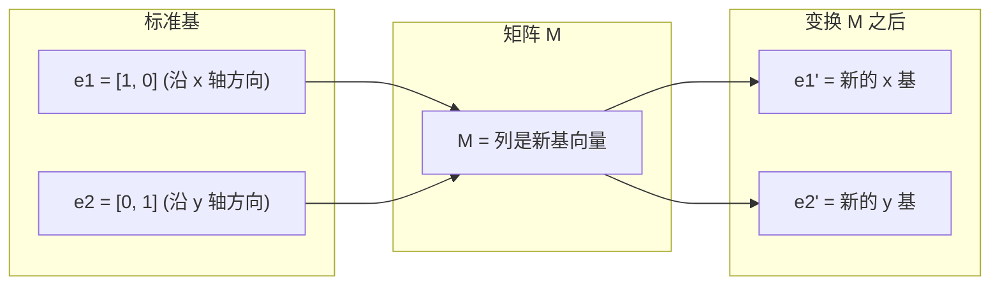
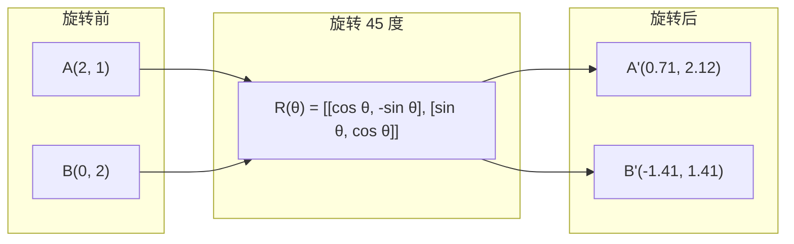
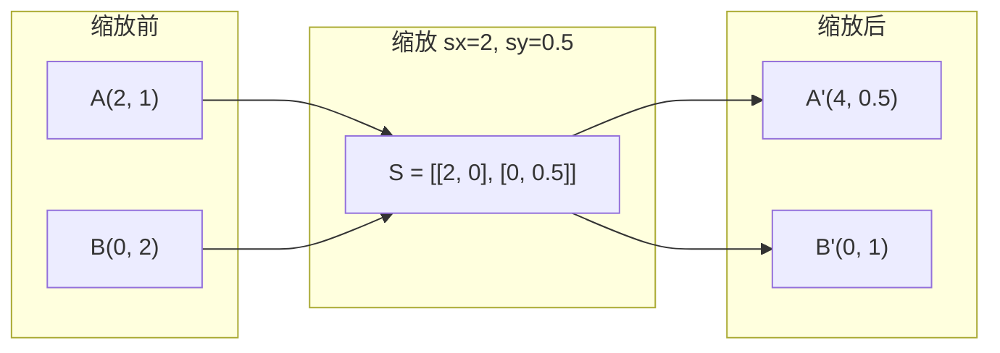
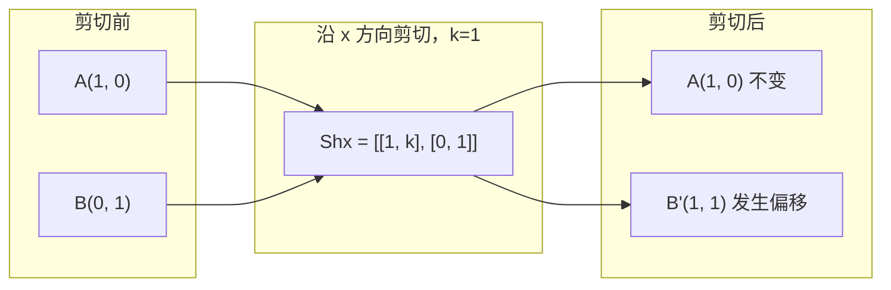
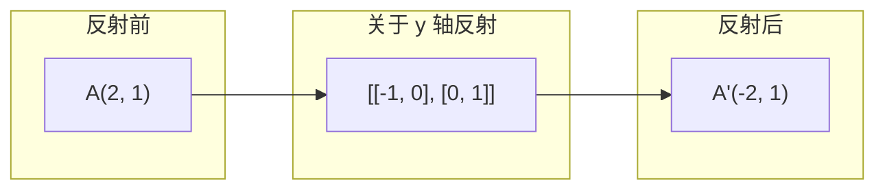
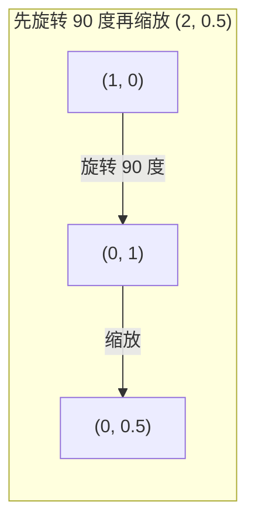
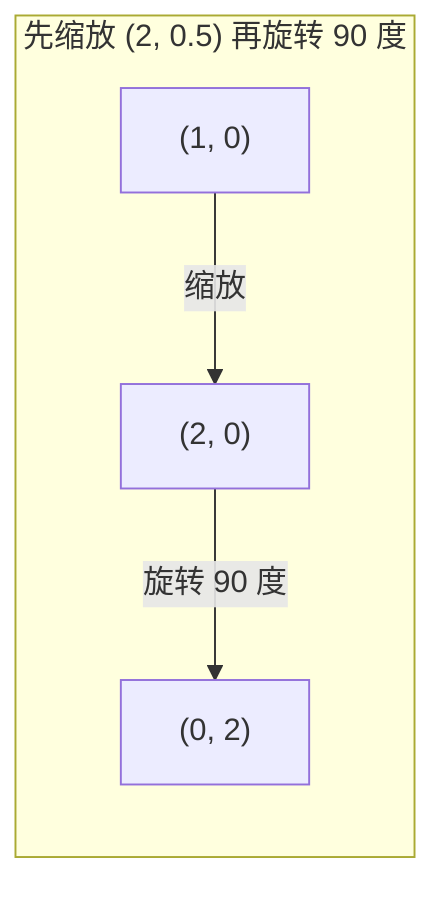

# 矩阵变换（Matrix Transformations）

> 矩阵是一台重塑空间的机器。理解它对每个点做了什么，你就理解了整个变换。

**类型：** 构建  
**语言：** Python, Julia  
**前置条件：** 阶段 1，第 01-02 课（线性代数直觉、向量与矩阵运算）  
**时间：** 约 75 分钟

## 学习目标（Learning Objectives）

- 构造旋转、缩放、剪切和反射矩阵，并将其应用于二维和三维点
- 通过矩阵乘法组合多个变换，并验证顺序的重要性
- 从特征方程计算 2x2 矩阵的特征值和特征向量
- 解释为什么特征值决定了 PCA 方向、RNN 稳定性和谱聚类行为

## 问题（The Problem）

你读到 PCA 时看到“求协方差矩阵的特征向量”。你读到模型稳定性时看到“检查所有特征值是否都小于 1”。你读到数据增强时看到“应用一个随机旋转”。除非你理解矩阵对空间的几何作用，否则这些都没有意义。

矩阵不仅仅是数字的网格。它们是空间机器。旋转矩阵旋转点。缩放矩阵拉伸它们。剪切矩阵倾斜它们。神经网络对数据应用的每一个变换都是这些操作之一或它们的组合。这节课将这些操作具体化。

## 概念（The Concept）

### 变换作为矩阵（Transformations as matrices）

二维中的每个线性变换都可以写成一个 2x2 矩阵。这个矩阵确切地告诉你基向量 [1,0] 和 [0,1] 最终落在哪里。其他一切由此推导。



### 旋转（Rotation）

角度为 θ 的二维旋转保持距离和角度不变。它将每个点沿着一段圆弧移动。



在三维中，你围绕一个轴旋转。每个轴都有其自己的旋转矩阵：

```
Rz(theta) = | cos  -sin  0 |     围绕 z 轴旋转
            | sin   cos  0 |     (x-y 平面旋转，z 不变)
            |  0     0   1 |

Rx(theta) = | 1   0     0    |   围绕 x 轴旋转
            | 0  cos  -sin   |    (y-z 平面旋转，x 不变)
            | 0  sin   cos   |

Ry(theta) = |  cos  0  sin |     围绕 y 轴旋转
            |   0   1   0  |     (x-z 平面旋转，y 不变)
            | -sin  0  cos |
```

### 缩放（Scaling）

缩放沿每个轴独立拉伸或压缩。



### 剪切（Shearing）

剪切倾斜一个轴，同时保持另一个轴固定。它将矩形变成平行四边形。



剪切矩阵：
- `Shx = [[1, k], [0, 1]]` 将 x 按 k*y 偏移
- `Shy = [[1, 0], [k, 1]]` 将 y 按 k*x 偏移

### 反射（Reflection）

反射将点关于一个轴或直线镜像。



反射矩阵：
- 关于 y 轴反射：`[[-1, 0], [0, 1]]`
- 关于 x 轴反射：`[[1, 0], [0, -1]]`

### 组合：链式变换（Composition: chaining transformations）

先应用变换 A 再应用 B，等同于将它们的矩阵相乘：`result = B @ A @ point`。顺序很重要。先旋转后缩放与先缩放后旋转结果不同。



组合后：`S @ R = [[0, -2], [0.5, 0]]`



组合后：`R @ S = [[0, -0.5], [2, 0]]`

结果不同。矩阵乘法不可交换。

### 特征值和特征向量（Eigenvalues and eigenvectors）

大多数向量在被矩阵作用时会改变方向。特征向量是特殊的：矩阵只对它们进行缩放，从不旋转。缩放因子就是特征值。

```
A @ v = lambda * v

v 是特征向量（存活下来的方向）
lambda 是特征值（拉伸的倍数）

例子：A = | 2  1 |
         | 1  2 |

特征向量 [1, 1] 对应特征值 3：
  A @ [1,1] = [3, 3] = 3 * [1, 1]     （方向不变，被缩放 3 倍）

特征向量 [1, -1] 对应特征值 1：
  A @ [1,-1] = [1, -1] = 1 * [1, -1]  （方向不变，大小不变）
```

矩阵将空间沿 [1,1] 方向拉伸 3 倍，并保持 [1,-1] 方向不变。每个其他方向都是这两个方向的混合。

### 特征分解（Eigendecomposition）

如果矩阵有 n 个线性无关的特征向量，它可以被分解：

```
A = V @ D @ V^(-1)

V = 列向量为特征向量的矩阵
D = 特征值构成的对角矩阵
V^(-1) = V 的逆矩阵

这意味着：旋转到特征向量坐标系，沿每个轴缩放，再旋转回来。
```

### 特征值为何重要（Why eigenvalues matter）

**PCA（主成分分析）。** 协方差矩阵的特征向量就是主成分。特征值告诉你每个成分捕获了多少方差。按特征值排序，保留前 k 个，就实现了降维。

**稳定性。** 在循环网络和动力系统中，模大于 1 的特征值会导致输出爆炸。模小于 1 则导致消失。这就是一句话描述的梯度消失/爆炸问题。

**谱方法。** 图神经网络使用邻接矩阵的特征值。谱聚类使用拉普拉斯矩阵的特征值。特征向量揭示了图的结构。

### 行列式作为体积缩放因子（Determinant as volume scaling factor）

变换矩阵的行列式告诉你它缩放面积（二维）或体积（三维）的程度。

```
det = 1:   面积保持不变（旋转）
det = 2:   面积翻倍
det = 0:   空间被压缩到更低维度（奇异）
det = -1:  面积不变但方向反转（反射）

| det(旋转) | = 1        （始终）
| det(缩放 sx, sy) | = sx * sy
| det(剪切) | = 1           （面积不变）
| det(反射) | = -1          （方向反转）
```

## 动手构建（Build It）

### 第 1 步：从头实现变换矩阵（Python）

```python
import math

def rotation_2d(theta):
    c, s = math.cos(theta), math.sin(theta)
    return [[c, -s], [s, c]]

def scaling_2d(sx, sy):
    return [[sx, 0], [0, sy]]

def shearing_2d(kx, ky):
    return [[1, kx], [ky, 1]]

def reflection_x():
    return [[1, 0], [0, -1]]

def reflection_y():
    return [[-1, 0], [0, 1]]

def mat_vec_mul(matrix, vector):
    return [
        sum(matrix[i][j] * vector[j] for j in range(len(vector)))
        for i in range(len(matrix))
    ]

def mat_mul(a, b):
    rows_a, cols_b = len(a), len(b[0])
    cols_a = len(a[0])
    return [
        [sum(a[i][k] * b[k][j] for k in range(cols_a)) for j in range(cols_b)]
        for i in range(rows_a)
    ]

point = [1.0, 0.0]
angle = math.pi / 4

rotated = mat_vec_mul(rotation_2d(angle), point)
print(f"将 (1,0) 旋转 45 度: ({rotated[0]:.4f}, {rotated[1]:.4f})")

scaled = mat_vec_mul(scaling_2d(2, 3), [1.0, 1.0])
print(f"将 (1,1) 缩放 (2,3): ({scaled[0]:.1f}, {scaled[1]:.1f})")

sheared = mat_vec_mul(shearing_2d(1, 0), [1.0, 1.0])
print(f"将 (1,1) 剪切 kx=1: ({sheared[0]:.1f}, {sheared[1]:.1f})")

reflected = mat_vec_mul(reflection_y(), [2.0, 1.0])
print(f"将 (2,1) 关于 y 轴反射: ({reflected[0]:.1f}, {reflected[1]:.1f})")
```

### 第 2 步：变换的组合（Composition of transformations）

```python
R = rotation_2d(math.pi / 2)
S = scaling_2d(2, 0.5)

rotate_then_scale = mat_mul(S, R)
scale_then_rotate = mat_mul(R, S)

point = [1.0, 0.0]
result1 = mat_vec_mul(rotate_then_scale, point)
result2 = mat_vec_mul(scale_then_rotate, point)

print(f"先旋转 90 度再缩放: ({result1[0]:.2f}, {result1[1]:.2f})")
print(f"先缩放再旋转 90 度: ({result2[0]:.2f}, {result2[1]:.2f})")
print(f"结果相同? {result1 == result2}")
```

### 第 3 步：从头计算特征值（2x2 矩阵）

对于一个 2x2 矩阵 `[[a, b], [c, d]]`，特征值求解特征方程：`lambda^2 - (a+d)*lambda + (ad - bc) = 0`。

```python
def eigenvalues_2x2(matrix):
    a, b = matrix[0]
    c, d = matrix[1]
    trace = a + d
    det = a * d - b * c
    discriminant = trace ** 2 - 4 * det
    if discriminant < 0:
        real = trace / 2
        imag = (-discriminant) ** 0.5 / 2
        return (complex(real, imag), complex(real, -imag))
    sqrt_disc = discriminant ** 0.5
    return ((trace + sqrt_disc) / 2, (trace - sqrt_disc) / 2)

def eigenvector_2x2(matrix, eigenvalue):
    a, b = matrix[0]
    c, d = matrix[1]
    if abs(b) > 1e-10:
        v = [b, eigenvalue - a]
    elif abs(c) > 1e-10:
        v = [eigenvalue - d, c]
    else:
        if abs(a - eigenvalue) < 1e-10:
            v = [1, 0]
        else:
            v = [0, 1]
    mag = (v[0] ** 2 + v[1] ** 2) ** 0.5
    return [v[0] / mag, v[1] / mag]

A = [[2, 1], [1, 2]]
vals = eigenvalues_2x2(A)
print(f"矩阵: {A}")
print(f"特征值: {vals[0]:.4f}, {vals[1]:.4f}")

for val in vals:
    vec = eigenvector_2x2(A, val)
    result = mat_vec_mul(A, vec)
    scaled = [val * vec[0], val * vec[1]]
    print(f"  lambda={val:.1f}, v={[round(x,4) for x in vec]}")
    print(f"    A@v = {[round(x,4) for x in result]}")
    print(f"    l*v = {[round(x,4) for x in scaled]}")
```

### 第 4 步：行列式作为体积缩放因子

```python
def det_2x2(matrix):
    return matrix[0][0] * matrix[1][1] - matrix[0][1] * matrix[1][0]

print(f"det(旋转 45 度) = {det_2x2(rotation_2d(math.pi/4)):.4f}")
print(f"det(缩放 2,3)   = {det_2x2(scaling_2d(2, 3)):.1f}")
print(f"det(剪切 kx=1)  = {det