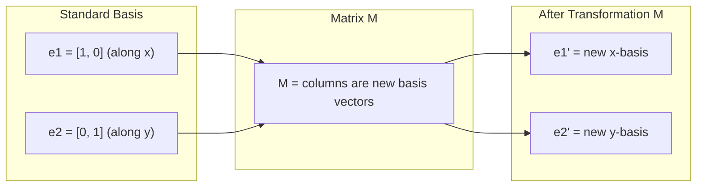
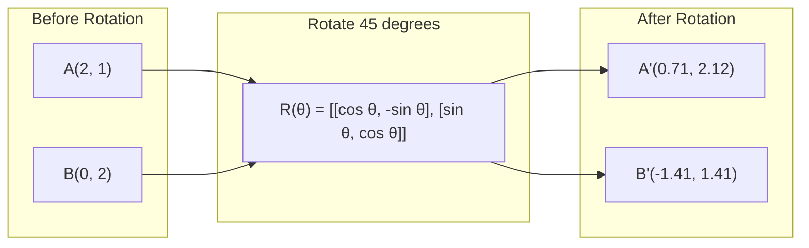
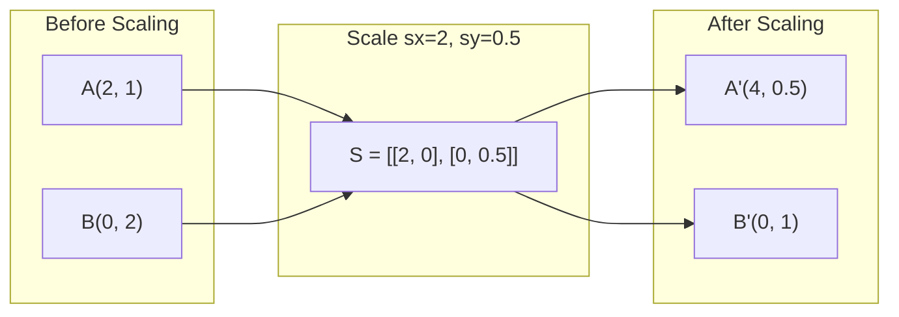
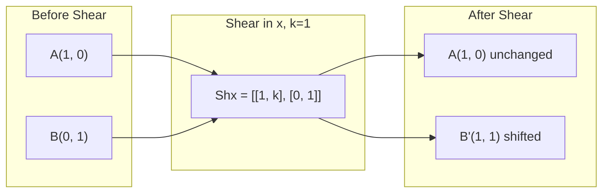
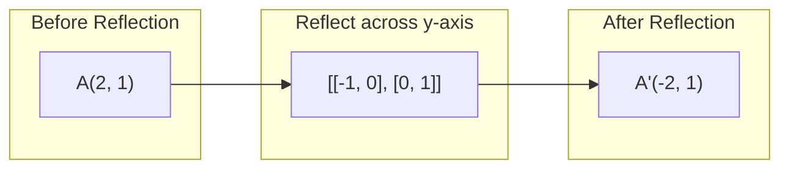
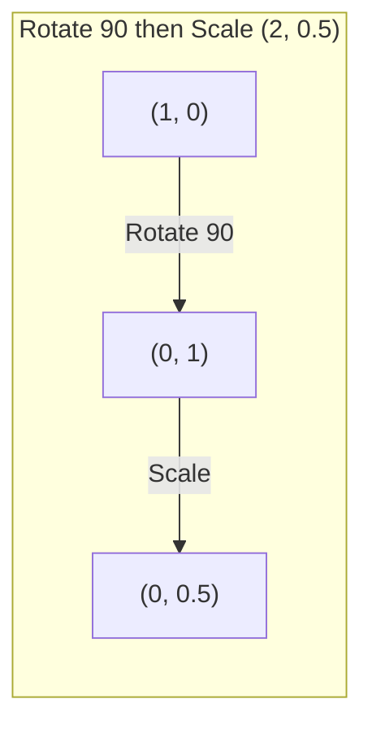
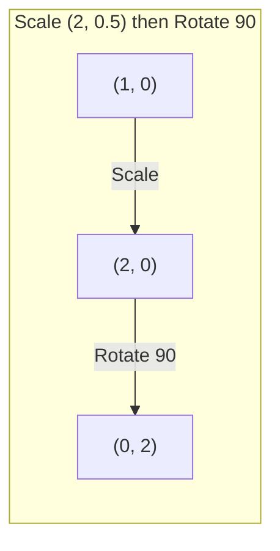

# 矩陣轉換

> 矩陣是一台重塑空間的機器。搞懂它對每個點做了什麼，你就懂了整個轉換。

**類型：** 實作
**程式語言：** Python, Julia
**先修單元：** 階段 1 · 單元 01-02（線性代數直覺、向量與矩陣運算）
**時間：** 約 75 分鐘

## 學習目標

- 建構旋轉、縮放、剪切與鏡射矩陣，並把它們作用在 2D 與 3D 的點上
- 用矩陣乘法組合多個轉換，並驗證順序會影響結果
- 從特徵方程式算出 2x2 矩陣的特徵值與特徵向量
- 說明為什麼特徵值決定了 PCA 的方向、RNN 的穩定性，以及譜分群的行為

## 問題所在

你讀 PCA，看到「求共變異數矩陣的特徵向量」。你讀模型穩定性，看到「檢查是否所有特徵值的大小都小於 1」。你讀資料增強，看到「施加一個隨機旋轉」。在你從幾何上理解矩陣對空間做了什麼之前，這些話都講不通。

矩陣不只是一格一格的數字，它們是操作空間的機器。旋轉矩陣讓點繞著轉，縮放矩陣把點拉伸，剪切矩陣把點推歪。神經網路施加在資料上的每一個轉換，都是這些操作之一，或是它們的組合。這一課要把這些操作變得具體。

## 核心概念

### 轉換就是矩陣

2D 中的每一個線性轉換都能寫成一個 2x2 矩陣。這個矩陣正好告訴你基底向量 [1, 0] 與 [0, 1] 最後落在哪裡，其餘一切都由此推得。


```mermaid
graph LR
    subgraph Before["Standard Basis"]
        e1["e1 = [1, 0] (along x)"]
        e2["e2 = [0, 1] (along y)"]
    end
    subgraph Transform["Matrix M"]
        M["M = columns are new basis vectors"]
    end
    subgraph After["After Transformation M"]
        e1p["e1' = new x-basis"]
        e2p["e2' = new y-basis"]
    end
    e1 --> M --> e1p
    e2 --> M --> e2p
```

### 旋轉

2D 中旋轉角度 theta 會保持距離與夾角不變，它讓每個點沿著圓弧移動。


```mermaid
graph LR
    subgraph Before["Before Rotation"]
        A["A(2, 1)"]
        B["B(0, 2)"]
    end
    subgraph Rot["Rotate 45 degrees"]
        R["R(θ) = [[cos θ, -sin θ], [sin θ, cos θ]]"]
    end
    subgraph After["After Rotation"]
        Ap["A'(0.71, 2.12)"]
        Bp["B'(-1.41, 1.41)"]
    end
    A --> R --> Ap
    B --> R --> Bp
```

在 3D 中，你是繞著某個軸旋轉。每個軸都有自己的旋轉矩陣：

```
Rz(theta) = | cos  -sin  0 |     Rotate around z-axis
            | sin   cos  0 |     (x-y plane spins, z stays)
            |  0     0   1 |

Rx(theta) = | 1   0     0    |   Rotate around x-axis
            | 0  cos  -sin   |   (y-z plane spins, x stays)
            | 0  sin   cos   |

Ry(theta) = |  cos  0  sin |     Rotate around y-axis
            |   0   1   0  |     (x-z plane spins, y stays)
            | -sin  0  cos |
```

### 縮放

縮放沿著每個軸獨立地拉伸或壓縮。


```mermaid
graph LR
    subgraph Before["Before Scaling"]
        A["A(2, 1)"]
        B["B(0, 2)"]
    end
    subgraph Scale["Scale sx=2, sy=0.5"]
        S["S = [[2, 0], [0, 0.5]]"]
    end
    subgraph After["After Scaling"]
        Ap["A'(4, 0.5)"]
        Bp["B'(0, 1)"]
    end
    A --> S --> Ap
    B --> S --> Bp
```

### 剪切

剪切把一個軸推歪，另一個軸維持不動。它把矩形變成平行四邊形。


```mermaid
graph LR
    subgraph Before["Before Shear"]
        A["A(1, 0)"]
        B["B(0, 1)"]
    end
    subgraph Shear["Shear in x, k=1"]
        Sh["Shx = [[1, k], [0, 1]]"]
    end
    subgraph After["After Shear"]
        Ap["A(1, 0) unchanged"]
        Bp["B'(1, 1) shifted"]
    end
    A --> Sh --> Ap
    B --> Sh --> Bp
```

剪切矩陣：
- `Shx = [[1, k], [0, 1]]` 把 x 平移 k * y
- `Shy = [[1, 0], [k, 1]]` 把 y 平移 k * x

### 鏡射

鏡射讓點對某個軸或某條線做鏡像。


```mermaid
graph LR
    subgraph Before["Before Reflection"]
        A["A(2, 1)"]
    end
    subgraph Reflect["Reflect across y-axis"]
        R["[[-1, 0], [0, 1]]"]
    end
    subgraph After["After Reflection"]
        Ap["A'(-2, 1)"]
    end
    A --> R --> Ap
```

鏡射矩陣：
- 對 y 軸鏡射：`[[-1, 0], [0, 1]]`
- 對 x 軸鏡射：`[[1, 0], [0, -1]]`

### 組合：把轉換串起來

先施加轉換 A、再施加 B，等同於把它們的矩陣相乘：`result = B @ A @ point`。順序會影響結果。先旋轉再縮放，跟先縮放再旋轉，結果不一樣。


```mermaid
graph LR
    subgraph Path1["Rotate 90 then Scale (2, 0.5)"]
        P1["(1, 0)"] -->|"Rotate 90"| P2["(0, 1)"] -->|"Scale"| P3["(0, 0.5)"]
    end
```

組合後：`S @ R = [[0, -2], [0.5, 0]]`


```mermaid
graph LR
    subgraph Path2["Scale (2, 0.5) then Rotate 90"]
        Q1["(1, 0)"] -->|"Scale"| Q2["(2, 0)"] -->|"Rotate 90"| Q3["(0, 2)"]
    end
```

組合後：`R @ S = [[0, -0.5], [2, 0]]`

結果不同。矩陣乘法不具交換律。

### 特徵值與特徵向量

大多數向量被矩陣作用後都會改變方向。特徵向量很特別：矩陣只會縮放它們，絕不旋轉它們。那個縮放倍率就是特徵值。

```
A @ v = lambda * v

v is the eigenvector (direction that survives)
lambda is the eigenvalue (how much it stretches)

Example: A = | 2  1 |
             | 1  2 |

Eigenvector [1, 1] with eigenvalue 3:
  A @ [1,1] = [3, 3] = 3 * [1, 1]     (same direction, scaled by 3)

Eigenvector [1, -1] with eigenvalue 1:
  A @ [1,-1] = [1, -1] = 1 * [1, -1]  (same direction, unchanged)
```

這個矩陣沿著 [1, 1] 把空間拉伸 3 倍，並讓 [1, -1] 保持原樣。其他每一個方向，都是這兩者的混合。

### 特徵分解

如果一個矩陣有 n 個線性獨立的特徵向量，它就能被分解：

```
A = V @ D @ V^(-1)

V = matrix whose columns are eigenvectors
D = diagonal matrix of eigenvalues
V^(-1) = inverse of V

This says: rotate into eigenvector coordinates, scale along each axis, rotate back.
```

### 為什麼特徵值重要

**PCA。** 共變異數矩陣的特徵向量就是主成分。特徵值告訴你每個成分捕捉了多少變異量。依特徵值排序、保留前 k 個，你就完成了降維。

**穩定性。** 在遞迴網路與動態系統中，大小 > 1 的特徵值會讓輸出爆炸，大小 < 1 則讓它消失。這就是一句話講完的梯度消失／爆炸問題。

**譜方法。** 圖神經網路會用到鄰接矩陣的特徵值，譜分群會用到拉普拉斯矩陣的特徵值。特徵向量揭露了圖的結構。

### 行列式就是體積縮放倍率

轉換矩陣的行列式告訴你它把面積（2D）或體積（3D）放大了多少倍。

```
det = 1:   area preserved (rotation)
det = 2:   area doubled
det = 0:   space crushed to lower dimension (singular)
det = -1:  area preserved but orientation flipped (reflection)

| det(Rotation) | = 1        (always)
| det(Scale sx, sy) | = sx * sy
| det(Shear) | = 1           (area preserved)
| det(Reflection) | = -1     (orientation flipped)
```

```figure
matrix-transform
```

## 動手實作

### 步驟 1：從零打造轉換矩陣（Python）

```python
import math

def rotation_2d(theta):
    c, s = math.cos(theta), math.sin(theta)
    return [[c, -s], [s, c]]

def scaling_2d(sx, sy):
    return [[sx, 0], [0, sy]]

def shearing_2d(kx, ky):
    return [[1, kx], [ky, 1]]

def reflection_x():
    return [[1, 0], [0, -1]]

def reflection_y():
    return [[-1, 0], [0, 1]]

def mat_vec_mul(matrix, vector):
    return [
        sum(matrix[i][j] * vector[j] for j in range(len(vector)))
        for i in range(len(matrix))
    ]

def mat_mul(a, b):
    rows_a, cols_b = len(a), len(b[0])
    cols_a = len(a[0])
    return [
        [sum(a[i][k] * b[k][j] for k in range(cols_a)) for j in range(cols_b)]
        for i in range(rows_a)
    ]

point = [1.0, 0.0]
angle = math.pi / 4

rotated = mat_vec_mul(rotation_2d(angle), point)
print(f"Rotate (1,0) by 45 deg: ({rotated[0]:.4f}, {rotated[1]:.4f})")

scaled = mat_vec_mul(scaling_2d(2, 3), [1.0, 1.0])
print(f"Scale (1,1) by (2,3): ({scaled[0]:.1f}, {scaled[1]:.1f})")

sheared = mat_vec_mul(shearing_2d(1, 0), [1.0, 1.0])
print(f"Shear (1,1) kx=1: ({sheared[0]:.1f}, {sheared[1]:.1f})")

reflected = mat_vec_mul(reflection_y(), [2.0, 1.0])
print(f"Reflect (2,1) across y: ({reflected[0]:.1f}, {reflected[1]:.1f})")
```

### 步驟 2：轉換的組合

```python
R = rotation_2d(math.pi / 2)
S = scaling_2d(2, 0.5)

rotate_then_scale = mat_mul(S, R)
scale_then_rotate = mat_mul(R, S)

point = [1.0, 0.0]
result1 = mat_vec_mul(rotate_then_scale, point)
result2 = mat_vec_mul(scale_then_rotate, point)

print(f"Rotate 90 then scale: ({result1[0]:.2f}, {result1[1]:.2f})")
print(f"Scale then rotate 90: ({result2[0]:.2f}, {result2[1]:.2f})")
print(f"Same? {result1 == result2}")
```

### 步驟 3：從零算特徵值（2x2）

對一個 2x2 矩陣 `[[a, b], [c, d]]`，特徵值是特徵方程式的解：`lambda^2 - (a+d)*lambda + (ad - bc) = 0`。

```python
def eigenvalues_2x2(matrix):
    a, b = matrix[0]
    c, d = matrix[1]
    trace = a + d
    det = a * d - b * c
    discriminant = trace ** 2 - 4 * det
    if discriminant < 0:
        real = trace / 2
        imag = (-discriminant) ** 0.5 / 2
        return (complex(real, imag), complex(real, -imag))
    sqrt_disc = discriminant ** 0.5
    return ((trace + sqrt_disc) / 2, (trace - sqrt_disc) / 2)

def eigenvector_2x2(matrix, eigenvalue):
    a, b = matrix[0]
    c, d = matrix[1]
    if abs(b) > 1e-10:
        v = [b, eigenvalue - a]
    elif abs(c) > 1e-10:
        v = [eigenvalue - d, c]
    else:
        if abs(a - eigenvalue) < 1e-10:
            v = [1, 0]
        else:
            v = [0, 1]
    mag = (v[0] ** 2 + v[1] ** 2) ** 0.5
    return [v[0] / mag, v[1] / mag]

A = [[2, 1], [1, 2]]
vals = eigenvalues_2x2(A)
print(f"Matrix: {A}")
print(f"Eigenvalues: {vals[0]:.4f}, {vals[1]:.4f}")

for val in vals:
    vec = eigenvector_2x2(A, val)
    result = mat_vec_mul(A, vec)
    scaled = [val * vec[0], val * vec[1]]
    print(f"  lambda={val:.1f}, v={[round(x,4) for x in vec]}")
    print(f"    A@v = {[round(x,4) for x in result]}")
    print(f"    l*v = {[round(x,4) for x in scaled]}")
```

### 步驟 4：行列式作為體積縮放倍率

```python
def det_2x2(matrix):
    return matrix[0][0] * matrix[1][1] - matrix[0][1] * matrix[1][0]

print(f"det(rotation 45) = {det_2x2(rotation_2d(math.pi/4)):.4f}")
print(f"det(scale 2,3)   = {det_2x2(scaling_2d(2, 3)):.1f}")
print(f"det(shear kx=1)  = {det_2x2(shearing_2d(1, 0)):.1f}")
print(f"det(reflect y)   = {det_2x2(reflection_y()):.1f}")

singular = [[1, 2], [2, 4]]
print(f"det(singular)     = {det_2x2(singular):.1f}")
print("Singular: columns are proportional, space collapses to a line.")
```

## 框架應用

NumPy 用最佳化過的常式處理上述全部工作。

```python
import numpy as np

theta = np.pi / 4
R = np.array([[np.cos(theta), -np.sin(theta)],
              [np.sin(theta),  np.cos(theta)]])

point = np.array([1.0, 0.0])
print(f"Rotate (1,0) by 45 deg: {R @ point}")

S = np.diag([2.0, 3.0])
composed = S @ R
print(f"Scale(2,3) after Rotate(45): {composed @ point}")

A = np.array([[2, 1], [1, 2]], dtype=float)
eigenvalues, eigenvectors = np.linalg.eig(A)
print(f"\nEigenvalues: {eigenvalues}")
print(f"Eigenvectors (columns):\n{eigenvectors}")

for i in range(len(eigenvalues)):
    v = eigenvectors[:, i]
    lam = eigenvalues[i]
    print(f"  A @ v{i} = {A @ v}, lambda * v{i} = {lam * v}")

print(f"\ndet(R) = {np.linalg.det(R):.4f}")
print(f"det(S) = {np.linalg.det(S):.1f}")

B = np.array([[3, 1], [0, 2]], dtype=float)
vals, vecs = np.linalg.eig(B)
D = np.diag(vals)
V = vecs
reconstructed = V @ D @ np.linalg.inv(V)
print(f"\nEigendecomposition A = V @ D @ V^-1:")
print(f"Original:\n{B}")
print(f"Reconstructed:\n{reconstructed}")
```

### 用 NumPy 做 3D 旋轉

```python
def rotation_3d_z(theta):
    c, s = np.cos(theta), np.sin(theta)
    return np.array([[c, -s, 0], [s, c, 0], [0, 0, 1]])

def rotation_3d_x(theta):
    c, s = np.cos(theta), np.sin(theta)
    return np.array([[1, 0, 0], [0, c, -s], [0, s, c]])

point_3d = np.array([1.0, 0.0, 0.0])
rotated_z = rotation_3d_z(np.pi / 2) @ point_3d
rotated_x = rotation_3d_x(np.pi / 2) @ point_3d

print(f"\n3D point: {point_3d}")
print(f"Rotate 90 around z: {np.round(rotated_z, 4)}")
print(f"Rotate 90 around x: {np.round(rotated_x, 4)}")
```

## 產出交付

這一課為 PCA（階段 2）與神經網路權重分析打好幾何基礎。這裡從零寫出的特徵值／特徵向量程式碼，跟生產環境 ML 系統裡驅動降維、譜分群與穩定性分析的，是同一套演算法。

## 練習

1. 把旋轉、縮放與剪切施加在一個單位正方形上（頂點在 [0,0]、[1,0]、[1,1]、[0,1]）。分別印出轉換後的頂點。驗證旋轉保持了頂點之間的距離。

2. 用特徵方程式手算矩陣 [[4, 2], [1, 3]] 的特徵值。然後用你從零寫的函式與 NumPy 各驗證一次。

3. 建立三個轉換的組合（旋轉 30 度、縮放 [1.5, 0.8]、以 kx=0.3 剪切），並施加在排成一圈的 8 個點上。印出轉換前後的座標。算出組合矩陣的行列式，並驗證它等於各個行列式的乘積。

## 關鍵術語

| 術語 | 大家怎麼說 | 實際上是什麼 |
|------|----------------|----------------------|
| 旋轉矩陣 | 「讓東西轉起來」 | 一個正交矩陣，讓點沿圓弧移動並保持距離與夾角。行列式永遠是 1。 |
| 縮放矩陣 | 「把東西變大」 | 一個對角矩陣，沿每個軸獨立拉伸或壓縮。行列式是各縮放倍率的乘積。 |
| 剪切矩陣 | 「把東西弄歪」 | 一個把某座標按另一座標成比例平移的矩陣，把矩形變成平行四邊形。行列式是 1。 |
| 鏡射 | 「把東西照鏡子」 | 一個讓空間對某軸或某平面翻面的矩陣。行列式是 -1。 |
| 組合 | 「做兩件事」 | 把轉換矩陣相乘以串接操作。順序有差：B @ A 表示先施加 A，再施加 B。 |
| 特徵向量 | 「特別的方向」 | 矩陣只會縮放、絕不旋轉的那個方向。轉換的指紋。 |
| 特徵值 | 「拉伸了多少」 | 矩陣縮放其特徵向量的純量倍率。可以是負的（翻面）或複數的（旋轉）。 |
| 特徵分解 | 「把矩陣拆開」 | 把矩陣寫成 V @ D @ V^(-1)，拆成它最根本的縮放方向與縮放量。 |
| 行列式 | 「從矩陣算出的一個數」 | 轉換縮放面積（2D）或體積（3D）的倍率。為零表示這個轉換不可逆。 |
| 特徵方程式 | 「特徵值從哪來」 | det(A - lambda * I) = 0。以特徵值為根的多項式。 |

## 延伸閱讀

- [3Blue1Brown: Linear Transformations](https://www.3blue1brown.com/lessons/linear-transformations) —— 關於矩陣如何重塑空間的視覺直覺
- [3Blue1Brown: Eigenvectors and Eigenvalues](https://www.3blue1brown.com/lessons/eigenvalues) —— 對特徵向量幾何意義最好的視覺解釋
- [MIT 18.06 Lecture 21: Eigenvalues and Eigenvectors](https://ocw.mit.edu/courses/18-06-linear-algebra-spring-2010/) —— Gilbert Strang 的經典講法
