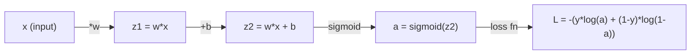
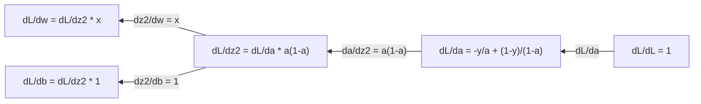
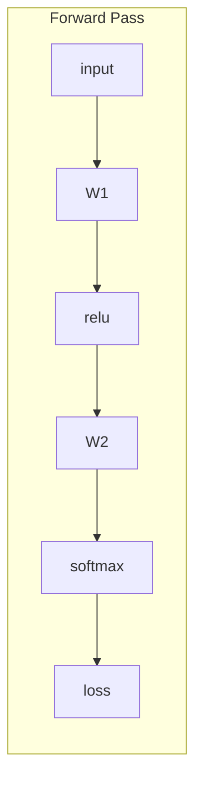
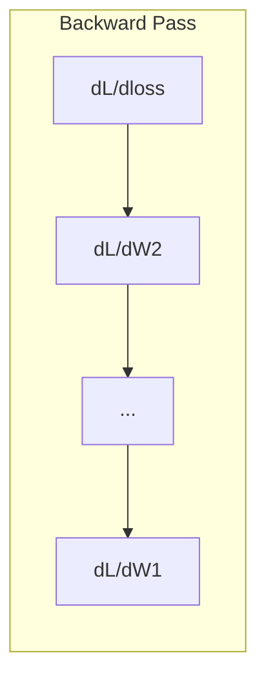

# 機械学習のための微分積分

> 導関数は、どちらへ進めば下り坂かを教えてくれる。ニューラルネットワークが学習するために必要なのはそれだけです。

**種別:** 学習
**言語:** Python
**前提条件:** フェーズ1、レッスン01-03
**所要時間:** 約60分

## 学習目標

- 機械学習でよく使う関数（x^2、sigmoid、cross-entropy）の数値微分と解析的微分を計算する
- 損失関数を1次元・2次元で最小化する勾配降下法をスクラッチで実装する
- 線形回帰モデルの勾配を導出し、手動の重み更新で学習させる
- ヘッセ行列、テイラー展開近似、それらと最適化手法の関係を説明する

## 問題

何百万もの重みを持つニューラルネットワークを考えます。各重みは1つのつまみです。モデルの間違いを少しだけ減らすには、すべてのつまみをどちら向きに回せばよいかを知る必要があります。微分積分はその方向を与えてくれます。

微分積分がなければ、ニューラルネットワークの学習はランダムな変更を試してうまくいくことを願うだけになります。導関数があれば、各重みが誤差にどう影響するかを正確に知ることができます。毎回、すべてのつまみを正しい方向に回せます。

## 概念

### 導関数とは何か

導関数は変化率を測ります。関数 y = f(x) について、導関数 f'(x) は「x をごく少し動かすと、y はどれだけ変わるか」を教えてくれます。

幾何学的には、導関数はある点における接線の傾きです。

**f(x) = x^2:**

| x | f(x) | f'(x)（傾き） |
|---|------|---------------|
| 0 | 0    | 0（平ら、底にいる） |
| 1 | 1    | 2 |
| 2 | 4    | 4（この点での接線の傾き） |
| 3 | 9    | 6 |

x=2 では傾きは 4 です。x をほんの少し右に動かすと、y はその約4倍だけ増えます。x=0 では傾きは 0 です。お椀の底にいる状態です。

形式的な定義は次のとおりです。

```
f'(x) = lim   f(x + h) - f(x)
        h->0  -----------------
                     h
```

コードでは極限をそのまま扱わず、とても小さい h を使います。これが数値微分です。

### 偏導関数: 1回に1つの変数だけを見る

実際の関数には多くの入力があります。ニューラルネットワークの損失は何千もの重みに依存します。偏導関数では、1つの変数以外をすべて定数として固定し、その1つについて微分します。

```
f(x, y) = x^2 + 3xy + y^2

df/dx = 2x + 3y     (treat y as a constant)
df/dy = 3x + 2y     (treat x as a constant)
```

それぞれの偏導関数は「この重みだけを少し動かしたら、損失はどう変わるか」に答えます。

### 勾配: すべての偏導関数を集めたベクトル

勾配はすべての偏導関数を1つのベクトルにまとめたものです。関数 f(x, y, z) の勾配は次のようになります。

```
grad f = [ df/dx, df/dy, df/dz ]
```

勾配は最急上昇の方向を指します。関数を最小化するには、その反対方向へ進みます。

**f(x,y) = x^2 + y^2 の等高線図:**

この関数はお椀のような形をしており、等高線は同心円になります。最小値は (0, 0) です。

| 点 | grad f | -grad f（降下方向） |
|-------|--------|----------------------------|
| (1, 1) | [2, 2]（最小値から離れる上り方向を指す） | [-2, -2]（最小値へ向かう下り方向を指す） |
| (0, 0) | [0, 0]（平ら、最小値） | [0, 0] |

これが図で見た勾配降下法です。勾配を計算し、符号を反転し、一歩進みます。

### 最適化とのつながり

ニューラルネットワークの学習は最適化です。モデルがどれだけ間違っているかを測る損失関数 L(w1, w2, ..., wn) があり、それを最小化したいのです。

```
Gradient descent update rule:

  w_new = w_old - learning_rate * dL/dw

For every weight:
  1. Compute the partial derivative of loss with respect to that weight
  2. Subtract a small multiple of it from the weight
  3. Repeat
```

学習率はステップ幅を制御します。大きすぎると行き過ぎ、小さすぎるとなかなか進みません。

**損失ランドスケープ（1次元の断面）:**

損失関数 L(w) は、重み w に応じて山や谷を持つ曲線になります。

| 特徴 | 説明 |
|---------|-------------|
| 大域的最小値 | 曲線全体で最も低い点、つまり最良の解 |
| 局所最小値 | 周囲より低い谷だが、全体で最も低いとは限らない点 |
| 傾き | 勾配降下法は任意の開始点から傾きに沿って下る |

勾配降下法は傾きに沿って下ります。局所最小値にはまることはありますが、何百万もの重みを持つ高次元空間では、実用上はあまり問題になりません。

### 数値微分と解析的微分

導関数を計算する方法は2つあります。

解析的: 微分の規則を手で適用します。f(x) = x^2 なら導関数は f'(x) = 2x です。正確で高速です。

数値的: 定義を使って近似します。小さな h について f(x+h) と f(x-h) を計算し、その差を使います。

```
Numerical (central difference):

f'(x) ~= f(x + h) - f(x - h)
          -----------------------
                  2h

h = 0.0001 works well in practice
```

数値微分は遅い一方で、どんな関数にも使えます。解析的微分は速い一方で、式を導出する必要があります。ニューラルネットワークのフレームワークは第3の方法である自動微分を使い、厳密な導関数を機械的に計算します。これはフェーズ3で扱います。

### 簡単な関数を手で微分する

次の導関数は機械学習で何度も出てきます。

```
Function        Derivative       Used in
--------        ----------       -------
f(x) = x^2     f'(x) = 2x      Loss functions (MSE)
f(x) = wx + b  f'(w) = x        Linear layer (gradient w.r.t. weight)
                f'(b) = 1        Linear layer (gradient w.r.t. bias)
                f'(x) = w        Linear layer (gradient w.r.t. input)
f(x) = e^x     f'(x) = e^x     Softmax, attention
f(x) = ln(x)   f'(x) = 1/x     Cross-entropy loss
f(x) = 1/(1+e^-x)  f'(x) = f(x)(1-f(x))   Sigmoid activation
```

f(x) = x^2 の場合:

```
f(x) = x^2    f'(x) = 2x

  x    f(x)   f'(x)   meaning
  -2    4      -4      slope tilts left (decreasing)
  -1    1      -2      slope tilts left (decreasing)
   0    0       0      flat (minimum!)
   1    1       2      slope tilts right (increasing)
   2    4       4      slope tilts right (increasing)
```

x=3、b=1 の f(w) = wx + b の場合:

```
f(w) = 3w + 1    f'(w) = 3

The derivative with respect to w is just x.
If x is big, a small change in w causes a big change in output.
```

### 連鎖律

関数が合成されているときは、連鎖律で微分します。

```
If y = f(g(x)), then dy/dx = f'(g(x)) * g'(x)

Example: y = (3x + 1)^2
  outer: f(u) = u^2       f'(u) = 2u
  inner: g(x) = 3x + 1    g'(x) = 3
  dy/dx = 2(3x + 1) * 3 = 6(3x + 1)
```

ニューラルネットワークは関数の連鎖です。input -> linear -> activation -> linear -> activation -> loss。バックプロパゲーションは、出力から入力へ向かって連鎖律を繰り返し適用することです。アルゴリズム全体はこれに尽きます。

### ヘッセ行列

勾配は傾きを教えてくれます。ヘッセ行列は曲率を教えてくれます。

ヘッセ行列は2階偏導関数を並べた行列です。関数 f(x1, x2, ..., xn) について、ヘッセ行列の (i, j) 成分は次のとおりです。

```
H[i][j] = d^2f / (dx_i * dx_j)
```

2変数関数 f(x, y) の場合:

```
H = | d^2f/dx^2    d^2f/dxdy |
    | d^2f/dydx    d^2f/dy^2 |
```

**臨界点（gradient = 0）でヘッセ行列から分かること:**

| ヘッセ行列の性質 | 意味 | 表面の例 |
|-----------------|---------|-----------------|
| 正定値（すべての固有値 > 0） | 局所最小値 | 上向きのお椀 |
| 負定値（すべての固有値 < 0） | 局所最大値 | 下向きのお椀 |
| 不定（固有値の符号が混在） | 鞍点 | 馬の鞍のような形 |

**例:** f(x, y) = x^2 - y^2（鞍型関数）

```
df/dx = 2x       df/dy = -2y
d^2f/dx^2 = 2    d^2f/dy^2 = -2    d^2f/dxdy = 0

H = | 2   0 |
    | 0  -2 |

Eigenvalues: 2 and -2 (one positive, one negative)
--> Saddle point at (0, 0)
```

f(x, y) = x^2 + y^2（お椀）と比較します。

```
H = | 2  0 |
    | 0  2 |

Eigenvalues: 2 and 2 (both positive)
--> Local minimum at (0, 0)
```

**機械学習でヘッセ行列が重要な理由:**

ニュートン法はヘッセ行列を使い、勾配降下法より良い最適化ステップを取ります。単に傾きに従うのではなく、曲率を考慮します。

```
Newton's update:    w_new = w_old - H^(-1) * gradient
Gradient descent:   w_new = w_old - lr * gradient
```

ニュートン法は、ヘッセ行列が勾配を「再スケーリング」するため速く収束します。急な方向では小さく進み、平らな方向では大きく進みます。

ただし問題があります。N 個のパラメータを持つニューラルネットワークでは、ヘッセ行列は N x N です。100万パラメータのモデルには1兆要素の行列が必要になります。そのため近似を使います。

| 手法 | 使うもの | コスト | 収束 |
|--------|-------------|------|-------------|
| 勾配降下法 | 1階導関数のみ | 1ステップあたり O(N) | 遅い（線形） |
| ニュートン法 | 完全なヘッセ行列 | 1ステップあたり O(N^3) | 速い（二次） |
| L-BFGS | 勾配履歴から近似したヘッセ行列 | 1ステップあたり O(N) | 中程度（超線形） |
| Adam | パラメータごとの適応的な率（対角ヘッセ近似） | 1ステップあたり O(N) | 中程度 |
| 自然勾配 | フィッシャー情報行列（統計的なヘッセ行列） | 1ステップあたり O(N^2) | 速い |

実務では、深層学習のデフォルトのオプティマイザは Adam です。Adam は各パラメータの勾配の移動平均と分散を追跡することで、2階情報を安価に近似します。

### テイラー展開近似

滑らかな関数は、局所的に多項式で近似できます。

```
f(x + h) = f(x) + f'(x)*h + (1/2)*f''(x)*h^2 + (1/6)*f'''(x)*h^3 + ...
```

項を多く含めるほど近似は良くなります。ただし点 x の近くでだけ有効です。

**機械学習でテイラー展開が重要な理由:**

- **1階テイラー = 勾配降下法。** f(x + h) ~ f(x) + f'(x)*h を使うと、線形近似をしていることになります。勾配降下法はこの線形モデルを最小化するように h = -lr * f'(x) を選びます。

- **2階テイラー = ニュートン法。** f(x + h) ~ f(x) + f'(x)*h + (1/2)*f''(x)*h^2 を使うと、二次モデルが得られます。それを最小化すると h = -f'(x)/f''(x)、つまりニュートンステップになります。

- **損失関数の設計。** MSE とクロスエントロピーは滑らかなので、テイラー展開が扱いやすくなります。これは偶然ではありません。滑らかな損失は最適化を予測しやすくします。

```
Approximation order    What it captures    Optimization method
-------------------    -----------------   -------------------
0th order (constant)   Just the value      Random search
1st order (linear)     Slope               Gradient descent
2nd order (quadratic)  Curvature           Newton's method
Higher orders          Finer structure     Rarely used in ML
```

重要な洞察は、勾配ベースの最適化はすべて、損失関数を局所的に近似し、その近似の最小値へ進むことだという点です。

### 機械学習における積分

導関数は変化率を教えます。積分は蓄積、つまり曲線の下の面積を計算します。

機械学習で積分を手計算することは多くありませんが、概念は至るところに現れます。

**確率。** 密度 p(x) を持つ連続確率変数について:
```
P(a < X < b) = integral from a to b of p(x) dx
```
a と b の間の確率密度曲線の下の面積が、その範囲に入る確率です。

**期待値。** 確率で重み付けした平均的な結果:
```
E[f(X)] = integral of f(x) * p(x) dx
```
データ分布上の期待損失は積分です。学習ではこれの経験的近似を最小化します。

**KLダイバージェンス。** 2つの分布がどれだけ異なるかを測ります。
```
KL(p || q) = integral of p(x) * log(p(x) / q(x)) dx
```
VAE、知識蒸留、ベイズ推論で使われます。

**正規化定数。** ベイズ推論では:
```
p(w | data) = p(data | w) * p(w) / integral of p(data | w) * p(w) dw
```
分母はあり得るすべてのパラメータ値にわたる積分です。多くの場合これは扱いにくいため、MCMC や変分推論のような近似を使います。

| 積分の概念 | 機械学習で現れる場所 |
|-----------------|----------------------|
| 曲線下の面積 | 密度関数から得る確率 |
| 期待値 | 損失関数、リスク最小化 |
| KLダイバージェンス | VAE、方策最適化、蒸留 |
| 正規化 | ベイズ事後分布、softmax の分母 |
| 周辺尤度 | モデル比較、エビデンス下界（ELBO） |

### 計算グラフにおける多変数の連鎖律

連鎖律は、一直線に並んだスカラー関数だけに適用されるものではありません。ニューラルネットワークでは、変数が分岐して合流します。単純な順伝播で導関数がどう流れるかを見てみます。



逆伝播は右から左へ勾配を計算します。



各矢印では局所的な導関数を掛けます。任意のパラメータの勾配は、損失からそのパラメータへ至る経路上のすべての局所導関数の積です。経路が分岐して合流する場合は、寄与を足し合わせます（多変数の連鎖律）。

バックプロパゲーションとは、これだけです。計算グラフ上で出力から入力へ、連鎖律を体系的に適用します。

### ヤコビ行列

関数がベクトルをベクトルへ写す場合（ニューラルネットワークの層のように）、その導関数は行列になります。ヤコビ行列には、すべての出力のすべての入力に対する偏導関数が入ります。

f: R^n -> R^m について、ヤコビ行列 J は m x n 行列です。

| | x1 | x2 | ... | xn |
|---|---|---|---|---|
| f1 | df1/dx1 | df1/dx2 | ... | df1/dxn |
| f2 | df2/dx1 | df2/dx2 | ... | df2/dxn |
| ... | ... | ... | ... | ... |
| fm | dfm/dx1 | dfm/dx2 | ... | dfm/dxn |

ニューラルネットワークのヤコビ行列を手で計算することはありません。PyTorch が処理します。ただし、その存在を知っているとバックプロパゲーションの形状を理解しやすくなります。ある層が R^n から R^m へ写すなら、そのヤコビ行列は m x n です。勾配はこの行列の転置を通って逆向きに流れます。

### これがニューラルネットワークで重要な理由

ニューラルネットワークのすべての重みには勾配があります。勾配は、損失を減らすためにその重みをどう調整すればよいかを教えてくれます。





各重み更新は次のようになります。
- `W1 = W1 - lr * dL/dW1`
- `W2 = W2 - lr * dL/dW2`

順伝播は予測と損失を計算します。逆伝播はすべての重みに対する損失の勾配を計算します。その後、各重みが下り方向へ小さく一歩進みます。これを何百万ステップも繰り返します。これが深層学習です。

## 作ってみる

### Step 1: スクラッチで数値微分

```python
def numerical_derivative(f, x, h=1e-7):
    return (f(x + h) - f(x - h)) / (2 * h)

def f(x):
    return x ** 2

for x in [-2, -1, 0, 1, 2]:
    numerical = numerical_derivative(f, x)
    analytical = 2 * x
    print(f"x={x:2d}  f'(x) numerical={numerical:.6f}  analytical={analytical:.1f}")
```

数値微分は解析的な導関数と小数点以下の多くの桁まで一致します。

### Step 2: 偏導関数と勾配

```python
def numerical_gradient(f, point, h=1e-7):
    gradient = []
    for i in range(len(point)):
        point_plus = list(point)
        point_minus = list(point)
        point_plus[i] += h
        point_minus[i] -= h
        partial = (f(point_plus) - f(point_minus)) / (2 * h)
        gradient.append(partial)
    return gradient

def f_multi(point):
    x, y = point
    return x**2 + 3*x*y + y**2

grad = numerical_gradient(f_multi, [1.0, 2.0])
print(f"Numerical gradient at (1,2): {[f'{g:.4f}' for g in grad]}")
print(f"Analytical gradient at (1,2): [2*1+3*2, 3*1+2*2] = [{2*1+3*2}, {3*1+2*2}]")
```

### Step 3: f(x) = x^2 の最小値を勾配降下法で探す

```python
x = 5.0
lr = 0.1
for step in range(20):
    grad = 2 * x
    x = x - lr * grad
    print(f"step {step:2d}  x={x:8.4f}  f(x)={x**2:10.6f}")
```

x=5 から始めると、各ステップで x=0（最小値）に近づきます。

### Step 4: 2次元関数での勾配降下法

```python
def f_2d(point):
    x, y = point
    return x**2 + y**2

point = [4.0, 3.0]
lr = 0.1
for step in range(30):
    grad = numerical_gradient(f_2d, point)
    point = [p - lr * g for p, g in zip(point, grad)]
    loss = f_2d(point)
    if step % 5 == 0 or step == 29:
        print(f"step {step:2d}  point=({point[0]:7.4f}, {point[1]:7.4f})  f={loss:.6f}")
```

### Step 5: 数値微分と解析的微分の比較

```python
import math

test_functions = [
    ("x^2",      lambda x: x**2,          lambda x: 2*x),
    ("x^3",      lambda x: x**3,          lambda x: 3*x**2),
    ("sin(x)",   lambda x: math.sin(x),   lambda x: math.cos(x)),
    ("e^x",      lambda x: math.exp(x),   lambda x: math.exp(x)),
    ("1/x",      lambda x: 1/x,           lambda x: -1/x**2),
]

x = 2.0
print(f"{'Function':<12} {'Numerical':>12} {'Analytical':>12} {'Error':>12}")
print("-" * 50)
for name, f, df in test_functions:
    num = numerical_derivative(f, x)
    ana = df(x)
    err = abs(num - ana)
    print(f"{name:<12} {num:12.6f} {ana:12.6f} {err:12.2e}")
```

### Step 6: ヘッセ行列を数値的に計算する

```python
def hessian_2d(f, x, y, h=1e-5):
    fxx = (f(x + h, y) - 2 * f(x, y) + f(x - h, y)) / (h ** 2)
    fyy = (f(x, y + h) - 2 * f(x, y) + f(x, y - h)) / (h ** 2)
    fxy = (f(x + h, y + h) - f(x + h, y - h) - f(x - h, y + h) + f(x - h, y - h)) / (4 * h ** 2)
    return [[fxx, fxy], [fxy, fyy]]

def saddle(x, y):
    return x ** 2 - y ** 2

def bowl(x, y):
    return x ** 2 + y ** 2

H_saddle = hessian_2d(saddle, 0.0, 0.0)
H_bowl = hessian_2d(bowl, 0.0, 0.0)
print(f"Saddle Hessian: {H_saddle}")  # [[2, 0], [0, -2]] -- mixed signs
print(f"Bowl Hessian:   {H_bowl}")    # [[2, 0], [0, 2]]  -- both positive
```

鞍型関数のヘッセ行列は固有値 2 と -2 を持ちます（符号が混在しており、鞍点であることを確認できます）。お椀型の関数は固有値 2 と 2 を持ちます（どちらも正で、最小値であることを確認できます）。

### Step 7: テイラー近似を実際に使う

```python
import math

def taylor_approx(f, f_prime, f_double_prime, x0, h, order=2):
    result = f(x0)
    if order >= 1:
        result += f_prime(x0) * h
    if order >= 2:
        result += 0.5 * f_double_prime(x0) * h ** 2
    return result

x0 = 0.0
for h in [0.1, 0.5, 1.0, 2.0]:
    true_val = math.sin(h)
    t1 = taylor_approx(math.sin, math.cos, lambda x: -math.sin(x), x0, h, order=1)
    t2 = taylor_approx(math.sin, math.cos, lambda x: -math.sin(x), x0, h, order=2)
    print(f"h={h:.1f}  sin(h)={true_val:.4f}  order1={t1:.4f}  order2={t2:.4f}")
```

x0=0 の近くでは sin(x) ~ x（1階テイラー）です。h が小さいと近似は非常に良いですが、h が大きいと崩れます。勾配降下法が小さな学習率で最もうまく働くのはこのためです。各ステップでは線形近似が正確だと仮定しています。

### Step 8: これがニューラルネットワークで重要な理由

```python
import random

random.seed(42)

w = random.gauss(0, 1)
b = random.gauss(0, 1)
lr = 0.01

xs = [1.0, 2.0, 3.0, 4.0, 5.0]
ys = [3.0, 5.0, 7.0, 9.0, 11.0]

for epoch in range(200):
    total_loss = 0
    dw = 0
    db = 0
    for x, y in zip(xs, ys):
        pred = w * x + b
        error = pred - y
        total_loss += error ** 2
        dw += 2 * error * x
        db += 2 * error
    dw /= len(xs)
    db /= len(xs)
    total_loss /= len(xs)
    w -= lr * dw
    b -= lr * db
    if epoch % 40 == 0 or epoch == 199:
        print(f"epoch {epoch:3d}  w={w:.4f}  b={b:.4f}  loss={total_loss:.6f}")

print(f"\nLearned: y = {w:.2f}x + {b:.2f}")
print(f"Actual:  y = 2x + 1")
```

勾配ベースの学習ループはすべてこのパターンに従います。予測し、損失を計算し、勾配を計算し、重みを更新します。

## 使ってみる

NumPy を使うと、同じ操作をより高速かつ簡潔に書けます。

```python
import numpy as np

x = np.array([1, 2, 3, 4, 5], dtype=float)
y = np.array([3, 5, 7, 9, 11], dtype=float)

w, b = np.random.randn(), np.random.randn()
lr = 0.01

for epoch in range(200):
    pred = w * x + b
    error = pred - y
    loss = np.mean(error ** 2)
    dw = np.mean(2 * error * x)
    db = np.mean(2 * error)
    w -= lr * dw
    b -= lr * db

print(f"Learned: y = {w:.2f}x + {b:.2f}")
```

あなたは勾配降下法をスクラッチで作りました。PyTorch は勾配計算を自動化しますが、更新ループは同じです。

## 演習

1. `numerical_derivative` を2回呼び出して `numerical_second_derivative(f, x)` を実装してください。x^3 の x=2 における2階導関数が 12 になることを確認してください。
2. 勾配降下法を使って f(x, y) = (x - 3)^2 + (y + 1)^2 の最小値を探してください。(0, 0) から始めます。答えは (3, -1) に収束するはずです。
3. 勾配降下法のループにモメンタムを追加してください。過去の勾配を蓄積する速度ベクトルを維持します。f(x) = x^4 - 3x^2 で、モメンタムあり・なしの収束速度を比較してください。

## 重要用語

| 用語 | よく言われる説明 | 実際の意味 |
|------|----------------|----------------------|
| 導関数 | 「傾き」 | ある点での関数の変化率。入力が1単位変わったときに出力がどれだけ変わるかを示す。 |
| 偏導関数 | 「1つの変数の導関数」 | 他のすべての変数を定数として固定し、1つの変数について取る導関数。 |
| 勾配 | 「最急上昇方向」 | すべての偏導関数からなるベクトル。関数を最も速く増加させる方向を指す。 |
| 勾配降下法 | 「下り坂へ進む」 | 損失を減らすために、パラメータから勾配（に学習率を掛けたもの）を引く。ニューラルネットワーク学習の中核。 |
| 学習率 | 「ステップ幅」 | 各勾配降下ステップの大きさを制御するスカラー。大きすぎると発散し、小さすぎると収束が遅い。 |
| 連鎖律 | 「導関数を掛ける」 | 合成関数を微分する規則: df/dx = df/dg * dg/dx。バックプロパゲーションの数学的基盤。 |
| ヤコビ行列 | 「導関数の行列」 | 関数がベクトルをベクトルへ写すとき、ヤコビ行列は出力の入力に対するすべての偏導関数からなる行列。 |
| 数値微分 | 「有限差分」 | 近い2点で関数を評価し、その間の傾きを計算して導関数を近似すること。 |
| バックプロパゲーション | 「逆モード自動微分」 | 連鎖律を使い、出力から入力へ層ごとに勾配を計算すること。ニューラルネットワークが学習する仕組み。 |
| ヘッセ行列 | 「2階導関数の行列」 | すべての2階偏導関数からなる行列。関数の曲率を表す。臨界点で正定値ヘッセ行列なら局所最小値を意味する。 |
| テイラー展開 | 「多項式近似」 | 導関数を使い、ある点の近くで関数を近似すること: f(x+h) ~ f(x) + f'(x)h + (1/2)f''(x)h^2 + ...。勾配降下法やニュートン法がなぜ働くかを理解する基盤。 |
| 積分 | 「曲線下の面積」 | ある範囲で量を蓄積すること。機械学習では、積分が確率、期待値、KLダイバージェンスを定義する。 |

## 参考資料

- [3Blue1Brown: Essence of Calculus](https://www.3blue1brown.com/topics/calculus) - 導関数、積分、連鎖律を視覚的に理解するための資料
- [Stanford CS231n: Backpropagation](https://cs231n.github.io/optimization-2/) - ニューラルネットワークの層を勾配がどう流れるか
