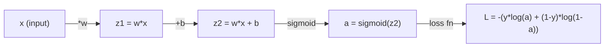
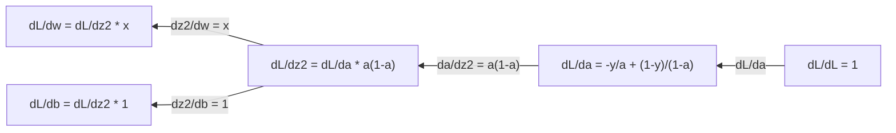
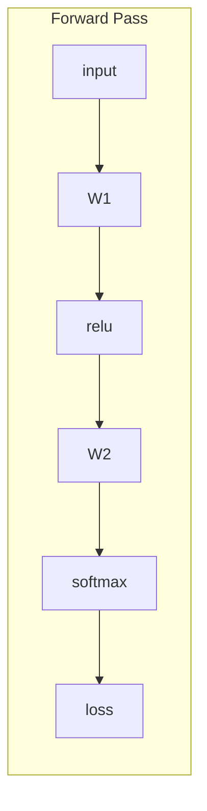
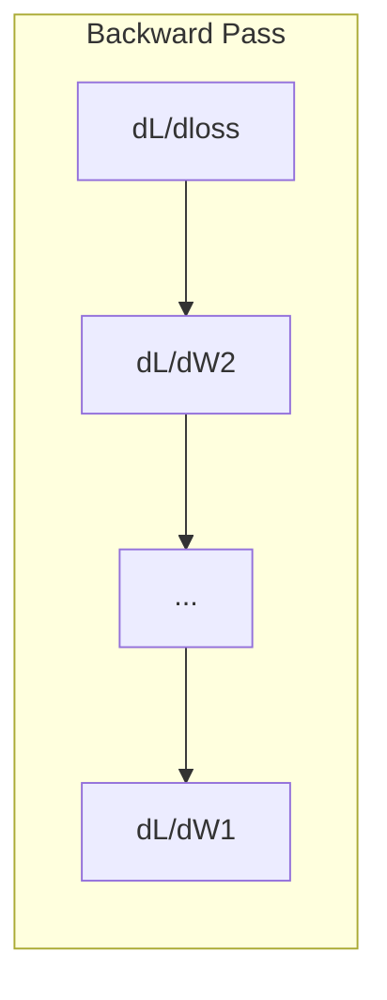

# Machine Learning için Hesaplama

> Türevler size hangi yönün yokuş aşağı olduğunu söyler. Bir neural network'nin öğrenmesi gereken tek şey budur.

**Tür:** Öğren
**Dil:** Python
**Önkoşullar:** Aşama 1, Dersler 01-03
**Süre:** ~60 dakika

## Öğrenme Hedefleri

- Yaygın ML fonksiyonları (x^2, sigmoid, çapraz entropi) için sayısal ve analitik türevleri hesaplayın
- 1D ve 2D'de loss function'yi en aza indirmek için gradient inişini sıfırdan uygulayın
- Doğrusal bir regresyon modelinin gradient'sini türetin ve manuel ağırlık güncellemeleri aracılığıyla eğitin
- Hessian matrisini, Taylor serisi yaklaşımlarını ve bunların optimizasyon yöntemleriyle bağlantısını açıklamak

## Sorun

Milyonlarca ağırlığa sahip bir neural network'niz var. Her ağırlık bir topuzdur. Modeli biraz daha az yanlış yapmak için her bir düğmeyi hangi yöne çevireceğinizi bulmanız gerekir. Matematik size bu yönü verir.

Matematik olmadan neural network'yi eğitmek, rastgele değişiklikleri denemek ve en iyisini ummak anlamına gelir. Türevlerde her ağırlığın hatayı nasıl etkilediğini tam olarak bilirsiniz. Her seferinde her düğmeyi doğru yöne çeviriyorsun.

## Konsept

### Türev nedir?

Bir türev değişim oranını ölçer. Bir y = f(x) fonksiyonu için, f'(x) türevi size şunu söyler: x'i çok küçük bir miktarda iterseniz, y ne kadar değişir?

Geometrik olarak türev, bir noktadaki teğet doğrunun eğimidir.

**f(x) = x^2:**

| x | f(x) | f'(x) (eğim) |
|---|------|---------------|
| 0 | 0 | 0 (düz, altta) |
| 1 | 1    | 2 |
| 2 | 4 | 4 (bu noktada teğet doğrunun eğimi) |
| 3 | 9    | 6 |

x=2'de eğim 4'tür. Eğer x'i biraz sağa kaydırırsanız, y bu miktarın yaklaşık 4 katı kadar artar. x=0'da eğim 0'dır. Çanağın dibindesiniz.

Resmi tanım:

```
f'(x) = lim   f(x + h) - f(x)
        h->0  -----------------
                     h
```

Kodda sınırı atlarsınız ve sadece çok küçük bir h kullanırsınız. Bu sayısal türevdir.

### Kısmi türevler: her seferinde bir değişken

Gerçek fonksiyonların birçok girişi vardır. neural network kaybı binlerce ağırlığa bağlıdır. Kısmi türev, biri hariç tüm değişkenleri sabit tutar, sonra buna göre türevi alır.

```
f(x, y) = x^2 + 3xy + y^2

df/dx = 2x + 3y     (treat y as a constant)
df/dy = 3x + 2y     (treat x as a constant)
```

Her kısmi türev şu cevabı verir: Sadece bu ağırlığı itersem kayıp nasıl değişir?

### gradient: tüm kısmi türevlerin vektörü

gradient her kısmi türevi tek bir vektörde toplar. Bir f(x, y, z) fonksiyonu için gradient şöyledir:

```
grad f = [ df/dx, df/dy, df/dz ]
```

gradient en dik yükseliş yönünü işaret ediyor. Bir fonksiyonu en aza indirmek için ters yöne gidin.

**f(x,y) = x^2 + y^2'nin eşyükselti grafiği:**

Fonksiyon, kontur çizgileri olarak eşmerkezli dairelere sahip bir çanak şekli oluşturur. Minimum (0, 0)'dadır.

| Nokta | lisans f | -grad f (iniş yönü) |
|-------|--------|----------------------------|
| (1, 1) | [2, 2] (yokuş yukarıyı, minimumdan uzağa işaret eder) | [-2, -2] (yokuş aşağıyı, minimuma doğru işaret eder) |
| (0, 0) | [0, 0] (minimum düzeyde düz) | [0, 0] |

Bu, bir resimdeki gradient inişidir. gradient'yi hesaplayın, olumsuzlayın, bir adım atın.

### Optimizasyona bağlantı

Bir neural network'yi eğitmek optimizasyondur. Modelin ne kadar yanlış olduğunu ölçen bir loss function L(w1, w2, ..., wn) var. Bunu en aza indirmek istiyorsunuz.

```
Gradient descent update rule:

  w_new = w_old - learning_rate * dL/dw

For every weight:
  1. Compute the partial derivative of loss with respect to that weight
  2. Subtract a small multiple of it from the weight
  3. Repeat
```

Öğrenme oranı adım boyutunu kontrol eder. Çok büyük ve aşırıya kaçıyorsun. Çok küçük ve sürünüyorsun.

**Kayıp manzarası (1 boyutlu dilim):**

loss function L(w), w ağırlığı değiştikçe zirveleri ve vadileri olan bir eğri oluşturur.

| Özellik | Açıklama |
|---------|-------------|
| Küresel minimum | Tüm eğrinin en alçak noktası - en iyi çözüm |
| Yerel minimum | Komşularından daha alçakta ama genel olarak en alçak olmayan bir vadi |
| Eğim | Gradient iniş herhangi bir başlangıç ​​noktasından yokuş aşağı eğimi takip eder |

Gradient iniş, yokuş aşağı eğimi takip eder. Yerel minimumlara sıkışabilir, ancak yüksek boyutlu uzaylarda (milyonlarca ağırlık) bu nadiren pratik bir problemdir.

### Sayısal ve analitik türevler

Türevi hesaplamanın iki yolu vardır.

Analitik: Matematik kurallarını elle uygulayın. f(x) = x^2 için türev f'(x) = 2x'tir. Bire bir aynı. Hızlı.

Sayısal: tanımı kullanarak yaklaşık değer. Küçük bir h için f(x+h) ve f(x-h)'yi hesaplayın, sonra farkı kullanın.

```
Numerical (central difference):

f'(x) ~= f(x + h) - f(x - h)
          -----------------------
                  2h

h = 0.0001 works well in practice
```

Sayısal türevler daha yavaştır ancak her fonksiyon için işe yarar. Analitik türevler hızlıdır ancak formülü türetmenizi gerektirir. Neural network framework'ler üçüncü bir yaklaşım kullanır: kesin türevleri mekanik olarak hesaplayan otomatik türev. Bunu 3. Aşamada göreceksiniz.

### Basit fonksiyonlar için elle türevler

Bunlar ML'de tekrar tekrar göreceğiniz türevlerdir.

```
Function        Derivative       Used in
--------        ----------       -------
f(x) = x^2     f'(x) = 2x      Loss functions (MSE)
f(x) = wx + b  f'(w) = x        Linear layer (gradient w.r.t. weight)
                f'(b) = 1        Linear layer (gradient w.r.t. bias)
                f'(x) = w        Linear layer (gradient w.r.t. input)
f(x) = e^x     f'(x) = e^x     Softmax, attention
f(x) = ln(x)   f'(x) = 1/x     Cross-entropy loss
f(x) = 1/(1+e^-x)  f'(x) = f(x)(1-f(x))   Sigmoid activation
```

f(x) = x^2 için:

```
f(x) = x^2    f'(x) = 2x

  x    f(x)   f'(x)   meaning
  -2    4      -4      slope tilts left (decreasing)
  -1    1      -2      slope tilts left (decreasing)
   0    0       0      flat (minimum!)
   1    1       2      slope tilts right (increasing)
   2    4       4      slope tilts right (increasing)
```

f(w) = wx + b ve x=3, b=1 için:

```
f(w) = 3w + 1    f'(w) = 3

The derivative with respect to w is just x.
If x is big, a small change in w causes a big change in output.
```

### Zincir kuralı

Fonksiyonlar oluşturulduğunda zincir kuralı size nasıl ayırt edileceğini söyler.

```
If y = f(g(x)), then dy/dx = f'(g(x)) * g'(x)

Example: y = (3x + 1)^2
  outer: f(u) = u^2       f'(u) = 2u
  inner: g(x) = 3x + 1    g'(x) = 3
  dy/dx = 2(3x + 1) * 3 = 6(3x + 1)
```

Neural network'ler fonksiyon zincirleridir: giriş -> doğrusal -> etkinleştirme -> doğrusal -> etkinleştirme -> kayıp. Backpropagation, çıktıdan girdiye tekrar tekrar uygulanan zincir kuralıdır. Tüm algoritma budur.

### Hessen Matrisi

gradient size eğimi söyler. Hessian size eğriliği söyler.

Hessian ikinci dereceden kısmi türevlerin matrisidir. Bir f(x1, x2, ..., xn) fonksiyonu için Hessian'ın girdisi (i, j):

```
H[i][j] = d^2f / (dx_i * dx_j)
```

2 değişkenli f(x, y) fonksiyonu için:

```
H = | d^2f/dx^2    d^2f/dxdy |
    | d^2f/dydx    d^2f/dy^2 |
```

**Hessian'ın kritik bir noktada size söylediği şey (burada gradient = 0):**

| Hessen mülkü | Anlamı | Örnek yüzey |
|-----------------|---------|-----------------|
| Pozitif tanımlı (tüm özdeğerler > 0) | Yerel minimum | Kase yukarıyı gösteriyor |
| Negatif tanımlı (tüm özdeğerler < 0) | Yerel maksimum | Aşağıya bakan kase |
| Belirsiz (karışık özdeğerler) | Eyer noktası | At eyeri şekli |

**Örnek:** f(x, y) = x^2 - y^2 (bir eyer fonksiyonu)

```
df/dx = 2x       df/dy = -2y
d^2f/dx^2 = 2    d^2f/dy^2 = -2    d^2f/dxdy = 0

H = | 2   0 |
    | 0  -2 |

Eigenvalues: 2 and -2 (one positive, one negative)
--> Saddle point at (0, 0)
```

f(x, y) = x^2 + y^2 (bir kase) ile karşılaştırın:

```
H = | 2  0 |
    | 0  2 |

Eigenvalues: 2 and 2 (both positive)
--> Local minimum at (0, 0)
```

**Hessian makine öğreniminde neden önemlidir:**

Newton'un yöntemi, gradient inişinden daha iyi optimizasyon adımları atmak için Hessian'ı kullanır. Sadece eğimi takip etmek yerine eğriliği de hesaba katar:

```
Newton's update:    w_new = w_old - H^(-1) * gradient
Gradient descent:   w_new = w_old - lr * gradient
```

Newton'un yöntemi daha hızlı yakınsar çünkü Hessian gradient'yi "yeniden ölçeklendirir" - dik yönler daha küçük adımlara, düz yönler daha büyük adımlara ulaşır.

İşin püf noktası: N parametreli bir neural network için Hessian N x N'dir. 1 milyon parametreli bir model, 1 trilyon girişli bir matrise ihtiyaç duyacaktır. Bu yüzden yaklaşık değerler kullanıyoruz.

| Yöntem | Ne kullanır | Maliyet | Yakınsama |
|--------|-------------|------|-------------|
| Gradient iniş | Yalnızca birinci türevler | O(N) adım başına | Yavaş (doğrusal) |
| Newton'un yöntemi | Tam Hessen | O(N^3) adım başına | Hızlı (ikinci dereceden) |
| L-BFGS | gradient geçmişinden yaklaşık Hessian | O(N) adım başına | Orta (süper doğrusal) |
| Adem | Parametre başına uyarlanabilir oranlar (yaklaşık çapraz Hessian) | O(N) adım başına | Orta |
| Doğal gradient | Fisher bilgi matrisi (istatistiksel Hessian) | O(N^2) adım başına | Hızlı |

Uygulamada Adam, deep learning için varsayılan optimize edicidir. Parametre başına gradient'lerin çalışan ortalamasını ve varyansını izleyerek ikinci dereceden bilgiye ucuz bir şekilde yaklaşır.

### Taylor Serisi Yaklaşımı

Herhangi bir düzgün fonksiyona yerel olarak bir polinomla yaklaşılabilir:

```
f(x + h) = f(x) + f'(x)*h + (1/2)*f''(x)*h^2 + (1/6)*f'''(x)*h^3 + ...
```

Ne kadar çok terim eklerseniz, yaklaşım o kadar iyi olur - ancak yalnızca x noktasına yakın.

**Taylor serisi makine öğrenimi için neden önemlidir:**

- **Birinci dereceden Taylor = gradient iniş.** f(x + h) ~ f(x) + f'(x)*h kullandığınızda doğrusal bir yaklaşım yaparsınız. Gradient inişi, h = -lr * f'(x)'i seçmek için bu doğrusal modeli en aza indirir.

- **İkinci dereceden Taylor = Newton'un yöntemi.** f(x + h) ~ f(x) + f'(x)*h + (1/2)*f''(x)*h^2 kullanarak ikinci dereceden bir model elde edersiniz. Bunu küçültmek h = -f'(x)/f''(x) -- Newton'un adımını verir.

- **Loss function tasarımı.** MSE ve çapraz entropi düzgündür, bu da Taylor genişletmelerinin iyi durumda olduğu anlamına gelir. Bu bir kaza değil. Sorunsuz kayıplar optimizasyonu öngörülebilir hale getirir.

```
Approximation order    What it captures    Optimization method
-------------------    -----------------   -------------------
0th order (constant)   Just the value      Random search
1st order (linear)     Slope               Gradient descent
2nd order (quadratic)  Curvature           Newton's method
Higher orders          Finer structure     Rarely used in ML
```

Temel fikir: gradient tabanlı optimizasyonun tümü, aslında loss function'ye yerel olarak yaklaşmak ve bu yaklaşımın minimumuna adım atmak ile ilgilidir.

### ML'de İntegraller

Türevler size değişim oranlarını söyler. İntegraller birikimleri (bir eğrinin altındaki alanı) hesaplar.

ML'de integralleri nadiren elle hesaplarsınız, ancak bu kavram her yerdedir:

**Olasılık.** p(x) yoğunluğuna sahip sürekli bir rastgele değişken için:
```
P(a < X < b) = integral from a to b of p(x) dx
```
Olasılık yoğunluk eğrisinin altında a ve b arasındaki alan, bu aralığa iniş olasılığıdır.

**Beklenen değer.** Olasılığa göre ağırlıklandırılmış ortalama sonuç:
```
E[f(X)] = integral of f(x) * p(x) dx
```
Bir veri dağıtımında beklenen kayıp bir integraldir. Eğitim bunun ampirik yaklaşımını en aza indirir.

**KL ıraksaması.** İki dağılımın ne kadar farklı olduğunu ölçer:
```
KL(p || q) = integral of p(x) * log(p(x) / q(x)) dx
```
VAE'lerde, bilgi damıtmada ve Bayesian inference'de kullanılır.

**Normalleştirme sabitleri.** Bayesian inference'de:
```
p(w | data) = p(data | w) * p(w) / integral of p(data | w) * p(w) dw
```
Payda, tüm olası parametre değerlerinin integralidir. Çoğunlukla zorludur, bu yüzden MCMC ve varyasyonel inference gibi yaklaşımları kullanıyoruz.

| İntegral konsepti | ML'de nerede görünür |
|-----------------|----------------------|
| Eğri altındaki alan | Yoğunluk fonksiyonlarından olasılık |
| Beklenen değer | Loss function'ler, risk minimizasyonu |
| KL farklılığı | VAE'ler, politika optimizasyonu, damıtma |
| Normalleştirme | Bayes sonları, softmax paydası |
| Marjinal olasılık | Model karşılaştırması, kanıt alt sınırı (ELBO) |

### Hesaplama Grafiğinde Çok Değişkenli Zincir Kuralı

Zincir kuralı yalnızca bir doğrudaki skaler fonksiyonlara uygulanmaz. Bir neural network'de değişkenler yayılır ve birleşir. Türevlerin basit bir ileri geçişle nasıl aktığı aşağıda açıklanmıştır:



Geriye doğru geçiş gradient'leri sağdan sola hesaplar:



Her ok yerel türevle çarpılır. Herhangi bir parametre için gradient, kayıptan o parametreye kadar olan yol boyunca tüm yerel türevlerin çarpımıdır. Yollar dallanıp birleştiğinde katkıları toplarsınız (çok değişkenli zincir kuralı).

Bunların hepsi backpropagation'dir: çıktıdan girdilere kadar bir hesaplama grafiği aracılığıyla sistematik olarak uygulanan zincir kuralı.

### Jacobian matrisi

Bir fonksiyon bir vektörü bir vektöre (neural network katmanı gibi) eşlediğinde, türevi bir matristir. Jacobian, her çıktının her girdiye göre her kısmi türevini içerir.

f: R^n -> R^m için Jacobian J bir m x n matrisidir:

| | x1 | x2 | ... | xn |
|---|---|---|---|---|
| f1 | df1/dx1 | df1/dx2 | ... | df1/dxn |
| f2 | df2/dx1 | df2/dx2 | ... | df2/dxn |
| ... | ... | ... | ... | ... |
| FM | dfm/dx1 | dfm/dx2 | ... | dfm/dxn |

neural network'ler için Jacobian'ları elle hesaplamayacaksınız. PyTorch bunu hallediyor. Ancak bunun var olduğunu bilmek backpropagation'deki şekilleri anlamanıza yardımcı olur: Eğer bir katman R^n'yi R^m ile eşlerse, Jacobian'ı m x n olur. gradient bu matrisin devriği boyunca geriye doğru akar.

### Bu neural network'ler için neden önemli?

neural network'deki her ağırlık bir gradient alır. gradient, kaybı azaltmak için bu ağırlığı nasıl ayarlayacağınızı anlatır.





Her ağırlık güncellemesi:
- `W1 = W1 - lr * dL/dW1`
- `W2 = W2 - lr * dL/dW2`

İleri geçiş, tahmini ve kaybı hesaplar. Geriye doğru geçiş, her ağırlığa göre kaybın gradient'sini hesaplar. Sonra her ağırlık yokuş aşağı küçük bir adım atar. Milyonlarca adım boyunca tekrarlayın. Bu deep learning'dir.

```figure
derivative-tangent
```

## İnşa Et

### Adım 1: Sıfırdan sayısal türev

```python
def numerical_derivative(f, x, h=1e-7):
    return (f(x + h) - f(x - h)) / (2 * h)

def f(x):
    return x ** 2

for x in [-2, -1, 0, 1, 2]:
    numerical = numerical_derivative(f, x)
    analytical = 2 * x
    print(f"x={x:2d}  f'(x) numerical={numerical:.6f}  analytical={analytical:.1f}")
```

Sayısal türev analitik olanı birçok ondalık basamakla eşleştirir.

### Adım 2: Kısmi türevler ve gradient'ler

```python
def numerical_gradient(f, point, h=1e-7):
    gradient = []
    for i in range(len(point)):
        point_plus = list(point)
        point_minus = list(point)
        point_plus[i] += h
        point_minus[i] -= h
        partial = (f(point_plus) - f(point_minus)) / (2 * h)
        gradient.append(partial)
    return gradient

def f_multi(point):
    x, y = point
    return x**2 + 3*x*y + y**2

grad = numerical_gradient(f_multi, [1.0, 2.0])
print(f"Numerical gradient at (1,2): {[f'{g:.4f}' for g in grad]}")
print(f"Analytical gradient at (1,2): [2*1+3*2, 3*1+2*2] = [{2*1+3*2}, {3*1+2*2}]")
```

### Adım 3: f(x) = x^2'nin minimumunu bulmak için Gradient inme

```python
x = 5.0
lr = 0.1
for step in range(20):
    grad = 2 * x
    x = x - lr * grad
    print(f"step {step:2d}  x={x:8.4f}  f(x)={x**2:10.6f}")
```

X=5'ten başlayarak her adım x=0'a (minimum) yaklaşır.

### Adım 4: 2B işlevinde Gradient inişi

```python
def f_2d(point):
    x, y = point
    return x**2 + y**2

point = [4.0, 3.0]
lr = 0.1
for step in range(30):
    grad = numerical_gradient(f_2d, point)
    point = [p - lr * g for p, g in zip(point, grad)]
    loss = f_2d(point)
    if step % 5 == 0 or step == 29:
        print(f"step {step:2d}  point=({point[0]:7.4f}, {point[1]:7.4f})  f={loss:.6f}")
```

### Adım 5: Sayısal ve analitik türevlerin karşılaştırılması

```python
import math

test_functions = [
    ("x^2",      lambda x: x**2,          lambda x: 2*x),
    ("x^3",      lambda x: x**3,          lambda x: 3*x**2),
    ("sin(x)",   lambda x: math.sin(x),   lambda x: math.cos(x)),
    ("e^x",      lambda x: math.exp(x),   lambda x: math.exp(x)),
    ("1/x",      lambda x: 1/x,           lambda x: -1/x**2),
]

x = 2.0
print(f"{'Function':<12} {'Numerical':>12} {'Analytical':>12} {'Error':>12}")
print("-" * 50)
for name, f, df in test_functions:
    num = numerical_derivative(f, x)
    ana = df(x)
    err = abs(num - ana)
    print(f"{name:<12} {num:12.6f} {ana:12.6f} {err:12.2e}")
```

### Adım 6: Hessian'ın sayısal olarak hesaplanması

```python
def hessian_2d(f, x, y, h=1e-5):
    fxx = (f(x + h, y) - 2 * f(x, y) + f(x - h, y)) / (h ** 2)
    fyy = (f(x, y + h) - 2 * f(x, y) + f(x, y - h)) / (h ** 2)
    fxy = (f(x + h, y + h) - f(x + h, y - h) - f(x - h, y + h) + f(x - h, y - h)) / (4 * h ** 2)
    return [[fxx, fxy], [fxy, fyy]]

def saddle(x, y):
    return x ** 2 - y ** 2

def bowl(x, y):
    return x ** 2 + y ** 2

H_saddle = hessian_2d(saddle, 0.0, 0.0)
H_bowl = hessian_2d(bowl, 0.0, 0.0)
print(f"Saddle Hessian: {H_saddle}")  # [[2, 0], [0, -2]] -- mixed signs
print(f"Bowl Hessian:   {H_bowl}")    # [[2, 0], [0, 2]]  -- both positive
```

Eyer fonksiyonunun Hessian'ı 2 ve -2 özdeğerlerine sahiptir (bir eyer noktasını doğrulayan karışık işaretler). Kasenin özdeğerleri 2 ve 2'dir (her ikisi de pozitif, minimumu doğrular).

### Adım 7: Taylor yaklaşımı iş başında

```python
import math

def taylor_approx(f, f_prime, f_double_prime, x0, h, order=2):
    result = f(x0)
    if order >= 1:
        result += f_prime(x0) * h
    if order >= 2:
        result += 0.5 * f_double_prime(x0) * h ** 2
    return result

x0 = 0.0
for h in [0.1, 0.5, 1.0, 2.0]:
    true_val = math.sin(h)
    t1 = taylor_approx(math.sin, math.cos, lambda x: -math.sin(x), x0, h, order=1)
    t2 = taylor_approx(math.sin, math.cos, lambda x: -math.sin(x), x0, h, order=2)
    print(f"h={h:.1f}  sin(h)={true_val:.4f}  order1={t1:.4f}  order2={t2:.4f}")
```

x0=0 civarında, sin(x) ~ x (birinci dereceden Taylor). Yaklaşım küçük h için mükemmeldir ancak büyük h için bozulur. gradient inişinin küçük öğrenme oranlarıyla en iyi şekilde çalışmasının nedeni budur; her adımda doğrusal yaklaşımın doğru olduğu varsayılır.

### Adım 8: Bu neural network için neden önemlidir?

```python
import random

random.seed(42)

w = random.gauss(0, 1)
b = random.gauss(0, 1)
lr = 0.01

xs = [1.0, 2.0, 3.0, 4.0, 5.0]
ys = [3.0, 5.0, 7.0, 9.0, 11.0]

for epoch in range(200):
    total_loss = 0
    dw = 0
    db = 0
    for x, y in zip(xs, ys):
        pred = w * x + b
        error = pred - y
        total_loss += error ** 2
        dw += 2 * error * x
        db += 2 * error
    dw /= len(xs)
    db /= len(xs)
    total_loss /= len(xs)
    w -= lr * dw
    b -= lr * db
    if epoch % 40 == 0 or epoch == 199:
        print(f"epoch {epoch:3d}  w={w:.4f}  b={b:.4f}  loss={total_loss:.6f}")

print(f"\nLearned: y = {w:.2f}x + {b:.2f}")
print(f"Actual:  y = 2x + 1")
```

Her gradient tabanlı eğitim döngüsü şu modeli izler: tahmin edin, kaybı hesaplayın, gradient'leri hesaplayın, ağırlıkları güncelleyin.

## Kullan onu

NumPy ile aynı işlemler daha hızlı ve daha anlaşılırdır:

```python
import numpy as np

x = np.array([1, 2, 3, 4, 5], dtype=float)
y = np.array([3, 5, 7, 9, 11], dtype=float)

w, b = np.random.randn(), np.random.randn()
lr = 0.01

for epoch in range(200):
    pred = w * x + b
    error = pred - y
    loss = np.mean(error ** 2)
    dw = np.mean(2 * error * x)
    db = np.mean(2 * error)
    w -= lr * dw
    b -= lr * db

print(f"Learned: y = {w:.2f}x + {b:.2f}")
```

gradient inişini sıfırdan oluşturdunuz. PyTorch, gradient hesaplamasını otomatikleştirir ancak güncelleme döngüsü aynıdır.

## Egzersizler

1. İki kez çağrılan `numerical_derivative`'yi kullanarak `numerical_second_derivative(f, x)`'yi uygulayın. x^3'ün x=2'deki ikinci türevinin 12 olduğunu doğrulayın.
2. f(x, y) = (x - 3)^2 + (y + 1)^2'nin minimumunu bulmak için gradient inişini kullanın. (0, 0)'dan başlayın. Cevap (3, -1)'e yakınlaşmalıdır.
3. gradient iniş döngüsüne momentum ekleyin: gradient'nin ötesinde biriken bir hız vektörünü koruyun. f(x) = x^4 - 3x^2'de momentumlu ve momentumsuz yakınsama hızını karşılaştırın.

## Anahtar Terimler

| Dönem | İnsanlar ne diyor | Aslında ne anlama geliyor |
|------|----------------|----------------------|
| Türev | "Eğim" | Bir fonksiyonun bir noktadaki değişim oranı. Girişteki birim değişiklik başına çıkışın ne kadar değiştiğini gösterir. |
| Kısmi türev | "Bir değişkenin türevi" | Bir değişkene göre türev, diğerleri sabit tutulurken. |
| Gradient | "En dik tırmanış yönü" | Tüm kısmi türevlerin bir vektörü. Fonksiyonu en hızlı artıran yöndeki noktalar. |
| Gradient iniş | "Yokuş aşağı git" | Kaybı azaltmak için gradient'yi (öğrenme hızının katı) parametrelerden çıkarın. neural network eğitiminin özü. |
| Öğrenme oranı | "Adım boyutu" | Her gradient iniş adımının ne kadar büyük olduğunu kontrol eden bir skaler. Çok büyük: birbirinden uzaklaşın. Çok küçük: Yavaşça yakınlaşın. |
| Zincir kuralı | "Türevleri çarpın" | Bileşik fonksiyonların türevini alma kuralı: df/dx = df/dg * dg/dx. backpropagation'nin matematiksel temeli. |
| Jakoben | "Türevlerin matrisi" | Bir fonksiyon vektörleri vektörlere eşlediğinde, Jacobian çıktıların girdilere göre tüm kısmi türevlerinin matrisidir. |
| Sayısal türev | "Sonlu farklar" | Fonksiyonu birbirine yakın iki noktada değerlendirip aralarındaki eğimi hesaplayarak bir türevi tahmin etmek. |
| Backpropagation | "Ters mod otomatik fark" | Zincir kuralını kullanarak gradient'leri çıktıdan girdiye katman katman hesaplamak. neural network'ler nasıl öğreniyor? |
| Hessian | "İkinci türevlerin matrisi" | Tüm ikinci dereceden kısmi türevlerin matrisi. Bir fonksiyonun eğriliğini açıklar. Kritik bir noktada pozitif tanımlı Hessian, yerel minimum anlamına gelir. |
| Taylor serisi | "Polinom yaklaşımı" | Türevlerini kullanarak bir noktaya yakın bir fonksiyona yaklaşma: f(x+h) ~ f(x) + f'(x)h + (1/2)f''(x)h^2 + ... gradient inişinin ve Newton yönteminin neden işe yaradığını anlamanın temeli. |
| İntegral | "Eğrinin altındaki alan" | Bir miktarın belirli bir aralıkta birikmesi. ML'de integraller olasılıkları, beklenen değerleri ve KL sapmasını tanımlar. |

## Daha Fazla Okuma

- [3Blue1Brown: Analizin Özü](https://www.3blue1brown.com/topics/calculus) - türevler, integraller ve zincir kuralı için görsel sezgi
- [Stanford CS231n: Backpropagation](https://cs231n.github.io/optimization-2/) - gradient'lerin neural network katmanları boyunca nasıl aktığı
