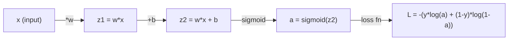
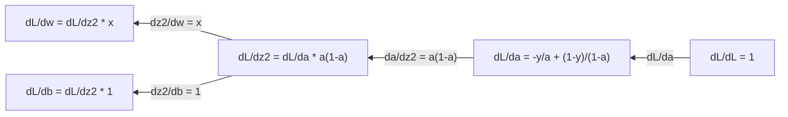
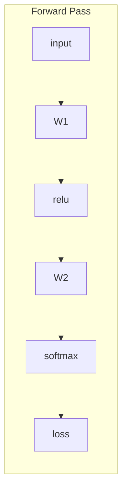
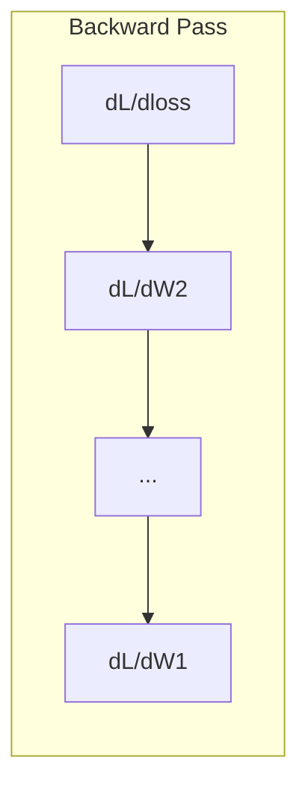

# Calculus for Machine Learning

> 衍生品告诉你哪条路是下坡路。这就是神经网络需要学习的全部内容。

** 类型：** 学习
** 语言：** Python
** 先决条件：** 第1阶段，课程01-03
** 时间：** ~60分钟

## Learning Objectives

- 计算常见ML函数（x2、sigmoid、交叉-）的数值和解析求导
- 从头开始实施梯度下降，以最小化1D和2D中的损失函数
- 推导线性回归模型的梯度并通过手动权重更新对其进行训练
- 解释海森矩阵、泰勒系列逼近及其与优化方法的联系

## The Problem

你有一个具有数百万权重的神经网络。每个重物都是一个旋钮。您需要弄清楚将每个旋钮转动的方向，以使模型稍微减少错误。微积分为您指明了方向。

如果没有微积分，训练神经网络将意味着尝试随机变化并希望取得最好的结果。对于衍生品，您可以确切地知道每个权重如何影响误差。每次你都以正确的方式转动每个旋钮。

## The Concept

### What is a derivative?

衍生品衡量变化率。对于函数y = f（x），求导f '（x）告诉您：如果您轻推x一点，y会改变多少？

从几何角度来说，求导是一点处的直线的倾斜度。

**f（x）= x2：**

| X | f（x） | f '（x）（斜坡） |
|---|------|---------------|
| 0 | 0 | 0（扁平，底部） |
| 1 | 1 | 2 |
| 2 | 4 | 4（该点的直线坡） |
| 3 | 9 | 6 |

当x=2时，斜坡为4。如果将x向右移动一点点，y就会增加大约4倍。当x=0时，斜坡为0。你在碗的底部。

正式定义：

```
f'(x) = lim   f(x + h) - f(x)
        h->0  -----------------
                     h
```

在代码中，您跳过了限制，只需使用非常小的h。这是数字求导。

### Partial derivatives: one variable at a time

真实的函数有很多输入。神经网络损失取决于数千个权重。偏导使除一个之外的所有变量保持不变，然后对该变量进行求导。

```
f(x, y) = x^2 + 3xy + y^2

df/dx = 2x + 3y     (treat y as a constant)
df/dy = 3x + 2y     (treat x as a constant)
```

每个偏导的答案是：如果我只轻推这一个权重，损失会如何变化？

### The gradient: vector of all partial derivatives

梯度将每个偏导收集到一个载体中。对于函数f（x，y，z），梯度为：

```
grad f = [ df/dx, df/dy, df/dz ]
```

梯度指向最陡的上升方向。要最小化功能，请朝相反的方向走。

** f（x，y）= x#2 + y#2的等值线图：**

该功能形成以同心圆为轮廓线的碗状。最小值为（0，0）。

| 点 | f级 | - f级（下降方向） |
|-------|--------|----------------------------|
| （1，1） | [2，2]（上坡点，远离最小值） | [-2，-2]（下坡点，走向最小值） |
| （0，0） | [0，0]（平坦，最低） | [0，0] |

这是图片中的梯度下降。计算梯度，否定它，迈出一步。

### The connection to optimization

训练神经网络就是优化。您有一个损失函数L（w1，w2，.，wn）衡量模型的错误程度。您想将其最小化。

```
Gradient descent update rule:

  w_new = w_old - learning_rate * dL/dw

For every weight:
  1. Compute the partial derivative of loss with respect to that weight
  2. Subtract a small multiple of it from the weight
  3. Repeat
```

学习率控制步进大小。太大了，你就会过度。太小了你会爬。

** 损失景观（1D切片）：**

随着重量w的变化，损失函数L（w）形成具有峰和谷的曲线。

| 特征 | 描述 |
|---------|-------------|
| 全局最小 | 整个曲线上的最低点--最佳解决方案 |
| 局部最小 | 一个比邻近地区低但总体上不是最低的山谷 |
| 斜率 | 梯度下降从任何起点开始沿着斜坡下坡 |

梯度下降跟随斜坡下坡。它可能会陷入局部极小值，但在多维空间（数百万个权重）中，这很少是一个实际问题。

### Numerical vs analytical derivatives

有两种方法可以计算求导。

分析性：手工应用微积分规则。对于f（x）= x2，其衍生物为f '（x）= 2x。确切快了

数字：使用定义进行大致计算。计算f（x+h）和f（x-h）以获得微小的h，然后使用其差。

```
Numerical (central difference):

f'(x) ~= f(x + h) - f(x - h)
          -----------------------
                  2h

h = 0.0001 works well in practice
```

数字求导速度较慢，但适用于任何函数。分析衍生物速度很快，但需要您推导公式。神经网络框架使用第三种方法：自动求导，它机械地计算精确的求导。您会在第三阶段看到这一点。

### Derivatives by hand for simple functions

这些是您会在ML中反复看到的衍生品。

```
Function        Derivative       Used in
--------        ----------       -------
f(x) = x^2     f'(x) = 2x      Loss functions (MSE)
f(x) = wx + b  f'(w) = x        Linear layer (gradient w.r.t. weight)
                f'(b) = 1        Linear layer (gradient w.r.t. bias)
                f'(x) = w        Linear layer (gradient w.r.t. input)
f(x) = e^x     f'(x) = e^x     Softmax, attention
f(x) = ln(x)   f'(x) = 1/x     Cross-entropy loss
f(x) = 1/(1+e^-x)  f'(x) = f(x)(1-f(x))   Sigmoid activation
```

对于f（x）= x2：

```
f(x) = x^2    f'(x) = 2x

  x    f(x)   f'(x)   meaning
  -2    4      -4      slope tilts left (decreasing)
  -1    1      -2      slope tilts left (decreasing)
   0    0       0      flat (minimum!)
   1    1       2      slope tilts right (increasing)
   2    4       4      slope tilts right (increasing)
```

对于f（w）= wx + b，x=3，b=1：

```
f(w) = 3w + 1    f'(w) = 3

The derivative with respect to w is just x.
If x is big, a small change in w causes a big change in output.
```

### The chain rule

当组成函数时，连锁规则告诉您如何区分。

```
If y = f(g(x)), then dy/dx = f'(g(x)) * g'(x)

Example: y = (3x + 1)^2
  outer: f(u) = u^2       f'(u) = 2u
  inner: g(x) = 3x + 1    g'(x) = 3
  dy/dx = 2(3x + 1) * 3 = 6(3x + 1)
```

神经网络是功能链：输入->线性->激活->线性->激活->损失。反向传播是从输出到输入重复应用的连锁规则。这就是整个算法。

### The Hessian Matrix

梯度告诉您斜坡。黑森告诉你弯曲度。

黑森是二阶偏导的矩阵。对于函数f（x1，x2，.，SEN），黑森的条目（i，j）是：

```
H[i][j] = d^2f / (dx_i * dx_j)
```

对于二元函数f（x，y）：

```
H = | d^2f/dx^2    d^2f/dxdy |
    | d^2f/dydx    d^2f/dy^2 |
```

** 黑森人在临界点告诉您什么（梯度= 0）：**

| 黑森地产 | 意义 | 示例表面 |
|-----------------|---------|-----------------|
| 正值（所有特征值> 0） | 局部最小 | 碗朝上 |
| 负定（所有特征值< 0） | 局部最大值 | 碗朝下 |
| 不确定（混合特征值） | 鞍点 | 马鞍形状 |

** 示例：** f（x，y）= x#2-y#2（马鞍函数）

```
df/dx = 2x       df/dy = -2y
d^2f/dx^2 = 2    d^2f/dy^2 = -2    d^2f/dxdy = 0

H = | 2   0 |
    | 0  -2 |

Eigenvalues: 2 and -2 (one positive, one negative)
--> Saddle point at (0, 0)
```

与f（x，y）= x#2 + y#2（一个碗）相比：

```
H = | 2  0 |
    | 0  2 |

Eigenvalues: 2 and 2 (both positive)
--> Local minimum at (0, 0)
```

** 为什么黑森人在ML中很重要：**

牛顿的方法使用黑森法来采取比梯度下降更好的优化步骤。它不仅仅遵循斜坡，而是考虑了弯曲：

```
Newton's update:    w_new = w_old - H^(-1) * gradient
Gradient descent:   w_new = w_old - lr * gradient
```

牛顿的方法收敛得更快，因为海森“重新调整”了梯度--陡峭的方向得到更小的步长，平坦的方向得到更大的步长。

问题：对于具有N个参数的神经网络，Hessian是N x N。具有100万个参数的模型需要1万亿个条目的矩阵。这就是为什么我们使用近似值。

| 方法 | 它的用途 | 成本 | 收敛 |
|--------|-------------|------|-------------|
| 梯度下降 | 仅限第一衍生品 | 每步O（N） | 缓慢（线性） |
| 牛顿法 | 全黑森 | 每步O（N^3） | 快速（二次） |
| L-BFGS | 从梯度历史中估算黑森岛 | 每步O（N） | 中等（超线性） |
| 亚当 | 按参数自适应率（对角线黑森逼近） | 每步O（N） | 介质 |
| 自然梯度 | 费舍尔信息矩阵（统计黑森） | 每步O（N^2） | 快速 |

在实践中，Adam是深度学习的默认优化器。它通过跟踪每个参数的梯度的运行平均值和方差来廉价地逼近二阶信息。

### Taylor Series Approximation

任何光滑函数都可以用一个方程局部逼近：

```
f(x + h) = f(x) + f'(x)*h + (1/2)*f''(x)*h^2 + (1/6)*f'''(x)*h^3 + ...
```

包含的项越多，逼近效果就越好--但仅限于点x附近。

** 为什么泰勒系列对ML很重要：**

- ** 一阶泰勒=梯度下降。**当您使用f（x + h）~ f（x）+f '（x）*h时，您正在进行线性逼近。梯度下降最小化该线性模型以选择h = -lr * f '（x）。

- ** 二阶泰勒=牛顿方法。**使用f（x + h）~ f（x）+f '（x）*h +（1/2）* f ''（x）* h#39; 2，得到二次模型。将其最小化得到h = -f '（x）/f ''（x）--牛顿步。

- ** 损失功能设计。**均方误差和交叉信息是光滑的，这意味着它们的泰勒展开式表现良好。这不是意外。平稳的损失使优化可预测。

```
Approximation order    What it captures    Optimization method
-------------------    -----------------   -------------------
0th order (constant)   Just the value      Random search
1st order (linear)     Slope               Gradient descent
2nd order (quadratic)  Curvature           Newton's method
Higher orders          Finer structure     Rarely used in ML
```

关键见解：所有基于梯度的优化实际上是关于局部逼近损失函数并逐步逼近该逼近的最小值。

### Integrals in ML

衍生品告诉您变化率。积分计算累积--曲线下面积。

在ML中，您很少手工计算积分，但这个概念无处不在：

** 可能性。**对于密度p（x）的连续随机变量：
```
P(a < X < b) = integral from a to b of p(x) dx
```
a和b之间的概率密度曲线下面积是在该范围内着陆的概率。

** 预期值。**按概率加权的平均结果：
```
E[f(X)] = integral of f(x) * p(x) dx
```
数据分布上的期望损失是一个积分。训练最大限度地减少了这种经验近似。

**KL分歧。**衡量两种分布的不同程度：
```
KL(p || q) = integral of p(x) * log(p(x) / q(x)) dx
```
用于VAE、知识提炼和Bayesian推理。

** 规范化常数。**在Bayesian推理中：
```
p(w | data) = p(data | w) * p(w) / integral of p(data | w) * p(w) dw
```
分母是所有可能参数值的积分。它通常很棘手，这就是为什么我们使用MCMC和变分推理等逼近。

| 积分概念 | 它出现在ML中的位置 |
|-----------------|----------------------|
| 曲线下面积 | 密度函数的概率 |
| 预期值 | 损失功能、风险最小化 |
| KL散度 | VAE、政策优化、蒸馏 |
| 正常化 | Bayesian后验，softmax分母 |
| 边际似然 | 模型比较、证据下限（ELBO） |

### Multivariable Chain Rule in a Computation Graph

连锁规则不仅仅适用于行中的纯量函数。在神经网络中，变量散开并合并。以下是衍生品如何通过简单的正向传递：



向后传递计算从右到左的梯度：



每个箭头乘以局部求导。任何参数的梯度都是从损失到该参数的路径上所有局部求导的积。当路径分支和合并时，您将对贡献进行总和（多元链规则）。

这就是反向传播的全部内容：通过计算图系统应用的链规则，从输出到输入。

### The Jacobian matrix

当一个函数将一个载体映射到一个载体（例如神经网络层）时，它的衍生物就是一个矩阵。Jacobian包含每个输出相对于每个输入的每个偏导。

对于f：R & n -> R & m，雅可比J是m x n矩阵：

|  | X1 | X2 | ... | xn |
|---|---|---|---|---|
| F1 | DF 1/Dx 1 | DF 1/Dx 2 | ... | DF 1/dxon |
| F2 | df2/dx1 | df 2/dx 2 | ... | df2/dxn |
| ... | ... | ... | ... | ... |
| FM | dfm/dx1 | dfm/dx2 | ... | dfm/dxon |

您不会手工计算神经网络的Jacobian。PyTorch可以处理它。但知道它的存在可以帮助您理解反向传播中的形状：如果一个层将R ' n映射到R ' m，则其雅可比矩阵是m x n。梯度通过该矩阵的转置向后流动。

### Why this matters for neural networks

神经网络中的每个权重都有一个梯度。梯度告诉您如何调整重量以减少损失。





每次体重更新：
- ' W1 = W1 - lr * dL/dW1 '
- ' W2 = W2 - lr * dL/dW2 '

向前传递计算预测和损失。向后传递计算相对于每个重量的损失梯度。然后每一个重量都会向下走一小步。重复数百万个步骤。这就是深度学习。

## Build It

### Step 1: Numerical derivative from scratch

```python
def numerical_derivative(f, x, h=1e-7):
    return (f(x + h) - f(x - h)) / (2 * h)

def f(x):
    return x ** 2

for x in [-2, -1, 0, 1, 2]:
    numerical = numerical_derivative(f, x)
    analytical = 2 * x
    print(f"x={x:2d}  f'(x) numerical={numerical:.6f}  analytical={analytical:.1f}")
```

数字求导与分析求导匹配到小数点后许多位。

### Step 2: Partial derivatives and gradients

```python
def numerical_gradient(f, point, h=1e-7):
    gradient = []
    for i in range(len(point)):
        point_plus = list(point)
        point_minus = list(point)
        point_plus[i] += h
        point_minus[i] -= h
        partial = (f(point_plus) - f(point_minus)) / (2 * h)
        gradient.append(partial)
    return gradient

def f_multi(point):
    x, y = point
    return x**2 + 3*x*y + y**2

grad = numerical_gradient(f_multi, [1.0, 2.0])
print(f"Numerical gradient at (1,2): {[f'{g:.4f}' for g in grad]}")
print(f"Analytical gradient at (1,2): [2*1+3*2, 3*1+2*2] = [{2*1+3*2}, {3*1+2*2}]")
```

### Step 3: Gradient descent to find the minimum of f(x) = x^2

```python
x = 5.0
lr = 0.1
for step in range(20):
    grad = 2 * x
    x = x - lr * grad
    print(f"step {step:2d}  x={x:8.4f}  f(x)={x**2:10.6f}")
```

从x=5开始，每一步都更接近x=0（最小值）。

### Step 4: Gradient descent on a 2D function

```python
def f_2d(point):
    x, y = point
    return x**2 + y**2

point = [4.0, 3.0]
lr = 0.1
for step in range(30):
    grad = numerical_gradient(f_2d, point)
    point = [p - lr * g for p, g in zip(point, grad)]
    loss = f_2d(point)
    if step % 5 == 0 or step == 29:
        print(f"step {step:2d}  point=({point[0]:7.4f}, {point[1]:7.4f})  f={loss:.6f}")
```

### Step 5: Comparing numerical and analytical derivatives

```python
import math

test_functions = [
    ("x^2",      lambda x: x**2,          lambda x: 2*x),
    ("x^3",      lambda x: x**3,          lambda x: 3*x**2),
    ("sin(x)",   lambda x: math.sin(x),   lambda x: math.cos(x)),
    ("e^x",      lambda x: math.exp(x),   lambda x: math.exp(x)),
    ("1/x",      lambda x: 1/x,           lambda x: -1/x**2),
]

x = 2.0
print(f"{'Function':<12} {'Numerical':>12} {'Analytical':>12} {'Error':>12}")
print("-" * 50)
for name, f, df in test_functions:
    num = numerical_derivative(f, x)
    ana = df(x)
    err = abs(num - ana)
    print(f"{name:<12} {num:12.6f} {ana:12.6f} {err:12.2e}")
```

### Step 6: Computing the Hessian numerically

```python
def hessian_2d(f, x, y, h=1e-5):
    fxx = (f(x + h, y) - 2 * f(x, y) + f(x - h, y)) / (h ** 2)
    fyy = (f(x, y + h) - 2 * f(x, y) + f(x, y - h)) / (h ** 2)
    fxy = (f(x + h, y + h) - f(x + h, y - h) - f(x - h, y + h) + f(x - h, y - h)) / (4 * h ** 2)
    return [[fxx, fxy], [fxy, fyy]]

def saddle(x, y):
    return x ** 2 - y ** 2

def bowl(x, y):
    return x ** 2 + y ** 2

H_saddle = hessian_2d(saddle, 0.0, 0.0)
H_bowl = hessian_2d(bowl, 0.0, 0.0)
print(f"Saddle Hessian: {H_saddle}")  # [[2, 0], [0, -2]] -- mixed signs
print(f"Bowl Hessian:   {H_bowl}")    # [[2, 0], [0, 2]]  -- both positive
```

鞍函数的黑森函数具有特征值2和-2（混合符号，确认鞍点）。碗的特征值2和2（均为正值，确认最小值）。

### Step 7: Taylor approximation in action

```python
import math

def taylor_approx(f, f_prime, f_double_prime, x0, h, order=2):
    result = f(x0)
    if order >= 1:
        result += f_prime(x0) * h
    if order >= 2:
        result += 0.5 * f_double_prime(x0) * h ** 2
    return result

x0 = 0.0
for h in [0.1, 0.5, 1.0, 2.0]:
    true_val = math.sin(h)
    t1 = taylor_approx(math.sin, math.cos, lambda x: -math.sin(x), x0, h, order=1)
    t2 = taylor_approx(math.sin, math.cos, lambda x: -math.sin(x), x0, h, order=2)
    print(f"h={h:.1f}  sin(h)={true_val:.4f}  order1={t1:.4f}  order2={t2:.4f}")
```

在x 0 =0附近，sin（x）~ x（一阶Taylor）。该近似对于小h是极好的，但对于大h则失效。这就是为什么梯度下降在小学习率下效果最好的原因--每一步都假设线性近似是准确的。

### Step 8: Why this matters for a neural network

```python
import random

random.seed(42)

w = random.gauss(0, 1)
b = random.gauss(0, 1)
lr = 0.01

xs = [1.0, 2.0, 3.0, 4.0, 5.0]
ys = [3.0, 5.0, 7.0, 9.0, 11.0]

for epoch in range(200):
    total_loss = 0
    dw = 0
    db = 0
    for x, y in zip(xs, ys):
        pred = w * x + b
        error = pred - y
        total_loss += error ** 2
        dw += 2 * error * x
        db += 2 * error
    dw /= len(xs)
    db /= len(xs)
    total_loss /= len(xs)
    w -= lr * dw
    b -= lr * db
    if epoch % 40 == 0 or epoch == 199:
        print(f"epoch {epoch:3d}  w={w:.4f}  b={b:.4f}  loss={total_loss:.6f}")

print(f"\nLearned: y = {w:.2f}x + {b:.2f}")
print(f"Actual:  y = 2x + 1")
```

每个基于梯度的训练循环都遵循这种模式：预测、计算损失、计算梯度、更新权重。

## Use It

使用NumPy，相同的操作更快、更简洁：

```python
import numpy as np

x = np.array([1, 2, 3, 4, 5], dtype=float)
y = np.array([3, 5, 7, 9, 11], dtype=float)

w, b = np.random.randn(), np.random.randn()
lr = 0.01

for epoch in range(200):
    pred = w * x + b
    error = pred - y
    loss = np.mean(error ** 2)
    dw = np.mean(2 * error * x)
    db = np.mean(2 * error)
    w -= lr * dw
    b -= lr * db

print(f"Learned: y = {w:.2f}x + {b:.2f}")
```

您刚刚从头开始建立了梯度下降。PyTorch自动执行梯度计算，但更新循环相同。

## Exercises

1. 使用调用两次的“numeric_derival”实现“numeric_second_derival（f，x）”。验证x=2时x3的二阶求导是否为12。
2. 使用梯度下降法找到f（x，y）=（x - 3）#2+（y + 1）#2的最小值。从（0，0）开始。答案应该收敛到（3，-1）。
3. 为梯度下降循环添加动量：保持累积过去梯度的速度载体。比较f（x）= x#4 - 3x#2上有动量和没有动量的收敛速度。

## Key Terms

| Term | What people say | 它实际上意味着什么 |
|------|----------------|----------------------|
| 衍生物 | "The slope" | The rate of change of a function at a point. Tells you how much the output changes per unit change in input. |
| Partial derivative | “一个变量的衍生物” | 对于一个变量的求导，而所有其他变量保持不变。 |
| Gradient | "Direction of steepest ascent" | 所有偏导的一个载体。指向功能增加最快的方向。 |
| 梯度下降 | "Go downhill" | Subtract the gradient (times a learning rate) from the parameters to reduce the loss. The core of neural network training. |
| Learning rate | “步骤大小” | 控制每个梯度下降步骤的大小的一个纯量。太大：分歧。太小：慢慢收敛。 |
| Chain rule | “乘以衍生品” | 区分组合函数的规则：DF/Dx = DF/dg * dg/Dx。反向传播的数学基础。 |
| Jacobian | "Matrix of derivatives" | 当函数将载体映射到载体时，雅可比矩阵是输出相对于输入的所有偏导的矩阵。 |
| 数值导数 | "Finite differences" | Approximating a derivative by evaluating the function at two nearby points and computing the slope between them. |
| 反向传播 | “反向模式自动区分” | Computing gradients layer by layer from output to input using the chain rule. How neural networks learn. |
| Hessian | “二阶导数矩阵” | The matrix of all second-order partial derivatives. Describes the curvature of a function. Positive definite Hessian at a critical point means local minimum. |
| Taylor series | “多项逼近” | 使用函数的求导逼近一点附近的函数：f（x+h）~ f（x）+f '（x）h +（1/2）f ''（x）h2 +.理解梯度下降和牛顿方法为何有效的基础。 |
| Integral | “曲线下面积” | 一个量在一定范围内的积累。在ML中，积分定义了概率、期望值和KL偏差。 |

## Further Reading

- [3Blue1Brown: Essence of Calculus](https://www.3blue1brown.com/topics/calculus) - visual intuition for derivatives, integrals, and the chain rule
- [斯坦福CS231 n：反向传播]（https：//cs231n.github.io/optimization-2/）-梯度如何流经神经网络层
