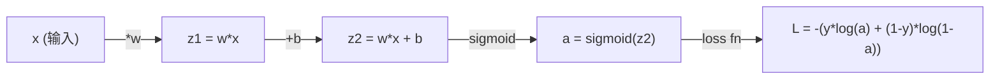
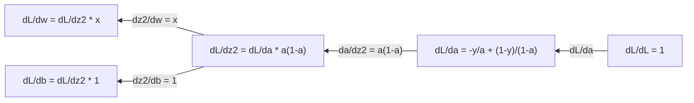
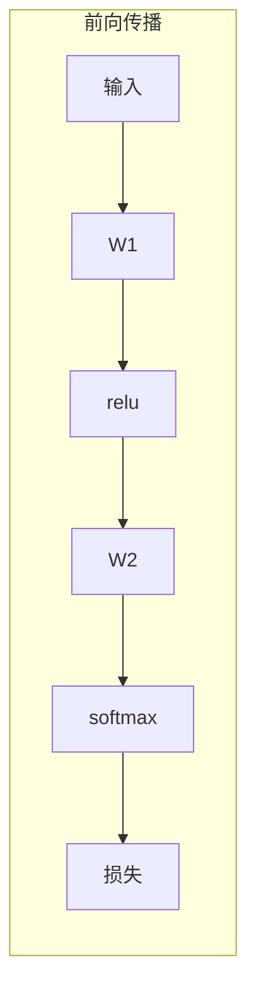
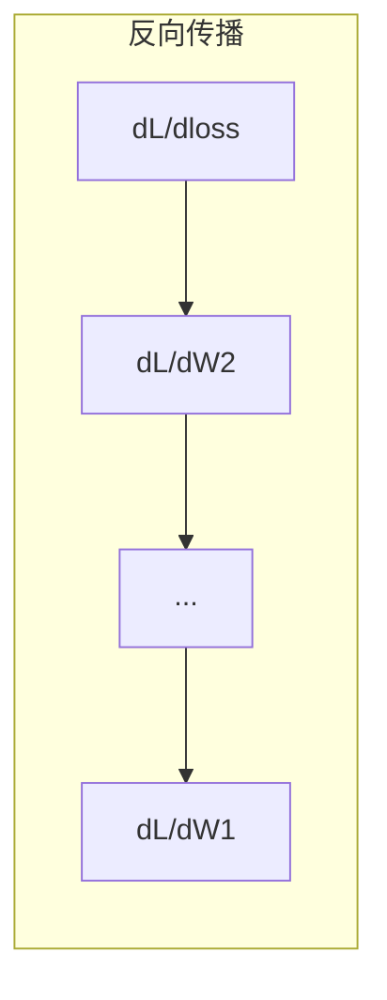

# 机器学习中的微积分（Calculus for Machine Learning）

> 导数告诉你哪边是下坡。神经网络只需要知道这个就能学习。

**类型：** 学习
**语言：** Python
**前置知识：** 阶段1，课程01-03
**时间：** 约60分钟

## 学习目标

- 计算机械学习常见函数（x²、sigmoid、交叉熵）的数值导数和解析导数
- 从头实现梯度下降法，最小化一维和二维损失函数
- 推导线性回归模型的梯度，并通过手动更新权重来训练模型
- 解释黑塞矩阵（Hessian Matrix）、泰勒级数近似及其与优化方法的联系

## 问题

你有一个包含数百万个权重的神经网络。每个权重都是一个旋钮。你需要弄清楚如何转动每一个旋钮，让模型稍微不那么出错。微积分给了你这个方向。

没有微积分，训练神经网络就意味着尝试随机变化并希望得到最好的结果。有了导数，你就知道每个权重如何影响误差。你每次都能正确地转动每个旋钮。

## 概念

### 什么是导数？

导数衡量变化率。对于函数 y = f(x)，导数 f'(x) 告诉你：如果你将 x 轻轻推一小点，y 会变化多少？

从几何角度来看，导数就是某点切线的斜率。

**f(x) = x²：**

| x | f(x) | f'(x)（斜率） |
|---|------|---------------|
| 0 | 0    | 0（平坦，在底部） |
| 1 | 1    | 2 |
| 2 | 4    | 4（此时切线的斜率） |
| 3 | 9    | 6 |

在 x=2 处，斜率为 4。如果你将 x 向右移动一小点，y 大约增加该值的 4 倍。在 x=0 处，斜率为 0。你位于碗的底部。

正式定义：

```
f'(x) = lim   f(x + h) - f(x)
        h->0  -----------------
                     h
```

在代码中，你跳过极限，只使用一个非常小的 h。这就是数值导数。

### 偏导数：一次只考虑一个变量

真正的函数有多个输入。神经网络的损失依赖于数千个权重。偏导数将所有其他变量固定，然后对其中一个变量求导。

```
f(x, y) = x² + 3xy + y²

df/dx = 2x + 3y     （将 y 视为常数）
df/dy = 3x + 2y     （将 x 视为常数）
```

每个偏导数回答了这样一个问题：如果我仅仅推动这一个权重，损失会如何变化？

### 梯度：所有偏导数的向量

梯度将每个偏导数收集到一个向量中。对于函数 f(x, y, z)，梯度为：

```
grad f = [ df/dx, df/dy, df/dz ]
```

梯度指向最陡上升的方向。为了最小化函数，朝相反的方向前进。

**f(x,y) = x² + y² 的等高线图：**

该函数形成碗状，等高线为同心圆。最小值在 (0, 0) 处。

| 点 | grad f | -grad f（下降方向） |
|-------|--------|----------------------------|
| (1, 1) | [2, 2]（指向山上，远离最小值） | [-2, -2]（指向山下，朝向最小值） |
| (0, 0) | [0, 0]（平坦，在最小值） | [0, 0] |

这就是梯度下降法的图示。计算梯度，取反，迈出一步。

### 与优化的联系

训练神经网络就是优化。你有一个损失函数 L(w₁, w₂, ..., wₙ)，衡量模型的错误程度。你想要最小化它。

```
梯度下降更新规则：

  w_new = w_old - learning_rate * dL/dw

对于每个权重：
  1. 计算损失对该权重的偏导数
  2. 从权重中减去其一个微小倍数
  3. 重复
```

学习率控制步长。太大则超调，太小则爬行。

**损失景观（一维切片）：**

损失函数 L(w) 形成一条曲线，随着权重 w 的变化出现峰和谷。

| 特征 | 描述 |
|---------|-------------|
| 全局最小值（Global minimum） | 整条曲线上的最低点 —— 最佳解 |
| 局部最小值（Local minimum） | 比相邻点低但不是全局最低的谷 |
| 斜率（Slope） | 梯度下降从任何起点沿着斜率向下 |

梯度下降沿着斜率向下。它可能会陷入局部最小值，但在高维空间（数百万个权重）中，这很少成为实际问题。

### 数值导数与解析导数

计算导数有两种方法。

解析：手动应用微积分规则。对于 f(x) = x²，导数为 f'(x) = 2x。精确，快速。

数值：使用定义进行近似。对非常小的 h 计算 f(x+h) 和 f(x-h)，然后利用差值。

```
数值导数（中心差分）：

f'(x) ~= f(x + h) - f(x - h)
          -----------------------
                  2h

实践中 h = 0.0001 效果良好
```

数值导数速度较慢，但适用于任何函数。解析导数速度快，但需要推导公式。神经网络框架使用第三种方法：自动微分（Automatic Differentiation），可以机械地计算精确导数。你将在阶段3中看到它。

### 手动求简单函数的导数

这些是你在机器学习中会反复看到的导数。

```
函数            导数              使用场景
--------        ----------       -------
f(x) = x²      f'(x) = 2x       损失函数（MSE）
f(x) = wx + b  f'(w) = x        线性层（关于权重的梯度）
                f'(b) = 1        线性层（关于偏置的梯度）
                f'(x) = w        线性层（关于输入的梯度）
f(x) = e^x     f'(x) = e^x      Softmax、注意力机制
f(x) = ln(x)   f'(x) = 1/x      交叉熵损失
f(x) = 1/(1+e^-x)  f'(x) = f(x)(1-f(x))  Sigmoid 激活函数
```

对于 f(x) = x²：

```
f(x) = x²    f'(x) = 2x

  x    f(x)   f'(x)   含义
  -2    4      -4      斜率向左倾斜（递减）
  -1    1      -2      斜率向左倾斜（递减）
   0    0       0      平坦（最小值！）
   1    1       2      斜率向右倾斜（递增）
   2    4       4      斜率向右倾斜（递增）
```

对于 f(w) = wx + b，其中 x=3, b=1：

```
f(w) = 3w + 1    f'(w) = 3

关于 w 的导数就是 x。
如果 x 很大，那么 w 的微小变化会导致输出的巨大变化。
```

### 链式法则

当函数复合时，链式法则告诉你如何求导。

```
如果 y = f(g(x))，则 dy/dx = f'(g(x)) * g'(x)

示例：y = (3x + 1)²
  外层：f(u) = u²       f'(u) = 2u
  内层：g(x) = 3x + 1    g'(x) = 3
  dy/dx = 2(3x + 1) * 3 = 6(3x + 1)
```

神经网络是函数链：输入 -> 线性 -> 激活 -> 线性 -> 激活 -> 损失。反向传播（Backpropagation）就是从输出到输入反复应用链式法则。这就是整个算法。

### 黑塞矩阵

梯度告诉你斜率，黑塞矩阵告诉你曲率。

黑塞矩阵是二阶偏导数的矩阵。对于函数 f(x₁, x₂, ..., xₙ)，黑塞矩阵的第 (i, j) 个元素为：

```
H[i][j] = d²f / (dx_i * dx_j)
```

对于二元函数 f(x, y)：

```
H = | d²f/dx²    d²f/dxdy |
    | d²f/dydx    d²f/dy² |
```

**在临界点（梯度为零）处，黑塞矩阵告诉你什么：**

| 黑塞矩阵性质 | 含义 | 示例曲面 |
|-----------------|---------|-----------------|
| 正定（所有特征值 > 0） | 局部最小值 | 开口向上的碗 |
| 负定（所有特征值 < 0） | 局部最大值 | 开口向下的碗 |
| 不定（特征值有正有负） | 鞍点 | 马鞍形状 |

**示例：** f(x, y) = x² - y²（鞍点函数）

```
df/dx = 2x       df/dy = -2y
d²f/dx² = 2     d²f/dy² = -2     d²f/dxdy = 0

H = | 2   0 |
    | 0  -2 |

特征值：2 和 -2（一正一负）
--> (0, 0) 处为鞍点
```

与 f(x, y) = x² + y²（碗状）对比：

```
H = | 2  0 |
    | 0  2 |

特征值：2 和 2（均为正）
--> (0, 0) 处为局部最小值
```

**为什么黑塞矩阵在机器学习中很重要：**

牛顿法使用黑塞矩阵进行比梯度下降更好的优化步骤。它不仅仅是跟随斜率，还考虑了曲率：

```
牛顿更新：   w_new = w_old - H⁻¹ * 梯度
梯度下降：   w_new = w_old - lr * 梯度
```

牛顿法收敛更快，因为黑塞矩阵“重新缩放”了梯度——陡峭的方向采取较小的步长，平坦的方向采取较大的步长。

问题是：对于有 N 个参数的神经网络，黑塞矩阵是 N×N 的。一个有一百万个参数的模型需要一个包含一万亿条目的矩阵。这就是为什么我们使用近似方法。

| 方法 | 使用什么 | 代价 | 收敛速度 |
|--------|-------------|------|-------------|
| 梯度下降 | 仅一阶导数 | 每步 O(N) | 慢（线性） |
| 牛顿法 | 完整黑塞矩阵 | 每步 O(N³) | 快（二次） |
| L-BFGS | 利用梯度历史近似黑塞矩阵 | 每步 O(N) | 中等（超线性） |
| Adam | 每个参数自适应学习率（对角黑塞矩阵近似） | 每步 O(N) | 中等 |
| 自然梯度 | Fisher 信息矩阵（统计黑塞矩阵） | 每步 O(N²) | 快 |

在实践中，Adam 是深度学习的默认优化器。它通过跟踪每个参数梯度的运行均值和方差，廉价地近似二阶信息。

### 泰勒级数近似

任何光滑函数都可以局部地用多项式近似：

```
f(x + h) = f(x) + f'(x)*h + (1/2)*f''(x)*h² + (1/6)*f'''(x)*h³ + ...
```

包含的项越多，近似越好——但仅在点 x 附近有效。

**为什么泰勒级数对机器学习很重要：**

- **一阶泰勒 = 梯度下降。** 当你使用 f(x + h) ~ f(x) + f'(x)*h 时，你是在进行线性近似。梯度下降最小化这个线性模型，选择 h = -lr * f'(x)。

- **二阶泰勒 = 牛顿法。** 使用 f(x + h) ~ f(x) + f'(x)*h + (1/2)*f''(x)*h²，你得到一个二次模型。最小化它得到 h = -f'(x)/f''(x) —— 牛顿步长。

- **损失函数设计。** 均方误差（MSE）和交叉熵（Cross-entropy）是光滑的，这意味着它们的泰勒展开性质良好。这并非偶然。光滑损失使优化可预测。

```
近似阶数             捕获的内容              优化方法
-------------------  -----------------      -------------------
0阶（常数）          仅值                    随机搜索
1阶（线性）          斜率                    梯度下降
2阶（二次）          曲率                    牛顿法
更高阶              更精细的结构             机器学习中很少使用
```

关键见解：所有基于梯度的优化实际上都是局部近似损失函数，然后走到该近似的最小值。

### 机器学习中的积分

导数告诉你变化率。积分计算累积量——曲线下的面积。

在机器学习中，你很少手动计算积分，但这个概念无处不在：

**概率。** 对于具有密度 p(x) 的连续随机变量：
```
P(a < X < b) = 从 a 到 b 的 p(x) dx 的积分
```
概率密度曲线下从 a 到 b 的面积就是落在此范围内的概率。

**期望值。** 按概率加权的平均结果：
```
E[f(X)] = f(x) * p(x) dx 的积分
```
数据分布上的期望损失就是一个积分。训练最小化其经验近似。

**KL 散度。** 衡量两个分布的不同程度：
```
KL(p || q) = p(x) * log(p(x) / q(x)) dx 的积分
```
用于变分自编码器（VAEs）、知识蒸馏和贝叶斯推断。

**归一化常数。** 在贝叶斯推断中：
```
p(w | data) = p(data | w) * p(w) / integral of p(data | w) * p(w) dw
```
分母是对所有可能的参数值进行的积分。它通常难以处理，这就是为什么我们使用马尔可夫链蒙特卡洛（MCMC）和变分推断（Variational Inference）等近似方法。

| 积分概念 | 在机器学习中的体现 |
|-----------------|----------------------|
| 曲线下的面积 | 根据密度函数求概率 |
| 期望值 | 损失函数、风险最小化 |
| KL 散度 | VAE、策略优化、知识蒸馏 |
| 归一化 | 贝叶斯后验、Softmax 分母 |
| 边际似然 | 模型比较、证据下界（ELBO） |

### 计算图中的多元链式法则

链式法则不仅适用于标量函数链。在神经网络中，变量会分叉和合并。下面以简单的前向传播为例展示导数如何流动：



反向传播从右向左计算梯度：



每个箭头乘以局部导数。任何参数的梯度就是从损失到该参数路径上所有局部导数的乘积。当路径分叉并合并时，你将贡献求和（多元链式法则）。

这就是反向传播的全部内容：在计算图中从输出到输入系统地应用链式法则。

### 雅可比矩阵

当一个函数将向量映射到向量（比如神经网络层）时，它的导数是一个矩阵。雅可比矩阵包含每个输出相对于每个输入的所有偏导数。

对于 f：Rⁿ -> Rᵐ，雅可比矩阵 J 是一个 m×n 的矩阵：

| | x₁ | x₂ | ... | xₙ |
|---|---|---|---|---|
| f₁ | df₁/dx₁ | df₁/dx₂ | ... | df₁/dxₙ |
| f₂ | df₂/dx₁ | df₂/dx₂ | ... | df₂/dxₙ |
| ... | ... | ... | ... | ... |
| fₘ | dfₘ/dx₁ | dfₘ/dx₂ | ... | dfₘ/dxₙ |

你不会手动为神经网络计算雅可比矩阵。PyTorch 会处理它。但知道它的存在有助于你理解反向传播中的形状：如果一个层将 Rⁿ 映射到 Rᵐ，它的雅可比矩阵是 m×n。梯度通过该矩阵的转置向后流动。

### 为什么这对神经网络重要

神经网络中的每个权重都会得到一个梯度。梯度告诉你如何调整该权重以减少损失。





每个权重更新：
- `W1 = W1 - lr * dL/dW1`
- `W2 = W2 - lr * dL/dW2`

前向传播计算预测和损失。反向传播计算损失相对于每个权重的梯度。然后每个权重沿着下坡方向迈出一小步。重复数百万步。这就是深度学习。

## 动手构建

### 第1步：从头实现数值导数

```