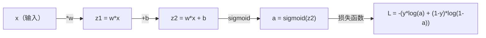
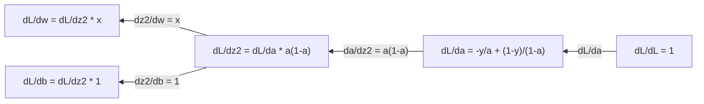
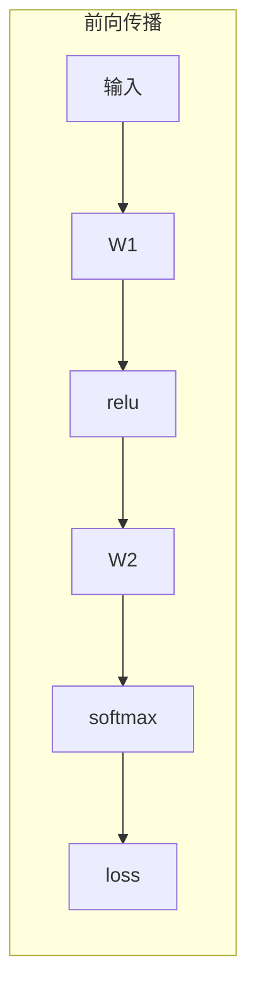
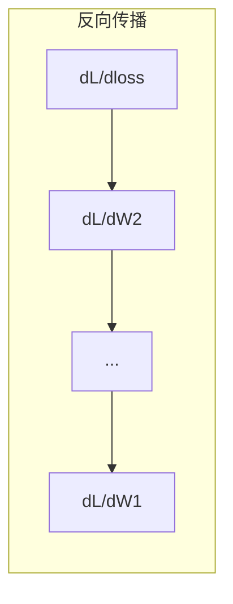

# 面向机器学习的微积分（Calculus for Machine Learning）

> 译注：本文译自同目录 [`en.md`](./en.md)。术语遵循仓根 [TRANSLATION_GUIDE.md](../../../../TRANSLATION_GUIDE.md)。

> 导数告诉你哪边是下坡。神经网络要学会东西，靠的就是这一点。

**Type:** Learn
**Language:** Python
**Prerequisites:** Phase 1, Lessons 01-03
**Time:** ~60 minutes

## 学习目标（Learning Objectives）

- 对常见 ML 函数（x^2、sigmoid、cross-entropy）计算数值导数和解析导数
- 从零实现 gradient descent（梯度下降），在 1D 和 2D 上最小化一个 loss function（损失函数）
- 推导 linear regression（线性回归）模型的 gradient，并通过手动更新权重来训练它
- 解释 Hessian（海森）矩阵、Taylor series（泰勒级数）近似，以及它们和优化方法的联系

## 问题（The Problem）

你有一个神经网络，里面有几百万个权重。每个权重都是一个旋钮。你需要弄明白：每一个旋钮要往哪个方向拧，才能让模型稍微少错一点。微积分给的就是这个方向。

没有微积分，训练神经网络就只能靠瞎试，撞大运。有了导数，你就清楚地知道每个权重对误差的影响。每次都能把每个旋钮拧对方向。

## 概念（The Concept）

### 什么是导数？（What is a derivative?）

导数衡量变化率。对于函数 y = f(x)，导数 f'(x) 告诉你：如果把 x 推动一个极小的量，y 会变多少？

从几何上看，导数就是某点切线的斜率。

**f(x) = x^2：**

| x | f(x) | f'(x)（斜率） |
|---|------|---------------|
| 0 | 0    | 0（平的，在谷底） |
| 1 | 1    | 2 |
| 2 | 4    | 4（该点切线斜率） |
| 3 | 9    | 6 |

在 x=2 处，斜率是 4。把 x 往右挪一点点，y 大约会增加这一点点的 4 倍。在 x=0 处，斜率是 0。你正坐在碗底。

形式定义：

```
f'(x) = lim   f(x + h) - f(x)
        h->0  -----------------
                     h
```

写代码时，你不取极限，直接用一个非常小的 h。这就是数值导数。

### 偏导数：一次只动一个变量（Partial derivatives: one variable at a time）

真实的函数有很多输入。一个神经网络的 loss 依赖于成千上万个权重。偏导数把除一个之外的所有变量都当作常数，再对那一个变量求导。

```
f(x, y) = x^2 + 3xy + y^2

df/dx = 2x + 3y     (treat y as a constant)
df/dy = 3x + 2y     (treat x as a constant)
```

每个偏导数回答的是：如果只推动这一个权重，loss 会怎么变？

### Gradient：所有偏导数组成的向量（The gradient: vector of all partial derivatives）

gradient（梯度）把每一个偏导数收集到一个向量里。对于函数 f(x, y, z)，gradient 是：

```
grad f = [ df/dx, df/dy, df/dz ]
```

gradient 指向最陡上升的方向。要最小化函数，朝相反方向走就行。

**f(x,y) = x^2 + y^2 的等高线图：**

这个函数构成一个碗状曲面，等高线是同心圆。最小值在 (0, 0)。

| 点 | grad f | -grad f（下降方向） |
|-------|--------|----------------------------|
| (1, 1) | [2, 2]（指向上坡，远离最小值） | [-2, -2]（指向下坡，朝向最小值） |
| (0, 0) | [0, 0]（平的，处于最小值） | [0, 0] |

这就是一张图说清楚的 gradient descent。计算 gradient，取负号，迈一步。

### 与优化的联系（The connection to optimization）

训练神经网络就是优化。你有一个 loss function L(w1, w2, ..., wn)，衡量模型有多错。你想把它最小化。

```
Gradient descent update rule:

  w_new = w_old - learning_rate * dL/dw

For every weight:
  1. Compute the partial derivative of loss with respect to that weight
  2. Subtract a small multiple of it from the weight
  3. Repeat
```

learning rate（学习率）控制步长。太大就会冲过头。太小就只能爬。

**Loss landscape（一维切片）：**

loss function L(w) 随权重 w 变化形成一条带山峰和山谷的曲线。

| 特征 | 描述 |
|---------|-------------|
| 全局最小值 | 整条曲线上最低的点——最优解 |
| 局部最小值 | 比邻近点更低，但不是整体最低的山谷 |
| 斜率 | gradient descent 从任意起点沿斜率向下走 |

gradient descent 沿斜率往下走。它可能会卡在局部最小值，但在高维空间里（数百万个权重），这在实践中很少是真问题。

### 数值导数 vs 解析导数（Numerical vs analytical derivatives）

求导数有两种方法。

解析法（Analytical）：用微积分规则手算。对 f(x) = x^2，导数是 f'(x) = 2x。精确，快。

数值法（Numerical）：用定义近似。在一个很小的 h 上计算 f(x+h) 和 f(x-h)，然后取差。

```
Numerical (central difference):

f'(x) ~= f(x + h) - f(x - h)
          -----------------------
                  2h

h = 0.0001 works well in practice
```

数值导数更慢，但对任何函数都管用。解析导数快，但你得自己推公式。神经网络框架用的是第三种：自动微分（automatic differentiation），机械地计算精确导数。这部分你会在 Phase 3 见到。

### 几个简单函数的手算导数（Derivatives by hand for simple functions）

下面这些导数你在 ML 里会反反复复看到。

```
Function        Derivative       Used in
--------        ----------       -------
f(x) = x^2     f'(x) = 2x      Loss functions (MSE)
f(x) = wx + b  f'(w) = x        Linear layer (gradient w.r.t. weight)
                f'(b) = 1        Linear layer (gradient w.r.t. bias)
                f'(x) = w        Linear layer (gradient w.r.t. input)
f(x) = e^x     f'(x) = e^x     Softmax, attention
f(x) = ln(x)   f'(x) = 1/x     Cross-entropy loss
f(x) = 1/(1+e^-x)  f'(x) = f(x)(1-f(x))   Sigmoid activation
```

对 f(x) = x^2：

```
f(x) = x^2    f'(x) = 2x

  x    f(x)   f'(x)   meaning
  -2    4      -4      slope tilts left (decreasing)
  -1    1      -2      slope tilts left (decreasing)
   0    0       0      flat (minimum!)
   1    1       2      slope tilts right (increasing)
   2    4       4      slope tilts right (increasing)
```

对 f(w) = wx + b，取 x=3, b=1：

```
f(w) = 3w + 1    f'(w) = 3

The derivative with respect to w is just x.
If x is big, a small change in w causes a big change in output.
```

### 链式法则（The chain rule）

当函数被复合在一起时，链式法则告诉你怎么求导。

```
If y = f(g(x)), then dy/dx = f'(g(x)) * g'(x)

Example: y = (3x + 1)^2
  outer: f(u) = u^2       f'(u) = 2u
  inner: g(x) = 3x + 1    g'(x) = 3
  dy/dx = 2(3x + 1) * 3 = 6(3x + 1)
```

神经网络就是一连串函数：input -> linear -> activation -> linear -> activation -> loss。backpropagation（反向传播）就是从输出到输入反复应用链式法则。整个算法就是这么回事。

### Hessian 矩阵（The Hessian Matrix）

gradient 告诉你斜率。Hessian 告诉你曲率。

Hessian 是二阶偏导数构成的矩阵。对函数 f(x1, x2, ..., xn)，Hessian 的第 (i, j) 项是：

```
H[i][j] = d^2f / (dx_i * dx_j)
```

对于二变量函数 f(x, y)：

```
H = | d^2f/dx^2    d^2f/dxdy |
    | d^2f/dydx    d^2f/dy^2 |
```

**Hessian 在临界点（gradient = 0 的点）告诉你什么：**

| Hessian 性质 | 含义 | 对应曲面 |
|-----------------|---------|-----------------|
| 正定（所有特征值 > 0） | 局部最小值 | 朝上的碗 |
| 负定（所有特征值 < 0） | 局部最大值 | 朝下的碗 |
| 不定（特征值正负混合） | 鞍点 | 马鞍形 |

**例子：** f(x, y) = x^2 - y^2（一个鞍函数）

```
df/dx = 2x       df/dy = -2y
d^2f/dx^2 = 2    d^2f/dy^2 = -2    d^2f/dxdy = 0

H = | 2   0 |
    | 0  -2 |

Eigenvalues: 2 and -2 (one positive, one negative)
--> Saddle point at (0, 0)
```

对照 f(x, y) = x^2 + y^2（一个碗）：

```
H = | 2  0 |
    | 0  2 |

Eigenvalues: 2 and 2 (both positive)
--> Local minimum at (0, 0)
```

**Hessian 在 ML 里为什么重要：**

牛顿法用 Hessian 来走出比 gradient descent 更聪明的优化步子。它不只是顺着斜率走，还考虑了曲率：

```
Newton's update:    w_new = w_old - H^(-1) * gradient
Gradient descent:   w_new = w_old - lr * gradient
```

牛顿法收敛更快，因为 Hessian 把 gradient 重新缩放了——陡峭方向走小步，平坦方向走大步。

代价：对于一个有 N 个参数的神经网络，Hessian 是 N x N。一个百万参数的模型需要一个有一万亿项的矩阵。所以我们才用近似方法。

| 方法 | 用到什么 | 单步代价 | 收敛速度 |
|--------|-------------|------|-------------|
| Gradient descent | 只用一阶导数 | 每步 O(N) | 慢（线性） |
| 牛顿法 | 完整 Hessian | 每步 O(N^3) | 快（二次） |
| L-BFGS | 用 gradient 历史近似 Hessian | 每步 O(N) | 中等（超线性） |
| Adam | 每参数自适应学习率（对角 Hessian 近似） | 每步 O(N) | 中等 |
| 自然梯度 | Fisher 信息矩阵（统计意义上的 Hessian） | 每步 O(N^2) | 快 |

实际上，Adam 是深度学习的默认 optimizer。它通过逐参数追踪 gradient 的滑动均值与方差，廉价地近似二阶信息。

### Taylor 级数近似（Taylor Series Approximation）

任何光滑函数都可以在局部用一个多项式来近似：

```
f(x + h) = f(x) + f'(x)*h + (1/2)*f''(x)*h^2 + (1/6)*f'''(x)*h^3 + ...
```

包括的项越多，近似越好——但只在 x 附近成立。

**Taylor 级数对 ML 的意义：**

- **一阶 Taylor = gradient descent。** 当你用 f(x + h) ~ f(x) + f'(x)*h，你在做线性近似。gradient descent 最小化这个线性模型，从而选出 h = -lr * f'(x)。

- **二阶 Taylor = 牛顿法。** 用 f(x + h) ~ f(x) + f'(x)*h + (1/2)*f''(x)*h^2，得到一个二次模型。最小化它得到 h = -f'(x)/f''(x)——也就是牛顿步。

- **Loss function 的设计。** MSE 和 cross-entropy 都很光滑，意味着它们的 Taylor 展开很乖。这不是巧合。光滑的 loss 让优化变得可预测。

```
Approximation order    What it captures    Optimization method
-------------------    -----------------   -------------------
0th order (constant)   Just the value      Random search
1st order (linear)     Slope               Gradient descent
2nd order (quadratic)  Curvature           Newton's method
Higher orders          Finer structure     Rarely used in ML
```

关键洞察：所有基于 gradient 的优化，本质上都是在局部近似 loss function，再走到那个近似的最小值上。

### ML 中的积分（Integrals in ML）

导数告诉你变化率。积分计算累积——曲线下的面积。

在 ML 里你很少手算积分，但概念无处不在：

**概率。** 对一个连续随机变量，密度为 p(x)：
```
P(a < X < b) = integral from a to b of p(x) dx
```
概率密度曲线在 a 到 b 之间的面积，就是落入该区间的概率。

**期望值。** 用概率加权的平均结果：
```
E[f(X)] = integral of f(x) * p(x) dx
```
数据分布上的期望损失就是一个积分。训练做的是最小化这个积分的经验近似。

**KL 散度。** 衡量两个分布有多不同：
```
KL(p || q) = integral of p(x) * log(p(x) / q(x)) dx
```
用在 VAE、知识蒸馏、Bayes 推断里。

**归一化常数。** 在 Bayes 推断里：
```
p(w | data) = p(data | w) * p(w) / integral of p(data | w) * p(w) dw
```
分母是对所有可能的参数值积分。它通常没法解析算出，所以我们用 MCMC、变分推断这种近似方法。

| 积分概念 | 在 ML 里出现的位置 |
|-----------------|----------------------|
| 曲线下面积 | 由密度函数得到的概率 |
| 期望值 | loss function、风险最小化 |
| KL 散度 | VAE、策略优化、蒸馏 |
| 归一化 | Bayes 后验、softmax 分母 |
| 边际似然 | 模型比较、证据下界（ELBO） |

### 计算图上的多元链式法则（Multivariable Chain Rule in a Computation Graph）

链式法则不只适用于一条线上的标量函数。在神经网络里，变量会分叉、汇合。下面是一个简单前向传播中导数怎么流动的：



反向传播从右到左计算 gradient：



每条箭头都乘以局部导数。任意参数的 gradient，就是从 loss 到该参数路径上所有局部导数的乘积。当路径分叉再汇合时，把各路贡献相加（多元链式法则）。

backpropagation 就是这么回事：在一个计算图上，从输出到输入系统地应用链式法则。

### Jacobian 矩阵（The Jacobian matrix）

当一个函数把向量映射到向量（比如一个神经网络层），它的导数是个矩阵。Jacobian（雅可比）包含每个输出对每个输入的偏导数。

对 f: R^n -> R^m，Jacobian J 是一个 m x n 矩阵：

| | x1 | x2 | ... | xn |
|---|---|---|---|---|
| f1 | df1/dx1 | df1/dx2 | ... | df1/dxn |
| f2 | df2/dx1 | df2/dx2 | ... | df2/dxn |
| ... | ... | ... | ... | ... |
| fm | dfm/dx1 | dfm/dx2 | ... | dfm/dxn |

神经网络里你不会手算 Jacobian。PyTorch 替你处理。但知道它的存在能帮你理解 backpropagation 里的形状：如果一层把 R^n 映射到 R^m，它的 Jacobian 就是 m x n。gradient 反向流动时穿过这个矩阵的转置。

### 这一切对神经网络为什么重要（Why this matters for neural networks）

神经网络里每个权重都拿到一个 gradient。gradient 告诉你怎么调这个权重才能减小 loss。





每次权重更新：
- `W1 = W1 - lr * dL/dW1`
- `W2 = W2 - lr * dL/dW2`

前向传播算预测值和 loss。反向传播算 loss 对每个权重的 gradient。然后每个权重朝下坡走一小步。重复几百万步。这就是深度学习。

## 动手实现（Build It）

### Step 1: 从零写一个数值导数

```python
def numerical_derivative(f, x, h=1e-7):
    return (f(x + h) - f(x - h)) / (2 * h)

def f(x):
    return x ** 2

for x in [-2, -1, 0, 1, 2]:
    numerical = numerical_derivative(f, x)
    analytical = 2 * x
    print(f"x={x:2d}  f'(x) numerical={numerical:.6f}  analytical={analytical:.1f}")
```

数值导数能在很多位小数上和解析导数对得上。

### Step 2: 偏导数和 gradient

```python
def numerical_gradient(f, point, h=1e-7):
    gradient = []
    for i in range(len(point)):
        point_plus = list(point)
        point_minus = list(point)
        point_plus[i] += h
        point_minus[i] -= h
        partial = (f(point_plus) - f(point_minus)) / (2 * h)
        gradient.append(partial)
    return gradient

def f_multi(point):
    x, y = point
    return x**2 + 3*x*y + y**2

grad = numerical_gradient(f_multi, [1.0, 2.0])
print(f"Numerical gradient at (1,2): {[f'{g:.4f}' for g in grad]}")
print(f"Analytical gradient at (1,2): [2*1+3*2, 3*1+2*2] = [{2*1+3*2}, {3*1+2*2}]")
```

### Step 3: 用 gradient descent 找 f(x) = x^2 的最小值

```python
x = 5.0
lr = 0.1
for step in range(20):
    grad = 2 * x
    x = x - lr * grad
    print(f"step {step:2d}  x={x:8.4f}  f(x)={x**2:10.6f}")
```

从 x=5 出发，每一步都更靠近 x=0（最小值）。

### Step 4: 在二维函数上做 gradient descent

```python
def f_2d(point):
    x, y = point
    return x**2 + y**2

point = [4.0, 3.0]
lr = 0.1
for step in range(30):
    grad = numerical_gradient(f_2d, point)
    point = [p - lr * g for p, g in zip(point, grad)]
    loss = f_2d(point)
    if step % 5 == 0 or step == 29:
        print(f"step {step:2d}  point=({point[0]:7.4f}, {point[1]:7.4f})  f={loss:.6f}")
```

### Step 5: 对比数值导数和解析导数

```python
import math

test_functions = [
    ("x^2",      lambda x: x**2,          lambda x: 2*x),
    ("x^3",      lambda x: x**3,          lambda x: 3*x**2),
    ("sin(x)",   lambda x: math.sin(x),   lambda x: math.cos(x)),
    ("e^x",      lambda x: math.exp(x),   lambda x: math.exp(x)),
    ("1/x",      lambda x: 1/x,           lambda x: -1/x**2),
]

x = 2.0
print(f"{'Function':<12} {'Numerical':>12} {'Analytical':>12} {'Error':>12}")
print("-" * 50)
for name, f, df in test_functions:
    num = numerical_derivative(f, x)
    ana = df(x)
    err = abs(num - ana)
    print(f"{name:<12} {num:12.6f} {ana:12.6f} {err:12.2e}")
```

### Step 6: 用数值法计算 Hessian

```python
def hessian_2d(f, x, y, h=1e-5):
    fxx = (f(x + h, y) - 2 * f(x, y) + f(x - h, y)) / (h ** 2)
    fyy = (f(x, y + h) - 2 * f(x, y) + f(x, y - h)) / (h ** 2)
    fxy = (f(x + h, y + h) - f(x + h, y - h) - f(x - h, y + h) + f(x - h, y - h)) / (4 * h ** 2)
    return [[fxx, fxy], [fxy, fyy]]

def saddle(x, y):
    return x ** 2 - y ** 2

def bowl(x, y):
    return x ** 2 + y ** 2

H_saddle = hessian_2d(saddle, 0.0, 0.0)
H_bowl = hessian_2d(bowl, 0.0, 0.0)
print(f"Saddle Hessian: {H_saddle}")  # [[2, 0], [0, -2]] -- mixed signs
print(f"Bowl Hessian:   {H_bowl}")    # [[2, 0], [0, 2]]  -- both positive
```

鞍函数的 Hessian 特征值是 2 和 -2（正负混合，确认是鞍点）。碗的特征值是 2 和 2（都为正，确认是最小值）。

### Step 7: Taylor 近似实战

```python
import math

def taylor_approx(f, f_prime, f_double_prime, x0, h, order=2):
    result = f(x0)
    if order >= 1:
        result += f_prime(x0) * h
    if order >= 2:
        result += 0.5 * f_double_prime(x0) * h ** 2
    return result

x0 = 0.0
for h in [0.1, 0.5, 1.0, 2.0]:
    true_val = math.sin(h)
    t1 = taylor_approx(math.sin, math.cos, lambda x: -math.sin(x), x0, h, order=1)
    t2 = taylor_approx(math.sin, math.cos, lambda x: -math.sin(x), x0, h, order=2)
    print(f"h={h:.1f}  sin(h)={true_val:.4f}  order1={t1:.4f}  order2={t2:.4f}")
```

在 x0=0 附近，sin(x) ~ x（一阶 Taylor）。当 h 很小时近似非常好，h 一大就崩。这也是为什么 gradient descent 配小 learning rate 才好用——每一步都假设线性近似还成立。

### Step 8: 这些对神经网络为什么重要

```python
import random

random.seed(42)

w = random.gauss(0, 1)
b = random.gauss(0, 1)
lr = 0.01

xs = [1.0, 2.0, 3.0, 4.0, 5.0]
ys = [3.0, 5.0, 7.0, 9.0, 11.0]

for epoch in range(200):
    total_loss = 0
    dw = 0
    db = 0
    for x, y in zip(xs, ys):
        pred = w * x + b
        error = pred - y
        total_loss += error ** 2
        dw += 2 * error * x
        db += 2 * error
    dw /= len(xs)
    db /= len(xs)
    total_loss /= len(xs)
    w -= lr * dw
    b -= lr * db
    if epoch % 40 == 0 or epoch == 199:
        print(f"epoch {epoch:3d}  w={w:.4f}  b={b:.4f}  loss={total_loss:.6f}")

print(f"\nLearned: y = {w:.2f}x + {b:.2f}")
print(f"Actual:  y = 2x + 1")
```

每个基于 gradient 的训练循环都长这个样子：predict、算 loss、算 gradient、更新权重。

## 用起来（Use It）

用 NumPy，同样的操作更快也更精炼：

```python
import numpy as np

x = np.array([1, 2, 3, 4, 5], dtype=float)
y = np.array([3, 5, 7, 9, 11], dtype=float)

w, b = np.random.randn(), np.random.randn()
lr = 0.01

for epoch in range(200):
    pred = w * x + b
    error = pred - y
    loss = np.mean(error ** 2)
    dw = np.mean(2 * error * x)
    db = np.mean(2 * error)
    w -= lr * dw
    b -= lr * db

print(f"Learned: y = {w:.2f}x + {b:.2f}")
```

你刚刚从零搭出了 gradient descent。PyTorch 把 gradient 计算自动化了，但更新循环长得一模一样。

## 练习（Exercises）

1. 实现 `numerical_second_derivative(f, x)`，方法是把 `numerical_derivative` 调两次。验证 x^3 在 x=2 处的二阶导数是 12。
2. 用 gradient descent 找 f(x, y) = (x - 3)^2 + (y + 1)^2 的最小值。从 (0, 0) 出发。答案应该收敛到 (3, -1)。
3. 在 gradient descent 循环里加上动量：维护一个累积过往 gradient 的速度向量。在 f(x) = x^4 - 3x^2 上对比有无动量的收敛速度。

## 关键术语（Key Terms）

| 术语 | 大家会怎么说 | 它实际上是什么 |
|------|----------------|----------------------|
| 导数（Derivative） | "斜率" | 函数在某点的变化率。告诉你输入每变一单位，输出变多少。 |
| 偏导数（Partial derivative） | "对一个变量求导" | 把其他变量都当常数，对其中一个变量求导。 |
| Gradient | "最陡上升方向" | 所有偏导数组成的向量。指向函数增长最快的方向。 |
| Gradient descent | "往下坡走" | 把 gradient（乘以 learning rate）从参数中减去，从而减小 loss。神经网络训练的核心。 |
| Learning rate | "步长" | 控制每一步 gradient descent 走多大的标量。太大：发散。太小：收敛慢。 |
| 链式法则（Chain rule） | "把导数乘起来" | 复合函数求导规则：df/dx = df/dg * dg/dx。backpropagation 的数学基础。 |
| Jacobian | "导数矩阵" | 当函数把向量映射到向量时，Jacobian 是所有输出对所有输入的偏导数矩阵。 |
| 数值导数（Numerical derivative） | "有限差分" | 通过在两个相邻点上求值，再算斜率，来近似导数。 |
| Backpropagation | "反向模式自动微分" | 用链式法则从输出到输入逐层算 gradient。神经网络靠它学习。 |
| Hessian | "二阶导数矩阵" | 所有二阶偏导数构成的矩阵。描述函数的曲率。临界点处 Hessian 正定意味着局部最小值。 |
| Taylor 级数（Taylor series） | "多项式近似" | 用一个点处的导数来近似函数：f(x+h) ~ f(x) + f'(x)h + (1/2)f''(x)h^2 + ...。理解 gradient descent 和牛顿法为什么有效的基础。 |
| 积分（Integral） | "曲线下面积" | 一个量在某区间上的累积。在 ML 中，积分定义了概率、期望值和 KL 散度。 |

## 延伸阅读（Further Reading）

- [3Blue1Brown: Essence of Calculus](https://www.3blue1brown.com/topics/calculus) - 导数、积分和链式法则的可视化直觉
- [Stanford CS231n: Backpropagation](https://cs231n.github.io/optimization-2/) - gradient 如何在神经网络层间流动
