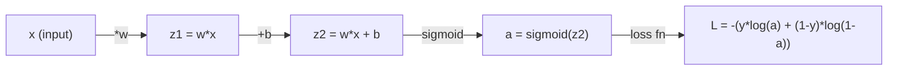
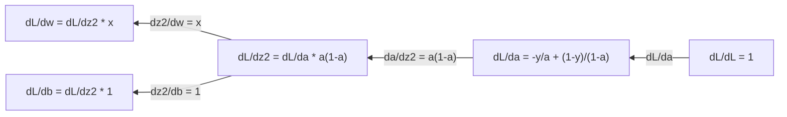
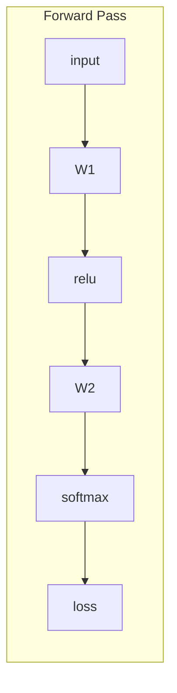
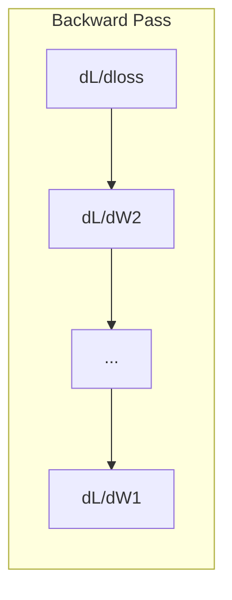

# 機器學習中的微積分

> 導數告訴你哪一邊是下坡。神經網路要學習，需要的就只有這個。

**類型：** 學習
**程式語言：** Python
**先修單元：** 階段 1 · 單元 01-03
**時間：** 約 60 分鐘

## 學習目標

- 為常見的 ML 函式計算數值導數與解析導數（x^2、sigmoid、交叉熵）
- 從零實作梯度下降，在一維與二維中最小化一個損失函式
- 推導線性迴歸模型的梯度，並用手動更新權重的方式訓練它
- 說明 Hessian 矩陣、泰勒級數近似，以及它們和最佳化方法的關聯

## 問題所在

你有一個帶著數百萬個權重的神經網路。每個權重都是一個旋鈕。你得弄清楚每一個旋鈕要往哪個方向轉，才能讓模型錯得少一點。微積分就是給你那個方向的東西。

沒有微積分，訓練神經網路就等於隨機亂改、然後祈禱有好結果。有了導數，你就確切知道每個權重如何影響誤差。每一次、每一個旋鈕，你都轉在對的方向上。

## 核心概念

### 什麼是導數？

導數衡量的是變化率。對函式 y = f(x) 來說，導數 f'(x) 告訴你：如果把 x 推動一點點，y 會變多少？

從幾何上看，導數就是某一點上切線的斜率。

**f(x) = x^2：**

| x | f(x) | f'(x)（斜率） |
|---|------|---------------|
| 0 | 0    | 0（平的，在谷底） |
| 1 | 1    | 2 |
| 2 | 4    | 4（這一點上切線的斜率） |
| 3 | 9    | 6 |

在 x=2 處，斜率是 4。如果你把 x 往右挪一點點，y 會增加大約那個量的 4 倍。在 x=0 處，斜率是 0。你正位在碗的底部。

正式定義：

```
f'(x) = lim   f(x + h) - f(x)
        h->0  -----------------
                     h
```

在程式碼裡，你會跳過極限，直接用一個非常小的 h。這就是數值導數。

### 偏導數：一次只看一個變數

真實的函式有很多輸入。神經網路的損失取決於數千個權重。偏導數會把除了一個之外的所有變數都當成常數，然後對那一個變數取導數。

```
f(x, y) = x^2 + 3xy + y^2

df/dx = 2x + 3y     (treat y as a constant)
df/dy = 3x + 2y     (treat x as a constant)
```

每個偏導數回答的問題是：如果我只推動這一個權重，損失會怎麼變？

### 梯度：由所有偏導數組成的向量

梯度把每一個偏導數收進同一個向量裡。對函式 f(x, y, z) 來說，梯度是：

```
grad f = [ df/dx, df/dy, df/dz ]
```

梯度指向最陡上升的方向。要最小化一個函式，就往相反方向走。

**f(x,y) = x^2 + y^2 的等高線圖：**

這個函式形成一個碗狀，等高線是一圈圈同心圓。最小值在 (0, 0)。

| 點 | grad f | -grad f（下降方向） |
|-------|--------|----------------------------|
| (1, 1) | [2, 2]（指向上坡，遠離最小值） | [-2, -2]（指向下坡，朝向最小值） |
| (0, 0) | [0, 0]（平的，就在最小值上） | [0, 0] |

這就是一張圖裡的梯度下降。算出梯度，取負號，往前踏一步。

### 和最佳化的關聯

訓練神經網路就是最佳化。你有一個損失函式 L(w1, w2, ..., wn)，它衡量模型錯得多離譜。你想把它最小化。

```
Gradient descent update rule:

  w_new = w_old - learning_rate * dL/dw

For every weight:
  1. Compute the partial derivative of loss with respect to that weight
  2. Subtract a small multiple of it from the weight
  3. Repeat
```

學習率控制步伐大小。太大會衝過頭，太小則像在爬。

**損失地景（一維切片）：**

隨著權重 w 變化，損失函式 L(w) 形成一條有高峰與低谷的曲線。

| 特徵 | 說明 |
|---------|-------------|
| 全域最小值 | 整條曲線上最低的點 —— 最好的解 |
| 區域最小值 | 一個比鄰近位置低、但不是整體最低的谷 |
| 斜率 | 梯度下降從任何起點出發，都沿著斜率往下坡走 |

梯度下降沿著斜率往下坡走。它可能卡在區域最小值裡，但在高維空間（數百萬個權重）中，這在實務上很少構成問題。

### 數值導數 vs 解析導數

計算導數有兩種方式。

解析法：用手套用微積分規則。對 f(x) = x^2 來說，導數是 f'(x) = 2x。精確，而且快。

數值法：用定義來近似。對一個很小的 h 算出 f(x+h) 與 f(x-h)，再用它們的差。

```
Numerical (central difference):

f'(x) ~= f(x + h) - f(x - h)
          -----------------------
                  2h

h = 0.0001 works well in practice
```

數值導數比較慢，但對任何函式都適用。解析導數很快，但你得自己推出公式。神經網路框架用的是第三種做法：自動微分，它能機械化地算出精確的導數。你會在階段 3 看到。

### 手算幾個簡單函式的導數

以下這些導數，你在 ML 裡會一再遇到。

```
Function        Derivative       Used in
--------        ----------       -------
f(x) = x^2     f'(x) = 2x      Loss functions (MSE)
f(x) = wx + b  f'(w) = x        Linear layer (gradient w.r.t. weight)
                f'(b) = 1        Linear layer (gradient w.r.t. bias)
                f'(x) = w        Linear layer (gradient w.r.t. input)
f(x) = e^x     f'(x) = e^x     Softmax, attention
f(x) = ln(x)   f'(x) = 1/x     Cross-entropy loss
f(x) = 1/(1+e^-x)  f'(x) = f(x)(1-f(x))   Sigmoid activation
```

對 f(x) = x^2：

```
f(x) = x^2    f'(x) = 2x

  x    f(x)   f'(x)   meaning
  -2    4      -4      slope tilts left (decreasing)
  -1    1      -2      slope tilts left (decreasing)
   0    0       0      flat (minimum!)
   1    1       2      slope tilts right (increasing)
   2    4       4      slope tilts right (increasing)
```

對 f(w) = wx + b，取 x=3、b=1：

```
f(w) = 3w + 1    f'(w) = 3

The derivative with respect to w is just x.
If x is big, a small change in w causes a big change in output.
```

### 連鎖律

當函式彼此複合時，連鎖律告訴你該怎麼微分。

```
If y = f(g(x)), then dy/dx = f'(g(x)) * g'(x)

Example: y = (3x + 1)^2
  outer: f(u) = u^2       f'(u) = 2u
  inner: g(x) = 3x + 1    g'(x) = 3
  dy/dx = 2(3x + 1) * 3 = 6(3x + 1)
```

神經網路就是一串函式鏈：輸入 -> 線性 -> 激活 -> 線性 -> 激活 -> 損失。反向傳播就是從輸出往輸入反覆套用連鎖律。整個演算法就這樣。

### Hessian 矩陣

梯度告訴你斜率。Hessian 告訴你曲率。

Hessian 是二階偏導數所組成的矩陣。對函式 f(x1, x2, ..., xn) 來說，Hessian 的第 (i, j) 項是：

```
H[i][j] = d^2f / (dx_i * dx_j)
```

對雙變數函式 f(x, y)：

```
H = | d^2f/dx^2    d^2f/dxdy |
    | d^2f/dydx    d^2f/dy^2 |
```

**在臨界點（梯度 = 0 之處）Hessian 告訴你什麼：**

| Hessian 性質 | 意義 | 對應的曲面 |
|-----------------|---------|-----------------|
| 正定（所有特徵值 > 0） | 區域最小值 | 開口向上的碗 |
| 負定（所有特徵值 < 0） | 區域最大值 | 開口向下的碗 |
| 不定（特徵值正負混雜） | 鞍點 | 馬鞍的形狀 |

**例子：** f(x, y) = x^2 - y^2（一個鞍形函式）

```
df/dx = 2x       df/dy = -2y
d^2f/dx^2 = 2    d^2f/dy^2 = -2    d^2f/dxdy = 0

H = | 2   0 |
    | 0  -2 |

Eigenvalues: 2 and -2 (one positive, one negative)
--> Saddle point at (0, 0)
```

和 f(x, y) = x^2 + y^2（一個碗）比較：

```
H = | 2  0 |
    | 0  2 |

Eigenvalues: 2 and 2 (both positive)
--> Local minimum at (0, 0)
```

**Hessian 在 ML 裡為什麼重要：**

牛頓法用 Hessian 走出比梯度下降更好的最佳化步伐。它不只是跟著斜率走，還把曲率考慮進來：

```
Newton's update:    w_new = w_old - H^(-1) * gradient
Gradient descent:   w_new = w_old - lr * gradient
```

牛頓法收斂得更快，因為 Hessian 會「重新縮放」梯度 —— 陡的方向踏小步，平的方向踏大步。

代價是：對一個有 N 個參數的神經網路，Hessian 是 N x N。一個有 100 萬個參數的模型會需要一個 1 兆項的矩陣。這就是我們為什麼要用近似。

| 方法 | 用到什麼 | 成本 | 收斂 |
|--------|-------------|------|-------------|
| 梯度下降 | 只用一階導數 | 每步 O(N) | 慢（線性） |
| 牛頓法 | 完整的 Hessian | 每步 O(N^3) | 快（二次） |
| L-BFGS | 從梯度歷史近似 Hessian | 每步 O(N) | 中等（超線性） |
| Adam | 逐參數的自適應學習率（對角 Hessian 近似） | 每步 O(N) | 中等 |
| 自然梯度 | Fisher 資訊矩陣（統計版的 Hessian） | 每步 O(N^2) | 快 |

實務上，Adam 是深度學習的預設最佳化器。它透過追蹤每個參數上梯度的移動平均與變異數，用很低的成本近似二階資訊。

### 泰勒級數近似

任何平滑函式都能在局部用多項式近似：

```
f(x + h) = f(x) + f'(x)*h + (1/2)*f''(x)*h^2 + (1/6)*f'''(x)*h^3 + ...
```

你納入的項數越多，近似就越好 —— 但只在點 x 附近成立。

**泰勒級數對 ML 為什麼重要：**

- **一階泰勒 = 梯度下降。** 當你用 f(x + h) ~ f(x) + f'(x)*h 時，你做的是線性近似。梯度下降最小化這個線性模型，於是選出 h = -lr * f'(x)。

- **二階泰勒 = 牛頓法。** 用 f(x + h) ~ f(x) + f'(x)*h + (1/2)*f''(x)*h^2，你得到一個二次模型。最小化它得到 h = -f'(x)/f''(x) —— 這就是牛頓步。

- **損失函式的設計。** MSE 與交叉熵都是平滑的，這意味著它們的泰勒展開行為良好。這不是偶然。平滑的損失讓最佳化變得可預測。

```
Approximation order    What it captures    Optimization method
-------------------    -----------------   -------------------
0th order (constant)   Just the value      Random search
1st order (linear)     Slope               Gradient descent
2nd order (quadratic)  Curvature           Newton's method
Higher orders          Finer structure     Rarely used in ML
```

關鍵洞見：所有基於梯度的最佳化，本質上都是在局部近似損失函式，然後往那個近似的最小值踏一步。

### ML 裡的積分

導數告訴你變化率。積分計算的是累積 —— 曲線底下的面積。

在 ML 裡你很少會手算積分，但這個概念到處都在：

**機率。** 對一個密度為 p(x) 的連續隨機變數：
```
P(a < X < b) = integral from a to b of p(x) dx
```
機率密度曲線在 a 與 b 之間的面積，就是落在那個範圍內的機率。

**期望值。** 以機率加權後的平均結果：
```
E[f(X)] = integral of f(x) * p(x) dx
```
在某個資料分布上的期望損失就是一個積分。訓練所最小化的，是它的經驗近似。

**KL 散度。** 衡量兩個分布差異有多大：
```
KL(p || q) = integral of p(x) * log(p(x) / q(x)) dx
```
用在 VAE、知識蒸餾與貝氏推論裡。

**正規化常數。** 在貝氏推論中：
```
p(w | data) = p(data | w) * p(w) / integral of p(data | w) * p(w) dw
```
分母是對所有可能參數值取的積分。它常常算不出來，所以我們才用 MCMC、變分推論這類近似方法。

| 積分概念 | 它出現在 ML 的哪裡 |
|-----------------|----------------------|
| 曲線下面積 | 從密度函式得到機率 |
| 期望值 | 損失函式、風險最小化 |
| KL 散度 | VAE、策略最佳化、蒸餾 |
| 正規化 | 貝氏後驗、softmax 的分母 |
| 邊際似然 | 模型比較、證據下界（ELBO） |

### 計算圖上的多變數連鎖律

連鎖律不只適用於排成一條線的純量函式。在神經網路裡，變數會分岔出去、再匯合起來。以下是導數在一次簡單的前向傳遞中如何流動：


```mermaid
graph LR
    x["x (input)"] -->|"*w"| z1["z1 = w*x"]
    z1 -->|"+b"| z2["z2 = w*x + b"]
    z2 -->|"sigmoid"| a["a = sigmoid(z2)"]
    a -->|"loss fn"| L["L = -(y*log(a) + (1-y)*log(1-a))"]
```

反向傳遞從右往左計算梯度：


```mermaid
graph RL
    dL["dL/dL = 1"] -->|"dL/da"| da["dL/da = -y/a + (1-y)/(1-a)"]
    da -->|"da/dz2 = a(1-a)"| dz2["dL/dz2 = dL/da * a(1-a)"]
    dz2 -->|"dz2/dw = x"| dw["dL/dw = dL/dz2 * x"]
    dz2 -->|"dz2/db = 1"| db["dL/db = dL/dz2 * 1"]
```

每一支箭頭都乘上一個局部導數。任何參數的梯度，就是從損失到那個參數這條路徑上所有局部導數的乘積。當路徑分岔又匯合時，你要把各項貢獻加起來（多變數連鎖律）。

反向傳播就只是這樣：把連鎖律有系統地套用在一張計算圖上，從輸出走到輸入。

### 雅可比矩陣

當一個函式把向量映射成向量時（像神經網路的某一層），它的導數是一個矩陣。雅可比矩陣裝的是每個輸出對每個輸入的所有偏導數。

對 f: R^n -> R^m，雅可比矩陣 J 是一個 m x n 矩陣：

| | x1 | x2 | ... | xn |
|---|---|---|---|---|
| f1 | df1/dx1 | df1/dx2 | ... | df1/dxn |
| f2 | df2/dx1 | df2/dx2 | ... | df2/dxn |
| ... | ... | ... | ... | ... |
| fm | dfm/dx1 | dfm/dx2 | ... | dfm/dxn |

你不會為神經網路手算雅可比矩陣。PyTorch 會處理。但知道它存在，能幫你搞懂反向傳播裡的形狀：如果某一層把 R^n 映射到 R^m，它的雅可比矩陣就是 m x n。梯度會沿著這個矩陣的轉置往回流。

### 這對神經網路為什麼重要

神經網路裡的每個權重都會拿到一個梯度。梯度告訴你要怎麼調整那個權重才能降低損失。


```mermaid
graph LR
    subgraph Forward["Forward Pass"]
        I["input"] --> W1["W1"] --> R["relu"] --> W2["W2"] --> S["softmax"] --> L["loss"]
    end
```


```mermaid
graph RL
    subgraph Backward["Backward Pass"]
        dL["dL/dloss"] --> dW2["dL/dW2"] --> d2["..."] --> dW1["dL/dW1"]
    end
```

每次權重更新：
- `W1 = W1 - lr * dL/dW1`
- `W2 = W2 - lr * dL/dW2`

前向傳遞算出預測與損失。反向傳遞算出損失對每一個權重的梯度。然後每個權重都往下坡踏一小步。重複數百萬次。這就是深度學習。

```figure
derivative-tangent
```

## 動手實作

### 步驟 1：從零實作數值導數

```python
def numerical_derivative(f, x, h=1e-7):
    return (f(x + h) - f(x - h)) / (2 * h)

def f(x):
    return x ** 2

for x in [-2, -1, 0, 1, 2]:
    numerical = numerical_derivative(f, x)
    analytical = 2 * x
    print(f"x={x:2d}  f'(x) numerical={numerical:.6f}  analytical={analytical:.1f}")
```

數值導數和解析導數在小數點後很多位都相符。

### 步驟 2：偏導數與梯度

```python
def numerical_gradient(f, point, h=1e-7):
    gradient = []
    for i in range(len(point)):
        point_plus = list(point)
        point_minus = list(point)
        point_plus[i] += h
        point_minus[i] -= h
        partial = (f(point_plus) - f(point_minus)) / (2 * h)
        gradient.append(partial)
    return gradient

def f_multi(point):
    x, y = point
    return x**2 + 3*x*y + y**2

grad = numerical_gradient(f_multi, [1.0, 2.0])
print(f"Numerical gradient at (1,2): {[f'{g:.4f}' for g in grad]}")
print(f"Analytical gradient at (1,2): [2*1+3*2, 3*1+2*2] = [{2*1+3*2}, {3*1+2*2}]")
```

### 步驟 3：用梯度下降找出 f(x) = x^2 的最小值

```python
x = 5.0
lr = 0.1
for step in range(20):
    grad = 2 * x
    x = x - lr * grad
    print(f"step {step:2d}  x={x:8.4f}  f(x)={x**2:10.6f}")
```

從 x=5 出發，每一步都更靠近 x=0（最小值）。

### 步驟 4：在二維函式上做梯度下降

```python
def f_2d(point):
    x, y = point
    return x**2 + y**2

point = [4.0, 3.0]
lr = 0.1
for step in range(30):
    grad = numerical_gradient(f_2d, point)
    point = [p - lr * g for p, g in zip(point, grad)]
    loss = f_2d(point)
    if step % 5 == 0 or step == 29:
        print(f"step {step:2d}  point=({point[0]:7.4f}, {point[1]:7.4f})  f={loss:.6f}")
```

### 步驟 5：比較數值導數與解析導數

```python
import math

test_functions = [
    ("x^2",      lambda x: x**2,          lambda x: 2*x),
    ("x^3",      lambda x: x**3,          lambda x: 3*x**2),
    ("sin(x)",   lambda x: math.sin(x),   lambda x: math.cos(x)),
    ("e^x",      lambda x: math.exp(x),   lambda x: math.exp(x)),
    ("1/x",      lambda x: 1/x,           lambda x: -1/x**2),
]

x = 2.0
print(f"{'Function':<12} {'Numerical':>12} {'Analytical':>12} {'Error':>12}")
print("-" * 50)
for name, f, df in test_functions:
    num = numerical_derivative(f, x)
    ana = df(x)
    err = abs(num - ana)
    print(f"{name:<12} {num:12.6f} {ana:12.6f} {err:12.2e}")
```

### 步驟 6：用數值方法算出 Hessian

```python
def hessian_2d(f, x, y, h=1e-5):
    fxx = (f(x + h, y) - 2 * f(x, y) + f(x - h, y)) / (h ** 2)
    fyy = (f(x, y + h) - 2 * f(x, y) + f(x, y - h)) / (h ** 2)
    fxy = (f(x + h, y + h) - f(x + h, y - h) - f(x - h, y + h) + f(x - h, y - h)) / (4 * h ** 2)
    return [[fxx, fxy], [fxy, fyy]]

def saddle(x, y):
    return x ** 2 - y ** 2

def bowl(x, y):
    return x ** 2 + y ** 2

H_saddle = hessian_2d(saddle, 0.0, 0.0)
H_bowl = hessian_2d(bowl, 0.0, 0.0)
print(f"Saddle Hessian: {H_saddle}")  # [[2, 0], [0, -2]] -- mixed signs
print(f"Bowl Hessian:   {H_bowl}")    # [[2, 0], [0, 2]]  -- both positive
```

鞍形函式的 Hessian 特徵值是 2 和 -2（正負混雜，確認是鞍點）。碗的特徵值是 2 和 2（都是正的，確認是最小值）。

### 步驟 7：實際看看泰勒近似

```python
import math

def taylor_approx(f, f_prime, f_double_prime, x0, h, order=2):
    result = f(x0)
    if order >= 1:
        result += f_prime(x0) * h
    if order >= 2:
        result += 0.5 * f_double_prime(x0) * h ** 2
    return result

x0 = 0.0
for h in [0.1, 0.5, 1.0, 2.0]:
    true_val = math.sin(h)
    t1 = taylor_approx(math.sin, math.cos, lambda x: -math.sin(x), x0, h, order=1)
    t2 = taylor_approx(math.sin, math.cos, lambda x: -math.sin(x), x0, h, order=2)
    print(f"h={h:.1f}  sin(h)={true_val:.4f}  order1={t1:.4f}  order2={t2:.4f}")
```

在 x0=0 附近，sin(x) ~ x（一階泰勒）。這個近似在 h 很小時非常好，但 h 一大就崩掉。這就是梯度下降在學習率小的時候效果最好的原因 —— 每一步都假設那個線性近似是準的。

### 步驟 8：這對神經網路為什麼重要

```python
import random

random.seed(42)

w = random.gauss(0, 1)
b = random.gauss(0, 1)
lr = 0.01

xs = [1.0, 2.0, 3.0, 4.0, 5.0]
ys = [3.0, 5.0, 7.0, 9.0, 11.0]

for epoch in range(200):
    total_loss = 0
    dw = 0
    db = 0
    for x, y in zip(xs, ys):
        pred = w * x + b
        error = pred - y
        total_loss += error ** 2
        dw += 2 * error * x
        db += 2 * error
    dw /= len(xs)
    db /= len(xs)
    total_loss /= len(xs)
    w -= lr * dw
    b -= lr * db
    if epoch % 40 == 0 or epoch == 199:
        print(f"epoch {epoch:3d}  w={w:.4f}  b={b:.4f}  loss={total_loss:.6f}")

print(f"\nLearned: y = {w:.2f}x + {b:.2f}")
print(f"Actual:  y = 2x + 1")
```

每一個基於梯度的訓練迴圈都照著這個模式走：預測、算損失、算梯度、更新權重。

## 框架應用

用 NumPy 做同樣的運算，更快也更精簡：

```python
import numpy as np

x = np.array([1, 2, 3, 4, 5], dtype=float)
y = np.array([3, 5, 7, 9, 11], dtype=float)

w, b = np.random.randn(), np.random.randn()
lr = 0.01

for epoch in range(200):
    pred = w * x + b
    error = pred - y
    loss = np.mean(error ** 2)
    dw = np.mean(2 * error * x)
    db = np.mean(2 * error)
    w -= lr * dw
    b -= lr * db

print(f"Learned: y = {w:.2f}x + {b:.2f}")
```

你剛剛從零打造出梯度下降。PyTorch 把梯度計算自動化了，但更新迴圈一模一樣。

## 練習

1. 用 `numerical_derivative` 呼叫兩次來實作 `numerical_second_derivative(f, x)`。驗證 x^3 在 x=2 處的二階導數是 12。
2. 用梯度下降找出 f(x, y) = (x - 3)^2 + (y + 1)^2 的最小值。從 (0, 0) 出發。答案應該收斂到 (3, -1)。
3. 為梯度下降迴圈加上動量：維護一個速度向量，累積過去的梯度。在 f(x) = x^4 - 3x^2 上比較有動量與沒有動量的收斂速度。

## 關鍵術語

| 術語 | 大家怎麼說 | 實際上是什麼 |
|------|----------------|----------------------|
| 導數 | 「斜率」 | 函式在某一點上的變化率。告訴你輸入每變動一單位，輸出會變多少。 |
| 偏導數 | 「對一個變數的導數」 | 在其他所有變數固定不動的情況下，對某一個變數取的導數。 |
| 梯度 | 「最陡上升的方向」 | 由所有偏導數組成的向量。指向讓函式增加最快的方向。 |
| 梯度下降 | 「往下坡走」 | 把梯度（乘上學習率）從參數裡減掉，以降低損失。神經網路訓練的核心。 |
| 學習率 | 「步伐大小」 | 一個控制每次梯度下降步伐多大的純量。太大：發散。太小：收斂很慢。 |
| 連鎖律 | 「把導數乘起來」 | 微分複合函式的規則：df/dx = df/dg * dg/dx。反向傳播的數學基礎。 |
| 雅可比矩陣 | 「導數的矩陣」 | 當函式把向量映射成向量時，雅可比矩陣就是所有輸出對所有輸入的偏導數所組成的矩陣。 |
| 數值導數 | 「有限差分」 | 在兩個相鄰的點上求值、再算它們之間的斜率，用這種方式近似導數。 |
| 反向傳播 | 「反向模式自動微分」 | 用連鎖律從輸出到輸入逐層計算梯度。神經網路就是這樣學習的。 |
| Hessian 矩陣 | 「二階導數的矩陣」 | 所有二階偏導數組成的矩陣。描述一個函式的曲率。在臨界點上 Hessian 為正定，代表那是區域最小值。 |
| 泰勒級數 | 「多項式近似」 | 用一個點附近的導數來近似函式：f(x+h) ~ f(x) + f'(x)h + (1/2)f''(x)h^2 + ...。理解梯度下降與牛頓法為何有效的基礎。 |
| 積分 | 「曲線下的面積」 | 某個量在一個範圍上的累積。在 ML 裡，積分定義了機率、期望值與 KL 散度。 |

## 延伸閱讀

- [3Blue1Brown: Essence of Calculus](https://www.3blue1brown.com/topics/calculus) - 導數、積分與連鎖律的視覺直覺
- [Stanford CS231n: Backpropagation](https://cs231n.github.io/optimization-2/) - 梯度如何在神經網路各層之間流動
