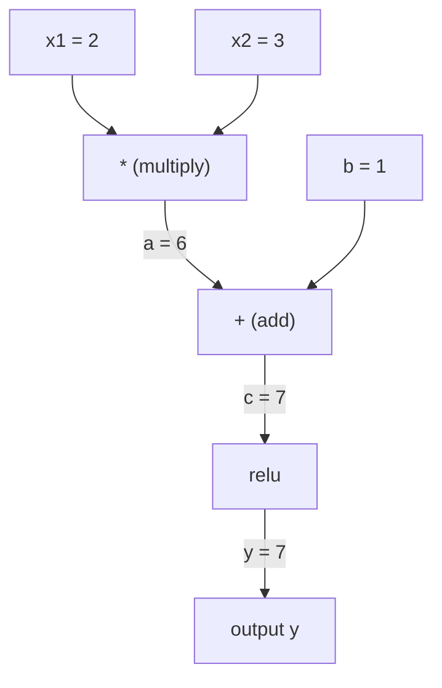
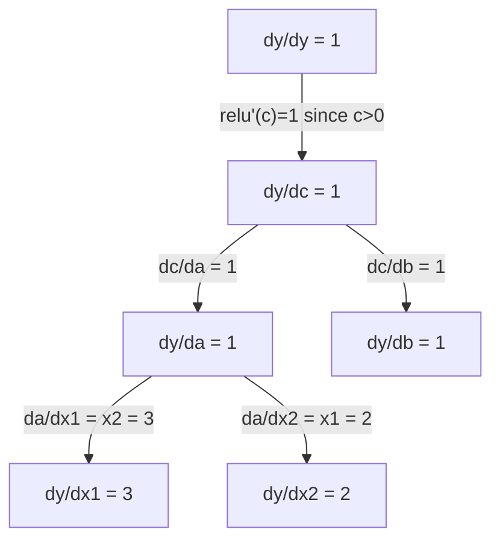

# 連鎖律と自動微分

> 連鎖律は、学習するすべてのニューラルネットワークのエンジンです。

**種別:** 構築
**言語:** Python
**前提条件:** フェーズ1、レッスン04（導関数と勾配）
**所要時間:** 約90分

## 学習目標

- 演算を記録し、逆モード自動微分で勾配を計算する最小限の autograd エンジン（Value クラス）を作る
- トポロジカルソートを使って、計算グラフ上の順伝播と逆伝播を実装する
- スクラッチで作った autograd エンジンだけを使い、XOR 用の多層パーセプトロンを構築して学習する
- 数値的な有限差分による勾配チェックで、自動微分の正しさを検証する

## 問題

単純な関数の導関数は計算できます。しかしニューラルネットワークは単純な関数ではありません。行列を掛け、バイアスを足し、活性化関数を適用し、また行列を掛け、softmax を取り、cross-entropy loss を計算する、何百もの関数の合成です。出力は、関数の関数の関数です。

ネットワークを学習するには、損失のすべての重みに対する勾配が必要です。何百万ものパラメータについて手で計算することは不可能です。数値的に計算する（有限差分）には遅すぎます。

連鎖律は数学を与えます。自動微分はアルゴリズムを与えます。両者を合わせると、関数の任意の合成を通る厳密な勾配を、1回の順伝播に比例する時間で計算できます。

PyTorch、TensorFlow、JAX はこの仕組みで動いています。ここでは小さな版をスクラッチで作ります。

## 概念

### 連鎖律

`y = f(g(x))` のとき、`x` に対する `y` の導関数は次のようになります。

```
dy/dx = dy/dg * dg/dx = f'(g(x)) * g'(x)
```

連鎖に沿って導関数を掛けます。それぞれのリンクが局所的な導関数を与えます。

例: `y = sin(x^2)`

```
g(x) = x^2       g'(x) = 2x
f(g) = sin(g)     f'(g) = cos(g)

dy/dx = cos(x^2) * 2x
```

より深い合成では、連鎖は伸びていきます。

```
y = f(g(h(x)))

dy/dx = f'(g(h(x))) * g'(h(x)) * h'(x)
```

ニューラルネットワークの各層は、この連鎖の1つのリンクです。

### 計算グラフ

計算グラフは連鎖律を視覚化します。すべての演算がノードになります。データはグラフを前向きに流れます。勾配は後ろ向きに流れます。

**順伝播（値を計算）:**



**逆伝播（勾配を計算）:**



逆伝播は各ノードで連鎖律を適用し、出力から入力へ勾配を伝播します。

### 順モードと逆モード

グラフに連鎖律を適用する方法は2つあります。

**順モード**は入力から始めて導関数を前向きに押し出します。`dx/dx = 1` を計算し、各演算を通して伝播します。入力が少なく出力が多い場合に向いています。

```
Forward mode: seed dx/dx = 1, propagate forward

  x = 2       (dx/dx = 1)
  a = x^2     (da/dx = 2x = 4)
  y = sin(a)  (dy/dx = cos(a) * da/dx = cos(4) * 4 = -2.615)
```

**逆モード**は出力から始めて勾配を後ろ向きに引き戻します。`dy/dy = 1` を計算し、各演算を逆順に伝播します。入力が多く出力が少ない場合に向いています。

```
Reverse mode: seed dy/dy = 1, propagate backward

  y = sin(a)  (dy/dy = 1)
  a = x^2     (dy/da = cos(a) = cos(4) = -0.654)
  x = 2       (dy/dx = dy/da * da/dx = -0.654 * 4 = -2.615)
```

ニューラルネットワークには何百万もの入力（重み）と1つの出力（損失）があります。逆モードは1回の逆伝播ですべての勾配を計算します。バックプロパゲーションが逆モードを使うのはこのためです。

| モード | 種（seed） | 方向 | 向いている場合 |
|------|------|-----------|-----------|
| 順モード | `dx_i/dx_i = 1` | 入力から出力 | 入力が少なく、出力が多い |
| 逆モード | `dy/dy = 1` | 出力から入力 | 入力が多く、出力が少ない（ニューラルネット） |

### 順モードのための双対数

順モードは双対数を使うとエレガントに実装できます。双対数は `a + b*epsilon` という形を持ち、`epsilon^2 = 0` です。

```
Dual number: (value, derivative)

(2, 1) means: value is 2, derivative w.r.t. x is 1

Arithmetic rules:
  (a, a') + (b, b') = (a+b, a'+b')
  (a, a') * (b, b') = (a*b, a'*b + a*b')
  sin(a, a')         = (sin(a), cos(a)*a')
```

入力変数の導関数を 1 として種を置きます。導関数はすべての演算を通して自動的に伝播します。

### Autograd エンジンを作る

autograd エンジンには3つのものが必要です。

1. **値のラップ。** すべての数値を、その値と勾配を保存するオブジェクトで包みます。
2. **グラフの記録。** すべての演算が、入力と局所勾配関数を記録します。
3. **逆伝播。** グラフをトポロジカルソートし、逆順にたどって各ノードで連鎖律を適用します。

これは PyTorch の `autograd` が行っていることそのものです。`torch.Tensor` クラスは値をラップし、`requires_grad=True` のときに演算を記録し、`.backward()` を呼ぶと勾配を計算します。

### PyTorch Autograd の内部の動き

PyTorch で次のコードを書くとします。

```python
x = torch.tensor(2.0, requires_grad=True)
y = x ** 2 + 3 * x + 1
y.backward()
print(x.grad)  # 7.0 = 2*x + 3 = 2*2 + 3
```

PyTorch の内部では次が起きています。

1. `requires_grad=True` を持つ `x` の `Tensor` ノードを作る
2. すべての演算（`**`、`*`、`+`）が新しいノードを作り、backward 関数を記録する
3. `y.backward()` が、記録されたグラフを通して逆モード自動微分を実行する
4. 各ノードの `grad_fn` が局所勾配を計算し、親ノードへ渡す
5. 勾配は置き換えではなく加算によって `.grad` 属性に蓄積される

グラフは動的です（define-by-run）。各順伝播ごとに新しいグラフが作られます。そのため PyTorch はモデル内部の制御フロー（if/else、ループ）をサポートできます。

## 作ってみる

### Step 1: Value クラス

```python
class Value:
    def __init__(self, data, children=(), op=''):
        self.data = data
        self.grad = 0.0
        self._backward = lambda: None
        self._prev = set(children)
        self._op = op

    def __repr__(self):
        return f"Value(data={self.data:.4f}, grad={self.grad:.4f})"
```

すべての `Value` は、数値データ、勾配（初期値はゼロ）、backward 関数、それを生み出した子ノードへのポインタを保存します。

### Step 2: 勾配追跡つきの算術演算

```python
    def __add__(self, other):
        other = other if isinstance(other, Value) else Value(other)
        out = Value(self.data + other.data, (self, other), '+')
        def _backward():
            self.grad += out.grad
            other.grad += out.grad
        out._backward = _backward
        return out

    def __mul__(self, other):
        other = other if isinstance(other, Value) else Value(other)
        out = Value(self.data * other.data, (self, other), '*')
        def _backward():
            self.grad += other.data * out.grad
            other.grad += self.data * out.grad
        out._backward = _backward
        return out

    def relu(self):
        out = Value(max(0, self.data), (self,), 'relu')
        def _backward():
            self.grad += (1.0 if out.data > 0 else 0.0) * out.grad
        out._backward = _backward
        return out
```

各演算は、局所勾配を計算して上流から来た勾配（`out.grad`）を掛ける方法を知っているクロージャを作ります。`+=` は、1つの値が複数の演算で使われる場合に対応します。

### Step 3: 逆伝播

```python
    def backward(self):
        topo = []
        visited = set()
        def build_topo(v):
            if v not in visited:
                visited.add(v)
                for child in v._prev:
                    build_topo(child)
                topo.append(v)
        build_topo(self)

        self.grad = 1.0
        for v in reversed(topo):
            v._backward()
```

トポロジカルソートにより、各ノードの勾配が完全に計算されてから子ノードへ伝播されます。種となる勾配は 1.0（dy/dy = 1）です。

### Step 4: 完全なエンジンに必要な追加演算

基本的な Value クラスは加算、乗算、relu を扱います。実用的な autograd エンジンにはさらに多くの演算が必要です。ニューラルネットワークを作るために必要な演算は次のとおりです。

```python
    def __neg__(self):
        return self * -1

    def __sub__(self, other):
        return self + (-other)

    def __radd__(self, other):
        return self + other

    def __rmul__(self, other):
        return self * other

    def __rsub__(self, other):
        return other + (-self)

    def __pow__(self, n):
        out = Value(self.data ** n, (self,), f'**{n}')
        def _backward():
            self.grad += n * (self.data ** (n - 1)) * out.grad
        out._backward = _backward
        return out

    def __truediv__(self, other):
        return self * (other ** -1) if isinstance(other, Value) else self * (Value(other) ** -1)

    def exp(self):
        import math
        e = math.exp(self.data)
        out = Value(e, (self,), 'exp')
        def _backward():
            self.grad += e * out.grad
        out._backward = _backward
        return out

    def log(self):
        import math
        out = Value(math.log(self.data), (self,), 'log')
        def _backward():
            self.grad += (1.0 / self.data) * out.grad
        out._backward = _backward
        return out

    def tanh(self):
        import math
        t = math.tanh(self.data)
        out = Value(t, (self,), 'tanh')
        def _backward():
            self.grad += (1 - t ** 2) * out.grad
        out._backward = _backward
        return out
```

**各演算が重要な理由:**

| 演算 | backward の規則 | 使われる場所 |
|-----------|--------------|---------|
| `__sub__` | add + neg を再利用 | 損失計算（pred - target） |
| `__pow__` | n * x^(n-1) | 多項式活性化、MSE（error^2） |
| `__truediv__` | mul + pow(-1) を再利用 | 正規化、学習率のスケーリング |
| `exp` | exp(x) * upstream | Softmax、対数尤度 |
| `log` | (1/x) * upstream | Cross-entropy loss、対数確率 |
| `tanh` | (1 - tanh^2) * upstream | 古典的な活性化関数 |

賢い点は、`__sub__` と `__truediv__` が既存の演算を使って定義されていることです。基礎にある add/mul/pow 演算を通して連鎖律が合成されるため、正しい勾配が無料で得られます。

### Step 5: スクラッチのミニ MLP

完全な Value クラスがあれば、ニューラルネットワークを作れます。PyTorch も NumPy も使いません。Value と連鎖律だけです。

```python
import random

class Neuron:
    def __init__(self, n_inputs):
        self.w = [Value(random.uniform(-1, 1)) for _ in range(n_inputs)]
        self.b = Value(0.0)

    def __call__(self, x):
        act = sum((wi * xi for wi, xi in zip(self.w, x)), self.b)
        return act.tanh()

    def parameters(self):
        return self.w + [self.b]

class Layer:
    def __init__(self, n_inputs, n_outputs):
        self.neurons = [Neuron(n_inputs) for _ in range(n_outputs)]

    def __call__(self, x):
        return [n(x) for n in self.neurons]

    def parameters(self):
        return [p for n in self.neurons for p in n.parameters()]

class MLP:
    def __init__(self, sizes):
        self.layers = [Layer(sizes[i], sizes[i+1]) for i in range(len(sizes)-1)]

    def __call__(self, x):
        for layer in self.layers:
            x = layer(x)
        return x[0] if len(x) == 1 else x

    def parameters(self):
        return [p for layer in self.layers for p in layer.parameters()]
```

`Neuron` は `tanh(w1*x1 + w2*x2 + ... + b)` を計算します。`Layer` はニューロンのリストです。`MLP` は層を積み重ねます。すべての重みが `Value` なので、`loss.backward()` を呼ぶと、すべてのパラメータへ勾配が伝播します。

**XOR で学習する:**

```python
random.seed(42)
model = MLP([2, 4, 1])  # 2 inputs, 4 hidden neurons, 1 output

xs = [[0, 0], [0, 1], [1, 0], [1, 1]]
ys = [-1, 1, 1, -1]  # XOR pattern (using -1/1 for tanh)

for step in range(100):
    preds = [model(x) for x in xs]
    loss = sum((p - y) ** 2 for p, y in zip(preds, ys))

    for p in model.parameters():
        p.grad = 0.0
    loss.backward()

    lr = 0.05
    for p in model.parameters():
        p.data -= lr * p.grad

    if step % 20 == 0:
        print(f"step {step:3d}  loss = {loss.data:.4f}")

print("\nPredictions after training:")
for x, y in zip(xs, ys):
    print(f"  input={x}  target={y:2d}  pred={model(x).data:6.3f}")
```

これは micrograd です。自動微分を備えた、純粋な Python の完全なニューラルネットワーク学習ループです。商用の深層学習フレームワークも、大規模にはなりますが同じことをしています。

### Step 6: 勾配チェック

自動微分が正しいとどうやって分かるでしょうか。数値微分と比較します。これが勾配チェックです。

```python
def gradient_check(build_expr, x_val, h=1e-7):
    x = Value(x_val)
    y = build_expr(x)
    y.backward()
    autodiff_grad = x.grad

    y_plus = build_expr(Value(x_val + h)).data
    y_minus = build_expr(Value(x_val - h)).data
    numerical_grad = (y_plus - y_minus) / (2 * h)

    diff = abs(autodiff_grad - numerical_grad)
    return autodiff_grad, numerical_grad, diff
```

複雑な式で試します。

```python
def expr(x):
    return (x ** 3 + x * 2 + 1).tanh()

ad, num, diff = gradient_check(expr, 0.5)
print(f"Autodiff:  {ad:.8f}")
print(f"Numerical: {num:.8f}")
print(f"Difference: {diff:.2e}")
# Difference should be < 1e-5
```

新しい演算を実装するとき、勾配チェックは不可欠です。backward パスにバグがあれば、数値チェックが見つけてくれます。本格的な深層学習実装では、開発中に必ず勾配チェックを行います。

**勾配チェックを使う場面:**

| 状況 | 勾配チェックする？ |
|-----------|-------------------|
| autograd に新しい演算を追加する | はい、必ず |
| 収束しない学習ループをデバッグする | はい、まず勾配を確認する |
| 本番学習 | いいえ、遅すぎる（パラメータごとに2回の順伝播） |
| autograd コードのユニットテスト | はい、自動化する |

### Step 7: 手計算との照合

```python
x1 = Value(2.0)
x2 = Value(3.0)
a = x1 * x2          # a = 6.0
b = a + Value(1.0)    # b = 7.0
y = b.relu()          # y = 7.0

y.backward()

print(f"y = {y.data}")          # 7.0
print(f"dy/dx1 = {x1.grad}")   # 3.0 (= x2)
print(f"dy/dx2 = {x2.grad}")   # 2.0 (= x1)
```

手計算で確認します。`y = relu(x1*x2 + 1)` です。`x1*x2 + 1 = 7 > 0` なので relu は恒等関数です。
`dy/dx1 = x2 = 3`、`dy/dx2 = x1 = 2` です。エンジンの結果と一致します。

## 使ってみる

### PyTorch と照合する

```python
import torch

x1 = torch.tensor(2.0, requires_grad=True)
x2 = torch.tensor(3.0, requires_grad=True)
a = x1 * x2
b = a + 1.0
y = torch.relu(b)
y.backward()

print(f"PyTorch dy/dx1 = {x1.grad.item()}")  # 3.0
print(f"PyTorch dy/dx2 = {x2.grad.item()}")  # 2.0
```

勾配は同じです。あなたのエンジンが PyTorch と同じ結果を計算するのは、数学が同じだからです。連鎖律による逆モード自動微分です。

### もう少し複雑な式

```python
a = Value(2.0)
b = Value(-3.0)
c = Value(10.0)
f = (a * b + c).relu()  # relu(2*(-3) + 10) = relu(4) = 4

f.backward()
print(f"df/da = {a.grad}")  # -3.0 (= b)
print(f"df/db = {b.grad}")  #  2.0 (= a)
print(f"df/dc = {c.grad}")  #  1.0
```

## 提出物

このレッスンでは次を作ります。
- `outputs/skill-autodiff.md` -- autograd システムを構築・デバッグするためのスキル
- `code/autodiff.py` -- 拡張可能な最小限の autograd エンジン

ここで作った Value クラスは、フェーズ3のニューラルネットワーク学習ループの土台になります。

## 演習

1. `Value` クラスに `__pow__` を追加し、`x ** n` を計算できるようにしてください。`x=2` における `d/dx(x^3)` が `12.0` になることを確認してください。

2. 活性化関数として `tanh` を追加してください。`tanh'(0) = 1`、`tanh'(2) = 0.0707`（近似）になることを確認してください。

3. 単一ニューロン `y = relu(w1*x1 + w2*x2 + b)` の計算グラフを作ってください。5つすべての勾配を計算し、PyTorch と照合してください。

4. 双対数を使って順モード自動微分を実装してください。`Dual` クラスを作り、逆モードエンジンと同じ導関数が得られることを確認してください。

## 重要用語

| 用語 | よく言われる説明 | 実際の意味 |
|------|----------------|----------------------|
| 連鎖律 | 「導関数を掛ける」 | 合成関数の導関数は、適切な点で評価した各関数の局所導関数の積に等しい |
| 計算グラフ | 「ネットワーク図」 | ノードが演算、エッジが値（順方向）または勾配（逆方向）を運ぶ有向非巡回グラフ |
| 順モード | 「導関数を前へ押す」 | 入力から出力へ導関数を伝播する自動微分。入力変数ごとに1回のパスが必要。 |
| 逆モード | 「バックプロパゲーション」 | 出力から入力へ勾配を伝播する自動微分。出力変数ごとに1回のパスが必要。 |
| Autograd | 「自動勾配」 | 値に対する演算を記録し、グラフを構築し、連鎖律で厳密な勾配を計算するシステム |
| 双対数 | 「値と導関数」 | a + b*epsilon（epsilon^2 = 0）の形の数。算術演算を通して導関数情報を運ぶ |
| トポロジカルソート | 「依存関係の順序」 | すべてのノードがその依存先の後に来るようにグラフノードを並べること。正しい勾配伝播に必要。 |
| 勾配の蓄積 | 「置き換えずに足す」 | 1つの値が複数の演算へ流れるとき、その勾配は入ってくるすべての勾配寄与の和になる |
| 動的グラフ | 「Define by run」 | 各順伝播で再構築される計算グラフ。モデル内で Python の制御フローを使える（PyTorch 方式） |
| 勾配チェック | 「数値検証」 | 自動微分の勾配を数値的な有限差分勾配と比較して正しさを検証すること。デバッグに不可欠。 |
| MLP | 「多層パーセプトロン」 | 1つ以上の隠れ層を持つニューラルネットワーク。各ニューロンは重み付き和とバイアスを計算し、活性化関数を適用する。 |
| ニューロン | 「重み付き和 + 活性化」 | 基本単位: output = activation(w1*x1 + w2*x2 + ... + b)。重みとバイアスは学習可能なパラメータ。 |

## 参考資料

- [3Blue1Brown: Backpropagation calculus](https://www.youtube.com/watch?v=tIeHLnjs5U8) -- ニューラルネットワークにおける連鎖律の視覚的な説明
- [PyTorch Autograd mechanics](https://pytorch.org/docs/stable/notes/autograd.html) -- 実際のシステムがどう動くか
- [Baydin et al., Automatic Differentiation in Machine Learning: a Survey](https://arxiv.org/abs/1502.05767) -- 包括的なリファレンス
