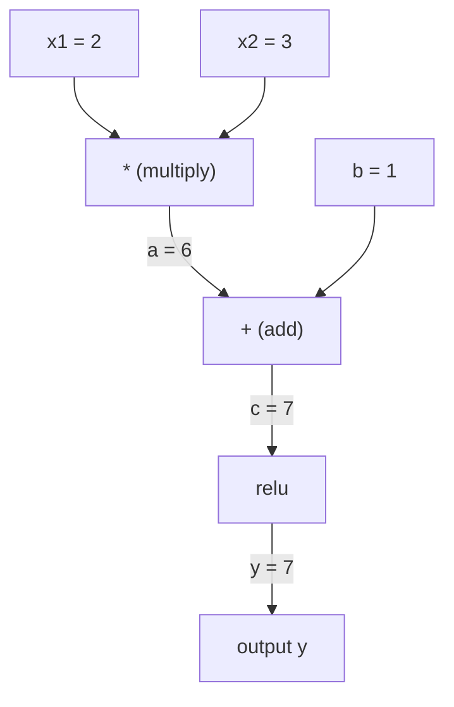
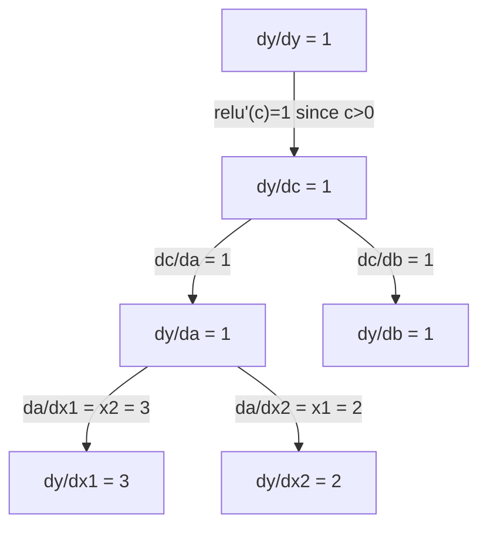

# Zincir Kuralı ve Otomatik Türev Alma

> Zincir kuralı öğrenen her neural network'nin arkasındaki motordur.

**Tür:** Yapım
**Dil:** Python
**Önkoşullar:** Aşama 1, Ders 04 (Türevler ve Gradient'ler)
**Süre:** ~90 dakika

## Öğrenme Hedefleri

- İşlemleri kaydeden ve ters mod otomatik fark aracılığıyla gradient'leri hesaplayan minimal bir otomatik derecelendirme motoru (Değer sınıfı) oluşturun
- Topolojik sıralamayı kullanarak bir hesaplama grafiği üzerinden ileri ve geri geçişler uygulayın
- Yalnızca sıfırdan otomatik geçiş motorunu kullanarak XOR üzerinde çok katmanlı bir algılayıcı oluşturun ve eğitin
- Sayısal sonlu farklara karşı gradient kontrolünü kullanarak otomatik fark doğruluğunu doğrulayın

## Sorun

Basit fonksiyonların türevlerini hesaplayabilirsiniz. Ancak neural network basit bir işlev değildir. Yüzlerce fonksiyonun bir araya getirilmesinden oluşur: matris çarpma, sapma ekleme, aktivasyon uygulama, matris tekrar çarpma, softmax, çapraz entropi kaybı. Çıktı, bir fonksiyonun bir fonksiyonunun bir fonksiyonudur.

Ağı eğitmek için her bir ağırlığa göre kaybın gradient değerine ihtiyacınız vardır. Milyonlarca parametre için bunu elle yapmak imkansızdır. Bunu sayısal olarak yapmak (sonlu farklar) çok yavaştır.

Zincir kuralı size matematik verir. Otomatik farklılaşma size algoritmayı verir. Birlikte, tek bir ileri geçişle orantılı olarak zaman içinde rastgele fonksiyon bileşimleri yoluyla kesin gradient'leri hesaplamanıza olanak tanırlar.

PyTorch, TensorFlow ve JAX bu şekilde çalışır. Sıfırdan minyatür bir versiyon oluşturacaksınız.

## Konsept

### Zincir Kuralı

Eğer `y = f(g(x))` ise, `y`'nin `x`'ye göre türevi şöyledir:

```
dy/dx = dy/dg * dg/dx = f'(g(x)) * g'(x)
```

Türevleri zincir boyunca çarpın. Her bağlantı yerel türevine katkıda bulunur.

Örnek: `y = sin(x^2)`

```
g(x) = x^2       g'(x) = 2x
f(g) = sin(g)     f'(g) = cos(g)

dy/dx = cos(x^2) * 2x
```

Daha derin kompozisyonlar için zincir uzar:

```
y = f(g(h(x)))

dy/dx = f'(g(h(x))) * g'(h(x)) * h'(x)
```

neural network'deki her katman bu zincirin bir halkasıdır.

### Hesaplamalı Grafikler

Hesaplamalı bir grafik zincir kuralını görsel hale getirir. Her operasyon bir düğüm haline gelir. Veriler grafikte ileri doğru akar. Gradient'ler geriye doğru akar.

**İleri geçiş (hesaplama değerleri):**



**Geriye doğru geçiş (gradient'leri hesaplayın):**



Geri geçiş, gradient'leri çıkıştan girişlere yayarak zincir kuralını her düğümde uygular.

### İleri Modu ve Geri Modu

Zincir kuralını bir grafik aracılığıyla uygulamanın iki yolu vardır.

**İleri mod** girişlerde başlar ve türevleri ileriye doğru iter. `dx/dx = 1`'yi hesaplar ve her işlem boyunca yayılır. Az sayıda girdiniz ve çok sayıda çıktınız olduğunda iyidir.

```
Forward mode: seed dx/dx = 1, propagate forward

  x = 2       (dx/dx = 1)
  a = x^2     (da/dx = 2x = 4)
  y = sin(a)  (dy/dx = cos(a) * da/dx = cos(4) * 4 = -2.615)
```

**Ters mod** çıkışta başlar ve gradient'leri geriye doğru çeker. `dy/dy = 1`'yi hesaplar ve her işlem boyunca ters yönde ilerler. Çok sayıda girdiniz ve az sayıda çıktınız olduğunda iyidir.

```
Reverse mode: seed dy/dy = 1, propagate backward

  y = sin(a)  (dy/dy = 1)
  a = x^2     (dy/da = cos(a) = cos(4) = -0.654)
  x = 2       (dy/dx = dy/da * da/dx = -0.654 * 4 = -2.615)
```

Neural network'lerin milyonlarca girişi (ağırlık) ve bir çıkışı (kayıp) vardır. Ters mod, tüm gradient'leri tek bir geriye geçişte hesaplar. backpropagation'nin ters modu kullanmasının nedeni budur.

| Modu | Tohum | Yön | En iyi zaman |
|------|------|-----------|-----------|
| İleri | `dx_i/dx_i = 1` | Girişten çıkışa | Az girdi, çok çıktı |
| Ters | `dy/dy = 1` | Çıkıştan girişe | Çok girdi, az çıktı (sinir ağları) |

### İleri Modu için İkili Sayılar

İleri modu çift sayılarla zarif bir şekilde uygulanabilir. İkili bir sayı `a + b*epsilon` biçimindedir; burada `epsilon^2 = 0`.

```
Dual number: (value, derivative)

(2, 1) means: value is 2, derivative w.r.t. x is 1

Arithmetic rules:
  (a, a') + (b, b') = (a+b, a'+b')
  (a, a') * (b, b') = (a*b, a'*b + a*b')
  sin(a, a')         = (sin(a), cos(a)*a')
```

Giriş değişkenini türev 1 ile tohumlayın. Türev her işlemde otomatik olarak yayılır.

### Bir Autograd Motoru Oluşturma

Bir otograd motorun üç şeye ihtiyacı vardır:

1. **Değer sarma.** Her sayıyı, değerini ve gradient'yi saklayan bir nesneye sarın.
2. **Grafik kaydı.** Her işlem, girişlerini ve yerel gradient işlevini kaydeder.
3. **Geriye doğru geçiş.** Grafiği topolojik olarak sıralayın, ardından her düğümde zincir kuralını uygulayarak ters yönde yürütün.

PyTorch'un `autograd`'sinin yaptığı tam olarak budur. `torch.Tensor` sınıfı, `requires_grad=True` olduğunda değerleri sarar, işlemleri kaydeder ve `.backward()`'yi çağırdığınızda gradient'leri hesaplar.

### PyTorch Autograd Temel Özelliklerde Nasıl Çalışır?

PyTorch kodunu yazdığınızda:

```python
x = torch.tensor(2.0, requires_grad=True)
y = x ** 2 + 3 * x + 1
y.backward()
print(x.grad)  # 7.0 = 2*x + 3 = 2*2 + 3
```

PyTorch dahili olarak:

1. `requires_grad=True` ile `x` için bir `Tensor` düğümü oluşturur
2. Her işlem (`**`, `*`, `+`) yeni bir düğüm oluşturur ve geri alma işlevini kaydeder
3. `y.backward()`, kaydedilen grafik aracılığıyla ters mod otomatik farkını tetikler
4. Her düğümün `grad_fn`'si yerel gradient'leri hesaplar ve bunları üst düğümlere iletir
5. Gradient'ler `.grad` özniteliklerinde ekleme (değiştirme değil) yoluyla birikir

Grafik dinamiktir (çalışma bazında tanımlama). Her ileri geçişte yeni bir grafik oluşturulur. PyTorch'un modellerin içindeki kontrol akışını (if/else, döngüler) desteklemesinin nedeni budur.

```figure
chain-rule
```

## İnşa Et

### Adım 1: Değer sınıfı

```python
class Value:
    def __init__(self, data, children=(), op=''):
        self.data = data
        self.grad = 0.0
        self._backward = lambda: None
        self._prev = set(children)
        self._op = op

    def __repr__(self):
        return f"Value(data={self.data:.4f}, grad={self.grad:.4f})"
```

Her `Value`, sayısal verilerini, gradient'sini (başlangıçta sıfır), bir geri işlev ve onu üreten alt düğümlere yönelik işaretçileri saklar.

### Adım 2: gradient izlemeyle aritmetik işlemler

```python
    def __add__(self, other):
        other = other if isinstance(other, Value) else Value(other)
        out = Value(self.data + other.data, (self, other), '+')
        def _backward():
            self.grad += out.grad
            other.grad += out.grad
        out._backward = _backward
        return out

    def __mul__(self, other):
        other = other if isinstance(other, Value) else Value(other)
        out = Value(self.data * other.data, (self, other), '*')
        def _backward():
            self.grad += other.data * out.grad
            other.grad += self.data * out.grad
        out._backward = _backward
        return out

    def relu(self):
        out = Value(max(0, self.data), (self,), 'relu')
        def _backward():
            self.grad += (1.0 if out.data > 0 else 0.0) * out.grad
        out._backward = _backward
        return out
```

Her işlem, yerel gradient'lerin nasıl hesaplanacağını ve yukarı akışlı gradient (`out.grad`) ile çarpılacağını bilen bir kapatma oluşturur. `+=`, bir değerin birden fazla işlemde kullanıldığı durumu ele alır.

### Adım 3: Geriye doğru geçiş

```python
    def backward(self):
        topo = []
        visited = set()
        def build_topo(v):
            if v not in visited:
                visited.add(v)
                for child in v._prev:
                    build_topo(child)
                topo.append(v)
        build_topo(self)

        self.grad = 1.0
        for v in reversed(topo):
            v._backward()
```

Topolojik sıralama, her düğümün gradient'sinin çocuklarına yayılmadan önce tamamen hesaplanmasını sağlar. gradient çekirdeği 1,0'dır (dy/dy = 1).

### Adım 4: Eksiksiz bir motor için daha fazla işlem

Temel Değer sınıfı toplama, çarpma ve relu işlemlerini gerçekleştirir. Gerçek bir autograd motorun daha fazlasına ihtiyacı vardır. neural network'leri oluşturmak için ihtiyacınız olan işlemler şunlardır:

```python
    def __neg__(self):
        return self * -1

    def __sub__(self, other):
        return self + (-other)

    def __radd__(self, other):
        return self + other

    def __rmul__(self, other):
        return self * other

    def __rsub__(self, other):
        return other + (-self)

    def __pow__(self, n):
        out = Value(self.data ** n, (self,), f'**{n}')
        def _backward():
            self.grad += n * (self.data ** (n - 1)) * out.grad
        out._backward = _backward
        return out

    def __truediv__(self, other):
        return self * (other ** -1) if isinstance(other, Value) else self * (Value(other) ** -1)

    def exp(self):
        import math
        e = math.exp(self.data)
        out = Value(e, (self,), 'exp')
        def _backward():
            self.grad += e * out.grad
        out._backward = _backward
        return out

    def log(self):
        import math
        out = Value(math.log(self.data), (self,), 'log')
        def _backward():
            self.grad += (1.0 / self.data) * out.grad
        out._backward = _backward
        return out

    def tanh(self):
        import math
        t = math.tanh(self.data)
        out = Value(t, (self,), 'tanh')
        def _backward():
            self.grad += (1 - t ** 2) * out.grad
        out._backward = _backward
        return out
```

**Her operasyon neden önemlidir:**

| Operasyon | Geri kural | Kullanılan |
|-----------|--------------|---------|
| `__sub__` | Add + neg'i yeniden kullanır | Kayıp hesaplaması (ön-hedef) |
| `__pow__` | n * x^(n-1) | Polinom aktivasyonları, MSE (hata^2) |
| `__truediv__` | mul + pow(-1)'i yeniden kullanır | Normalleştirme, öğrenme oranı ölçeklendirmesi |
| `exp` | exp(x) * yukarı akış | Softmax, log-olasılık |
| `log` | (1/x) * yukarı akış | Çapraz entropi kaybı, günlük olasılıkları |
| `tanh` | (1 - tanh^2) * yukarı akış | Klasik aktivasyon fonksiyonu |

Akıllı kısım: `__sub__` ve `__truediv__` mevcut işlemlere göre tanımlanır. Zincir kuralı temeldeki add/mul/pow işlemleri aracılığıyla oluşturulduğu için doğru gradient'leri ücretsiz olarak alırlar.

### Adım 5: Sıfırdan mini MLP

Eksiksiz bir Değer sınıfıyla bir neural network oluşturabilirsiniz. PyTorch yok. NumPy yok. Sadece Değerler ve zincir kuralı.

```python
import random

class Neuron:
    def __init__(self, n_inputs):
        self.w = [Value(random.uniform(-1, 1)) for _ in range(n_inputs)]
        self.b = Value(0.0)

    def __call__(self, x):
        act = sum((wi * xi for wi, xi in zip(self.w, x)), self.b)
        return act.tanh()

    def parameters(self):
        return self.w + [self.b]

class Layer:
    def __init__(self, n_inputs, n_outputs):
        self.neurons = [Neuron(n_inputs) for _ in range(n_outputs)]

    def __call__(self, x):
        return [n(x) for n in self.neurons]

    def parameters(self):
        return [p for n in self.neurons for p in n.parameters()]

class MLP:
    def __init__(self, sizes):
        self.layers = [Layer(sizes[i], sizes[i+1]) for i in range(len(sizes)-1)]

    def __call__(self, x):
        for layer in self.layers:
            x = layer(x)
        return x[0] if len(x) == 1 else x

    def parameters(self):
        return [p for layer in self.layers for p in layer.parameters()]
```

Bir `Neuron`, `tanh(w1*x1 + w2*x2 + ... + b)`'yi hesaplar. `Layer` nöronların bir listesidir. `MLP` katmanları yığınlar. Her ağırlık bir `Value`'dir, dolayısıyla `loss.backward()`'nin çağrılması gradient'leri her parametreye yayar.

**XOR eğitimi:**

```python
random.seed(42)
model = MLP([2, 4, 1])  # 2 inputs, 4 hidden neurons, 1 output

xs = [[0, 0], [0, 1], [1, 0], [1, 1]]
ys = [-1, 1, 1, -1]  # XOR pattern (using -1/1 for tanh)

for step in range(100):
    preds = [model(x) for x in xs]
    loss = sum((p - y) ** 2 for p, y in zip(preds, ys))

    for p in model.parameters():
        p.grad = 0.0
    loss.backward()

    lr = 0.05
    for p in model.parameters():
        p.data -= lr * p.grad

    if step % 20 == 0:
        print(f"step {step:3d}  loss = {loss.data:.4f}")

print("\nPredictions after training:")
for x, y in zip(xs, ys):
    print(f"  input={x}  target={y:2d}  pred={model(x).data:6.3f}")
```

Bu mikrograd. Otomatik farklılaştırmayla saf Python'da eksiksiz bir neural network eğitim döngüsü. Her ticari deep learning framework aynı şeyi büyük ölçekte yapar.

### Adım 6: Gradient kontrolü

Otomatik farkınızın doğru olduğunu nasıl anlarsınız? Sayısal türevlerle karşılaştırın. Bu gradient kontrolüdür.

```python
def gradient_check(build_expr, x_val, h=1e-7):
    x = Value(x_val)
    y = build_expr(x)
    y.backward()
    autodiff_grad = x.grad

    y_plus = build_expr(Value(x_val + h)).data
    y_minus = build_expr(Value(x_val - h)).data
    numerical_grad = (y_plus - y_minus) / (2 * h)

    diff = abs(autodiff_grad - numerical_grad)
    return autodiff_grad, numerical_grad, diff
```

Karmaşık bir ifade üzerinde test edin:

```python
def expr(x):
    return (x ** 3 + x * 2 + 1).tanh()

ad, num, diff = gradient_check(expr, 0.5)
print(f"Autodiff:  {ad:.8f}")
print(f"Numerical: {num:.8f}")
print(f"Difference: {diff:.2e}")
# Difference should be < 1e-5
```

Yeni işlemleri uygularken Gradient kontrolü önemlidir. Geri pasınızda bir hata varsa sayısal kontrol onu yakalar. Her ciddi deep learning uygulaması, geliştirme sırasında gradient kontrollerini çalıştırır.

**gradient denetimi ne zaman kullanılmalı:**

| Durum | gradient kontrol ediyor mu? |
|-----------|-------------------|
| Autograd'ınıza yeni bir işlem ekleme | Evet, her zaman |
| Yakınsamayan bir eğitim döngüsünde hata ayıklama | Evet, önce gradient'leri kontrol edin |
| Üretim eğitimi | Hayır, çok yavaş (parametre başına 2 kat ileri geçiş) |
| Autograd kodu için birim testleri | Evet, otomatikleştirin |

### Adım 7: Manuel hesaplamaya göre doğrulama

```python
x1 = Value(2.0)
x2 = Value(3.0)
a = x1 * x2          # a = 6.0
b = a + Value(1.0)    # b = 7.0
y = b.relu()          # y = 7.0

y.backward()

print(f"y = {y.data}")          # 7.0
print(f"dy/dx1 = {x1.grad}")   # 3.0 (= x2)
print(f"dy/dx2 = {x2.grad}")   # 2.0 (= x1)
```

Manuel kontrol: `y = relu(x1*x2 + 1)`. `x1*x2 + 1 = 7 > 0`'den beri relu kimliktir.
`dy/dx1 = x2 = 3`. `dy/dx2 = x1 = 2`. Motor eşleşiyor.

## Kullan onu

### PyTorch'a karşı doğrulama

```python
import torch

x1 = torch.tensor(2.0, requires_grad=True)
x2 = torch.tensor(3.0, requires_grad=True)
a = x1 * x2
b = a + 1.0
y = torch.relu(b)
y.backward()

print(f"PyTorch dy/dx1 = {x1.grad.item()}")  # 3.0
print(f"PyTorch dy/dx2 = {x2.grad.item()}")  # 2.0
```

Aynı gradient'ler. Motorunuz PyTorch ile aynı sonucu hesaplar çünkü matematik aynıdır: zincir kuralı yoluyla ters mod otomatik fark.

### Daha karmaşık bir ifade

```python
a = Value(2.0)
b = Value(-3.0)
c = Value(10.0)
f = (a * b + c).relu()  # relu(2*(-3) + 10) = relu(4) = 4

f.backward()
print(f"df/da = {a.grad}")  # -3.0 (= b)
print(f"df/db = {b.grad}")  #  2.0 (= a)
print(f"df/dc = {c.grad}")  #  1.0
```

## Gönderin

Bu ders şunları üretir:
- `outputs/skill-autodiff.md` - autograd sistemlerini oluşturma ve hata ayıklama becerisi
- `code/autodiff.py` -- genişletebileceğiniz minimal bir otomatik kademeli motor

Burada oluşturulan Değer sınıfı, Aşama 3'teki neural network eğitim döngüsünün temelini oluşturur.

## Egzersizler

1. `x ** n`'yi hesaplayabilmek için Değer sınıfına `__pow__`'yi ekleyin. `x=2`'deki `d/dx(x^3)`'nin `12.0`'ye eşit olduğunu doğrulayın.

2. Etkinleştirme işlevi olarak `tanh`'yi ekleyin. `tanh'(0) = 1` ve `tanh'(2) = 0.0707` (yaklaşık) olduğunu doğrulayın.

3. Tek bir nöron için bir hesaplama grafiği oluşturun: `y = relu(w1*x1 + w2*x2 + b)`. Beş gradient'nin tümünü hesaplayın ve PyTorch'a göre doğrulayın.

4. Çift sayıları kullanarak ileri mod otomatik farkını uygulayın. Bir `Dual` sınıfı oluşturun ve bunun ters mod motorunuzla aynı türevleri verdiğini doğrulayın.

## Anahtar Terimler

| Dönem | İnsanlar ne diyor | Aslında ne anlama geliyor |
|------|----------------|----------------------|
| Zincir kuralı | "Türevleri çarpın" | Bileşik fonksiyonların türevi, her fonksiyonun doğru noktada değerlendirilen yerel türevinin çarpımına eşittir |
| Hesaplamalı grafik | "Ağ diyagramı" | Düğümlerin işlemler olduğu ve kenarların değerleri (ileri) veya gradient'leri (geriye) taşıdığı, yönlendirilmiş döngüsel olmayan bir grafik |
| İleri modu | "Türevleri ileri itin" | Türevleri girdilerden çıktılara yayan Autodiff. Giriş değişkeni başına bir geçiş. |
| Ters mod | "Backpropagation" | gradient'leri çıkışlardan girişlere yayan Autodiff. Çıkış değişkeni başına bir geçiş. |
| Otograd | "Otomatik gradient'ler" | Değerler üzerindeki işlemleri kaydeden, bir grafik oluşturan ve zincir kuralı aracılığıyla tam gradient'leri hesaplayan bir sistem |
| Çift sayılar | "Değer artı türev" | Aritmetik yoluyla türev bilgisi taşıyan a + b*epsilon (epsilon^2 = 0) formundaki sayılar |
| Topolojik sıralama | "Bağımlılık sırası" | Grafik düğümlerini, her düğümün tüm bağımlılıklarından sonra gelmesi için sıralamak. Doğru gradient yayılımı için gereklidir. |
| Gradient birikimi | "Ekle, değiştirme" | Bir değer birden fazla işleme beslendiğinde, gradient, gelen tüm gradient katkılarının toplamıdır |
| Dinamik grafik | "Çalıştırarak tanımla" | Her ileri geçişte yeniden oluşturulan bir hesaplama grafiği, modellerin içinde Python kontrol akışına olanak tanır (PyTorch stili) |
| Gradient kontrol | "Sayısal doğrulama" | Doğruluğunu doğrulamak için otomatik fark gradient'lerin sayısal sonlu fark gradient'lerle karşılaştırılması. Hata ayıklama için gereklidir. |
| MLP | "Çok katmanlı algılayıcı" | Bir veya daha fazla gizli nöron katmanına sahip bir neural network. Her nöron ağırlıklı toplam artı önyargıyı hesaplar ve ardından bir aktivasyon fonksiyonu uygular. |
| Nöron | "Ağırlıklı toplam + aktivasyon" | Temel birim: çıktı = etkinleştirme(w1*x1 + w2*x2 + ... + b). Ağırlıklar ve sapma öğrenilebilir parametrelerdir. |

## Daha Fazla Okuma

- [3Blue1Brown: Backpropagation hesabı](https://www.youtube.com/watch?v=tIeHLnjs5U8) -- neural network'lerdeki zincir kuralının görsel açıklaması
- [PyTorch Autograd mekaniği](https://pytorch.org/docs/stable/notes/autograd.html) -- gerçek sistemin işleyişi
- [Baydın ve diğerleri, Machine Learning'de Otomatik Farklılaşma: Bir Araştırma](https://arxiv.org/abs/1502.05767) -- kapsamlı referans
