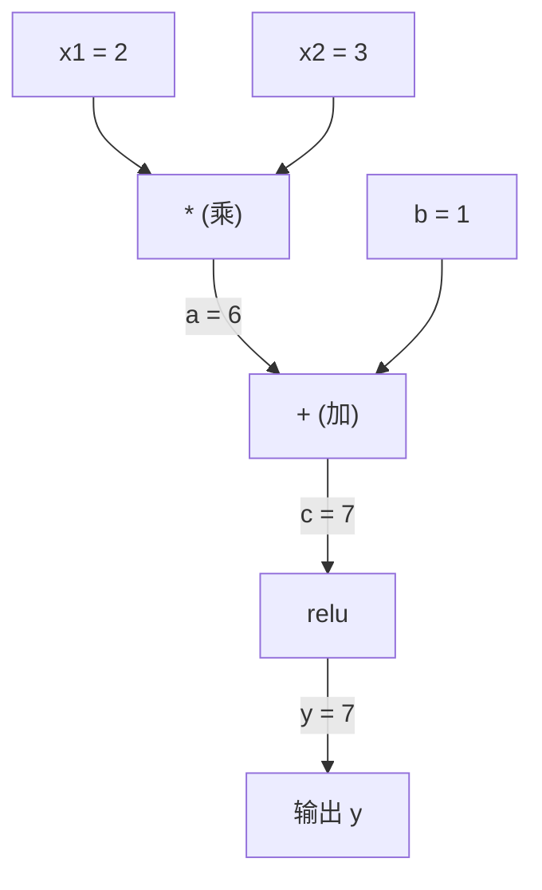
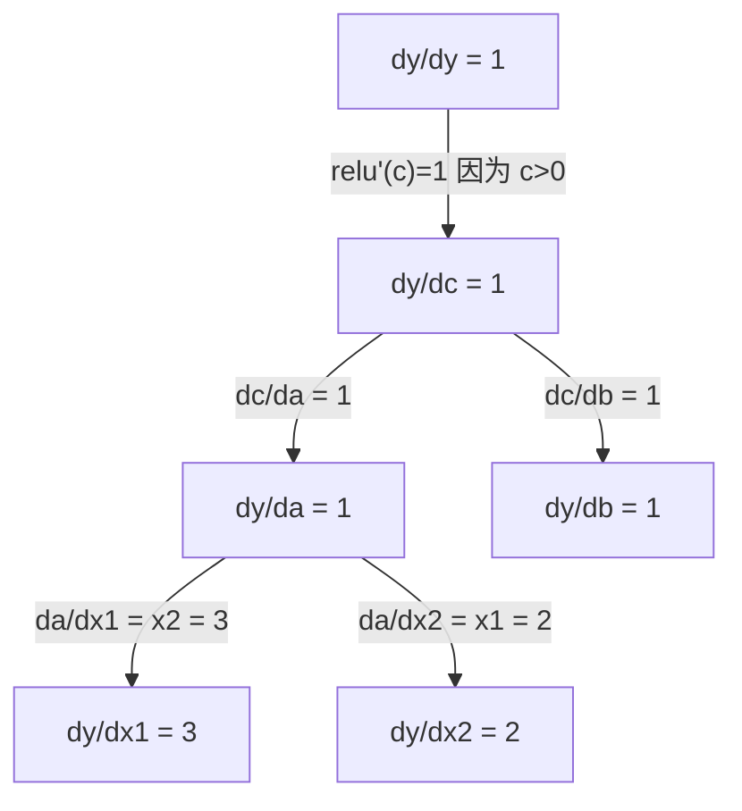

# 链式法则与自动微分（Chain Rule & Automatic Differentiation）

> 链式法则是每一个会学习的神经网络背后的引擎。

**类型：** 构建（Build）
**语言：** Python
**前置知识：** 阶段一，第04课（导数与梯度）
**时间：** 约90分钟

## 学习目标

- 构建一个极简的自动微分（autograd）引擎（Value类），它能够记录运算并通过反向模式（reverse-mode）自动微分计算梯度
- 利用拓扑排序（topological sort）实现通过计算图的前向传播和反向传播
- 仅使用从零构建的自动微分引擎，在异或（XOR）问题上构造并训练一个多层感知机（Multi-Layer Perceptron，MLP）
- 使用数值有限差分（finite differences）进行梯度检查，验证自动微分的正确性

## 问题

你可以计算简单函数的导数。但神经网络并不是一个简单函数。它是数百个函数组合在一起的结果：矩阵乘法、加偏置、应用激活函数、再次矩阵乘法、Softmax、交叉熵损失。输出是一个函数套一个函数套一个函数。

要训练网络，你需要损失函数对每一个权重的梯度。对于数百万个参数，手工计算是不可能的。数值方法（有限差分）又太慢。

链式法则为你提供了数学原理。自动微分为你提供了算法。两者结合，让你能够通过任意函数组合，在与单次前向传播相当的时间内，计算出精确的梯度。

这正是 PyTorch、TensorFlow 和 JAX 的工作方式。你将要从头构建一个迷你版本。

## 概念

### 链式法则（Chain Rule）

如果 `y = f(g(x))`，那么 `y` 对 `x` 的导数是：

```
dy/dx = dy/dg * dg/dx = f'(g(x)) * g'(x)
```

将导数沿着链条相乘。每一个环节贡献其局部导数。

示例：`y = sin(x^2)`

```
g(x) = x^2       g'(x) = 2x
f(g) = sin(g)     f'(g) = cos(g)

dy/dx = cos(x^2) * 2x
```

对于更深的复合函数，链式法则可以延伸：

```
y = f(g(h(x)))

dy/dx = f'(g(h(x))) * g'(h(x)) * h'(x)
```

神经网络中的每一层都是这个链条中的一个环节。

### 计算图（Computational Graphs）

计算图让链式法则变得可视化。每一个运算都成为一个节点。数据沿着图向前流动。梯度则向后流动。

**前向传播（计算值）：**



**反向传播（计算梯度）：**



反向传播在每一个节点处应用链式法则，将梯度从输出传播到输入。

### 前向模式（Forward Mode）与反向模式（Reverse Mode）

有两种方式在图中应用链式法则。

**前向模式**从输入开始，将导数向前推送。它计算 `dx/dx = 1` 并通过每一个运算传播。适用于输入少而输出多的情况。

```
前向模式：种子 dx/dx = 1，向前传播

  x = 2       (dx/dx = 1)
  a = x^2     (da/dx = 2x = 4)
  y = sin(a)  (dy/dx = cos(a) * da/dx = cos(4) * 4 = -2.615)
```

**反向模式**从输出开始，将梯度向后拉取。它计算 `dy/dy = 1` 并以相反顺序通过每一个运算传播。适用于输入多而输出少的情况。

```
反向模式：种子 dy/dy = 1，向后传播

  y = sin(a)  (dy/dy = 1)
  a = x^2     (dy/da = cos(a) = cos(4) = -0.654)
  x = 2       (dy/dx = dy/da * da/dx = -0.654 * 4 = -2.615)
```

神经网络有数百万个输入（权重）和一个输出（损失）。反向模式仅需一次反向传播就能计算出所有梯度。这就是反向传播（backpropagation）使用反向模式的原因。

| 模式 | 种子 | 方向 | 最适合 |
|------|------|-----------|-----------|
| 前向 | `dx_i/dx_i = 1` | 输入到输出 | 输入少，输出多 |
| 反向 | `dy/dy = 1` | 输出到输入 | 输入多，输出少（神经网络） |

### 前向模式的对偶数（Dual Numbers）

前向模式可以用对偶数优雅地实现。对偶数具有形式 `a + b*epsilon`，其中 `epsilon^2 = 0`。

```
对偶数：(值, 导数)

(2, 1) 表示：值为2，对x的导数为1

算术规则：
  (a, a') + (b, b') = (a+b, a'+b')
  (a, a') * (b, b') = (a*b, a'*b + a*b')
  sin(a, a')         = (sin(a), cos(a)*a')
```

将输入变量种子设为导数1。导数会自动通过每一个运算传播。

### 构建自动微分（Autograd）引擎

一个自动微分引擎需要三样东西：

1. **值封装（Value wrapping）。** 将每一个数字封装在一个对象中，该对象存储其值和梯度。
2. **图记录（Graph recording）。** 每一个运算都记录其输入和局部梯度函数。
3. **反向传播（Backward pass）。** 对图进行拓扑排序，然后反向遍历，在每个节点处应用链式法则。

这正是 PyTorch 的 `autograd` 所做的。`torch.Tensor` 类封装值，当 `requires_grad=True` 时记录运算，并在你调用 `.backward()` 时计算梯度。

### PyTorch Autograd 的工作原理

当你编写 PyTorch 代码时：

```python
x = torch.tensor(2.0, requires_grad=True)
y = x ** 2 + 3 * x + 1
y.backward()
print(x.grad)  # 7.0 = 2*x + 3 = 2*2 + 3
```

PyTorch 内部：

1. 为 `x` 创建一个 `Tensor` 节点，`requires_grad=True`
2. 每一个运算（`**`、`*`、`+`）都会创建一个新节点并记录反向函数
3. `y.backward()` 触发反向模式自动微分，通过已记录的图
4. 每个节点的 `grad_fn` 计算局部梯度并将其传递给父节点
5. 梯度通过加法（而非替换）累积在 `.grad` 属性中

图是动态的（define-by-run）。每次前向传播都会构建一个新图。这就是 PyTorch 支持模型中控制流（if/else、循环）的原因。

## 构建它

### 第1步：Value 类

```python
class Value:
    def __init__(self, data, children=(), op=''):
        self.data = data
        self.grad = 0.0
        self._backward = lambda: None
        self._prev = set(children)
        self._op = op

    def __repr__(self):
        return f"Value(data={self.data:.4f}, grad={self.grad:.4f})"
```

每个 `Value` 存储其数值数据、梯度（初始为零）、一个反向函数以及指向产生它的子节点的指针。

### 第2步：带梯度追踪的算术运算

```python
    def __add__(self, other):
        other = other if isinstance(other, Value) else Value(other)
        out = Value(self.data + other.data, (self, other), '+')
        def _backward():
            self.grad += out.grad
            other.grad += out.grad
        out._backward = _backward
        return out

    def __mul__(self, other):
        other = other if isinstance(other, Value) else Value(other)
        out = Value(self.data * other.data, (self, other), '*')
        def _backward():
            self.grad += other.data * out.grad
            other.grad += self.data * out.grad
        out._backward = _backward
        return out

    def relu(self):
        out = Value(max(0, self.data), (self,), 'relu')
        def _backward():
            self.grad += (1.0 if out.data > 0 else 0.0) * out.grad
        out._backward = _backward
        return out
```

每个运算都创建一个闭包，它知道如何计算局部梯度并乘以上游梯度（`out.grad`）。`+=` 处理一个值被用于多个运算的情况。

### 第3步：反向传播

```python
    def backward(self):
        topo = []
        visited = set()
        def build_topo(v):
            if v not in visited:
                visited.add(v)
                for child in v._prev:
                    build_topo(child)
                topo.append(v)
        build_topo(self)

        self.grad = 1.0
        for v in reversed(topo):
            v._backward()
```

拓扑排序确保每个节点的梯度在传播到其子节点之前被完全计算。种子梯度为1.0（`dy/dy = 1`）。

### 第4步：更多运算以构建完整引擎

基本的 Value 类处理加法、乘法和 relu。一个真正的自动微分引擎需要更多。以下是你构建神经网络所需的运算：

```python
    def __neg__(self):
        return self * -1

    def __sub__(self, other):
        return self + (-other)

    def __radd__(self, other):
        return self + other

    def __rmul__(self, other):
        return self * other

    def __rsub__(self, other):
        return other + (-self)

    def __pow__(self, n):
        out = Value(self.data ** n, (self,), f'**{n}')
        def _backward():
            self.grad += n * (self.data ** (n - 1)) * out.grad
        out._backward = _backward
        return out

    def __truediv__(self, other):
        return self * (other ** -1) if isinstance(other, Value) else self * (Value(other) ** -1)

    def exp(self):
        import math
        e = math.exp(self.data)
        out = Value(e, (self,), 'exp')
        def _backward():
            self.grad += e * out.grad
        out._backward = _backward
        return out

    def log(self):
        import math
        out = Value(math.log(self.data), (self,), 'log')
        def _backward():
            self.grad += (1.0 / self.data) * out.grad
        out._backward = _backward
        return out

    def tanh(self):
        import math
        t = math.tanh(self.data)
        out = Value(t, (self,), 'tanh')
        def _backward():
            self.grad += (1 - t ** 2) * out.grad
        out._backward = _backward
        return out
```

**每个运算的重要性：**

| 运算 | 反向规则 | 用于 |
|-----------|--------------|---------|
| `__sub__` | 复用 add + neg | 损失计算（预测 - 目标） |
| `__pow__` | n * x^(n-1) | 多项式激活，均方误差（error^2） |
| `__truediv__` | 复用 mul + pow(-1) | 归一化，学习率缩放 |
| `exp` | exp(x) * 上游 | Softmax，对数似然 |
| `log` | (1/x) * 上游 | 交叉熵损失，对数概率 |
| `tanh` | (1 - tanh^2) * 上游 | 经典激活函数 |

巧妙之处：`__sub__` 和 `__truediv__` 是用已有运算定义的。它们自动获得正确的梯度，因为链式法则通过底层的 add/mul/pow 运算进行组合。

### 第5步：从零构建迷你 MLP

有了完整的 Value 类，你就可以构建一个神经网络。没有 PyTorch。没有 NumPy。只有 Value 和链式法则。

```python
import random

class Neuron:
    def __init__(self, n_inputs):
        self.w = [Value(random.uniform(-1, 1)) for _ in range(n_inputs)]
        self.b = Value(0.0)

    def __call__(self, x):
        act = sum((wi * xi for wi, xi in zip(self.w, x)), self.b)
        return act.tanh()

    def parameters(self):
        return self.w + [self.b]

class Layer:
    def __init__(self, n_inputs, n_outputs):
        self.neurons = [Neuron(n_inputs) for _ in range(n_outputs)]

    def __call__(self, x):
        return [n(x) for n in self.neurons]

    def parameters(self):
        return [p for n in self.neurons for p in n.parameters()]

class MLP:
    def __init__(self, sizes):
        self.layers = [Layer(sizes[i], sizes[i+1]) for i in range(len(sizes)-1)]

    def __call__(self, x):
        for layer in self.layers:
            x = layer(x)
        return x[0] if len(x) == 1 else x

    def parameters(self):
        return [p for layer in self.layers for p in layer.parameters()]
```

一个 `Neuron` 计算 `tanh(w1*x1 + w2*x2 + ... + b)`。`Layer` 是一组神经元。`MLP` 堆叠多个层。每个权重都是一个 `Value`，因此调用 `loss.backward()` 会将梯度传播到每一个参数。

**在 XOR 上训练：**

```python
random.seed(42)
model = MLP([2, 4, 1])  # 2个输入，4个隐藏神经元，1个输出

xs = [[0, 0], [0, 1], [1, 0], [1, 1]]
ys = [-1, 1, 1, -1]  # XOR模式（对tanh使用-1/1）

for step in range(100):
    preds = [model(x) for x in xs]
    loss = sum((p - y) ** 2 for p, y in zip(preds, ys))

    for p in model.parameters():
        p.grad = 0.0
    loss.backward()

    lr = 0.05
    for p in model.parameters():
        p.data -= lr * p.grad

    if step % 20 == 0:
        print(f"step {step:3d}  loss = {loss.data:.4f}")

print("\n训练后的预测：")
for x, y in zip(xs, ys):
    print(f"  input={x}  target={y:2d}  pred={model(x).data:6.3f}")
```

这就是 micrograd。一个纯 Python 的完整神经网络训练循环，带有自动微分。每一个商业深度学习框架都以同样的方式在大规模上运行。

### 第6步：梯度检查（Gradient Checking）

你如何知道你的自动微分是正确的？将它和数值导数进行比较。这就是梯度检查。

```python
def gradient_check(build_expr, x_val, h=1e-7):
    x = Value(x_val)
    y = build_expr(x)
    y.backward()
    autodiff_grad = x.grad

    y_plus = build_expr(Value(x_val + h)).data
    y_minus = build_expr(Value(x_val - h)).data
    numerical_grad = (y_plus - y_minus) / (2 * h)

    diff = abs(autodiff_grad - numerical_grad)
    return autodiff_grad, numerical_grad, diff
```

在一个复杂表达式上测试：

```python
def expr(x):
    return (x ** 3 + x * 2 + 1).tanh()

ad, num, diff = gradient_check(expr, 0.5)
print(f"