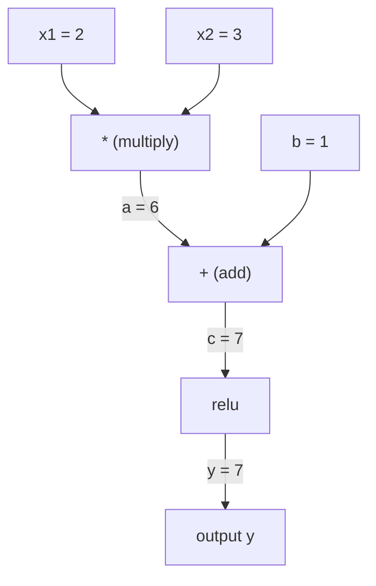
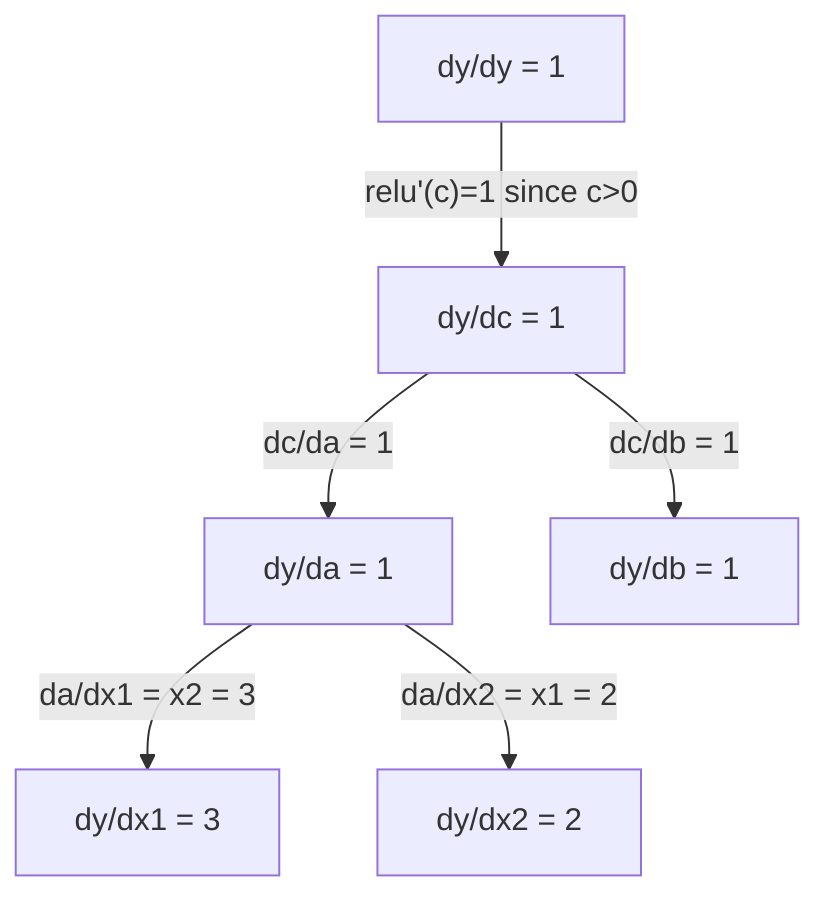

# Chain Rule & Automatic Differentiation

> 连锁规则是每个学习神经网络背后的引擎。

** 类型：** 构建
** 语言：** Python
** 先决条件：** 第1阶段，第04课（衍生品和衍生品）
** 时间：** ~90分钟

## Learning Objectives

- 构建一个最小的自动分类引擎（Value类），通过反向模式自动分类记录操作并计算梯度
- 使用拓扑排序在计算图中实现向前和向后传递
- 仅使用从头开始的自动分级引擎在异或上构建和训练多层感知器
- 使用针对数字有限差的梯度检查来验证autodiff正确性

## The Problem

您可以计算简单函数的求导。但神经网络并不是一个简单的功能。它由数百个函数组成：矩阵相乘、添加偏差、应用激活、再次矩阵相乘、softmax、交叉熵损失。输出是函数的函数的函数。

为了训练网络，您需要每个重量的损失梯度。对于数百万个参数来说，手工做到这一点是不可能的。数字上（有限差异）太慢了。

连锁规则为您提供数学知识。自动求导为您提供算法。它们一起让您可以通过与单次正向成比例的时间上的任意函数组合来计算精确的梯度。

这就是PyTorch、TensorFlow和JAX的工作方式。您将从头开始构建一个微型版本。

## The Concept

### The Chain Rule

如果“y = f（g（x））”，则“y”相对于“x”的求导为：

```
dy/dx = dy/dg * dg/dx = f'(g(x)) * g'(x)
```

沿着链乘以衍生品。每个链接都贡献了其本地衍生品。

示例：' y = sin（x#2）'

```
g(x) = x^2       g'(x) = 2x
f(g) = sin(g)     f'(g) = cos(g)

dy/dx = cos(x^2) * 2x
```

对于更深层次的构图，链条延伸：

```
y = f(g(h(x)))

dy/dx = f'(g(h(x))) * g'(h(x)) * h'(x)
```

神经网络中的每一层都是这条链条中的一个环节。

### Computational Graphs

计算图使连锁规则可视化。每一次操作都成为一个节点。数据通过图表向前流动。学生倒流。

** 向前传递（计算值）：**



** 向后传递（计算梯度）：**



向后传递在每个节点应用链规则，将梯度从输出传播到输入。

### Forward Mode vs Reverse Mode

有两种方法可以通过图表应用连锁规则。

** 前进模式 ** 从输入开始并向前推动衍生品。它计算“Dx/Dx = 1”并通过每个操作传播。当输入较少而输出较多时，这很好。

```
Forward mode: seed dx/dx = 1, propagate forward

  x = 2       (dx/dx = 1)
  a = x^2     (da/dx = 2x = 4)
  y = sin(a)  (dy/dx = cos(a) * da/dx = cos(4) * 4 = -2.615)
```

** 反向模式 ** 从输出端开始，将梯度向后拉。它计算'dy/dy = 1'并反向传播每个操作。当你有很多输入和很少的输出时很好。

```
Reverse mode: seed dy/dy = 1, propagate backward

  y = sin(a)  (dy/dy = 1)
  a = x^2     (dy/da = cos(a) = cos(4) = -0.654)
  x = 2       (dy/dx = dy/da * da/dx = -0.654 * 4 = -2.615)
```

神经网络有数百万个输入（权重）和一个输出（损失）。反向模式在一次向后通过中计算所有梯度。这就是反向传播使用反向模式的原因。

| 模式 | 种子 | 方向 | 最佳 |
|------|------|-----------|-----------|
| 向前 | “Dx_i/Dx_i = 1” | 输入到输出 | 投入少，产出多 |
| 反向 | “dy/dy = 1” | 产投 | 输入多，输出少（神经网络） |

### Dual Numbers for Forward Mode

前进模式可以通过双号码优雅地实现。双数的形式为“a + b* ð '，其中“epsilon ' 2 = 0 '。

```
Dual number: (value, derivative)

(2, 1) means: value is 2, derivative w.r.t. x is 1

Arithmetic rules:
  (a, a') + (b, b') = (a+b, a'+b')
  (a, a') * (b, b') = (a*b, a'*b + a*b')
  sin(a, a')         = (sin(a), cos(a)*a')
```

用导数1作为输入变量的种子。导数在每个操作中自动传播。

### Building an Autograd Engine

自动毕业引擎需要三件事：

1. ** 超值包装。**将每个数字包裹在一个存储其值和梯度的对象中。
2. ** 图表录制。**每个操作都会记录其输入和局部梯度函数。
3. ** 向后传球。**对图进行布局排序，然后反向行走，在每个节点应用链规则。

这正是PyTorch的“autograd”所做的。' torch.Tensor '类会包装值，记录'时的操作，并在调用'.backward（）'时计算梯度。

### How PyTorch Autograd Works Under the Hood

编写PyTorch代码时：

```python
x = torch.tensor(2.0, requires_grad=True)
y = x ** 2 + 3 * x + 1
y.backward()
print(x.grad)  # 7.0 = 2*x + 3 = 2*2 + 3
```

PyTorch内部：

1. 为“x”创建一个“张量”节点，并带有“needs_grad=True”
2. 每个操作（'**'、'、'+'）创建一个新节点并记录向后函数
3. ' y.backward（）'通过记录的图表触发反向模式autodiff
4. 每个节点的“grad_fn”计算局部梯度并将其传递给父节点
5. 成员通过添加（而不是替换）在“.grad”属性中累积

该图是动态的（逐运行定义）。每一次向前传球都会建立一个新的图表。这就是为什么PyTorch支持模型内部的控制流（if/else，循环）。

## Build It

### Step 1: The Value class

```python
class Value:
    def __init__(self, data, children=(), op=''):
        self.data = data
        self.grad = 0.0
        self._backward = lambda: None
        self._prev = set(children)
        self._op = op

    def __repr__(self):
        return f"Value(data={self.data:.4f}, grad={self.grad:.4f})"
```

每个“值”都存储其数字数据、其梯度（最初为零）、向后函数以及指向产生它的子节点的指针。

### Step 2: Arithmetic operations with gradient tracking

```python
    def __add__(self, other):
        other = other if isinstance(other, Value) else Value(other)
        out = Value(self.data + other.data, (self, other), '+')
        def _backward():
            self.grad += out.grad
            other.grad += out.grad
        out._backward = _backward
        return out

    def __mul__(self, other):
        other = other if isinstance(other, Value) else Value(other)
        out = Value(self.data * other.data, (self, other), '*')
        def _backward():
            self.grad += other.data * out.grad
            other.grad += self.data * out.grad
        out._backward = _backward
        return out

    def relu(self):
        out = Value(max(0, self.data), (self,), 'relu')
        def _backward():
            self.grad += (1.0 if out.data > 0 else 0.0) * out.grad
        out._backward = _backward
        return out
```

每个操作都会创建一个闭环，该闭环知道如何计算局部梯度并乘以上游梯度（“out.grad”）。'+='处理一个值在多个操作中使用的情况。

### Step 3: The backward pass

```python
    def backward(self):
        topo = []
        visited = set()
        def build_topo(v):
            if v not in visited:
                visited.add(v)
                for child in v._prev:
                    build_topo(child)
                topo.append(v)
        build_topo(self)

        self.grad = 1.0
        for v in reversed(topo):
            v._backward()
```

topology排序确保每个节点的梯度在传播到其子节点之前得到完全计算。种子梯度为1.0（dy/dy = 1）。

### Step 4: More operations for a complete engine

基本Value类处理加法、相乘和Relu。真正的自动毕业引擎需要更多。以下是构建神经网络所需的操作：

```python
    def __neg__(self):
        return self * -1

    def __sub__(self, other):
        return self + (-other)

    def __radd__(self, other):
        return self + other

    def __rmul__(self, other):
        return self * other

    def __rsub__(self, other):
        return other + (-self)

    def __pow__(self, n):
        out = Value(self.data ** n, (self,), f'**{n}')
        def _backward():
            self.grad += n * (self.data ** (n - 1)) * out.grad
        out._backward = _backward
        return out

    def __truediv__(self, other):
        return self * (other ** -1) if isinstance(other, Value) else self * (Value(other) ** -1)

    def exp(self):
        import math
        e = math.exp(self.data)
        out = Value(e, (self,), 'exp')
        def _backward():
            self.grad += e * out.grad
        out._backward = _backward
        return out

    def log(self):
        import math
        out = Value(math.log(self.data), (self,), 'log')
        def _backward():
            self.grad += (1.0 / self.data) * out.grad
        out._backward = _backward
        return out

    def tanh(self):
        import math
        t = math.tanh(self.data)
        out = Value(t, (self,), 'tanh')
        def _backward():
            self.grad += (1 - t ** 2) * out.grad
        out._backward = _backward
        return out
```

** 为什么每个操作都很重要：**

| 操作 | 倒退规则 | 用于 |
|-----------|--------------|---------|
| 中文（简体） | 重复使用add + negg | 损失计算（pred -目标） |
| '__pow__' | n * x^（n-1） | 多项激活，SSE（错误' 2） |
| '__truediv_' | 重复使用mul + pow（-1） | 标准化、学习率缩放 |
| “BEP” | BEP（x）* 上游 | Softmax，log似然 |
| “log” | （1/x）* 上游 | 交叉熵损失、对数概率 |
| “tanh” | （1 -tanh ' 2）* 上游 | 经典激活功能 |

聪明的部分：'__sub__'和'__truediv__'是根据现有操作定义的。他们免费获得正确的梯度，因为链规则是通过底层的add/mul/pow操作组成的。

### Step 5: Mini MLP from scratch

通过完整的Value类，您可以构建神经网络。没有PyTorch。没有NumPy。正义价值观和连锁规则。

```python
import random

class Neuron:
    def __init__(self, n_inputs):
        self.w = [Value(random.uniform(-1, 1)) for _ in range(n_inputs)]
        self.b = Value(0.0)

    def __call__(self, x):
        act = sum((wi * xi for wi, xi in zip(self.w, x)), self.b)
        return act.tanh()

    def parameters(self):
        return self.w + [self.b]

class Layer:
    def __init__(self, n_inputs, n_outputs):
        self.neurons = [Neuron(n_inputs) for _ in range(n_outputs)]

    def __call__(self, x):
        return [n(x) for n in self.neurons]

    def parameters(self):
        return [p for n in self.neurons for p in n.parameters()]

class MLP:
    def __init__(self, sizes):
        self.layers = [Layer(sizes[i], sizes[i+1]) for i in range(len(sizes)-1)]

    def __call__(self, x):
        for layer in self.layers:
            x = layer(x)
        return x[0] if len(x) == 1 else x

    def parameters(self):
        return [p for layer in self.layers for p in layer.parameters()]
```

“神经元”计算“tanh（w1*x1 + w2*x2 +.”+ b）'。“层”是神经元列表。“MLP”堆叠层。每个权重都是一个“值”，因此调用“loss.backward（）”将梯度传播到每个参数。

** 异或培训：**

```python
random.seed(42)
model = MLP([2, 4, 1])  # 2 inputs, 4 hidden neurons, 1 output

xs = [[0, 0], [0, 1], [1, 0], [1, 1]]
ys = [-1, 1, 1, -1]  # XOR pattern (using -1/1 for tanh)

for step in range(100):
    preds = [model(x) for x in xs]
    loss = sum((p - y) ** 2 for p, y in zip(preds, ys))

    for p in model.parameters():
        p.grad = 0.0
    loss.backward()

    lr = 0.05
    for p in model.parameters():
        p.data -= lr * p.grad

    if step % 20 == 0:
        print(f"step {step:3d}  loss = {loss.data:.4f}")

print("\nPredictions after training:")
for x, y in zip(xs, ys):
    print(f"  input={x}  target={y:2d}  pred={model(x).data:6.3f}")
```

这是微梯度。一个完整的神经网络训练循环，纯Python，自动微分。每个商业深度学习框架都在大规模做同样的事情。

### Step 6: Gradient checking

您如何知道您的autodiff是否正确？将其与数字衍生品进行比较。这是梯度检查。

```python
def gradient_check(build_expr, x_val, h=1e-7):
    x = Value(x_val)
    y = build_expr(x)
    y.backward()
    autodiff_grad = x.grad

    y_plus = build_expr(Value(x_val + h)).data
    y_minus = build_expr(Value(x_val - h)).data
    numerical_grad = (y_plus - y_minus) / (2 * h)

    diff = abs(autodiff_grad - numerical_grad)
    return autodiff_grad, numerical_grad, diff
```

在一个复杂的表达式上测试它：

```python
def expr(x):
    return (x ** 3 + x * 2 + 1).tanh()

ad, num, diff = gradient_check(expr, 0.5)
print(f"Autodiff:  {ad:.8f}")
print(f"Numerical: {num:.8f}")
print(f"Difference: {diff:.2e}")
# Difference should be < 1e-5
```

实施新操作时，梯度检查至关重要。如果您的反向传递存在错误，数字检查就会发现它。每个严肃的深度学习实现都会在开发过程中运行梯度检查。

** 何时使用梯度检查：**

| 情况 | Do gradient check? |
|-----------|-------------------|
| 将新操作添加到您的自动评分 | 是的，总是 |
| Debugging a training loop that won't converge | Yes, check gradients first |
| 生产培训 | 不，太慢（每个参数2次向前传递） |
| Unit tests for autograd code | Yes, automate it |

### Step 7: Verify against manual calculation

```python
x1 = Value(2.0)
x2 = Value(3.0)
a = x1 * x2          # a = 6.0
b = a + Value(1.0)    # b = 7.0
y = b.relu()          # y = 7.0

y.backward()

print(f"y = {y.data}")          # 7.0
print(f"dy/dx1 = {x1.grad}")   # 3.0 (= x2)
print(f"dy/dx2 = {x2.grad}")   # 2.0 (= x1)
```

手动检查：`y = relu（x1*x2 + 1）`。因为x1*x2 + 1 = 7 > 0，所以relu是恒等式。
`dy/dx 1 = x2 = 3`。`dy/dx 2 = x1 = 2`。发动机匹配。

## Use It

### Verify against PyTorch

```python
import torch

x1 = torch.tensor(2.0, requires_grad=True)
x2 = torch.tensor(3.0, requires_grad=True)
a = x1 * x2
b = a + 1.0
y = torch.relu(b)
y.backward()

print(f"PyTorch dy/dx1 = {x1.grad.item()}")  # 3.0
print(f"PyTorch dy/dx2 = {x2.grad.item()}")  # 2.0
```

同样的梯度。您的引擎计算的结果与PyTorch相同，因为数学是相同的：通过链式规则进行反向模式autodiff。

### A more complex expression

```python
a = Value(2.0)
b = Value(-3.0)
c = Value(10.0)
f = (a * b + c).relu()  # relu(2*(-3) + 10) = relu(4) = 4

f.backward()
print(f"df/da = {a.grad}")  # -3.0 (= b)
print(f"df/db = {b.grad}")  #  2.0 (= a)
print(f"df/dc = {c.grad}")  #  1.0
```

## Ship It

本课产生：
- '输出/skill-autodiff.md '--构建和调试自动毕业生系统的技能
- ' code/autodiff.py '--您可以扩展的最小自动毕业引擎

这里构建的Value类是第3阶段神经网络训练循环的基础。

## Exercises

1. 将“__pow__'添加到Value类，以便您可以计算“x ** n”。验证“x=2”处的“d/Dx（x#3）”是否等于“12.0”。

2. 添加“tanh”作为激活函数。验证“tanh”（0）= 1 '并且“tanh”（2）= 0.0707 '（大约）。

3. Build a computation graph for a single neuron: `y = relu(w1*x1 + w2*x2 + b)`. Compute all five gradients and verify against PyTorch.

4. 使用双数字实现正向模式自动差异。创建一个“Dual”类并验证它提供与反向模式引擎相同的衍生品。

## Key Terms

| Term | What people say | What it actually means |
|------|----------------|----------------------|
| 链式法则 | “乘以衍生品” | The derivative of composed functions equals the product of each function's local derivative, evaluated at the right point |
| Computational graph | “网络图” | 有向非环图，其中节点是操作，边携带值（向前）或梯度（向后） |
| Forward mode | "Push derivatives forward" | Autodiff将衍生品从输入传播到输出。每个输入变量一遍。 |
| 反向模式 | "Backpropagation" | Autodiff that propagates gradients from outputs to inputs. One pass per output variable. |
| Autograd | “自动渐变” | A system that records operations on values, builds a graph, and computes exact gradients via the chain rule |
| Dual numbers | “价值加衍生品” | 通过算术携带派生信息的a + b*（epsilon ' 2 = 0）形式的数 |
| 拓扑排序 | “依赖命令” | Ordering graph nodes so every node comes after all its dependencies. Required for correct gradient propagation. |
| Gradient accumulation | "Add, don't replace" | 当一个值输入多个操作时，其梯度是所有输入的梯度贡献的总和 |
| 动态图 | "Define by run" | 每次向前传递时重建计算图，允许Python控制模型内的流（PyTorch风格） |
| 梯度检查 | "Numerical verification" | 将autodiff梯度与数字有限差梯度进行比较以验证正确性。对于调试至关重要。 |
| MLP | "Multi-layer perceptron" | A neural network with one or more hidden layers of neurons. Each neuron computes a weighted sum plus bias, then applies an activation function. |
| 神经元 | “加权总和+激活” | The basic unit: output = activation(w1*x1 + w2*x2 + ... + b). The weights and bias are learnable parameters. |

## Further Reading

- [3Blue1Brown: Backpropagation calculus](https://www.youtube.com/watch?v=tIeHLnjs5U8) -- visual explanation of the chain rule in neural networks
- [PyTorch Autograd机制]（https：//pytorch.org/docs/stable/notes/autograd.html）--真实系统如何工作
- [Baydin等人，机器学习中的自动区分：调查]（https：//arxiv.org/ab/1502.05767）--全面参考
