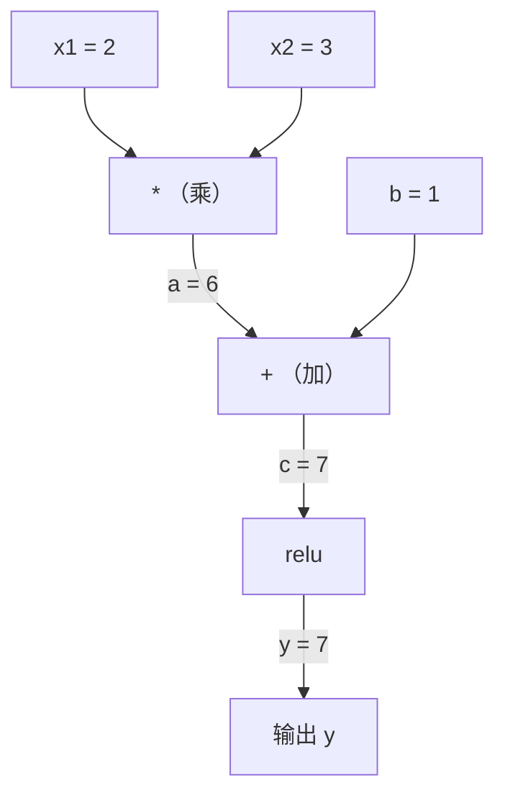
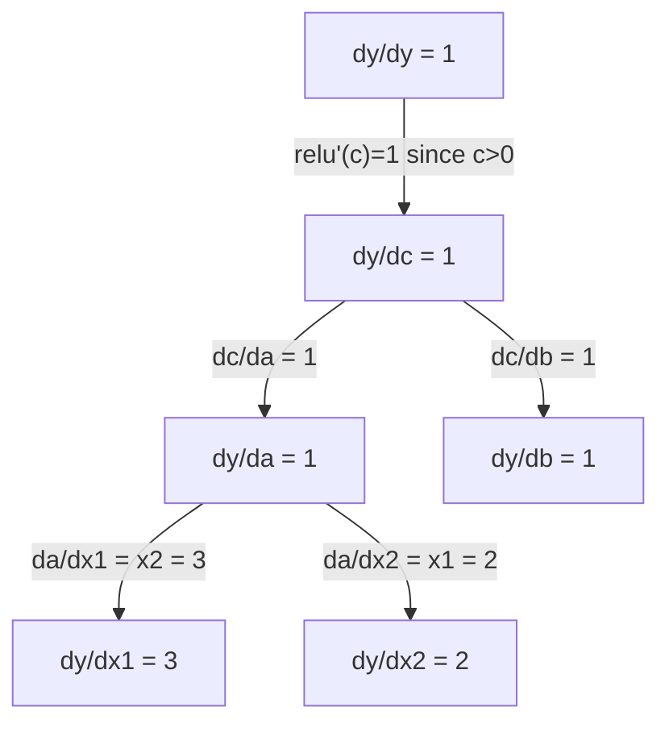

# 链式法则与自动微分（Chain Rule & Automatic Differentiation）

> 译注：本文译自同目录 [`en.md`](./en.md)。术语遵循仓根 [TRANSLATION_GUIDE.md](../../../../TRANSLATION_GUIDE.md)。

> 链式法则（chain rule）是每一个会学习的神经网络背后的引擎。

**Type:** Build
**Language:** Python
**Prerequisites:** Phase 1, Lesson 04 (Derivatives & Gradients)
**Time:** ~90 minutes

## 学习目标（Learning Objectives）

- 实现一个最小的 autograd 引擎（Value 类），能够记录运算并通过反向模式自动微分（reverse-mode autodiff）计算梯度
- 用拓扑排序在计算图（computational graph）上完成前向传播与反向传播
- 仅用从零实现的 autograd 引擎，搭建并训练一个多层感知机（MLP）解决 XOR 问题
- 用数值有限差分做梯度检查（gradient checking），验证 autodiff 的正确性

## 问题（Problem）

你已经会算简单函数的导数。可神经网络不是简单函数，它是几百个函数复合在一起：矩阵乘法、加偏置、过激活、再来一次矩阵乘法、softmax、cross-entropy 损失。输出是函数的函数的函数。

要训练这个网络，你需要损失对**每一个**权重的梯度（gradient）。手算？百万级参数根本不可能。数值方法（有限差分）？太慢了。

链式法则给你数学，自动微分（automatic differentiation）给你算法。两者结合，你就能在与一次前向传播相同的时间复杂度内，对任意函数复合精确地算出所有梯度。

PyTorch、TensorFlow、JAX 都是这么干的。下面你将从零搭一个迷你版。

## 概念（Concept）

### 链式法则（The Chain Rule）

如果 `y = f(g(x))`，那么 `y` 对 `x` 的导数是：

```
dy/dx = dy/dg * dg/dx = f'(g(x)) * g'(x)
```

把链上的导数依次相乘，每个环节贡献一份局部导数。

例：`y = sin(x^2)`

```
g(x) = x^2       g'(x) = 2x
f(g) = sin(g)     f'(g) = cos(g)

dy/dx = cos(x^2) * 2x
```

复合更深时，链就更长：

```
y = f(g(h(x)))

dy/dx = f'(g(h(x))) * g'(h(x)) * h'(x)
```

神经网络的每一层（layer）都是这条链上的一环。

### 计算图（Computational Graphs）

计算图把链式法则可视化。每个运算变成一个节点。数据沿图前向流动，梯度沿图反向流动。

**前向传播（计算值）：**



**反向传播（计算梯度）：**



反向传播在每个节点上应用链式法则，把梯度从输出一路推回输入。

### 前向模式 vs 反向模式（Forward Mode vs Reverse Mode）

在图上应用链式法则有两种走法。

**前向模式（forward mode）** 从输入出发，把导数往前推。先令 `dx/dx = 1`，沿着每个运算往后传。适合输入少、输出多的场景。

```
Forward mode: seed dx/dx = 1, propagate forward

  x = 2       (dx/dx = 1)
  a = x^2     (da/dx = 2x = 4)
  y = sin(a)  (dy/dx = cos(a) * da/dx = cos(4) * 4 = -2.615)
```

**反向模式（reverse mode）** 从输出出发，把梯度往回拉。先令 `dy/dy = 1`，逆着每个运算往前传。适合输入多、输出少的场景。

```
Reverse mode: seed dy/dy = 1, propagate backward

  y = sin(a)  (dy/dy = 1)
  a = x^2     (dy/da = cos(a) = cos(4) = -0.654)
  x = 2       (dy/dx = dy/da * da/dx = -0.654 * 4 = -2.615)
```

神经网络有几百万个输入（权重），却只有一个输出（损失）。反向模式一次反向传播就能把所有梯度算完——这正是 backprop（反向传播）使用反向模式的原因。

| 模式 | 种子值 | 方向 | 适用场景 |
|------|------|-----------|-----------|
| Forward | `dx_i/dx_i = 1` | 输入到输出 | 输入少、输出多 |
| Reverse | `dy/dy = 1` | 输出到输入 | 输入多、输出少（神经网络） |

### 用 Dual Numbers 实现前向模式（Dual Numbers for Forward Mode）

前向模式可以用 dual number（对偶数）非常优雅地实现。一个 dual number 形如 `a + b*epsilon`，其中 `epsilon^2 = 0`。

```
Dual number: (value, derivative)

(2, 1) means: value is 2, derivative w.r.t. x is 1

Arithmetic rules:
  (a, a') + (b, b') = (a+b, a'+b')
  (a, a') * (b, b') = (a*b, a'*b + a*b')
  sin(a, a')         = (sin(a), cos(a)*a')
```

把输入变量的导数初始化为 1，导数就会自动顺着每一次运算传下去。

### 搭一个 Autograd 引擎（Building an Autograd Engine）

一个 autograd 引擎只需要三件东西：

1. **Value 包装。** 把每一个数都包进一个对象，里面存值和梯度。
2. **图记录。** 每次运算都记录它的输入和局部梯度函数。
3. **反向传播。** 对图做拓扑排序，再倒着走一遍，每个节点上应用链式法则。

PyTorch 的 `autograd` 干的就是这件事。`torch.Tensor` 类负责包装值，在 `requires_grad=True` 时记录运算，调用 `.backward()` 时计算梯度。

### PyTorch Autograd 底层是怎么工作的（How PyTorch Autograd Works Under the Hood）

当你写出这样的 PyTorch 代码：

```python
x = torch.tensor(2.0, requires_grad=True)
y = x ** 2 + 3 * x + 1
y.backward()
print(x.grad)  # 7.0 = 2*x + 3 = 2*2 + 3
```

PyTorch 内部会：

1. 为 `x` 创建一个 `Tensor` 节点，标记 `requires_grad=True`
2. 每次运算（`**`、`*`、`+`）都会新建一个节点并记录对应的 backward 函数
3. `y.backward()` 触发 reverse-mode autodiff，沿记录下来的图反向走
4. 每个节点的 `grad_fn` 计算局部梯度，传给父节点
5. 梯度通过加法累加（不是覆盖）到 `.grad` 属性上

PyTorch 的图是动态的（define-by-run），每次前向传播都会重新构建。这也是它为什么能支持模型里写 if/else、循环这种控制流。

## 动手实现（Build It）

### Step 1：Value 类

```python
class Value:
    def __init__(self, data, children=(), op=''):
        self.data = data
        self.grad = 0.0
        self._backward = lambda: None
        self._prev = set(children)
        self._op = op

    def __repr__(self):
        return f"Value(data={self.data:.4f}, grad={self.grad:.4f})"
```

每个 `Value` 都存了：数值、梯度（初始为 0）、一个 backward 函数、以及指向产生它的子节点的指针。

### Step 2：带梯度跟踪的算术运算

```python
    def __add__(self, other):
        other = other if isinstance(other, Value) else Value(other)
        out = Value(self.data + other.data, (self, other), '+')
        def _backward():
            self.grad += out.grad
            other.grad += out.grad
        out._backward = _backward
        return out

    def __mul__(self, other):
        other = other if isinstance(other, Value) else Value(other)
        out = Value(self.data * other.data, (self, other), '*')
        def _backward():
            self.grad += other.data * out.grad
            other.grad += self.data * out.grad
        out._backward = _backward
        return out

    def relu(self):
        out = Value(max(0, self.data), (self,), 'relu')
        def _backward():
            self.grad += (1.0 if out.data > 0 else 0.0) * out.grad
        out._backward = _backward
        return out
```

每次运算都创建一个闭包，闭包知道怎么计算局部梯度，并和上游梯度（`out.grad`）相乘。`+=` 处理的是同一个 value 被多个运算用到的情形。

### Step 3：反向传播

```python
    def backward(self):
        topo = []
        visited = set()
        def build_topo(v):
            if v not in visited:
                visited.add(v)
                for child in v._prev:
                    build_topo(child)
                topo.append(v)
        build_topo(self)

        self.grad = 1.0
        for v in reversed(topo):
            v._backward()
```

拓扑排序保证每个节点的梯度在传给子节点之前已经全部累加完成。种子梯度是 1.0（dy/dy = 1）。

### Step 4：补齐运算，凑成完整引擎

基础 Value 类只实现了加、乘、relu。真正的 autograd 引擎需要更多运算。下面是搭神经网络要用到的运算：

```python
    def __neg__(self):
        return self * -1

    def __sub__(self, other):
        return self + (-other)

    def __radd__(self, other):
        return self + other

    def __rmul__(self, other):
        return self * other

    def __rsub__(self, other):
        return other + (-self)

    def __pow__(self, n):
        out = Value(self.data ** n, (self,), f'**{n}')
        def _backward():
            self.grad += n * (self.data ** (n - 1)) * out.grad
        out._backward = _backward
        return out

    def __truediv__(self, other):
        return self * (other ** -1) if isinstance(other, Value) else self * (Value(other) ** -1)

    def exp(self):
        import math
        e = math.exp(self.data)
        out = Value(e, (self,), 'exp')
        def _backward():
            self.grad += e * out.grad
        out._backward = _backward
        return out

    def log(self):
        import math
        out = Value(math.log(self.data), (self,), 'log')
        def _backward():
            self.grad += (1.0 / self.data) * out.grad
        out._backward = _backward
        return out

    def tanh(self):
        import math
        t = math.tanh(self.data)
        out = Value(t, (self,), 'tanh')
        def _backward():
            self.grad += (1 - t ** 2) * out.grad
        out._backward = _backward
        return out
```

**每个运算的用途：**

| 运算 | 反向规则 | 用在哪 |
|-----------|--------------|---------|
| `__sub__` | 复用 add + neg | 损失计算（pred - target） |
| `__pow__` | n * x^(n-1) | 多项式激活、MSE（error^2） |
| `__truediv__` | 复用 mul + pow(-1) | 归一化、学习率（learning rate）缩放 |
| `exp` | exp(x) * 上游梯度 | softmax、log-likelihood |
| `log` | (1/x) * 上游梯度 | cross-entropy 损失、对数概率 |
| `tanh` | (1 - tanh^2) * 上游梯度 | 经典激活函数 |

聪明之处在于：`__sub__` 和 `__truediv__` 都是用已有运算定义的。它们的梯度自动正确——因为底下的 add / mul / pow 已经把链式法则组合好了。

### Step 5：从零搭一个 Mini MLP

有了完整的 Value 类，就能搭神经网络了。不靠 PyTorch，不靠 NumPy，只靠 Value 和链式法则。

```python
import random

class Neuron:
    def __init__(self, n_inputs):
        self.w = [Value(random.uniform(-1, 1)) for _ in range(n_inputs)]
        self.b = Value(0.0)

    def __call__(self, x):
        act = sum((wi * xi for wi, xi in zip(self.w, x)), self.b)
        return act.tanh()

    def parameters(self):
        return self.w + [self.b]

class Layer:
    def __init__(self, n_inputs, n_outputs):
        self.neurons = [Neuron(n_inputs) for _ in range(n_outputs)]

    def __call__(self, x):
        return [n(x) for n in self.neurons]

    def parameters(self):
        return [p for n in self.neurons for p in n.parameters()]

class MLP:
    def __init__(self, sizes):
        self.layers = [Layer(sizes[i], sizes[i+1]) for i in range(len(sizes)-1)]

    def __call__(self, x):
        for layer in self.layers:
            x = layer(x)
        return x[0] if len(x) == 1 else x

    def parameters(self):
        return [p for layer in self.layers for p in layer.parameters()]
```

一个 `Neuron` 计算 `tanh(w1*x1 + w2*x2 + ... + b)`。一个 `Layer` 是一组神经元（neuron）。一个 `MLP` 把 layer 叠起来。每个权重都是 `Value`，所以调用 `loss.backward()` 就能把梯度传到每个参数上。

**训练 XOR：**

```python
random.seed(42)
model = MLP([2, 4, 1])  # 2 inputs, 4 hidden neurons, 1 output

xs = [[0, 0], [0, 1], [1, 0], [1, 1]]
ys = [-1, 1, 1, -1]  # XOR pattern (using -1/1 for tanh)

for step in range(100):
    preds = [model(x) for x in xs]
    loss = sum((p - y) ** 2 for p, y in zip(preds, ys))

    for p in model.parameters():
        p.grad = 0.0
    loss.backward()

    lr = 0.05
    for p in model.parameters():
        p.data -= lr * p.grad

    if step % 20 == 0:
        print(f"step {step:3d}  loss = {loss.data:.4f}")

print("\nPredictions after training:")
for x, y in zip(xs, ys):
    print(f"  input={x}  target={y:2d}  pred={model(x).data:6.3f}")
```

这就是 micrograd——纯 Python 写的、带 autodiff 的完整神经网络训练循环。所有商业级深度学习框架做的也是这件事，只不过规模大得多。

### Step 6：梯度检查（Gradient Checking）

怎么知道你的 autodiff 算对了？拿数值导数对比一下。这就是梯度检查。

```python
def gradient_check(build_expr, x_val, h=1e-7):
    x = Value(x_val)
    y = build_expr(x)
    y.backward()
    autodiff_grad = x.grad

    y_plus = build_expr(Value(x_val + h)).data
    y_minus = build_expr(Value(x_val - h)).data
    numerical_grad = (y_plus - y_minus) / (2 * h)

    diff = abs(autodiff_grad - numerical_grad)
    return autodiff_grad, numerical_grad, diff
```

拿一个复杂表达式试试：

```python
def expr(x):
    return (x ** 3 + x * 2 + 1).tanh()

ad, num, diff = gradient_check(expr, 0.5)
print(f"Autodiff:  {ad:.8f}")
print(f"Numerical: {num:.8f}")
print(f"Difference: {diff:.2e}")
# Difference should be < 1e-5
```

实现新运算时，梯度检查必不可少。如果你的 backward 有 bug，数值检查会把它揪出来。每一个严肃的深度学习实现，开发期都会跑梯度检查。

**什么时候该做梯度检查：**

| 场景 | 要不要做？ |
|-----------|-------------------|
| 给 autograd 加新运算 | 必须做 |
| 训练循环不收敛，调试中 | 先查梯度 |
| 生产环境训练 | 不做（每个参数 2 次前向，太慢） |
| autograd 代码的单元测试 | 做，自动化跑 |

### Step 7：和手算结果对一下

```python
x1 = Value(2.0)
x2 = Value(3.0)
a = x1 * x2          # a = 6.0
b = a + Value(1.0)    # b = 7.0
y = b.relu()          # y = 7.0

y.backward()

print(f"y = {y.data}")          # 7.0
print(f"dy/dx1 = {x1.grad}")   # 3.0 (= x2)
print(f"dy/dx2 = {x2.grad}")   # 2.0 (= x1)
```

手算验证：`y = relu(x1*x2 + 1)`。因为 `x1*x2 + 1 = 7 > 0`，relu 在这里就是恒等。
`dy/dx1 = x2 = 3`，`dy/dx2 = x1 = 2`。引擎结果一致。

## 用起来（Use It）

### 与 PyTorch 对照

```python
import torch

x1 = torch.tensor(2.0, requires_grad=True)
x2 = torch.tensor(3.0, requires_grad=True)
a = x1 * x2
b = a + 1.0
y = torch.relu(b)
y.backward()

print(f"PyTorch dy/dx1 = {x1.grad.item()}")  # 3.0
print(f"PyTorch dy/dx2 = {x2.grad.item()}")  # 2.0
```

梯度完全相同。你的引擎和 PyTorch 算出来一样，因为底层数学一样：通过链式法则做 reverse-mode autodiff。

### 一个更复杂的表达式

```python
a = Value(2.0)
b = Value(-3.0)
c = Value(10.0)
f = (a * b + c).relu()  # relu(2*(-3) + 10) = relu(4) = 4

f.backward()
print(f"df/da = {a.grad}")  # -3.0 (= b)
print(f"df/db = {b.grad}")  #  2.0 (= a)
print(f"df/dc = {c.grad}")  #  1.0
```

## 上线部署（Ship It）

本课的产物：
- `outputs/skill-autodiff.md` —— 一份关于「构建与调试 autograd 系统」的 skill
- `code/autodiff.py` —— 一个可扩展的最小 autograd 引擎

这里搭出来的 Value 类，就是 Phase 3 神经网络训练循环的地基。

## 练习（Exercises）

1. 给 Value 类加上 `__pow__`，使其可以计算 `x ** n`。验证 `d/dx(x^3)` 在 `x=2` 处等于 `12.0`。

2. 加上 `tanh` 作为激活函数。验证 `tanh'(0) = 1`、`tanh'(2) ≈ 0.0707`。

3. 为单个神经元搭一个计算图：`y = relu(w1*x1 + w2*x2 + b)`。算出全部 5 个梯度，并和 PyTorch 对照。

4. 用 dual number 实现前向模式 autodiff。写一个 `Dual` 类，验证它给出的导数和你的反向模式引擎一致。

## 关键术语（Key Terms）

| 术语 | 大家口头怎么说 | 实际含义 |
|------|----------------|----------------------|
| Chain rule（链式法则） | "把导数乘起来" | 复合函数的导数等于每一层局部导数（在正确点上求值）的连乘 |
| Computational graph（计算图） | "网络结构图" | 一个有向无环图（DAG），节点是运算，边在前向时携带值、反向时携带梯度 |
| Forward mode（前向模式） | "把导数往前推" | 从输入向输出传播导数的 autodiff，每个输入变量需要一遍 |
| Reverse mode（反向模式） | "反向传播 / backprop" | 从输出向输入传播梯度的 autodiff，每个输出变量需要一遍 |
| Autograd | "自动梯度" | 记录值上的运算、构建图、并通过链式法则计算精确梯度的系统 |
| Dual numbers（对偶数） | "值 + 导数" | 形如 a + b*epsilon（epsilon^2 = 0）的数，让导数信息随算术运算自动传递 |
| Topological sort（拓扑排序） | "依赖顺序" | 按依赖关系给图节点排序，使每个节点排在它所有依赖之后；保证梯度传播正确 |
| Gradient accumulation（梯度累加） | "加，不是覆盖" | 当一个值被多个运算使用时，它的梯度等于所有上游梯度贡献之和 |
| Dynamic graph（动态图） | "define-by-run" | 每次前向传播都重新构建的计算图，使模型内部能写 Python 控制流（PyTorch 风格） |
| Gradient checking（梯度检查） | "数值校验" | 把 autodiff 梯度和有限差分数值梯度作对比，验证正确性。调试必备。 |
| MLP（多层感知机） | "Multi-layer perceptron" | 至少有一个隐藏层的神经网络。每个 neuron 算一个加权和加偏置，再过激活函数。 |
| Neuron（神经元） | "加权和 + 激活" | 基本单元：output = activation(w1*x1 + w2*x2 + ... + b)。权重和偏置都是可学习参数。 |

## 延伸阅读（Further Reading）

- [3Blue1Brown: Backpropagation calculus](https://www.youtube.com/watch?v=tIeHLnjs5U8) —— 用可视化讲清楚神经网络里的链式法则
- [PyTorch Autograd mechanics](https://pytorch.org/docs/stable/notes/autograd.html) —— 真实系统是怎么跑的
- [Baydin et al., Automatic Differentiation in Machine Learning: a Survey](https://arxiv.org/abs/1502.05767) —— 全面的综述参考
